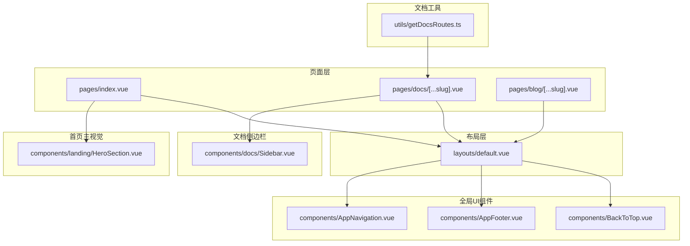
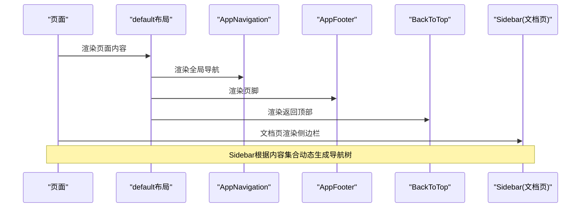
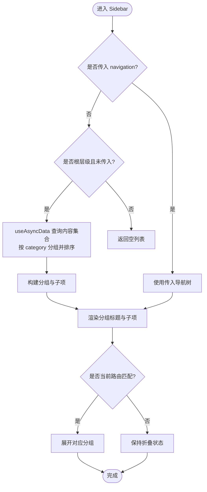
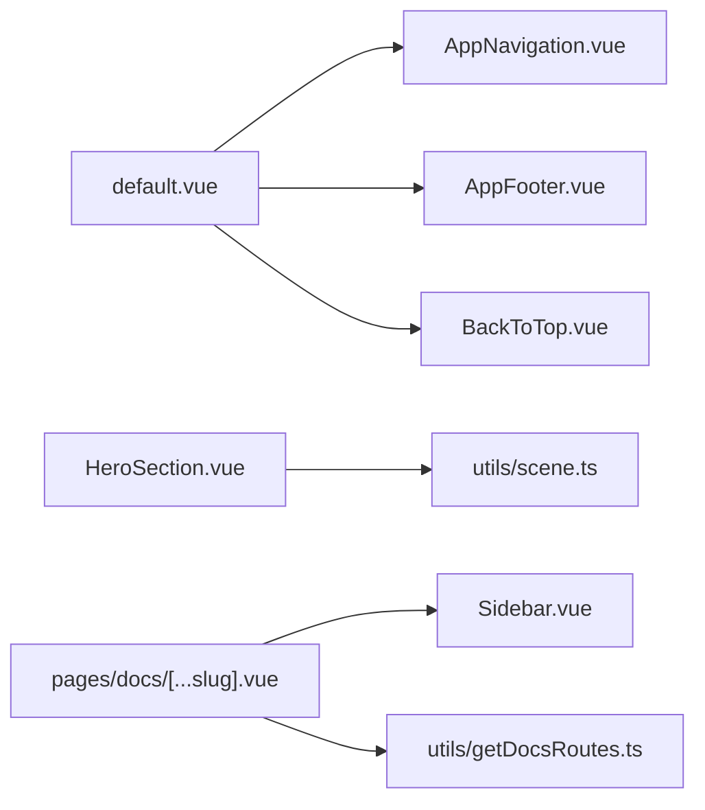

# UI组件架构

<cite>
**本文引用的文件**
- [components/AppNavigation.vue](file://components/AppNavigation.vue)
- [components/AppFooter.vue](file://components/AppFooter.vue)
- [components/landing/HeroSection.vue](file://components/landing/HeroSection.vue)
- [components/docs/Sidebar.vue](file://components/docs/Sidebar.vue)
- [layouts/default.vue](file://layouts/default.vue)
- [components/BackToTop.vue](file://components/BackToTop.vue)
- [utils/getDocsRoutes.ts](file://utils/getDocsRoutes.ts)
- [pages/index.vue](file://pages/index.vue)
- [pages/docs/[...slug].vue](file://pages/docs/[...slug].vue)
- [pages/blog/[...slug].vue](file://pages/blog/[...slug].vue)
- [utils/scene.ts](file://utils/scene.ts)
</cite>

## 目录
1. [简介](#简介)
2. [项目结构](#项目结构)
3. [核心组件](#核心组件)
4. [架构总览](#架构总览)
5. [组件详解](#组件详解)
6. [依赖关系分析](#依赖关系分析)
7. [性能考量](#性能考量)
8. [故障排查指南](#故障排查指南)
9. [结论](#结论)
10. [附录](#附录)

## 简介
本文件系统性梳理项目中的关键UI组件，围绕响应式导航、页脚布局、首页主视觉、文档侧边栏、布局插槽机制与返回顶部组件进行深入分析。重点说明各组件的接口定义（props、events、slots）、交互逻辑、数据流与可复用性，并结合页面使用示例帮助读者在不同页面中正确复用这些组件。

## 项目结构
项目采用Nuxt.js架构，UI组件集中在components目录，页面位于pages目录，布局位于layouts目录，文档路由生成工具位于utils目录。default布局通过插槽包裹所有页面，AppNavigation、AppFooter、BackToTop贯穿全局；文档侧边栏在docs页面中动态生成导航树。

**图表来源**
- [layouts/default.vue](file://layouts/default.vue#L1-L25)
- [components/AppNavigation.vue](file://components/AppNavigation.vue#L1-L138)
- [components/AppFooter.vue](file://components/AppFooter.vue#L1-L126)
- [components/BackToTop.vue](file://components/BackToTop.vue#L1-L206)
- [pages/index.vue](file://pages/index.vue#L1-L28)
- [pages/docs/[...slug].vue](file://pages/docs/[...slug].vue#L1-L164)
- [utils/getDocsRoutes.ts](file://utils/getDocsRoutes.ts#L1-L58)
- [components/docs/Sidebar.vue](file://components/docs/Sidebar.vue#L1-L106)
- [components/landing/HeroSection.vue](file://components/landing/HeroSection.vue#L1-L190)

**章节来源**
- [layouts/default.vue](file://layouts/default.vue#L1-L25)
- [pages/index.vue](file://pages/index.vue#L1-L28)
- [pages/docs/[...slug].vue](file://pages/docs/[...slug].vue#L1-L164)
- [pages/blog/[...slug].vue](file://pages/blog/[...slug].vue#L1-L203)

## 核心组件
- AppNavigation：响应式导航栏，支持桌面端水平菜单与移动端汉堡菜单，具备滚动透明/实体状态切换、路由切换自动关闭菜单、移动端滚动锁定等功能。
- AppFooter：多列布局的页脚，移动端支持分组折叠，内置“关注我们”自定义内容渲染。
- HeroSection：首页主视觉区域，包含打字机动画、背景装饰、左右布局、桌面/移动端跑马灯展示，支持插槽扩展标题、描述与链接。
- Sidebar：文档侧边栏，支持递归渲染、分组折叠、自动高亮当前路由、从内容集合动态聚合导航树。
- default布局：通过插槽包裹所有页面，统一承载全局UI组件。
- BackToTop：固定悬浮工具，包含返回顶部、在线咨询二维码、售后/活动二级按钮与点击弹窗二维码。

**章节来源**
- [components/AppNavigation.vue](file://components/AppNavigation.vue#L1-L138)
- [components/AppFooter.vue](file://components/AppFooter.vue#L1-L126)
- [components/landing/HeroSection.vue](file://components/landing/HeroSection.vue#L1-L190)
- [components/docs/Sidebar.vue](file://components/docs/Sidebar.vue#L1-L106)
- [layouts/default.vue](file://layouts/default.vue#L1-L25)
- [components/BackToTop.vue](file://components/BackToTop.vue#L1-L206)

## 架构总览
整体架构遵循“布局-组件-页面”的分层设计。default布局作为容器，注入全局导航、页脚与返回顶部；页面根据业务选择性引入特定组件（如首页引入HeroSection，文档页引入Sidebar）。文档侧边栏通过内容集合自动聚合导航树，减少手写维护成本。

**图表来源**
- [layouts/default.vue](file://layouts/default.vue#L1-L25)
- [components/AppNavigation.vue](file://components/AppNavigation.vue#L1-L138)
- [components/AppFooter.vue](file://components/AppFooter.vue#L1-L126)
- [components/BackToTop.vue](file://components/BackToTop.vue#L1-L206)
- [components/docs/Sidebar.vue](file://components/docs/Sidebar.vue#L1-L106)
- [pages/docs/[...slug].vue](file://pages/docs/[...slug].vue#L1-L164)

## 组件详解

### AppNavigation 响应式导航栏
- 设计要点
  - 桌面端：水平导航菜单，支持高亮与子菜单描述。
  - 移动端：汉堡菜单，带过渡动画，点击外部关闭，滚动时锁定body防止穿透滚动。
  - 透明/实体状态：根据滚动位置与路由条件切换背景与文字颜色。
- 交互逻辑
  - 滚动监听使用requestAnimationFrame节流，避免频繁重绘。
  - 路由变化时自动关闭移动端菜单。
  - 移动端菜单项支持垂直布局与较大的点击区域。
- 可复用性
  - 通过props与computed UI配置，可在不同页面灵活适配主题色与透明度。
  - 无障碍：为汉堡按钮提供aria-label与aria-expanded。
- 接口定义
  - props：无
  - events：无
  - slots：无
  - 外部依赖：Nuxt UI组件（UNavigationMenu、UButton）、Heroicons图标库、NuxtLink路由组件。
- 页面使用示例
  - default布局直接包含该组件，所有页面共享导航。
  - 首页与文档页均可复用，无需额外配置。

**章节来源**
- [components/AppNavigation.vue](file://components/AppNavigation.vue#L1-L138)
- [layouts/default.vue](file://layouts/default.vue#L1-L25)

### AppFooter 页脚布局与信息组织
- 设计要点
  - 2列到7列栅格布局，移动端折叠为单列。
  - 分组标题支持移动端点击折叠，使用CSS过渡控制高度。
  - “关注我们”分组支持自定义渲染（QQ、微信、二维码等）。
- 交互逻辑
  - 移动端仅在点击分组标题时展开/收起。
  - 桌面端禁用折叠逻辑，保持始终展开。
- 可复用性
  - 通过footerLinks配置即可扩展分组与链接，适合多语言站点维护。
- 接口定义
  - props：无
  - events：无
  - slots：无
- 页面使用示例
  - default布局直接包含该组件，所有页面共享页脚。

**章节来源**
- [components/AppFooter.vue](file://components/AppFooter.vue#L1-L126)
- [layouts/default.vue](file://layouts/default.vue#L1-L25)

### HeroSection 首页主视觉区域
- 设计原则
  - 左右分栏，左侧强调标题、描述与行动按钮，右侧展示跑马灯。
  - 背景装饰：聚焦光束、科技网格、抽象几何，营造科技感。
  - 插槽扩展：title、description、links三个具名插槽，便于定制。
- 动画效果
  - 打字机动画：多句轮播，删除与暂停节奏控制。
  - 跑马灯：桌面双列垂直滚动，移动端单列水平滚动；根据设备宽度动态切换。
  - 自定义动画：浮动与闪烁等关键帧。
- 数据与算法
  - 从utils/scene.ts读取应用列表，随机打乱后按设备选择数量，均分两列。
  - 响应式检测：窗口尺寸变化时更新状态，驱动跑马灯与布局切换。
- 接口定义
  - props
    - orientation: 'horizontal' | 'vertical'
    - ui: 对象，包含container、title、description、links、content、imageSection等样式键
  - events：无
  - slots：title、description、links
- 页面使用示例
  - pages/index.vue直接渲染HeroSection，配合landing系列组件形成完整首页。

**章节来源**
- [components/landing/HeroSection.vue](file://components/landing/HeroSection.vue#L1-L190)
- [utils/scene.ts](file://utils/scene.ts#L1-L122)
- [pages/index.vue](file://pages/index.vue#L1-L28)

### Sidebar 文档侧边栏导航
- 动态路由生成与导航逻辑
  - 通过utils/getDocsRoutes.ts扫描content/docs目录，生成静态预渲染路由列表，确保文档页面可被Nitro预渲染。
  - 文档页pages/docs/[...slug].vue内部不再依赖外部导航数据，Sidebar在根层级且未传入navigation时，自动从内容集合查询并按category分组生成导航树。
- 递归渲染与分组折叠
  - 顶层分组标题支持点击折叠/展开，使用useState持久化折叠状态。
  - 子级递归渲染，支持嵌套分组与叶子节点链接。
  - 自动高亮当前激活路由，若当前路由属于某分组，则展开该分组。
- 可复用性
  - 通过navigation prop可注入自定义导航树，或完全交由Sidebar自动聚合。
  - 无障碍：为按钮与链接添加aria-current与aria-expanded。
- 接口定义
  - props
    - navigation: 数组（可选），导航项结构包含title、path、icon、children等
    - level: number（可选），当前嵌套层级
  - events：无
  - slots：无
- 页面使用示例
  - pages/docs/[...slug].vue在左侧区域渲染DocsSidebar，实现文档导航与面包屑、目录联动。

**图表来源**
- [components/docs/Sidebar.vue](file://components/docs/Sidebar.vue#L1-L106)
- [components/docs/Sidebar.vue](file://components/docs/Sidebar.vue#L108-L290)
- [utils/getDocsRoutes.ts](file://utils/getDocsRoutes.ts#L1-L58)
- [pages/docs/[...slug].vue](file://pages/docs/[...slug].vue#L1-L164)

**章节来源**
- [components/docs/Sidebar.vue](file://components/docs/Sidebar.vue#L1-L106)
- [components/docs/Sidebar.vue](file://components/docs/Sidebar.vue#L108-L290)
- [utils/getDocsRoutes.ts](file://utils/getDocsRoutes.ts#L1-L58)
- [pages/docs/[...slug].vue](file://pages/docs/[...slug].vue#L1-L164)

### default 布局插槽机制
- 设计要点
  - 通过<slot/>包裹页面内容，统一承载AppBanner、AppNavigation、AppFooter与BackToTop。
  - 适用于所有页面，保证全局一致的导航与页脚体验。
- 可复用性
  - 任何页面只需在definePageMeta中声明layout: 'default'即可复用全局UI。
- 页面使用示例
  - pages/index.vue、pages/blog/[...slug].vue、pages/docs/[...slug].vue均使用default布局。

**章节来源**
- [layouts/default.vue](file://layouts/default.vue#L1-L25)
- [pages/index.vue](file://pages/index.vue#L1-L28)
- [pages/blog/[...slug].vue](file://pages/blog/[...slug].vue#L1-L203)
- [pages/docs/[...slug].vue](file://pages/docs/[...slug].vue#L1-L164)

### BackToTop 滚动监听与动画实现
- 交互逻辑
  - 滚动超过阈值显示悬浮按钮组，包含返回顶部、在线咨询二维码、售后/活动按钮。
  - 在线咨询支持悬停显示二维码弹窗，点击按钮可弹出点击二维码模态框。
  - 监听自定义事件showQRCodeModal以触发二维码弹窗。
- 动画与过渡
  - 使用Vue Transition对按钮组与弹窗进行入场/出场动画，采用渐隐渐显与缩放组合。
- 可复用性
  - 作为全局组件，所有页面均可复用，无需额外配置。
- 接口定义
  - props：无
  - events：无
  - slots：无
- 页面使用示例
  - default布局直接包含该组件，所有页面共享返回顶部与客服入口。

**章节来源**
- [components/BackToTop.vue](file://components/BackToTop.vue#L1-L206)
- [layouts/default.vue](file://layouts/default.vue#L1-L25)

## 依赖关系分析
- 组件间耦合
  - default布局与全局UI组件强耦合，保证一致的导航与页脚体验。
  - Sidebar与内容集合存在运行时依赖，根层级自动聚合导航树，减少手写维护。
  - HeroSection依赖utils/scene.ts提供的应用数据，用于跑马灯图片展示。
- 外部依赖
  - HeroSection依赖Nuxt UI组件（UMarquee、UButton、UIcon等）与Heroicons图标库。
  - AppNavigation依赖Nuxt UI组件（UNavigationMenu、UButton）与NuxtLink路由组件。
  - BackToTop依赖Lucide图标库与浏览器滚动API。
- 潜在循环依赖
  - 未发现组件间的循环依赖；Sidebar与内容集合的交互为单向数据流。

**图表来源**
- [layouts/default.vue](file://layouts/default.vue#L1-L25)
- [components/AppNavigation.vue](file://components/AppNavigation.vue#L1-L138)
- [components/AppFooter.vue](file://components/AppFooter.vue#L1-L126)
- [components/BackToTop.vue](file://components/BackToTop.vue#L1-L206)
- [components/landing/HeroSection.vue](file://components/landing/HeroSection.vue#L1-L190)
- [utils/scene.ts](file://utils/scene.ts#L1-L122)
- [pages/docs/[...slug].vue](file://pages/docs/[...slug].vue#L1-L164)
- [utils/getDocsRoutes.ts](file://utils/getDocsRoutes.ts#L1-L58)

**章节来源**
- [components/landing/HeroSection.vue](file://components/landing/HeroSection.vue#L1-L190)
- [utils/scene.ts](file://utils/scene.ts#L1-L122)
- [pages/docs/[...slug].vue](file://pages/docs/[...slug].vue#L1-L164)
- [utils/getDocsRoutes.ts](file://utils/getDocsRoutes.ts#L1-L58)

## 性能考量
- 滚动优化
  - AppNavigation使用requestAnimationFrame节流滚动回调，避免高频重绘。
  - BackToTop仅在滚动超过阈值时显示，减少DOM节点数量。
- 动画与过渡
  - HeroSection的关键帧动画与Transition组合在现代浏览器上表现良好，建议避免在低端设备上启用过多复杂动画。
- 数据获取
  - Sidebar使用useAsyncData异步获取内容集合，避免阻塞客户端导航；根层级才执行查询，减少不必要的网络请求。
- 路由预渲染
  - getDocsRoutes.ts生成静态路由，提升文档页面首屏性能与SEO友好度。

[本节为通用指导，无需具体文件引用]

## 故障排查指南
- 导航菜单无法关闭
  - 确认路由watch是否生效，以及移动端菜单状态是否被正确重置。
  - 检查移动端滚动锁定逻辑是否在打开/关闭时正确恢复。
- 侧边栏未显示分组
  - 确认content/docs目录结构与front-matter字段（title、path、category、order、navigation）是否正确。
  - 若传入navigation，请确认数据结构与children字段是否完整。
- HeroSection跑马灯异常
  - 检查utils/scene.ts中的图片路径是否正确，移动端/桌面端图片数量与布局是否匹配。
  - 确认响应式检测逻辑在resize事件后是否更新。
- 返回顶部无效
  - 检查滚动阈值与事件绑定是否正常，确认smooth scroll行为在目标浏览器上可用。
- 文档页面404
  - 确认getDocsRoutes.ts生成的路由是否包含目标路径，或pages/docs/[...slug].vue的路径清洗逻辑是否与文件系统命名一致。

**章节来源**
- [components/AppNavigation.vue](file://components/AppNavigation.vue#L286-L309)
- [components/docs/Sidebar.vue](file://components/docs/Sidebar.vue#L158-L290)
- [components/landing/HeroSection.vue](file://components/landing/HeroSection.vue#L330-L355)
- [components/BackToTop.vue](file://components/BackToTop.vue#L225-L275)
- [utils/getDocsRoutes.ts](file://utils/getDocsRoutes.ts#L1-L58)
- [pages/docs/[...slug].vue](file://pages/docs/[...slug].vue#L181-L226)

## 结论
本UI组件架构以default布局为核心容器，通过AppNavigation、AppFooter、BackToTop提供一致的全局体验；HeroSection负责首页主视觉，Sidebar实现文档导航的自动化与可维护性。组件普遍采用响应式设计、无障碍支持与性能优化策略，适合在多页面场景中复用。建议在新增页面时统一使用default布局，并根据业务选择性引入HeroSection或Sidebar，以保持设计一致性与开发效率。

[本节为总结性内容，无需具体文件引用]

## 附录

### 组件接口速查（props/events/slots）

- AppNavigation
  - props：无
  - events：无
  - slots：无
  - 外部依赖：Nuxt UI、Heroicons、NuxtLink

- AppFooter
  - props：无
  - events：无
  - slots：无
  - 外部依赖：NuxtLink

- HeroSection
  - props
    - orientation: 'horizontal' | 'vertical'
    - ui: { container, title, description, links, content, imageSection }
  - events：无
  - slots：title、description、links
  - 外部依赖：Nuxt UI（UMarquee、UButton、UIcon）、utils/scene.ts

- Sidebar
  - props
    - navigation?: NavigationItem[]
    - level?: number
  - events：无
  - slots：无
  - 外部依赖：Nuxt UI、Nuxt Content API

- default布局
  - props：无
  - events：无
  - slots：<slot/>
  - 外部依赖：全局UI组件

- BackToTop
  - props：无
  - events：无
  - slots：无
  - 外部依赖：Lucide Icons、浏览器滚动API

**章节来源**
- [components/AppNavigation.vue](file://components/AppNavigation.vue#L1-L138)
- [components/AppFooter.vue](file://components/AppFooter.vue#L1-L126)
- [components/landing/HeroSection.vue](file://components/landing/HeroSection.vue#L202-L250)
- [components/docs/Sidebar.vue](file://components/docs/Sidebar.vue#L137-L154)
- [layouts/default.vue](file://layouts/default.vue#L1-L25)
- [components/BackToTop.vue](file://components/BackToTop.vue#L1-L206)