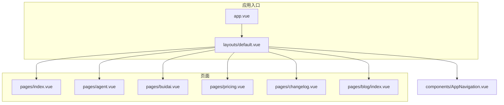
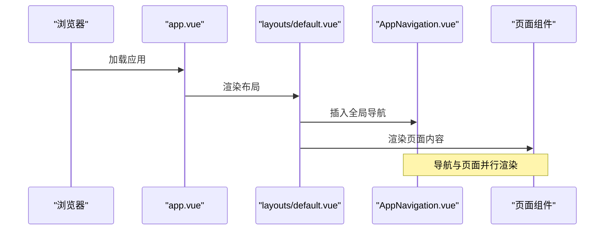
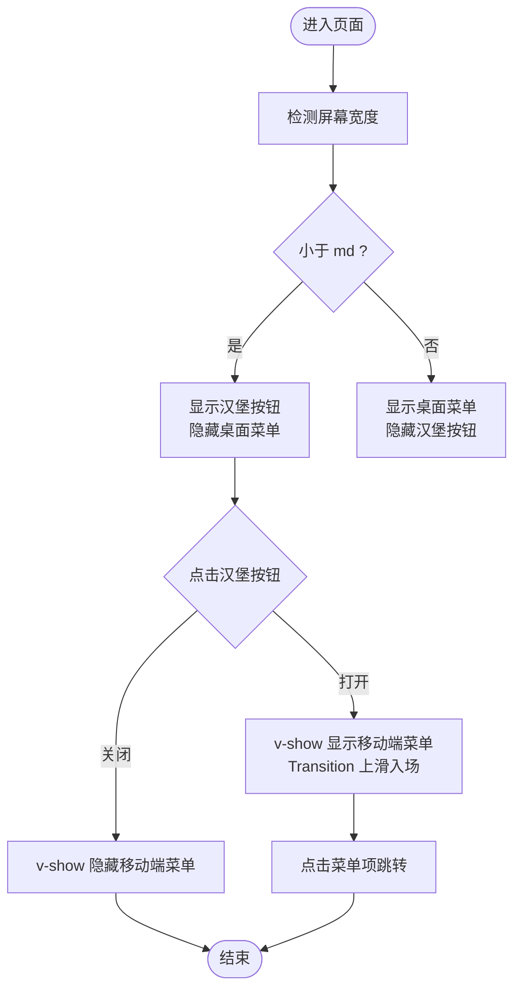
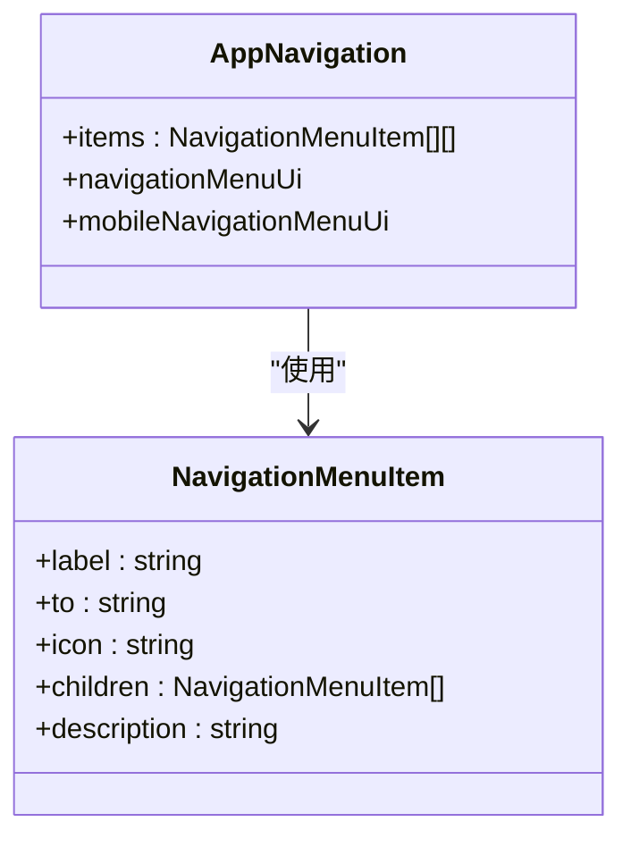
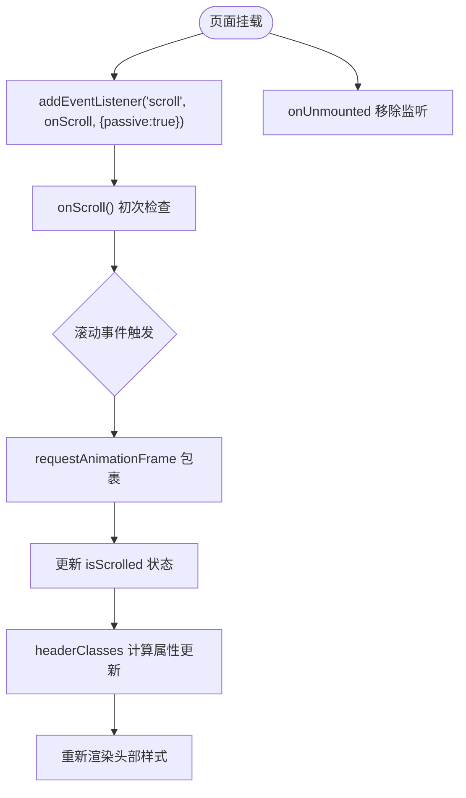
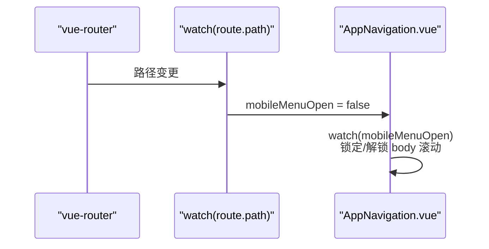
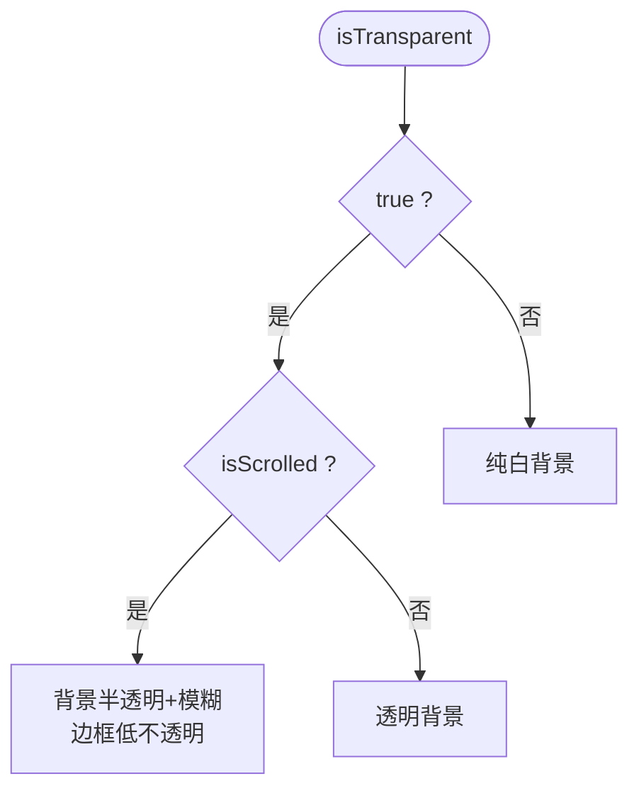
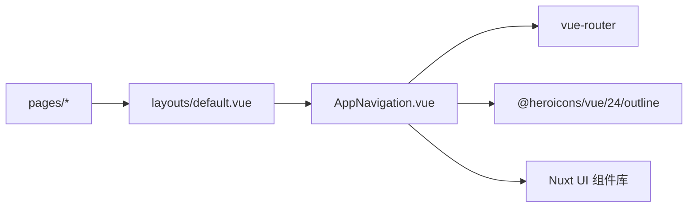

# 导航系统

<cite>
**本文引用的文件**
- [AppNavigation.vue](file://components/AppNavigation.vue)
- [default.vue](file://layouts/default.vue)
- [app.vue](file://app.vue)
- [index.vue](file://pages/index.vue)
- [agent.vue](file://pages/agent.vue)
- [buidai.vue](file://pages/buidai.vue)
- [pricing.vue](file://pages/pricing.vue)
- [changelog.vue](file://pages/changelog.vue)
- [blog/index.vue](file://pages/blog/index.vue)
</cite>

## 目录
1. [简介](#简介)
2. [项目结构](#项目结构)
3. [核心组件](#核心组件)
4. [架构总览](#架构总览)
5. [详细组件分析](#详细组件分析)
6. [依赖关系分析](#依赖关系分析)
7. [性能考量](#性能考量)
8. [故障排查指南](#故障排查指南)
9. [结论](#结论)
10. [附录](#附录)

## 简介
本文件围绕 AppNavigation.vue 导航系统进行全面技术文档化，重点涵盖：
- 响应式设计：桌面端水平导航菜单与移动端汉堡菜单交互
- 多级导航结构：基于 UNavigationMenu 组件的构建与 computed 动态生成导航项
- 滚动监听与 requestAnimationFrame 优化：实现导航栏透明度变化
- 路由监听：自动关闭移动菜单
- 导航项配置、样式定制与事件处理的完整接口说明

该导航系统作为全局头部组件，贯穿站点各页面，提供一致的用户体验与品牌呈现。

## 项目结构
导航系统位于 components/AppNavigation.vue，通过布局 default.vue 注入到每个页面中；页面示例包括首页、智能体页、私有部署页、定价页、更新日志页、博客页等。

**图表来源**
- [app.vue](file://app.vue#L1-L12)
- [default.vue](file://layouts/default.vue#L1-L25)
- [index.vue](file://pages/index.vue#L1-L28)
- [agent.vue](file://pages/agent.vue#L1-L470)
- [buidai.vue](file://pages/buidai.vue#L1-L1175)
- [pricing.vue](file://pages/pricing.vue#L1-L453)
- [changelog.vue](file://pages/changelog.vue#L1-L304)
- [blog/index.vue](file://pages/blog/index.vue#L1-L153)

**章节来源**
- [app.vue](file://app.vue#L1-L12)
- [default.vue](file://layouts/default.vue#L1-L25)

## 核心组件
- AppNavigation.vue：全局头部导航，负责响应式布局、多级菜单、滚动状态、透明/实体背景切换、移动端菜单开关与路由监听关闭。

关键特性与实现要点：
- 桌面端：使用 UNavigationMenu 水平方向展示导航项，支持高亮与主题色
- 移动端：汉堡菜单，垂直方向展示，带过渡动画与安全区适配
- 动态导航项：通过 computed 生成二维数组形式的导航项，支持子菜单
- 透明/实体背景：根据 isTransparent 与 isScrolled 状态动态切换
- 滚动优化：requestAnimationFrame 防抖式滚动处理
- 路由监听：watch 路由路径，自动关闭移动端菜单
- 无障碍：移动端按钮提供 aria-label 与 aria-expanded

**章节来源**
- [AppNavigation.vue](file://components/AppNavigation.vue#L1-L138)
- [AppNavigation.vue](file://components/AppNavigation.vue#L140-L309)

## 架构总览
导航系统与页面、布局的关系如下：

**图表来源**
- [app.vue](file://app.vue#L1-L12)
- [default.vue](file://layouts/default.vue#L1-L25)
- [AppNavigation.vue](file://components/AppNavigation.vue#L1-L138)

## 详细组件分析

### 响应式设计与交互逻辑
- 桌面端：隐藏 md 以上尺寸，使用 UNavigationMenu orientation="horizontal" 展示导航项
- 移动端：md 以下显示汉堡按钮，点击切换 mobileMenuOpen 状态，配合 Transition 实现上滑入场动画
- 移动端菜单容器：固定定位，顶部对齐，高度占满视口减去导航高度，支持滚动与安全区底部留白

**图表来源**
- [AppNavigation.vue](file://components/AppNavigation.vue#L20-L40)
- [AppNavigation.vue](file://components/AppNavigation.vue#L66-L91)
- [AppNavigation.vue](file://components/AppNavigation.vue#L92-L136)

**章节来源**
- [AppNavigation.vue](file://components/AppNavigation.vue#L20-L40)
- [AppNavigation.vue](file://components/AppNavigation.vue#L66-L91)
- [AppNavigation.vue](file://components/AppNavigation.vue#L92-L136)

### 多级导航结构与动态生成
- 导航项数据结构：二维数组，外层数组代表一组导航项，内层对象支持 label、to、icon、children 等字段
- 子菜单：children 数组支持二级菜单，可包含描述与图标
- 动态生成：通过 computed items 生成导航项，便于集中维护与扩展

**图表来源**
- [AppNavigation.vue](file://components/AppNavigation.vue#L162-L218)
- [AppNavigation.vue](file://components/AppNavigation.vue#L243-L265)

**章节来源**
- [AppNavigation.vue](file://components/AppNavigation.vue#L162-L218)
- [AppNavigation.vue](file://components/AppNavigation.vue#L243-L265)

### 滚动监听与 requestAnimationFrame 优化
- onScroll 使用 requestAnimationFrame 将滚动事件节流，避免频繁重绘
- isScrolled 标记滚动状态，用于 headerClasses 的透明/实体切换
- 生命周期：onMounted 添加监听，onUnmounted 移除监听，防止内存泄漏

**图表来源**
- [AppNavigation.vue](file://components/AppNavigation.vue#L267-L308)

**章节来源**
- [AppNavigation.vue](file://components/AppNavigation.vue#L267-L308)

### 路由监听与移动端菜单自动关闭
- 使用 watch 监听 route.path，路径变化时将 mobileMenuOpen 置为 false
- 同时监听 mobileMenuOpen，打开时锁定 body 滚动，关闭时恢复滚动

**图表来源**
- [AppNavigation.vue](file://components/AppNavigation.vue#L297-L308)

**章节来源**
- [AppNavigation.vue](file://components/AppNavigation.vue#L297-L308)

### 样式与主题定制
- headerClasses：根据 isTransparent 与 isScrolled 切换背景、边框与模糊效果
- desktop ui：导航链接、激活态、图标颜色随透明度变化
- mobile ui：增大触摸目标、统一行高与间距，突出主次信息

**图表来源**
- [AppNavigation.vue](file://components/AppNavigation.vue#L224-L237)
- [AppNavigation.vue](file://components/AppNavigation.vue#L239-L265)

**章节来源**
- [AppNavigation.vue](file://components/AppNavigation.vue#L224-L237)
- [AppNavigation.vue](file://components/AppNavigation.vue#L239-L265)

### 导航项配置、样式定制与事件处理接口

- 导航项配置
  - items：二维数组，外层数组为一组导航项，内层对象支持：
    - label：显示文本
    - to：跳转路径
    - icon：图标类名
    - children：子菜单数组，支持 description、to、icon 等
  - 示例路径：[导航项定义](file://components/AppNavigation.vue#L162-L218)

- UNavigationMenu 参数
  - highlight：启用高亮
  - highlight-color：高亮颜色（primary）
  - orientation：horizontal（桌面）/ vertical（移动端）
  - items：导航项数据
  - ui：UI 配置对象（链接、激活态、图标、子链接描述）
  - 示例路径：[桌面菜单](file://components/AppNavigation.vue#L21-L30)、[移动端菜单](file://components/AppNavigation.vue#L98-L103)

- UI 配置
  - desktop ui：导航链接、激活态、前置图标、子链接描述
  - mobile ui：移动端链接、激活态、前置图标、子链接描述
  - 示例路径：[desktop ui](file://components/AppNavigation.vue#L243-L254)、[mobile ui](file://components/AppNavigation.vue#L260-L265)

- 事件与交互
  - 移动端汉堡按钮：点击切换 mobileMenuOpen
  - 路由变化：watch 路由路径自动关闭移动端菜单
  - 滚动监听：onScroll 使用 requestAnimationFrame 优化
  - 示例路径：[汉堡按钮](file://components/AppNavigation.vue#L66-L78)、[路由监听](file://components/AppNavigation.vue#L297-L300)、[滚动监听](file://components/AppNavigation.vue#L267-L295)

- 无障碍属性
  - 汉堡按钮：aria-label、aria-expanded
  - 示例路径：[汉堡按钮 aria 属性](file://components/AppNavigation.vue#L66-L78)

- 页面集成
  - 布局 default.vue 中引入 AppNavigation.vue
  - 示例路径：[布局注入](file://layouts/default.vue#L1-L25)

**章节来源**
- [AppNavigation.vue](file://components/AppNavigation.vue#L21-L30)
- [AppNavigation.vue](file://components/AppNavigation.vue#L66-L78)
- [AppNavigation.vue](file://components/AppNavigation.vue#L98-L103)
- [AppNavigation.vue](file://components/AppNavigation.vue#L162-L218)
- [AppNavigation.vue](file://components/AppNavigation.vue#L243-L265)
- [AppNavigation.vue](file://components/AppNavigation.vue#L267-L300)
- [default.vue](file://layouts/default.vue#L1-L25)

## 依赖关系分析
- 组件依赖
  - AppNavigation.vue 依赖 vue-router 的 useRoute，依赖 @heroicons/vue/24/outline 的图标组件
  - 使用 Nuxt UI 的 UNavigationMenu、UButton 等组件
- 页面依赖
  - 各页面通过默认布局 default.vue 引入 AppNavigation.vue
  - 示例路径：[页面与布局](file://pages/index.vue#L1-L28)、[布局](file://layouts/default.vue#L1-L25)

**图表来源**
- [AppNavigation.vue](file://components/AppNavigation.vue#L140-L145)
- [default.vue](file://layouts/default.vue#L1-L25)

**章节来源**
- [AppNavigation.vue](file://components/AppNavigation.vue#L140-L145)
- [default.vue](file://layouts/default.vue#L1-L25)

## 性能考量
- requestAnimationFrame 优化滚动处理，减少主线程压力
- passive 滚动监听，避免滚动阻塞
- Transition 动画使用硬件加速属性，保证流畅度
- computed 导航项与 UI 配置，避免重复计算
- 移动端菜单打开时锁定 body 滚动，减少不必要的布局抖动

**章节来源**
- [AppNavigation.vue](file://components/AppNavigation.vue#L267-L308)

## 故障排查指南
- 汉堡菜单无法关闭
  - 检查路由监听是否生效：确认 watch 路由路径逻辑存在
  - 检查移动端菜单开关绑定是否正确
  - 参考路径：[路由监听](file://components/AppNavigation.vue#L297-L300)

- 滚动后透明背景未切换
  - 检查 onScroll 是否注册与移除
  - 检查 isScrolled 状态更新逻辑
  - 参考路径：[滚动监听](file://components/AppNavigation.vue#L267-L295)

- 移动端菜单打开时页面仍可滚动
  - 检查 mobileMenuOpen 的 watcher 是否设置 body 滚动锁定
  - 参考路径：[body 滚动锁定](file://components/AppNavigation.vue#L302-L307)

- 导航项不显示或样式异常
  - 检查 items 的二维数组结构与 children 字段
  - 检查 desktop/mobile ui 配置是否正确
  - 参考路径：[导航项](file://components/AppNavigation.vue#L162-L218)、[UI 配置](file://components/AppNavigation.vue#L243-L265)

**章节来源**
- [AppNavigation.vue](file://components/AppNavigation.vue#L267-L308)

## 结论
AppNavigation.vue 通过响应式布局、UNavigationMenu 组件与 computed 动态生成导航项，实现了清晰的多级导航结构；结合 requestAnimationFrame 优化滚动监听与路由监听自动关闭移动端菜单，提供了良好的性能与可用性。其 UI 配置支持透明/实体两种状态，满足不同页面场景的品牌呈现需求。

## 附录
- 页面示例与导航集成
  - 首页：[index.vue](file://pages/index.vue#L1-L28)
  - 智能体页：[agent.vue](file://pages/agent.vue#L1-L470)
  - 私有部署页：[buidai.vue](file://pages/buidai.vue#L1-L1175)
  - 定价页：[pricing.vue](file://pages/pricing.vue#L1-L453)
  - 更新日志页：[changelog.vue](file://pages/changelog.vue#L1-L304)
  - 博客页：[blog/index.vue](file://pages/blog/index.vue#L1-L153)