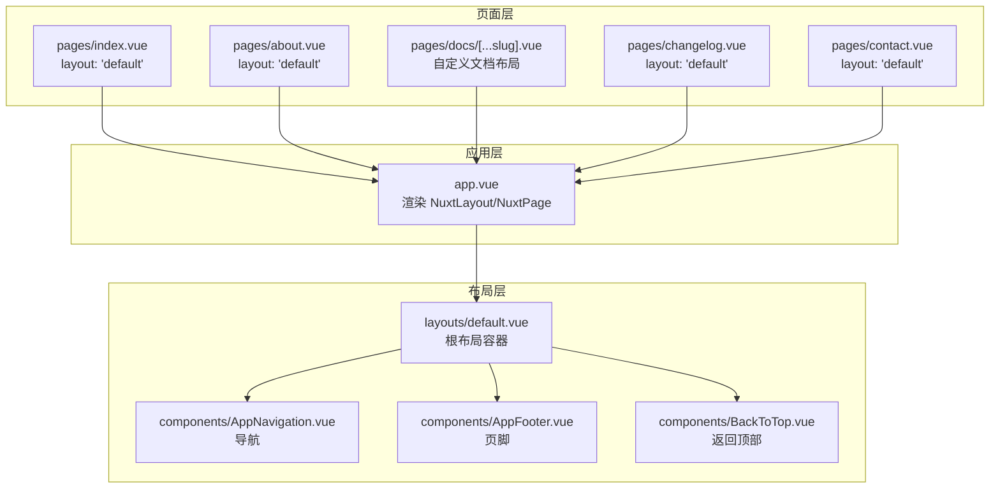
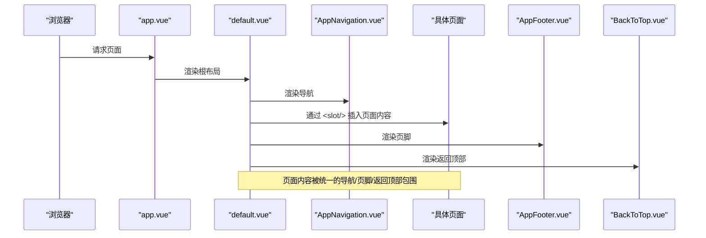
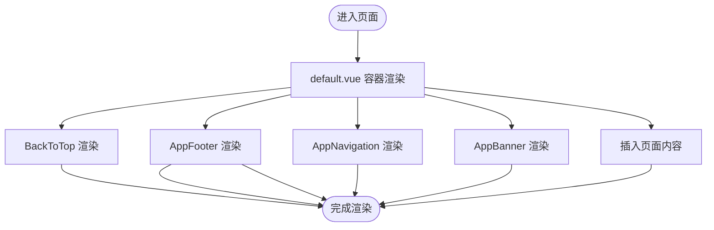
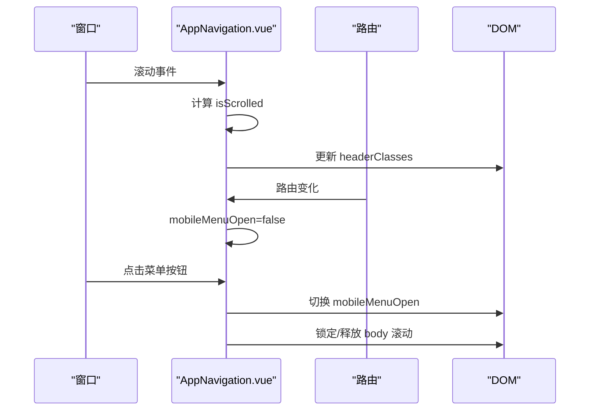
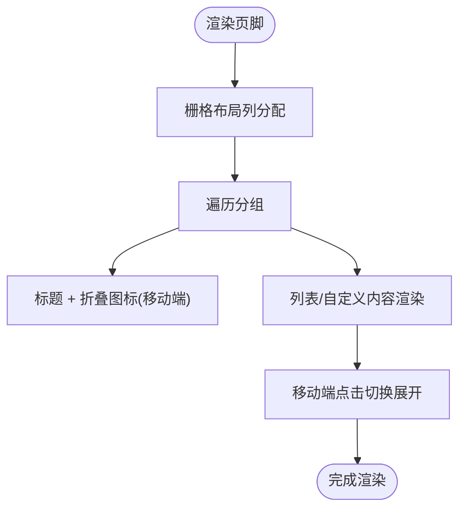
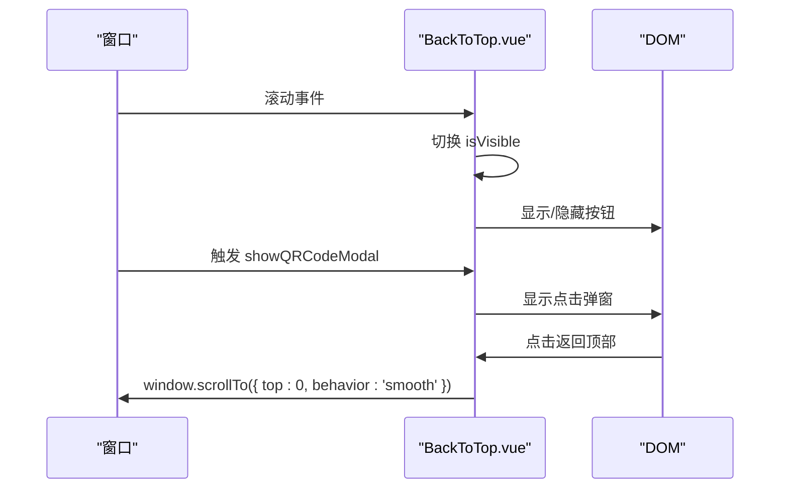
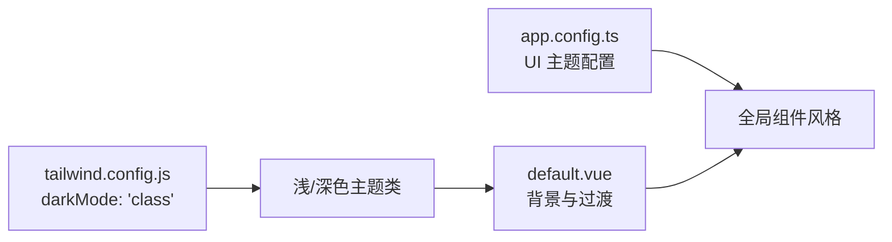
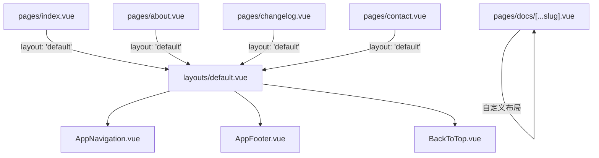

# 布局组件

<cite>
**本文引用的文件**
- [layouts/default.vue](file://layouts/default.vue)
- [components/AppNavigation.vue](file://components/AppNavigation.vue)
- [components/AppFooter.vue](file://components/AppFooter.vue)
- [components/BackToTop.vue](file://components/BackToTop.vue)
- [tailwind.config.js](file://tailwind.config.js)
- [app.config.ts](file://app.config.ts)
- [app.vue](file://app.vue)
- [pages/index.vue](file://pages/index.vue)
- [pages/about.vue](file://pages/about.vue)
- [pages/docs/[...slug].vue](file://pages/docs/[...slug].vue)
- [pages/changelog.vue](file://pages/changelog.vue)
- [pages/contact.vue](file://pages/contact.vue)
</cite>

## 目录
1. [简介](#简介)
2. [项目结构](#项目结构)
3. [核心组件](#核心组件)
4. [架构总览](#架构总览)
5. [详细组件分析](#详细组件分析)
6. [依赖关系分析](#依赖关系分析)
7. [性能考量](#性能考量)
8. [故障排查指南](#故障排查指南)
9. [结论](#结论)
10. [附录](#附录)

## 简介
本文件围绕 default.vue 根布局组件，系统阐述其通过插槽机制包裹页面内容、统一视觉结构的设计与实现；解释其与 AppNavigation、AppFooter、BackToTop 等全局组件的集成模式；说明基于 Tailwind CSS 的响应式设计与暗色模式支持；并提供使用示例与在特定页面中覆盖或扩展默认布局的方法。

## 项目结构
default.vue 位于 layouts 目录下，作为应用的根布局，负责：
- 顶部横幅（AppBanner）
- 导航（AppNavigation）
- 主体内容（<slot/>）
- 页脚（AppFooter）
- 返回顶部（BackToTop）

应用通过 app.vue 中的 NuxtLayout/NuxtPage 渲染当前页面，并由各页面通过 definePageMeta 指定 layout: 'default' 使用该根布局。

**图表来源**
- [app.vue](file://app.vue#L1-L12)
- [layouts/default.vue](file://layouts/default.vue#L1-L25)
- [components/AppNavigation.vue](file://components/AppNavigation.vue#L1-L138)
- [components/AppFooter.vue](file://components/AppFooter.vue#L1-L126)
- [components/BackToTop.vue](file://components/BackToTop.vue#L1-L142)
- [pages/index.vue](file://pages/index.vue#L1-L28)
- [pages/about.vue](file://pages/about.vue#L1-L120)
- [pages/docs/[...slug].vue](file://pages/docs/[...slug].vue#L1-L165)
- [pages/changelog.vue](file://pages/changelog.vue#L1-L120)
- [pages/contact.vue](file://pages/contact.vue#L1-L130)

**章节来源**
- [app.vue](file://app.vue#L1-L12)
- [layouts/default.vue](file://layouts/default.vue#L1-L25)

## 核心组件
- default.vue：提供最小高度、背景色过渡、全局横幅、导航、主体插槽、页脚、返回顶部的整体布局骨架。
- AppNavigation：响应式导航，支持透明/实体背景、移动端菜单、滚动监听与路由切换自动关闭。
- AppFooter：多列布局、移动端折叠、社交与自定义内容（QQ/微信）。
- BackToTop：悬浮按钮组（售前咨询、售后/活动、返回顶部）、二维码弹窗与点击弹窗、滚动监听显示隐藏。

**章节来源**
- [layouts/default.vue](file://layouts/default.vue#L1-L25)
- [components/AppNavigation.vue](file://components/AppNavigation.vue#L1-L138)
- [components/AppFooter.vue](file://components/AppFooter.vue#L1-L126)
- [components/BackToTop.vue](file://components/BackToTop.vue#L1-L142)

## 架构总览
default.vue 采用“容器 + 插槽”的模式，将页面内容包裹在统一的视觉框架内，保证全局一致的导航、页脚与交互入口。导航与页脚作为独立组件复用，返回顶部组件提供通用的用户引导。

**图表来源**
- [app.vue](file://app.vue#L1-L12)
- [layouts/default.vue](file://layouts/default.vue#L1-L25)
- [components/AppNavigation.vue](file://components/AppNavigation.vue#L1-L138)
- [components/AppFooter.vue](file://components/AppFooter.vue#L1-L126)
- [components/BackToTop.vue](file://components/BackToTop.vue#L1-L142)

## 详细组件分析

### default.vue 根布局
- 结构要点
  - 容器提供最小高度与背景色过渡，适配浅色/深色模式。
  - 顶部横幅、导航、主体插槽、页脚、返回顶部依次排列。
- 设计要点
  - 使用 <slot/> 机制将页面内容无条件包裹，形成一致的视觉结构。
  - 通过全局组件实现导航、页脚与返回顶部的统一接入点。
- 与页面的关系
  - 各页面通过 definePageMeta 指定 layout: 'default' 即可继承该布局。

**图表来源**
- [layouts/default.vue](file://layouts/default.vue#L1-L25)

**章节来源**
- [layouts/default.vue](file://layouts/default.vue#L1-L25)
- [pages/index.vue](file://pages/index.vue#L1-L28)

### AppNavigation 导航组件
- 响应式设计
  - 桌面端使用水平导航菜单，移动端使用抽屉式菜单，支持过渡动画。
- 交互与状态
  - 通过滚动监听切换透明/实体背景，移动端打开时锁定 body 滚动。
  - 路由变化时自动关闭移动端菜单。
- 可扩展性
  - 导航项与 UI 配置通过计算属性动态生成，便于维护与扩展。

**图表来源**
- [components/AppNavigation.vue](file://components/AppNavigation.vue#L267-L309)

**章节来源**
- [components/AppNavigation.vue](file://components/AppNavigation.vue#L1-L138)

### AppFooter 页脚组件
- 结构与布局
  - 多列栅格布局，移动端折叠分组，支持自定义内容（QQ/微信二维码）。
- 交互与可访问性
  - 移动端点击折叠/展开，桌面端禁用折叠逻辑。
  - 使用语义化标签与可访问性属性。

**图表来源**
- [components/AppFooter.vue](file://components/AppFooter.vue#L1-L126)

**章节来源**
- [components/AppFooter.vue](file://components/AppFooter.vue#L1-L126)

### BackToTop 返回顶部组件
- 功能组成
  - 售前咨询（蓝色渐变）、售后/活动（白色双按钮）、返回顶部（圆形按钮）。
  - 悬停显示二维码弹窗、点击弹出二维码模态框。
- 行为控制
  - 滚动超过阈值显示按钮，平滑滚动至顶部。
  - 监听自定义事件触发二维码弹窗。

**图表来源**
- [components/BackToTop.vue](file://components/BackToTop.vue#L225-L275)

**章节来源**
- [components/BackToTop.vue](file://components/BackToTop.vue#L1-L142)

### 响应式设计与暗色模式支持
- 响应式设计
  - 使用 Tailwind CSS 的断点类（sm:md:lg:x:xl）实现移动端到桌面端的布局切换。
  - 导航与页脚均采用响应式栅格与折叠逻辑。
- 暗色模式支持
  - Tailwind 配置启用 class 模式的暗色模式，default.vue 容器使用浅/深色背景类与过渡动画。
  - Nuxt UI 模块通过 app.config.ts 配置全局颜色与图标别名，配合暗色模式呈现一致风格。

**图表来源**
- [tailwind.config.js](file://tailwind.config.js#L1-L86)
- [app.config.ts](file://app.config.ts#L1-L83)
- [layouts/default.vue](file://layouts/default.vue#L1-L25)

**章节来源**
- [tailwind.config.js](file://tailwind.config.js#L1-L86)
- [app.config.ts](file://app.config.ts#L1-L83)
- [layouts/default.vue](file://layouts/default.vue#L1-L25)

## 依赖关系分析
- default.vue 依赖
  - AppNavigation、AppFooter、BackToTop 作为子组件引入。
  - 通过 <slot/> 接收页面内容。
- 页面到布局
  - 各页面通过 definePageMeta 指定 layout: 'default'，由 app.vue 的 NuxtLayout/NuxtPage 渲染。
- 文档页面的特殊性
  - pages/docs/[...slug].vue 自定义了文档页面的布局与内容渲染，不使用 default.vue 的 <slot/>，而是自行组织侧边栏、主内容与页脚导航。

**图表来源**
- [pages/index.vue](file://pages/index.vue#L1-L28)
- [pages/about.vue](file://pages/about.vue#L1-L120)
- [pages/docs/[...slug].vue](file://pages/docs/[...slug].vue#L1-L165)
- [pages/changelog.vue](file://pages/changelog.vue#L1-L120)
- [pages/contact.vue](file://pages/contact.vue#L1-L130)
- [layouts/default.vue](file://layouts/default.vue#L1-L25)

**章节来源**
- [pages/index.vue](file://pages/index.vue#L1-L28)
- [pages/about.vue](file://pages/about.vue#L1-L120)
- [pages/docs/[...slug].vue](file://pages/docs/[...slug].vue#L1-L165)
- [pages/changelog.vue](file://pages/changelog.vue#L1-L120)
- [pages/contact.vue](file://pages/contact.vue#L1-L130)
- [layouts/default.vue](file://layouts/default.vue#L1-L25)

## 性能考量
- 滚动优化
  - AppNavigation 使用 requestAnimationFrame 优化滚动处理，避免频繁重排。
  - BackToTop 使用阈值判断与平滑滚动，减少不必要的 DOM 操作。
- 事件绑定与清理
  - 组件在挂载时注册事件，在卸载时移除，防止内存泄漏。
- 响应式渲染
  - 通过 Tailwind 断点类实现条件渲染与布局切换，避免额外的复杂逻辑。

[本节为通用指导，无需列出具体文件来源]

## 故障排查指南
- 页面未应用默认布局
  - 检查页面是否设置了 layout: 'default'。
  - 确认 app.vue 中存在 NuxtLayout/NuxtPage。
- 导航在移动端无法关闭
  - 检查路由 watcher 是否生效，确认移动端菜单状态在路由变化时被重置。
- 返回顶部按钮不显示
  - 检查滚动阈值与事件绑定是否正常，确认 BackToTop 组件已挂载。
- 暗色模式未生效
  - 确认 Tailwind darkMode 配置为 class，且页面/容器具备相应的暗色类名。

**章节来源**
- [pages/index.vue](file://pages/index.vue#L1-L28)
- [app.vue](file://app.vue#L1-L12)
- [components/AppNavigation.vue](file://components/AppNavigation.vue#L287-L309)
- [components/BackToTop.vue](file://components/BackToTop.vue#L225-L275)
- [tailwind.config.js](file://tailwind.config.js#L1-L86)

## 结论
default.vue 通过插槽机制与全局组件集成，实现了统一的导航、页脚与返回顶部体验；结合 Tailwind CSS 的响应式与暗色模式能力，提供了良好的跨设备一致性。文档页面 pages/docs/[...slug].vue 展示了如何在特定场景下覆盖默认布局，以满足更复杂的页面结构需求。

[本节为总结性内容，无需列出具体文件来源]

## 附录

### 使用示例与覆盖方法
- 使用默认布局
  - 在目标页面的 script setup 中添加 definePageMeta({ layout: 'default' })。
  - 示例路径：[pages/index.vue](file://pages/index.vue#L1-L28)
- 覆盖默认布局
  - 对于需要完全自定义结构的页面（如文档页），可不设置 layout 或自定义布局文件，自行组织导航、侧边栏、主内容与页脚。
  - 示例路径：[pages/docs/[...slug].vue](file://pages/docs/[...slug].vue#L1-L165)
- 扩展默认布局
  - 在 default.vue 中增加额外的全局组件或占位符，即可在所有使用默认布局的页面中生效。
  - 示例路径：[layouts/default.vue](file://layouts/default.vue#L1-L25)

**章节来源**
- [pages/index.vue](file://pages/index.vue#L1-L28)
- [pages/docs/[...slug].vue](file://pages/docs/[...slug].vue#L1-L165)
- [layouts/default.vue](file://layouts/default.vue#L1-L25)