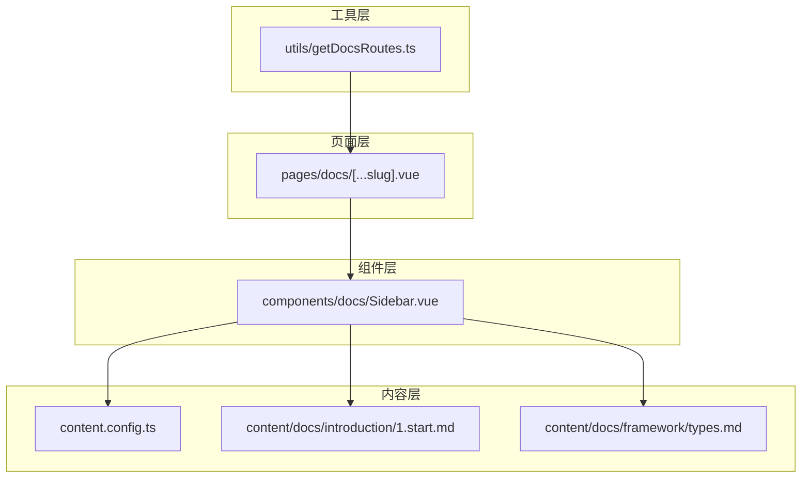
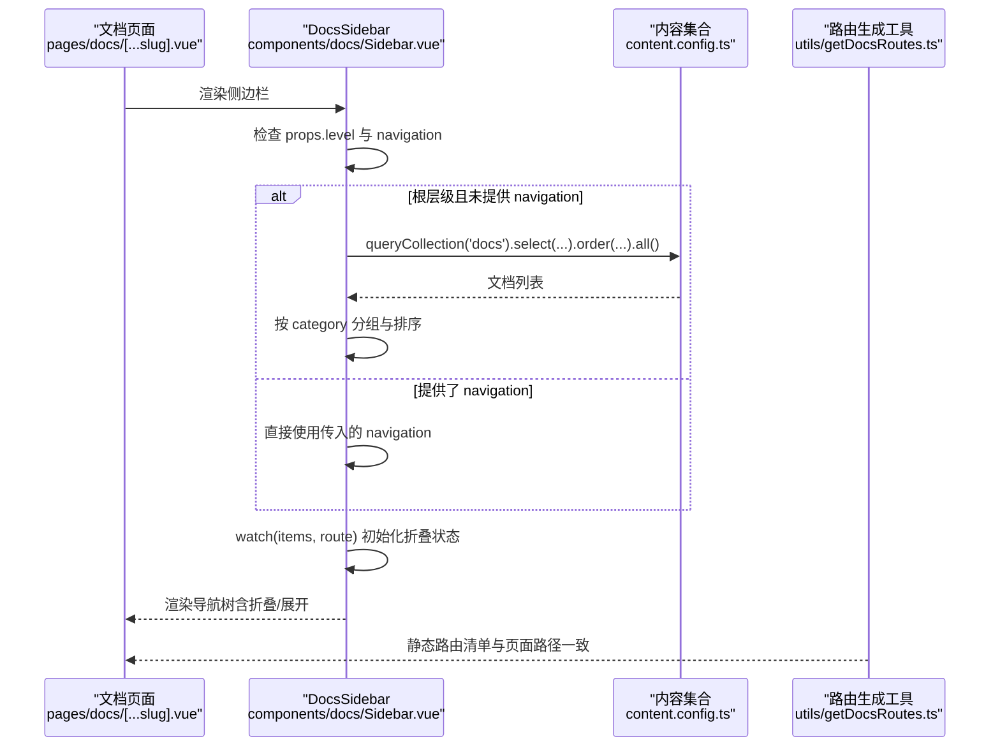
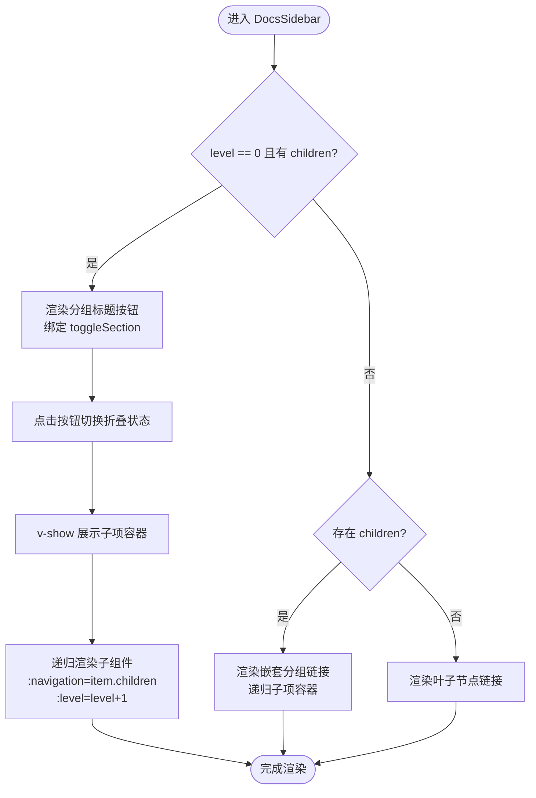
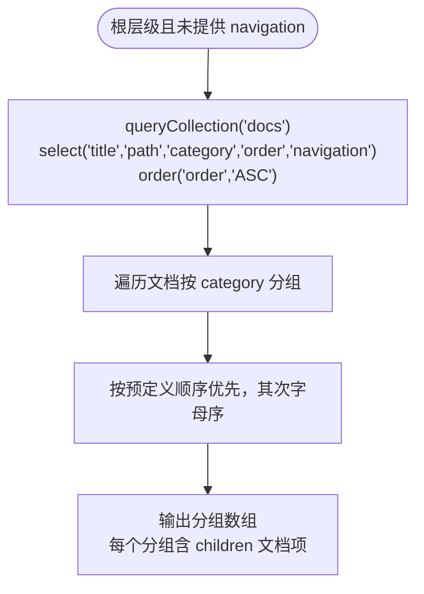
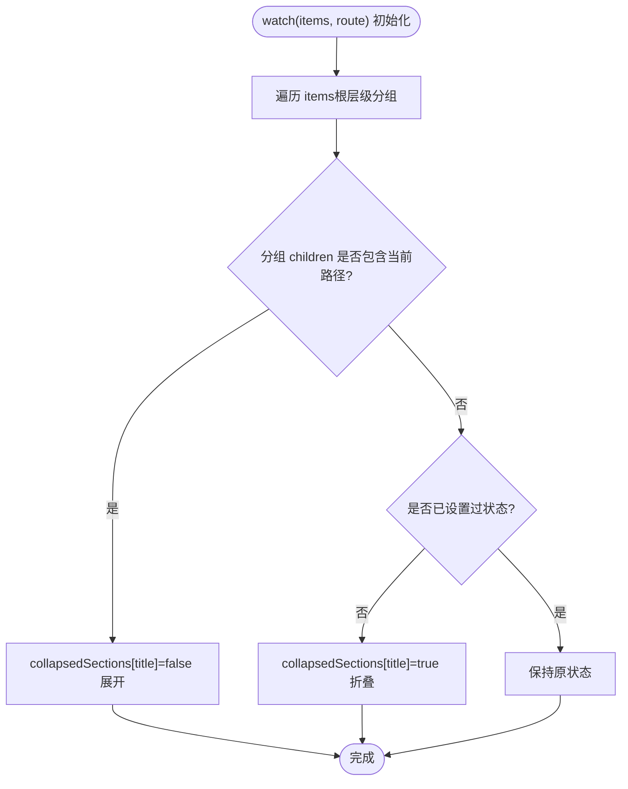
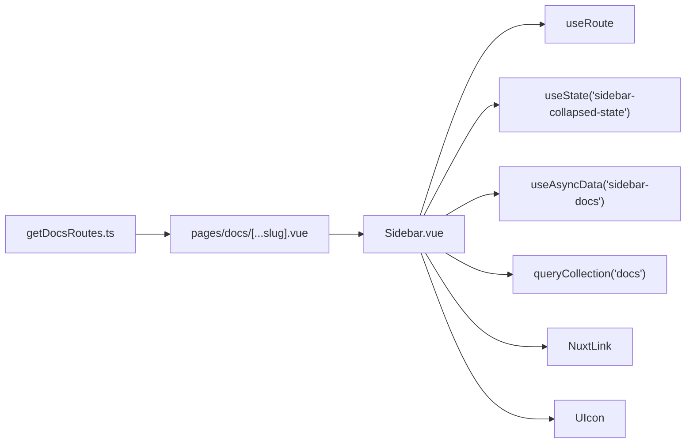

# 文档侧边栏

<cite>
**本文引用的文件**
- [components/docs/Sidebar.vue](file://components/docs/Sidebar.vue)
- [utils/getDocsRoutes.ts](file://utils/getDocsRoutes.ts)
- [pages/docs/[...slug].vue](file://pages/docs/[...slug].vue)
- [content.config.ts](file://content.config.ts)
- [content/docs/introduction/1.start.md](file://content/docs/introduction/1.start.md)
- [content/docs/framework/types.md](file://content/docs/framework/types.md)
</cite>

## 目录
1. [简介](#简介)
2. [项目结构](#项目结构)
3. [核心组件](#核心组件)
4. [架构总览](#架构总览)
5. [详细组件分析](#详细组件分析)
6. [依赖关系分析](#依赖关系分析)
7. [性能考量](#性能考量)
8. [故障排查指南](#故障排查指南)
9. [结论](#结论)
10. [附录](#附录)

## 简介
本文件系统性梳理文档侧边栏组件 DocsSidebar 的设计与实现，重点围绕以下主题：
- 递归组件设计模式与通过 props.level 参数实现多级导航渲染
- 数据获取逻辑：在根层级自动查询 content 集合生成导航树，并按 category 分组排序
- 折叠/展开状态管理：使用 useState 持久化用户交互状态，自动展开当前激活路由所在分组
- 与 getDocsRoutes.ts 工具函数的协同：确保静态生成的路由与侧边栏链接一致
- 组件 API、无障碍访问（a11y）特性与性能优化策略

## 项目结构
文档侧边栏位于组件层，配合页面布局与内容集合配置共同工作：
- 侧边栏组件：components/docs/Sidebar.vue
- 文档页面布局：pages/docs/[...slug].vue
- 内容集合配置：content.config.ts
- 路由生成工具：utils/getDocsRoutes.ts
- 示例文档 Front Matter：content/docs/introduction/1.start.md、content/docs/framework/types.md

图表来源
- [components/docs/Sidebar.vue](file://components/docs/Sidebar.vue#L1-L120)
- [pages/docs/[...slug].vue](file://pages/docs/[...slug].vue#L1-L30)
- [content.config.ts](file://content.config.ts#L1-L57)
- [utils/getDocsRoutes.ts](file://utils/getDocsRoutes.ts#L1-L58)

章节来源
- [components/docs/Sidebar.vue](file://components/docs/Sidebar.vue#L1-L120)
- [pages/docs/[...slug].vue](file://pages/docs/[...slug].vue#L1-L30)
- [content.config.ts](file://content.config.ts#L1-L57)
- [utils/getDocsRoutes.ts](file://utils/getDocsRoutes.ts#L1-L58)

## 核心组件
DocsSidebar 是一个递归渲染的导航组件，支持：
- 顶层分组标题与折叠面板
- 多级子项渲染（递归）
- 根层级自动从 content 集合获取数据并按 category 分组排序
- 折叠状态持久化与当前激活路由自动展开
- 无障碍属性与视觉高亮

组件关键点：
- 递归渲染：通过 props.level 控制层级，向子组件传递 navigation 与 level+1
- 数据来源：根层级未提供 navigation 时，自动查询 content.docs 集合
- 分组与排序：按 Front Matter 的 category 分组，预定义顺序优先，其次字母序
- 状态管理：使用 useState 持久化折叠状态，watch items 与路由变化自动展开当前分组
- 无障碍：为分组按钮提供 aria-expanded，为激活链接提供 aria-current

章节来源
- [components/docs/Sidebar.vue](file://components/docs/Sidebar.vue#L1-L120)
- [components/docs/Sidebar.vue](file://components/docs/Sidebar.vue#L156-L294)

## 架构总览
下面的序列图展示了“文档页面加载 -> 侧边栏数据获取 -> 导航树生成 -> 折叠状态初始化”的完整流程。

图表来源
- [components/docs/Sidebar.vue](file://components/docs/Sidebar.vue#L156-L294)
- [content.config.ts](file://content.config.ts#L1-L57)
- [utils/getDocsRoutes.ts](file://utils/getDocsRoutes.ts#L1-L58)
- [pages/docs/[...slug].vue](file://pages/docs/[...slug].vue#L1-L30)

## 详细组件分析

### 递归组件设计与多级导航渲染
- 设计模式：组件在根层级渲染为 nav，子层级渲染为 div，通过 props.level 切换样式与行为
- 递归调用：当某导航项存在 children 时，向子组件传递 navigation=item.children 与 level=level+1
- 结构分支：
  - 根层级且存在 children：渲染为折叠面板（按钮 + 子项容器），点击按钮切换折叠状态
  - 子层级：若存在 children 视为嵌套分组，渲染为链接并递归子项；若无 children 视为叶子节点链接
- 无障碍：根层级按钮提供 aria-expanded；叶子节点链接提供 aria-current

图表来源
- [components/docs/Sidebar.vue](file://components/docs/Sidebar.vue#L13-L105)

章节来源
- [components/docs/Sidebar.vue](file://components/docs/Sidebar.vue#L13-L105)

### 数据获取与导航树生成
- 根层级条件：仅当 props.level === 0 且未提供 navigation 时，才自动查询 content.docs 集合
- 查询字段：title、path、category、order、navigation
- 排序：按 order 升序
- 分组与排序：
  - 优先使用 Front Matter 的 category，缺失时归为“未分类”
  - 预定义分类顺序：['指南', '框架', '未分类']，两者均在列表时按顺序，仅一方在列表时优先，都不在时按字母序
- 输出结构：根层级返回分组数组，每个分组包含 title、children（文档项列表）、path 空字符串（分组标题无实际路径）

图表来源
- [components/docs/Sidebar.vue](file://components/docs/Sidebar.vue#L156-L239)
- [content.config.ts](file://content.config.ts#L1-L57)

章节来源
- [components/docs/Sidebar.vue](file://components/docs/Sidebar.vue#L156-L239)
- [content.config.ts](file://content.config.ts#L1-L57)

### 折叠/展开状态管理与自动展开
- 状态存储：使用 useState('sidebar-collapsed-state') 持久化折叠状态
- 初始化策略：
  - 默认所有分组折叠（true）
  - 监听 items 与当前路由变化，若某分组包含当前激活路径，则展开该分组（false）
  - 若不包含且未设置过状态，则初始化为折叠（true）；若已设置过（用户交互过），保持原样
- 用户交互：点击分组标题按钮切换对应分组的折叠状态

图表来源
- [components/docs/Sidebar.vue](file://components/docs/Sidebar.vue#L241-L268)

章节来源
- [components/docs/Sidebar.vue](file://components/docs/Sidebar.vue#L241-L268)

### 与 getDocsRoutes.ts 的协同
- 目标：确保静态生成的文档路由与侧边栏链接一致，避免出现“链接存在但页面未生成”的情况
- 实现思路：
  - getDocsRoutes.ts 递归扫描 content/docs 目录，生成所有文档页面路径数组
  - 在构建阶段（Nitro 预渲染）使用该数组进行静态预渲染，保证页面可达
  - 由于 Sidebar 在根层级会读取 content.docs 集合的 path 字段作为导航链接，二者在“路径一致性”上天然对齐
- 注意事项：
  - 请确保 content/docs 下的文件命名与 Front Matter 的 path 保持一致，避免路径不匹配导致链接失效

章节来源
- [utils/getDocsRoutes.ts](file://utils/getDocsRoutes.ts#L1-L58)
- [components/docs/Sidebar.vue](file://components/docs/Sidebar.vue#L156-L239)

### 组件 API
- Props
  - navigation: 可选，导航树数组；若未提供，组件将自动从 content 集合获取
  - level: 可选，当前嵌套层级，默认 0；用于递归渲染时的样式与逻辑判断
- Methods
  - toggleSection(title): 切换指定分组的折叠/展开状态
  - isActive(path): 判断给定路径是否为当前激活路由
- Slots
  - 无
- Events
  - 无

章节来源
- [components/docs/Sidebar.vue](file://components/docs/Sidebar.vue#L137-L155)
- [components/docs/Sidebar.vue](file://components/docs/Sidebar.vue#L270-L289)

### 无障碍访问（a11y）特性
- 分组按钮
  - role 为 button（由原生 button 元素提供）
  - aria-expanded 根据折叠状态动态更新
  - 点击事件触发 toggleSection
- 导航链接
  - 叶子节点链接提供 aria-current="page"，用于指示当前页面
- 整体容器
  - 根层级容器提供 aria-label="文档导航"，便于屏幕阅读器识别

章节来源
- [components/docs/Sidebar.vue](file://components/docs/Sidebar.vue#L13-L105)

### 性能优化策略
- 异步数据加载：根层级使用 useAsyncData 获取文档列表，避免阻塞客户端导航
- 条件查询：仅在根层级且未提供 navigation 时执行查询，减少不必要的网络请求
- 分组与排序：在内存中进行，复杂度 O(n log n)，n 为文档数量
- 折叠状态持久化：使用 useState，避免每次重渲染丢失用户偏好
- 渲染优化：根层级使用 v-if/v-else 控制错误与骨架屏，减少无效 DOM
- 递归渲染：仅在存在 children 时进行递归，避免深度不必要的渲染

章节来源
- [components/docs/Sidebar.vue](file://components/docs/Sidebar.vue#L156-L294)

## 依赖关系分析
- 组件依赖
  - 内容集合：通过 queryCollection('docs') 读取文档元数据
  - 路由：useRoute 获取当前路径，驱动激活态与自动展开
  - 状态：useState('sidebar-collapsed-state') 持久化折叠状态
  - 工具：getDocsRoutes.ts 用于静态路由生成，确保页面可达
- 外部依赖
  - Nuxt UI 图标组件 UIcon
  - NuxtLink 用于导航跳转
  - useAsyncData、computed、watch、useState 等 Vue 组合式 API

图表来源
- [components/docs/Sidebar.vue](file://components/docs/Sidebar.vue#L156-L294)
- [utils/getDocsRoutes.ts](file://utils/getDocsRoutes.ts#L1-L58)
- [pages/docs/[...slug].vue](file://pages/docs/[...slug].vue#L1-L30)

章节来源
- [components/docs/Sidebar.vue](file://components/docs/Sidebar.vue#L156-L294)
- [utils/getDocsRoutes.ts](file://utils/getDocsRoutes.ts#L1-L58)
- [pages/docs/[...slug].vue](file://pages/docs/[...slug].vue#L1-L30)

## 性能考量
- 数据获取时机：仅在根层级首次渲染时执行，避免重复查询
- 分组与排序：O(n log n)，建议控制文档数量规模或在构建阶段预处理
- 折叠状态：useState 保证跨路由切换仍保持用户偏好，减少重复计算
- 渲染策略：骨架屏与错误提示在根层级延迟加载时提供良好用户体验
- 静态预渲染：结合 getDocsRoutes.ts 生成静态路由，减少运行时 IO

[本节为通用性能建议，不直接分析具体文件]

## 故障排查指南
- 问题：侧边栏不显示或报错
  - 检查根层级是否正确传入 navigation 或等待 useAsyncData 完成
  - 确认 content.config.ts 中 docs 集合配置正确
- 问题：分组未按预期排序
  - 检查 Front Matter 的 category 是否与预定义顺序一致
  - 确认 order 字段是否正确设置
- 问题：当前页面未自动展开所在分组
  - 检查当前路由 path 与文档 path 是否一致
  - 确认 watch 逻辑已执行（items 与 route 变化）
- 问题：静态页面无法访问
  - 检查 getDocsRoutes.ts 生成的路由列表是否包含目标路径
  - 确认构建阶段已启用静态预渲染

章节来源
- [components/docs/Sidebar.vue](file://components/docs/Sidebar.vue#L156-L294)
- [content.config.ts](file://content.config.ts#L1-L57)
- [utils/getDocsRoutes.ts](file://utils/getDocsRoutes.ts#L1-L58)

## 结论
DocsSidebar 通过递归组件与 props.level 的巧妙运用，实现了灵活的多级导航渲染；借助 content 集合与 Front Matter 的结构化数据，实现了按分类分组与排序；通过 useState 与 watch 的组合，既保持了用户交互状态，又实现了自动展开当前激活路由所在分组。配合 getDocsRoutes.ts，确保了静态生成的路由与侧边栏链接一致，整体形成“数据驱动 + 无障碍 + 性能优化”的完整方案。

[本节为总结性内容，不直接分析具体文件]

## 附录

### 示例文档 Front Matter 关键字段
- category：用于分组
- title：导航标题
- navigation.icon：分组或链接图标
- order：排序权重（根层级按 order 升序）

章节来源
- [content/docs/introduction/1.start.md](file://content/docs/introduction/1.start.md#L1-L10)
- [content/docs/framework/types.md](file://content/docs/framework/types.md#L1-L10)
- [content.config.ts](file://content.config.ts#L1-L57)