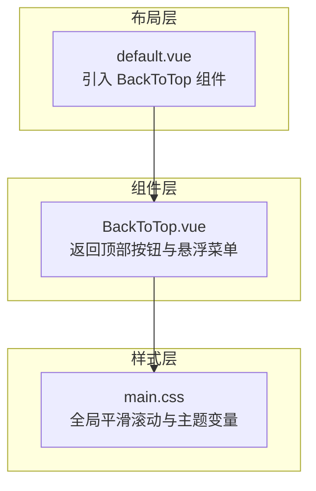
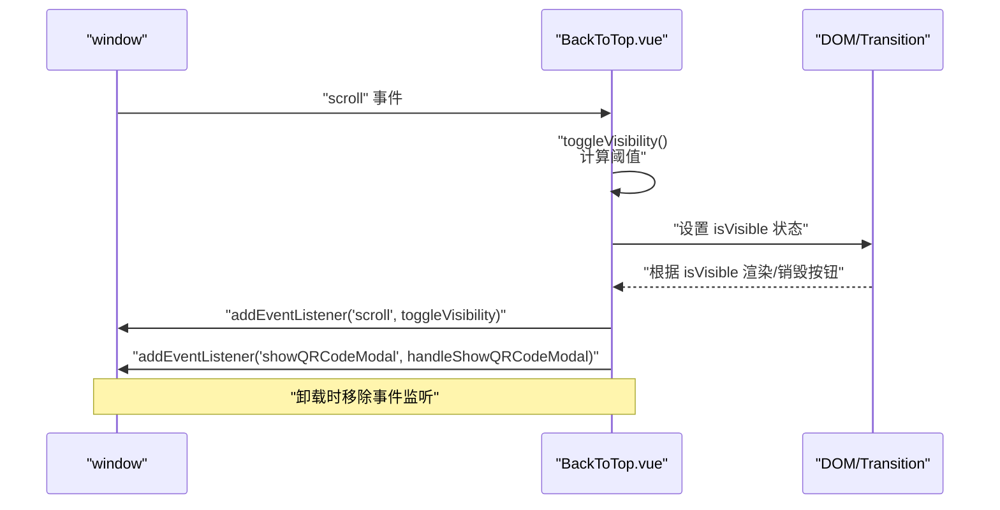
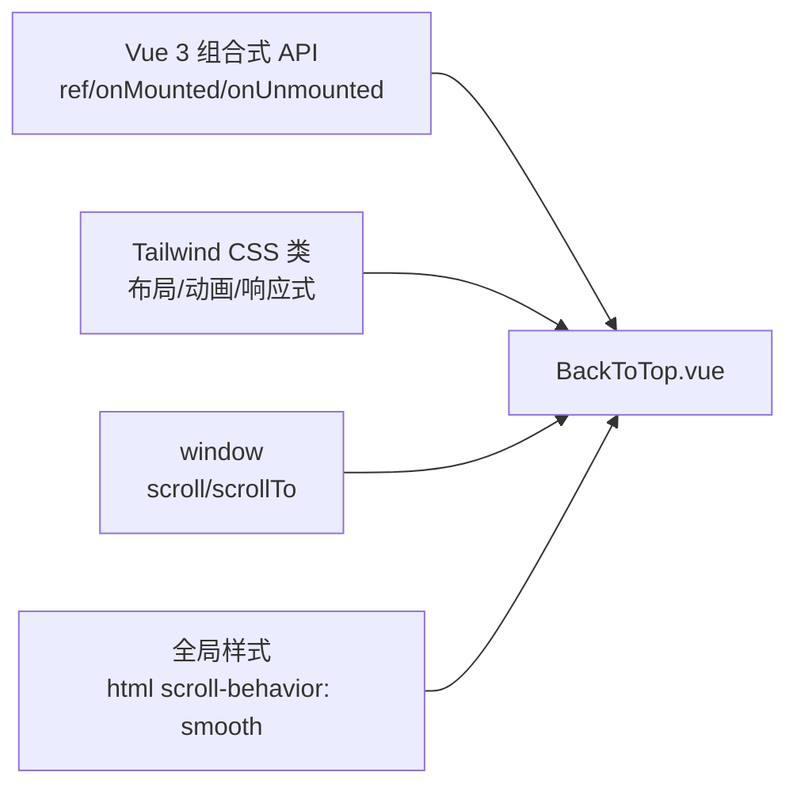

# 返回顶部按钮

<cite>
**本文引用的文件**
- [BackToTop.vue](file://components/BackToTop.vue)
- [default.vue](file://layouts/default.vue)
- [main.css](file://assets/css/main.css)
</cite>

## 目录
1. [简介](#简介)
2. [项目结构](#项目结构)
3. [核心组件](#核心组件)
4. [架构总览](#架构总览)
5. [详细组件分析](#详细组件分析)
6. [依赖关系分析](#依赖关系分析)
7. [性能考量](#性能考量)
8. [故障排查指南](#故障排查指南)
9. [结论](#结论)
10. [附录](#附录)

## 简介
本文件面向前端开发者与产品设计人员，系统化解读返回顶部按钮组件 BackToTop.vue 的实现原理与使用方式。重点涵盖：
- 如何监听 window 的滚动事件来控制按钮的显示与隐藏
- 使用 CSS 过渡与变换实现平滑出现/消失动画
- 点击事件处理逻辑，使用 window.scrollTo 实现平滑滚动回顶部
- 响应式设计考虑，确保在不同设备与屏幕尺寸下的可用性
- 显示阈值、动画时长等可配置参数的说明与建议

## 项目结构
BackToTop.vue 是一个独立的 Vue 组合式 API 组件，位于 components 目录中；它在默认布局文件中被全局引入并渲染，作为页面常驻交互元素。

图表来源
- [default.vue](file://layouts/default.vue#L17-L19)
- [BackToTop.vue](file://components/BackToTop.vue#L1-L20)
- [main.css](file://assets/css/main.css#L21-L30)

章节来源
- [default.vue](file://layouts/default.vue#L17-L19)
- [BackToTop.vue](file://components/BackToTop.vue#L1-L20)
- [main.css](file://assets/css/main.css#L21-L30)

## 核心组件
BackToTop.vue 提供以下能力：
- 滚动阈值控制：当页面滚动超过阈值时显示按钮，否则隐藏
- 平滑动画：通过 Vue Transition 与 Tailwind 过渡类实现进入/离开的缩放与透明度动画
- 回顶交互：点击按钮触发 window.scrollTo({ top: 0, behavior: 'smooth' }) 平滑滚动至顶部
- 响应式定位：使用 Tailwind 的 sm 断点与固定定位，适配移动端与桌面端
- 可选悬浮菜单：组件内还包含“售前咨询”“售后服务/活动”等悬浮入口（与返回顶部功能同级），便于扩展

章节来源
- [BackToTop.vue](file://components/BackToTop.vue#L123-L140)
- [BackToTop.vue](file://components/BackToTop.vue#L225-L245)
- [BackToTop.vue](file://components/BackToTop.vue#L266-L274)

## 架构总览
BackToTop.vue 在挂载时订阅 window 的 scroll 事件，在卸载时解绑，避免内存泄漏；同时支持通过自定义事件触发二维码弹窗，体现组件间通信能力。

图表来源
- [BackToTop.vue](file://components/BackToTop.vue#L225-L245)
- [BackToTop.vue](file://components/BackToTop.vue#L266-L274)

## 详细组件分析

### 滚动监听与显示阈值
- 监听机制：组件在 mounted 生命周期中为 window 添加 scroll 事件监听；在 unmounted 生命周期中移除监听，防止内存泄漏。
- 阈值判断：当 window.pageYOffset 大于 300 像素时，设置内部可见状态为 true，从而显示按钮；否则隐藏。
- 触发频率：scroll 事件可能高频触发，建议在实际项目中可结合节流/防抖策略以提升性能（当前实现未内置节流/防抖）。

章节来源
- [BackToTop.vue](file://components/BackToTop.vue#L225-L232)
- [BackToTop.vue](file://components/BackToTop.vue#L266-L274)

### 动画与过渡实现
- 进入/离开动画：使用 Vue Transition 包裹按钮，通过 enter-active-class/leave-active-class 与 enter-from-class/leave-from-class/enter-to-class/leave-to-class 定义过渡状态。
- 变换与透明度：动画基于 opacity 与 scale 的组合，配合 transition duration 控制动画时长，实现“缩放+淡入淡出”的自然过渡。
- 延迟与层级：不同悬浮入口设置了不同的 delay，形成错峰出现的层次感；z-index 保证按钮层级高于页面内容。

章节来源
- [BackToTop.vue](file://components/BackToTop.vue#L124-L140)
- [BackToTop.vue](file://components/BackToTop.vue#L1-L20)

### 点击事件与平滑回顶
- 点击处理：按钮绑定点击事件，调用 scrollToTop 方法。
- 平滑滚动：使用 window.scrollTo({ top: 0, behavior: 'smooth' }) 实现平滑滚动至页面顶部。
- 全局平滑：全局样式中启用了 html scroll-behavior: smooth，进一步增强整体滚动体验的一致性。

章节来源
- [BackToTop.vue](file://components/BackToTop.vue#L239-L245)
- [main.css](file://assets/css/main.css#L21-L30)

### 响应式设计与定位
- 固定定位：按钮采用 fixed 定位，底部与右侧通过 Tailwind 的 sm 断点进行差异化间距，确保在移动端与桌面端均有合适的可视范围。
- 尺寸适配：按钮尺寸在 sm 断点前后使用不同的宽高类，保证在不同屏幕密度下的可点击面积与视觉比例。
- 层级与阴影：通过 z-index 与阴影类确保按钮在页面内容之上且具备良好的可读性。

章节来源
- [BackToTop.vue](file://components/BackToTop.vue#L1-L20)

### 组件间通信与扩展
- 自定义事件：组件在 mounted 时订阅自定义事件 showQRCodeModal，用于从外部触发二维码弹窗，体现组件间松耦合的通信方式。
- 事件清理：在 unmounted 时移除该自定义事件监听，避免潜在泄漏。

章节来源
- [BackToTop.vue](file://components/BackToTop.vue#L234-L238)
- [BackToTop.vue](file://components/BackToTop.vue#L266-L274)

### 可配置参数与建议
- 显示阈值：当前实现使用固定阈值 300 像素。若需调整，可在 toggleVisibility 中修改比较条件。
- 动画时长：动画时长由 Transition 的 duration 类控制，例如 300ms 或 200ms。若需统一调整，可在 enter-active-class/leave-active-class 中集中修改。
- 延迟顺序：不同悬浮入口设置了 delay，形成错峰出现的层次感。若需调整出现节奏，可修改各 Transition 的 delay。
- 滚动行为：平滑滚动由 window.scrollTo 的 behavior: 'smooth' 控制，全局平滑滚动由 html scroll-behavior: smooth 提供一致体验。

章节来源
- [BackToTop.vue](file://components/BackToTop.vue#L225-L232)
- [BackToTop.vue](file://components/BackToTop.vue#L124-L140)
- [BackToTop.vue](file://components/BackToTop.vue#L239-L245)
- [main.css](file://assets/css/main.css#L21-L30)

## 依赖关系分析
BackToTop.vue 的依赖关系清晰，主要依赖 Vue 组合式 API 与 Tailwind CSS 类，无第三方 UI 库直接依赖。

图表来源
- [BackToTop.vue](file://components/BackToTop.vue#L210-L218)
- [BackToTop.vue](file://components/BackToTop.vue#L1-L20)
- [BackToTop.vue](file://components/BackToTop.vue#L239-L245)
- [main.css](file://assets/css/main.css#L21-L30)

章节来源
- [BackToTop.vue](file://components/BackToTop.vue#L210-L218)
- [BackToTop.vue](file://components/BackToTop.vue#L1-L20)
- [BackToTop.vue](file://components/BackToTop.vue#L239-L245)
- [main.css](file://assets/css/main.css#L21-L30)

## 性能考量
- 事件监听生命周期管理：组件在 mounted 时添加监听，在 unmounted 时移除，避免内存泄漏与重复绑定。
- 动画性能：使用 transform 与 opacity 的过渡通常由 GPU 加速，性能较好；建议保持动画时长与延迟在合理范围内，避免过度叠加。
- 滚动事件优化：当前未内置节流/防抖，若页面滚动频繁或存在复杂 DOM，建议在 toggleVisibility 中增加节流/防抖逻辑，降低重绘频率。
- 全局平滑滚动：全局启用平滑滚动可减少个别场景的性能波动，但需注意在某些设备上可能影响滚动精度。

章节来源
- [BackToTop.vue](file://components/BackToTop.vue#L266-L274)
- [BackToTop.vue](file://components/BackToTop.vue#L225-L232)
- [main.css](file://assets/css/main.css#L21-L30)

## 故障排查指南
- 按钮不显示/不隐藏
  - 检查是否正确挂载组件并在 window 上注册了 scroll 事件监听
  - 确认阈值逻辑是否被覆盖或被其他样式影响
- 点击无效
  - 确认按钮是否被其他元素遮挡
  - 检查是否有阻止冒泡或默认行为的代码
- 动画异常
  - 检查 Transition 的 enter/leave 类名是否与 Tailwind 类冲突
  - 确认动画时长与延迟设置是否合理
- 自定义事件无法触发弹窗
  - 确认是否在外部正确派发了 showQRCodeModal 事件
  - 检查组件卸载时是否移除了事件监听

章节来源
- [BackToTop.vue](file://components/BackToTop.vue#L266-L274)
- [BackToTop.vue](file://components/BackToTop.vue#L234-L238)

## 结论
BackToTop.vue 通过简洁的滚动监听与 Vue Transition 动画，实现了平滑、可配置的返回顶部交互。其响应式定位与全局平滑滚动设置提升了跨设备可用性。建议在生产环境中结合节流/防抖与可配置参数，进一步优化性能与用户体验。

## 附录

### 参数与配置清单
- 显示阈值：当前为 300 像素（可修改）
- 动画时长：由 Transition 的 duration 类控制（如 300ms/200ms）
- 动画类型：缩放与透明度组合（scale + opacity）
- 滚动行为：window.scrollTo({ behavior: 'smooth' }) 与全局 html scroll-behavior: smooth
- 响应式断点：sm 断点用于尺寸与间距差异化
- 自定义事件：showQRCodeModal 用于外部触发二维码弹窗

章节来源
- [BackToTop.vue](file://components/BackToTop.vue#L225-L232)
- [BackToTop.vue](file://components/BackToTop.vue#L124-L140)
- [BackToTop.vue](file://components/BackToTop.vue#L239-L245)
- [BackToTop.vue](file://components/BackToTop.vue#L234-L238)
- [main.css](file://assets/css/main.css#L21-L30)