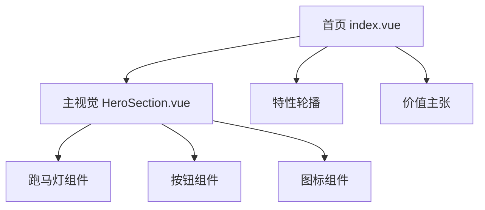
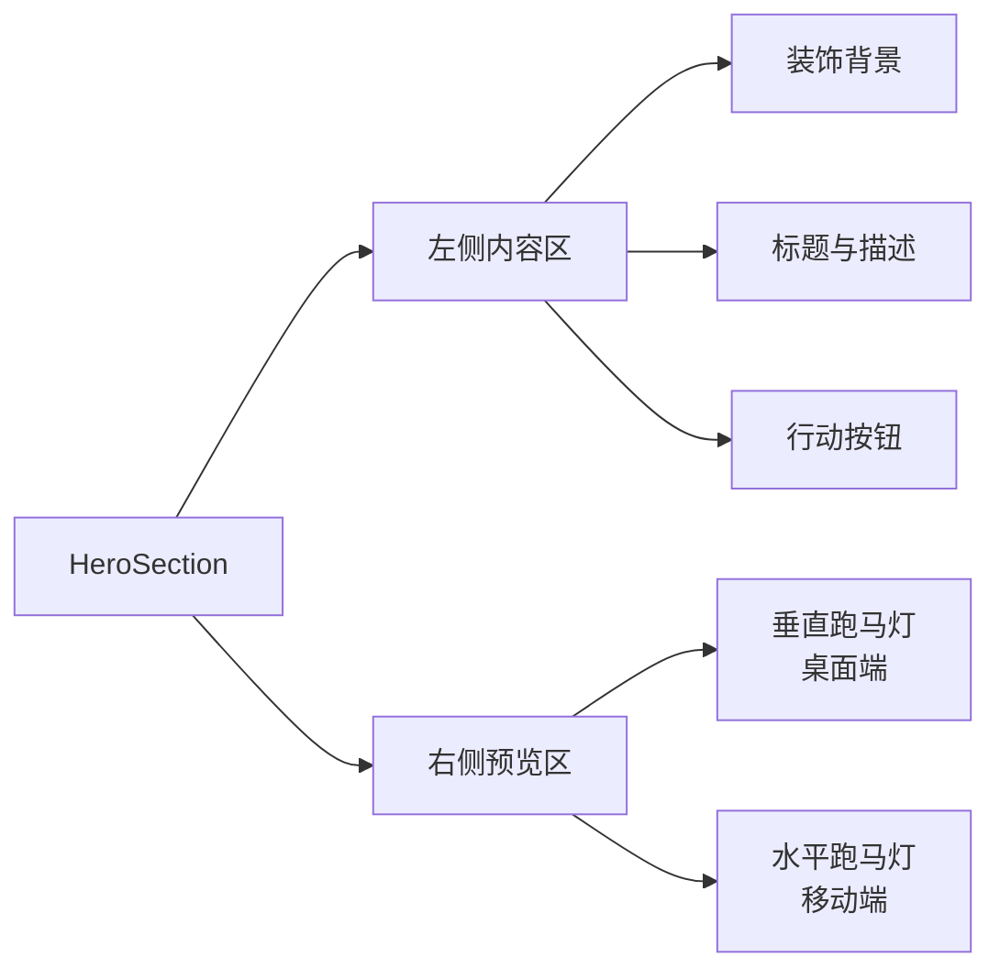
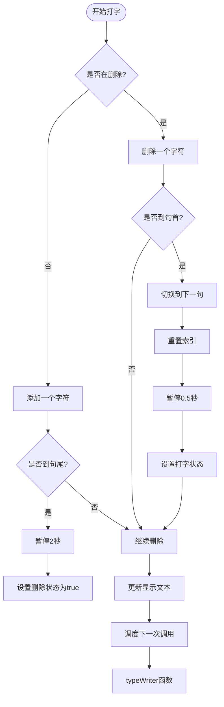
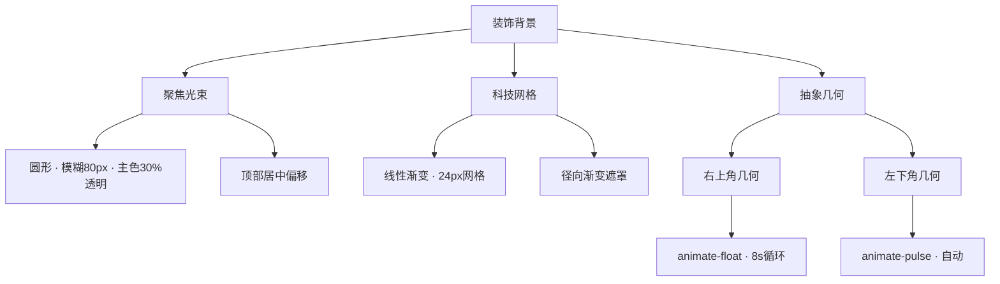
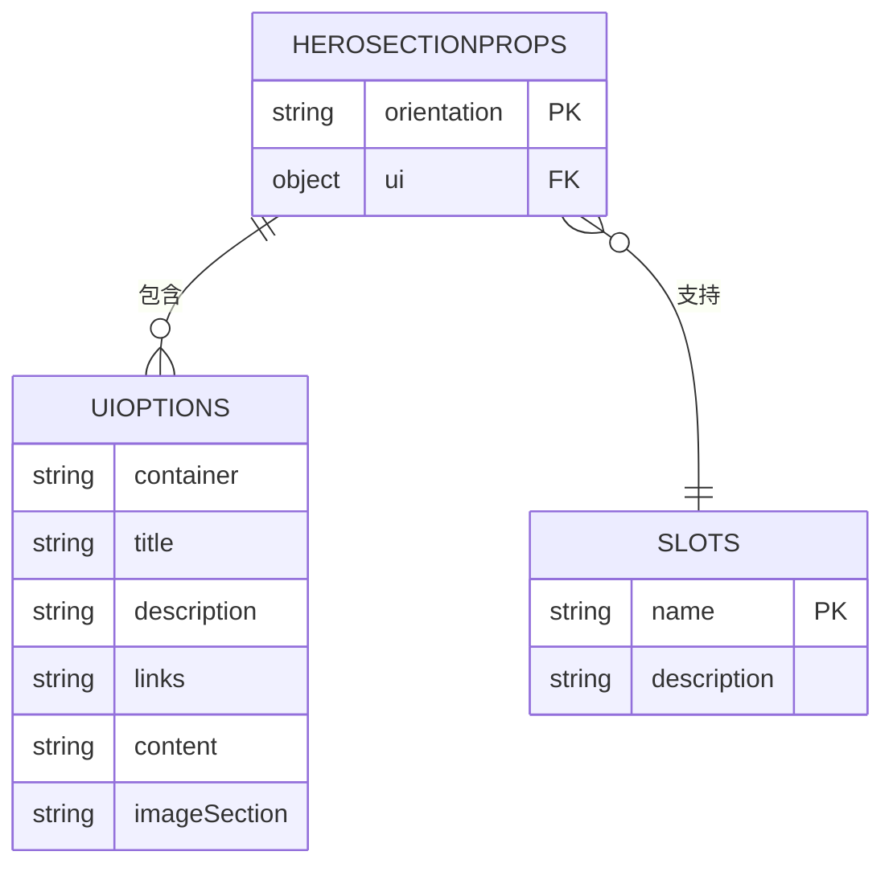
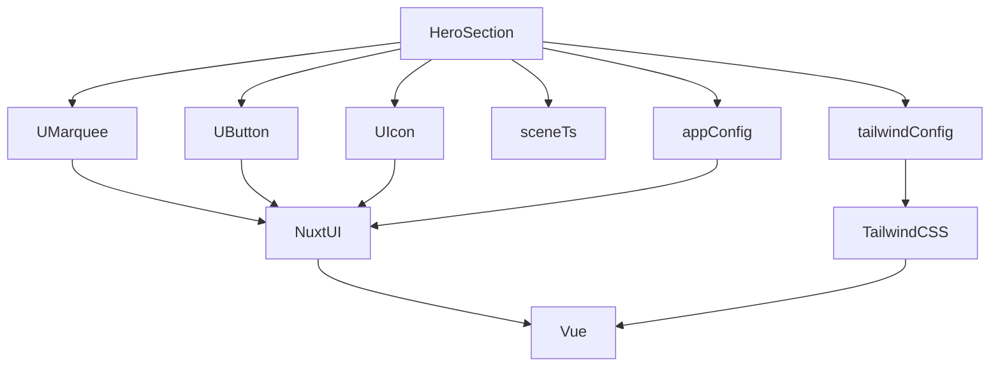

# 首页主视觉

<cite>
**本文档引用文件**  
- [HeroSection.vue](file://components/landing/HeroSection.vue)
- [scene.ts](file://utils/scene.ts)
- [app.config.ts](file://app.config.ts)
- [tailwind.config.js](file://tailwind.config.js)
- [Marquee.vue](file://node_modules/@nuxt/ui/dist/runtime/components/Marquee.vue)
</cite>

## 目录
1. [简介](#简介)
2. [项目结构](#项目结构)
3. [核心组件](#核心组件)
4. [架构概览](#架构概览)
5. [详细组件分析](#详细组件分析)
6. [依赖分析](#依赖分析)
7. [性能考虑](#性能考虑)
8. [故障排除指南](#故障排除指南)
9. [结论](#结论)

## 简介
`HeroSection.vue` 是 BuidAI 首页的核心视觉组件，负责展示主视觉区域。该组件采用响应式网格布局，结合动态打字机效果、插件预览图跑马灯和装饰性背景元素，构建出富有科技感和视觉层次的首屏体验。组件通过 `UMarquee` 实现垂直与水平跑马灯切换，利用计算属性动态生成展示内容，并通过 CSS 动画实现光束、网格和几何图形等背景特效。

## 项目结构
`HeroSection.vue` 位于 `components/landing/` 目录下，是首页落地页的首个模块。该组件通过 `index.vue` 页面引入，与其他落地页组件共同构成完整的首页布局。



**Diagram sources**
- [index.vue](file://pages/index.vue#L3)
- [HeroSection.vue](file://components/landing/HeroSection.vue#L1)

**Section sources**
- [index.vue](file://pages/index.vue#L1-L28)
- [HeroSection.vue](file://components/landing/HeroSection.vue#L1-L392)

## 核心组件
`HeroSection.vue` 采用 Vue 3 的 `<script setup>` 语法，结合 TypeScript 定义组件属性接口。组件主要包含三大功能模块：打字机效果、插件预览跑马灯和装饰性背景元素。通过响应式状态管理实现移动端适配，并利用计算属性动态生成跑马灯图片组。

**Section sources**
- [HeroSection.vue](file://components/landing/HeroSection.vue#L192-L355)

## 架构概览
组件采用左右两栏的响应式网格布局，在大屏幕（lg）上为 1:1 分布，通过 `grid` 和 `flex` 布局实现内容对齐。左侧为文本内容区，包含标题、描述和行动按钮；右侧为插件预览区，使用 `UMarquee` 组件实现图片循环展示。



**Diagram sources**
- [HeroSection.vue](file://components/landing/HeroSection.vue#L4-L187)

## 详细组件分析

### 打字机效果实现
打字机效果通过递归 `setTimeout` 实现文本的逐字显示与删除。组件维护当前句子索引、字符索引和删除状态，通过 `typeWriterText` 响应式变量更新显示内容。打字速度为 100ms/字，删除速度为 30ms/字，句末停留 2 秒，新句开始前暂停 0.5 秒。



**Diagram sources**
- [HeroSection.vue](file://components/landing/HeroSection.vue#L256-L292)

**Section sources**
- [HeroSection.vue](file://components/landing/HeroSection.vue#L256-L292)

### 跑马灯技术细节
组件使用 `UMarquee` 组件创建插件预览图的自动滚动效果。桌面端采用垂直双列布局，移动端采用水平单列布局。通过 `computed` 属性 `marqueeImageGroups` 动态生成图片组，从 `scene.ts` 中获取所有插件图片，根据设备类型（移动端/桌面端）随机选取 10 或 16 张图片，并均匀分配到两组中。

```mermaid
classDiagram
class HeroSection {
+isMobile : Ref<boolean>
+typeWriterText : Ref<string>
+sentences : string[]
+allPluginImages : ComputedRef<string[]>
+marqueeImageGroups : ComputedRef<{first : string[], second : string[]}>
+shuffleArray(array) : string[]
+checkDevice() : void
+typeWriter() : void
}
class UMarquee {
+orientation : 'horizontal'|'vertical'
+reverse : boolean
+pauseOnHover : boolean
+repeat : number
+overlay : boolean
}
class SceneData {
+sceneApps : SceneAppData[]
}
HeroSection --> UMarquee : "使用"
HeroSection --> SceneData : "导入"
HeroSection --> "Vue Composables" : "使用"
```

**Diagram sources**
- [HeroSection.vue](file://components/landing/HeroSection.vue#L295-L328)
- [scene.ts](file://utils/scene.ts#L10-L121)
- [Marquee.vue](file://node_modules/@nuxt/ui/dist/runtime/components/Marquee.vue#L1-L37)

**Section sources**
- [HeroSection.vue](file://components/landing/HeroSection.vue#L295-L348)
- [scene.ts](file://utils/scene.ts#L1-L122)

### 装饰性背景元素
组件通过绝对定位的 `div` 元素创建多层装饰性背景，包括：
1. **聚焦光束**：顶部圆形模糊光晕，使用 `bg-ui-primary/30` 颜色和 `blur-[80px]` 模糊效果
2. **科技网格**：通过 CSS 渐变创建 24px×24px 的网格背景
3. **抽象几何**：两个圆形元素分别位于右上和左下，使用渐变色和 `blur-2xl`/`blur-xl` 模糊，配合 `animate-pulse` 和 `animate-float` 实现脉动和浮动动画



**Diagram sources**
- [HeroSection.vue](file://components/landing/HeroSection.vue#L7-L17)
- [HeroSection.vue](file://components/landing/HeroSection.vue#L358-L373)
- [tailwind.config.js](file://tailwind.config.js#L58-L63)

**Section sources**
- [HeroSection.vue](file://components/landing/HeroSection.vue#L7-L17)
- [HeroSection.vue](file://components/landing/HeroSection.vue#L358-L391)

### 组件接口与定制
组件通过 `props` 提供 UI 自定义选项，支持容器、标题、描述、链接、内容区和图片区的样式定制。同时提供 `title`、`description` 和 `links` 插槽，允许外部内容覆盖默认内容。



**Diagram sources**
- [HeroSection.vue](file://components/landing/HeroSection.vue#L203-L237)

**Section sources**
- [HeroSection.vue](file://components/landing/HeroSection.vue#L203-L250)

## 依赖分析
`HeroSection.vue` 依赖于多个外部组件和配置文件。通过 `@nuxt/ui` 提供的 `UMarquee`、`UButton` 和 `UIcon` 组件实现核心功能，通过 `app.config.ts` 配置全局 UI 主题色，通过 `tailwind.config.js` 扩展动画和颜色配置。



**Diagram sources**
- [HeroSection.vue](file://components/landing/HeroSection.vue#L45-L58)
- [app.config.ts](file://app.config.ts#L1-L83)
- [tailwind.config.js](file://tailwind.config.js#L1-L86)

**Section sources**
- [HeroSection.vue](file://components/landing/HeroSection.vue#L195)
- [app.config.ts](file://app.config.ts#L1-L83)
- [tailwind.config.js](file://tailwind.config.js#L1-L86)

## 性能考虑
组件在性能方面进行了多项优化：使用 `loading="lazy"` 和 `decoding="async"` 属性实现图片懒加载和异步解码；通过 `onUnmounted` 清理定时器和事件监听器防止内存泄漏；利用 `computed` 属性缓存计算结果，避免重复计算；在移动端减少展示图片数量以降低资源消耗。

## 故障排除指南
当出现打字机效果不工作时，检查 `onMounted` 钩子是否正确调用 `typeWriter` 函数；当跑马灯图片不显示时，确认 `scene.ts` 文件中的图片路径是否正确；当背景动画异常时，检查 `animate-float` 和 `animate-pulse` 类名是否正确应用。

**Section sources**
- [HeroSection.vue](file://components/landing/HeroSection.vue#L345-L354)

## 结论
`HeroSection.vue` 组件通过精心设计的响应式布局、动态文本效果和视觉装饰元素，成功构建了 BuidAI 首页的主视觉区域。组件采用模块化设计，通过计算属性和响应式状态管理实现动态内容生成，利用 Nuxt UI 组件库确保视觉一致性，是一套完整且高效的首页首屏解决方案。