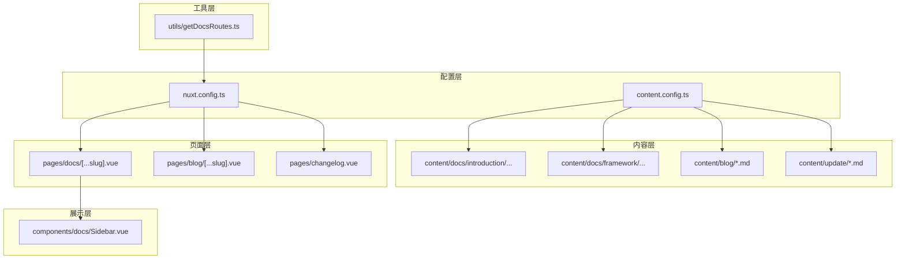
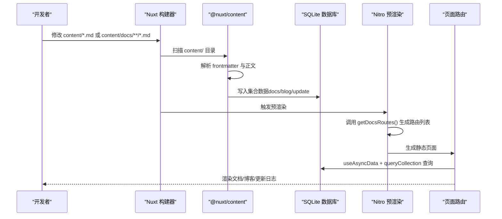
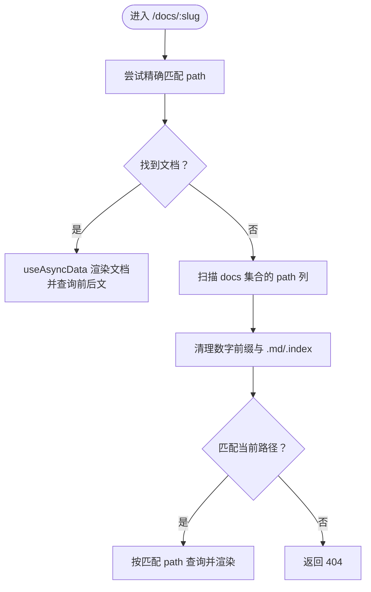
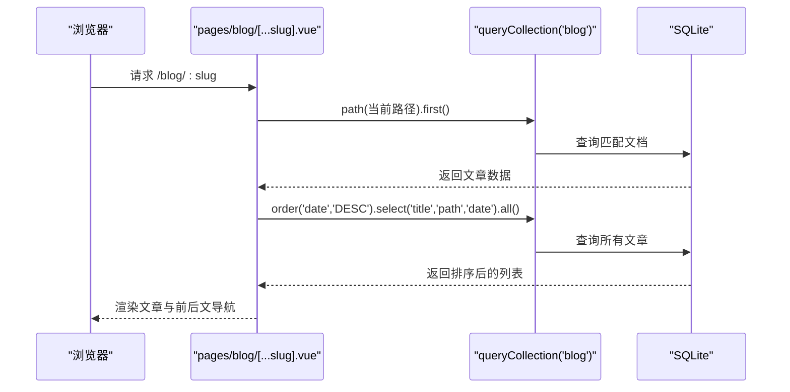
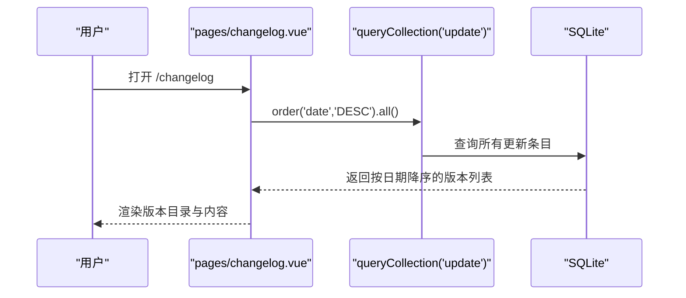
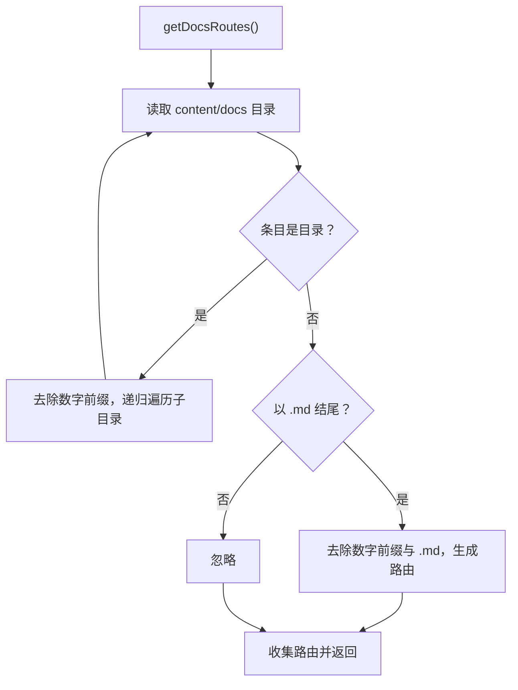
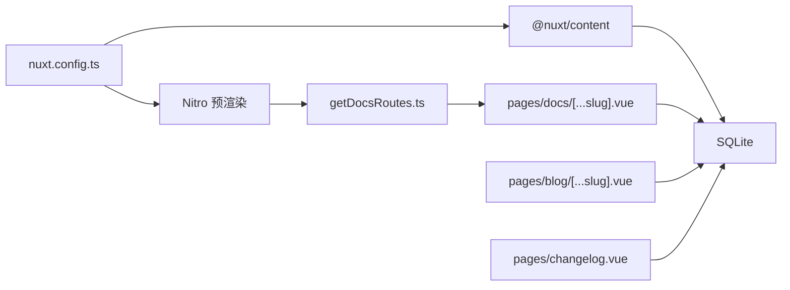

# 内容管理

<cite>
**本文引用的文件**
- [content.config.ts](file://content.config.ts)
- [nuxt.config.ts](file://nuxt.config.ts)
- [pages/docs/[...slug].vue](file://pages/docs/[...slug].vue)
- [utils/getDocsRoutes.ts](file://utils/getDocsRoutes.ts)
- [components/docs/Sidebar.vue](file://components/docs/Sidebar.vue)
- [pages/blog/[...slug].vue](file://pages/blog/[...slug].vue)
- [pages/changelog.vue](file://pages/changelog.vue)
- [content/docs/introduction/1.start.md](file://content/docs/introduction/1.start.md)
- [content/docs/framework/define.md](file://content/docs/framework/define.md)
- [content/blog/1.md](file://content/blog/1.md)
- [content/update/2503.md](file://content/update/2503.md)
- [package.json](file://package.json)
</cite>

## 目录
1. [引言](#引言)
2. [项目结构](#项目结构)
3. [核心组件](#核心组件)
4. [架构总览](#架构总览)
5. [详细组件分析](#详细组件分析)
6. [依赖关系分析](#依赖关系分析)
7. [性能考量](#性能考量)
8. [故障排查指南](#故障排查指南)
9. [结论](#结论)
10. [附录](#附录)

## 引言
本文件围绕项目的内容管理系统进行深度文档化，重点解释 @nuxt/content 如何将 content/ 目录下的 Markdown 文件（.md）自动转换为结构化数据，content.config.ts 中的配置如何影响内容解析与数据库（SQLite）存储，文档系统（docs/）与博客系统（blog/）、更新日志（update/）的组织方式与发布流程，以及 pages/docs/[...slug].vue 如何利用动态路由与 useAsyncData 获取并渲染特定文档内容。同时给出添加新文档、新博客文章的具体步骤与最佳实践。

## 项目结构
项目采用 Nuxt 4 + @nuxt/content 的内容驱动架构，核心内容位于 content/ 目录，页面路由由 pages/ 目录下的动态路由文件提供，构建期通过 Nitro 预渲染生成静态站点。

**图表来源**
- [content.config.ts](file://content.config.ts#L1-L57)
- [nuxt.config.ts](file://nuxt.config.ts#L1-L91)
- [pages/docs/[...slug].vue](file://pages/docs/[...slug].vue#L1-L348)
- [pages/blog/[...slug].vue](file://pages/blog/[...slug].vue#L1-L366)
- [pages/changelog.vue](file://pages/changelog.vue#L1-L304)
- [utils/getDocsRoutes.ts](file://utils/getDocsRoutes.ts#L1-L58)
- [components/docs/Sidebar.vue](file://components/docs/Sidebar.vue#L1-L294)

**章节来源**
- [content.config.ts](file://content.config.ts#L1-L57)
- [nuxt.config.ts](file://nuxt.config.ts#L1-L91)

## 核心组件
- 内容集合与 Schema：通过 content.config.ts 定义 docs、blog、update 三个集合，分别约束 frontmatter 字段与数据类型，确保内容一致性与类型安全。
- 数据库与预渲染：nuxt.config.ts 启用 @nuxt/content 并配置 SQLite 作为数据库，同时通过 Nitro 预渲染注入动态生成的文档路由，保证静态站点的完整性。
- 动态路由渲染：pages/docs/[...slug].vue 使用 useAsyncData 与 queryCollection 查询当前路径文档，回退到“清理后的路径”匹配策略，确保 URL 与文件命名兼容。
- 文档侧边导航：components/docs/Sidebar.vue 从 docs 集合抓取导航数据，按 category 分组与 order 排序，支持分组折叠与当前页高亮。
- 博客与更新日志：pages/blog/[...slug].vue 与 pages/changelog.vue 分别渲染博客文章与更新日志，均使用 queryCollection 查询并提供上一篇/下一篇文章导航。

**章节来源**
- [content.config.ts](file://content.config.ts#L1-L57)
- [nuxt.config.ts](file://nuxt.config.ts#L1-L91)
- [pages/docs/[...slug].vue](file://pages/docs/[...slug].vue#L167-L284)
- [components/docs/Sidebar.vue](file://components/docs/Sidebar.vue#L156-L239)
- [pages/blog/[...slug].vue](file://pages/blog/[...slug].vue#L221-L240)
- [pages/changelog.vue](file://pages/changelog.vue#L121-L195)

## 架构总览
Nuxt Content 在构建期扫描 content/ 目录，依据 content.config.ts 的集合定义解析 Markdown，生成结构化数据并写入 SQLite 数据库。运行时，页面通过 useAsyncData 与 queryCollection API 查询数据库，渲染页面内容。Nitro 预渲染阶段调用 utils/getDocsRoutes.ts 生成 docs 路由清单，确保静态站点完整覆盖。

**图表来源**
- [content.config.ts](file://content.config.ts#L1-L57)
- [nuxt.config.ts](file://nuxt.config.ts#L32-L51)
- [utils/getDocsRoutes.ts](file://utils/getDocsRoutes.ts#L1-L58)
- [pages/docs/[...slug].vue](file://pages/docs/[...slug].vue#L185-L220)

## 详细组件分析

### 内容集合与 Schema（content.config.ts）
- docs 集合
  - 类型：page
  - 源：docs/**/*.md
  - Schema 字段：title、description、category（可选）、order（可选）、links（可选，含 label/icon/to/target）
- blog 集合
  - 类型：page
  - 源：blog/*.md
  - Schema 字段：tags（数组）、category、date（日期）、image（可选）
- update 集合
  - 类型：page
  - 源：update/*.md
  - Schema 字段：title、description、date（字符串）、image（可选）、to/target（可选）、isMajor（可选）、authors（可选，含 name/avatar）

这些配置直接影响：
- 内容解析：仅匹配集合定义的路径模式
- 数据校验：frontmatter 与正文结构的类型约束
- 查询优化：可为集合列定义索引（在配置中声明，数据库自动创建）

**章节来源**
- [content.config.ts](file://content.config.ts#L1-L57)

### 数据库与预渲染（nuxt.config.ts）
- 模块启用：@nuxt/content
- 数据库：SQLite（type: sqlite）
- Nitro 预渲染：preset: static，output.publicDir: dist，prerender.routes: getDocsRoutes()

上述配置确保：
- 构建期将 content/ 内容解析并存入 SQLite
- 预渲染阶段生成 docs 页面，避免运行时首次访问延迟

**章节来源**
- [nuxt.config.ts](file://nuxt.config.ts#L18-L51)

### 文档系统（docs/）层级与渲染
- docs/ 目录包含 introduction 与 framework 两大主题：
  - introduction：入门指南类文档，如 1.start.md
  - framework：进阶教程类文档，如 define.md
- 动态路由 pages/docs/[...slug].vue
  - 使用 useAsyncData 并行获取当前文档与前后文
  - 路径匹配策略：优先精确匹配，若失败则清理文件名数字前缀与 .md 后缀后比对
  - 渲染：ContentRenderer 输出 Markdown 正文，提供面包屑、目录、上一页/下一页导航
- 侧边导航 components/docs/Sidebar.vue
  - 从 docs 集合按 category 分组与 order 排序
  - 支持分组折叠与当前页高亮

**图表来源**
- [pages/docs/[...slug].vue](file://pages/docs/[...slug].vue#L185-L220)

**章节来源**
- [pages/docs/[...slug].vue](file://pages/docs/[...slug].vue#L167-L284)
- [components/docs/Sidebar.vue](file://components/docs/Sidebar.vue#L156-L239)
- [content/docs/introduction/1.start.md](file://content/docs/introduction/1.start.md#L1-L117)
- [content/docs/framework/define.md](file://content/docs/framework/define.md#L1-L229)

### 博客系统（blog/）组织与渲染
- 目录结构：content/blog/*.md
- 集合 Schema：tags、category、date、image 等
- 动态路由 pages/blog/[...slug].vue
  - 通过 queryCollection('blog').path(route.path).first() 获取当前文章
  - 通过 queryCollection('blog').order('date','DESC').select('title','path','date').all() 计算上一篇/下一篇文章
  - 提供目录导航、阅读时长、复制链接、滚动进度等交互

**图表来源**
- [pages/blog/[...slug].vue](file://pages/blog/[...slug].vue#L221-L240)
- [content/blog/1.md](file://content/blog/1.md#L1-L108)

**章节来源**
- [pages/blog/[...slug].vue](file://pages/blog/[...slug].vue#L1-L366)
- [content/blog/1.md](file://content/blog/1.md#L1-L108)

### 更新日志（update/）组织与发布流程
- 目录结构：content/update/*.md
- 集合 Schema：title、description、date、image、to/target、isMajor、authors 等
- 页面 pages/changelog.vue
  - 使用 queryCollection('update').order('date','DESC').all() 获取版本列表
  - 通过 IntersectionObserver 与滚动监听实现目录高亮与跳转
  - 支持移动端侧边栏与版本标题展示

**图表来源**
- [pages/changelog.vue](file://pages/changelog.vue#L121-L195)
- [content/update/2503.md](file://content/update/2503.md#L1-L15)

**章节来源**
- [pages/changelog.vue](file://pages/changelog.vue#L1-L304)
- [content/update/2503.md](file://content/update/2503.md#L1-L15)

### 文档路由生成（utils/getDocsRoutes.ts）
- 作用：递归扫描 content/docs，去除数字前缀与 .md 后缀，生成 /docs 前缀的路由列表
- 预渲染集成：nuxt.config.ts 的 prerender.routes 调用该函数，确保静态生成所有文档页面

**图表来源**
- [utils/getDocsRoutes.ts](file://utils/getDocsRoutes.ts#L1-L58)
- [nuxt.config.ts](file://nuxt.config.ts#L47-L51)

**章节来源**
- [utils/getDocsRoutes.ts](file://utils/getDocsRoutes.ts#L1-L58)
- [nuxt.config.ts](file://nuxt.config.ts#L47-L51)

## 依赖关系分析
- @nuxt/content：负责内容解析、Schema 校验与数据库写入
- SQLite：作为本地数据库，配合 @nuxt/content 存储解析后的内容
- Nitro 预渲染：通过 getDocsRoutes.ts 生成 docs 路由，确保静态站点完整
- 页面路由：pages/docs/[...slug].vue、pages/blog/[...slug].vue、pages/changelog.vue 使用 queryCollection API 查询数据库并渲染

**图表来源**
- [package.json](file://package.json#L36-L46)
- [nuxt.config.ts](file://nuxt.config.ts#L18-L51)
- [utils/getDocsRoutes.ts](file://utils/getDocsRoutes.ts#L1-L58)
- [pages/docs/[...slug].vue](file://pages/docs/[...slug].vue#L185-L220)
- [pages/blog/[...slug].vue](file://pages/blog/[...slug].vue#L221-L240)
- [pages/changelog.vue](file://pages/changelog.vue#L121-L195)

**章节来源**
- [package.json](file://package.json#L36-L46)
- [nuxt.config.ts](file://nuxt.config.ts#L18-L51)

## 性能考量
- 预渲染：通过 Nitro 预渲染生成静态页面，降低首屏加载与服务器压力
- 查询优化：在 content.config.ts 中为常用查询字段定义索引，可显著提升排序与筛选性能（索引在数据库模式生成时自动创建）
- 并行数据获取：pages/docs/[...slug].vue 使用 Promise.all 并行获取文档与前后文，减少等待时间
- 路由生成：getDocsRoutes.ts 仅在构建期执行，避免运行时开销

[本节为通用指导，不涉及具体文件分析]

## 故障排查指南
- 文档 404
  - 检查 pages/docs/[...slug].vue 的路径匹配逻辑，确认 URL 与文件命名是否包含数字前缀或 index
  - 确认 content.config.ts 的 docs 源路径是否正确匹配目标文件
- 预渲染遗漏页面
  - 检查 utils/getDocsRoutes.ts 是否正确生成路由，确认 content/docs 目录结构与命名
  - 确认 nuxt.config.ts 的 prerender.routes 是否包含 getDocsRoutes() 返回值
- 博客/更新日志排序异常
  - 检查 pages/blog/[...slug].vue 与 pages/changelog.vue 的排序字段与顺序
- 数据库异常
  - 确认 nuxt.config.ts 的 database.type: sqlite 配置正确
  - 若需切换数据库，请参考 @nuxt/content 文档并相应调整配置

**章节来源**
- [pages/docs/[...slug].vue](file://pages/docs/[...slug].vue#L185-L220)
- [utils/getDocsRoutes.ts](file://utils/getDocsRoutes.ts#L1-L58)
- [nuxt.config.ts](file://nuxt.config.ts#L32-L51)
- [pages/blog/[...slug].vue](file://pages/blog/[...slug].vue#L221-L240)
- [pages/changelog.vue](file://pages/changelog.vue#L121-L195)

## 结论
本项目通过 @nuxt/content 将 Markdown 内容结构化并持久化至 SQLite，结合 Nitro 预渲染与动态路由，实现了高性能、可维护的内容站点。content.config.ts 的集合与 Schema 定义确保了内容的一致性与类型安全；utils/getDocsRoutes.ts 保障了文档路由的完整生成；pages/docs/[...slug].vue、pages/blog/[...slug].vue、pages/changelog.vue 与 components/docs/Sidebar.vue 共同提供了良好的阅读体验与导航能力。

[本节为总结，不涉及具体文件分析]

## 附录

### 添加新文档（docs/）步骤与最佳实践
- 在 content/docs 下创建或选择目标主题目录（如 introduction 或 framework）
- 创建 Markdown 文件，编写 frontmatter（至少包含 title、description），正文为 Markdown 内容
- 若需自定义导航图标或分组，可在 frontmatter 中添加 navigation 字段
- 如需排序，可在 frontmatter 中添加 order 数字（数值越小越靠前）
- 构建并预渲染，确保新页面被静态生成

**章节来源**
- [content.docs/introduction/1.start.md](file://content/docs/introduction/1.start.md#L1-L117)
- [content.docs/framework/define.md](file://content/docs/framework/define.md#L1-L229)
- [content.config.ts](file://content.config.ts#L1-L57)
- [utils/getDocsRoutes.ts](file://utils/getDocsRoutes.ts#L1-L58)
- [nuxt.config.ts](file://nuxt.config.ts#L47-L51)

### 添加新博客文章（blog/）步骤与最佳实践
- 在 content/blog 下新建 Markdown 文件，编写 frontmatter（至少包含 title、description、date、category）
- 可选：添加 tags、image、authors 等字段
- 构建并预渲染，确保新文章出现在博客列表与详情页

**章节来源**
- [content/blog/1.md](file://content/blog/1.md#L1-L108)
- [content.config.ts](file://content.config.ts#L1-L57)
- [pages/blog/[...slug].vue](file://pages/blog/[...slug].vue#L221-L240)

### 发布更新日志（update/）步骤与最佳实践
- 在 content/update 下新建 Markdown 文件，编写 frontmatter（至少包含 title、description、date）
- 可选：添加 image、to/target、isMajor、authors 等字段
- 在 pages/changelog.vue 中会按 date 降序展示，确保日期格式正确

**章节来源**
- [content/update/2503.md](file://content/update/2503.md#L1-L15)
- [content.config.ts](file://content.config.ts#L1-L57)
- [pages/changelog.vue](file://pages/changelog.vue#L121-L195)