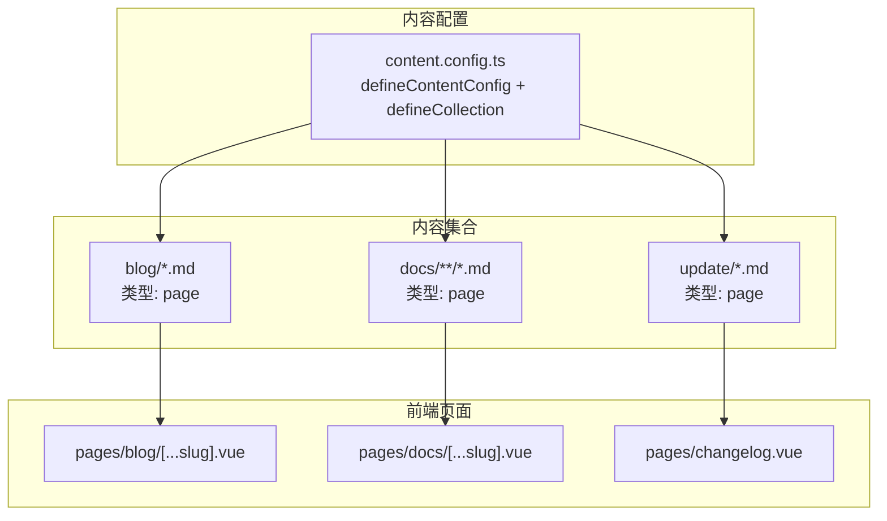
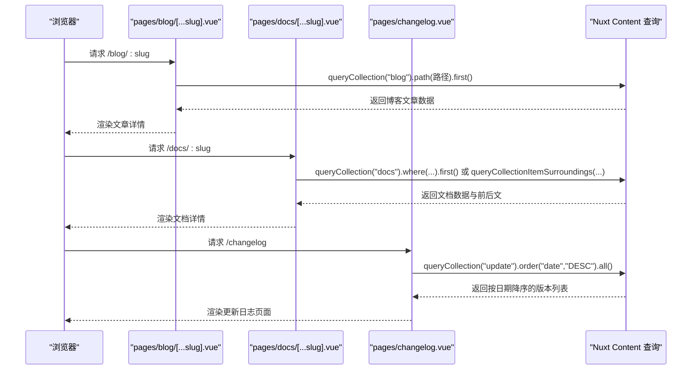
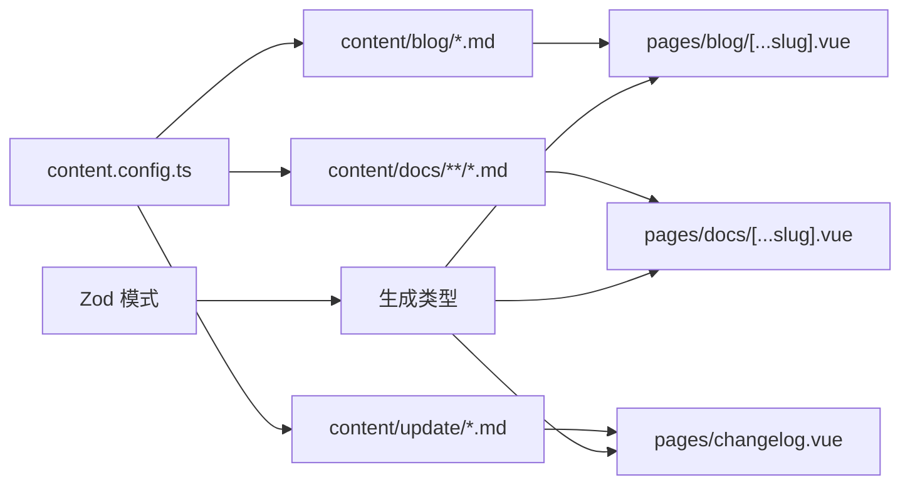

# 内容结构

<cite>
**本文引用的文件**
- [content.config.ts](file://content.config.ts)
- [blog/1.md](file://content/blog/1.md)
- [blog/2.md](file://content/blog/2.md)
- [docs/introduction/1.start.md](file://content/docs/introduction/1.start.md)
- [docs/introduction/1.configuration.md](file://content/docs/introduction/1.configuration.md)
- [update/2503.md](file://content/update/2503.md)
- [update/2504.md](file://content/update/2504.md)
- [pages/blog/[...slug].vue](file://pages/blog/[...slug].vue)
- [pages/docs/[...slug].vue](file://pages/docs/[...slug].vue)
- [pages/changelog.vue](file://pages/changelog.vue)
- [content/docs/framework/define.md](file://content/docs/framework/define.md)
- [content/docs/framework/sources.md](file://content/docs/framework/sources.md)
- [content/docs/framework/types.md](file://content/docs/framework/types.md)
- [content/docs/framework/validators.md](file://content/docs/framework/validators.md)
</cite>

## 目录
1. [引言](#引言)
2. [项目结构](#项目结构)
3. [核心组件](#核心组件)
4. [架构总览](#架构总览)
5. [详细组件分析](#详细组件分析)
6. [依赖分析](#依赖分析)
7. [性能考虑](#性能考虑)
8. [故障排查指南](#故障排查指南)
9. [结论](#结论)

## 引言
本文件围绕项目中的内容配置与数据结构展开，重点解析 content.config.ts 中定义的三个内容集合：blog（博客）、docs（文档）、update（更新日志）。我们将从集合类型与源路径匹配规则入手，深入说明 Zod 模式验证如何确保数据完整性，并解释这些结构化数据如何为前端渲染提供可靠保障。同时，通过对比合法与非法内容文件，帮助读者理解校验规则的实际约束。

## 项目结构
本项目采用 Nuxt Content 的内容驱动架构，内容文件位于 content 目录，分别对应三个集合：
- blog：博客文章，采用 page 类型，源路径为 blog/*.md
- docs：文档，采用 page 类型，源路径为 docs/**/*.md
- update：更新日志，采用 page 类型，源路径为 update/*.md

图表来源
- [content.config.ts](file://content.config.ts#L1-L57)
- [pages/blog/[...slug].vue](file://pages/blog/[...slug].vue#L220-L241)
- [pages/docs/[...slug].vue](file://pages/docs/[...slug].vue#L185-L220)
- [pages/changelog.vue](file://pages/changelog.vue#L121-L123)

章节来源
- [content.config.ts](file://content.config.ts#L1-L57)
- [content/docs/framework/define.md](file://content/docs/framework/define.md#L175-L229)
- [content/docs/framework/sources.md](file://content/docs/framework/sources.md#L25-L56)
- [content/docs/framework/types.md](file://content/docs/framework/types.md#L10-L31)

## 核心组件
本节聚焦 content.config.ts 中三个集合的配置要点与数据结构。

- 博客集合（blog）
  - 类型：page
  - 源路径：blog/*.md
  - 模式字段：
    - tags：字符串数组
    - category：字符串
    - date：日期（Zod date）
    - image：字符串（可选）

- 文档集合（docs）
  - 类型：page
  - 源路径：docs/**/*.md
  - 模式字段：
    - title：字符串
    - description：字符串
    - category：字符串（可选）
    - order：数字（可选，用于排序）
    - links：数组（可选），每项包含 label、icon、to、target（可选）

- 更新日志集合（update）
  - 类型：page
  - 源路径：update/*.md
  - 模式字段：
    - title：字符串
    - description：字符串
    - date：字符串（日期字符串）
    - image：字符串（可选）
    - to：字符串（可选）
    - target：字符串（可选）
    - isMajor：布尔值（可选）
    - authors：数组（可选），每项包含 name、avatar（包含 src、alt）

章节来源
- [content.config.ts](file://content.config.ts#L1-L57)

## 架构总览
下面的序列图展示了前端页面如何通过 Nuxt Content 查询集合并渲染内容。

图表来源
- [pages/blog/[...slug].vue](file://pages/blog/[...slug].vue#L220-L241)
- [pages/docs/[...slug].vue](file://pages/docs/[...slug].vue#L185-L220)
- [pages/changelog.vue](file://pages/changelog.vue#L121-L123)

## 详细组件分析

### 博客集合（blog）
- 类型与源路径
  - 类型：page
  - 源路径：blog/*.md，仅匹配 blog 目录下的一级 Markdown 文件
- 模式验证要点
  - tags：字符串数组，用于分类标签
  - category：字符串，文章分类
  - date：Zod date，确保发布日期格式正确
  - image：字符串（可选），封面图地址
- 前端渲染
  - 页面通过 queryCollection('blog').path(route.path).first() 获取当前文章
  - 使用 date、category、image 等字段渲染头部信息与特色图
  - 通过 queryCollection('blog').order('date','DESC').select('title','path','date').all() 计算“上一篇/下一篇”
- 合法与非法示例（基于模式）
  - 合法：包含 title、description、date、category、tags、image 等字段的 YAML Front Matter，date 为有效日期
  - 非法：date 类型错误（如字符串而非日期）、tags 非数组、缺失必填字段

章节来源
- [content.config.ts](file://content.config.ts#L1-L57)
- [pages/blog/[...slug].vue](file://pages/blog/[...slug].vue#L220-L241)
- [blog/1.md](file://content/blog/1.md#L1-L20)
- [blog/2.md](file://content/blog/2.md#L1-L10)

### 文档集合（docs）
- 类型与源路径
  - 类型：page
  - 源路径：docs/**/*.md，递归匹配 docs 目录下所有 Markdown 文件
- 模式验证要点
  - title、description：文档标题与描述
  - category：字符串（可选）
  - order：数字（可选），用于排序
  - links：数组（可选），每项包含 label、icon、to、target（可选）
- 前端渲染
  - 页面通过 queryCollection('docs').where('path','=',cleanPath).first() 获取当前文档
  - 通过 queryCollectionItemSurroundings('docs', currentPath, { fields: ['title','path'] }) 获取前后文
  - 使用 title、description 渲染页面标题与描述
- 合法与非法示例（基于模式）
  - 合法：包含 title、description，可选 category、order、links 数组，links 每项字段齐全
  - 非法：order 非数字、links 中某项缺少 label/icon/to、links 非数组

章节来源
- [content.config.ts](file://content.config.ts#L1-L57)
- [pages/docs/[...slug].vue](file://pages/docs/[...slug].vue#L185-L220)
- [docs/introduction/1.start.md](file://content/docs/introduction/1.start.md#L1-L20)
- [docs/introduction/1.configuration.md](file://content/docs/introduction/1.configuration.md#L1-L10)

### 更新日志集合（update）
- 类型与源路径
  - 类型：page
  - 源路径：update/*.md，仅匹配 update 目录下的一级 Markdown 文件
- 模式验证要点
  - title、description：版本标题与简介
  - date：字符串（日期字符串）
  - image、to、target：字符串（可选）
  - isMajor：布尔值（可选），标记主要版本
  - authors：数组（可选），每项包含 name、avatar（包含 src、alt）
- 前端渲染
  - 页面通过 queryCollection('update').order('date','DESC').all() 获取版本列表
  - 使用 isMajor 控制侧边栏标记颜色，date 渲染版本时间
- 合法与非法示例（基于模式）
  - 合法：包含 title、description、date，可选 image、to、target、isMajor、authors 数组，authors 每项字段齐全
  - 非法：date 非字符串、isMajor 非布尔、authors 非数组或某项缺少 name/avatar/src/alt

章节来源
- [content.config.ts](file://content.config.ts#L1-L57)
- [pages/changelog.vue](file://pages/changelog.vue#L121-L123)
- [update/2503.md](file://content/update/2503.md#L1-L12)
- [update/2504.md](file://content/update/2504.md#L1-L11)

### Zod 模式验证与数据完整性
- 验证器选择
  - 项目使用 Zod（zod/v4）进行模式定义，支持原生 JSON Schema 导出
- 校验范围
  - 博客：tags（数组）、category（字符串）、date（日期）、image（可选字符串）
  - 文档：title（字符串）、description（字符串）、category（可选）、order（可选数字）、links（可选数组）
  - 更新日志：title（字符串）、description（字符串）、date（字符串）、image（可选）、to（可选）、target（可选）、isMajor（可选布尔）、authors（可选数组）
- 类型安全与 Studio 表单
  - 模式确保数据一致性，并驱动生成的类型与 Studio 表单
- 日期序列化
  - 日期在底层序列化为 ISO 字符串（JSON Schema format: date-time）

章节来源
- [content/docs/framework/validators.md](file://content/docs/framework/validators.md#L1-L130)
- [content/docs/framework/define.md](file://content/docs/framework/define.md#L175-L229)

### 源路径匹配规则与集合类型
- 源路径匹配
  - blog：blog/*.md，仅一级目录
  - docs：docs/**/*.md，递归匹配
  - update：update/*.md，仅一级目录
- 集合类型
  - 三者均为 page 类型，适合与页面一一映射的场景
  - 自动生成路径，便于 URL 映射与路由生成

章节来源
- [content/docs/framework/sources.md](file://content/docs/framework/sources.md#L25-L56)
- [content/docs/framework/types.md](file://content/docs/framework/types.md#L10-L31)

## 依赖分析
- 配置到内容
  - content.config.ts 定义集合类型、源路径与模式
  - content 目录中的 Markdown 文件作为数据源
- 内容到页面
  - pages/blog/[...slug].vue、pages/docs/[...slug].vue、pages/changelog.vue 通过 queryCollection 查询集合数据
- 模式到类型
  - Zod 模式生成类型，保证前端消费数据时的类型安全

图表来源
- [content.config.ts](file://content.config.ts#L1-L57)
- [pages/blog/[...slug].vue](file://pages/blog/[...slug].vue#L220-L241)
- [pages/docs/[...slug].vue](file://pages/docs/[...slug].vue#L185-L220)
- [pages/changelog.vue](file://pages/changelog.vue#L121-L123)
- [content/docs/framework/validators.md](file://content/docs/framework/validators.md#L1-L130)

章节来源
- [content.config.ts](file://content.config.ts#L1-L57)
- [pages/blog/[...slug].vue](file://pages/blog/[...slug].vue#L220-L241)
- [pages/docs/[...slug].vue](file://pages/docs/[...slug].vue#L185-L220)
- [pages/changelog.vue](file://pages/changelog.vue#L121-L123)

## 性能考虑
- 查询优化
  - 使用 select 仅获取必要字段（如 docs 中的 title、path、date），减少传输与渲染开销
  - 使用 order('date','DESC') 对更新日志进行排序，避免前端二次排序
- 路由与路径
  - page 类型集合自动生成路径，减少手工映射成本
- 并行数据获取
  - 文档页面使用 Promise.all 并行获取当前页面与前后文，提升首屏渲染速度

章节来源
- [pages/blog/[...slug].vue](file://pages/blog/[...slug].vue#L225-L241)
- [pages/docs/[...slug].vue](file://pages/docs/[...slug].vue#L185-L220)
- [pages/changelog.vue](file://pages/changelog.vue#L121-L123)

## 故障排查指南
- 常见校验错误
  - 字段类型不符：如博客的 date 非日期、文档的 order 非数字、更新日志的 isMajor 非布尔
  - 结构缺失：如 authors 非数组或缺少 name/avatar/src/alt
  - Front Matter 缺失：缺少 title、description 等必填字段
- 定位方法
  - 检查 content.config.ts 中对应集合的 schema 定义
  - 对照各集合的合法示例文件（如 blog/1.md、docs/introduction/1.start.md、update/2504.md）
- 修复建议
  - 严格遵循 Zod 模式定义的字段类型与可选性
  - 使用 date 类型时确保格式正确（Zod date 会进行日期校验）

章节来源
- [content.config.ts](file://content.config.ts#L1-L57)
- [blog/1.md](file://content/blog/1.md#L1-L20)
- [docs/introduction/1.start.md](file://content/docs/introduction/1.start.md#L1-L20)
- [update/2504.md](file://content/update/2504.md#L1-L11)

## 结论
通过在 content.config.ts 中为三个集合定义明确的类型、源路径与 Zod 模式，项目实现了强一致性的内容数据模型。博客、文档与更新日志各自的关键字段（tags/category/date、title/description/order/links、title/description/date/isMajor/authors）在前端页面中被稳定消费，配合查询优化与并行加载，确保了良好的用户体验与可维护性。遵循模式定义与合法示例，可有效避免数据层面的错误，提升整体质量与稳定性。