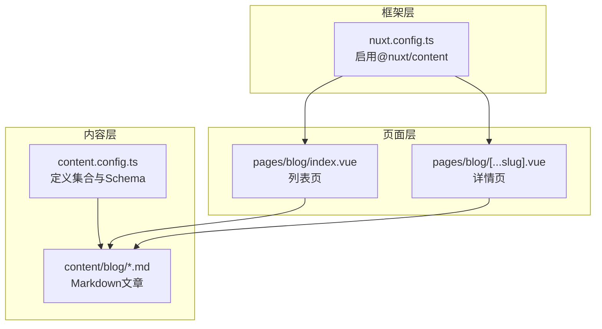
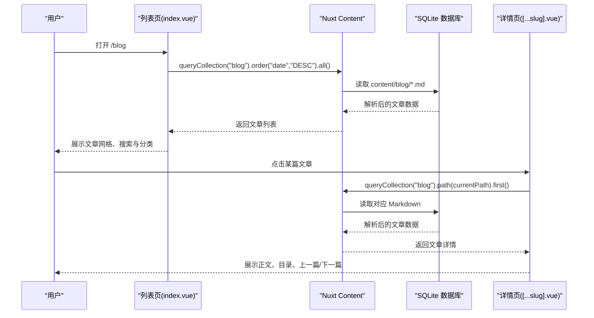
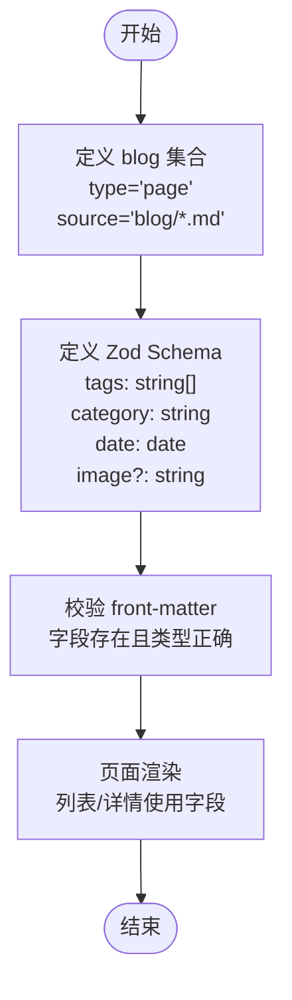
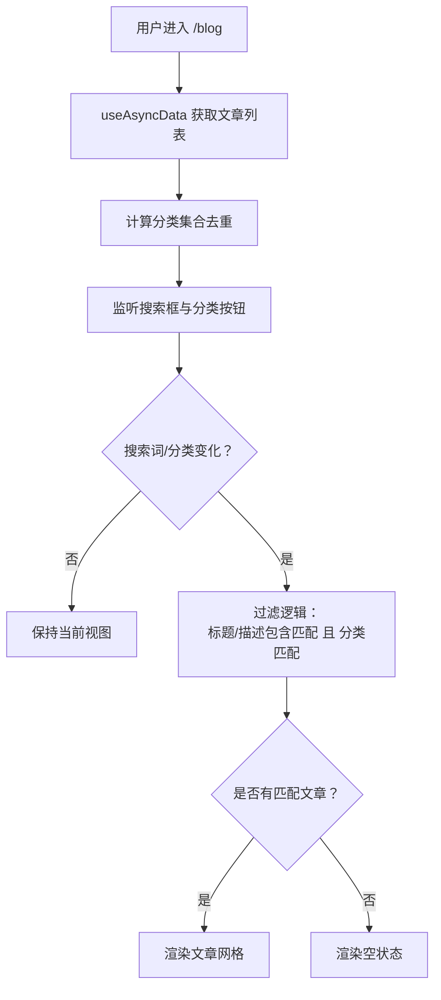
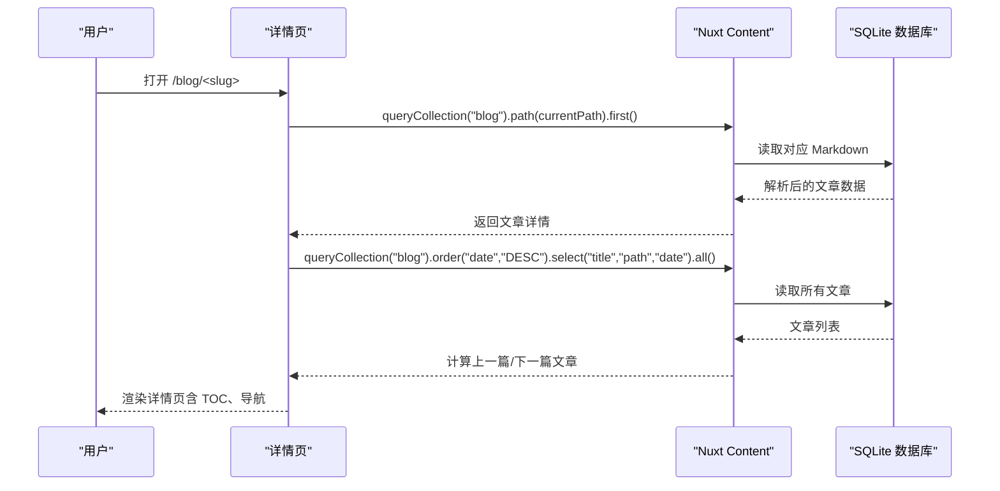
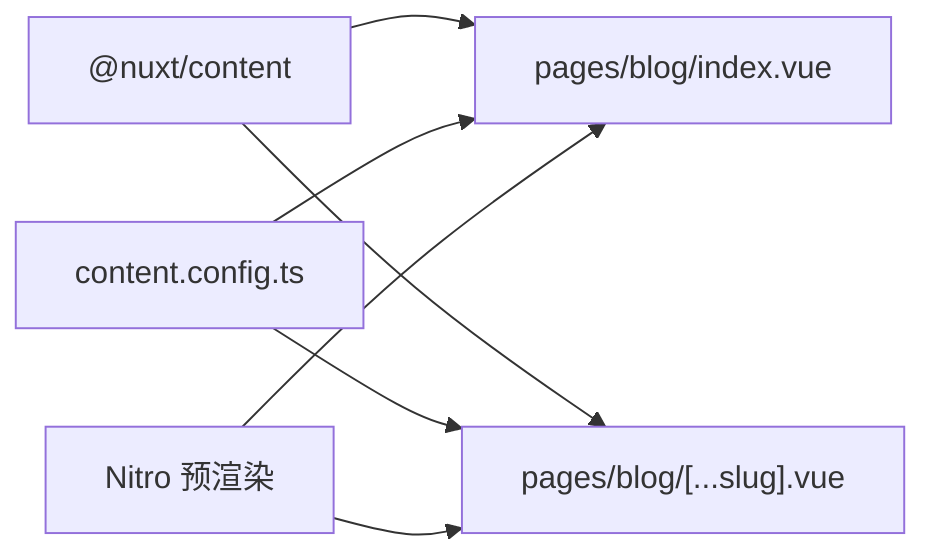

# 博客系统

<cite>
**本文引用的文件**
- [content.config.ts](file://content.config.ts)
- [nuxt.config.ts](file://nuxt.config.ts)
- [pages/blog/index.vue](file://pages/blog/index.vue)
- [pages/blog/[...slug].vue](file://pages/blog/[...slug].vue)
- [content/blog/1.md](file://content/blog/1.md)
- [content/blog/2.md](file://content/blog/2.md)
- [content/blog/3.md](file://content/blog/3.md)
- [content/blog/4.md](file://content/blog/4.md)
</cite>

## 目录
1. [简介](#简介)
2. [项目结构](#项目结构)
3. [核心组件](#核心组件)
4. [架构总览](#架构总览)
5. [详细组件分析](#详细组件分析)
6. [依赖关系分析](#依赖关系分析)
7. [性能考量](#性能考量)
8. [故障排查指南](#故障排查指南)
9. [结论](#结论)
10. [附录](#附录)

## 简介
本文件系统性地介绍博客系统的设计与实现，重点围绕以下方面展开：
- content/blog/ 目录中的 Markdown 文档如何构成博客文章集合；
- 每篇博客必须包含的元数据（front-matter）及其由 content.config.ts 中 Zod schema 强制定义；
- pages/blog/index.vue 如何获取并展示博客列表，包括搜索、分类筛选的实现思路；
- 创建新博客文章的完整步骤：从创建 .md 文件、正确填写元数据，到本地预览与发布。

## 项目结构
博客系统主要由以下部分组成：
- 内容配置：content.config.ts 定义内容集合与字段校验；
- 博客列表页：pages/blog/index.vue 展示文章列表、搜索与分类筛选；
- 博客详情页：pages/blog/[...slug].vue 渲染具体文章、目录导航与“上一篇/下一篇”；
- 文章内容：content/blog/*.md 为 Markdown 文档，包含 front-matter 元数据与正文；
- Nuxt 配置：nuxt.config.ts 启用 @nuxt/content 模块，并配置数据库与静态输出。

**图表来源**
- [content.config.ts](file://content.config.ts#L1-L57)
- [nuxt.config.ts](file://nuxt.config.ts#L1-L91)
- [pages/blog/index.vue](file://pages/blog/index.vue#L1-L153)
- [pages/blog/[...slug].vue](file://pages/blog/[...slug].vue#L1-L366)

**章节来源**
- [content.config.ts](file://content.config.ts#L1-L57)
- [nuxt.config.ts](file://nuxt.config.ts#L1-L91)
- [pages/blog/index.vue](file://pages/blog/index.vue#L1-L153)
- [pages/blog/[...slug].vue](file://pages/blog/[...slug].vue#L1-L366)

## 核心组件
- 内容集合与 Schema
  - blog 集合类型为 page，数据源匹配 content/blog/*.md；
  - 元数据字段由 Zod schema 强制定义，包括 tags（字符串数组）、category（字符串）、date（日期）、image（可选字符串）。
- 博客列表页
  - 使用 queryCollection('blog') 获取文章集合，按 date 降序排序；
  - 提供搜索框与分类按钮，实现标题/描述匹配与分类筛选；
  - 支持空状态提示。
- 博客详情页
  - 通过当前路由 path 查询对应文章；
  - 渲染文章头部信息（分类、日期、阅读时长）、特色图、正文内容；
  - 提供“上一篇/下一篇”导航与目录导航（TOC）。

**章节来源**
- [content.config.ts](file://content.config.ts#L1-L57)
- [pages/blog/index.vue](file://pages/blog/index.vue#L106-L152)
- [pages/blog/[...slug].vue](file://pages/blog/[...slug].vue#L205-L338)

## 架构总览
博客系统采用 Nuxt Content 模块驱动的内容管理架构：
- 内容采集：@nuxt/content 读取 content/blog/*.md；
- 数据校验：Zod schema 在构建期/运行期对 front-matter 进行强类型校验；
- 页面渲染：列表页与详情页分别通过 queryCollection API 获取数据并渲染；
- 输出策略：Nitro 静态预渲染，适合静态托管环境。

**图表来源**
- [pages/blog/index.vue](file://pages/blog/index.vue#L120-L142)
- [pages/blog/[...slug].vue](file://pages/blog/[...slug].vue#L221-L240)
- [nuxt.config.ts](file://nuxt.config.ts#L18-L21)

**章节来源**
- [pages/blog/index.vue](file://pages/blog/index.vue#L120-L142)
- [pages/blog/[...slug].vue](file://pages/blog/[...slug].vue#L221-L240)
- [nuxt.config.ts](file://nuxt.config.ts#L18-L21)

## 详细组件分析

### 内容集合与元数据 Schema
- 集合定义
  - 类型：page；
  - 数据源：content/blog/*.md；
  - Schema 字段：
    - tags：字符串数组；
    - category：字符串；
    - date：日期；
    - image：可选字符串（封面图）。
- 作用
  - 在构建期/运行期对每篇 Markdown 的 front-matter 进行强类型校验，确保字段存在且类型正确；
  - 为后续页面渲染提供稳定的字段结构。

**图表来源**
- [content.config.ts](file://content.config.ts#L1-L57)

**章节来源**
- [content.config.ts](file://content.config.ts#L1-L57)

### 博客列表页（pages/blog/index.vue）
- 数据获取
  - 使用 queryCollection('blog').order('date','DESC').all() 获取所有文章并按日期降序排序。
- 展示逻辑
  - 使用 NuxtLink 渲染文章卡片，包含封面图、分类标签、日期、标题、摘要与“阅读全文”链接。
- 搜索与筛选
  - 搜索：对文章标题与描述进行不区分大小写的包含匹配；
  - 分类：从文章集合中提取唯一分类，生成分类按钮，点击切换筛选条件；
  - 结果：仅显示同时满足搜索与分类条件的文章。
- 空状态
  - 当无匹配文章时，显示“未找到相关文章”的提示。

**图表来源**
- [pages/blog/index.vue](file://pages/blog/index.vue#L116-L152)

**章节来源**
- [pages/blog/index.vue](file://pages/blog/index.vue#L1-L153)

### 博客详情页（pages/blog/[...slug].vue）
- 数据获取
  - 通过当前路由 path 查询对应文章：queryCollection('blog').path(currentPath).first()；
  - 通过查询所有文章并计算索引，实现“上一篇/下一篇”导航。
- 展示逻辑
  - 头部信息：分类、日期、阅读时长；
  - 特色图：当存在 image 时显示；
  - 正文：使用 ContentRenderer 渲染 Markdown；
  - 底部操作：返回列表、复制链接；
  - 目录导航（TOC）：基于文章标题层级生成，滚动时高亮激活项。
- SEO
  - 根据文章 title/description/image 设置页面元数据。

**图表来源**
- [pages/blog/[...slug].vue](file://pages/blog/[...slug].vue#L221-L240)
- [pages/blog/[...slug].vue](file://pages/blog/[...slug].vue#L242-L318)

**章节来源**
- [pages/blog/[...slug].vue](file://pages/blog/[...slug].vue#L1-L366)

### 文章示例与元数据
- 示例文章
  - content/blog/1.md、2.md、3.md、4.md 均包含标准 front-matter（title、description、date、category、tags、image 等）。
- 元数据字段
  - title：文章标题；
  - description：文章描述；
  - date：发布日期（列表按该字段降序排序）；
  - category：分类；
  - tags：标签数组；
  - image：封面图（可选）。

**章节来源**
- [content/blog/1.md](file://content/blog/1.md#L1-L20)
- [content/blog/2.md](file://content/blog/2.md#L1-L10)
- [content/blog/3.md](file://content/blog/3.md#L1-L20)
- [content/blog/4.md](file://content/blog/4.md#L1-L10)

## 依赖关系分析
- 模块依赖
  - @nuxt/content：提供 Markdown 解析、查询 API 与内容数据库；
  - @nuxt/ui：UI 组件库（基于 Tailwind CSS）；
  - Nitro：静态预渲染与输出配置。
- 内容依赖
  - content.config.ts 定义 blog 集合与 Schema；
  - pages/blog/index.vue 与 pages/blog/[...slug].vue 依赖 queryCollection API 获取数据。

**图表来源**
- [nuxt.config.ts](file://nuxt.config.ts#L18-L21)
- [content.config.ts](file://content.config.ts#L1-L57)
- [pages/blog/index.vue](file://pages/blog/index.vue#L120-L142)
- [pages/blog/[...slug].vue](file://pages/blog/[...slug].vue#L221-L240)

**章节来源**
- [nuxt.config.ts](file://nuxt.config.ts#L18-L21)
- [content.config.ts](file://content.config.ts#L1-L57)
- [pages/blog/index.vue](file://pages/blog/index.vue#L120-L142)
- [pages/blog/[...slug].vue](file://pages/blog/[...slug].vue#L221-L240)

## 性能考量
- 列表页
  - 使用本地过滤（内存中 filter）实现搜索与分类筛选，适合中小规模文章集；
  - 若文章数量增长，建议在查询阶段加入过滤条件，减少前端处理压力。
- 详情页
  - “上一篇/下一篇”导航通过全量查询再定位索引实现，适合中小规模；
  - 若文章较多，可考虑在查询阶段使用分页或游标分页，减少一次性加载的数据量。
- 预渲染
  - Nitro 静态预渲染可提升首屏性能与 SEO，但需注意构建时间与磁盘占用。

[本节为通用指导，不直接分析具体文件]

## 故障排查指南
- front-matter 校验失败
  - 现象：构建时报错，提示字段缺失或类型不符；
  - 排查：检查 content/blog/*.md 的 front-matter 是否包含 tags、category、date、image（可选）等字段，且类型与 Schema 一致。
- 列表为空或筛选无结果
  - 现象：列表页显示空状态；
  - 排查：确认 content/blog/*.md 是否存在且命名规范；检查分类是否与文章实际分类一致；确认搜索关键词与文章标题/描述匹配。
- 详情页 404
  - 现象：访问 /blog/<slug> 显示“文章未找到”；
  - 排查：确认 Markdown 文件路径与路由一致；检查 front-matter 中的 date、category、tags 等字段是否正确。
- 预渲染问题
  - 现象：构建失败或预渲染异常；
  - 排查：查看 Nitro 预渲染配置与路由注入情况；确认 content/blog/*.md 内容完整。

**章节来源**
- [content.config.ts](file://content.config.ts#L1-L57)
- [pages/blog/index.vue](file://pages/blog/index.vue#L131-L152)
- [pages/blog/[...slug].vue](file://pages/blog/[...slug].vue#L136-L140)
- [nuxt.config.ts](file://nuxt.config.ts#L40-L51)

## 结论
本博客系统以 Nuxt Content 为核心，通过 content.config.ts 的 Zod Schema 对 Markdown front-matter 进行强类型约束，确保数据一致性；pages/blog/index.vue 与 pages/blog/[...slug].vue 分别承担列表与详情的展示职责，配合 Nitro 静态预渲染，形成一套简洁高效的博客内容管理方案。对于更大规模的内容，可在查询阶段引入过滤与分页策略，进一步优化性能与用户体验。

[本节为总结性内容，不直接分析具体文件]

## 附录

### 创建新博客文章的完整步骤
- 准备工作
  - 确认 content.config.ts 中 blog 集合的 Schema 已定义所需字段（tags、category、date、image 可选）。
- 创建 Markdown 文件
  - 在 content/blog/ 目录下新增 .md 文件，命名建议使用语义化名称（如 5.md）。
- 填写 front-matter
  - 必填字段：title、description、date、category、tags；
  - 可选字段：image（封面图）。
- 本地预览
  - 启动开发服务器，访问 /blog 查看列表，点击新建文章预览详情页；
  - 确认列表页排序、分类、搜索与详情页渲染均正常。
- 发布
  - 构建项目并部署至静态托管平台（Nitro 静态输出）。

**章节来源**
- [content.config.ts](file://content.config.ts#L1-L57)
- [pages/blog/index.vue](file://pages/blog/index.vue#L120-L142)
- [pages/blog/[...slug].vue](file://pages/blog/[...slug].vue#L221-L240)
- [nuxt.config.ts](file://nuxt.config.ts#L40-L51)