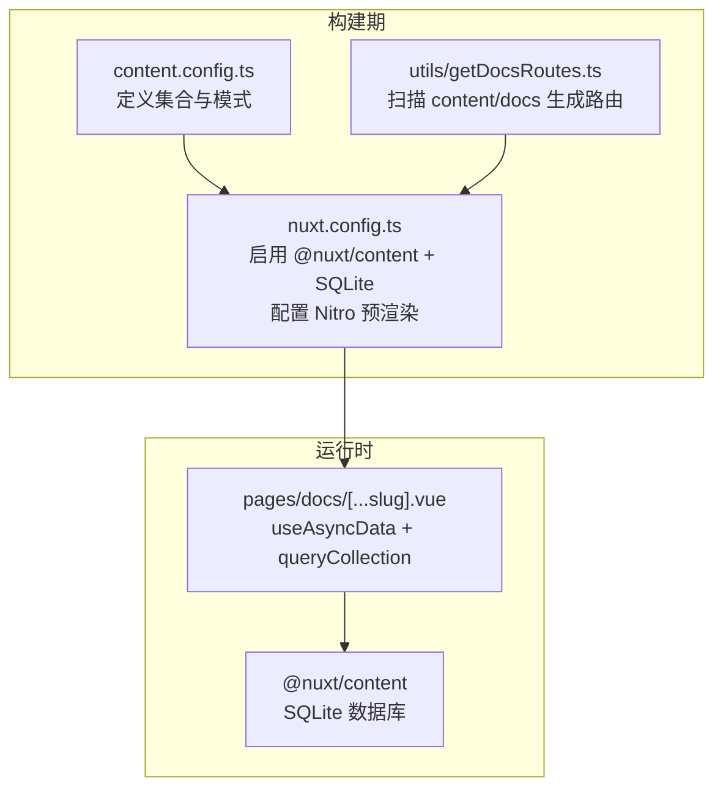
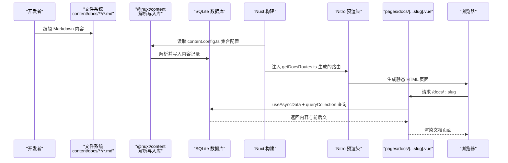
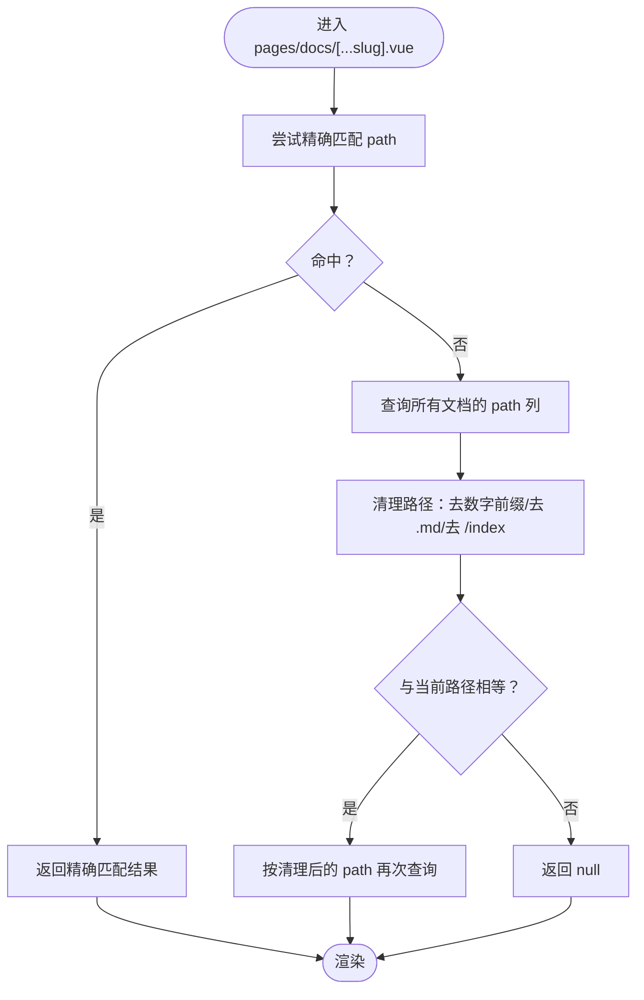
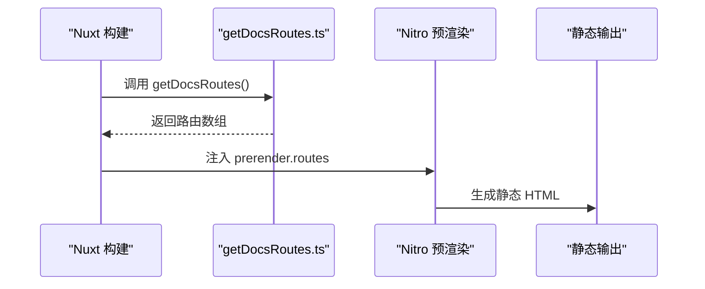
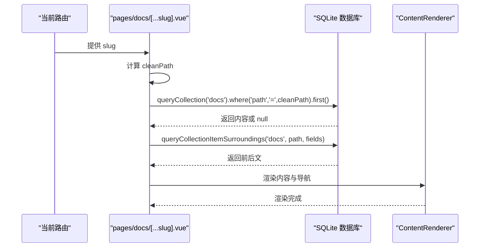
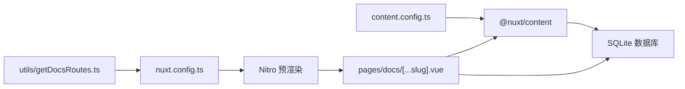

# 数据流与路由机制

<cite>
**本文引用的文件**
- [content.config.ts](file://content.config.ts)
- [nuxt.config.ts](file://nuxt.config.ts)
- [utils/getDocsRoutes.ts](file://utils/getDocsRoutes.ts)
- [pages/docs/[...slug].vue](file://pages/docs/[...slug].vue)
- [content/docs/introduction/1.start.md](file://content/docs/introduction/1.start.md)
- [content/docs/framework/types.md](file://content/docs/framework/types.md)
- [package.json](file://package.json)
</cite>

## 目录
1. [引言](#引言)
2. [项目结构](#项目结构)
3. [核心组件](#核心组件)
4. [架构总览](#架构总览)
5. [详细组件分析](#详细组件分析)
6. [依赖分析](#依赖分析)
7. [性能考量](#性能考量)
8. [故障排查指南](#故障排查指南)
9. [结论](#结论)
10. [附录](#附录)

## 引言
本架构文档围绕内容驱动应用的数据流与路由机制展开，重点阐述从源文件到最终渲染的完整生命周期：@nuxt/content 模块依据 content.config.ts 的集合配置，将 content/ 目录下的 Markdown 文件解析并存储到 SQLite 数据库；在页面 pages/docs/[...slug].vue 中，通过 useAsyncData 与 queryCollection API 从数据库查询对应路径的内容；同时，utils/getDocsRoutes.ts 在构建阶段扫描文件系统，生成所有文档的静态路由列表，供 Nitro 引擎进行预渲染。本文将解释这种“构建时生成 + 运行时查询”的混合模式在 SEO 友好性、加载性能与灵活性方面的优势，并通过序列图与流程图清晰展示数据流过程。

## 项目结构
该项目采用 Nuxt 4 + @nuxt/content 的内容驱动架构，核心目录与职责如下：
- content/：存放 Markdown 内容，按集合划分（docs、blog、update 等）
- pages/docs/[...slug].vue：文档详情页，负责运行时查询与渲染
- utils/getDocsRoutes.ts：构建期生成文档路由清单
- nuxt.config.ts：启用 @nuxt/content、配置 SQLite 数据库与 Nitro 预渲染
- content.config.ts：定义集合类型、来源与字段模式(schema)

**图表来源**
- [content.config.ts](file://content.config.ts#L1-L57)
- [utils/getDocsRoutes.ts](file://utils/getDocsRoutes.ts#L1-L58)
- [nuxt.config.ts](file://nuxt.config.ts#L1-L91)
- [pages/docs/[...slug].vue](file://pages/docs/[...slug].vue#L1-L348)

**章节来源**
- [content.config.ts](file://content.config.ts#L1-L57)
- [nuxt.config.ts](file://nuxt.config.ts#L1-L91)
- [utils/getDocsRoutes.ts](file://utils/getDocsRoutes.ts#L1-L58)
- [pages/docs/[...slug].vue](file://pages/docs/[...slug].vue#L1-L348)

## 核心组件
- 内容集合配置（content.config.ts）
  - 定义 blog、docs、update 三个集合，分别指定类型、来源与字段模式(schema)，确保内容解析与校验一致。
- 构建期路由生成（utils/getDocsRoutes.ts）
  - 递归扫描 content/docs，去除数字前缀与 .md 后缀，生成 /docs 下的静态路由列表，注入 Nitro 预渲染。
- 运行时查询与渲染（pages/docs/[...slug].vue）
  - 使用 useAsyncData 并行查询当前路径内容与前后文，支持精确匹配与清理后的回退匹配，最终通过 ContentRenderer 渲染。
- Nuxt 配置（nuxt.config.ts）
  - 启用 @nuxt/content 与 SQLite 数据库，设置 Nitro 静态输出与预渲染路由，保证 SEO 与首屏性能。

**章节来源**
- [content.config.ts](file://content.config.ts#L1-L57)
- [utils/getDocsRoutes.ts](file://utils/getDocsRoutes.ts#L1-L58)
- [pages/docs/[...slug].vue](file://pages/docs/[...slug].vue#L170-L226)
- [nuxt.config.ts](file://nuxt.config.ts#L1-L91)

## 架构总览
整体架构由“构建期”和“运行时”两部分组成：
- 构建期：@nuxt/content 解析 Markdown 并写入 SQLite；Nitro 基于 getDocsRoutes.ts 生成静态页面。
- 运行时：页面通过 useAsyncData + queryCollection 从 SQLite 查询内容，渲染文档与导航。

**图表来源**
- [content.config.ts](file://content.config.ts#L1-L57)
- [utils/getDocsRoutes.ts](file://utils/getDocsRoutes.ts#L1-L58)
- [nuxt.config.ts](file://nuxt.config.ts#L1-L91)
- [pages/docs/[...slug].vue](file://pages/docs/[...slug].vue#L170-L226)

## 详细组件分析

### 组件A：内容集合与数据库
- 功能要点
  - content.config.ts 定义集合类型、来源与字段模式(schema)，确保内容解析一致性与类型安全。
  - nuxt.config.ts 启用 @nuxt/content 并将数据库类型设置为 SQLite，使查询与渲染在运行时直接访问本地数据库。
- 数据结构与复杂度
  - 集合按来源匹配（如 docs/**/*.md），查询基于 where 条件与 select 字段，典型 O(log n) 到 O(n) 的范围取决于索引与过滤条件。
- 依赖链
  - content.config.ts → @nuxt/content → SQLite 数据库 → pages/docs/[...slug].vue 的 queryCollection 查询。
- 性能与优化
  - 建议为常用过滤字段（如 path）建立索引，以提升 where 查询与排序性能。
- 错误处理
  - 若集合未定义或模式不匹配，@nuxt/content 会在构建期或运行时报错；需核对 content.config.ts 的字段与来源。

**图表来源**
- [pages/docs/[...slug].vue](file://pages/docs/[...slug].vue#L185-L215)

**章节来源**
- [content.config.ts](file://content.config.ts#L1-L57)
- [nuxt.config.ts](file://nuxt.config.ts#L32-L41)
- [pages/docs/[...slug].vue](file://pages/docs/[...slug].vue#L185-L215)

### 组件B：构建期路由生成与预渲染
- 功能要点
  - utils/getDocsRoutes.ts 递归扫描 content/docs，去除数字前缀与 .md 后缀，生成 /docs 下的静态路由列表。
  - nuxt.config.ts 将 getDocsRoutes() 注入 Nitro 的 prerender.routes，确保所有文档页面在构建时生成静态 HTML。
- 数据流
  - 构建阶段：读取文件系统 → 生成路由数组 → Nitro 预渲染 → 输出静态页面。
  - 运行阶段：浏览器请求静态页面，无需运行时查询，首屏更快、SEO 更友好。
- 优势
  - SEO 友好：静态 HTML 可被搜索引擎直接抓取。
  - 加载性能：无需等待运行时查询，首屏渲染更快。
  - 灵活性：仍可在运行时补充动态数据（如前后文导航），兼顾静态与动态。

**图表来源**
- [utils/getDocsRoutes.ts](file://utils/getDocsRoutes.ts#L1-L58)
- [nuxt.config.ts](file://nuxt.config.ts#L47-L51)

**章节来源**
- [utils/getDocsRoutes.ts](file://utils/getDocsRoutes.ts#L1-L58)
- [nuxt.config.ts](file://nuxt.config.ts#L41-L51)

### 组件C：运行时查询与渲染
- 功能要点
  - pages/docs/[...slug].vue 使用 useAsyncData 并行查询当前路径内容与前后文，支持精确匹配与清理后的回退匹配。
  - 通过 ContentRenderer 渲染解析后的 AST 内容，配合面包屑、侧边栏与目录导航。
- 错误处理
  - 当查询不到内容时设置 404 状态，页面显示“文档未找到”提示。
- 性能与优化
  - 并行查询减少等待时间；清理路径逻辑避免因文件命名数字前缀导致的路径不一致问题。

**图表来源**
- [pages/docs/[...slug].vue](file://pages/docs/[...slug].vue#L170-L226)

**章节来源**
- [pages/docs/[...slug].vue](file://pages/docs/[...slug].vue#L170-L226)

### 组件D：集合类型与路径生成
- 功能要点
  - content/docs/framework/types.md 描述了 page 与 data 两类集合类型及其默认字段（如 path、title、description、body、navigation 等）。
  - page 类型会自动生成路径，便于与 URL 映射；data 类型用于结构化数据查询。
- 实践意义
  - docs 集合采用 page 类型，确保每篇文档都有标准字段与自动生成的 path，便于 queryCollection('docs').where('path', '=', ...) 精确查询。

**章节来源**
- [content/docs/framework/types.md](file://content/docs/framework/types.md#L1-L141)

## 依赖分析
- 模块耦合
  - pages/docs/[...slug].vue 依赖 @nuxt/content 的 queryCollection 与 queryCollectionItemSurroundings。
  - nuxt.config.ts 依赖 utils/getDocsRoutes.ts 生成的路由列表。
  - content.config.ts 为 @nuxt/content 的输入，决定内容解析与数据库结构。
- 外部依赖
  - SQLite 数据库（由 @nuxt/content 驱动）。
  - Nitro 预渲染引擎（静态输出与路由注入）。
- 潜在循环依赖
  - 无直接循环依赖；各模块职责清晰：配置 → 构建 → 预渲染 → 运行时查询。

**图表来源**
- [content.config.ts](file://content.config.ts#L1-L57)
- [utils/getDocsRoutes.ts](file://utils/getDocsRoutes.ts#L1-L58)
- [nuxt.config.ts](file://nuxt.config.ts#L1-L91)
- [pages/docs/[...slug].vue](file://pages/docs/[...slug].vue#L170-L226)

**章节来源**
- [content.config.ts](file://content.config.ts#L1-L57)
- [utils/getDocsRoutes.ts](file://utils/getDocsRoutes.ts#L1-L58)
- [nuxt.config.ts](file://nuxt.config.ts#L1-L91)
- [pages/docs/[...slug].vue](file://pages/docs/[...slug].vue#L170-L226)

## 性能考量
- 首屏性能
  - 构建期预渲染生成静态 HTML，浏览器直接获取，无需等待运行时查询。
- 查询性能
  - 建议为 path 等高频过滤字段建立索引，减少 where 查询与排序开销。
- 并行加载
  - useAsyncData 并行查询内容与前后文，缩短等待时间。
- 路由生成策略
  - 去除数字前缀与 .md 后缀，确保 URL 与文件系统的一致性，减少回退匹配次数。

[本节为通用性能建议，不直接分析具体文件]

## 故障排查指南
- 文档 404
  - 现象：页面显示“文档未找到”，状态码为 404。
  - 排查：确认 content/docs 下是否存在对应 Markdown；检查 content.config.ts 的 docs 集合是否正确；确认 nuxt.config.ts 的 Nitro 预渲染是否包含该路由。
- 路由不生效
  - 现象：访问 /docs/:slug 返回 404。
  - 排查：检查 utils/getDocsRoutes.ts 是否生成该路由；确认 nuxt.config.ts 的 prerender.routes 是否包含该路由。
- 内容渲染异常
  - 现象：页面空白或渲染错误。
  - 排查：检查 pages/docs/[...slug].vue 的 queryCollection 查询是否返回内容；确认 ContentRenderer 是否正确渲染。
- 集合模式不匹配
  - 现象：构建或运行时报错。
  - 排查：核对 content.config.ts 的字段模式(schema)与实际 Markdown frontmatter 是否一致。

**章节来源**
- [pages/docs/[...slug].vue](file://pages/docs/[...slug].vue#L222-L226)
- [utils/getDocsRoutes.ts](file://utils/getDocsRoutes.ts#L1-L58)
- [nuxt.config.ts](file://nuxt.config.ts#L47-L51)
- [content.config.ts](file://content.config.ts#L1-L57)

## 结论
本项目通过“构建时生成 + 运行时查询”的混合模式，实现了内容驱动应用的高性能与高灵活性：
- 构建期：@nuxt/content 解析 Markdown 并写入 SQLite，Nitro 基于 getDocsRoutes.ts 生成静态页面，确保 SEO 友好与首屏性能。
- 运行时：pages/docs/[...slug].vue 使用 useAsyncData 与 queryCollection 查询内容，支持精确匹配与回退匹配，渲染文档与导航。
- 优势：静态输出 + 运行时查询的组合，兼顾 SEO、加载性能与内容管理的灵活性。

[本节为总结性内容，不直接分析具体文件]

## 附录
- 示例内容文件
  - content/docs/introduction/1.start.md：入门指南示例，展示 frontmatter 与正文结构。
  - content/docs/framework/types.md：集合类型与默认字段说明，指导集合配置与查询。
- 依赖声明
  - package.json 中声明 @nuxt/content、@nuxt/ui、@nuxtjs/color-mode、TailwindCSS 等依赖，确保内容渲染与 UI 组件正常工作。

**章节来源**
- [content/docs/introduction/1.start.md](file://content/docs/introduction/1.start.md#L1-L117)
- [content/docs/framework/types.md](file://content/docs/framework/types.md#L1-L141)
- [package.json](file://package.json#L1-L48)