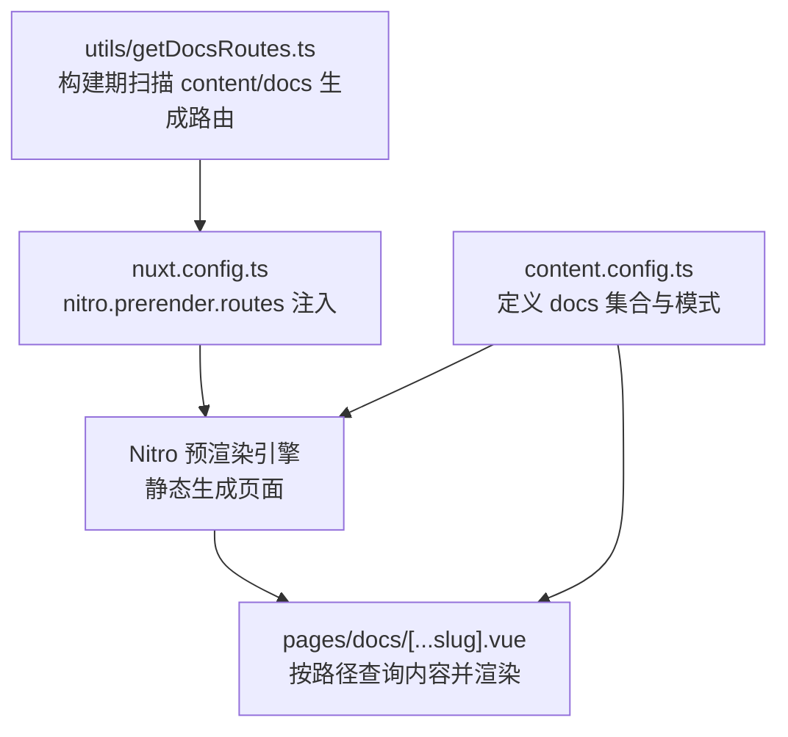
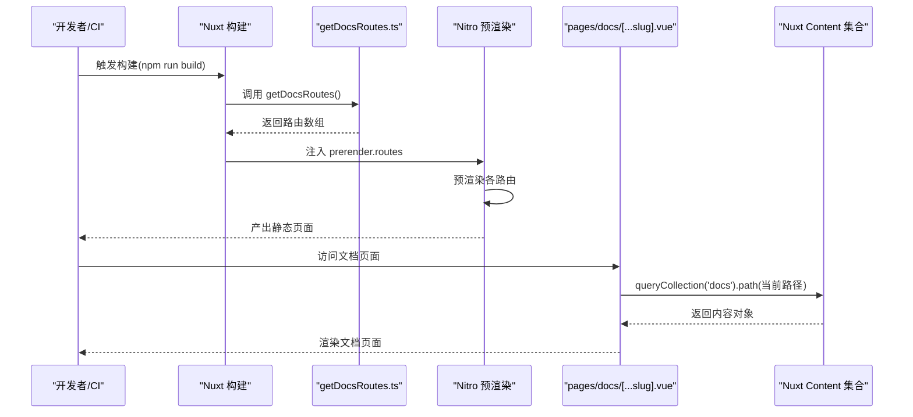
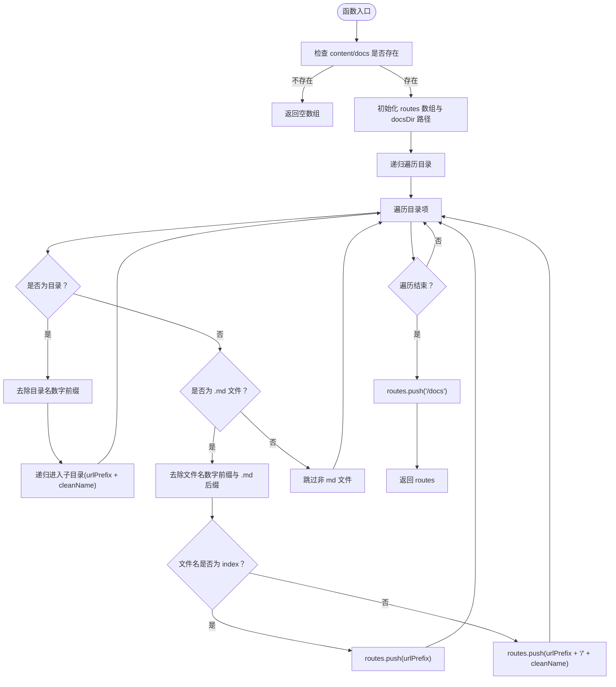
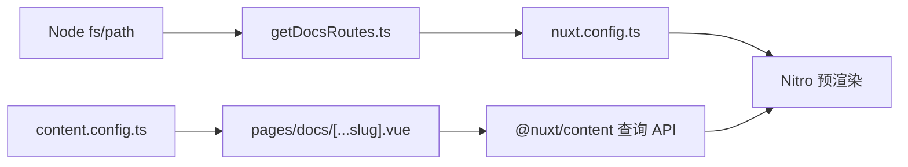

# 构建时路由生成

<cite>
**本文引用的文件**
- [utils/getDocsRoutes.ts](file://utils/getDocsRoutes.ts)
- [content.config.ts](file://content.config.ts)
- [nuxt.config.ts](file://nuxt.config.ts)
- [pages/docs/[...slug].vue](file://pages/docs/[...slug].vue)
- [content/docs/introduction/1.start.md](file://content/docs/introduction/1.start.md)
- [content/docs/framework/types.md](file://content/docs/framework/types.md)
- [package.json](file://package.json)
</cite>

## 目录
1. [引言](#引言)
2. [项目结构](#项目结构)
3. [核心组件](#核心组件)
4. [架构总览](#架构总览)
5. [详细组件分析](#详细组件分析)
6. [依赖关系分析](#依赖关系分析)
7. [性能考量](#性能考量)
8. [故障排查指南](#故障排查指南)
9. [结论](#结论)
10. [附录](#附录)

## 引言
本文件围绕构建时路由生成机制展开，重点解释 utils/getDocsRoutes.ts 如何在应用构建阶段扫描 content/docs/ 目录下的所有 Markdown 文件，依据文件路径与命名规则（如数字前缀、index 文件）生成对应的路由路径，并将其注入到 Nuxt 的 Nitro 预渲染配置中，以实现静态预渲染，提升页面加载性能与 SEO 效果。同时，结合 content.config.ts 中定义的内容集合配置，说明路由生成与内容集合之间的关系，并给出在 CI/CD 流程中的作用与注意事项。

## 项目结构
本项目采用 Nuxt 4 + Nuxt Content 的文档驱动模式，核心目录与职责如下：
- content/docs：存放文档内容，采用“数字前缀 + 名称”的目录与文件命名约定，便于排序与语义化。
- utils/getDocsRoutes.ts：构建期扫描 content/docs，生成静态路由列表。
- nuxt.config.ts：启用 Nuxt Content 模块与 Nitro 静态预渲染，注入 getDocsRoutes() 生成的路由。
- pages/docs/[...slug].vue：文档页面的通用路由处理器，负责根据路由路径查询内容并渲染。
- content.config.ts：定义内容集合（collections），声明 docs 集合的类型、来源与模式(schema)，并与 Nuxt Content 的路径生成机制协同工作。

图表来源
- [utils/getDocsRoutes.ts](file://utils/getDocsRoutes.ts#L1-L58)
- [nuxt.config.ts](file://nuxt.config.ts#L40-L51)
- [content.config.ts](file://content.config.ts#L1-L57)

章节来源
- [nuxt.config.ts](file://nuxt.config.ts#L1-L91)
- [content.config.ts](file://content.config.ts#L1-L57)

## 核心组件
- 构建期路由生成器：utils/getDocsRoutes.ts
  - 功能：递归扫描 content/docs，去除数字前缀与 .md 后缀，规范化 index 文件路径，最终返回完整路由数组。
  - 关键点：确保 /docs 根路径也被包含；对目录名与文件名均进行数字前缀清理；对 index 文件映射为当前目录路径。
- Nitro 预渲染配置：nuxt.config.ts
  - 功能：启用静态预渲染，将 getDocsRoutes() 返回的路由列表注入到 prerender.routes，保证所有文档页面在构建时被静态生成。
- 文档页面路由处理器：pages/docs/[...slug].vue
  - 功能：通用文档页面组件，按当前路由路径查询内容集合，回退清洗路径匹配策略，处理 404 场景并设置 SEO 元数据。
- 内容集合配置：content.config.ts
  - 功能：定义 docs 集合类型为 page，source 为 docs/**/*.md，schema 定义文档常用字段，与 Nuxt Content 的路径生成与查询机制配合。

章节来源
- [utils/getDocsRoutes.ts](file://utils/getDocsRoutes.ts#L1-L58)
- [nuxt.config.ts](file://nuxt.config.ts#L40-L51)
- [pages/docs/[...slug].vue](file://pages/docs/[...slug].vue#L167-L226)
- [content.config.ts](file://content.config.ts#L1-L57)

## 架构总览
构建时路由生成与预渲染的整体流程如下：

图表来源
- [utils/getDocsRoutes.ts](file://utils/getDocsRoutes.ts#L1-L58)
- [nuxt.config.ts](file://nuxt.config.ts#L40-L51)
- [pages/docs/[...slug].vue](file://pages/docs/[...slug].vue#L185-L215)
- [content.config.ts](file://content.config.ts#L16-L32)

## 详细组件分析

### 组件A：构建期路由生成器（utils/getDocsRoutes.ts）
- 设计要点
  - 递归遍历 content/docs 目录，对目录名与文件名分别去除数字前缀（如 1.start -> start）。
  - 对 .md 文件去除 .md 后缀；对 index 文件映射为当前目录路径。
  - 从 /docs 根路径开始，确保 /docs 本身也被包含。
- 处理逻辑（算法流程）
  - 输入：content/docs 目录
  - 输出：字符串数组，包含所有文档页面的路由路径
  - 关键步骤：
    1) 若目录不存在，返回空数组
    2) 递归遍历目录项
    3) 目录项：去除前缀后拼接到 URL 前缀
    4) 文件项：去除前缀与 .md 后缀；若文件名为 index，则路由为当前目录；否则为当前目录/文件名
    5) 最终追加 /docs 根路径

图表来源
- [utils/getDocsRoutes.ts](file://utils/getDocsRoutes.ts#L17-L57)

章节来源
- [utils/getDocsRoutes.ts](file://utils/getDocsRoutes.ts#L1-L58)

### 组件B：Nitro 预渲染配置（nuxt.config.ts）
- 设计要点
  - 启用静态预渲染（preset: 'static'），输出目录 dist
  - 将 getDocsRoutes() 返回的路由注入到 prerender.routes，确保所有文档页面在构建时被静态生成
  - failOnError: false，避免预渲染失败中断构建
- 与构建期路由生成器的耦合
  - 通过 import { getDocsRoutes } 从 utils/getDocsRoutes.ts 导入函数并在 nitro.prerender.routes 中使用
- 与内容集合的关系
  - content.config.ts 定义 docs 集合为 page 类型且 source 为 docs/**/*.md，Nuxt Content 会为每个文件生成 path 字段；构建期 getDocsRoutes.ts 生成的路由列表与 Content 生成的 path 字段形成互补：前者保证预渲染覆盖，后者保证运行时查询与渲染

章节来源
- [nuxt.config.ts](file://nuxt.config.ts#L40-L51)
- [content.config.ts](file://content.config.ts#L16-L32)

### 组件C：文档页面路由处理器（pages/docs/[...slug].vue）
- 设计要点
  - 使用 useAsyncData 并行查询当前路径对应的内容，若无精确匹配则回退清洗路径匹配策略（去除数字前缀、.md、/index）
  - 设置 404 状态与 SEO 元数据
  - 提供侧边导航与目录跳转等交互
- 与构建期路由生成器的衔接
  - 构建期生成的路由确保页面在静态站点中可访问；运行时通过路径查询内容，即便文件系统保留数字前缀，也能通过清洗策略正确匹配

章节来源
- [pages/docs/[...slug].vue](file://pages/docs/[...slug].vue#L167-L226)

### 组件D：内容集合配置（content.config.ts）
- 设计要点
  - docs 集合类型为 page，source 为 docs/**/*.md，schema 定义文档常用字段（title、description、category、order、links 等）
  - Nuxt Content 会为每个文件生成 path 字段，用于路由与查询
- 与路由生成的关系
  - 构建期 getDocsRoutes.ts 生成的路由列表与 Content 自动生成的 path 字段相辅相成：前者保证预渲染，后者保证运行时查询

章节来源
- [content.config.ts](file://content.config.ts#L16-L32)

## 依赖关系分析
- 构建期依赖
  - utils/getDocsRoutes.ts 依赖 Node 内置 fs 与 path，用于扫描与路径拼接
  - nuxt.config.ts 依赖 utils/getDocsRoutes.ts 的导出函数
- 运行时依赖
  - pages/docs/[...slug].vue 依赖 Nuxt Content 查询 API（queryCollection、queryCollectionItemSurroundings）
  - content.config.ts 定义的 docs 集合 schema 影响运行时内容结构与查询结果
- 外部依赖
  - package.json 指定 @nuxt/content 与 nuxt 版本，决定 Content 模块与 Nuxt 版本兼容性

图表来源
- [utils/getDocsRoutes.ts](file://utils/getDocsRoutes.ts#L1-L58)
- [nuxt.config.ts](file://nuxt.config.ts#L40-L51)
- [pages/docs/[...slug].vue](file://pages/docs/[...slug].vue#L185-L215)
- [content.config.ts](file://content.config.ts#L16-L32)
- [package.json](file://package.json#L36-L46)

章节来源
- [package.json](file://package.json#L1-L48)

## 性能考量
- 预渲染优势
  - 静态预渲染可显著降低首屏加载时间，提升 SEO 表现，尤其适合文档类页面
- 路由生成复杂度
  - 递归遍历目录的时间复杂度近似 O(N)，其中 N 为 content/docs 下文件与目录总数；空间复杂度 O(R)，R 为生成的路由数量
- 运行时查询优化
  - 页面组件采用并行异步数据加载，减少等待时间
  - 回退清洗匹配策略避免因文件系统命名导致的路径不一致问题
- 缓存策略
  - 静态预渲染产物在构建后缓存于 dist 目录，部署时直接提供
  - 运行时可通过浏览器缓存与 CDN 加速进一步优化访问性能

## 故障排查指南
- 构建期路由为空
  - 检查 content/docs 目录是否存在；若不存在，getDocsRoutes.ts 将返回空数组，预渲染不会生成任何文档页面
  - 章节来源
    - [utils/getDocsRoutes.ts](file://utils/getDocsRoutes.ts#L21-L23)
- 预渲染失败中断
  - nuxt.config.ts 中已设置 failOnError: false，避免预渲染失败中断构建；若仍出现中断，检查 Nitro 预渲染日志与路由生成结果
  - 章节来源
    - [nuxt.config.ts](file://nuxt.config.ts#L47-L51)
- 文档页面 404
  - 页面组件在未找到内容时会设置 404 状态；检查路径是否与构建期生成的路由一致，或确认文件系统命名是否包含数字前缀
  - 章节来源
    - [pages/docs/[...slug].vue](file://pages/docs/[...slug].vue#L222-L226)
- 路由与实际路径不一致
  - 若文件系统保留数字前缀（如 1.start.md），运行时通过清洗策略匹配；确保路径末尾斜杠处理与 URL 解码逻辑正常
  - 章节来源
    - [pages/docs/[...slug].vue](file://pages/docs/[...slug].vue#L170-L179)
    - [pages/docs/[...slug].vue](file://pages/docs/[...slug].vue#L194-L208)

## 结论
构建时路由生成机制通过 utils/getDocsRoutes.ts 在构建期扫描 content/docs 并生成静态路由，再由 Nitro 预渲染引擎进行静态生成，从而显著提升文档页面的加载性能与 SEO 表现。该机制与 Nuxt Content 的内容集合配置相互配合：前者保证预渲染覆盖，后者保证运行时查询与渲染。尽管该机制对动态内容支持有限（依赖构建期生成），但通过合理的命名规范与回退匹配策略，可在大多数场景下稳定工作。

## 附录
- 示例：数字前缀与 index 文件的处理
  - 目录结构示例：content/docs/introduction/1.start.md
    - 路由生成：去除数字前缀与 .md 后缀，得到 /docs/introduction/start
  - 目录结构示例：content/docs/framework/types.md
    - 路由生成：去除数字前缀与 .md 后缀，得到 /docs/framework/types
  - 目录结构示例：content/docs/introduction/1.index.md
    - 路由生成：index 文件映射为当前目录路径，得到 /docs/introduction
  - 章节来源
    - [content/docs/introduction/1.start.md](file://content/docs/introduction/1.start.md#L1-L117)
    - [content/docs/framework/types.md](file://content/docs/framework/types.md#L1-L141)
- CI/CD 流程中的作用
  - 构建脚本：package.json 中的 build 脚本触发 nuxt generate，执行预渲染
  - 预渲染：nuxt.config.ts 注入 getDocsRoutes() 生成的路由，确保所有文档页面被静态生成
  - 章节来源
    - [package.json](file://package.json#L6-L11)
    - [nuxt.config.ts](file://nuxt.config.ts#L40-L51)
- 优势与限制
  - 优势：静态预渲染提升性能与 SEO；数字前缀与 index 规范化简化路径管理
  - 限制：对动态内容支持有限；需遵循命名规范以保证路径一致性