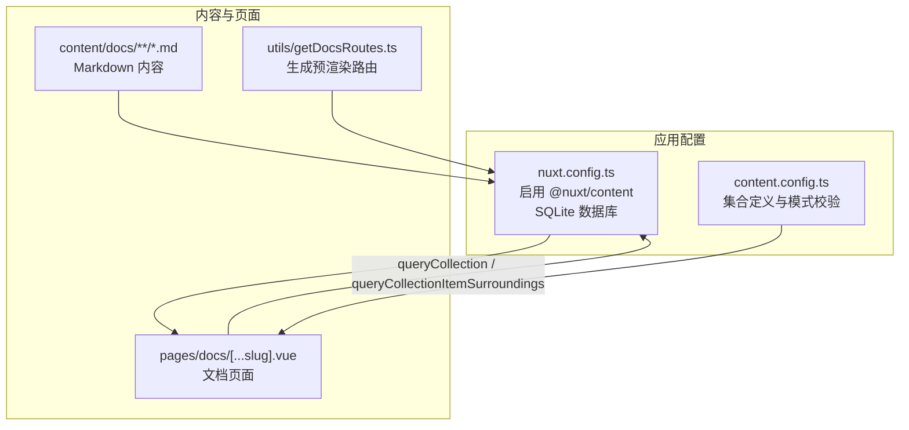
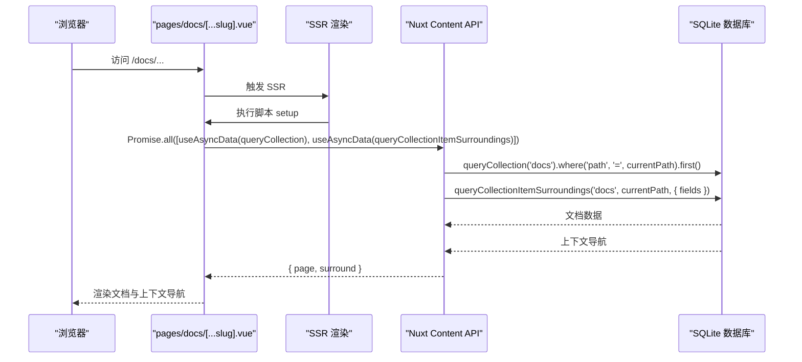
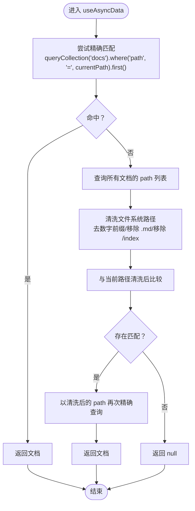
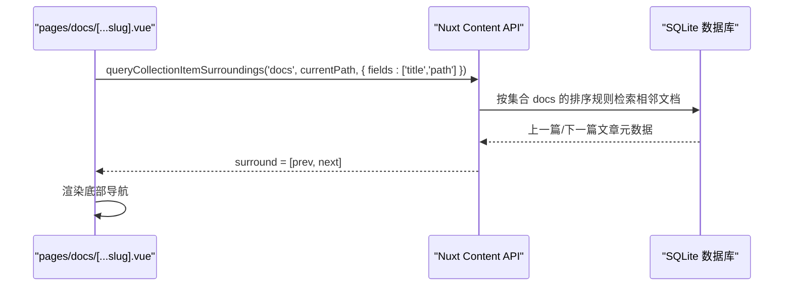
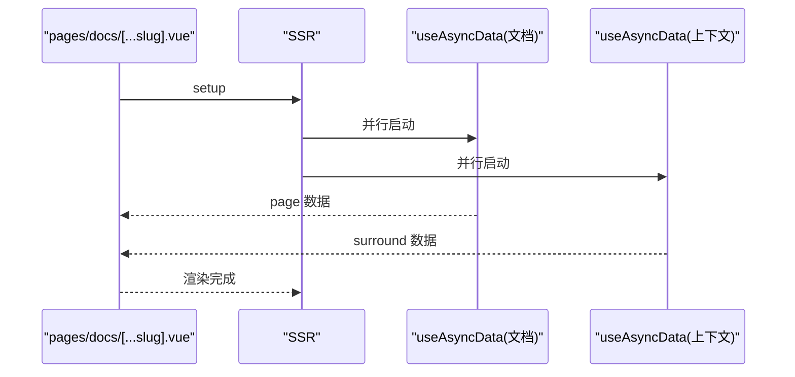
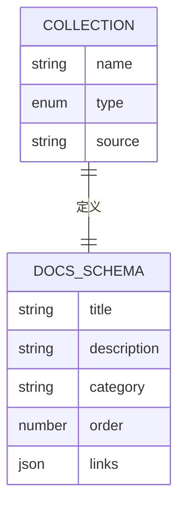
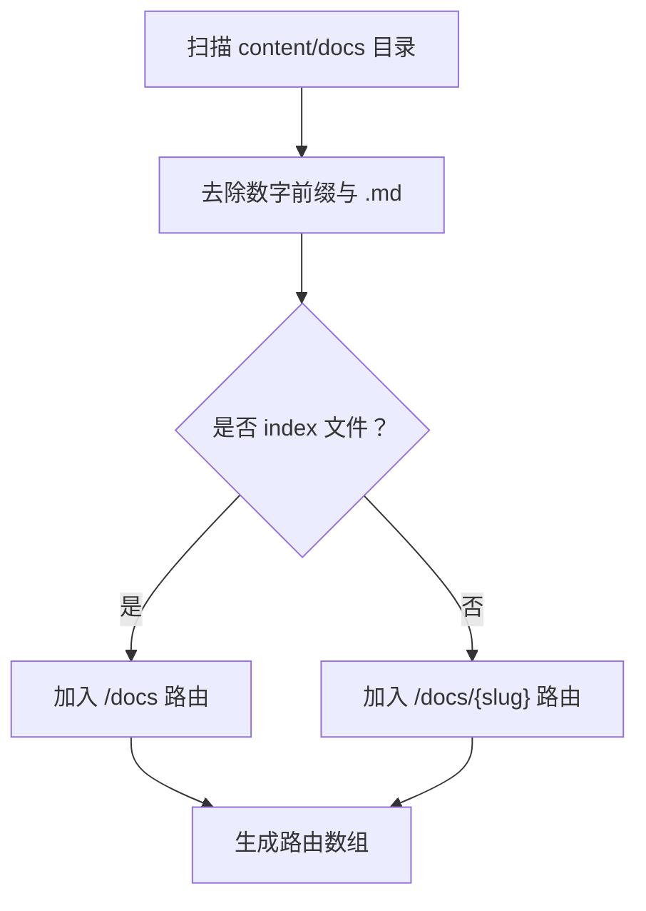
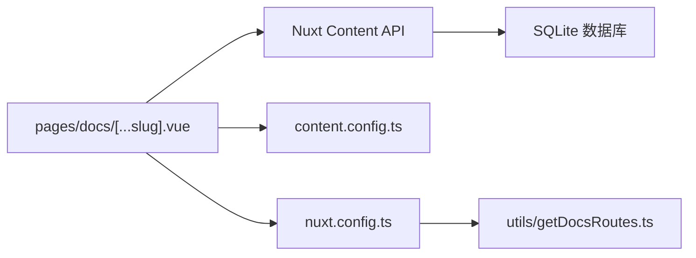

# 内容查询API

<cite>
**本文引用的文件**
- [pages/docs/[...slug].vue](file://pages/docs/[...slug].vue)
- [content.config.ts](file://content.config.ts)
- [nuxt.config.ts](file://nuxt.config.ts)
- [utils/getDocsRoutes.ts](file://utils/getDocsRoutes.ts)
- [content/docs/introduction/10.migration.md](file://content/docs/introduction/10.migration.md)
- [content/docs/framework/define.md](file://content/docs/framework/define.md)
- [content/docs/introduction/demo.md](file://content/docs/introduction/demo.md)
- [content/docs/introduction/1.start.md](file://content/docs/introduction/1.start.md)
</cite>

## 目录
1. [引言](#引言)
2. [项目结构](#项目结构)
3. [核心组件](#核心组件)
4. [架构总览](#架构总览)
5. [详细组件分析](#详细组件分析)
6. [依赖关系分析](#依赖关系分析)
7. [性能考量](#性能考量)
8. [故障排查指南](#故障排查指南)
9. [结论](#结论)
10. [附录](#附录)

## 引言
本文件围绕 pages/docs/[...slug].vue 中的内容查询 API 实践，系统阐述如何使用 queryCollection 与 queryCollectionItemSurroundings 在 Nuxt Content v3 中从 SQLite 数据库中按集合名称（如 docs）查询文档数据，并结合 content.config.ts 中的集合源路径与模式校验，解释查询作用域的限定原理；同时说明 useAsyncData 在 SSR 期间的数据获取行为，以及通过 Promise.all 并行执行两个查询带来的性能优势。文档还提供 API 调用示例、响应结构解析与与 Nuxt Content 模块的集成细节。

## 项目结构
- 文档集合配置位于 content.config.ts，定义了集合类型、源路径与模式校验，确保内容入库与类型安全。
- Nuxt 配置 nuxt.config.ts 启用 @nuxt/content 并指定 SQLite 作为内容数据库，Nitro 预渲染注入动态文档路由。
- 页面 pages/docs/[...slug].vue 使用 queryCollection 与 queryCollectionItemSurroundings 获取当前文档与上下文导航，并通过 useAsyncData 在 SSR 期间并行加载数据。
- 工具 utils/getDocsRoutes.ts 递归扫描 content/docs 目录生成预渲染路由，保证静态生成覆盖所有文档页面。

**图表来源**
- [nuxt.config.ts](file://nuxt.config.ts#L1-L91)
- [content.config.ts](file://content.config.ts#L1-L57)
- [utils/getDocsRoutes.ts](file://utils/getDocsRoutes.ts#L1-L58)
- [pages/docs/[...slug].vue](file://pages/docs/[...slug].vue#L170-L226)

**章节来源**
- [nuxt.config.ts](file://nuxt.config.ts#L1-L91)
- [content.config.ts](file://content.config.ts#L1-L57)
- [utils/getDocsRoutes.ts](file://utils/getDocsRoutes.ts#L1-L58)
- [pages/docs/[...slug].vue](file://pages/docs/[...slug].vue#L170-L226)

## 核心组件
- queryCollection('docs'): 基于集合名称 docs 的查询入口，限定查询范围在该集合内，支持 where、first、all 等链式方法。
- queryCollectionItemSurroundings('docs', currentPath, { fields }): 获取当前文档的前后文导航，fields 指定返回字段（如 title、path）。
- useAsyncData: 在 SSR 期间异步获取数据，返回 data、pending、error 等状态，支持并发执行。
- Promise.all: 并行执行两个 useAsyncData 请求，缩短首屏等待时间，提升性能。

**章节来源**
- [pages/docs/[...slug].vue](file://pages/docs/[...slug].vue#L185-L220)
- [content/docs/introduction/10.migration.md](file://content/docs/introduction/10.migration.md#L86-L132)
- [content/docs/framework/define.md](file://content/docs/framework/define.md#L150-L173)

## 架构总览
下图展示从页面到内容数据库的查询链路，以及并行数据获取流程。

**图表来源**
- [pages/docs/[...slug].vue](file://pages/docs/[...slug].vue#L185-L220)
- [content/docs/introduction/10.migration.md](file://content/docs/introduction/10.migration.md#L86-L132)

## 详细组件分析

### queryCollection 查询作用域与路径匹配
- 集合限定：queryCollection('docs') 仅在 docs 集合内查询，避免跨集合扫描，提高安全性与性能。
- 路径匹配策略：
  - 精确匹配：优先尝试按当前 URL 解码后的 path 精确查询。
  - 回退清洗匹配：若未命中，先获取所有文档的 path 列表，再对文件系统路径进行清洗（去除数字前缀、移除 .md 与 /index），与当前路径清洗后比较，最终以清洗后的 path 再次精确查询。
- 作用域限定原理：content.config.ts 中 docs 集合的 source: 'docs/**/*.md' 与 schema 定义，决定了哪些 Markdown 文件被纳入 docs 集合，从而 queryCollection('docs') 的查询范围被严格限定在该集合内。

**图表来源**
- [pages/docs/[...slug].vue](file://pages/docs/[...slug].vue#L185-L215)
- [content.config.ts](file://content.config.ts#L17-L32)

**章节来源**
- [pages/docs/[...slug].vue](file://pages/docs/[...slug].vue#L185-L215)
- [content.config.ts](file://content.config.ts#L17-L32)

### queryCollectionItemSurroundings 上下文导航
- 功能：基于当前文档路径获取上一篇与下一篇文章的导航信息，用于底部“上一页/下一页”推荐。
- 字段控制：通过 fields 参数仅返回 title 与 path，减少传输体积。
- 使用场景：在页面渲染完成后，底部导航区根据 surround 结果动态展示上一页/下一页链接。

**图表来源**
- [pages/docs/[...slug].vue](file://pages/docs/[...slug].vue#L216-L220)
- [content/docs/introduction/10.migration.md](file://content/docs/introduction/10.migration.md#L108-L132)

**章节来源**
- [pages/docs/[...slug].vue](file://pages/docs/[...slug].vue#L216-L220)
- [content/docs/introduction/10.migration.md](file://content/docs/introduction/10.migration.md#L108-L132)

### useAsyncData 与 Promise.all 并行执行
- SSR 行为：在 SSR 期间，useAsyncData 会在服务端提前获取数据，随后在客户端继续挂起直到数据到达，保证首屏渲染的完整性。
- 并行优势：通过 Promise.all 同时发起两个 useAsyncData 请求（文档查询与上下文查询），避免串行等待，缩短首屏加载时间。
- 错误处理：页面使用 NuxtErrorBoundary 捕获错误，便于用户重试或跳转。

**图表来源**
- [pages/docs/[...slug].vue](file://pages/docs/[...slug].vue#L185-L220)

**章节来源**
- [pages/docs/[...slug].vue](file://pages/docs/[...slug].vue#L185-L220)

### 集合定义与模式校验
- 集合类型：docs 为 page 类型，表示文档页面内容。
- 源路径：source: 'docs/**/*.md' 递归匹配 docs 目录下的所有 Markdown 文件。
- 模式校验：schema 定义了 title、description、category、order、links 等字段，确保入库数据结构一致且具备类型推断。
- 数据库：nuxt.config.ts 中 content.database.type: 'sqlite' 指定 SQLite 作为内容数据库，queryCollection 基于此构建查询。

**图表来源**
- [content.config.ts](file://content.config.ts#L17-L32)
- [nuxt.config.ts](file://nuxt.config.ts#L32-L40)

**章节来源**
- [content.config.ts](file://content.config.ts#L17-L32)
- [nuxt.config.ts](file://nuxt.config.ts#L32-L40)

### 预渲染与路由生成
- utils/getDocsRoutes.ts 递归扫描 content/docs，去除数字前缀与 .md 后缀，生成 /docs 前缀的路由列表，并确保包含 /docs 根路径。
- nuxt.config.ts 的 nitro.prerender.routes 使用该函数生成的路由，确保静态预渲染覆盖所有文档页面，提升 SEO 与首屏性能。

**图表来源**
- [utils/getDocsRoutes.ts](file://utils/getDocsRoutes.ts#L1-L58)
- [nuxt.config.ts](file://nuxt.config.ts#L47-L50)

**章节来源**
- [utils/getDocsRoutes.ts](file://utils/getDocsRoutes.ts#L1-L58)
- [nuxt.config.ts](file://nuxt.config.ts#L47-L50)

## 依赖关系分析
- pages/docs/[...slug].vue 依赖 Nuxt Content API（queryCollection、queryCollectionItemSurroundings）、useAsyncData 与 SSR 生命周期。
- content.config.ts 为 queryCollection 的作用域与类型安全提供依据。
- nuxt.config.ts 为 SQLite 数据库与预渲染提供基础配置。
- utils/getDocsRoutes.ts 为预渲染提供路由清单，间接影响 queryCollection 的查询结果集。

**图表来源**
- [pages/docs/[...slug].vue](file://pages/docs/[...slug].vue#L185-L220)
- [content.config.ts](file://content.config.ts#L1-L57)
- [nuxt.config.ts](file://nuxt.config.ts#L1-L91)
- [utils/getDocsRoutes.ts](file://utils/getDocsRoutes.ts#L1-L58)

**章节来源**
- [pages/docs/[...slug].vue](file://pages/docs/[...slug].vue#L185-L220)
- [content.config.ts](file://content.config.ts#L1-L57)
- [nuxt.config.ts](file://nuxt.config.ts#L1-L91)
- [utils/getDocsRoutes.ts](file://utils/getDocsRoutes.ts#L1-L58)

## 性能考量
- 并行查询：Promise.all 同时发起文档与上下文查询，避免串行等待，缩短首屏加载时间。
- 路由预渲染：通过 getDocsRoutes 生成静态路由，配合 nitro.prerender 提升首屏性能与 SEO。
- 清洗匹配：回退清洗匹配避免硬编码路径差异导致的查询失败，减少额外重试与网络往返。
- 索引与模式：content.config.ts 中的 schema 与索引配置有助于查询优化（尽管具体索引定义在示例中未出现，但框架层面支持）。

[本节为通用性能建议，不直接分析具体文件]

## 故障排查指南
- 文档未找到：当 page 为空时，设置 404 状态码，页面显示“文档未找到”，用户可返回文档首页。
- 错误边界：页面使用 NuxtErrorBoundary 捕获异常，显示错误信息并提供重试按钮。
- 路由缺失：若预渲染路由未包含某文档路径，可能导致 SSR 404 或静态页面缺失，检查 utils/getDocsRoutes.ts 与 nuxt.config.ts 的 prerender 配置。
- 路径清洗不一致：若文件系统路径包含数字前缀或 index.md，确保清洗逻辑与实际路径一致，避免回退查询失败。

**章节来源**
- [pages/docs/[...slug].vue](file://pages/docs/[...slug].vue#L222-L226)

## 结论
通过在 pages/docs/[...slug].vue 中使用 queryCollection('docs') 限定查询作用域，并结合 content.config.ts 的集合源路径与模式校验，可确保查询范围明确、数据结构一致。queryCollectionItemSurroundings 则为底部导航提供上下文推荐。借助 useAsyncData 与 Promise.all 的并行执行，能够在 SSR 期间高效获取所需数据，显著提升首屏性能。配合 nuxt.config.ts 的 SQLite 配置与 utils/getDocsRoutes.ts 的预渲染路由生成，整体实现具备良好的可维护性与性能表现。

## 附录
- 示例文档参考：
  - [content/docs/introduction/demo.md](file://content/docs/introduction/demo.md)
  - [content/docs/introduction/1.start.md](file://content/docs/introduction/1.start.md)