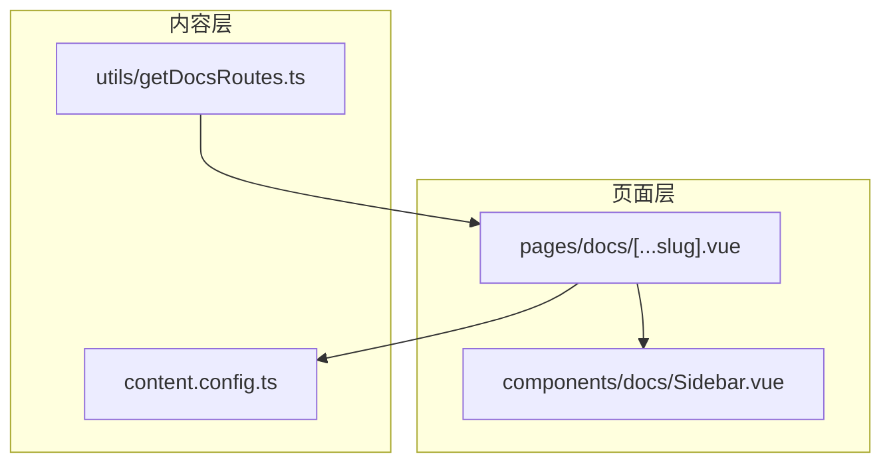
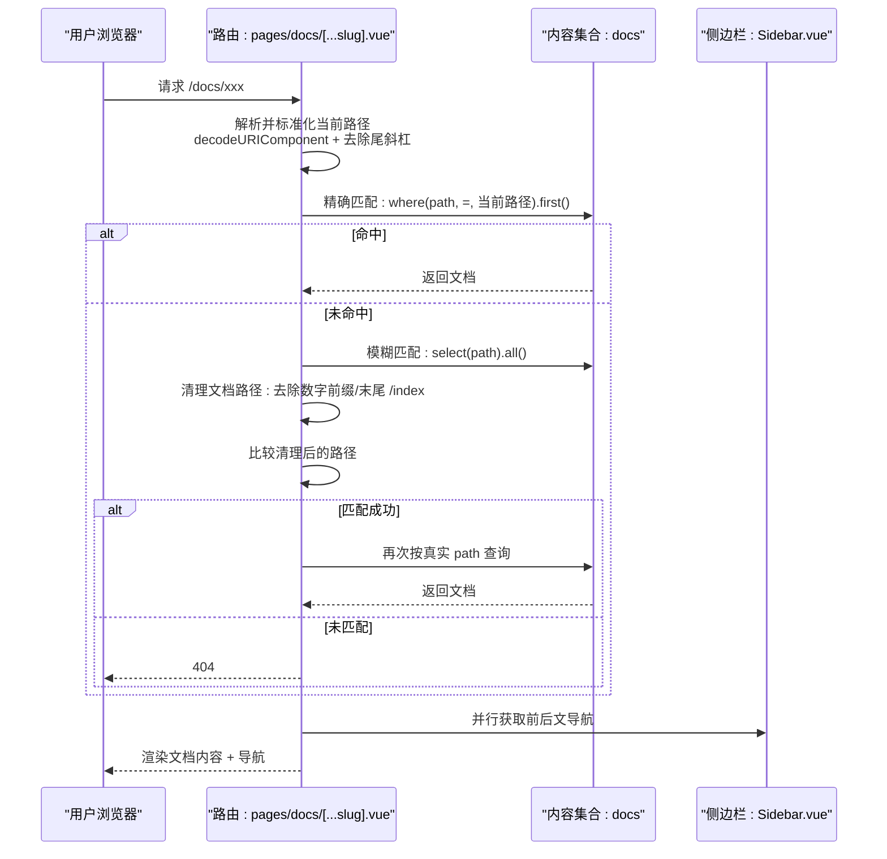
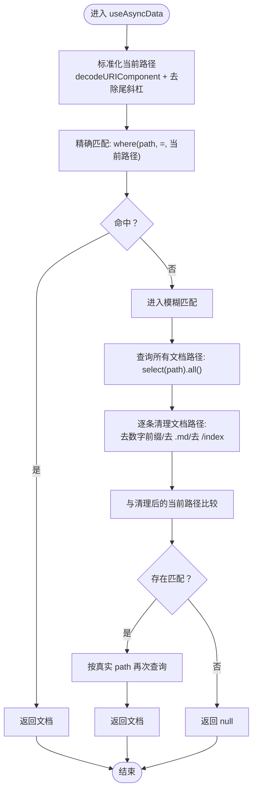
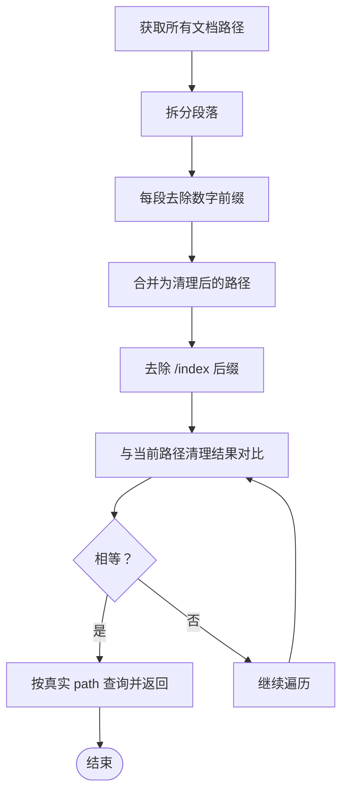
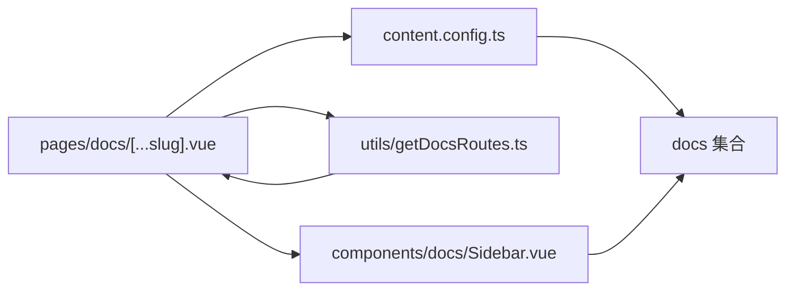

# 路径匹配机制

<cite>
**本文引用的文件**
- [pages/docs/[...slug].vue](file://pages/docs/[...slug].vue)
- [utils/getDocsRoutes.ts](file://utils/getDocsRoutes.ts)
- [content.config.ts](file://content.config.ts)
- [components/docs/Sidebar.vue](file://components/docs/Sidebar.vue)
</cite>

## 目录
1. [引言](#引言)
2. [项目结构](#项目结构)
3. [核心组件](#核心组件)
4. [架构总览](#架构总览)
5. [详细组件分析](#详细组件分析)
6. [依赖关系分析](#依赖关系分析)
7. [性能考量](#性能考量)
8. [故障排查指南](#故障排查指南)
9. [结论](#结论)

## 引言
本文围绕 pages/docs/[...slug].vue 中的路径匹配机制展开，系统性阐述以下要点：
- 使用 useAsyncData 首先尝试对当前 URL 路径进行精确匹配以获取文档内容；
- 当精确匹配失败时，采用“模糊匹配”策略：通过 queryCollection 获取所有文档路径，对每个路径执行规范化处理（移除数字前缀如“1.”、移除“/index”后缀等），再与清理后的当前路径进行比对；
- decodeURIComponent 在处理中文或特殊字符路径中的作用；
- 路径尾部斜杠的标准化逻辑；
- 错误边界处理与性能影响分析；
- 如何支持用户友好的 URL 访问（如访问 /introduction 而非 /1.introduction）。

## 项目结构
本项目采用 Nuxt Content v3 的集合模型管理文档内容，路径匹配逻辑集中在文档页面路由中，同时配合工具函数生成静态预渲染路由列表，保证内容与路由的一致性。

图表来源
- [pages/docs/[...slug].vue](file://pages/docs/[...slug].vue#L170-L220)
- [content.config.ts](file://content.config.ts#L1-L57)
- [utils/getDocsRoutes.ts](file://utils/getDocsRoutes.ts#L1-L58)
- [components/docs/Sidebar.vue](file://components/docs/Sidebar.vue#L156-L177)

章节来源
- [pages/docs/[...slug].vue](file://pages/docs/[...slug].vue#L170-L220)
- [content.config.ts](file://content.config.ts#L1-L57)
- [utils/getDocsRoutes.ts](file://utils/getDocsRoutes.ts#L1-L58)
- [components/docs/Sidebar.vue](file://components/docs/Sidebar.vue#L156-L177)

## 核心组件
- 页面路由 [pages/docs/[...slug].vue]：负责解析当前路径、执行精确匹配与模糊匹配、并行拉取文档与前后文导航数据；同时提供错误边界与 404 处理。
- 内容集合配置 [content.config.ts]：声明 docs 集合及其字段约束，确保路径字段可用。
- 路由生成工具 [utils/getDocsRoutes.ts]：递归扫描 content/docs 目录，生成用户友好的路由列表（去除数字前缀、index 后缀等），用于预渲染与导航。
- 侧边栏导航 [components/docs/Sidebar.vue]：基于 docs 集合生成导航树，支持分组与高亮当前激活路由。

章节来源
- [pages/docs/[...slug].vue](file://pages/docs/[...slug].vue#L170-L220)
- [content.config.ts](file://content.config.ts#L1-L57)
- [utils/getDocsRoutes.ts](file://utils/getDocsRoutes.ts#L1-L58)
- [components/docs/Sidebar.vue](file://components/docs/Sidebar.vue#L156-L177)

## 架构总览
下图展示了从用户访问到文档渲染的关键流程，包括路径标准化、精确匹配与模糊匹配、并行数据获取、错误处理与 SEO 元信息设置。

图表来源
- [pages/docs/[...slug].vue](file://pages/docs/[...slug].vue#L170-L220)
- [components/docs/Sidebar.vue](file://components/docs/Sidebar.vue#L156-L177)

## 详细组件分析

### 路径标准化与精确匹配
- 路径标准化：
  - 使用 decodeURIComponent 处理 URL 编码（如中文路径）；
  - 去除尾部斜杠（根路径保留）。
- 精确匹配：
  - 通过 queryCollection('docs').where('path', '=', 当前路径).first() 直接查询；
  - 若命中，立即返回文档；否则进入模糊匹配。

图表来源
- [pages/docs/[...slug].vue](file://pages/docs/[...slug].vue#L170-L220)

章节来源
- [pages/docs/[...slug].vue](file://pages/docs/[...slug].vue#L170-L220)

### 模糊匹配策略与规范化处理
- 规范化规则：
  - 对文档路径按“/”分割后，逐段去除形如“数字.”的前缀；
  - 去除“/index”后缀；
  - 去除尾斜杠（当前路径）。
- 匹配逻辑：
  - 遍历所有文档路径，比较清理后的路径与当前路径；
  - 若匹配成功，再次按真实 path 查询以确保返回完整文档。

图表来源
- [pages/docs/[...slug].vue](file://pages/docs/[...slug].vue#L192-L214)

章节来源
- [pages/docs/[...slug].vue](file://pages/docs/[...slug].vue#L192-L214)

### decodeURIComponent 的作用
- 当 URL 中包含中文或特殊字符时，浏览器会对其进行编码（如“/docs/介绍”可能编码为“/docs/%E4%BB%8B%E7%BB%8D”）；
- 在服务端/SSR 场景，decodeURIComponent 可将编码后的路径还原为原始路径，避免因编码差异导致的精确匹配失败；
- 该步骤确保后续规范化与比较在“解码后”的一致语义下进行。

章节来源
- [pages/docs/[...slug].vue](file://pages/docs/[...slug].vue#L170-L179)

### 路径尾斜杠标准化
- 尾斜杠标准化逻辑：
  - 若路径以“/”结尾且不是根路径“/”，则去除尾斜杠；
  - 根路径“/”保留，避免与“/docs”等路径混淆。
- 该逻辑确保：
  - 用户访问“/docs/introduction/”与“/docs/introduction”被视为同一路径；
  - 与规范化处理协同，提升匹配一致性。

章节来源
- [pages/docs/[...slug].vue](file://pages/docs/[...slug].vue#L170-L179)

### 并行数据获取与错误边界
- 并行获取：
  - 使用 Promise.all 同时获取文档内容与前后文导航，减少首屏等待时间；
  - 文档内容与导航数据分别使用独立的 useAsyncData key，避免缓存冲突。
- 错误边界：
  - 使用 NuxtErrorBoundary 捕获渲染期异常，提供“重试”按钮；
  - 404 处理：若 page 为空，设置响应状态为 404，提示用户文档未找到。
- SEO 元信息：
  - 根据 page 动态设置标题与描述，提升 SEO 友好度。

章节来源
- [pages/docs/[...slug].vue](file://pages/docs/[...slug].vue#L185-L226)
- [pages/docs/[...slug].vue](file://pages/docs/[...slug].vue#L116-L129)
- [pages/docs/[...slug].vue](file://pages/docs/[...slug].vue#L280-L284)

### 支持用户友好 URL 的设计
- 用户友好 URL 的来源：
  - content/docs 目录中文件与目录名常带数字前缀（如“1.introduction”）与“index.md”；
  - utils/getDocsRoutes.ts 递归扫描并生成“去前缀、去 .md、去 /index”的路由，确保用户访问的是自然语言路径（如“/docs/introduction”）。
- 路由与匹配的关系：
  - 生成的路由作为“期望路径”参与模糊匹配；
  - 模糊匹配阶段再次清理文档路径，确保与生成的“期望路径”一致。

章节来源
- [utils/getDocsRoutes.ts](file://utils/getDocsRoutes.ts#L1-L58)
- [pages/docs/[...slug].vue](file://pages/docs/[...slug].vue#L192-L214)

### 侧边栏导航与路径一致性
- Sidebar.vue 在根层级自动从 docs 集合查询文档列表，使用 path 字段生成导航；
- 该路径与页面匹配使用的 path 字段保持一致，确保导航与内容路径同步。

章节来源
- [components/docs/Sidebar.vue](file://components/docs/Sidebar.vue#L156-L177)

## 依赖关系分析
- pages/docs/[...slug].vue 依赖：
  - content.config.ts 中的 docs 集合配置；
  - utils/getDocsRoutes.ts 生成的路由列表（用于预渲染与导航一致性）；
  - components/docs/Sidebar.vue 提供导航数据与高亮。
- 关键耦合点：
  - 路径字段 path 必须在 docs 集合中存在且唯一；
  - 模糊匹配依赖 queryCollection('docs').select('path').all() 的可用性；
  - decodeURIComponent 与尾斜杠标准化共同决定精确匹配与模糊匹配的输入一致性。

图表来源
- [pages/docs/[...slug].vue](file://pages/docs/[...slug].vue#L170-L220)
- [content.config.ts](file://content.config.ts#L1-L57)
- [utils/getDocsRoutes.ts](file://utils/getDocsRoutes.ts#L1-L58)
- [components/docs/Sidebar.vue](file://components/docs/Sidebar.vue#L156-L177)

章节来源
- [pages/docs/[...slug].vue](file://pages/docs/[...slug].vue#L170-L220)
- [content.config.ts](file://content.config.ts#L1-L57)
- [utils/getDocsRoutes.ts](file://utils/getDocsRoutes.ts#L1-L58)
- [components/docs/Sidebar.vue](file://components/docs/Sidebar.vue#L156-L177)

## 性能考量
- 并行数据获取：
  - 使用 Promise.all 同步获取文档与前后文导航，降低首屏等待时间；
  - 建议在大型文档集上评估并发请求数量与服务器压力。
- 模糊匹配成本：
  - 模糊匹配会一次性读取所有文档路径（select('path').all()），在文档数量较多时可能带来额外查询开销；
  - 建议：
    - 优化内容组织，减少不必要的目录与文件层级；
    - 结合预渲染策略（Nitro 预渲染）与静态站点生成，减少运行时查询；
    - 对高频访问的路径建立索引或缓存策略（如 CDN 缓存）。
- 路径标准化与正则处理：
  - 规范化过程涉及字符串拆分与替换，建议在数据量较大时关注正则复杂度；
  - 可考虑将常用清理规则封装为纯函数并在服务端复用，避免重复计算。

[本节为通用性能建议，不直接分析具体文件]

## 故障排查指南
- 症状：访问 /docs/introduction 显示 404
  - 可能原因：
    - content/docs 目录中缺少对应路径或文件名不符合预期（含数字前缀或 index.md）；
    - 模糊匹配未正确清理路径，导致与生成的“期望路径”不一致。
  - 排查步骤：
    - 检查 content/docs 下的实际文件与目录名；
    - 确认 utils/getDocsRoutes.ts 生成的路由列表是否包含期望路径；
    - 在模糊匹配阶段核对清理逻辑（去数字前缀、去 .md、去 /index）。
- 症状：中文路径无法访问
  - 可能原因：URL 编码未正确解码；
  - 排查步骤：确认 decodeURIComponent 是否生效，以及尾斜杠标准化是否正确。
- 症状：导航高亮不准确
  - 可能原因：Sidebar.vue 使用的 path 与页面匹配使用的 path 不一致；
  - 排查步骤：确认 docs 集合中各文档的 path 字段值是否与生成的路由一致。

章节来源
- [pages/docs/[...slug].vue](file://pages/docs/[...slug].vue#L170-L220)
- [utils/getDocsRoutes.ts](file://utils/getDocsRoutes.ts#L1-L58)
- [components/docs/Sidebar.vue](file://components/docs/Sidebar.vue#L156-L177)

## 结论
本路径匹配机制通过“精确匹配 + 模糊匹配”的双轨策略，结合 decodeURIComponent 与尾斜杠标准化，有效解决了用户友好 URL 与文件系统命名之间的差异问题。配合并行数据获取与错误边界处理，既提升了用户体验，也增强了系统的健壮性。建议在大规模内容场景下，结合预渲染与缓存策略进一步优化性能与稳定性。