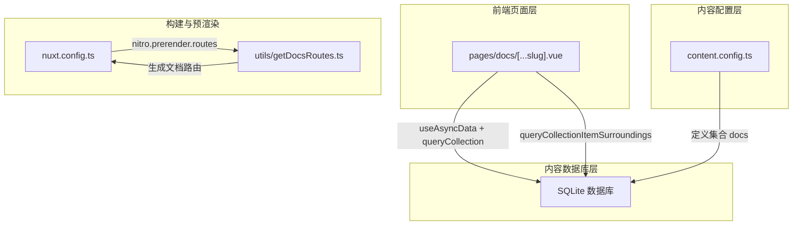
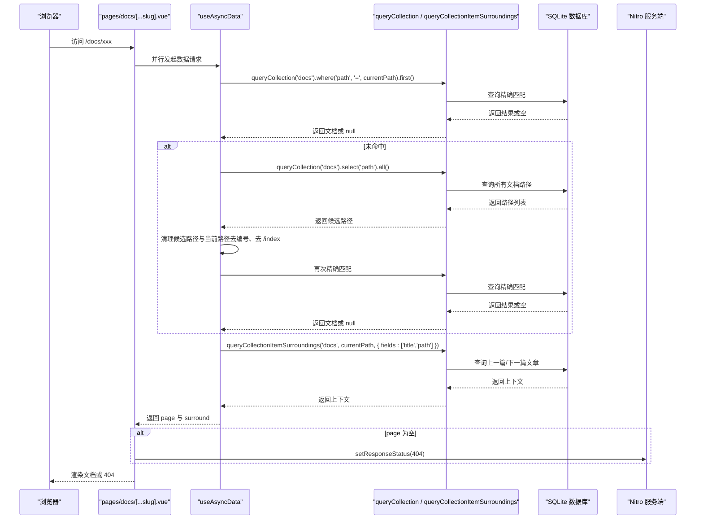
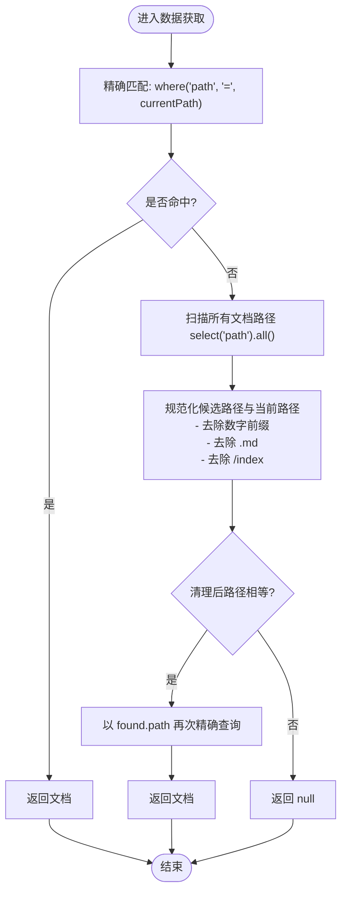
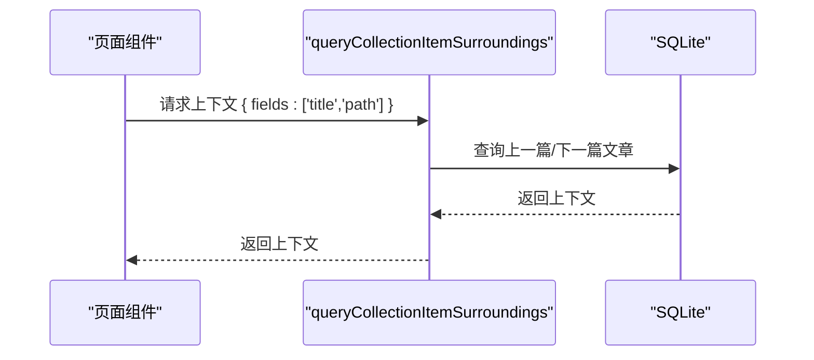
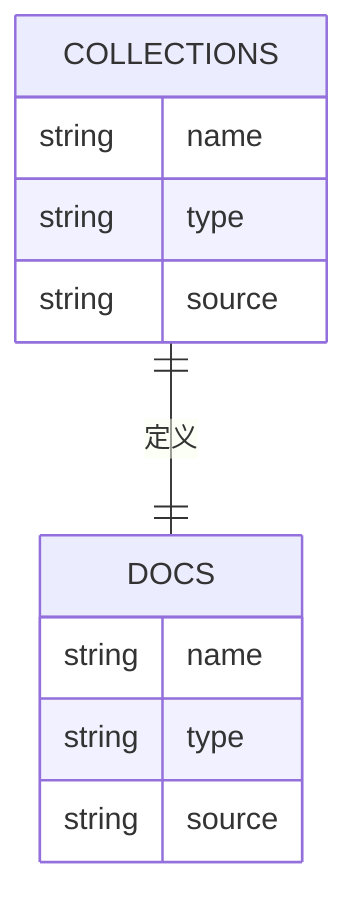
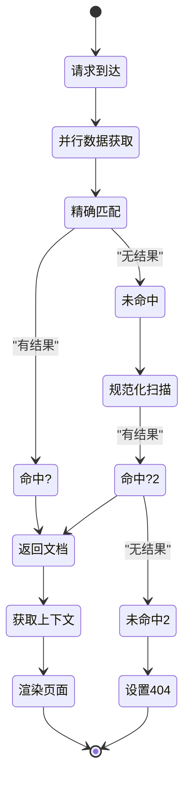
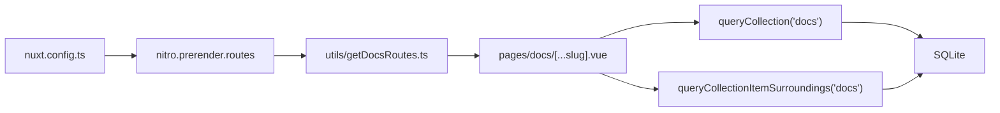

# 运行时数据获取

<cite>
**本文引用的文件**
- [pages/docs/[...slug].vue](file://pages/docs/[...slug].vue)
- [content.config.ts](file://content.config.ts)
- [nuxt.config.ts](file://nuxt.config.ts)
- [utils/getDocsRoutes.ts](file://utils/getDocsRoutes.ts)
- [content/10.migration.md](file://content/docs/introduction/10.migration.md)
- [content/types.md](file://content/docs/framework/types.md)
</cite>

## 目录
1. [简介](#简介)
2. [项目结构](#项目结构)
3. [核心组件](#核心组件)
4. [架构总览](#架构总览)
5. [详细组件分析](#详细组件分析)
6. [依赖分析](#依赖分析)
7. [性能考量](#性能考量)
8. [故障排查指南](#故障排查指南)
9. [结论](#结论)
10. [附录](#附录)

## 简介
本文围绕 pages/docs/[...slug].vue 的运行时数据获取流程，系统阐述以下要点：
- 使用 useAsyncData 与 queryCollection API 从 SQLite 数据库动态查询文档内容。
- 精确匹配失败时的降级策略：扫描所有文档路径并进行规范化处理（去除数字前缀、移除 /index 等），实现“去编号”“去 index”的模糊匹配。
- 使用 queryCollectionItemSurroundings 获取当前文档的上下文（上一篇、下一篇），支撑文档导航。
- 结合 content.config.ts 的集合定义，说明查询作用域限定机制。
- 提供完整的请求生命周期流程图，覆盖客户端请求、服务端数据获取、响应返回与错误处理（404 状态设置）。
- 给出性能优化建议（缓存策略、查询优化）与最佳实践。

## 项目结构
本项目采用 Nuxt 4 + Nuxt Content v3 + SQLite 的内容管理方案。文档集合通过 content.config.ts 定义，页面通过 pages/docs/[...slug].vue 动态渲染，Nitro 在构建期通过 utils/getDocsRoutes.ts 生成静态预渲染路由，运行时通过 useAsyncData + queryCollection 实现按需数据获取。

**图表来源**
- [pages/docs/[...slug].vue](file://pages/docs/[...slug].vue#L185-L225)
- [content.config.ts](file://content.config.ts#L17-L32)
- [nuxt.config.ts](file://nuxt.config.ts#L33-L51)
- [utils/getDocsRoutes.ts](file://utils/getDocsRoutes.ts#L1-L58)

**章节来源**
- [pages/docs/[...slug].vue](file://pages/docs/[...slug].vue#L1-L120)
- [content.config.ts](file://content.config.ts#L1-L57)
- [nuxt.config.ts](file://nuxt.config.ts#L1-L91)
- [utils/getDocsRoutes.ts](file://utils/getDocsRoutes.ts#L1-L58)

## 核心组件
- 页面组件：pages/docs/[...slug].vue
  - 使用 useAsyncData 并行拉取当前文档与上下文导航数据。
  - 通过 queryCollection 精确匹配当前路径；若失败则执行“去编号 + 去 index”的模糊匹配。
  - 通过 queryCollectionItemSurroundings 获取上一篇/下一篇文章的标题与路径。
  - 未命中时设置 404 状态。
- 内容配置：content.config.ts
  - 定义 docs 集合，限定 source 为 docs/**/*.md，schema 包含标题、描述、分类、排序权重等字段。
- 构建配置：nuxt.config.ts
  - 启用 @nuxt/content，数据库类型为 sqlite。
  - 通过 nitro.prerender.routes 注入动态生成的文档路由，加速首屏与 SEO。
- 静态路由生成：utils/getDocsRoutes.ts
  - 递归扫描 content/docs，去除数字前缀与 .md 后缀，生成 /docs 下的规范路由列表。

**章节来源**
- [pages/docs/[...slug].vue](file://pages/docs/[...slug].vue#L170-L225)
- [content.config.ts](file://content.config.ts#L17-L32)
- [nuxt.config.ts](file://nuxt.config.ts#L33-L51)
- [utils/getDocsRoutes.ts](file://utils/getDocsRoutes.ts#L1-L58)

## 架构总览
下图展示从客户端请求到服务端数据返回的完整生命周期，包括精确匹配、降级匹配、上下文查询与 404 处理。

**图表来源**
- [pages/docs/[...slug].vue](file://pages/docs/[...slug].vue#L185-L225)
- [content/10.migration.md](file://content/docs/introduction/10.migration.md#L79-L132)

## 详细组件分析

### 精确匹配与降级策略（模糊匹配）
- 精确匹配：优先使用 queryCollection('docs').where('path', '=', currentPath).first()。
- 降级策略：
  - 若未命中，先查询所有文档路径 select('path').all()。
  - 对候选路径与当前路径进行“规范化”处理：
    - 去除段落前的数字前缀（如 1.、2.）。
    - 去除 .md 后缀（内容系统已生成路径，此处为健壮性处理）。
    - 去除 /index 尾缀（index.md 与目录同名时的路径差异）。
  - 清理后的路径相等则视为命中，再以 found.path 进行二次精确查询。

**图表来源**
- [pages/docs/[...slug].vue](file://pages/docs/[...slug].vue#L185-L215)

**章节来源**
- [pages/docs/[...slug].vue](file://pages/docs/[...slug].vue#L185-L215)

### 上下文查询（上一篇/下一片）
- 使用 queryCollectionItemSurroundings('docs', currentPath, { fields: ['title','path'] }) 获取当前文档的前后条目。
- 该 API 由 Nuxt Content v3 提供，用于替代旧版 findSurround。

**图表来源**
- [pages/docs/[...slug].vue](file://pages/docs/[...slug].vue#L216-L220)
- [content/10.migration.md](file://content/docs/introduction/10.migration.md#L108-L132)

**章节来源**
- [pages/docs/[...slug].vue](file://pages/docs/[...slug].vue#L216-L220)
- [content/10.migration.md](file://content/docs/introduction/10.migration.md#L108-L132)

### 查询作用域与集合定义
- content.config.ts 定义 docs 集合，type 为 page，source 为 docs/**/*.md，限定查询仅在 docs 集合内进行。
- queryCollection('docs') 保证只在该集合范围内检索，避免跨集合污染与性能问题。

**图表来源**
- [content.config.ts](file://content.config.ts#L17-L32)
- [content/types.md](file://content/docs/framework/types.md#L1-L50)

**章节来源**
- [content.config.ts](file://content.config.ts#L17-L32)
- [content/types.md](file://content/docs/framework/types.md#L1-L50)

### 请求生命周期与错误处理
- 客户端请求到达 /docs/xxx。
- 页面组件并行发起两个 useAsyncData：
  - 文档查询：精确匹配 → 降级匹配 → 返回文档或 null。
  - 上下文查询：获取上一篇/下一篇文章的标题与路径。
- 若 page 为空，设置 404 状态，返回 404 页面。
- 若 page 存在，渲染文档内容与导航。

**图表来源**
- [pages/docs/[...slug].vue](file://pages/docs/[...slug].vue#L185-L225)

**章节来源**
- [pages/docs/[...slug].vue](file://pages/docs/[...slug].vue#L185-L225)

## 依赖分析
- 页面组件依赖 Nuxt Content 的 queryCollection 与 queryCollectionItemSurroundings。
- 构建期依赖 utils/getDocsRoutes.ts 生成预渲染路由，减少运行时查询压力。
- 运行时依赖 SQLite 数据库（由 Nuxt Content 配置）。

**图表来源**
- [pages/docs/[...slug].vue](file://pages/docs/[...slug].vue#L185-L220)
- [nuxt.config.ts](file://nuxt.config.ts#L33-L51)
- [utils/getDocsRoutes.ts](file://utils/getDocsRoutes.ts#L1-L58)

**章节来源**
- [pages/docs/[...slug].vue](file://pages/docs/[...slug].vue#L185-L220)
- [nuxt.config.ts](file://nuxt.config.ts#L33-L51)
- [utils/getDocsRoutes.ts](file://utils/getDocsRoutes.ts#L1-L58)

## 性能考量
- 并行数据获取：useAsyncData 并行拉取文档与上下文，减少总等待时间。
- 预渲染路由：通过 nitro.prerender.routes 注入动态生成的文档路由，降低首次访问的数据库压力。
- 查询范围限定：仅在 docs 集合内查询，避免跨集合扫描。
- 降级策略的代价：当精确匹配失败时，会扫描所有文档路径，建议：
  - 控制 docs 目录规模，避免过多文件导致扫描成本过高。
  - 在 content.config.ts 中保持合理的 source 模式，避免不必要的递归匹配。
  - 对高频访问的文档，尽量避免数字前缀与 /index 的混用，减少规范化处理的必要性。
- 缓存策略建议：
  - 利用 Nuxt 的内置缓存（如服务端缓存）减少重复查询。
  - 对热点文档的上下文数据进行短期缓存，降低 queryCollectionItemSurroundings 的调用频率。
  - 在构建期尽可能多地预渲染页面，减少运行时查询次数。

[本节为通用性能建议，不直接分析具体文件]

## 故障排查指南
- 404 页面未正确显示
  - 检查页面逻辑中 setResponseStatus(404) 的触发条件是否生效。
  - 确认 content.config.ts 中 docs 集合的 source 是否正确匹配目标文档。
  - 确认 nuxt.config.ts 的 nitro.prerender.routes 是否包含目标路由。
- 文档无法命中（空白页）
  - 确认当前路径是否包含编码字符，页面已做解码与尾斜杠处理。
  - 检查降级匹配逻辑：候选路径与当前路径的规范化是否一致（去编号、去 .md、去 /index）。
- 上下文导航缺失
  - 确认 queryCollectionItemSurroundings 的 fields 参数是否包含 title 与 path。
  - 检查文档顺序字段（如 order）是否影响前后文排序。

**章节来源**
- [pages/docs/[...slug].vue](file://pages/docs/[...slug].vue#L222-L225)
- [content.config.ts](file://content.config.ts#L17-L32)
- [nuxt.config.ts](file://nuxt.config.ts#L33-L51)

## 结论
本项目通过 Nuxt Content v3 的集合化查询与 SQLite 数据库，实现了高效的文档运行时数据获取。页面组件采用“精确匹配 + 降级匹配”的双策略，结合 queryCollectionItemSurroundings 提供上下文导航，并通过构建期预渲染进一步优化性能。配合 content.config.ts 的集合定义与 nuxt.config.ts 的数据库配置，形成清晰、可控且可扩展的数据获取体系。

[本节为总结性内容，不直接分析具体文件]

## 附录
- 代码片段路径（不含具体代码内容）
  - 精确匹配与降级匹配逻辑：[pages/docs/[...slug].vue](file://pages/docs/[...slug].vue#L185-L215)
  - 上下文查询逻辑：[pages/docs/[...slug].vue](file://pages/docs/[...slug].vue#L216-L220)
  - 集合定义与作用域限定：[content.config.ts](file://content.config.ts#L17-L32)
  - 构建期预渲染路由注入：[nuxt.config.ts](file://nuxt.config.ts#L33-L51)、[utils/getDocsRoutes.ts](file://utils/getDocsRoutes.ts#L1-L58)
  - API 迁移与周边 API 说明：[content/10.migration.md](file://content/docs/introduction/10.migration.md#L79-L132)、[content/types.md](file://content/docs/framework/types.md#L1-L50)