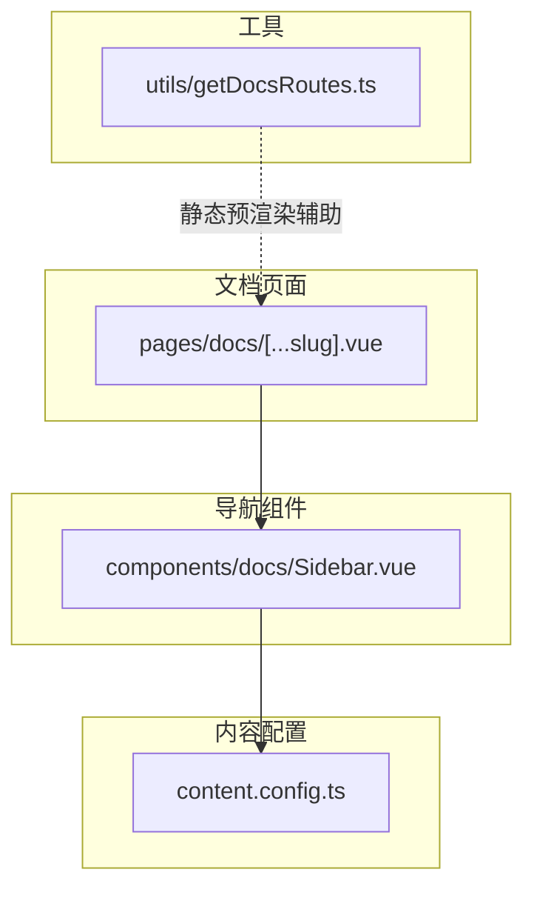
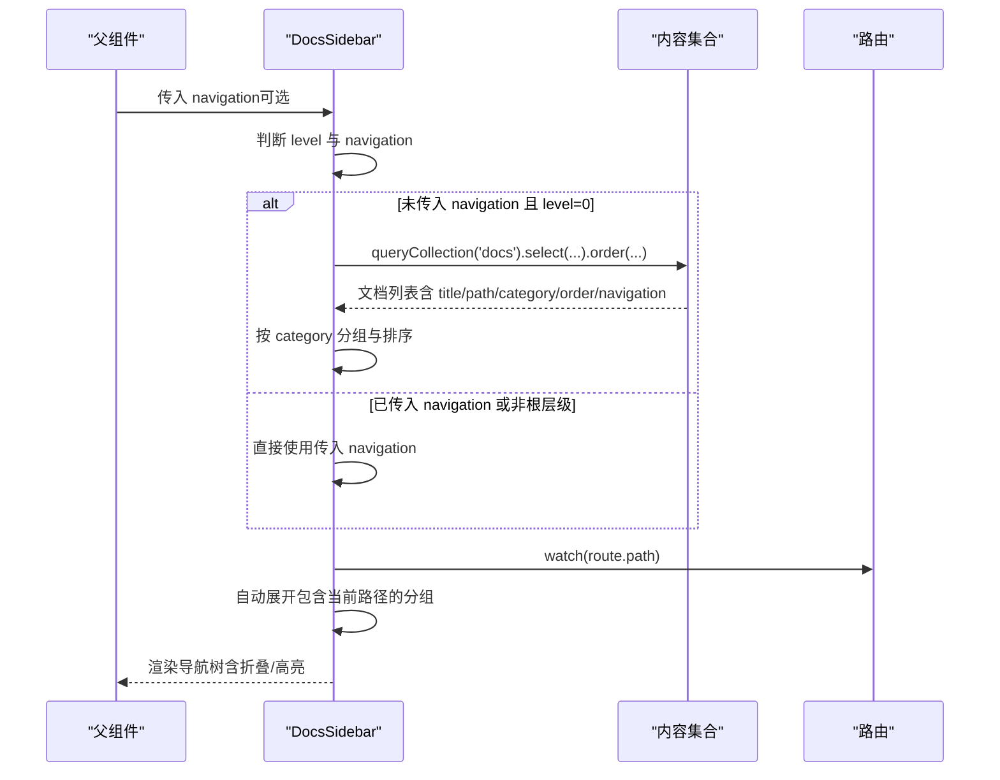
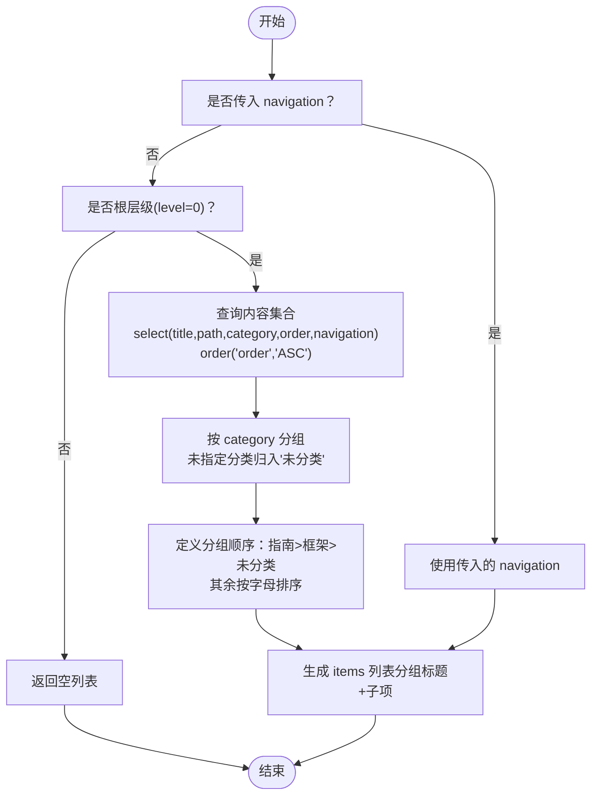
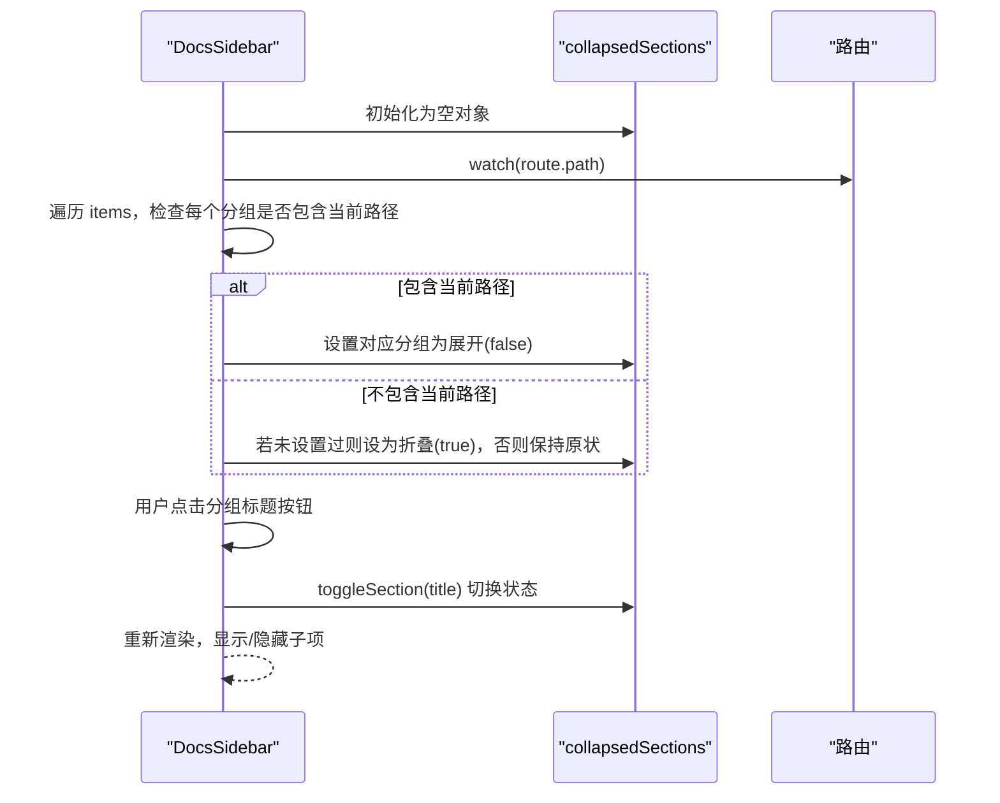
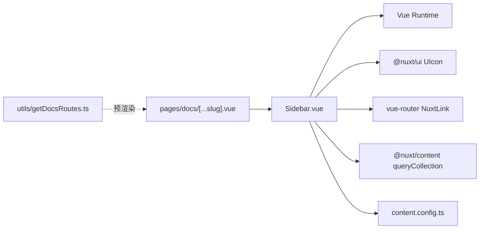

# 侧边栏导航

<cite>
**本文引用的文件**
- [components/docs/Sidebar.vue](file://components/docs/Sidebar.vue)
- [content.config.ts](file://content.config.ts)
- [pages/docs/[...slug].vue](file://pages/docs/[...slug].vue)
- [utils/getDocsRoutes.ts](file://utils/getDocsRoutes.ts)
- [package.json](file://package.json)
</cite>

## 目录
1. [简介](#简介)
2. [项目结构](#项目结构)
3. [核心组件](#核心组件)
4. [架构总览](#架构总览)
5. [详细组件分析](#详细组件分析)
6. [依赖关系分析](#依赖关系分析)
7. [性能考量](#性能考量)
8. [故障排查指南](#故障排查指南)
9. [结论](#结论)
10. [附录](#附录)

## 简介
本文件围绕文档侧边栏导航组件 DocsSidebar（Sidebar.vue）进行全面技术说明，重点涵盖以下方面：
- 递归渲染机制与层级判断（level 属性）
- 根层级自动从内容集合获取文档列表，并依据 front-matter 的 category 字段进行分组（如“指南”、“框架”），未指定分类的文档归入“未分类”
- 分组标题的折叠/展开交互逻辑，包括 collapsedSections 状态管理与 toggleSection 方法
- isActive 函数基于当前 route.path 的高亮激活逻辑
- navigation prop 的优先级：若父组件传入 navigation 数据则直接使用，否则执行自动获取
- 结合 content.config.ts 配置，说明文档查询的字段选择（title、path、order）与排序规则（order ASC）
- 无障碍访问（A11y）支持细节，如 aria-expanded 和 aria-current 的使用

## 项目结构
DocsSidebar 作为文档页面的导航组件，位于 docs 组件目录中；文档页面由 pages/docs/[...slug].vue 渲染，左侧侧边栏通过 <DocsSidebar /> 引入。

图表来源
- [components/docs/Sidebar.vue](file://components/docs/Sidebar.vue#L1-L120)
- [content.config.ts](file://content.config.ts#L1-L57)
- [pages/docs/[...slug].vue](file://pages/docs/[...slug].vue#L1-L40)
- [utils/getDocsRoutes.ts](file://utils/getDocsRoutes.ts#L1-L58)

章节来源
- [components/docs/Sidebar.vue](file://components/docs/Sidebar.vue#L1-L120)
- [pages/docs/[...slug].vue](file://pages/docs/[...slug].vue#L1-L40)
- [content.config.ts](file://content.config.ts#L1-L57)
- [utils/getDocsRoutes.ts](file://utils/getDocsRoutes.ts#L1-L58)

## 核心组件
- DocsSidebar（Sidebar.vue）负责：
  - 递归渲染导航树（支持多层级）
  - 根层级自动从内容集合查询文档并按 category 分组
  - 管理分组折叠状态并根据当前路由自动展开对应分组
  - 高亮当前激活项（基于 route.path）
  - 优先使用父组件传入的 navigation prop，否则自动获取
  - 提供无障碍属性（aria-expanded、aria-current）

章节来源
- [components/docs/Sidebar.vue](file://components/docs/Sidebar.vue#L120-L294)

## 架构总览
DocsSidebar 的工作流分为三个阶段：
1) 数据准备：根层级在未提供 navigation 的情况下，通过 useAsyncData 查询内容集合，选择必要字段并按 order 升序排序
2) 分组与列表：将文档按 category 分组，定义分组显示顺序，生成 items 列表
3) 渲染与交互：根据 level 决定渲染为分组标题（可折叠）或叶子链接；维护折叠状态；根据当前路由高亮激活项

图表来源
- [components/docs/Sidebar.vue](file://components/docs/Sidebar.vue#L156-L294)
- [content.config.ts](file://content.config.ts#L1-L57)

## 详细组件分析

### 递归渲染与层级判断
- 层级判断：通过 props.level 判断当前渲染层级
  - level=0：渲染为 nav 容器，作为根级导航；分组标题具备折叠能力
  - level>0：渲染为 div 容器，作为子级导航；以链接或嵌套分组形式展示
- 递归调用：对每个子项，通过 <DocsSidebar :navigation="item.children" :level="level+1" /> 实现多级递归
- 骨架屏：仅在根层级且未提供 navigation 时显示，避免阻塞客户端导航

章节来源
- [components/docs/Sidebar.vue](file://components/docs/Sidebar.vue#L1-L120)

### 自动获取文档与分组逻辑
- 自动获取触发条件：props.level===0 且未传入 props.navigation
- 查询字段：title、path、category、order、navigation
- 排序规则：order 升序（ASC）
- 分组策略：
  - 优先使用 front-matter 中的 category
  - 未指定 category 的文档归入“未分类”
  - 定义分组显示顺序：指南、框架、未分类；其他分类按字母顺序排列
- 生成 items：将分组对象转换为数组，每个分组项包含 title、children（叶子节点）、path 置空等

图表来源
- [components/docs/Sidebar.vue](file://components/docs/Sidebar.vue#L156-L239)
- [content.config.ts](file://content.config.ts#L1-L57)

章节来源
- [components/docs/Sidebar.vue](file://components/docs/Sidebar.vue#L156-L239)
- [content.config.ts](file://content.config.ts#L1-L57)

### 分组标题的折叠/展开交互
- 状态管理：collapsedSections（useState）记录每个分组标题的折叠状态（键为分组标题，值为布尔）
- 初始化策略：
  - 默认全部折叠（true）
  - 自动检测包含当前激活路由的分组并展开（false）
  - 若用户已手动切换过状态，则保持用户选择
- 交互方法：toggleSection(title) 切换对应分组的折叠状态
- 可访问性：按钮使用 aria-expanded 表示当前展开状态

图表来源
- [components/docs/Sidebar.vue](file://components/docs/Sidebar.vue#L241-L294)

章节来源
- [components/docs/Sidebar.vue](file://components/docs/Sidebar.vue#L241-L294)

### 高亮激活项（isActive）
- 判断逻辑：isActive(path) 比较当前路由路径与导航项 path 是否一致
- 样式与可访问性：当激活时，链接使用特定主题色与背景，并设置 aria-current="page"

章节来源
- [components/docs/Sidebar.vue](file://components/docs/Sidebar.vue#L278-L294)

### navigation prop 的优先级逻辑
- 优先级：若父组件传入 navigation，则直接使用该数据
- 否则：根层级自动获取内容集合并分组生成 items
- 适用场景：父组件可自定义导航结构，组件内部也可作为默认行为

章节来源
- [components/docs/Sidebar.vue](file://components/docs/Sidebar.vue#L181-L205)

### 无障碍访问（A11y）支持
- 分组标题按钮：
  - aria-expanded：根据 collapsedSections 的状态动态绑定
  - role 与语义：使用 button 作为可折叠区域入口
- 导航链接：
  - aria-current="page"：当 isActive 为真时设置，帮助屏幕阅读器识别当前页面
- 容器语义：
  - 根层级使用 nav 容器并设置 aria-label="文档导航"

章节来源
- [components/docs/Sidebar.vue](file://components/docs/Sidebar.vue#L1-L120)
- [components/docs/Sidebar.vue](file://components/docs/Sidebar.vue#L278-L294)

### 与文档页面的集成
- 页面侧边栏：docs/[...slug].vue 在左侧侧边栏位置引入 DocsSidebar
- 页面路由：通过 useRoute 获取当前路径，配合 DocsSidebar 的 isActive 与自动展开逻辑
- 静态预渲染：getDocsRoutes.ts 用于生成文档路由列表，辅助 Nitro 预渲染

章节来源
- [pages/docs/[...slug].vue](file://pages/docs/[...slug].vue#L1-L40)
- [utils/getDocsRoutes.ts](file://utils/getDocsRoutes.ts#L1-L58)
- [package.json](file://package.json#L1-L48)

## 依赖关系分析
- 组件依赖
  - Vue 生态：useRoute、computed、watch、useState、useAsyncData
  - Nuxt Content：queryCollection（内容查询）
  - UI 图标：UIcon（来自 @nuxt/ui）
  - 导航组件：NuxtLink（路由跳转）
- 外部配置
  - content.config.ts 定义 docs 集合 schema，包含 title、description、category、order、navigation 等字段
- 工具函数
  - getDocsRoutes.ts 用于生成文档路由列表，辅助静态预渲染

图表来源
- [components/docs/Sidebar.vue](file://components/docs/Sidebar.vue#L1-L120)
- [content.config.ts](file://content.config.ts#L1-L57)
- [pages/docs/[...slug].vue](file://pages/docs/[...slug].vue#L1-L40)
- [utils/getDocsRoutes.ts](file://utils/getDocsRoutes.ts#L1-L58)
- [package.json](file://package.json#L1-L48)

章节来源
- [components/docs/Sidebar.vue](file://components/docs/Sidebar.vue#L1-L120)
- [content.config.ts](file://content.config.ts#L1-L57)
- [pages/docs/[...slug].vue](file://pages/docs/[...slug].vue#L1-L40)
- [utils/getDocsRoutes.ts](file://utils/getDocsRoutes.ts#L1-L58)
- [package.json](file://package.json#L1-L48)

## 性能考量
- 异步数据获取：useAsyncData 在根层级自动获取文档列表，避免阻塞客户端导航
- 条件渲染：仅在根层级且未提供 navigation 时才显示骨架屏，减少不必要的 DOM 渲染
- 状态持久化：useState 保存折叠状态，避免每次重渲染丢失用户交互状态
- 分组与排序：在内存中完成分组与排序，复杂度受文档数量影响，建议控制文档规模或在服务端预处理

章节来源
- [components/docs/Sidebar.vue](file://components/docs/Sidebar.vue#L156-L239)

## 故障排查指南
- 导航加载失败
  - 现象：根层级显示错误提示
  - 排查：检查 useAsyncData 的异常捕获与错误抛出逻辑，确认内容集合查询权限与网络状态
- 分组未正确展开
  - 现象：当前页面所在分组未展开
  - 排查：确认 route.path 与文档 path 是否一致；检查 isActive 判定逻辑；确认 collapsedSections 初始化策略
- 分类顺序异常
  - 现象：分组标题顺序不符合预期
  - 排查：检查 categoryOrder 定义与分组映射逻辑；确认未分类归类是否正确
- 图标未显示
  - 现象：UIcon 未渲染
  - 排查：确认 @nuxt/ui 已安装；检查 navigation.icon 的来源与格式；确认 UIcon 组件可用性

章节来源
- [components/docs/Sidebar.vue](file://components/docs/Sidebar.vue#L1-L120)
- [components/docs/Sidebar.vue](file://components/docs/Sidebar.vue#L156-L239)
- [components/docs/Sidebar.vue](file://components/docs/Sidebar.vue#L241-L294)
- [package.json](file://package.json#L1-L48)

## 结论
DocsSidebar 通过清晰的层级判断、灵活的导航数据来源（优先级与自动获取）、完善的分组与排序逻辑、以及友好的交互与无障碍支持，构建了一个可扩展、可维护的文档侧边栏导航系统。其设计既满足父组件自定义需求，又能在默认情况下自动完成内容采集与分组展示，适合在大型文档站点中稳定运行。

## 附录
- 关键实现路径参考
  - 自动获取与分组：[components/docs/Sidebar.vue](file://components/docs/Sidebar.vue#L156-L239)
  - 折叠状态管理与初始化：[components/docs/Sidebar.vue](file://components/docs/Sidebar.vue#L241-L268)
  - 折叠切换方法：[components/docs/Sidebar.vue](file://components/docs/Sidebar.vue#L270-L277)
  - 高亮激活逻辑：[components/docs/Sidebar.vue](file://components/docs/Sidebar.vue#L280-L289)
  - 内容集合配置：[content.config.ts](file://content.config.ts#L1-L57)
  - 页面侧边栏集成：[pages/docs/[...slug].vue](file://pages/docs/[...slug].vue#L1-L40)
  - 静态预渲染路由生成：[utils/getDocsRoutes.ts](file://utils/getDocsRoutes.ts#L1-L58)