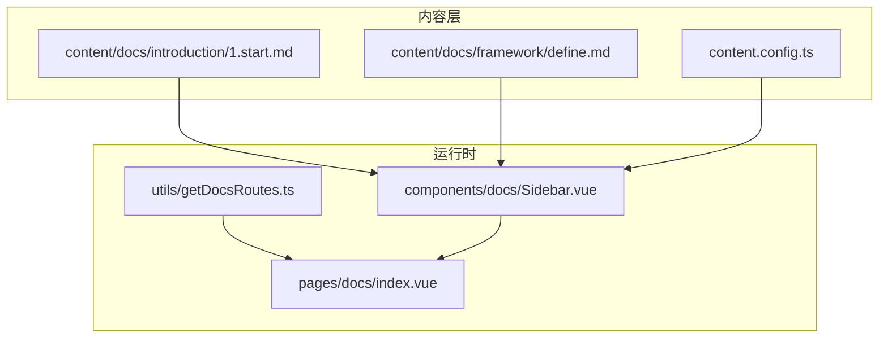
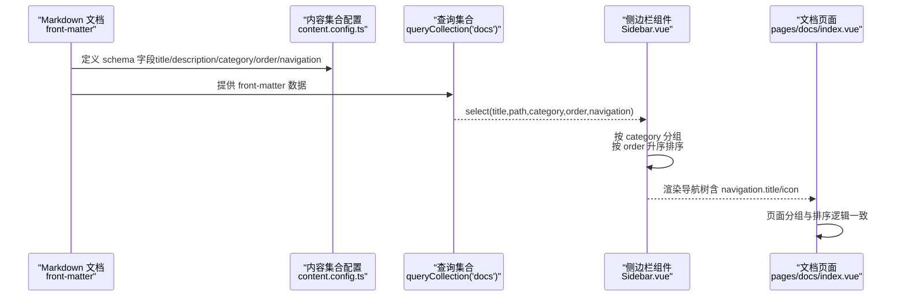
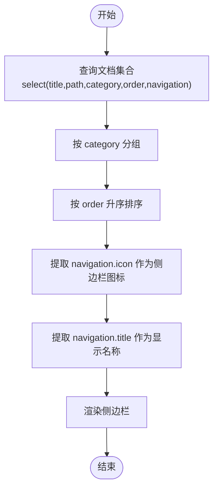
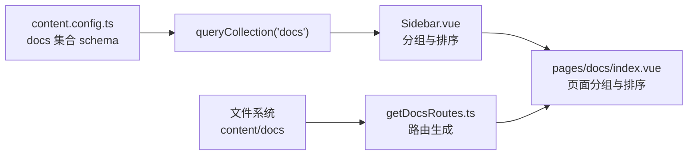

# front-matter元数据配置

<cite>
**本文引用的文件**
- [Sidebar.vue](file://components/docs/Sidebar.vue)
- [getDocsRoutes.ts](file://utils/getDocsRoutes.ts)
- [content.config.ts](file://content.config.ts)
- [1.start.md](file://content/docs/introduction/1.start.md)
- [define.md](file://content/docs/framework/define.md)
- [types.md](file://content/docs/framework/types.md)
- [index.vue](file://pages/docs/index.vue)
</cite>

## 目录
1. [简介](#简介)
2. [项目结构](#项目结构)
3. [核心组件](#核心组件)
4. [架构总览](#架构总览)
5. [详细组件分析](#详细组件分析)
6. [依赖分析](#依赖分析)
7. [性能考量](#性能考量)
8. [故障排查指南](#故障排查指南)
9. [结论](#结论)
10. [附录](#附录)

## 简介
本文件围绕文档顶部 YAML front-matter 的元数据配置进行系统化说明，重点解释以下字段的作用与协同关系：
- category：用于在侧边栏分组归类
- title：页面主标题
- navigation.title 与 navigation.icon：控制侧边栏显示名称与图标
- description：页面描述（用于 SEO 或列表摘要）
- order：显式排序优先级（若存在则覆盖文件名前缀）

结合示例文件“入门指南”与“进阶教程”的 category 使用，展示元数据如何影响最终导航结构，并给出最佳实践建议。

## 项目结构
本项目采用 Nuxt Content 驱动的内容管理，文档内容位于 content/docs 下，侧边栏组件负责从内容集合中读取元数据并生成导航树。路由生成工具负责静态预渲染路径。

图表来源
- [Sidebar.vue](file://components/docs/Sidebar.vue#L160-L177)
- [getDocsRoutes.ts](file://utils/getDocsRoutes.ts#L17-L57)
- [content.config.ts](file://content.config.ts#L17-L32)
- [1.start.md](file://content/docs/introduction/1.start.md#L1-L10)
- [define.md](file://content/docs/framework/define.md#L1-L10)
- [index.vue](file://pages/docs/index.vue#L95-L128)

章节来源
- [Sidebar.vue](file://components/docs/Sidebar.vue#L160-L177)
- [getDocsRoutes.ts](file://utils/getDocsRoutes.ts#L17-L57)
- [content.config.ts](file://content.config.ts#L17-L32)

## 核心组件
- 侧边栏组件：从内容集合查询文档，按 category 分组，按 order 升序排序，优先使用 navigation.icon 作为侧边栏图标，使用 navigation.title 作为显示名称。
- 内容集合配置：定义 docs 集合的 schema，声明 title、description、category、order、links 等字段，确保 front-matter 能被正确解析与校验。
- 路由生成工具：遍历 content/docs 目录，去除数字前缀生成路由路径，用于 Nitro 预渲染。

章节来源
- [Sidebar.vue](file://components/docs/Sidebar.vue#L160-L239)
- [content.config.ts](file://content.config.ts#L17-L32)
- [getDocsRoutes.ts](file://utils/getDocsRoutes.ts#L17-L57)

## 架构总览
front-matter 元数据在运行时的流转链路如下：
- front-matter 字段经内容集合 schema 解析并注入到文档对象
- 侧边栏组件按 category 分组，按 order 升序排序，使用 navigation.title/icon 渲染
- 页面路由由工具生成，去除数字前缀，保证路径整洁

图表来源
- [content.config.ts](file://content.config.ts#L17-L32)
- [Sidebar.vue](file://components/docs/Sidebar.vue#L160-L239)
- [index.vue](file://pages/docs/index.vue#L95-L128)

## 详细组件分析

### front-matter 字段详解
- category
  - 作用：决定文档在侧边栏的分组归属。若未设置，将被归入“未分类”。
  - 示例：1.start.md 设置为“入门指南”，define.md 设置为“进阶教程”。
- title
  - 作用：页面主标题，用于页面标题与导航显示。
- navigation.title
  - 作用：覆盖默认标题显示，用于侧边栏与面包屑等 UI 展示。
- navigation.icon
  - 作用：侧边栏条目图标，使用图标库名称。
- description
  - 作用：页面描述，可用于 SEO 或列表摘要。
- order
  - 作用：显式排序优先级。若存在，将覆盖文件名前缀的自然排序。

章节来源
- [1.start.md](file://content/docs/introduction/1.start.md#L1-L10)
- [define.md](file://content/docs/framework/define.md#L1-L10)
- [Sidebar.vue](file://components/docs/Sidebar.vue#L160-L239)
- [content.config.ts](file://content.config.ts#L17-L32)

### 侧边栏分组与排序逻辑
- 分组依据：优先使用 front-matter 的 category；若缺失则归为“未分类”。随后按预设顺序“指南”“框架”“未分类”排序，其余分类按字母顺序。
- 排序依据：先按 order 升序；若某文档未设置 order，则回退到文件名前缀的数字排序（由内容集合 schema 与文件系统命名约定共同决定）。
- 图标与标题：优先使用 navigation.icon 与 navigation.title；若 navigation 为布尔值或缺失，则回退到默认行为。

图表来源
- [Sidebar.vue](file://components/docs/Sidebar.vue#L160-L239)

章节来源
- [Sidebar.vue](file://components/docs/Sidebar.vue#L160-L239)

### 路由生成与文件名前缀
- 路由生成工具会遍历 content/docs，去除目录与文件名中的数字前缀（如 “1.”），生成干净的路由路径，确保预渲染与访问路径的一致性。
- 这意味着：若希望文件名前缀参与排序，需遵循“以点分隔的数字前缀”规范；若使用 order 字段，则可忽略文件名前缀。

章节来源
- [getDocsRoutes.ts](file://utils/getDocsRoutes.ts#L29-L50)

### 页面分组与排序一致性
- 文档页面 index.vue 对分组与排序的逻辑与侧边栏保持一致，确保导航与页面内容展示一致。

章节来源
- [index.vue](file://pages/docs/index.vue#L95-L128)

### 示例：category 影响导航结构
- 1.start.md 设置 category 为“入门指南”，将出现在“入门指南”分组下。
- define.md 设置 category 为“进阶教程”，将出现在“进阶教程”分组下。
- 由于 Sidebar.vue 的分组顺序为“指南”“框架”“未分类”，因此“入门指南”会优先于“框架”。

章节来源
- [1.start.md](file://content/docs/introduction/1.start.md#L1-L10)
- [define.md](file://content.docs/framework/define.md#L1-L10)
- [Sidebar.vue](file://components/docs/Sidebar.vue#L213-L230)

## 依赖分析
- Sidebar.vue 依赖内容集合 schema 中的字段（title/path/category/order/navigation），并依赖 queryCollection('docs') 的查询结果。
- content.config.ts 定义 docs 集合的 schema，确保 front-matter 字段被正确解析与类型推断。
- getDocsRoutes.ts 与 Sidebar.vue 的排序策略相互独立：前者处理路由生成与文件名前缀去除，后者处理内容排序与分组。

图表来源
- [content.config.ts](file://content.config.ts#L17-L32)
- [Sidebar.vue](file://components/docs/Sidebar.vue#L160-L239)
- [getDocsRoutes.ts](file://utils/getDocsRoutes.ts#L17-L57)
- [index.vue](file://pages/docs/index.vue#L95-L128)

章节来源
- [content.config.ts](file://content.config.ts#L17-L32)
- [Sidebar.vue](file://components/docs/Sidebar.vue#L160-L239)
- [getDocsRoutes.ts](file://utils/getDocsRoutes.ts#L17-L57)
- [index.vue](file://pages/docs/index.vue#L95-L128)

## 性能考量
- 使用 order 字段进行排序可避免复杂文件名前缀命名策略，简化维护成本。
- 在内容集合 schema 中为常用字段建立索引（如 category、order）可提升查询与排序性能（参考集合索引配置）。
- 侧边栏组件按需查询所需字段（title/path/category/order/navigation），避免不必要的数据传输。

章节来源
- [content.config.ts](file://content.config.ts#L17-L32)
- [Sidebar.vue](file://components/docs/Sidebar.vue#L160-L177)

## 故障排查指南
- 侧边栏未显示某文档
  - 检查文档是否属于 docs 集合（由 content.config.ts 控制）。
  - 检查 front-matter 是否包含 category/title/navigation.title。
- 分组顺序异常
  - 若未设置 category，文档将归入“未分类”，并按字母顺序排列。
  - 若希望固定顺序，请使用 category 并确保其值在预设列表中（如“指南”“框架”）。
- 排序不符合预期
  - 若设置了 order，请确认其数值大小与排序方向一致（升序）。
  - 若未设置 order，请检查文件名前缀是否遵循“以点分隔的数字前缀”规范。
- 图标或标题不显示
  - 确认 navigation 字段为对象且包含 icon/title，或提供 navigation.title/icon 字段。

章节来源
- [Sidebar.vue](file://components/docs/Sidebar.vue#L160-L239)
- [content.config.ts](file://content.config.ts#L17-L32)
- [types.md](file://content/docs/framework/types.md#L52-L91)

## 结论
front-matter 元数据在本项目中承担了“内容结构化、导航与排序控制”的关键角色。通过合理使用 category、title、navigation.title/icon、description、order 等字段，可以实现清晰的导航分组、稳定的排序与一致的 UI 展示。建议优先使用 order 字段进行显式排序，并在必要时配合 navigation.title/icon 提升可读性与一致性。

## 附录

### 最佳实践建议
- 使用 category 明确文档所属分组，避免过多“未分类”条目。
- 使用 order 字段覆盖文件名前缀排序，便于跨语言与多语境维护。
- 为 navigation.title/icon 提供清晰直观的显示名称与图标，提升导航可用性。
- 在 content.config.ts 中为高频查询字段（如 category、order）建立索引，提高查询性能。
- 保持文件名前缀命名规范（以点分隔的数字），确保路由生成与排序一致。

章节来源
- [content.config.ts](file://content.config.ts#L17-L32)
- [Sidebar.vue](file://components/docs/Sidebar.vue#L160-L239)
- [types.md](file://content/docs/framework/types.md#L114-L141)