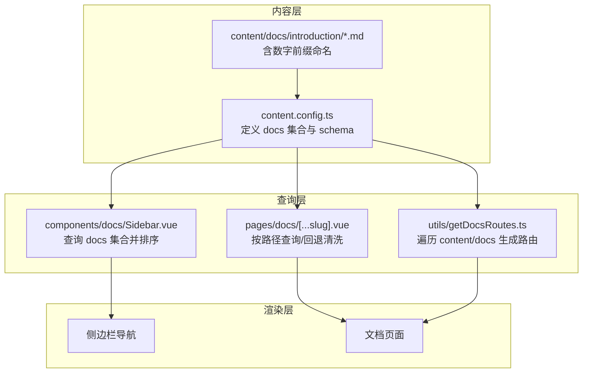
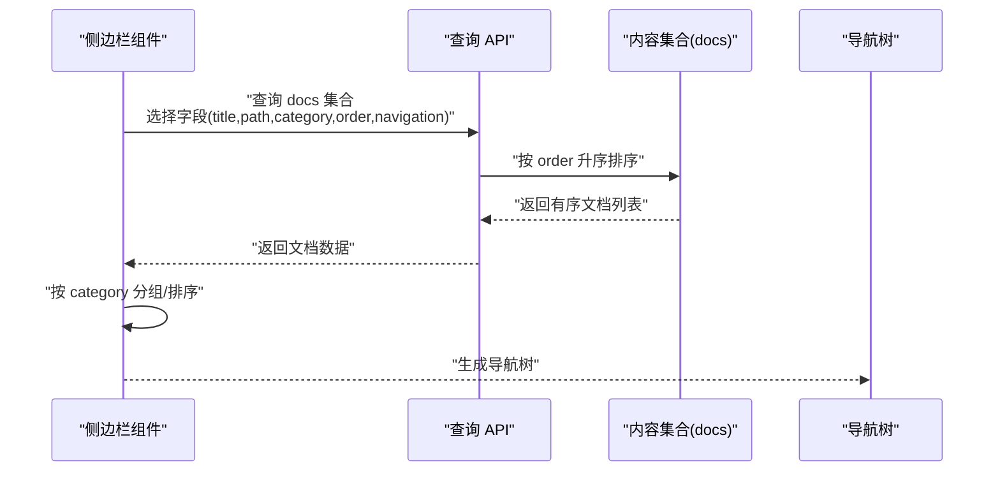
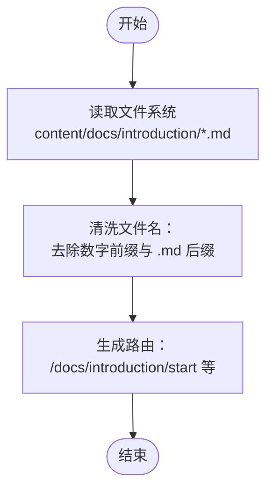
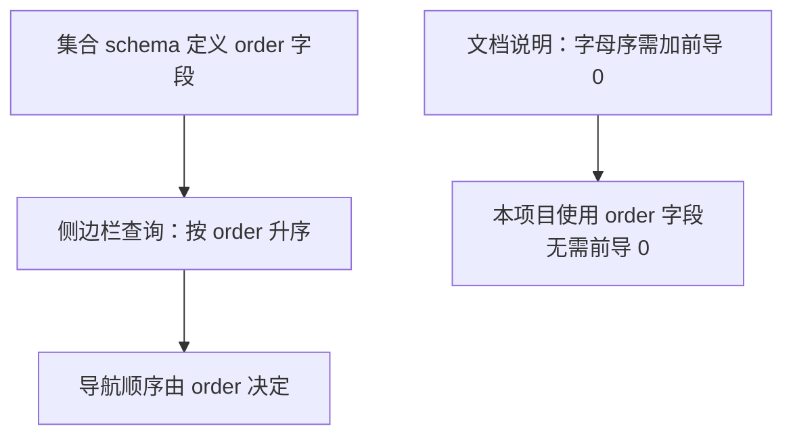
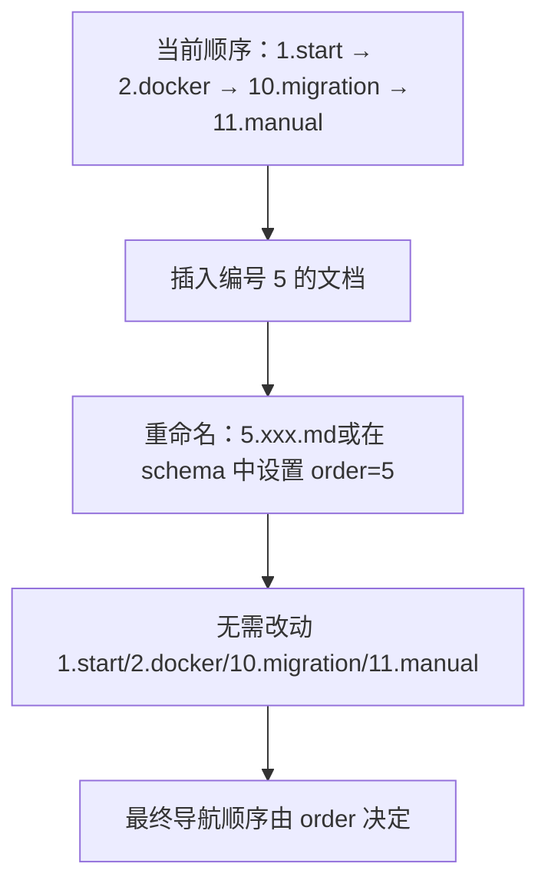
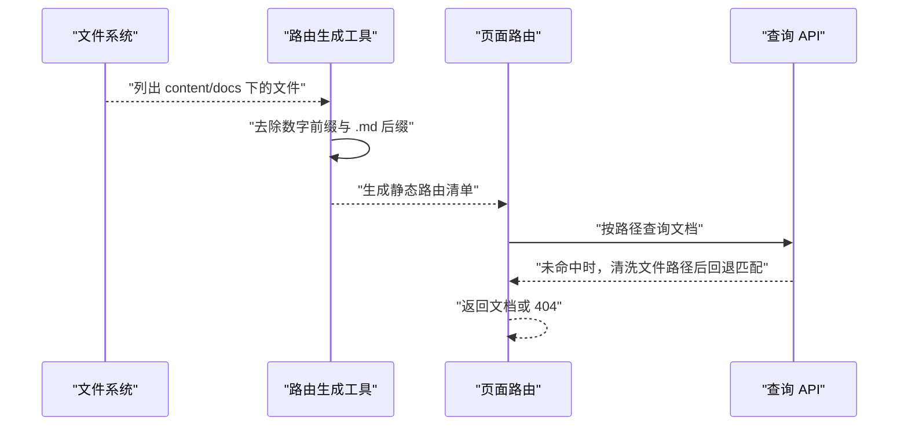
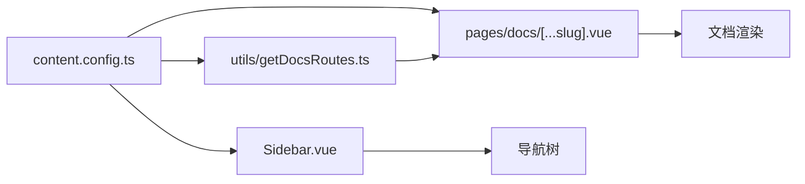

# 命名约定与排序机制

<cite>
**本文引用的文件**
- [content/docs/introduction/1.start.md](file://content/docs/introduction/1.start.md)
- [content/docs/introduction/2.docker-installation.md](file://content/docs/introduction/2.docker-installation.md)
- [content/docs/introduction/10.migration.md](file://content/docs/introduction/10.migration.md)
- [content/docs/introduction/11.manual-installation.md](file://content/docs/introduction/11.manual-installation.md)
- [content/docs/introduction/demo.md](file://content/docs/introduction/demo.md)
- [content.config.ts](file://content.config.ts)
- [components/docs/Sidebar.vue](file://components/docs/Sidebar.vue)
- [pages/docs/[...slug].vue](file://pages/docs/[...slug].vue)
- [utils/getDocsRoutes.ts](file://utils/getDocsRoutes.ts)
- [content/docs/framework/types.md](file://content/docs/framework/types.md)
</cite>

## 目录
1. [引言](#引言)
2. [项目结构](#项目结构)
3. [核心组件](#核心组件)
4. [架构总览](#架构总览)
5. [详细组件分析](#详细组件分析)
6. [依赖关系分析](#依赖关系分析)
7. [性能考量](#性能考量)
8. [故障排查指南](#故障排查指南)
9. [结论](#结论)

## 引言
本文件围绕文档系统的“命名约定与排序机制”展开，重点解释：
- introduction 目录中以数字前缀命名的 Markdown 文件（如 1.start.md、2.docker-installation.md、10.migration.md）如何通过文件名中的数字隐式定义其在导航结构中的显示顺序；
- 为什么使用“1.”、“10.”而非“01.”、“02.”仍能正确排序（依赖查询集合的排序逻辑）；
- 数字间隔（如 1 与 10 之间留出扩展空间）的设计意图，确保未来可灵活插入新文档而不破坏顺序。

## 项目结构
文档系统采用 Nuxt Content v3 的集合（collections）与查询 API，配合前端侧边栏组件与页面路由，形成“内容—查询—渲染”的闭环。关键要点：
- 内容集合在配置中声明，字段 schema 定义了可排序字段；
- 侧边栏组件通过查询 API 获取文档并按字段排序；
- 页面路由在无法精确匹配路径时，会清洗文件系统中的数字前缀后再进行回退匹配；
- 工具函数负责生成静态预渲染所需的文档路由清单，其中同样对数字前缀进行清洗。

图表来源
- [content.config.ts](file://content.config.ts#L1-L57)
- [components/docs/Sidebar.vue](file://components/docs/Sidebar.vue#L160-L177)
- [pages/docs/[...slug].vue](file://pages/docs/[...slug].vue#L185-L215)
- [utils/getDocsRoutes.ts](file://utils/getDocsRoutes.ts#L17-L57)

章节来源
- [content.config.ts](file://content.config.ts#L1-L57)
- [utils/getDocsRoutes.ts](file://utils/getDocsRoutes.ts#L17-L57)

## 核心组件
- 文档集合与字段 schema：docs 集合定义了可排序字段 order，用于控制导航顺序。
- 侧边栏组件：通过查询 API 获取文档并按 order 升序排序，再按分类分组展示。
- 页面路由：在精确路径未命中时，清洗文件系统中的数字前缀后进行回退匹配，保证路径与文件名的兼容性。
- 路由生成工具：遍历 content/docs 目录，去除数字前缀生成静态路由，确保预渲染覆盖所有文档。

章节来源
- [content.config.ts](file://content.config.ts#L17-L32)
- [components/docs/Sidebar.vue](file://components/docs/Sidebar.vue#L160-L177)
- [pages/docs/[...slug].vue](file://pages/docs/[...slug].vue#L185-L215)
- [utils/getDocsRoutes.ts](file://utils/getDocsRoutes.ts#L17-L57)

## 架构总览
下面的序列图展示了“侧边栏导航生成”的关键流程，强调排序字段 order 的作用与清洗逻辑。

图表来源
- [components/docs/Sidebar.vue](file://components/docs/Sidebar.vue#L160-L177)

章节来源
- [components/docs/Sidebar.vue](file://components/docs/Sidebar.vue#L160-L177)

## 详细组件分析

### 命名约定：数字前缀与路径清洗
- introduction 目录下的 Markdown 文件采用“数字前缀.文件名.md”的命名方式，例如 1.start.md、2.docker-installation.md、10.migration.md、11.manual-installation.md。
- 文件系统层面，数字前缀用于在目录遍历时确定顺序；页面路由在无法精确匹配时，会对文档路径进行清洗，去除数字前缀与 .md 后缀，从而实现“文件名带前缀但 URL 清晰”的效果。

图表来源
- [utils/getDocsRoutes.ts](file://utils/getDocsRoutes.ts#L32-L49)
- [pages/docs/[...slug].vue](file://pages/docs/[...slug].vue#L192-L208)

章节来源
- [utils/getDocsRoutes.ts](file://utils/getDocsRoutes.ts#L32-L49)
- [pages/docs/[...slug].vue](file://pages/docs/[...slug].vue#L192-L208)

### 排序机制：order 字段与字母序的对比
- docs 集合 schema 中定义了可选的 order 字段，侧边栏组件通过查询 API 按 order 升序排序，这是决定导航顺序的权威依据。
- 文档中关于“文件排序”的说明指出：Nuxt Content 默认使用字母序；若要实现数字顺序，应在单个数字前加“0”。这与本项目的实现一致——当不使用 order 字段时，字母序会将“10.xxx.md”排在“2.xxx.md”之前；而本项目通过 order 字段显式排序，避免了这一问题。

图表来源
- [content.config.ts](file://content.config.ts#L17-L32)
- [components/docs/Sidebar.vue](file://components/docs/Sidebar.vue#L167-L170)
- [content/docs/framework/types.md](file://content/docs/framework/types.md#L114-L141)

章节来源
- [content.config.ts](file://content.config.ts#L17-L32)
- [components/docs/Sidebar.vue](file://components/docs/Sidebar.vue#L167-L170)
- [content/docs/framework/types.md](file://content/docs/framework/types.md#L114-L141)

### 数字间隔与扩展空间：1 与 10 之间的设计
- introduction 目录中存在 1.start.md、2.docker-installation.md、10.migration.md、11.manual-installation.md 等文件，体现了“1 与 10 之间留出扩展空间”的策略。
- 设计意图：
  - 便于在未来新增编号为 2~9 的文档时，无需重命名现有文件即可插入；
  - 保持路径清晰（URL 不带数字前缀），同时保留排序控制权（通过 order 字段）。

图表来源
- [content/docs/introduction/1.start.md](file://content/docs/introduction/1.start.md#L1-L20)
- [content/docs/introduction/2.docker-installation.md](file://content/docs/introduction/2.docker-installation.md#L1-L20)
- [content/docs/introduction/10.migration.md](file://content/docs/introduction/10.migration.md#L1-L20)
- [content/docs/introduction/11.manual-installation.md](file://content/docs/introduction/11.manual-installation.md#L1-L20)

章节来源
- [content/docs/introduction/1.start.md](file://content/docs/introduction/1.start.md#L1-L20)
- [content/docs/introduction/2.docker-installation.md](file://content/docs/introduction/2.docker-installation.md#L1-L20)
- [content/docs/introduction/10.migration.md](file://content/docs/introduction/10.migration.md#L1-L20)
- [content/docs/introduction/11.manual-installation.md](file://content/docs/introduction/11.manual-installation.md#L1-L20)

### 路由生成与路径清洗：数字前缀的双重作用
- 路由生成工具会遍历 content/docs 目录，去除数字前缀生成静态路由，确保预渲染覆盖所有文档页面；
- 页面路由在精确路径未命中时，会清洗文件系统中的数字前缀与 .md 后缀，再进行回退匹配，保证 URL 与文件名的一致性。

图表来源
- [utils/getDocsRoutes.ts](file://utils/getDocsRoutes.ts#L32-L49)
- [pages/docs/[...slug].vue](file://pages/docs/[...slug].vue#L185-L215)

章节来源
- [utils/getDocsRoutes.ts](file://utils/getDocsRoutes.ts#L32-L49)
- [pages/docs/[...slug].vue](file://pages/docs/[...slug].vue#L185-L215)

## 依赖关系分析
- content.config.ts 定义 docs 集合与 schema，为排序与查询提供契约；
- Sidebar.vue 依赖查询 API，按 order 字段排序并分组；
- pages/docs/[...slug].vue 依赖查询 API 与路径清洗逻辑，确保 URL 与文件名的兼容；
- utils/getDocsRoutes.ts 依赖文件系统读取，去除数字前缀生成静态路由。

图表来源
- [content.config.ts](file://content.config.ts#L1-L57)
- [components/docs/Sidebar.vue](file://components/docs/Sidebar.vue#L160-L177)
- [pages/docs/[...slug].vue](file://pages/docs/[...slug].vue#L185-L215)
- [utils/getDocsRoutes.ts](file://utils/getDocsRoutes.ts#L17-L57)

章节来源
- [content.config.ts](file://content.config.ts#L1-L57)
- [components/docs/Sidebar.vue](file://components/docs/Sidebar.vue#L160-L177)
- [pages/docs/[...slug].vue](file://pages/docs/[...slug].vue#L185-L215)
- [utils/getDocsRoutes.ts](file://utils/getDocsRoutes.ts#L17-L57)

## 性能考量
- 使用 order 字段排序避免了字母序导致的“10 在 2 前”的问题，减少不必要的回退匹配与额外计算；
- 路由生成阶段提前清洗数字前缀，有助于静态预渲染的稳定性与覆盖率；
- 通过并行数据获取（页面与周边文档）提升首屏渲染性能。

## 故障排查指南
- 导航顺序异常
  - 检查 docs 集合 schema 中是否定义了 order 字段，并确认侧边栏查询是否按 order 升序排序；
  - 若未使用 order 字段，参考文档说明，需在单个数字前加“0”以实现数字序（本项目通过 order 字段规避该问题）。
- 路由 404 或路径不匹配
  - 页面路由在精确路径未命中时会进行路径清洗回退匹配，确认文件名是否包含数字前缀，以及 URL 是否与清洗后的路径一致；
  - 检查 utils/getDocsRoutes.ts 的清洗逻辑是否覆盖到目标文件。
- 新增文档后顺序错乱
  - 优先通过设置 order 字段控制顺序，避免频繁重命名文件；
  - 若仍需重命名，确保在 1 与 10 之间留出扩展空间，或调整相邻文件的 order 值。

章节来源
- [content.config.ts](file://content.config.ts#L17-L32)
- [components/docs/Sidebar.vue](file://components/docs/Sidebar.vue#L167-L170)
- [pages/docs/[...slug].vue](file://pages/docs/[...slug].vue#L185-L215)
- [utils/getDocsRoutes.ts](file://utils/getDocsRoutes.ts#L32-L49)

## 结论
- introduction 目录采用“数字前缀命名 + order 字段排序”的双轨机制：前者用于文件系统内的自然顺序，后者用于导航树的权威排序；
- 使用“1.”、“10.”而非“01.”、“02.”仍能正确排序，得益于查询集合的排序逻辑（order 升序）；
- 数字间隔的设计为未来扩展提供了灵活性，无需大规模重命名即可插入新文档；
- 路由生成与路径清洗逻辑确保了 URL 的清晰性与静态预渲染的完整性。