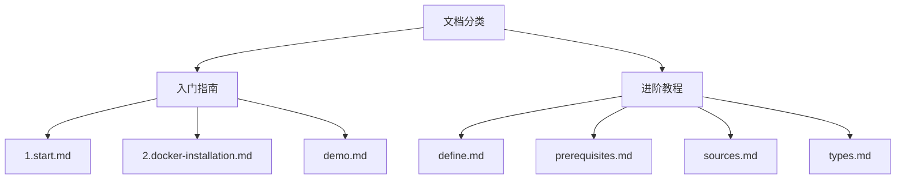
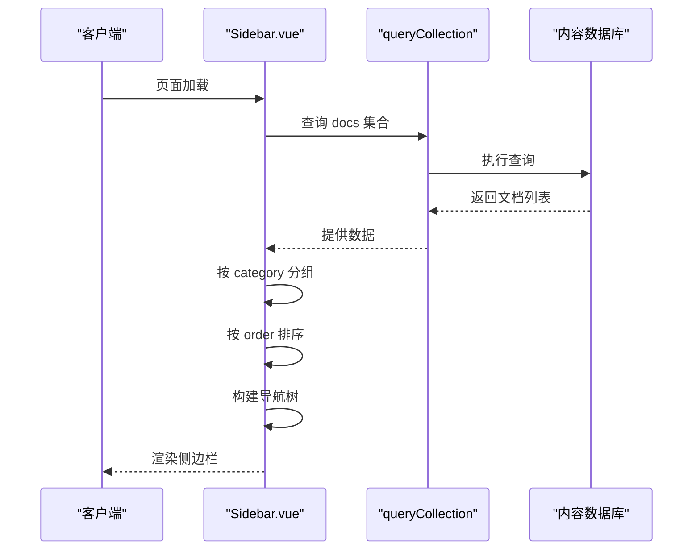

# 文档分类与目录结构

<cite>
**本文档引用文件**
- [Sidebar.vue](file://components/docs/Sidebar.vue#L1-L294)
- [getDocsRoutes.ts](file://utils/getDocsRoutes.ts#L1-L58)
- [index.vue](file://pages/docs/index.vue#L1-L129)
- [\[...slug\].vue](file://pages/docs/[...slug].vue#L1-L348)
- [content.config.ts](file://content.config.ts#L1-L57)
- [1.start.md](file://content/docs/introduction/1.start.md)
- [2.docker-installation.md](file://content/docs/introduction/2.docker-installation.md)
- [demo.md](file://content/docs/introduction/demo.md)
- [define.md](file://content/docs/framework/define.md)
- [prerequisites.md](file://content/docs/framework/prerequisites.md)
- [sources.md](file://content/docs/framework/sources.md)
- [types.md](file://content/docs/framework/types.md)
</cite>

## 目录

1. [项目结构概览](#项目结构概览)
2. [文档主题分类](#文档主题分类)
3. [目录结构与内容组织](#目录结构与内容组织)
4. [元数据与分类机制](#元数据与分类机制)
5. [侧边栏导航渲染逻辑](#侧边栏导航渲染逻辑)
6. [用户体验设计层次](#用户体验设计层次)
7. [路由与路径生成](#路由与路径生成)
8. [总结](#总结)

## 项目结构概览

本项目采用基于 Nuxt.js 的模块化架构，文档内容集中存储于 `content/docs/` 目录下，通过 `content.config.ts` 配置文件定义内容集合，并利用 Nuxt Content 模块实现内容的自动解析、类型推断与查询功能。文档系统通过 `pages/docs/` 下的页面组件进行展示，结合 `components/docs/Sidebar.vue` 实现动态侧边栏导航。

```mermaid
graph TB
subgraph "内容源"
A[content/docs/] --> B[introduction/]
A --> C[framework/]
end
subgraph "配置"
D[content.config.ts] --> E[定义 docs 集合]
D --> F[定义 schema]
end
subgraph "前端展示"
G[pages/docs/index.vue] --> H[文档首页]
I[pages/docs/[...slug].vue] --> J[文档详情页]
K[components/docs/Sidebar.vue] --> L[侧边栏导航]
end
D --> G
D --> I
A --> D
G --> L
I --> L
```

**Diagram sources**
- [content.config.ts](file://content.config.ts#L1-L57)
- [pages/docs/index.vue](file://pages/docs/index.vue#L1-L129)
- [pages/docs/[...slug\].vue](file://pages/docs/[...slug].vue#L1-L348)
- [components/docs/Sidebar.vue](file://components/docs/Sidebar.vue#L1-L294)

**Section sources**
- [content.config.ts](file://content.config.ts#L1-L57)
- [pages/docs/index.vue](file://pages/docs/index.vue#L1-L129)
- [pages/docs/[...slug\].vue](file://pages/docs/[...slug].vue#L1-L348)

## 文档主题分类

项目文档系统通过 `category` 元数据字段对内容进行语义化分类，主要分为两大主题类别：

- **入门指南**：面向新用户，提供从项目介绍到安装部署的线性学习路径
- **进阶教程**：面向开发者，深入讲解系统架构、内容集合定义、验证机制等高级主题

这种分类方式不仅体现了内容的难易程度，也反映了用户角色的转变：从使用者到集成者，从消费者到贡献者。

**Section sources**
- [1.start.md](file://content/docs/introduction/1.start.md)
- [define.md](file://content/docs/framework/define.md)

## 目录结构与内容组织

### 入门指南目录 (introduction)

`content/docs/introduction/` 目录下的文档构成了一条清晰的学习路径，文件名以数字前缀（如 `1.start.md`、`2.docker-installation.md`）标识顺序，形成线性阅读体验。

该目录包含以下核心文档：
- `1.start.md`：项目介绍与定位
- `2.docker-installation.md`：Docker 部署指南
- `demo.md`：演示环境说明

这些文档共同构成了新用户快速上手的完整流程，从了解产品到实际部署，逐步引导用户完成初始配置。

### 进阶教程目录 (framework)

`content/docs/framework/` 目录下的文档聚焦于系统底层机制与开发集成，包含以下核心主题：
- `define.md`：内容集合定义
- `prerequisites.md`：开发环境准备
- `sources.md`：集合源配置
- `types.md`：集合类型说明

这些文档为开发者提供了深度集成所需的技术细节，涵盖了从环境搭建到高级配置的各个方面。



**Diagram sources**
- [introduction/1.start.md](file://content/docs/introduction/1.start.md)
- [introduction/2.docker-installation.md](file://content/docs/introduction/2.docker-installation.md)
- [introduction/demo.md](file://content/docs/introduction/demo.md)
- [framework/define.md](file://content/docs/framework/define.md)
- [framework/prerequisites.md](file://content/docs/framework/prerequisites.md)
- [framework/sources.md](file://content/docs/framework/sources.md)
- [framework/types.md](file://content/docs/framework/types.md)

**Section sources**
- [content/docs/introduction/](file://content/docs/introduction/)
- [content/docs/framework/](file://content/docs/framework/)

## 元数据与分类机制

文档的分类功能依赖于 Markdown 文件头部的 front-matter 元数据。每个文档通过 `category` 字段声明其所属类别，例如：

```yaml
---
category: 入门指南
title: 智言AI介绍
navigation:
  title: 介绍
  icon: i-lucide-info
---
```

`content.config.ts` 文件中定义了 `docs` 集合的 schema，明确指定了 `category` 字段为可选字符串类型：

```ts
schema: z.object({
  title: z.string(),
  description: z.string(),
  category: z.string().optional(),
  order: z.number().optional(),
  links: z.array(z.object({
    label: z.string(),
    icon: z.string(),
    to: z.string(),
    target: z.string().optional(),
  })).optional()
})
```

这一设计确保了所有文档在构建时都能被正确解析和验证，同时保持了内容定义的灵活性。

**Section sources**
- [content.config.ts](file://content.config.ts#L1-L57)
- [1.start.md](file://content/docs/introduction/1.start.md)
- [define.md](file://content/docs/framework/define.md)

## 侧边栏导航渲染逻辑

`components/docs/Sidebar.vue` 组件负责渲染文档侧边栏导航，其实现逻辑如下：

1. **数据获取**：组件在根层级自动调用 `queryCollection('docs')` 查询所有文档，选择 `title`、`path`、`category`、`order` 等字段。
2. **分组聚合**：根据 `category` 字段对文档进行分组，未指定类别的文档归为"未分类"。
3. **排序规则**：分组按预定义顺序排列：`['指南', '框架', '未分类']`，组内文档按 `order` 字段升序排列。
4. **递归渲染**：组件支持多级嵌套，通过 `level` prop 控制递归层级和样式。

当用户访问某个文档页面时，侧边栏会自动展开包含当前页面的分组，提升导航体验。



**Diagram sources**
- [components/docs/Sidebar.vue](file://components/docs/Sidebar.vue#L1-L294)

**Section sources**
- [components/docs/Sidebar.vue](file://components/docs/Sidebar.vue#L1-L294)

## 用户体验设计层次

文档系统的分类设计体现了清晰的用户体验层次：

### 新手友好层（入门指南）

针对新用户设计的学习路径具有以下特点：
- **线性结构**：数字前缀确保阅读顺序
- **渐进式学习**：从介绍到安装，逐步深入
- **即时反馈**：提供演示环境快速体验
- **降低门槛**：Docker 一键部署简化安装

### 开发者赋能层（进阶教程）

针对开发者设计的进阶内容具有以下特点：
- **技术深度**：深入讲解内容集合、类型系统等底层机制
- **配置灵活性**：详细说明源配置、索引优化等高级选项
- **开发支持**：提供完整的环境准备指南
- **类型安全**：通过 Zod schema 实现类型推断与验证

这种分层设计确保了不同背景的用户都能找到适合自己的学习路径，既不会让新手感到困惑，也不会让开发者觉得内容浅薄。

**Section sources**
- [1.start.md](file://content/docs/introduction/1.start.md)
- [2.docker-installation.md](file://content/docs/introduction/2.docker-installation.md)
- [prerequisites.md](file://content/docs/framework/prerequisites.md)
- [types.md](file://content/docs/framework/types.md)

## 路由与路径生成

文档系统的路由机制通过 `utils/getDocsRoutes.ts` 实现，其核心逻辑如下：

1. **递归遍历**：扫描 `content/docs` 目录下的所有文件和子目录
2. **路径清理**：去除文件名前的数字前缀（如 `1.introduction` → `introduction`）
3. **路由生成**：将文件路径转换为 URL 路径，如 `introduction/1.start.md` → `/docs/introduction/start`
4. **预渲染支持**：生成的路由列表用于 Nitro 预渲染配置，确保所有页面都能被静态生成

`pages/docs/[...slug].vue` 页面组件通过 `useAsyncData` 和 `queryCollection` 实现动态内容加载，支持 URL 编码和路径匹配，确保中文路径等特殊字符能被正确处理。

**Section sources**
- [getDocsRoutes.ts](file://utils/getDocsRoutes.ts#L1-L58)
- [\[...slug\].vue](file://pages/docs/[...slug].vue#L1-L348)

## 总结

本项目的文档分类与目录结构设计体现了清晰的信息架构思维。通过 `introduction` 和 `framework` 两个目录的划分，以及 `category` 元数据的应用，系统成功实现了内容的语义化组织。`Sidebar.vue` 组件利用 Nuxt Content 的查询能力，自动将文档按类别分组并渲染为可折叠的导航菜单，大大提升了用户体验。

这种设计模式具有以下优势：
- **可维护性**：新增文档只需添加文件和元数据，无需修改导航代码
- **可扩展性**：可通过修改 `categoryOrder` 数组轻松调整分类顺序
- **用户体验**：自动展开当前分组，提供直观的导航反馈
- **SEO友好**：清晰的URL结构和内容层次有利于搜索引擎抓取

整体而言，该文档系统不仅满足了不同用户群体的需求，也为未来的功能扩展奠定了坚实的基础。
