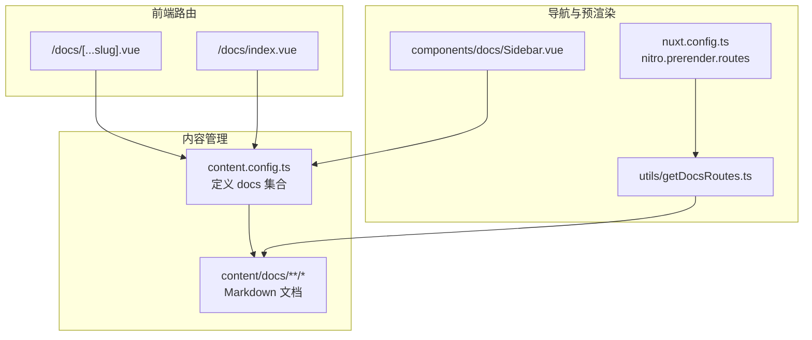
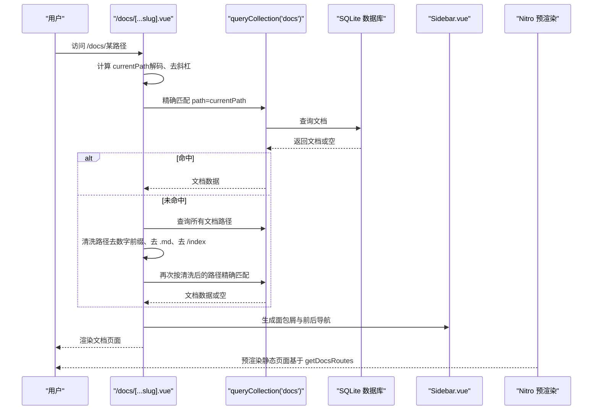
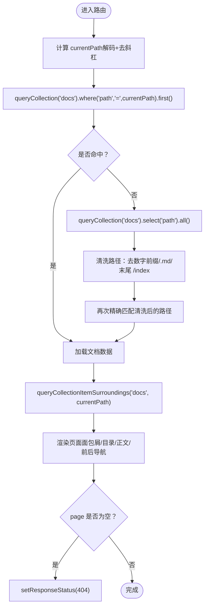
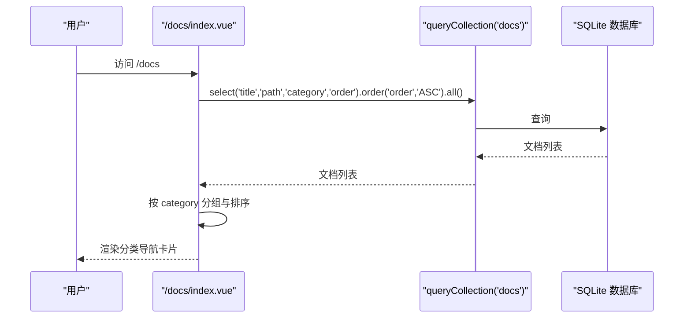
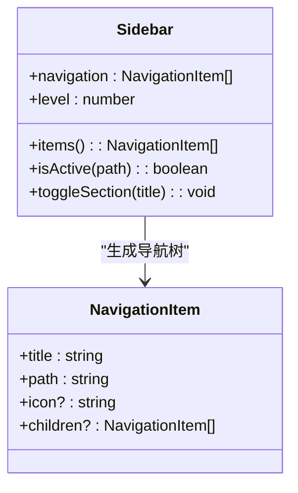
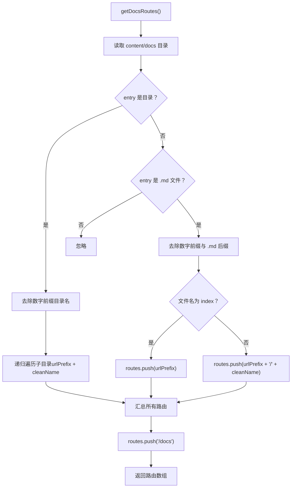
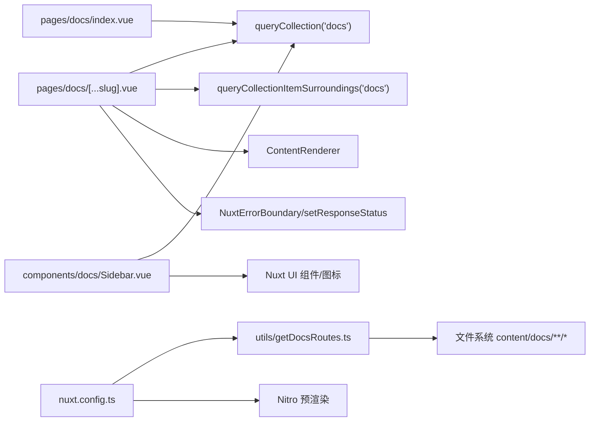

# 文档系统

<cite>
**本文引用的文件**
- [pages/docs/[...slug].vue](file://pages/docs/[...slug].vue)
- [pages/docs/index.vue](file://pages/docs/index.vue)
- [components/docs/Sidebar.vue](file://components/docs/Sidebar.vue)
- [utils/getDocsRoutes.ts](file://utils/getDocsRoutes.ts)
- [content.config.ts](file://content.config.ts)
- [nuxt.config.ts](file://nuxt.config.ts)
- [content/docs/introduction/1.start.md](file://content/docs/introduction/1.start.md)
- [content/docs/introduction/demo.md](file://content/docs/introduction/demo.md)
- [content/docs/framework/define.md](file://content/docs/framework/define.md)
</cite>

## 目录
1. [引言](#引言)
2. [项目结构](#项目结构)
3. [核心组件](#核心组件)
4. [架构总览](#架构总览)
5. [详细组件分析](#详细组件分析)
6. [依赖关系分析](#依赖关系分析)
7. [性能考量](#性能考量)
8. [故障排查指南](#故障排查指南)
9. [结论](#结论)
10. [附录](#附录)

## 引言
本文件围绕文档系统进行深度技术文档梳理，重点解释 content/docs 目录下的文档如何通过 /docs/[...slug].vue 动态路由渲染，分析文档层级结构（如 introduction 与 framework 子目录）的主题组织逻辑，阐述 pages/docs/[...slug].vue 中 useAsyncData 如何通过 queryCollection API 按路径精确查询文档内容并实现优雅的 404 处理，说明 utils/getDocsRoutes.ts 如何递归扫描 content/docs 目录、自动去除文件名前缀数字并生成静态路由列表以支持 Nitro 预渲染，最后结合 Sidebar.vue 组件讲解文档导航的生成机制，帮助开发者理解从文件到路由再到 UI 展示的完整流程。

## 项目结构
文档系统的关键目录与文件如下：
- pages/docs/[...slug].vue：文档详情页的动态路由入口，负责渲染当前文档、生成面包屑、目录与前后导航。
- pages/docs/index.vue：文档中心首页，按分类展示文档列表，便于搜索引擎抓取与用户浏览。
- components/docs/Sidebar.vue：文档侧边栏导航组件，支持分组折叠、高亮当前页、自动展开包含当前页的分组。
- utils/getDocsRoutes.ts：扫描 content/docs 目录，生成可用于 Nitro 预渲染的静态路由列表。
- content.config.ts：定义 Nuxt Content 的集合配置，声明 docs 集合的 schema 与字段。
- nuxt.config.ts：启用 Nuxt Content、Nitro 静态预渲染，并注入 getDocsRoutes 生成的路由列表。
- content/docs 下的 Markdown 文档：按主题组织在 introduction 与 framework 等子目录中，配合 Front Matter 提供标题、分类、描述等元数据。

**图表来源**
- [pages/docs/[...slug].vue](file://pages/docs/[...slug].vue#L167-L220)
- [pages/docs/index.vue](file://pages/docs/index.vue#L78-L128)
- [components/docs/Sidebar.vue](file://components/docs/Sidebar.vue#L156-L177)
- [utils/getDocsRoutes.ts](file://utils/getDocsRoutes.ts#L17-L57)
- [content.config.ts](file://content.config.ts#L17-L32)
- [nuxt.config.ts](file://nuxt.config.ts#L40-L51)

**章节来源**
- [pages/docs/[...slug].vue](file://pages/docs/[...slug].vue#L1-L165)
- [pages/docs/index.vue](file://pages/docs/index.vue#L1-L129)
- [components/docs/Sidebar.vue](file://components/docs/Sidebar.vue#L1-L120)
- [utils/getDocsRoutes.ts](file://utils/getDocsRoutes.ts#L1-L58)
- [content.config.ts](file://content.config.ts#L1-L57)
- [nuxt.config.ts](file://nuxt.config.ts#L1-L91)

## 核心组件
- 动态路由渲染器：pages/docs/[...slug].vue 使用 useAsyncData 并行查询当前文档与前后相邻文档，支持路径清洗与回退匹配，实现精确查询与优雅 404。
- 导航生成器：components/docs/Sidebar.vue 通过 queryCollection 获取文档列表，按 category 分组并排序，支持分组折叠与当前页高亮。
- 静态路由生成器：utils/getDocsRoutes.ts 递归扫描 content/docs，去除数字前缀与 .md 后缀，生成 /docs 前缀的静态路由，注入 Nitro 预渲染。
- 内容集合配置：content.config.ts 定义 docs 集合的 schema，确保 Front Matter 字段一致与类型推断。
- 预渲染配置：nuxt.config.ts 启用 Nitro 静态预渲染并将 getDocsRoutes 生成的路由列表注入。

**章节来源**
- [pages/docs/[...slug].vue](file://pages/docs/[...slug].vue#L167-L220)
- [components/docs/Sidebar.vue](file://components/docs/Sidebar.vue#L156-L239)
- [utils/getDocsRoutes.ts](file://utils/getDocsRoutes.ts#L17-L57)
- [content.config.ts](file://content.config.ts#L17-L32)
- [nuxt.config.ts](file://nuxt.config.ts#L40-L51)

## 架构总览
文档系统从“文件—集合—路由—UI”的链路如下：
- 文件层：content/docs 下的 Markdown 文档，通过 Front Matter 提供标题、分类、描述等元数据。
- 集合层：content.config.ts 定义 docs 集合，Nuxt Content 自动解析并建立索引。
- 路由层：pages/docs/[...slug].vue 通过 queryCollection 精确匹配当前路径，若未命中则回退清洗路径匹配；pages/docs/index.vue 展示分类导航；utils/getDocsRoutes.ts 生成静态路由列表，nuxt.config.ts 注入 Nitro 预渲染。
- UI 展示层：components/docs/Sidebar.vue 生成侧边导航树，pages/docs/[...slug].vue 渲染正文、目录与前后导航。

**图表来源**
- [pages/docs/[...slug].vue](file://pages/docs/[...slug].vue#L170-L220)
- [components/docs/Sidebar.vue](file://components/docs/Sidebar.vue#L156-L177)
- [utils/getDocsRoutes.ts](file://utils/getDocsRoutes.ts#L17-L57)
- [nuxt.config.ts](file://nuxt.config.ts#L40-L51)

## 详细组件分析

### 动态路由渲染器：pages/docs/[...slug].vue
- 路径处理：对当前路由进行 URL 解码与尾斜杠处理，保证路径一致性。
- 并行数据获取：同时获取当前文档与前后相邻文档，提升首屏渲染性能。
- 精确查询：优先按 cleanPath 精确匹配；若未命中，回退到清洗所有文档路径后匹配，兼容文件名带数字前缀的情况。
- 404 处理：当 page 为空时设置响应状态为 404，页面显示“文档未找到”并提供返回首页链接。
- 目录与滚动：基于 ContentRenderer 的 toc 生成目录，移动端与桌面端分别展示；使用 IntersectionObserver 实时更新活动标题，支持平滑滚动与历史记录更新。
- SEO：动态设置页面标题与描述。

**图表来源**
- [pages/docs/[...slug].vue](file://pages/docs/[...slug].vue#L170-L220)

**章节来源**
- [pages/docs/[...slug].vue](file://pages/docs/[...slug].vue#L167-L220)
- [pages/docs/[...slug].vue](file://pages/docs/[...slug].vue#L222-L279)
- [pages/docs/[...slug].vue](file://pages/docs/[...slug].vue#L280-L284)

### 文档中心首页：pages/docs/index.vue
- 数据获取：通过 queryCollection('docs') 获取标题、路径、分类与排序字段，按 order 升序排列。
- 分组与排序：按 category 分组，使用固定顺序（指南、框架、未分类）优先，其余按字母排序。
- 展示：以卡片形式展示各分组与条目数量，点击跳转到对应文档路径。

**图表来源**
- [pages/docs/index.vue](file://pages/docs/index.vue#L78-L128)

**章节来源**
- [pages/docs/index.vue](file://pages/docs/index.vue#L78-L128)

### 侧边导航组件：components/docs/Sidebar.vue
- 数据获取：仅在根层级且未显式传入 navigation 时，自动通过 queryCollection('docs') 获取文档列表，选择 title、path、category、order 等字段并按 order 升序。
- 分组与排序：按 category 分组，使用固定顺序（指南、框架、未分类）优先，其余按字母排序；支持从 Front Matter 的 navigation 字段提取图标。
- 折叠与展开：使用 useState 记录分组折叠状态；根据当前路由自动展开包含当前页的分组；支持手动切换。
- 高亮：根据当前路由高亮对应导航项。

**图表来源**
- [components/docs/Sidebar.vue](file://components/docs/Sidebar.vue#L124-L155)
- [components/docs/Sidebar.vue](file://components/docs/Sidebar.vue#L185-L239)
- [components/docs/Sidebar.vue](file://components/docs/Sidebar.vue#L241-L289)

**章节来源**
- [components/docs/Sidebar.vue](file://components/docs/Sidebar.vue#L156-L239)
- [components/docs/Sidebar.vue](file://components/docs/Sidebar.vue#L241-L289)

### 静态路由生成器：utils/getDocsRoutes.ts
- 递归遍历 content/docs 目录，去除目录名与文件名的数字前缀（如 1.），.md 后缀与 index 文件名处理为当前目录路径。
- 生成以 /docs 为前缀的路由列表，并确保包含 /docs 根路径，以便 Nitro 预渲染。

**图表来源**
- [utils/getDocsRoutes.ts](file://utils/getDocsRoutes.ts#L17-L57)

**章节来源**
- [utils/getDocsRoutes.ts](file://utils/getDocsRoutes.ts#L17-L57)

### 内容集合配置：content.config.ts
- 定义 docs 集合，source 为 docs/**/*.md，递归匹配所有 Markdown 文件。
- schema 包含 title、description、category、order、links 等字段，确保 Front Matter 一致性与类型推断。

**章节来源**
- [content.config.ts](file://content.config.ts#L17-L32)

### 预渲染配置：nuxt.config.ts
- 启用 @nuxt/content 与 @nuxt/ui 模块。
- 配置 content.database 为 sqlite。
- 在 nitro.prerender.routes 中注入 getDocsRoutes() 返回的路由列表，实现静态预渲染。

**章节来源**
- [nuxt.config.ts](file://nuxt.config.ts#L18-L21)
- [nuxt.config.ts](file://nuxt.config.ts#L32-L38)
- [nuxt.config.ts](file://nuxt.config.ts#L40-L51)

## 依赖关系分析
- pages/docs/[...slug].vue 依赖：
  - Nuxt Content 的 queryCollection 与 queryCollectionItemSurroundings。
  - ContentRenderer 渲染 Markdown。
  - NuxtErrorBoundary 与 setResponseStatus 实现错误与 404。
- components/docs/Sidebar.vue 依赖：
  - Nuxt UI 的图标与组件（NuxtLink、UIcon 等）。
  - Nuxt Content 的 queryCollection。
  - useState 与 watch 管理折叠状态与当前路由联动。
- utils/getDocsRoutes.ts 依赖：
  - Node.js fs 与 path，递归扫描文件系统。
- nuxt.config.ts 依赖：
  - getDocsRoutes.ts 生成的路由列表注入 Nitro 预渲染。

**图表来源**
- [pages/docs/[...slug].vue](file://pages/docs/[...slug].vue#L167-L220)
- [pages/docs/index.vue](file://pages/docs/index.vue#L78-L128)
- [components/docs/Sidebar.vue](file://components/docs/Sidebar.vue#L156-L177)
- [utils/getDocsRoutes.ts](file://utils/getDocsRoutes.ts#L17-L57)
- [nuxt.config.ts](file://nuxt.config.ts#L40-L51)

**章节来源**
- [pages/docs/[...slug].vue](file://pages/docs/[...slug].vue#L167-L220)
- [pages/docs/index.vue](file://pages/docs/index.vue#L78-L128)
- [components/docs/Sidebar.vue](file://components/docs/Sidebar.vue#L156-L177)
- [utils/getDocsRoutes.ts](file://utils/getDocsRoutes.ts#L17-L57)
- [nuxt.config.ts](file://nuxt.config.ts#L40-L51)

## 性能考量
- 并行数据获取：在动态路由中使用 Promise.all 同时获取文档与前后导航，减少首屏等待时间。
- 路由预渲染：通过 getDocsRoutes 生成静态路由，Nitro 预渲染可显著提升首屏性能与 SEO。
- 路径清洗：在未命中精确匹配时，先获取全部路径再清洗匹配，避免多次数据库查询，但需注意在大量文档时的内存与 CPU 开销。
- 目录监听：Sidebar 仅在根层级自动获取数据，避免不必要的网络请求与重复渲染。
- 折叠状态持久化：使用 useState 保持折叠状态，减少频繁初始化导致的性能损耗。

[本节为通用性能建议，不直接分析具体文件]

## 故障排查指南
- 文档 404：
  - 现象：页面显示“文档未找到”，状态码为 404。
  - 排查：确认路径是否正确；检查 content/docs 中是否存在对应文件；确认 Front Matter 的 path 是否与文件系统一致；确认 getDocsRoutes 是否包含该路由。
- 路由不生效：
  - 现象：访问 /docs/xxx 返回 404。
  - 排查：确认 nuxt.config.ts 中 nitro.prerender.routes 是否包含该路由；确认 utils/getDocsRoutes.ts 是否正确生成；确认文件名是否包含数字前缀导致路径清洗异常。
- 导航不显示或分组错乱：
  - 现象：Sidebar 未显示分组或顺序异常。
  - 排查：确认 docs 集合 schema 中的 category 字段值；确认 pages/docs/index.vue 与 Sidebar.vue 的分组顺序一致；确认 order 字段是否正确设置。
- 目录滚动不同步：
  - 现象：点击目录项不跳转或高亮不同步。
  - 排查：确认 ContentRenderer 输出的 toc.links 是否存在；确认标题元素 id 是否存在；确认 IntersectionObserver 初始化是否成功。

**章节来源**
- [pages/docs/[...slug].vue](file://pages/docs/[...slug].vue#L222-L226)
- [pages/docs/[...slug].vue](file://pages/docs/[...slug].vue#L255-L278)
- [components/docs/Sidebar.vue](file://components/docs/Sidebar.vue#L241-L268)
- [utils/getDocsRoutes.ts](file://utils/getDocsRoutes.ts#L17-L57)
- [nuxt.config.ts](file://nuxt.config.ts#L40-L51)

## 结论
本文档系统通过 Nuxt Content 的集合与查询 API、动态路由与并行数据获取、侧边导航与预渲染策略，形成了从文件到路由再到 UI 的完整链路。content/docs 的层级结构（如 introduction 与 framework）通过 Front Matter 的 category 字段与 Sidebar 的分组逻辑清晰呈现，路径清洗与回退匹配机制增强了容错性，Nitro 预渲染确保了性能与 SEO。Sidebar.vue 与 pages/docs/index.vue 保持一致的分组与排序逻辑，为用户提供一致的导航体验。

[本节为总结性内容，不直接分析具体文件]

## 附录
- 示例文档：
  - introduction/1.start.md：展示 Front Matter 的 category、title、navigation 等字段。
  - introduction/demo.md：演示 Front Matter 的 description 与 navigation。
  - framework/define.md：展示集合定义与 queryCollection 的使用说明。
- 关键实现路径：
  - 动态路由渲染：[pages/docs/[...slug].vue](file://pages/docs/[...slug].vue#L167-L220)
  - 导航生成：[components/docs/Sidebar.vue](file://components/docs/Sidebar.vue#L156-L239)
  - 静态路由生成：[utils/getDocsRoutes.ts](file://utils/getDocsRoutes.ts#L17-L57)
  - 集合配置：[content.config.ts](file://content.config.ts#L17-L32)
  - 预渲染配置：[nuxt.config.ts](file://nuxt.config.ts#L40-L51)