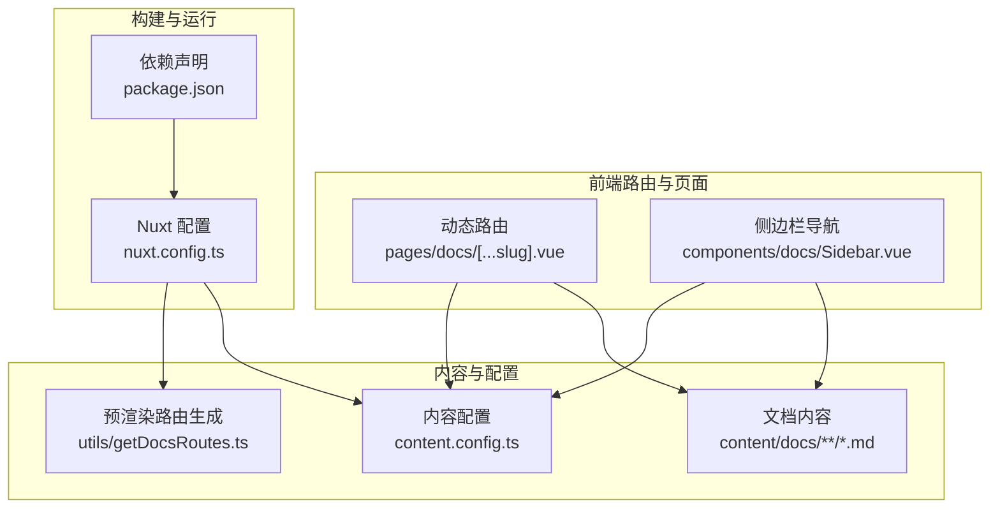
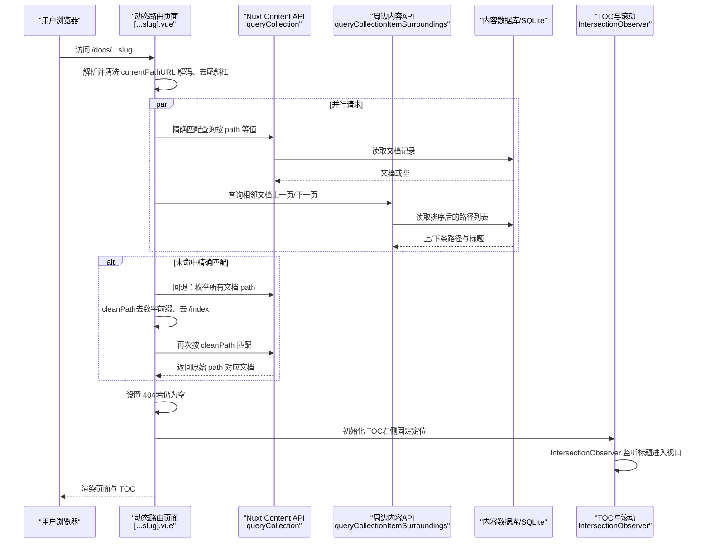
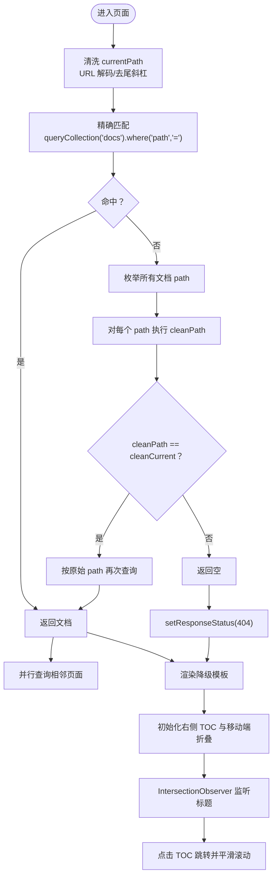
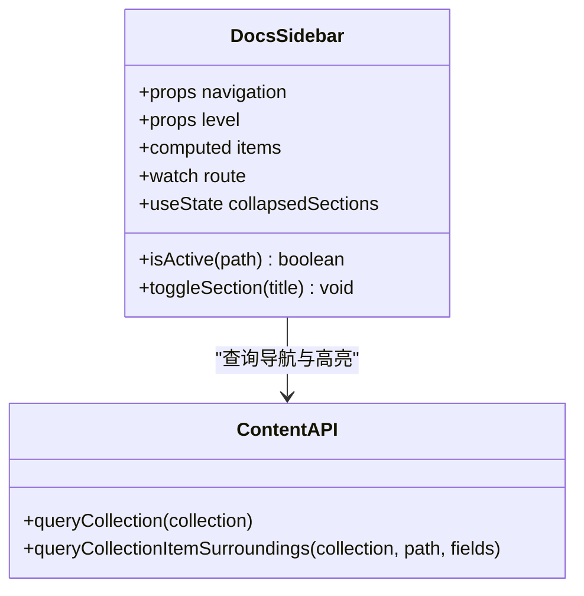
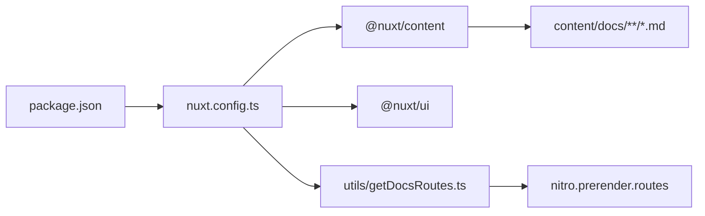

# 动态路由解析与内容查询

<cite>
**本文引用的文件**
- [pages/docs/[...slug].vue](file://pages/docs/[...slug].vue)
- [content.config.ts](file://content.config.ts)
- [utils/getDocsRoutes.ts](file://utils/getDocsRoutes.ts)
- [components/docs/Sidebar.vue](file://components/docs/Sidebar.vue)
- [nuxt.config.ts](file://nuxt.config.ts)
- [package.json](file://package.json)
- [content/docs/introduction/1.start.md](file://content/docs/introduction/1.start.md)
- [content/docs/framework/types.md](file://content/docs/framework/types.md)
</cite>

## 目录
1. [引言](#引言)
2. [项目结构](#项目结构)
3. [核心组件](#核心组件)
4. [架构总览](#架构总览)
5. [详细组件分析](#详细组件分析)
6. [依赖分析](#依赖分析)
7. [性能考虑](#性能考虑)
8. [故障排查指南](#故障排查指南)
9. [结论](#结论)

## 引言
本文件围绕 Nuxt.js 动态路由与内容查询机制，深入解析 pages/docs/[...slug].vue 如何利用 Nuxt Content 的 queryCollection API 实现“URL 友好路径”与“文件系统结构解耦”的内容解析流程。文档重点覆盖：
- 动态路由捕获与路径清洗
- 精确匹配与模糊匹配（cleanPath）回退策略
- useAsyncData 并行数据加载与错误降级
- 目录（TOC）生成、移动端折叠交互、右侧固定定位与基于 IntersectionObserver 的高亮
- 预渲染与静态站点生成的配合
- 性能优化建议与最佳实践

## 项目结构
本项目采用 Nuxt Content v3 驱动的内容管理，文档内容位于 content/docs 目录，动态路由由 pages/docs/[...slug].vue 统一承接，侧边导航由 components/docs/Sidebar.vue 提供。

**图表来源**
- [pages/docs/[...slug].vue](file://pages/docs/[...slug].vue#L1-L120)
- [content.config.ts](file://content.config.ts#L1-L57)
- [utils/getDocsRoutes.ts](file://utils/getDocsRoutes.ts#L1-L58)
- [components/docs/Sidebar.vue](file://components/docs/Sidebar.vue#L1-L120)
- [nuxt.config.ts](file://nuxt.config.ts#L1-L91)
- [package.json](file://package.json#L1-L48)

**章节来源**
- [nuxt.config.ts](file://nuxt.config.ts#L1-L91)
- [content.config.ts](file://content.config.ts#L1-L57)
- [utils/getDocsRoutes.ts](file://utils/getDocsRoutes.ts#L1-L58)
- [package.json](file://package.json#L1-L48)

## 核心组件
- 动态路由页面：pages/docs/[...slug].vue
  - 负责接收动态路径、并行查询文档与相邻页面、处理 404、渲染内容与 TOC、滚动与高亮。
- 侧边导航：components/docs/Sidebar.vue
  - 负责从内容集合生成导航树、分组与折叠、当前路由高亮、骨架屏与错误处理。
- 内容配置：content.config.ts
  - 定义 docs 集合的类型、字段与校验，决定 path/title/description 等内置字段与 body/toc 结构。
- 预渲染路由生成：utils/getDocsRoutes.ts
  - 遍历 content/docs 生成静态路由，保证预渲染覆盖所有文档页面。
- 构建配置：nuxt.config.ts
  - 启用 @nuxt/content 与 @nuxt/ui，配置 SQLite 数据库、静态输出与预渲染注入。

**章节来源**
- [pages/docs/[...slug].vue](file://pages/docs/[...slug].vue#L1-L120)
- [components/docs/Sidebar.vue](file://components/docs/Sidebar.vue#L1-L120)
- [content.config.ts](file://content.config.ts#L1-L57)
- [utils/getDocsRoutes.ts](file://utils/getDocsRoutes.ts#L1-L58)
- [nuxt.config.ts](file://nuxt.config.ts#L1-L91)

## 架构总览
动态路由解析与内容查询的整体流程如下：

**图表来源**
- [pages/docs/[...slug].vue](file://pages/docs/[...slug].vue#L170-L258)
- [content.config.ts](file://content.config.ts#L1-L57)

**章节来源**
- [pages/docs/[...slug].vue](file://pages/docs/[...slug].vue#L170-L258)
- [content.config.ts](file://content.config.ts#L1-L57)

## 详细组件分析

### 动态路由页面：pages/docs/[...slug].vue
- 路径清洗与并行数据加载
  - currentPath 通过 useRoute 获取，进行 URL 解码与尾斜杠处理，避免路径歧义。
  - 使用 Promise.all 并行执行两个 useAsyncData：
    - 文档内容：先按 path 精确匹配，未命中则回退到 cleanPath 策略匹配。
    - 相邻页面：通过 queryCollectionItemSurroundings 获取上一页/下一页的标题与路径。
- 错误处理与 404
  - 若 page 为空，调用 setResponseStatus(404)，触发 NuxtErrorBoundary 降级展示。
  - 模板中包含 NuxtErrorBoundary 的 error 插槽，提供重试与返回首页的能力。
- 目录（TOC）与滚动高亮
  - 通过 ContentRenderer 渲染 body.toc，右侧固定定位展示 TOC。
  - 移动端提供折叠面板，点击跳转并关闭面板。
  - 使用 IntersectionObserver 监听 h2/h3 标题进入视口，实时更新 activeId，实现 TOC 高亮联动。
  - scrollToHeading 实现平滑滚动并同步更新 URL hash。
- SEO 元信息
  - useSeoMeta 根据 page.title 动态设置页面标题与描述。

**图表来源**
- [pages/docs/[...slug].vue](file://pages/docs/[...slug].vue#L170-L258)

**章节来源**
- [pages/docs/[...slug].vue](file://pages/docs/[...slug].vue#L1-L120)
- [pages/docs/[...slug].vue](file://pages/docs/[...slug].vue#L170-L258)
- [pages/docs/[...slug].vue](file://pages/docs/[...slug].vue#L258-L348)

### 侧边导航：components/docs/Sidebar.vue
- 导航数据来源
  - 在根层级且未显式传入 navigation 时，使用 useAsyncData 从 docs 集合查询 title/path/category/order/navigation 等字段，按 order 升序排列。
- 分组与排序
  - 依据 category 分组，支持自定义分类顺序（如“指南”“框架”“未分类”），未在预设列表内的分类按字母排序。
- 折叠与展开
  - 使用 useState 记录各分组折叠状态；根据当前路由自动展开包含当前页面的分组。
- 高亮与交互
  - isActive 判断当前激活路径；提供按钮切换折叠状态；支持图标与无障碍属性。
- 错误与骨架屏
  - pending/error 状态下显示骨架屏或错误提示；异常时抛出以便上层处理。

**图表来源**
- [components/docs/Sidebar.vue](file://components/docs/Sidebar.vue#L1-L294)

**章节来源**
- [components/docs/Sidebar.vue](file://components/docs/Sidebar.vue#L1-L120)
- [components/docs/Sidebar.vue](file://components/docs/Sidebar.vue#L160-L240)
- [components/docs/Sidebar.vue](file://components/docs/Sidebar.vue#L240-L294)

### 内容配置与集合类型：content.config.ts
- docs 集合
  - 类型为 page，支持 path/title/description/seo/body/navigation 等内置字段。
  - body.toc 由 Nuxt Content 自动生成，用于页面目录渲染。
- 集合字段与校验
  - title/description 为必填字符串；category 可选；links 为可选数组结构。
- 文件排序与路径生成
  - page 类型集合会自动生成 path 字段，文件名数字前缀用于排序；index.md 生成目录路径。

**章节来源**
- [content.config.ts](file://content.config.ts#L1-L57)
- [content/docs/framework/types.md](file://content/docs/framework/types.md#L1-L141)

### 预渲染路由生成：utils/getDocsRoutes.ts
- 遍历 content/docs 目录，递归生成 URL 路径：
  - 去除目录/文件名前的数字前缀（如 1.introduction -> introduction）。
  - index.md 生成当前目录路径；其他文件生成“目录/文件名”路径。
  - 最终确保包含 /docs 根路径。
- 注入到 nuxt.config.ts 的 nitro.prerender.routes，实现静态预渲染。

**章节来源**
- [utils/getDocsRoutes.ts](file://utils/getDocsRoutes.ts#L1-L58)
- [nuxt.config.ts](file://nuxt.config.ts#L40-L51)

## 依赖分析
- 模块依赖
  - @nuxt/content：提供 queryCollection/queryCollectionItemSurroundings 等 API。
  - @nuxt/ui：提供 UI 组件与主题能力。
  - better-sqlite3/pg：SQLite/PostgreSQL 驱动（取决于数据库配置）。
- 构建与预渲染
  - nuxt.config.ts 启用 @nuxt/content 与 @nuxt/ui，配置 SQLite 数据库与静态输出。
  - utils/getDocsRoutes.ts 生成预渲染路由，注入 nitro.prerender.routes。

**图表来源**
- [package.json](file://package.json#L1-L48)
- [nuxt.config.ts](file://nuxt.config.ts#L1-L91)
- [utils/getDocsRoutes.ts](file://utils/getDocsRoutes.ts#L1-L58)

**章节来源**
- [package.json](file://package.json#L1-L48)
- [nuxt.config.ts](file://nuxt.config.ts#L1-L91)

## 性能考虑
- 数据加载策略
  - 并行加载文档与相邻页面，减少首屏等待时间。
  - 对于大量文档的回退匹配，建议在内容较多时考虑：
    - 为常用 slug 建立索引字段（如 slug 字段）并维护映射表，避免全量枚举。
    - 在服务端预计算 cleanPath 到原始 path 的映射，减少运行时字符串处理。
- 预渲染与静态生成
  - 通过 utils/getDocsRoutes.ts 生成完整路由，结合 nitro.static 输出，显著降低首屏延迟。
- 客户端渲染优化
  - TOC 与滚动使用 IntersectionObserver，避免频繁重排；仅在 mounted 后初始化，避免 SSR 不一致。
  - 侧边栏导航使用 useAsyncData，避免阻塞客户端导航；提供骨架屏提升感知性能。
- 缓存与提示
  - 可在 useAsyncData 中为文档数据设置合适的 key（如 docs-${currentPath}），利用 Nuxt 内置缓存。
  - 对于高频访问的相邻页面，可考虑在客户端做轻量缓存（如内存缓存）以减少重复请求。

[本节为通用性能建议，不直接分析具体文件，故无章节来源]

## 故障排查指南
- 404 页面
  - 当 page 为空时设置 404，模板中提供降级提示与返回首页链接；同时提供 error 插槽用于重试。
- 路由不匹配
  - 确认 content/docs 文件命名是否包含数字前缀，cleanPath 逻辑会去除前缀与 /index。
  - 检查 content.config.ts 中 docs 集合的 source 与 schema 是否正确。
- 预渲染缺失
  - 确认 utils/getDocsRoutes.ts 是否正确生成路由，nuxt.config.ts 的 nitro.prerender.routes 是否包含该路由。
- TOC 不高亮
  - 检查标题元素是否具有 id；确认 IntersectionObserver 初始化时机（mounted 后）。
  - 确认滚动偏移与 scroll-margin-top 是否影响命中区域。

**章节来源**
- [pages/docs/[...slug].vue](file://pages/docs/[...slug].vue#L222-L258)
- [pages/docs/[...slug].vue](file://pages/docs/[...slug].vue#L120-L165)
- [content.config.ts](file://content.config.ts#L1-L57)
- [utils/getDocsRoutes.ts](file://utils/getDocsRoutes.ts#L1-L58)
- [nuxt.config.ts](file://nuxt.config.ts#L40-L51)

## 结论
本项目通过 Nuxt Content v3 的集合与 API，实现了“URL 友好路径”与“文件系统结构解耦”的动态路由解析与内容查询。pages/docs/[...slug].vue 采用精确匹配优先、cleanPath 回退的策略，结合 useAsyncData 并行加载与 NuxtErrorBoundary 降级，确保用户体验与可维护性。配合 utils/getDocsRoutes.ts 的预渲染路由生成与 nuxt.config.ts 的静态输出配置，整体具备良好的性能与可扩展性。后续可在大规模内容场景下引入索引与缓存策略，进一步优化匹配与渲染性能。