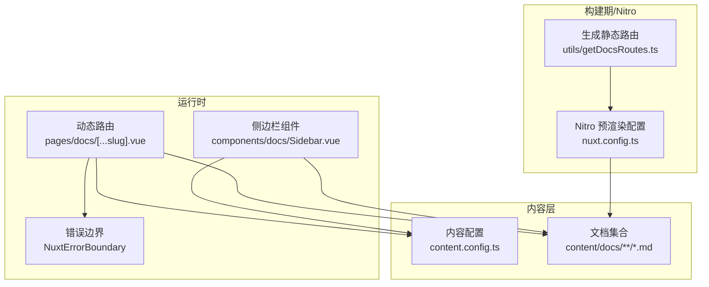
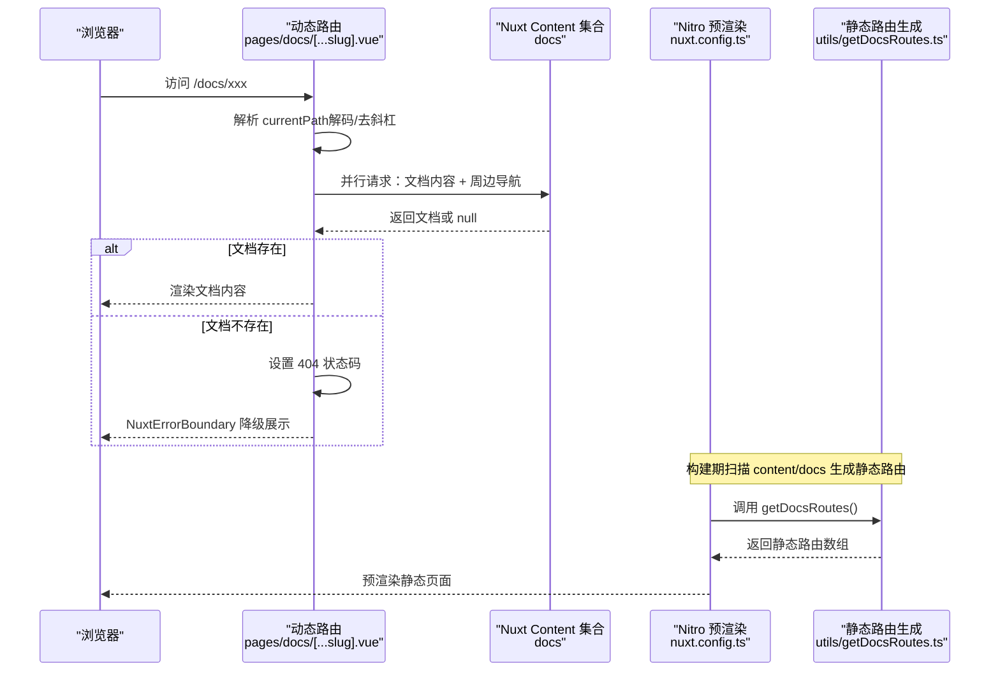
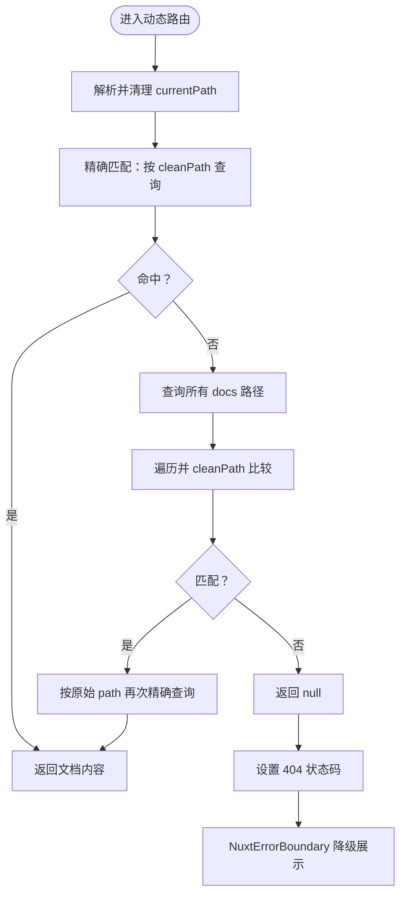
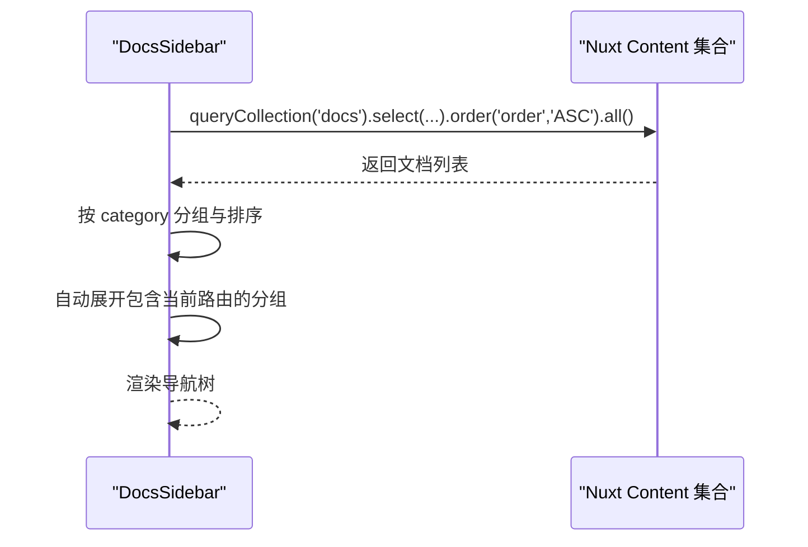
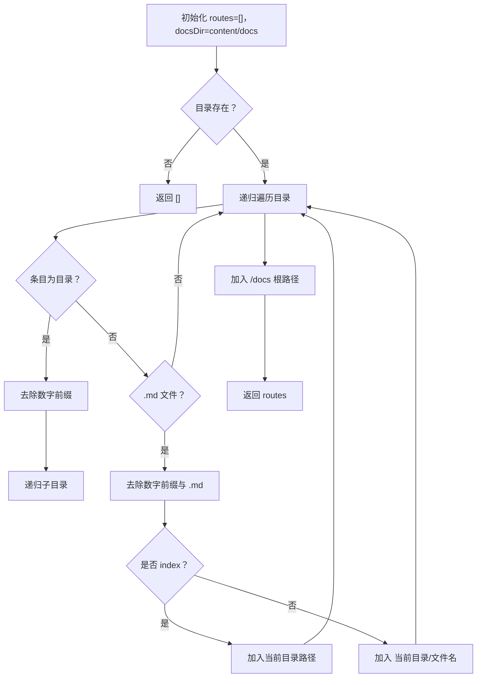
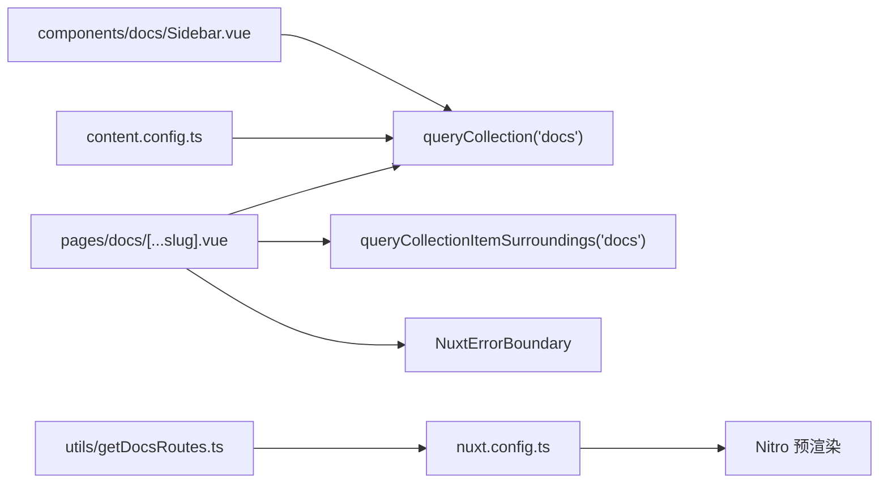

# 路由与数据获取

<cite>
**本文引用的文件**
- [pages/docs/[...slug].vue](file://pages/docs/[...slug].vue)
- [utils/getDocsRoutes.ts](file://utils/getDocsRoutes.ts)
- [content.config.ts](file://content.config.ts)
- [nuxt.config.ts](file://nuxt.config.ts)
- [components/docs/Sidebar.vue](file://components/docs/Sidebar.vue)
- [content/docs/introduction/1.start.md](file://content/docs/introduction/1.start.md)
</cite>

## 目录
1. [引言](#引言)
2. [项目结构](#项目结构)
3. [核心组件](#核心组件)
4. [架构总览](#架构总览)
5. [详细组件分析](#详细组件分析)
6. [依赖关系分析](#依赖关系分析)
7. [性能考量](#性能考量)
8. [故障排查指南](#故障排查指南)
9. [结论](#结论)

## 引言
本文围绕文档系统路由机制与数据获取流程展开，重点说明 pages/docs/[...slug].vue 动态路由组件如何通过 useAsyncData 结合 queryCollection API 实现“按路径精确查询 + 模糊匹配”的双层检索策略，确保 URL 友好性与文件系统结构解耦；同时阐述错误处理机制（404 状态码与 NuxtErrorBoundary 降级展示）、Nitro 预渲染优化（通过 utils/getDocsRoutes.ts 递归扫描 content/docs 目录生成静态路由列表）。文末给出性能优化建议与最佳实践。

## 项目结构
- 文档内容位于 content/docs 目录，采用 Nuxt Content 的集合（Collection）模型进行管理。
- 动态路由 pages/docs/[...slug].vue 负责解析当前路径、并行获取文档内容与周边导航。
- utils/getDocsRoutes.ts 用于在构建期扫描 docs 目录，生成静态路由列表，配合 Nitro 预渲染。
- nuxt.config.ts 配置 Nitro 预渲染 routes，content.config.ts 定义 docs 集合及 schema。
- components/docs/Sidebar.vue 提供侧边导航，内部同样使用 queryCollection 获取文档列表并分组展示。

**图表来源**
- [pages/docs/[...slug].vue](file://pages/docs/[...slug].vue#L167-L226)
- [components/docs/Sidebar.vue](file://components/docs/Sidebar.vue#L158-L177)
- [content.config.ts](file://content.config.ts#L17-L33)
- [utils/getDocsRoutes.ts](file://utils/getDocsRoutes.ts#L17-L57)
- [nuxt.config.ts](file://nuxt.config.ts#L41-L51)

**章节来源**
- [pages/docs/[...slug].vue](file://pages/docs/[...slug].vue#L1-L166)
- [content.config.ts](file://content.config.ts#L1-L57)
- [utils/getDocsRoutes.ts](file://utils/getDocsRoutes.ts#L1-L58)
- [nuxt.config.ts](file://nuxt.config.ts#L1-L91)

## 核心组件
- 动态路由组件 pages/docs/[...slug].vue
  - 解析当前路径，进行 URL 解码与尾斜杠处理，形成 clean currentPath。
  - 并行获取文档内容与周边导航，采用“精确匹配 + 模糊匹配”策略。
  - 若未命中，设置 404 状态码，交由 NuxtErrorBoundary 降级展示。
- 侧边栏组件 components/docs/Sidebar.vue
  - 在根层级使用 useAsyncData 通过 queryCollection 获取文档列表，按 category 分组并排序。
- 静态路由生成 utils/getDocsRoutes.ts
  - 递归扫描 content/docs，去除文件名数字前缀与 .md 后缀，生成 /docs 前缀的静态路由列表。
- Nitro 预渲染配置 nuxt.config.ts
  - 在 nitro.prerender.routes 中注入 getDocsRoutes() 返回的路由数组，确保静态预渲染。

**章节来源**
- [pages/docs/[...slug].vue](file://pages/docs/[...slug].vue#L167-L226)
- [components/docs/Sidebar.vue](file://components/docs/Sidebar.vue#L158-L177)
- [utils/getDocsRoutes.ts](file://utils/getDocsRoutes.ts#L17-L57)
- [nuxt.config.ts](file://nuxt.config.ts#L41-L51)

## 架构总览
下面的序列图展示了“动态路由 + 集合查询 + 预渲染”的整体流程。

**图表来源**
- [pages/docs/[...slug].vue](file://pages/docs/[...slug].vue#L167-L226)
- [utils/getDocsRoutes.ts](file://utils/getDocsRoutes.ts#L17-L57)
- [nuxt.config.ts](file://nuxt.config.ts#L41-L51)

## 详细组件分析

### 动态路由组件：pages/docs/[...slug].vue
- 路径解析与清理
  - 对路由 path 进行 URL 解码，并移除尾部斜杠（根路径除外），得到 clean currentPath。
- 并行数据获取
  - 使用 Promise.all 并行执行两个 useAsyncData 请求：
    - 文档内容：先尝试精确匹配 currentPath；若未命中，再遍历所有文档路径，对每个 doc.path 应用 cleanPath 逻辑（移除 segment 数字前缀、移除 .md、移除 /index），并与 cleanCurrent 比较，找到匹配后再次按精确路径查询。
    - 周边导航：调用 queryCollectionItemSurroundings('docs', currentPath, { fields: ['title','path'] }) 获取上一页/下一页。
- 错误处理与降级
  - 若 page 为空，设置 404 状态码；模板内通过 NuxtErrorBoundary 提供“加载文档出错”降级视图与重试按钮。
- SEO 与交互
  - 使用 useSeoMeta 动态设置标题与描述；实现滚动到标题、TOC 高亮与滚动监听。

**图表来源**
- [pages/docs/[...slug].vue](file://pages/docs/[...slug].vue#L181-L226)

**章节来源**
- [pages/docs/[...slug].vue](file://pages/docs/[...slug].vue#L167-L226)

### 侧边栏导航：components/docs/Sidebar.vue
- 数据获取
  - 在根层级（level=0）且未显式传入 navigation 时，使用 useAsyncData 通过 queryCollection('docs') 获取 title、path、category、order、navigation 等字段，并按 order 升序排序。
- 分组与高亮
  - 依据 category 分组，预定义分类顺序，未在预设中的分类按字母排序；自动展开包含当前激活路由的分组。
- 无障碍与交互
  - 支持分组折叠/展开，使用 useState 保持折叠状态；高亮当前激活路由。

**图表来源**
- [components/docs/Sidebar.vue](file://components/docs/Sidebar.vue#L158-L209)

**章节来源**
- [components/docs/Sidebar.vue](file://components/docs/Sidebar.vue#L158-L209)

### 静态路由生成：utils/getDocsRoutes.ts
- 功能概述
  - 递归扫描 content/docs 目录，去除目录名与文件名的数字前缀（如 "1.introduction" -> "introduction"），并将 index.md 视为目录根路径，其余 .md 文件作为独立页面路径。
- 输出
  - 返回以 "/docs" 为前缀的静态路由数组，用于 Nitro 预渲染。

**图表来源**
- [utils/getDocsRoutes.ts](file://utils/getDocsRoutes.ts#L17-L57)

**章节来源**
- [utils/getDocsRoutes.ts](file://utils/getDocsRoutes.ts#L17-L57)

### Nitro 预渲染配置：nuxt.config.ts
- 关键点
  - nitro.prerender.routes 注入 getDocsRoutes() 返回的静态路由列表，确保所有文档页面在构建期被静态生成。
  - preset: 'static' 强制通用静态输出，output.publicDir: 'dist' 适配部署环境。

**章节来源**
- [nuxt.config.ts](file://nuxt.config.ts#L41-L51)

### 内容集合与 Schema：content.config.ts
- docs 集合
  - 类型为 page，source 递归匹配 docs/**/*.md。
  - schema 定义 title、description、category、order、links 等字段，用于前端渲染与排序。
- 影响
  - queryCollection('docs') 可按 schema 字段进行查询、排序与筛选，支撑动态路由与侧边栏导航的数据需求。

**章节来源**
- [content.config.ts](file://content.config.ts#L17-L33)

### 示例文档：content/docs/introduction/1.start.md
- Front Matter 展示了 category、title、navigation.icon 等字段，体现集合 schema 的使用方式，便于侧边栏分组与图标展示。

**章节来源**
- [content/docs/introduction/1.start.md](file://content/docs/introduction/1.start.md#L1-L10)

## 依赖关系分析
- 动态路由依赖
  - pages/docs/[...slug].vue 依赖 Nuxt Content 的 queryCollection 与 queryCollectionItemSurroundings，依赖 useAsyncData 进行并行数据获取，依赖 NuxtErrorBoundary 进行错误降级。
- 构建期依赖
  - utils/getDocsRoutes.ts 依赖 Node FS API 递归扫描文件系统；nuxt.config.ts 依赖该函数生成的静态路由列表，驱动 Nitro 预渲染。
- 侧边栏依赖
  - components/docs/Sidebar.vue 依赖 queryCollection('docs') 获取文档列表，依赖 content.config.ts 的 schema 字段进行分组与排序。

**图表来源**
- [pages/docs/[...slug].vue](file://pages/docs/[...slug].vue#L181-L226)
- [components/docs/Sidebar.vue](file://components/docs/Sidebar.vue#L158-L177)
- [utils/getDocsRoutes.ts](file://utils/getDocsRoutes.ts#L17-L57)
- [nuxt.config.ts](file://nuxt.config.ts#L41-L51)
- [content.config.ts](file://content.config.ts#L17-L33)

**章节来源**
- [pages/docs/[...slug].vue](file://pages/docs/[...slug].vue#L167-L226)
- [components/docs/Sidebar.vue](file://components/docs/Sidebar.vue#L158-L209)
- [utils/getDocsRoutes.ts](file://utils/getDocsRoutes.ts#L17-L57)
- [nuxt.config.ts](file://nuxt.config.ts#L41-L51)
- [content.config.ts](file://content.config.ts#L17-L33)

## 性能考量
- 数据获取策略
  - 动态路由采用 Promise.all 并行获取文档内容与周边导航，减少往返延迟。
  - 精确匹配优先，避免不必要的全量扫描；仅在未命中时才遍历所有路径并应用 cleanPath 逻辑。
- 预渲染优化
  - 通过 utils/getDocsRoutes.ts 生成静态路由列表，配合 Nitro 预渲染，显著降低首屏渲染时间与服务器压力。
- 前端交互
  - 侧边栏在根层级懒加载文档列表，避免阻塞首屏；使用 useState 保持折叠状态，减少不必要的重渲染。
- 建议
  - 为常用查询列（如 path、order）建立数据库索引（参考 content.config.ts 中的 indexes 字段定义），以提升 queryCollection 的查询性能。
  - 对高频访问的文档页面，考虑启用浏览器缓存与 CDN 加速。
  - 在侧边栏分组逻辑中，尽量减少不必要的 DOM 重排与滚动监听数量，保持滚动性能。

[本节为通用性能建议，不直接分析具体文件，故无“章节来源”]

## 故障排查指南
- 404 页面未正确显示
  - 确认动态路由在 page 为空时设置了 404 状态码。
  - 检查 NuxtErrorBoundary 是否正常渲染降级视图与“返回首页/重试”按钮。
- 文档无法按 URL 访问
  - 确认 content/docs 目录命名是否包含数字前缀（如 "1.introduction"），cleanPath 逻辑会移除数字前缀与 .md/.index，确保 URL 与文件系统解耦。
  - 检查 Nitro 预渲染 routes 是否包含目标路径（由 utils/getDocsRoutes.ts 生成）。
- 侧边栏导航缺失或排序异常
  - 确认 docs 集合 schema 中包含 category、order 等字段，且 Front Matter 正确填写。
  - 检查 Sidebar.vue 的分组与排序逻辑是否生效。

**章节来源**
- [pages/docs/[...slug].vue](file://pages/docs/[...slug].vue#L222-L226)
- [utils/getDocsRoutes.ts](file://utils/getDocsRoutes.ts#L17-L57)
- [components/docs/Sidebar.vue](file://components/docs/Sidebar.vue#L185-L239)

## 结论
本系统通过“动态路由 + 集合查询 + 预渲染”的组合，实现了 URL 友好性与文件系统结构的解耦、稳定的错误处理与良好的 SEO 表现。动态路由采用“精确匹配 + 模糊匹配”的双层检索策略，兼顾灵活性与性能；Nitro 预渲染与静态路由生成确保了首屏性能与可扩展性。建议在生产环境中进一步完善数据库索引与缓存策略，以获得更佳的用户体验与维护性。