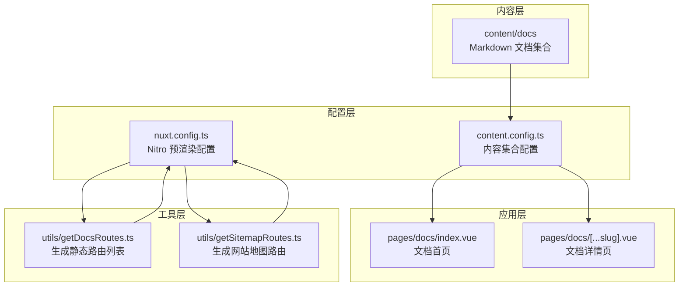
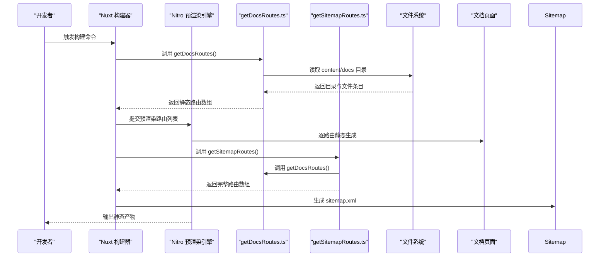
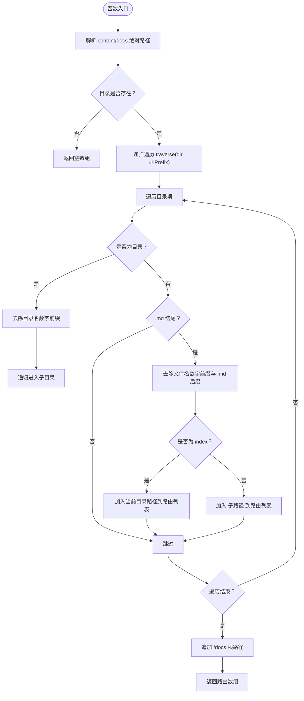
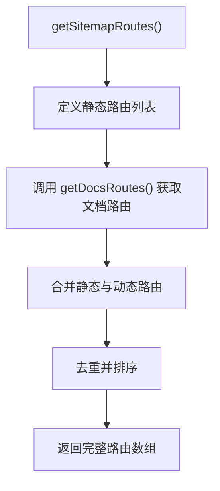
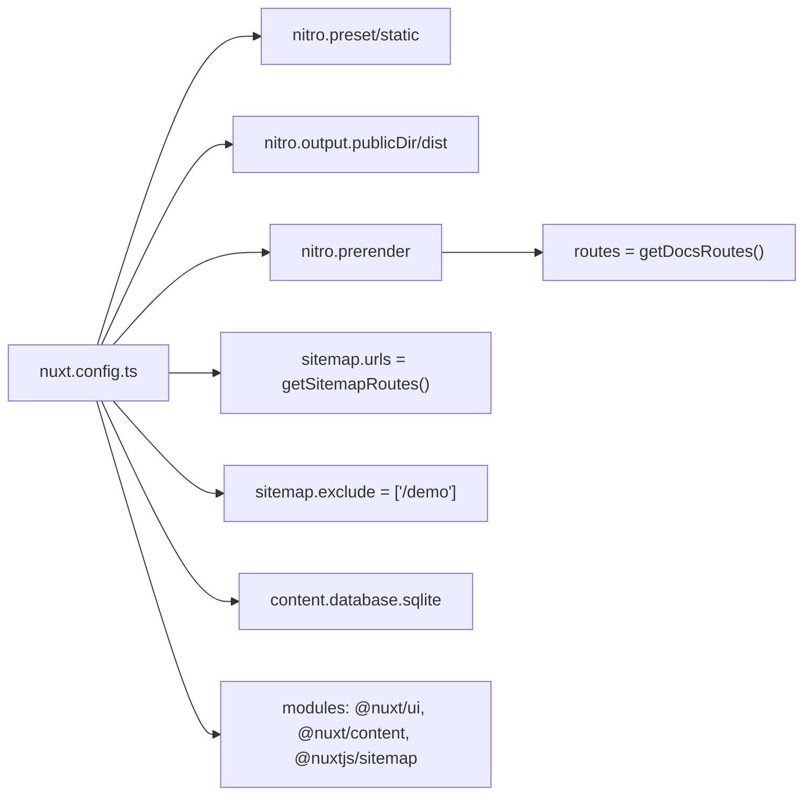
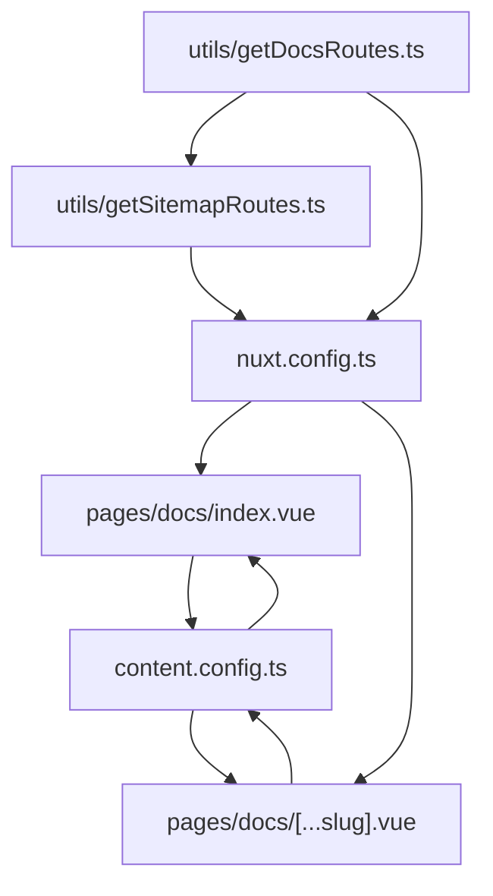

# 静态预渲染路由生成

<cite>
**本文引用的文件**
- [utils/getDocsRoutes.ts](file://utils/getDocsRoutes.ts)
- [utils/getSitemapRoutes.ts](file://utils/getSitemapRoutes.ts)
- [nuxt.config.ts](file://nuxt.config.ts)
- [content.config.ts](file://content.config.ts)
- [pages/docs/index.vue](file://pages/docs/index.vue)
- [pages/docs/[...slug].vue](file://pages/docs/[...slug].vue)
- [content/docs/introduction/1.start.md](file://content/docs/introduction/1.start.md)
- [content/docs/introduction/1.configuration.md](file://content/docs/introduction/1.configuration.md)
- [content/docs/framework/types.md](file://content/docs/framework/types.md)
- [package.json](file://package.json)
</cite>

## 更新摘要
**变更内容**
- 更新了文档以反映 `nuxt.config.ts` 中新增的 `sitemap` 模块配置
- 新增了对 `utils/getSitemapRoutes.ts` 工具函数的详细说明
- 扩展了核心组件和架构总览部分，以包含站点地图生成机制
- 更新了依赖分析和附录中的集成实践

## 目录
1. [引言](#引言)
2. [项目结构](#项目结构)
3. [核心组件](#核心组件)
4. [架构总览](#架构总览)
5. [详细组件分析](#详细组件分析)
6. [依赖分析](#依赖分析)
7. [性能考虑](#性能考虑)
8. [故障排查指南](#故障排查指南)
9. [结论](#结论)
10. [附录](#附录)

## 引言
本技术文档围绕静态预渲染路由生成机制展开，重点解析 `utils/getDocsRoutes.ts` 如何递归扫描 `content/docs` 目录，自动识别 Markdown 文件并生成对应的静态路由列表，以支持 Nitro 引擎的预渲染优化。文档详细说明 `traverse` 函数如何处理目录与文件：
- 对目录名与文件名去除数字前缀（如 1.introduction → introduction）
- 将 index.md 映射为目录路径本身
- 其他 .md 文件生成对应子路径
- 确保 /docs 根路径与所有文档页面均被静态生成，从而提升 SEO 与首屏加载性能

此外，文档提供使用示例、边界情况处理（如目录不存在）、与 Nuxt 配置的集成方式以及在 CI/CD 中的应用实践。本次更新特别增加了对 `getSitemapRoutes.ts` 工具函数和 `@nuxtjs/sitemap` 模块的集成说明。

## 项目结构
该项目采用 Nuxt 4 + Nuxt Content 的内容驱动型前端架构，文档内容位于 content/docs 下，页面路由由 Nuxt Content 自动生成，同时通过 Nitro 的预渲染配置将文档页面静态化。

**图表来源**
- [nuxt.config.ts](file://nuxt.config.ts#L1-L146)
- [content.config.ts](file://content.config.ts#L1-L57)
- [utils/getDocsRoutes.ts](file://utils/getDocsRoutes.ts#L1-L58)
- [utils/getSitemapRoutes.ts](file://utils/getSitemapRoutes.ts#L1-L42)
- [pages/docs/index.vue](file://pages/docs/index.vue#L1-L129)
- [pages/docs/[...slug].vue](file://pages/docs/[...slug].vue#L1-L348)

**章节来源**
- [nuxt.config.ts](file://nuxt.config.ts#L1-L146)
- [content.config.ts](file://content.config.ts#L1-L57)

## 核心组件
- utils/getDocsRoutes.ts：递归扫描 content/docs，生成静态路由数组，注入 Nitro 预渲染配置。
- utils/getSitemapRoutes.ts：汇总所有需要生成站点地图的路由路径，包括静态页面路由和动态文档路由。
- nuxt.config.ts：启用 Nitro 静态输出与预渲染，注入动态生成的文档路由；配置 @nuxtjs/sitemap 模块。
- content.config.ts：定义 docs 集合，声明 Markdown 匹配规则与字段模式。
- pages/docs/index.vue：文档首页，展示导航与 SEO 元信息。
- pages/docs/[...slug].vue：文档详情页，支持路径清洗与回退匹配逻辑。

**章节来源**
- [utils/getDocsRoutes.ts](file://utils/getDocsRoutes.ts#L1-L58)
- [utils/getSitemapRoutes.ts](file://utils/getSitemapRoutes.ts#L1-L42)
- [nuxt.config.ts](file://nuxt.config.ts#L1-L146)
- [content.config.ts](file://content.config.ts#L1-L57)
- [pages/docs/index.vue](file://pages/docs/index.vue#L1-L129)
- [pages/docs/[...slug].vue](file://pages/docs/[...slug].vue#L1-L348)

## 架构总览
静态预渲染路由生成的整体流程如下：
- 构建阶段：Nuxt 读取 nuxt.config.ts 中的 Nitro 预渲染配置，调用 utils/getDocsRoutes.ts 动态生成文档路由列表。
- 预渲染阶段：Nitro 对列表中的每个路由执行静态生成，生成对应的 HTML 文件。
- 站点地图生成：通过 @nuxtjs/sitemap 模块调用 getSitemapRoutes() 函数获取所有路由，生成 sitemap.xml。
- 运行阶段：访问 /docs 与各文档路径时，直接返回静态 HTML，无需 SSR 渲染，提升首屏性能与 SEO。

**图表来源**
- [nuxt.config.ts](file://nuxt.config.ts#L1-L146)
- [utils/getDocsRoutes.ts](file://utils/getDocsRoutes.ts#L1-L58)
- [utils/getSitemapRoutes.ts](file://utils/getSitemapRoutes.ts#L1-L42)

## 详细组件分析

### 工具：getDocsRoutes.ts
- 功能概述
  - 递归扫描 content/docs 目录，解析 Markdown 文件并生成对应的路由路径。
  - 用于 Nitro 预渲染配置，确保所有文档页面都能被静态生成。
- 关键行为
  - 目录名与文件名去除数字前缀（如 1.introduction → introduction）
  - index.md 映射为目录路径本身
  - 其他 .md 文件生成对应子路径
  - 确保 /docs 根路径也被包含
- 边界情况
  - 若 content/docs 不存在，返回空数组，避免构建失败

**图表来源**
- [utils/getDocsRoutes.ts](file://utils/getDocsRoutes.ts#L1-L58)

**章节来源**
- [utils/getDocsRoutes.ts](file://utils/getDocsRoutes.ts#L1-L58)

### 工具：getSitemapRoutes.ts
- 功能概述
  - 汇总所有需要生成站点地图的路由路径，包括静态页面路由和动态文档路由。
  - 为 @nuxtjs/sitemap 模块提供完整的路由列表。
- 关键行为
  - 定义静态路由列表（首页、产品页、博客等）
  - 调用 getDocsRoutes() 获取动态文档路由
  - 合并所有路由并进行去重排序
  - 返回完整的路由数组供站点地图使用
- 边界情况
  - 自动去重，避免重复路由
  - 按字母顺序排序，确保一致性

**图表来源**
- [utils/getSitemapRoutes.ts](file://utils/getSitemapRoutes.ts#L1-L42)

**章节来源**
- [utils/getSitemapRoutes.ts](file://utils/getSitemapRoutes.ts#L1-L42)

### 配置：nuxt.config.ts
- Nitro 静态输出与预渲染
  - preset: static 强制通用静态输出
  - output.publicDir: dist 适配 Vercel 默认配置
  - prerender.failOnError: false 遇到错误不中断构建
  - prerender.routes: getDocsRoutes() 注入动态生成的文档路由
- Sitemap 模块配置
  - modules: 启用 @nuxtjs/sitemap
  - site.url: 设置网站基础 URL
  - sitemap.urls: 使用 getSitemapRoutes() 动态生成路由
  - sitemap.exclude: 排除特定路由（如 /demo）
  - sitemap.routes: 为不同页面类型设置优先级和更新频率
- 其他配置
  - modules: 启用 @nuxt/ui 与 @nuxt/content
  - content.database: 使用 sqlite
  - app.head: 设置 SEO 元信息

**图表来源**
- [nuxt.config.ts](file://nuxt.config.ts#L1-L146)

**章节来源**
- [nuxt.config.ts](file://nuxt.config.ts#L1-L146)

### 内容配置：content.config.ts
- docs 集合
  - type: page
  - source: docs/**/*.md 递归匹配
  - schema: 定义 title、description、category、order 等字段
- 影响
  - 为 Nuxt Content 自动生成 path 字段，供页面路由与导航使用
  - 为预渲染提供稳定的文档数据结构

**章节来源**
- [content.config.ts](file://content.config.ts#L1-L57)

### 页面：pages/docs/index.vue
- 功能
  - 展示文档导航结构，便于用户查找与搜索引擎爬取
  - 使用 useAsyncData 查询 docs 集合并按 category 分组
  - 设置 SEO 元信息
- 与预渲染的关系
  - 预渲染会生成 /docs 首页静态 HTML，提升首屏性能与 SEO

**章节来源**
- [pages/docs/index.vue](file://pages/docs/index.vue#L1-L129)

### 页面：pages/docs/[...slug].vue
- 功能
  - 文档详情页，支持面包屑、侧边目录、前后文导航
  - 并行数据获取：当前页面与前后文
  - 路径清洗与回退匹配：处理文件名数字前缀导致的 URL 清洗差异
- 与预渲染的关系
  - 预渲染会生成每个文档详情页的静态 HTML，提升首屏性能与 SEO

**章节来源**
- [pages/docs/[...slug].vue](file://pages/docs/[...slug].vue#L1-L348)

## 依赖分析
- 组件耦合
  - nuxt.config.ts 依赖 utils/getDocsRoutes.ts 生成的文档路由列表
  - nuxt.config.ts 依赖 utils/getSitemapRoutes.ts 生成的完整路由列表
  - utils/getSitemapRoutes.ts 依赖 utils/getDocsRoutes.ts 获取文档路由
  - pages/docs/index.vue 与 pages/docs/[...slug].vue 依赖 Nuxt Content 的 docs 集合
  - content.config.ts 定义 docs 集合，决定 path 生成与字段结构
- 外部依赖
  - @nuxt/content：内容解析与路由生成
  - @nuxt/ui：UI 组件库
  - Nitro：静态输出与预渲染
  - @nuxtjs/sitemap：站点地图生成

**图表来源**
- [utils/getDocsRoutes.ts](file://utils/getDocsRoutes.ts#L1-L58)
- [utils/getSitemapRoutes.ts](file://utils/getSitemapRoutes.ts#L1-L42)
- [nuxt.config.ts](file://nuxt.config.ts#L1-L146)
- [content.config.ts](file://content.config.ts#L1-L57)
- [pages/docs/index.vue](file://pages/docs/index.vue#L1-L129)
- [pages/docs/[...slug].vue](file://pages/docs/[...slug].vue#L1-L348)

**章节来源**
- [utils/getDocsRoutes.ts](file://utils/getDocsRoutes.ts#L1-L58)
- [utils/getSitemapRoutes.ts](file://utils/getSitemapRoutes.ts#L1-L42)
- [nuxt.config.ts](file://nuxt.config.ts#L1-L146)
- [content.config.ts](file://content.config.ts#L1-L57)
- [pages/docs/index.vue](file://pages/docs/index.vue#L1-L129)
- [pages/docs/[...slug].vue](file://pages/docs/[...slug].vue#L1-L348)

## 性能考虑
- 静态预渲染
  - 通过 Nitro 预渲染将 /docs 与所有文档页面静态生成，显著提升首屏加载性能与 SEO 表现
- 路由生成复杂度
  - traverse 为 O(N) 遍历，N 为 content/docs 下文件与目录总数，通常规模可控
- 路径清洗
  - 在页面层对路径进行清洗与回退匹配，避免因数字前缀导致的路径不一致问题
- 构建时间
  - 预渲染会增加构建时间，可通过 failOnError=false 降低阻塞风险
- 站点地图优化
  - 为不同页面类型设置合理的优先级和更新频率
  - 排除不必要的页面（如 /demo）以减小站点地图体积

[本节为通用性能讨论，不直接分析具体文件]

## 故障排查指南
- 目录不存在
  - 现象：构建时无文档路由生成
  - 处理：确认 content/docs 是否存在；若不存在，getDocsRoutes.ts 会返回空数组，预渲染不会生成任何文档页面
- 路由缺失
  - 现象：某些文档页面未生成静态 HTML
  - 处理：检查 content/docs 下的命名是否包含数字前缀；确保 index.md 正确放置在目录根部
- 路由冲突或重复
  - 现象：同级目录下多个 index.md 或命名冲突
  - 处理：遵循 index.md 映射为目录路径的规则，避免重复命名
- 预渲染失败
  - 现象：构建阶段出现错误中断
  - 处理：nuxt.config.ts 已设置 failOnError=false，构建不会中断；可在本地预览阶段定位问题
- 站点地图问题
  - 现象：站点地图中缺少某些页面或包含不应有的页面
  - 处理：检查 getSitemapRoutes.ts 中的静态路由列表和排除规则；确认 getDocsRoutes() 返回正确的文档路由

**章节来源**
- [utils/getDocsRoutes.ts](file://utils/getDocsRoutes.ts#L1-L58)
- [utils/getSitemapRoutes.ts](file://utils/getSitemapRoutes.ts#L1-L42)
- [nuxt.config.ts](file://nuxt.config.ts#L1-L146)

## 结论
通过 utils/getDocsRoutes.ts 对 content/docs 的递归扫描与路径清洗，结合 Nitro 的静态预渲染配置，系统能够将 /docs 根路径与所有文档页面静态生成，显著提升 SEO 与首屏加载性能。新增的 getSitemapRoutes.ts 工具函数进一步增强了站点地图的生成能力，通过整合静态页面路由和动态文档路由，为搜索引擎提供了完整的网站结构视图。配合 @nuxtjs/sitemap 模块的优先级配置，实现了对不同页面类型的内容优化。整个系统形成了稳定、可维护的内容驱动型文档站点。

[本节为总结性内容，不直接分析具体文件]

## 附录

### 使用示例
- 基本用法
  - 在 nuxt.config.ts 中直接使用 getDocsRoutes() 注入预渲染路由
  - 使用 getSitemapRoutes() 配置站点地图路由
  - 构建命令：使用项目脚本触发 Nuxt 生成（静态输出）
- 目录与文件命名约定
  - 目录与文件名可使用数字前缀（如 1.introduction）以控制顺序
  - index.md 将映射为目录路径本身
  - 其他 .md 文件将生成对应子路径

**章节来源**
- [nuxt.config.ts](file://nuxt.config.ts#L1-L146)
- [utils/getDocsRoutes.ts](file://utils/getDocsRoutes.ts#L1-L58)
- [utils/getSitemapRoutes.ts](file://utils/getSitemapRoutes.ts#L1-L42)
- [content/docs/introduction/1.start.md](file://content/docs/introduction/1.start.md#L1-L117)
- [content/docs/introduction/1.configuration.md](file://content/docs/introduction/1.configuration.md#L1-L86)
- [content/docs/framework/types.md](file://content/docs/framework/types.md#L1-L141)

### 与 Nuxt 配置的集成
- Nitro 预渲染
  - preset: static
  - output.publicDir: dist
  - prerender.routes: getDocsRoutes()
- Sitemap 模块
  - modules: @nuxtjs/sitemap
  - site.url: 'https://www.智言万象.com'
  - sitemap.urls: () => getSitemapRoutes()
  - sitemap.exclude: ['/demo']
  - sitemap.routes: 为不同页面类型设置优先级
- Content 模块
  - database: sqlite
  - docs 集合：type: page，source: docs/**/*.md
- 页面路由
  - pages/docs/index.vue：文档首页
  - pages/docs/[...slug].vue：文档详情页

**章节来源**
- [nuxt.config.ts](file://nuxt.config.ts#L1-L146)
- [content.config.ts](file://content.config.ts#L1-L57)
- [pages/docs/index.vue](file://pages/docs/index.vue#L1-L129)
- [pages/docs/[...slug].vue](file://pages/docs/[...slug].vue#L1-L348)

### 在 CI/CD 中的应用实践
- 构建命令
  - 使用项目脚本触发 nuxt generate，生成静态产物
- 输出目录
  - 通过 nuxt.config.ts 的 output.publicDir: dist，确保与平台默认配置兼容
- 预渲染稳定性
  - 通过 failOnError:false 降低构建失败风险，可在预览阶段发现问题
- 站点地图更新
  - 每次构建自动生成最新的 sitemap.xml
  - 通过 sitemap.routes 配置确保重要页面获得更高优先级

**章节来源**
- [package.json](file://package.json#L1-L48)
- [nuxt.config.ts](file://nuxt.config.ts#L1-L146)