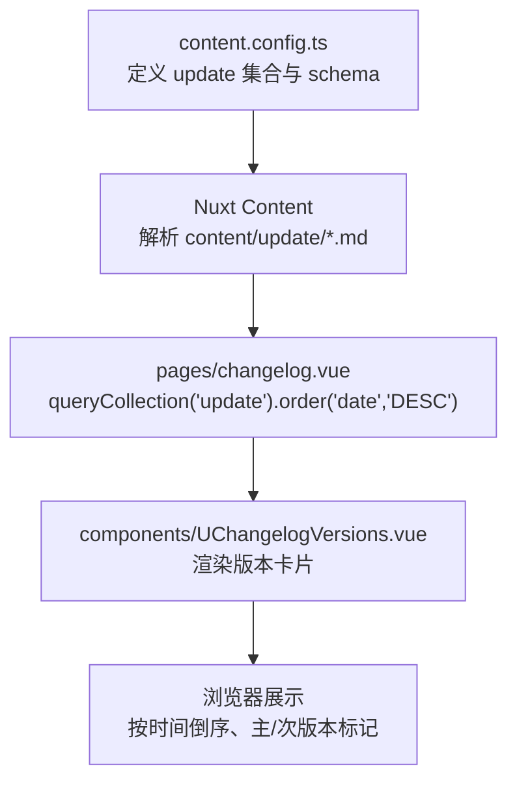
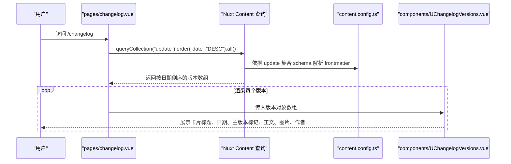
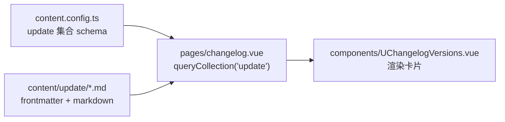

# 更新日志

<cite>
**本文引用的文件**
- [content.config.ts](file://content.config.ts)
- [pages/changelog.vue](file://pages/changelog.vue)
- [components/UChangelogVersions.vue](file://components/UChangelogVersions.vue)
- [content/update/2503.md](file://content/update/2503.md)
- [content/update/2504.md](file://content/update/2504.md)
- [content/update/2510.md](file://content/update/2510.md)
- [README.md](file://README.md)
</cite>

## 目录
1. [引言](#引言)
2. [项目结构](#项目结构)
3. [核心组件](#核心组件)
4. [架构总览](#架构总览)
5. [详细组件分析](#详细组件分析)
6. [依赖关系分析](#依赖关系分析)
7. [性能考量](#性能考量)
8. [故障排查指南](#故障排查指南)
9. [结论](#结论)
10. [附录](#附录)

## 引言
本指南围绕更新日志系统展开，说明 content/update/ 目录下的 Markdown 日志文件（如 2503.md、2504.md、2510.md）如何记录产品版本迭代，明确每篇日志必须包含的元数据项（title、description、date、isMajor、authors 等），并解释这些信息在 changelog.vue 页面中如何被聚合展示（按时间倒序、通过 isMajor 字段区分主要版本与次要更新）。同时提供发布新版本日志的标准流程，强调版本号命名规范与内容撰写格式。

## 项目结构
更新日志系统由三部分组成：
- 内容集合定义：在 content.config.ts 中定义 update 集合及其 schema，确保 Nuxt Content 能正确解析 content/update/ 下的 Markdown 文件。
- 页面渲染：pages/changelog.vue 使用 queryCollection('update') 查询并按 date 降序展示版本日志。
- 组件展示：components/UChangelogVersions.vue 负责渲染单个版本卡片，支持 isMajor 标记、作者头像、图片与详情链接等。

图表来源
- [content.config.ts](file://content.config.ts#L33-L55)
- [pages/changelog.vue](file://pages/changelog.vue#L121-L123)
- [components/UChangelogVersions.vue](file://components/UChangelogVersions.vue#L1-L85)

章节来源
- [content.config.ts](file://content.config.ts#L33-L55)
- [pages/changelog.vue](file://pages/changelog.vue#L1-L120)
- [components/UChangelogVersions.vue](file://components/UChangelogVersions.vue#L1-L85)

## 核心组件
- 内容集合与 schema
  - update 集合通过 source: 'update/*.md' 匹配所有 Markdown 文件。
  - schema 字段包括：title、description、date、image、to、target、isMajor、authors（name、avatar.src、avatar.alt）。
- 页面聚合与排序
  - changelog.vue 使用 useAsyncData('changelog-updates', ...) 调用 queryCollection('update')，并按 date 降序排序，最终在模板中循环渲染每个版本。
- 版本卡片组件
  - UChangelogVersions.vue 接收版本数组，逐条渲染卡片，展示日期、标题、是否主版本标记、正文内容、图片与作者头像列表。

章节来源
- [content.config.ts](file://content.config.ts#L33-L55)
- [pages/changelog.vue](file://pages/changelog.vue#L121-L123)
- [components/UChangelogVersions.vue](file://components/UChangelogVersions.vue#L1-L85)

## 架构总览
更新日志从内容到展示的完整链路如下：

图表来源
- [pages/changelog.vue](file://pages/changelog.vue#L121-L123)
- [content.config.ts](file://content.config.ts#L33-L55)
- [components/UChangelogVersions.vue](file://components/UChangelogVersions.vue#L1-L85)

## 详细组件分析

### 内容集合与 schema（content.config.ts）
- 集合类型：page
- 数据源：'update/*.md'
- schema 字段要点：
  - title：版本标题
  - description：版本简介
  - date：发布日期（字符串）
  - image：可选，版本配图
  - to/target：可选，详情链接与打开方式
  - isMajor：可选，布尔值，用于标记主版本
  - authors：可选，数组，包含 name 与 avatar（src、alt）

章节来源
- [content.config.ts](file://content.config.ts#L33-L55)

### 页面聚合与交互（pages/changelog.vue）
- 数据获取：useAsyncData('changelog-updates', ...) 调用 queryCollection('update').order('date', 'DESC').all()，得到按日期倒序的版本数组。
- 侧边栏目录：根据 versions 动态生成，支持移动端折叠与高亮当前版本。
- 滚动定位：点击目录项平滑滚动到对应版本区块；IntersectionObserver 实时更新当前激活索引。
- SEO 元信息：设置页面标题、描述、关键词与 Open Graph 标签。

章节来源
- [pages/changelog.vue](file://pages/changelog.vue#L105-L120)
- [pages/changelog.vue](file://pages/changelog.vue#L121-L123)
- [pages/changelog.vue](file://pages/changelog.vue#L138-L195)

### 版本卡片渲染（components/UChangelogVersions.vue）
- 时间轴与标记：桌面端显示时间线与圆点，圆点颜色由 isMajor 决定；移动端显示日期与主版本小点。
- 标题与标签：标题下方显示 Major 标签（当 isMajor 为真）。
- 详情链接：若 to 存在且非占位符，则显示“查看详情”按钮，支持 target。
- 正文渲染：使用 ContentRenderer 渲染 Markdown 正文。
- 图片展示：若存在 image，则渲染封面图。
- 作者展示：渲染 authors 数组中的头像与发布者名称。

章节来源
- [components/UChangelogVersions.vue](file://components/UChangelogVersions.vue#L1-L85)

### 示例日志文件（content/update/*.md）
- 元数据示例字段：
  - title：版本标题（如 v1.5.0 - 企业级权限管理）
  - description：版本简介
  - date：发布日期（如 2025-03-07）
  - isMajor：可选，true 表示主版本
  - authors：可选，包含 name 与 avatar（src、alt）
  - image：可选，版本配图
  - to/target：可选，详情链接与打开方式
- 正文内容：Markdown 格式，支持标题、列表、提示块等。

章节来源
- [content/update/2503.md](file://content/update/2503.md#L1-L15)
- [content/update/2504.md](file://content/update/2504.md#L1-L14)
- [content/update/2510.md](file://content/update/2510.md#L1-L67)

### 版本号命名规范与撰写格式
- 命名规范
  - 主版本：建议使用形如 vX.Y.Z 或 X.Y.Z 的形式，其中 X 为主版本号，Y 为次版本号，Z 为修订号。当 isMajor 为 true 时，通常表示破坏性变更或重大功能发布。
  - 次要版本：Y 或 Z 增长，表示向后兼容的功能增强或修复。
  - 建议在 title 中同时包含语义化的中文描述，便于用户快速理解版本意义。
- 撰写格式
  - 标题：简洁明了，体现版本核心变化。
  - 简介：概述本次更新的主要价值与影响范围。
  - 正文：建议采用“注意事项/新增/优化/修复/更新方式”等分节，条理清晰。
  - 重要变更：使用提示块或加粗突出，避免用户遗漏。
  - 更新方式：提供 Docker 与手动部署的步骤说明，确保用户可顺利升级。

章节来源
- [content/update/2503.md](file://content/update/2503.md#L1-L15)
- [content/update/2504.md](file://content/update/2504.md#L1-L14)
- [content/update/2510.md](file://content/update/2510.md#L1-L67)

## 依赖关系分析
- changelog.vue 依赖 Nuxt Content 的 queryCollection API 获取 update 集合数据。
- UChangelogVersions.vue 依赖 ContentRenderer 渲染 Markdown 正文。
- content.config.ts 为上述两者的 schema 与数据源契约，决定哪些字段可用、如何排序与过滤。

图表来源
- [content.config.ts](file://content.config.ts#L33-L55)
- [pages/changelog.vue](file://pages/changelog.vue#L121-L123)
- [components/UChangelogVersions.vue](file://components/UChangelogVersions.vue#L1-L85)

章节来源
- [content.config.ts](file://content.config.ts#L33-L55)
- [pages/changelog.vue](file://pages/changelog.vue#L121-L123)
- [components/UChangelogVersions.vue](file://components/UChangelogVersions.vue#L1-L85)

## 性能考量
- 静态内容渲染：Nuxt Content 支持预渲染，建议在生产环境启用预渲染以提升首屏性能。
- 图片懒加载：组件已使用 lazy 加载图片，减少初始带宽占用。
- 滚动与观察：IntersectionObserver 仅在需要时启用，避免频繁计算。
- 建议
  - 控制每条日志正文长度，避免过长 Markdown 导致渲染压力。
  - 合理使用图片，必要时压缩尺寸与格式。
  - 对于大量日志，可考虑分页或虚拟滚动（视业务规模而定）。

## 故障排查指南
- 页面无法显示版本列表
  - 检查 content/update/ 下是否存在符合命名规范的 Markdown 文件。
  - 确认 frontmatter 字段完整，特别是 date 与 title。
  - 确认 content.config.ts 中 update 集合的 source 与 schema 未被误改。
- 排序异常
  - 确保 date 字段为字符串格式，且遵循 YYYY-MM-DD。
  - 若需要数字排序，请参考内容系统文档中关于排序顺序的说明。
- 主版本标记无效
  - 确认 isMajor 为布尔值，且仅在主版本时设置为 true。
- 作者头像或图片不显示
  - 检查 authors.avatar.src 与 image 的 URL 是否有效。
  - 确认跨域与 HTTPS 资源可用。
- 移动端目录不可用
  - 检查 isMobileMenuOpen 的状态切换逻辑与样式覆盖。

章节来源
- [content.config.ts](file://content.config.ts#L33-L55)
- [pages/changelog.vue](file://pages/changelog.vue#L121-L123)
- [components/UChangelogVersions.vue](file://components/UChangelogVersions.vue#L1-L85)

## 结论
更新日志系统通过 content.config.ts 的集合定义、pages/changelog.vue 的数据聚合与排序、以及 components/UChangelogVersions.vue 的卡片渲染，形成一套完整的版本发布展示链路。遵循统一的命名规范与撰写格式，有助于提升用户体验与信息传达效率。建议在每次发布前完成 frontmatter 填写与正文梳理，并在发布后核对页面展示效果。

## 附录

### 发布新版本日志的标准流程
- 准备阶段
  - 确定版本号与是否为重大更新（isMajor）。
  - 编写 frontmatter：title、description、date、image（可选）、to/target（可选）。
  - 编写正文：按“注意事项/新增/优化/修复/更新方式”分节组织。
- 创建文件
  - 在 content/update/ 下新建 Markdown 文件，命名建议使用四位数字（如 2510.md），或结合语义的版本标识。
- 验证与预览
  - 在本地运行开发服务器，访问 /changelog 核对展示效果。
  - 确认 isMajor 标记、作者头像、图片与链接均正常。
- 发布上线
  - 提交代码并合并到主分支，触发构建与部署。
  - 上线后再次核对生产环境展示与 SEO 元信息。

章节来源
- [content/update/2503.md](file://content/update/2503.md#L1-L15)
- [content/update/2504.md](file://content/update/2504.md#L1-L14)
- [content/update/2510.md](file://content/update/2510.md#L1-L67)
- [pages/changelog.vue](file://pages/changelog.vue#L105-L120)