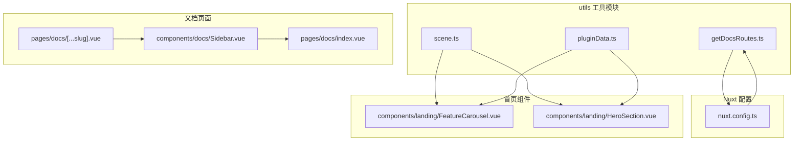
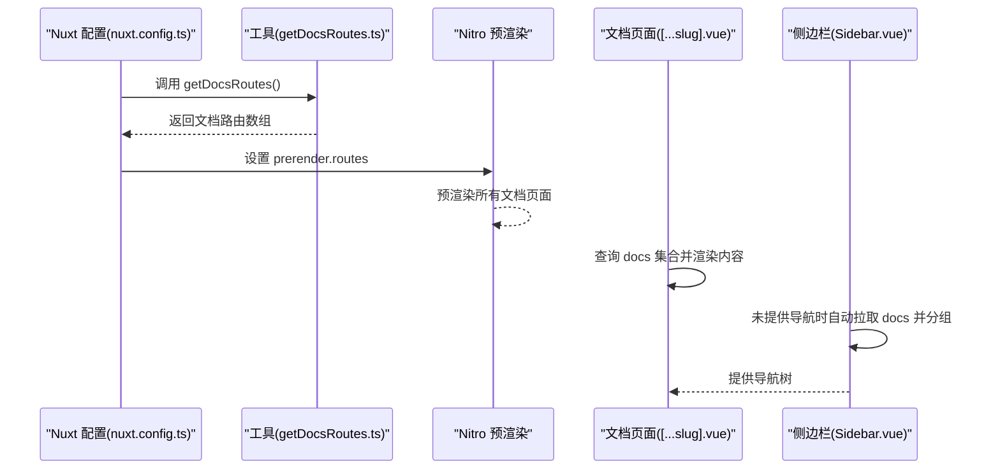
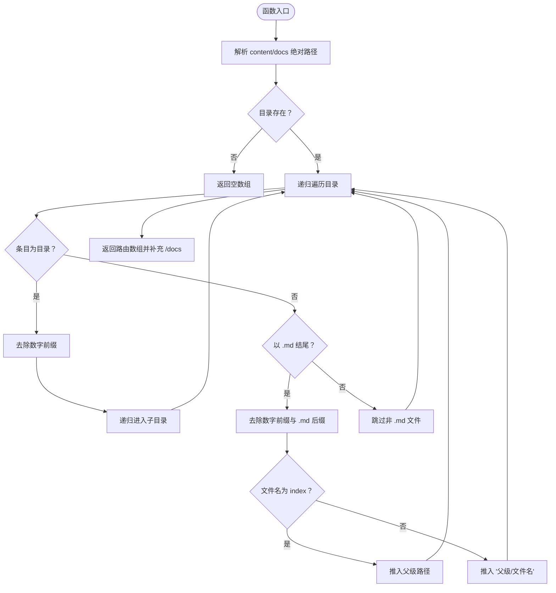
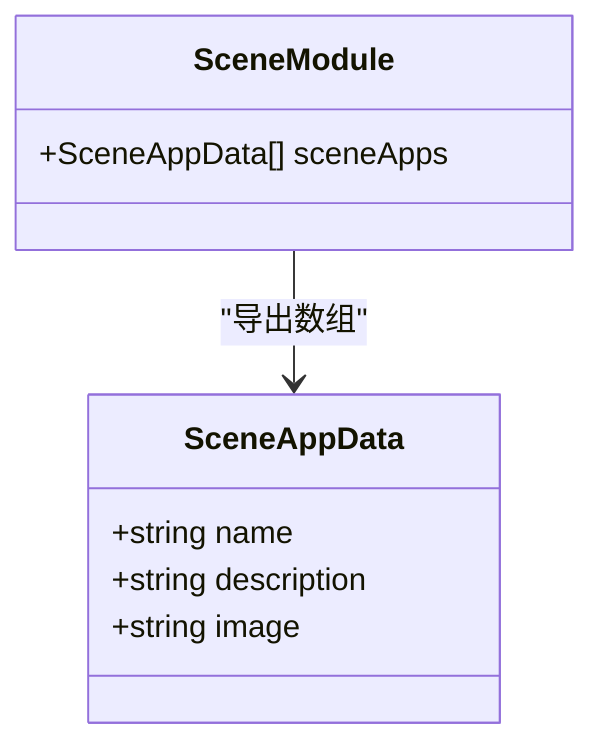
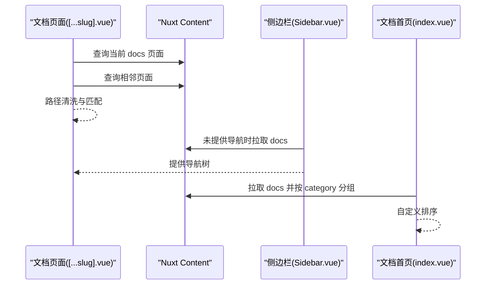
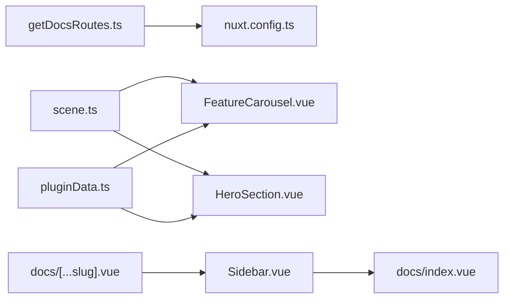

# 工具函数使用与扩展

<cite>
**本文引用的文件**
- [utils/getDocsRoutes.ts](file://utils/getDocsRoutes.ts)
- [utils/scene.ts](file://utils/scene.ts)
- [utils/pluginData.ts](file://utils/pluginData.ts)
- [nuxt.config.ts](file://nuxt.config.ts)
- [pages/docs/[...slug].vue](file://pages/docs/[...slug].vue)
- [pages/docs/index.vue](file://pages/docs/index.vue)
- [components/docs/Sidebar.vue](file://components/docs/Sidebar.vue)
- [components/landing/FeatureCarousel.vue](file://components/landing/FeatureCarousel.vue)
- [components/landing/HeroSection.vue](file://components/landing/HeroSection.vue)
</cite>

## 目录
1. [简介](#简介)
2. [项目结构](#项目结构)
3. [核心组件](#核心组件)
4. [架构总览](#架构总览)
5. [详细组件分析](#详细组件分析)
6. [依赖关系分析](#依赖关系分析)
7. [性能考量](#性能考量)
8. [故障排查指南](#故障排查指南)
9. [结论](#结论)
10. [附录：扩展新工具函数规范](#附录扩展新工具函数规范)

## 简介
本文件围绕 utils/ 目录下的核心工具函数进行系统化解析，重点以 getDocsRoutes.ts 为例，说明如何动态生成文档路由结构、解析 Markdown 文件并构建导航树；同时分析 scene.ts 中场景映射逻辑的实现方式。文档还阐述工具函数的模块化组织原则、类型安全保证与可测试性设计，并给出扩展新工具函数的规范与最佳实践，包括文件命名、导出接口、单元测试覆盖要求。最后提供在页面或组件中正确引入和使用这些工具的示例路径，并强调避免副作用与保持纯函数的重要性。

## 项目结构
utils/ 目录包含三个工具模块：
- getDocsRoutes.ts：动态扫描 content/docs 目录，生成文档路由列表，供 Nuxt 预渲染使用。
- scene.ts：提供场景应用数据集合，供首页与场景体验相关组件使用。
- pluginData.ts：提供插件应用数据集合与分类信息，供首页跑马灯等组件使用。

**图表来源**
- [utils/getDocsRoutes.ts](file://utils/getDocsRoutes.ts#L1-L58)
- [utils/scene.ts](file://utils/scene.ts#L1-L122)
- [utils/pluginData.ts](file://utils/pluginData.ts#L1-L323)
- [nuxt.config.ts](file://nuxt.config.ts#L1-L91)
- [pages/docs/index.vue](file://pages/docs/index.vue#L58-L128)
- [pages/docs/[...slug].vue](file://pages/docs/[...slug].vue#L167-L284)
- [components/docs/Sidebar.vue](file://components/docs/Sidebar.vue#L108-L294)
- [components/landing/FeatureCarousel.vue](file://components/landing/FeatureCarousel.vue#L85-L114)
- [components/landing/HeroSection.vue](file://components/landing/HeroSection.vue#L192-L200)

**章节来源**
- [utils/getDocsRoutes.ts](file://utils/getDocsRoutes.ts#L1-L58)
- [utils/scene.ts](file://utils/scene.ts#L1-L122)
- [utils/pluginData.ts](file://utils/pluginData.ts#L1-L323)
- [nuxt.config.ts](file://nuxt.config.ts#L1-L91)
- [pages/docs/index.vue](file://pages/docs/index.vue#L58-L128)
- [pages/docs/[...slug].vue](file://pages/docs/[...slug].vue#L167-L284)
- [components/docs/Sidebar.vue](file://components/docs/Sidebar.vue#L108-L294)
- [components/landing/FeatureCarousel.vue](file://components/landing/FeatureCarousel.vue#L85-L114)
- [components/landing/HeroSection.vue](file://components/landing/HeroSection.vue#L192-L200)

## 核心组件
- getDocsRoutes.ts：纯函数，读取文件系统，递归扫描 content/docs，去除数字前缀与 .md 后缀，生成静态路由数组，确保 Nitro 预渲染包含所有文档页面。
- scene.ts：导出场景应用数据数组与接口类型，供组件直接消费。
- pluginData.ts：导出插件应用数据与分类信息，供组件消费并参与页面渲染。

**章节来源**
- [utils/getDocsRoutes.ts](file://utils/getDocsRoutes.ts#L1-L58)
- [utils/scene.ts](file://utils/scene.ts#L1-L122)
- [utils/pluginData.ts](file://utils/pluginData.ts#L1-L323)

## 架构总览
工具函数在应用中的作用链路如下：
- Nuxt 配置在 nitro.prerender.routes 中注入 getDocsRoutes() 返回的路由数组，确保静态预渲染覆盖所有文档页面。
- 文档页面通过 Nuxt Content 查询 docs 集合，渲染内容与导航。
- 侧边栏组件在根层级未提供导航时，自动从 docs 集合拉取数据并按 category 分组，生成导航树。
- 首页组件从 scene.ts 与 pluginData.ts 获取数据，驱动场景体验与跑马灯展示。

**图表来源**
- [nuxt.config.ts](file://nuxt.config.ts#L40-L51)
- [utils/getDocsRoutes.ts](file://utils/getDocsRoutes.ts#L1-L58)
- [pages/docs/[...slug].vue](file://pages/docs/[...slug].vue#L185-L220)
- [components/docs/Sidebar.vue](file://components/docs/Sidebar.vue#L160-L239)

## 详细组件分析

### getDocsRoutes.ts：动态生成文档路由
- 设计要点
  - 纯函数：仅依赖 process.cwd() 与文件系统，无外部副作用。
  - 递归遍历：对 content/docs 下的目录与 .md 文件进行处理。
  - 名称清洗：去除目录与文件名中的数字前缀（如 "1.introduction" -> "introduction"），index.md 对应父级路径。
  - 路由补全：确保根 /docs 页面也被包含。
- 类型与复杂度
  - 输入：无；输出：string[]。
  - 时间复杂度：O(N)，N 为目录与文件总数；空间复杂度：O(R)，R 为生成的路由数量。
- 与 Nuxt 集成
  - 在 nuxt.config.ts 中通过 nitro.prerender.routes 注入，保障静态站点生成完整性。

**图表来源**
- [utils/getDocsRoutes.ts](file://utils/getDocsRoutes.ts#L1-L58)

**章节来源**
- [utils/getDocsRoutes.ts](file://utils/getDocsRoutes.ts#L1-L58)
- [nuxt.config.ts](file://nuxt.config.ts#L40-L51)

### scene.ts：场景映射逻辑
- 设计要点
  - 导出接口 SceneAppData 与常量数组 sceneApps，包含 name、description、image 等字段。
  - 供首页组件直接导入使用，无需额外转换或副作用。
- 使用场景
  - FeatureCarousel.vue 与 HeroSection.vue 从 utils/scene.ts 导入 sceneApps，用于生成轮播卡片与跑马灯图片。
- 类型安全
  - 接口明确字段类型，便于 IDE 提示与编译期校验。

**图表来源**
- [utils/scene.ts](file://utils/scene.ts#L1-L122)
- [components/landing/FeatureCarousel.vue](file://components/landing/FeatureCarousel.vue#L85-L114)
- [components/landing/HeroSection.vue](file://components/landing/HeroSection.vue#L192-L200)

**章节来源**
- [utils/scene.ts](file://utils/scene.ts#L1-L122)
- [components/landing/FeatureCarousel.vue](file://components/landing/FeatureCarousel.vue#L85-L114)
- [components/landing/HeroSection.vue](file://components/landing/HeroSection.vue#L192-L200)

### pluginData.ts：插件数据与分类
- 设计要点
  - 导出接口 AppData、Category，以及 categories 与 apps 常量数组。
  - 与 scene.ts 不同，pluginData.ts 更偏向“插件生态”数据，供首页跑马灯等场景使用。
- 与 scene.ts 的区别
  - 字段更丰富（含 icon、category、价格等），适合展示型组件。
  - 与 scene.ts 可并行存在，分别服务于不同页面与组件。

**章节来源**
- [utils/pluginData.ts](file://utils/pluginData.ts#L1-L323)
- [components/landing/FeatureCarousel.vue](file://components/landing/FeatureCarousel.vue#L85-L114)
- [components/landing/HeroSection.vue](file://components/landing/HeroSection.vue#L292-L328)

### 文档导航与内容渲染流程
- 页面与侧边栏协作
  - 文档页面在挂载时并行获取当前页面内容与相邻页面，同时根据路径清洗规则兼容数字前缀与 index。
  - 侧边栏在根层级未提供导航时，自动从 docs 集合按 category 分组并排序，支持分组折叠与当前激活高亮。
- 文档首页分组
  - 文档首页同样从 docs 集合按 category 分组，保证与侧边栏一致的排序与展示。

**图表来源**
- [pages/docs/[...slug].vue](file://pages/docs/[...slug].vue#L185-L220)
- [components/docs/Sidebar.vue](file://components/docs/Sidebar.vue#L160-L239)
- [pages/docs/index.vue](file://pages/docs/index.vue#L58-L128)

**章节来源**
- [pages/docs/[...slug].vue](file://pages/docs/[...slug].vue#L167-L284)
- [components/docs/Sidebar.vue](file://components/docs/Sidebar.vue#L108-L294)
- [pages/docs/index.vue](file://pages/docs/index.vue#L58-L128)

## 依赖关系分析
- getDocsRoutes.ts 仅被 nuxt.config.ts 使用，形成单向依赖，耦合度低。
- scene.ts 与 pluginData.ts 作为纯数据模块，被多个组件导入，形成松耦合的数据供应。
- 文档侧边栏与文档首页共享同一数据来源（docs 集合），并通过相同的 category 分组与排序逻辑，确保导航一致性。

**图表来源**
- [utils/getDocsRoutes.ts](file://utils/getDocsRoutes.ts#L1-L58)
- [nuxt.config.ts](file://nuxt.config.ts#L40-L51)
- [utils/scene.ts](file://utils/scene.ts#L1-L122)
- [utils/pluginData.ts](file://utils/pluginData.ts#L1-L323)
- [components/landing/FeatureCarousel.vue](file://components/landing/FeatureCarousel.vue#L85-L114)
- [components/landing/HeroSection.vue](file://components/landing/HeroSection.vue#L192-L200)
- [components/docs/Sidebar.vue](file://components/docs/Sidebar.vue#L160-L239)
- [pages/docs/index.vue](file://pages/docs/index.vue#L58-L128)
- [pages/docs/[...slug].vue](file://pages/docs/[...slug].vue#L185-L220)

**章节来源**
- [utils/getDocsRoutes.ts](file://utils/getDocsRoutes.ts#L1-L58)
- [utils/scene.ts](file://utils/scene.ts#L1-L122)
- [utils/pluginData.ts](file://utils/pluginData.ts#L1-L323)
- [components/docs/Sidebar.vue](file://components/docs/Sidebar.vue#L160-L239)
- [pages/docs/index.vue](file://pages/docs/index.vue#L58-L128)
- [pages/docs/[...slug].vue](file://pages/docs/[...slug].vue#L185-L220)

## 性能考量
- getDocsRoutes.ts
  - 仅在构建阶段执行，避免运行时 IO 开销。
  - 递归遍历为 O(N)，N 通常可控；建议保持 content/docs 目录结构清晰，减少深层嵌套。
- 侧边栏与文档首页
  - 使用 useAsyncData 并行拉取数据，避免阻塞首屏渲染。
  - 分组与排序逻辑为内存操作，复杂度与文档数量线性相关。
- 首页跑马灯
  - 使用 requestAnimationFrame 与累加滚动步长，提升滚动流畅度；注意移动端性能优化与动画参数调优。

[本节为通用指导，不直接分析具体文件]

## 故障排查指南
- 文档页面 404
  - 检查路径清洗逻辑是否与文件系统命名一致（数字前缀与 index.md）。
  - 确认 docs 集合中是否存在对应 path。
- 预渲染遗漏页面
  - 确认 nuxt.config.ts 中 nitro.prerender.routes 已正确注入 getDocsRoutes() 返回值。
  - 检查 content/docs 目录是否存在与权限是否正确。
- 侧边栏未显示或分组异常
  - 确认 docs 集合中每个文档的 category 字段是否正确。
  - 检查分组排序逻辑与 categoryOrder 是否符合预期。

**章节来源**
- [pages/docs/[...slug].vue](file://pages/docs/[...slug].vue#L185-L220)
- [components/docs/Sidebar.vue](file://components/docs/Sidebar.vue#L160-L239)
- [nuxt.config.ts](file://nuxt.config.ts#L40-L51)

## 结论
utils/ 目录下的工具函数以“纯函数 + 明确接口”的方式提供了稳定的静态路由生成与数据供应能力。getDocsRoutes.ts 通过最小化副作用与清晰的目录清洗策略，确保文档预渲染的完整性；scene.ts 与 pluginData.ts 则以类型安全的数据结构支撑首页与场景体验组件。整体架构松耦合、可扩展性强，便于后续新增工具函数与维护。

[本节为总结性内容，不直接分析具体文件]

## 附录：扩展新工具函数规范
- 文件命名
  - 采用语义化命名，如 utils/myFeature.ts，避免使用缩写或模糊名称。
- 导出接口
  - 暴露明确的接口类型（interface），并在必要时导出常量或枚举。
  - 保持单一职责，避免在一个文件中堆积过多功能。
- 纯函数与副作用
  - 优先编写纯函数，避免读写全局状态、DOM、网络或文件系统。
  - 如需读取文件系统，请仅在构建阶段使用，并在运行时避免 IO。
- 类型安全
  - 使用 TypeScript 接口定义输入输出，确保 IDE 提示与编译期校验。
- 可测试性
  - 为工具函数提供单元测试，覆盖边界条件与典型场景。
  - 对涉及文件系统或外部依赖的函数，使用模拟或临时目录进行隔离测试。
- 在页面/组件中的使用
  - 在组件中通过 import 语句引入工具函数或数据模块，避免在模板中直接调用函数。
  - 对于需要异步数据的场景，使用 useAsyncData 或组合式 API 的异步能力。
  - 避免在组件中直接修改工具模块导出的数据，必要时复制一份副本再使用。

[本节为规范性内容，不直接分析具体文件]