# 开发者指南

<cite>
**本文档中引用的文件**  
- [README.md](file://README.md)
- [package.json](file://package.json)
- [nuxt.config.ts](file://nuxt.config.ts)
- [app.config.ts](file://app.config.ts)
- [tailwind.config.js](file://tailwind.config.js)
- [tsconfig.json](file://tsconfig.json)
- [content.config.ts](file://content.config.ts)
- [components/AppNavigation.vue](file://components/AppNavigation.vue)
- [components/landing/HeroSection.vue](file://components/landing/HeroSection.vue)
- [components/DocsSidebar.vue](file://components/DocsSidebar.vue)
- [pages/plugin.vue](file://pages/plugin.vue)
- [pages/index.vue](file://pages/index.vue)
- [stories/Plugin.stories.ts](file://stories/Plugin.stories.ts)
- [utils/getDocsRoutes.ts](file://utils/getDocsRoutes.ts)
- [utils/pluginData.ts](file://utils/pluginData.ts)
- [utils/scene.ts](file://utils/scene.ts)
- [layouts/default.vue](file://layouts/default.vue)
</cite>

## 目录

1. [简介](#简介)
2. [项目结构](#项目结构)
3. [核心组件](#核心组件)
4. [架构概述](#架构概述)
5. [详细组件分析](#详细组件分析)
6. [依赖分析](#依赖分析)
7. [性能考虑](#性能考虑)
8. [故障排除指南](#故障排除指南)
9. [结论](#结论)

## 简介

本指南旨在为二次开发和贡献者提供全面的高级开发者文档。我们将深入探讨如何开发新的UI组件、利用Storybook进行可视化测试、创建新页面、扩展应用功能以及遵循代码贡献流程。

## 项目结构

本项目基于 Nuxt 4 + Vue 3 构建，采用模块化设计，结构清晰，便于维护和扩展。

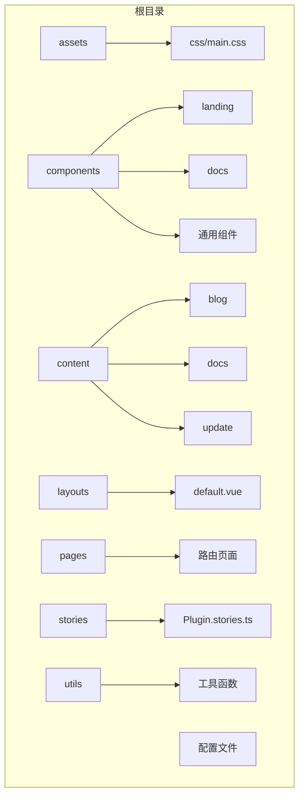

**图示来源**  
- [README.md](file://README.md#L13-L45)

**本节来源**  
- [README.md](file://README.md#L13-L45)
- [project_structure](file://project_structure)

## 核心组件

项目包含多个核心组件，包括导航、页脚、侧边栏和落地页组件。这些组件均采用Vue 3 Composition API编写，并通过Nuxt的自动导入功能在全局可用。

**本节来源**  
- [components/AppNavigation.vue](file://components/AppNavigation.vue#L1-L309)
- [components/landing/HeroSection.vue](file://components/landing/HeroSection.vue)
- [components/DocsSidebar.vue](file://components/DocsSidebar.vue)
- [layouts/default.vue](file://layouts/default.vue#L1-L25)

## 架构概述

系统采用现代化的前端架构，基于Nuxt 4框架，集成Vue 3、TypeScript、Tailwind CSS和Nuxt UI。

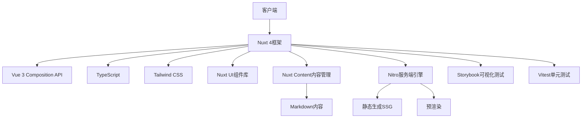

**图示来源**  
- [nuxt.config.ts](file://nuxt.config.ts#L1-L91)
- [package.json](file://package.json#L1-L48)
- [README.md](file://README.md#L7-L11)

**本节来源**  
- [nuxt.config.ts](file://nuxt.config.ts#L1-L91)
- [package.json](file://package.json#L1-L48)

## 详细组件分析

### UI组件开发规范

#### 组件命名与目录结构
所有UI组件均存放在`components/`目录下，采用语义化命名规范：
- 通用组件：直接存放于`components/`根目录（如`AppNavigation.vue`）
- 落地页组件：存放于`components/landing/`子目录
- 文档相关组件：存放于`components/docs/`子目录

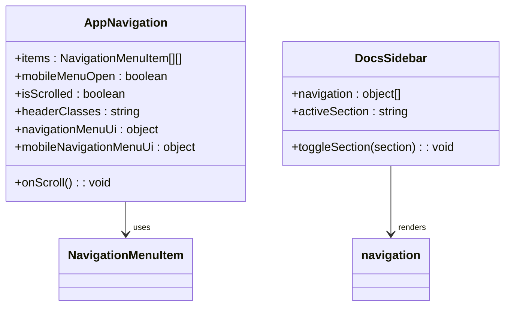

**图示来源**  
- [components/AppNavigation.vue](file://components/AppNavigation.vue#L140-L308)
- [components/DocsSidebar.vue](file://components/DocsSidebar.vue)

**本节来源**  
- [components/AppNavigation.vue](file://components/AppNavigation.vue#L1-L309)
- [components/DocsSidebar.vue](file://components/DocsSidebar.vue)

#### TypeScript类型定义
项目使用TypeScript进行类型安全开发，关键类型定义包括：
- `AppData`：应用数据接口
- `Category`：分类数据接口
- `SceneAppData`：场景应用数据接口

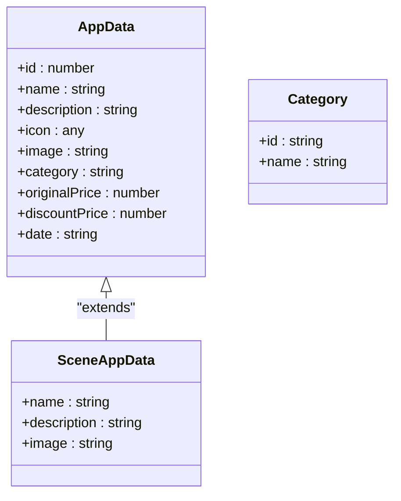

**图示来源**  
- [utils/pluginData.ts](file://utils/pluginData.ts#L26-L44)
- [utils/scene.ts](file://utils/scene.ts#L4-L8)

**本节来源**  
- [utils/pluginData.ts](file://utils/pluginData.ts#L1-L323)
- [utils/scene.ts](file://utils/scene.ts#L1-L122)

### Storybook可视化测试

#### Plugin.stories.ts配置
Storybook用于为组件编写可视化测试和文档，`Plugin.stories.ts`示例展示了如何配置页面级别的Story。

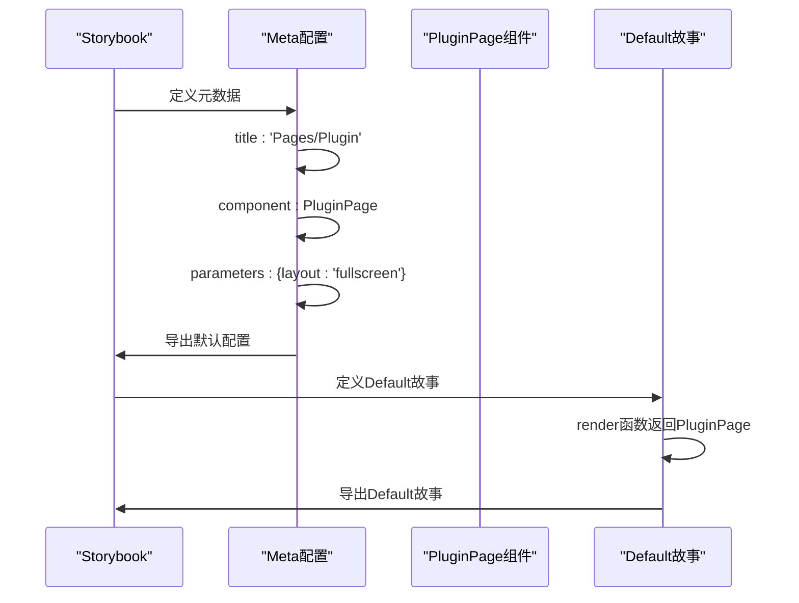

**图示来源**  
- [stories/Plugin.stories.ts](file://stories/Plugin.stories.ts#L1-L28)

**本节来源**  
- [stories/Plugin.stories.ts](file://stories/Plugin.stories.ts#L1-L28)

### 工具函数设计模式

#### getDocsRoutes.ts
该工具函数递归扫描`content/docs`目录，生成文档路由列表，用于Nitro预渲染配置。

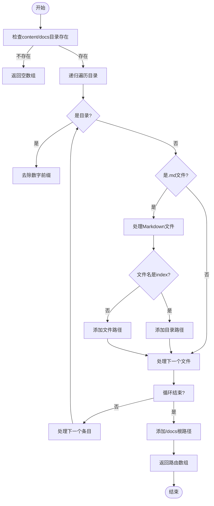

**图示来源**  
- [utils/getDocsRoutes.ts](file://utils/getDocsRoutes.ts#L17-L57)

**本节来源**  
- [utils/getDocsRoutes.ts](file://utils/getDocsRoutes.ts#L1-L58)
- [nuxt.config.ts](file://nuxt.config.ts#L49)

#### pluginData.ts
该文件定义了应用数据接口和静态数据，采用模块化设计模式。

```mermaid
classDiagram
class pluginData {
+categories : Category[]
+apps : AppData[]
}
class AppData {
+id : number
+name : string
+description : string
+icon : any
+image : string
+category : string
+originalPrice : number
+discountPrice : number
+date : string
}
class Category {
+id : string
+name : string
}
pluginData --> AppData : "包含"
pluginData --> Category : "包含"
AppData --> "lucide-vue-next" : "使用图标"
```

**图示来源**  
- [utils/pluginData.ts](file://utils/pluginData.ts#L26-L322)

**本节来源**  
- [utils/pluginData.ts](file://utils/pluginData.ts#L1-L323)

### 页面创建与路由配置

#### 新页面创建流程
在`pages/`目录下创建新的`.vue`文件即可自动注册路由。


**本节来源**  
- [pages/plugin.vue](file://pages/plugin.vue#L144-L167)
- [pages/index.vue](file://pages/index.vue#L14-L27)

#### 路由参数处理
使用Nuxt的动态路由功能处理复杂路由需求。

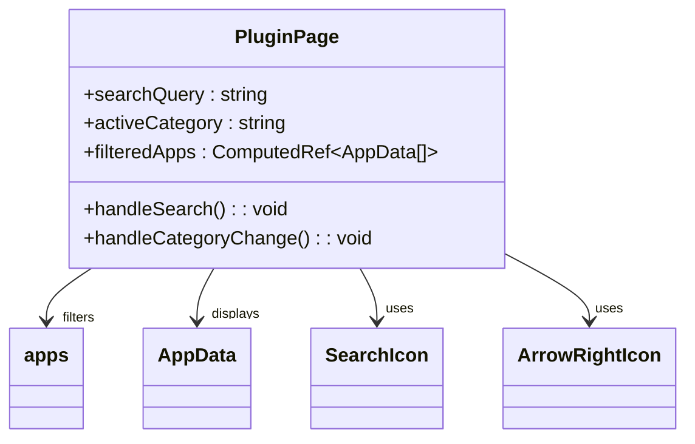

**图示来源**  
- [pages/plugin.vue](file://pages/plugin.vue#L169-L194)

**本节来源**  
- [pages/plugin.vue](file://pages/plugin.vue#L1-L217)

### 功能扩展开发

#### AI插件开发
通过扩展`utils/pluginData.ts`中的`apps`数组来添加新的AI插件。

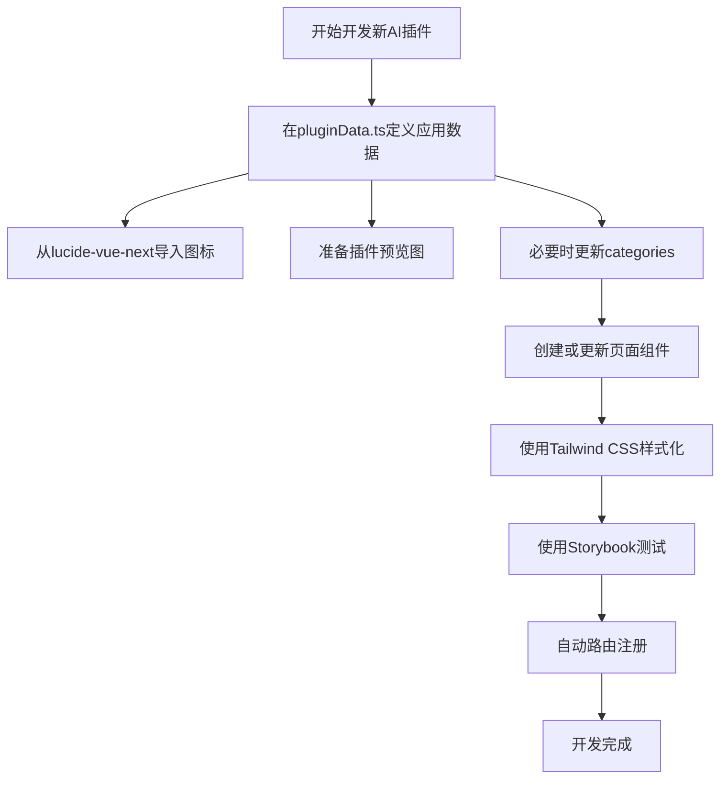

**本节来源**  
- [utils/pluginData.ts](file://utils/pluginData.ts#L57-L322)
- [pages/plugin.vue](file://pages/plugin.vue)
- [tailwind.config.js](file://tailwind.config.js#L13-L57)

#### 第三方API集成
项目支持通过Nuxt模块集成第三方API服务。

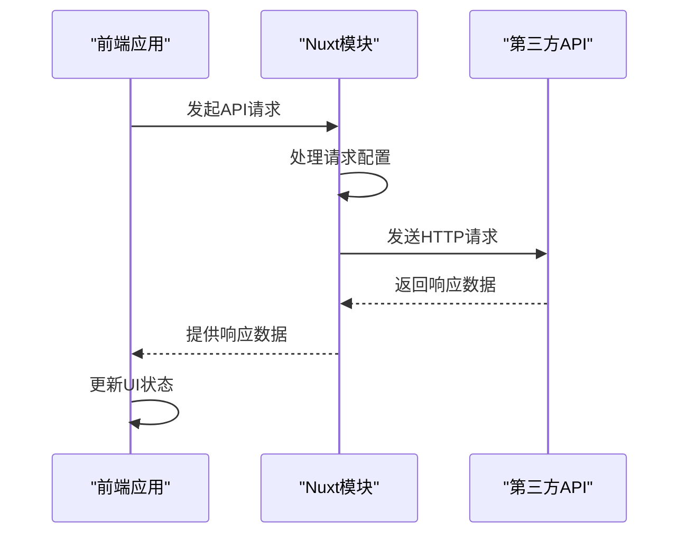

**本节来源**  
- [nuxt.config.ts](file://nuxt.config.ts#L18-L21)
- [package.json](file://package.json#L12-L35)

## 依赖分析

项目依赖关系清晰，分为开发依赖和生产依赖。

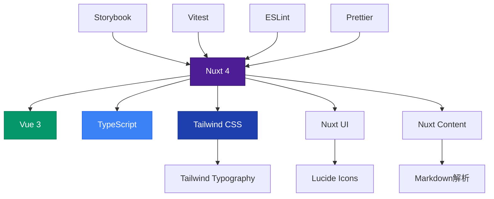

**图示来源**  
- [package.json](file://package.json#L12-L47)
- [nuxt.config.ts](file://nuxt.config.ts#L18-L21)

**本节来源**  
- [package.json](file://package.json#L1-L48)
- [nuxt.config.ts](file://nuxt.config.ts#L1-L91)

## 性能考虑

项目在性能方面进行了多项优化：

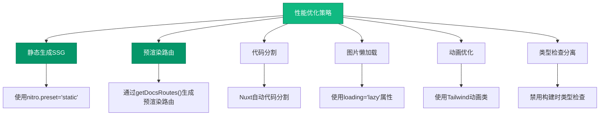

**本节来源**  
- [nuxt.config.ts](file://nuxt.config.ts#L41-L50)
- [utils/getDocsRoutes.ts](file://utils/getDocsRoutes.ts)
- [tailwind.config.js](file://tailwind.config.js#L58-L63)

## 故障排除指南

### 常见问题及解决方案

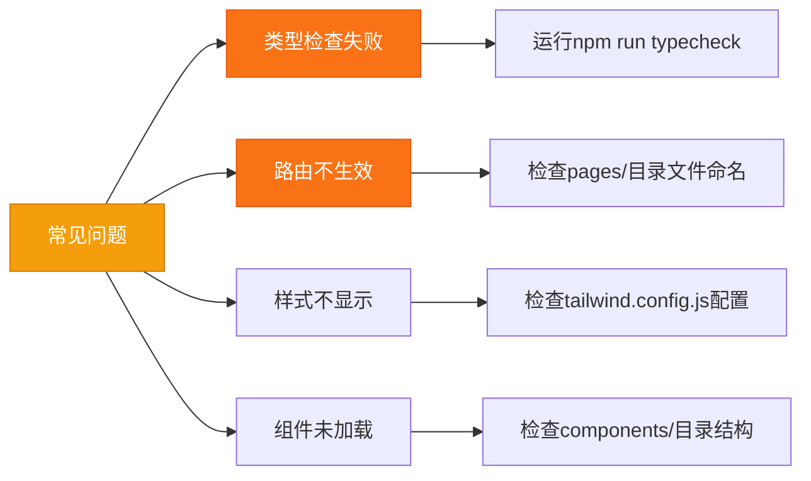

**本节来源**  
- [tsconfig.json](file://tsconfig.json)
- [nuxt.config.ts](file://nuxt.config.ts#L88)
- [tailwind.config.js](file://tailwind.config.js)
- [README.md](file://README.md#L47-L53)

## 结论

本指南详细介绍了智言万象项目的开发规范和最佳实践。通过遵循这些指导原则，开发者可以高效地进行二次开发和贡献代码。项目采用现代化的技术栈和清晰的架构设计，为AI应用开发提供了强大的基础平台。