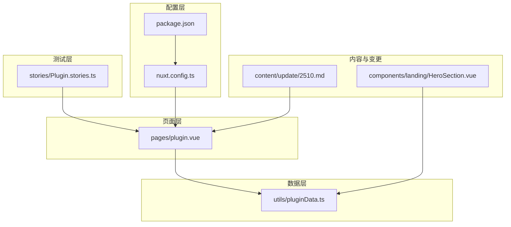
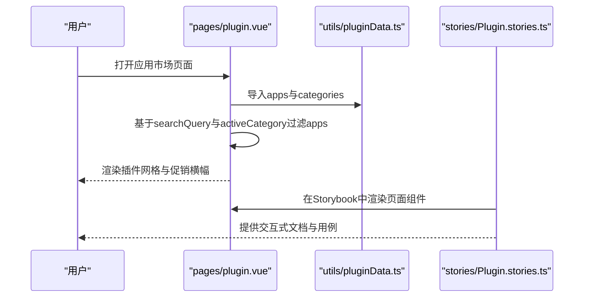
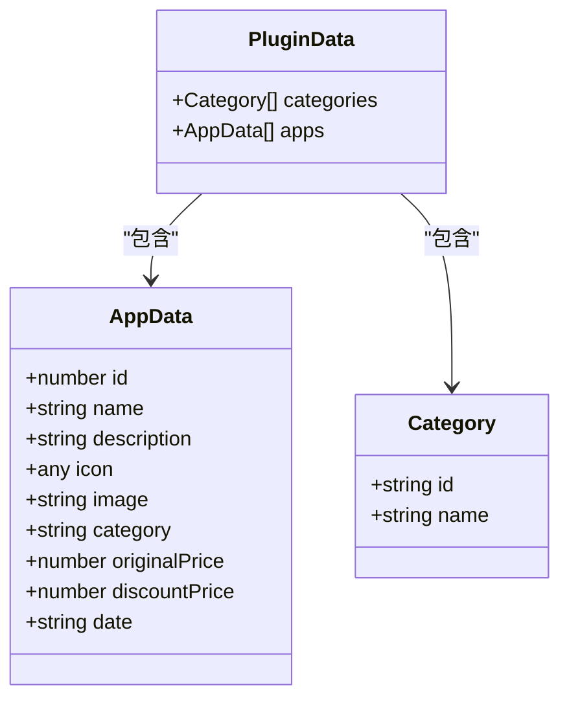
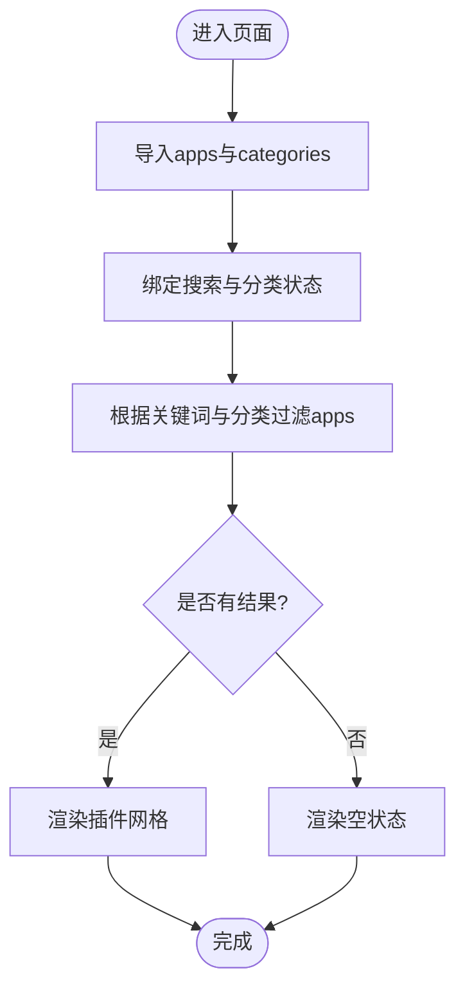
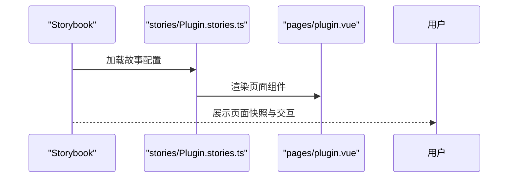
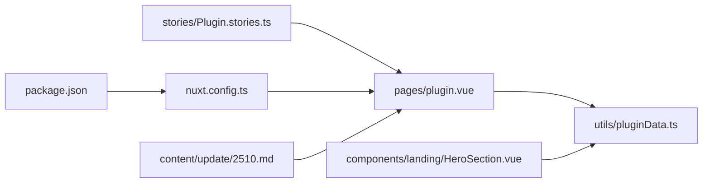

# 插件开发与集成

<cite>
**本文引用的文件**
- [utils/pluginData.ts](file://utils/pluginData.ts)
- [pages/plugin.vue](file://pages/plugin.vue)
- [stories/Plugin.stories.ts](file://stories/Plugin.stories.ts)
- [nuxt.config.ts](file://nuxt.config.ts)
- [package.json](file://package.json)
- [README.md](file://README.md)
- [content/update/2510.md](file://content/update/2510.md)
- [components/landing/HeroSection.vue](file://components/landing/HeroSection.vue)
</cite>

## 目录
1. [引言](#引言)
2. [项目结构](#项目结构)
3. [核心组件](#核心组件)
4. [架构总览](#架构总览)
5. [详细组件分析](#详细组件分析)
6. [依赖关系分析](#依赖关系分析)
7. [性能考量](#性能考量)
8. [故障排查指南](#故障排查指南)
9. [结论](#结论)
10. [附录](#附录)

## 引言
本文件围绕“如何开发与集成AI功能插件”展开，结合仓库中的现有实现，系统讲解插件元信息的数据结构、在页面中的动态加载与渲染、Storybook可视化测试用例的编写方法，并给出从创建插件模板、实现功能逻辑到打包发布的完整流程建议。同时，针对错误处理、版本兼容性管理与安全沙箱设计提出最佳实践建议，帮助读者在现有Nuxt 4 + Vue 3架构下高效扩展AI插件生态。

## 项目结构
本项目采用Nuxt 4 + Vue 3的现代前端模板，插件相关内容主要集中在以下位置：
- 插件元信息与数据：utils/pluginData.ts
- 插件页面渲染：pages/plugin.vue
- Storybook可视化测试：stories/Plugin.stories.ts
- Nuxt配置与模块：nuxt.config.ts
- 依赖与脚本：package.json
- 版本变更与插件相关注意事项：content/update/2510.md
- 页面级插件图片联动：components/landing/HeroSection.vue

**图表来源**
- [pages/plugin.vue](file://pages/plugin.vue#L144-L196)
- [utils/pluginData.ts](file://utils/pluginData.ts#L1-L323)
- [stories/Plugin.stories.ts](file://stories/Plugin.stories.ts#L1-L28)
- [nuxt.config.ts](file://nuxt.config.ts#L1-L91)
- [package.json](file://package.json#L1-L48)
- [content/update/2510.md](file://content/update/2510.md#L1-L67)
- [components/landing/HeroSection.vue](file://components/landing/HeroSection.vue#L252-L328)

**章节来源**
- [README.md](file://README.md#L1-L117)
- [nuxt.config.ts](file://nuxt.config.ts#L1-L91)
- [package.json](file://package.json#L1-L48)

## 核心组件
- 插件元信息数据结构：在utils/pluginData.ts中定义了AppData接口与apps、categories数据集，用于描述插件的名称、图标、描述、分类、价格、日期等元信息，并通过页面直接消费这些数据。
- 插件页面：pages/plugin.vue负责搜索、分类筛选与网格渲染，使用Composition API与计算属性对apps进行过滤，支持响应式布局与深色模式。
- Storybook故事：stories/Plugin.stories.ts提供页面级Storybook故事，便于交互式文档与可视化回归测试。
- 配置与模块：nuxt.config.ts启用UI与内容模块，配置Head、颜色模式、预渲染等；package.json声明依赖与脚本，包含Storybook与测试工具。

**章节来源**
- [utils/pluginData.ts](file://utils/pluginData.ts#L1-L323)
- [pages/plugin.vue](file://pages/plugin.vue#L144-L196)
- [stories/Plugin.stories.ts](file://stories/Plugin.stories.ts#L1-L28)
- [nuxt.config.ts](file://nuxt.config.ts#L1-L91)
- [package.json](file://package.json#L1-L48)

## 架构总览
插件系统在本项目中的定位是“应用市场”，通过统一的数据结构与页面渲染组件，实现插件的展示、搜索与分类浏览。整体交互链路如下：

**图表来源**
- [pages/plugin.vue](file://pages/plugin.vue#L144-L196)
- [utils/pluginData.ts](file://utils/pluginData.ts#L1-L323)
- [stories/Plugin.stories.ts](file://stories/Plugin.stories.ts#L1-L28)

## 详细组件分析

### 插件元信息数据结构与定义
- 接口与数据集
  - AppData接口：包含id、name、description、icon、image、category、originalPrice、discountPrice、date等字段，用于承载插件元信息。
  - Category接口：包含id、name，用于分类展示。
  - apps数组：包含多个AppData实例，每个实例代表一个插件条目。
  - categories数组：包含多个Category实例，用于侧边栏分类导航。
- 图标与媒体
  - 图标通过lucide-vue-next引入，以组件形式赋值给app.icon，页面通过动态component渲染。
  - image字段指向插件预览图路径，页面通过懒加载与占位背景渲染。
- 价格与促销
  - originalPrice与discountPrice用于展示原价与折后价，页面以视觉层级呈现折扣信息。
- 分类与推荐
  - category字段用于页面过滤；页面内对“官方推荐”“独立应用”等分类做了模拟过滤逻辑。

**图表来源**
- [utils/pluginData.ts](file://utils/pluginData.ts#L23-L323)

**章节来源**
- [utils/pluginData.ts](file://utils/pluginData.ts#L23-L323)

### 页面渲染与交互逻辑
- 搜索与分类
  - 使用v-model绑定searchQuery，computed计算filteredApps，结合名称与描述关键词过滤，同时根据activeCategory过滤。
  - 对“官方推荐”“独立应用”等分类做了特殊逻辑，便于演示。
- 动态图标渲染
  - 通过<component :is="app.icon">实现图标动态渲染，确保与数据解耦。
- 空状态与布局
  - 当过滤结果为空时显示空状态提示；页面采用响应式布局，支持移动端与桌面端。
- SEO与元信息
  - 页面使用useSeoMeta设置标题、描述、OG标签，提升SEO表现。

**图表来源**
- [pages/plugin.vue](file://pages/plugin.vue#L144-L196)

**章节来源**
- [pages/plugin.vue](file://pages/plugin.vue#L1-L217)

### Storybook可视化测试用例
- 故事配置
  - 使用Meta与StoryObj定义页面故事，参数设置为fullscreen布局，tags包含autodocs。
- 默认视图
  - 通过render返回组件与模板，直接渲染PluginPage，便于在Storybook中查看页面效果与交互。
- 适用场景
  - 用于页面级回归测试、组件演示与交互式文档，便于团队协作与评审。

**图表来源**
- [stories/Plugin.stories.ts](file://stories/Plugin.stories.ts#L1-L28)
- [pages/plugin.vue](file://pages/plugin.vue#L1-L217)

**章节来源**
- [stories/Plugin.stories.ts](file://stories/Plugin.stories.ts#L1-L28)
- [README.md](file://README.md#L108-L113)

### 插件注册机制与配置注入
- 现状说明
  - 本仓库的插件注册与配置注入并非通过动态模块或运行时插件系统实现，而是通过utils/pluginData.ts集中管理插件元信息，页面直接导入并渲染。
- 建议的扩展方向
  - 插件注册：在应用启动阶段扫描plugins目录，读取插件清单，注册路由、菜单与权限。
  - 配置注入：通过Nuxt配置或运行时配置对象注入插件的入口组件、图标、描述与参数schema。
  - 与核心系统通信：插件通过统一的SDK或API网关与核心系统交互，避免直接耦合。
- 与现有页面的衔接
  - 页面仍可沿用apps/categories数据结构，将插件清单映射为AppData，实现统一渲染。

**章节来源**
- [utils/pluginData.ts](file://utils/pluginData.ts#L1-L323)
- [pages/plugin.vue](file://pages/plugin.vue#L144-L196)

### 动态加载与渲染插件
- 动态图标
  - 页面通过动态component渲染app.icon，确保图标随数据变化而更新。
- 动态图片
  - HeroSection.vue中通过apps.map(app => app.image)获取所有插件图片，用于跑马灯展示，体现数据与页面的联动。
- 响应式与懒加载
  - 页面对图片使用懒加载与占位背景，提升首屏性能与体验。

**章节来源**
- [pages/plugin.vue](file://pages/plugin.vue#L72-L126)
- [components/landing/HeroSection.vue](file://components/landing/HeroSection.vue#L294-L328)

### 版本兼容性管理
- 版本变更与插件停用
  - content/update/2510.md明确指出“停用所有应用插件，需在应用管理更新插件后重新启用”，并列出多项修复与更新方式，体现了版本升级对插件生态的影响。
- 建议
  - 在版本升级前，提前发布兼容性说明与迁移指南；对插件API进行向后兼容或提供迁移脚本；在升级过程中提供回滚方案。

**章节来源**
- [content/update/2510.md](file://content/update/2510.md#L1-L67)

### 安全沙箱设计最佳实践
- 代码隔离
  - 插件运行在受限的沙箱环境中，禁止直接访问全局对象与DOM以外的API。
- 权限控制
  - 通过白名单限制插件可调用的API与资源，必要时引入中间件进行鉴权与审计。
- 输入校验
  - 对插件传入的参数进行严格校验与清洗，防止XSS与注入攻击。
- 日志与监控
  - 记录插件运行日志与异常事件，建立告警机制，便于快速定位问题。
- 依赖与更新
  - 对第三方依赖进行定期扫描与更新，避免已知漏洞影响插件安全。

[本节为通用最佳实践建议，不直接分析具体文件，故无章节来源]

## 依赖关系分析
- 页面依赖数据层
  - pages/plugin.vue依赖utils/pluginData.ts提供的apps与categories，实现数据驱动的渲染。
- Storybook依赖页面
  - stories/Plugin.stories.ts依赖pages/plugin.vue，用于在Storybook中渲染页面组件。
- 配置与模块
  - nuxt.config.ts启用UI与内容模块，配置Head、颜色模式与预渲染；package.json声明Storybook与测试工具，支撑开发与质量保障。
- 内容与变更
  - content/update/2510.md记录版本变更与插件相关注意事项，影响插件生命周期管理。

**图表来源**
- [pages/plugin.vue](file://pages/plugin.vue#L144-L196)
- [utils/pluginData.ts](file://utils/pluginData.ts#L1-L323)
- [stories/Plugin.stories.ts](file://stories/Plugin.stories.ts#L1-L28)
- [nuxt.config.ts](file://nuxt.config.ts#L1-L91)
- [package.json](file://package.json#L1-L48)
- [content/update/2510.md](file://content/update/2510.md#L1-L67)
- [components/landing/HeroSection.vue](file://components/landing/HeroSection.vue#L294-L328)

**章节来源**
- [nuxt.config.ts](file://nuxt.config.ts#L1-L91)
- [package.json](file://package.json#L1-L48)

## 性能考量
- 图片懒加载与占位
  - 页面对插件预览图使用懒加载与占位背景，减少首屏阻塞。
- 响应式布局
  - 使用flex与grid布局，适配不同屏幕尺寸，降低重排与重绘成本。
- 计算属性与过滤
  - 使用computed进行过滤，避免重复计算；对搜索关键词与分类条件进行组合过滤，提升交互流畅度。
- 预渲染与静态输出
  - nuxt.config.ts配置Nitro静态输出与预渲染，有助于提升SEO与首屏性能。

**章节来源**
- [pages/plugin.vue](file://pages/plugin.vue#L72-L126)
- [nuxt.config.ts](file://nuxt.config.ts#L40-L51)

## 故障排查指南
- 插件停用与更新
  - 若遇到插件停用或启停无效，参考content/update/2510.md中的更新方式与注意事项，按步骤执行更新与重启。
- 构建与预览
  - 使用package.json中的脚本进行开发、构建与预览，确保类型检查通过后再进行生产构建。
- Storybook测试
  - 如Storybook无法渲染页面，检查stories/Plugin.stories.ts的组件导入与渲染配置是否正确。

**章节来源**
- [content/update/2510.md](file://content/update/2510.md#L56-L67)
- [package.json](file://package.json#L6-L11)
- [stories/Plugin.stories.ts](file://stories/Plugin.stories.ts#L1-L28)

## 结论
本项目以“应用市场”为核心，通过统一的插件元信息数据结构与页面渲染组件，实现了插件的展示、搜索与分类浏览。结合Storybook故事与Nuxt配置，形成了从开发到测试的闭环。对于插件注册、配置注入与核心系统通信，建议在现有基础上扩展为动态插件体系，并配套完善的安全沙箱与版本兼容策略，以支撑更大规模的AI插件生态。

## 附录

### 从创建插件模板到打包发布的流程建议
- 创建插件模板
  - 定义插件入口组件与参数schema，确保与核心系统约定一致。
- 实现功能逻辑
  - 将插件功能封装为可复用模块，遵循单一职责原则；对异步操作进行错误处理与超时控制。
- 集成与注册
  - 在应用启动阶段扫描插件目录，读取清单并注册路由、菜单与权限；通过配置对象注入插件入口与图标。
- 与核心系统通信
  - 通过统一SDK或API网关与核心系统交互，避免直接耦合；对请求进行鉴权与限流。
- 动态加载与渲染
  - 在页面中以动态组件方式渲染插件入口，确保图标与描述随数据变化而更新。
- 错误处理
  - 对网络异常、参数校验失败与未知错误进行分类处理，并提供降级方案与用户提示。
- 版本兼容性管理
  - 发布前进行兼容性测试与回归测试；在版本升级时提供迁移指南与回滚方案。
- 安全沙箱设计
  - 限制插件可调用的API与资源；对输入进行严格校验；记录运行日志与异常事件。
- 打包与发布
  - 使用Nuxt的静态输出与预渲染能力，结合CI/CD流水线进行自动化构建与部署；在Storybook中补充交互式文档与回归测试。

[本节为通用流程建议，不直接分析具体文件，故无章节来源]