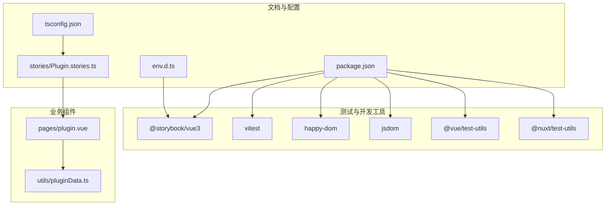
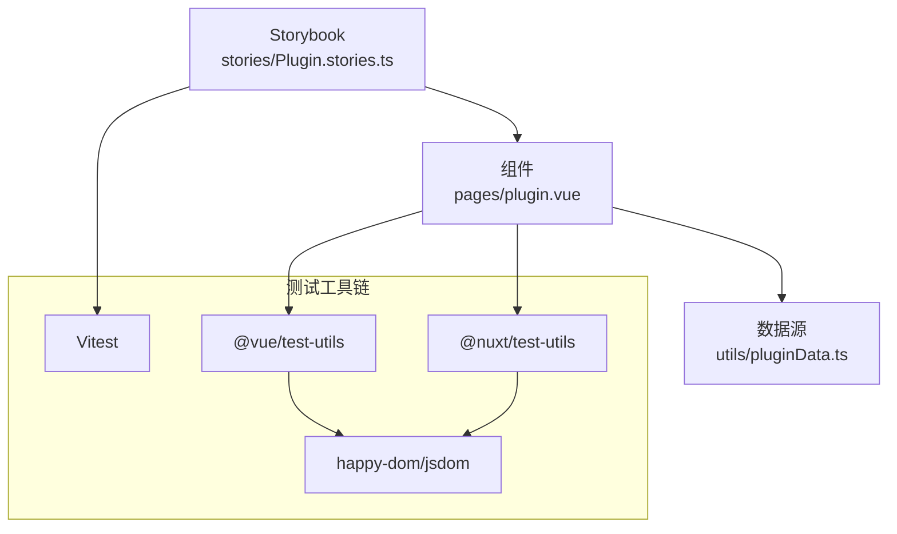
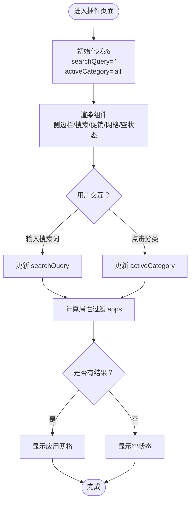
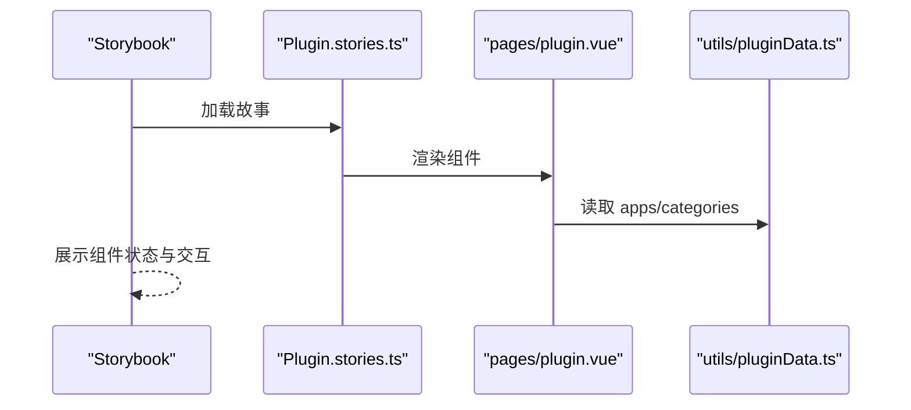
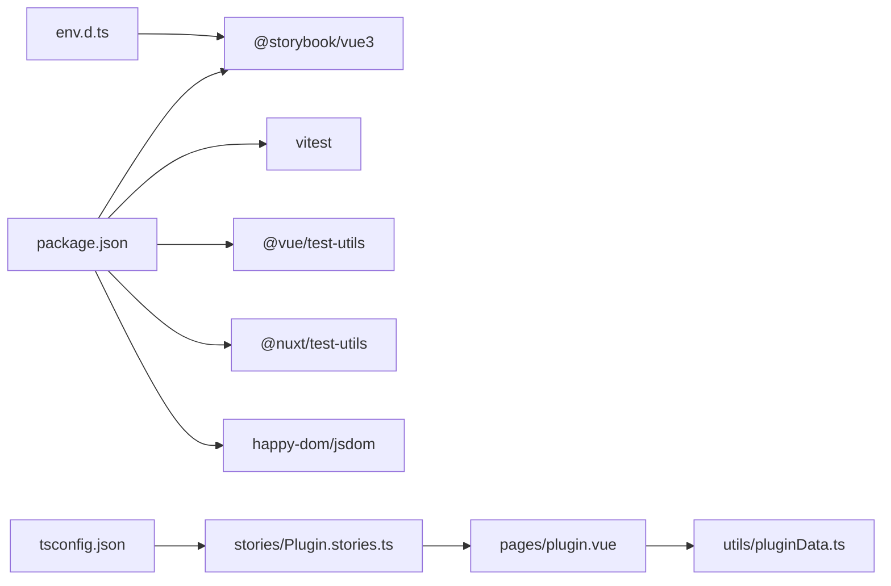

# 测试策略与实践

<cite>
**本文引用的文件**
- [stories/Plugin.stories.ts](file://stories/Plugin.stories.ts)
- [pages/plugin.vue](file://pages/plugin.vue)
- [utils/pluginData.ts](file://utils/pluginData.ts)
- [package.json](file://package.json)
- [README.md](file://README.md)
- [tsconfig.json](file://tsconfig.json)
- [env.d.ts](file://env.d.ts)
</cite>

## 目录
1. [引言](#引言)
2. [项目结构](#项目结构)
3. [核心组件](#核心组件)
4. [架构总览](#架构总览)
5. [详细组件分析](#详细组件分析)
6. [依赖分析](#依赖分析)
7. [性能考虑](#性能考虑)
8. [故障排查指南](#故障排查指南)
9. [结论](#结论)
10. [附录](#附录)

## 引言
本文件围绕 budi.ai 项目的测试策略展开，重点阐述 Storybook 在 Plugin.stories.ts 中的应用，如何为 UI 组件编写视觉回归测试与交互测试；明确组件测试覆盖范围（props 输入、事件触发、状态变化等）；指导测试环境配置、测试用例编写与运行；强调测试驱动开发（TDD）在插件开发中的价值；提供快照测试、组件挂载测试与模拟数据注入的实践路径；并说明如何通过测试保障重构安全性，最终将测试集成到 CI/CD 流程中。

## 项目结构
- 本项目采用 Nuxt 4 + Vue 3 + TypeScript 架构，Storybook 已作为开发依赖引入，用于可视化组件与交互验证。
- 关键测试相关文件：
  - stories/Plugin.stories.ts：Storybook 的页面故事，演示插件页面组件的渲染与交互。
  - pages/plugin.vue：插件页面组件，包含搜索、分类筛选、应用卡片展示、空状态等逻辑。
  - utils/pluginData.ts：应用与分类的静态数据源，供组件消费。
  - package.json：声明了 @storybook/vue3、@vue/test-utils、vitest、happy-dom、jsdom 等测试相关依赖。
  - tsconfig.json：包含 stories/**/* 的编译包含路径，确保 Storybook 与测试工具链可用。
  - env.d.ts：为 Storybook 与 Vitest 提供类型声明。

图表来源
- [stories/Plugin.stories.ts](file://stories/Plugin.stories.ts#L1-L28)
- [pages/plugin.vue](file://pages/plugin.vue#L1-L217)
- [utils/pluginData.ts](file://utils/pluginData.ts#L1-L323)
- [package.json](file://package.json#L1-L48)
- [tsconfig.json](file://tsconfig.json#L1-L16)
- [env.d.ts](file://env.d.ts#L1-L2)

章节来源
- [stories/Plugin.stories.ts](file://stories/Plugin.stories.ts#L1-L28)
- [pages/plugin.vue](file://pages/plugin.vue#L1-L217)
- [utils/pluginData.ts](file://utils/pluginData.ts#L1-L323)
- [package.json](file://package.json#L1-L48)
- [tsconfig.json](file://tsconfig.json#L1-L16)
- [env.d.ts](file://env.d.ts#L1-L2)

## 核心组件
- 插件页面组件（pages/plugin.vue）
  - 负责渲染侧边栏导航、搜索框、促销横幅、应用网格、空状态等。
  - 使用 Composition API 管理状态（搜索关键词、活动分类），并通过计算属性对应用进行过滤。
  - 依赖 utils/pluginData.ts 提供的静态数据（apps、categories）。
- Storybook 故事（stories/Plugin.stories.ts）
  - 将插件页面组件作为 Storybook 的页面故事，提供默认视图渲染，便于可视化与交互测试。
- 测试工具链
  - @storybook/vue3：用于构建组件故事与交互演示。
  - vitest + @vue/test-utils：用于单元测试与组件挂载测试。
  - happy-dom/jsdom：用于 DOM 环境与浏览器 API 模拟。
  - @nuxt/test-utils：提供 Nuxt 场景下的测试工具与环境。

章节来源
- [pages/plugin.vue](file://pages/plugin.vue#L1-L217)
- [utils/pluginData.ts](file://utils/pluginData.ts#L1-L323)
- [stories/Plugin.stories.ts](file://stories/Plugin.stories.ts#L1-L28)
- [package.json](file://package.json#L1-L48)
- [tsconfig.json](file://tsconfig.json#L1-L16)
- [env.d.ts](file://env.d.ts#L1-L2)

## 架构总览
下图展示了 Storybook 与组件测试在项目中的位置与关系，以及与数据源的关系。

图表来源
- [stories/Plugin.stories.ts](file://stories/Plugin.stories.ts#L1-L28)
- [pages/plugin.vue](file://pages/plugin.vue#L1-L217)
- [utils/pluginData.ts](file://utils/pluginData.ts#L1-L323)
- [package.json](file://package.json#L1-L48)

## 详细组件分析

### 插件页面组件（pages/plugin.vue）测试要点
- 状态与行为
  - 搜索关键词变更：输入框双向绑定，影响过滤结果。
  - 分类切换：点击分类按钮更新活动分类，影响过滤结果。
  - 过滤逻辑：同时满足搜索关键词与分类条件。
  - 空状态：当过滤结果为空时显示提示。
- 交互与事件
  - 输入框事件：输入搜索词。
  - 按钮点击：切换分类。
- 视觉与布局
  - 促销横幅、网格布局、卡片样式、空状态提示等。
- 数据依赖
  - 使用 utils/pluginData.ts 提供的 apps 与 categories。

图表来源
- [pages/plugin.vue](file://pages/plugin.vue#L1-L217)
- [utils/pluginData.ts](file://utils/pluginData.ts#L1-L323)

章节来源
- [pages/plugin.vue](file://pages/plugin.vue#L1-L217)
- [utils/pluginData.ts](file://utils/pluginData.ts#L1-L323)

### Storybook 在 Plugin.stories.ts 中的应用
- 目标与参数
  - 将插件页面组件注册为 Storybook 的页面故事，设置布局为全屏，开启自动文档标签。
- 默认视图
  - 通过 render 函数直接挂载插件页面组件，便于在 Storybook 中查看组件初始状态与交互。
- 视觉回归与交互测试
  - Storybook 可作为“可视化测试”入口，手动验证组件在不同状态下的外观与交互。
  - 结合 Vitest 与 @vue/test-utils，可将 Storybook 中验证过的交互自动化为单元测试，形成“从可视化到可重复”的测试闭环。

图表来源
- [stories/Plugin.stories.ts](file://stories/Plugin.stories.ts#L1-L28)
- [pages/plugin.vue](file://pages/plugin.vue#L1-L217)
- [utils/pluginData.ts](file://utils/pluginData.ts#L1-L323)

章节来源
- [stories/Plugin.stories.ts](file://stories/Plugin.stories.ts#L1-L28)
- [pages/plugin.vue](file://pages/plugin.vue#L1-L217)
- [utils/pluginData.ts](file://utils/pluginData.ts#L1-L323)

### 组件测试覆盖范围
- Props 输入
  - 搜索关键词：通过输入框事件驱动 searchQuery 更新，验证过滤结果。
  - 分类标识：通过按钮点击驱动 activeCategory 更新，验证过滤结果。
- 事件触发
  - 输入事件：验证输入框值变更是否正确反映到计算属性。
  - 点击事件：验证分类按钮点击是否正确切换活动分类。
- 状态变化
  - 计算属性 filteredApps：验证搜索与分类组合过滤逻辑。
  - 空状态：验证无结果时的 UI 行为。
- 快照与视觉回归
  - 使用 Storybook 截图或 Vitest Snapshot 对组件关键状态进行快照对比，防止 UI 回退。
- 模拟数据注入
  - 使用 utils/pluginData.ts 的静态数据作为测试数据源，必要时可创建替代数据集以覆盖边界场景。

章节来源
- [pages/plugin.vue](file://pages/plugin.vue#L1-L217)
- [utils/pluginData.ts](file://utils/pluginData.ts#L1-L323)
- [stories/Plugin.stories.ts](file://stories/Plugin.stories.ts#L1-L28)

### 测试环境配置与运行
- 依赖与工具
  - @storybook/vue3：组件故事与可视化。
  - vitest：轻量级测试框架。
  - @vue/test-utils：Vue 组件测试工具。
  - @nuxt/test-utils：Nuxt 场景测试工具。
  - happy-dom/jsdom：DOM 与浏览器 API 模拟。
- 编译与类型
  - tsconfig.json 包含 stories/**/*，确保 Storybook 与测试工具链可用。
  - env.d.ts 为 Storybook 与 Vitest 提供类型声明。
- 运行方式
  - Storybook：通过 Storybook CLI 或 Nuxt 集成启动故事。
  - Vitest：通过 npm scripts 或命令行运行测试套件。
  - 类型检查：使用 npm run typecheck 独立执行。

章节来源
- [package.json](file://package.json#L1-L48)
- [tsconfig.json](file://tsconfig.json#L1-L16)
- [env.d.ts](file://env.d.ts#L1-L2)
- [README.md](file://README.md#L108-L117)

### 测试驱动开发（TDD）在插件开发中的价值
- 设计先行：先编写最小可行的测试用例，再实现功能，确保需求与实现一致。
- 快速反馈：通过 Storybook 与 Vitest 快速验证交互与 UI，减少回归风险。
- 可维护性：测试用例作为“行为规范”，保障重构时的稳定性。
- 团队协作：测试用例可作为开发与设计之间的契约，降低沟通成本。

章节来源
- [README.md](file://README.md#L108-L117)

### 快照测试、组件挂载测试与模拟数据注入
- 快照测试
  - 使用 Vitest Snapshot 对组件在默认状态、搜索状态、空状态等关键状态进行截图对比，防止 UI 回退。
- 组件挂载测试
  - 使用 @vue/test-utils 挂载 pages/plugin.vue，模拟用户交互（输入、点击），断言 DOM 与状态变化。
- 模拟数据注入
  - 使用 utils/pluginData.ts 的静态数据作为测试数据源；如需覆盖边界场景，可在测试中替换或构造替代数据集。

章节来源
- [pages/plugin.vue](file://pages/plugin.vue#L1-L217)
- [utils/pluginData.ts](file://utils/pluginData.ts#L1-L323)
- [package.json](file://package.json#L1-L48)

### 通过测试保障重构安全性
- 回归保护：为关键交互（搜索、分类、空状态）编写测试用例，确保重构不破坏既有行为。
- 视觉回归：结合 Storybook 与快照测试，防止样式与布局回退。
- 边界覆盖：针对空结果、特殊字符、极端长度等边界场景进行测试。
- 持续验证：将测试纳入 CI/CD，每次提交自动运行测试，及时发现风险。

章节来源
- [stories/Plugin.stories.ts](file://stories/Plugin.stories.ts#L1-L28)
- [pages/plugin.vue](file://pages/plugin.vue#L1-L217)
- [utils/pluginData.ts](file://utils/pluginData.ts#L1-L323)
- [package.json](file://package.json#L1-L48)

### 集成到 CI/CD 流程
- 流程建议
  - 安装依赖：npm ci
  - 类型检查：npm run typecheck
  - 单元测试：npm run test 或 vitest run
  - Storybook 可视化测试：在 CI 中截图对比或运行交互测试
- 触发条件
  - PR/MR 合并请求、主分支推送、发布标签等。
- 失败处理
  - 失败时输出测试报告与截图差异，便于定位问题。

章节来源
- [README.md](file://README.md#L108-L117)
- [package.json](file://package.json#L1-L48)

## 依赖分析
- Storybook 与测试工具链
  - @storybook/vue3：组件故事与可视化。
  - vitest：测试框架。
  - @vue/test-utils：Vue 组件测试。
  - @nuxt/test-utils：Nuxt 场景测试。
  - happy-dom/jsdom：DOM 与浏览器 API 模拟。
- 业务组件与数据
  - pages/plugin.vue 依赖 utils/pluginData.ts 提供的静态数据。
- 类型与编译
  - tsconfig.json 包含 stories/**/*，env.d.ts 提供类型声明。

图表来源
- [package.json](file://package.json#L1-L48)
- [stories/Plugin.stories.ts](file://stories/Plugin.stories.ts#L1-L28)
- [pages/plugin.vue](file://pages/plugin.vue#L1-L217)
- [utils/pluginData.ts](file://utils/pluginData.ts#L1-L323)
- [tsconfig.json](file://tsconfig.json#L1-L16)
- [env.d.ts](file://env.d.ts#L1-L2)

章节来源
- [package.json](file://package.json#L1-L48)
- [stories/Plugin.stories.ts](file://stories/Plugin.stories.ts#L1-L28)
- [pages/plugin.vue](file://pages/plugin.vue#L1-L217)
- [utils/pluginData.ts](file://utils/pluginData.ts#L1-L323)
- [tsconfig.json](file://tsconfig.json#L1-L16)
- [env.d.ts](file://env.d.ts#L1-L2)

## 性能考虑
- 测试执行性能
  - 使用 Vitest 的并发与缓存机制，减少测试执行时间。
  - 将重型视觉回归测试拆分为关键状态与全量截图，按需运行。
- 组件渲染性能
  - 在 Storybook 中仅渲染必要状态，避免不必要的重渲染。
  - 对计算属性与过滤逻辑进行性能评估，必要时引入节流/防抖或缓存策略。

## 故障排查指南
- Storybook 无法加载故事
  - 检查 tsconfig.json 是否包含 stories/**/*。
  - 确认 env.d.ts 是否包含 Storybook 类型声明。
- 测试环境报错
  - 确认已安装 happy-dom/jsdom，并在 Vitest 配置中启用相应环境。
  - 检查 @nuxt/test-utils 与 Vitest 的版本兼容性。
- 组件交互测试失败
  - 使用 @vue/test-utils 的调试模式，逐步断言 DOM 与状态变化。
  - 对比 Storybook 中的行为与测试断言，确保测试覆盖真实用户路径。

章节来源
- [tsconfig.json](file://tsconfig.json#L1-L16)
- [env.d.ts](file://env.d.ts#L1-L2)
- [package.json](file://package.json#L1-L48)

## 结论
通过 Storybook 与 Vitest 的结合，buidai 项目可以建立从可视化到可重复的测试体系：以 Storybook 验证组件外观与交互，以 Vitest 保证行为与状态的稳定性。配合 @nuxt/test-utils 与 @vue/test-utils，能够在 Nuxt/Vue 生态中高效开展组件测试。将测试纳入 CI/CD，可显著提升重构安全性与交付质量。

## 附录
- 关键文件索引
  - [stories/Plugin.stories.ts](file://stories/Plugin.stories.ts#L1-L28)
  - [pages/plugin.vue](file://pages/plugin.vue#L1-L217)
  - [utils/pluginData.ts](file://utils/pluginData.ts#L1-L323)
  - [package.json](file://package.json#L1-L48)
  - [README.md](file://README.md#L108-L117)
  - [tsconfig.json](file://tsconfig.json#L1-L16)
  - [env.d.ts](file://env.d.ts#L1-L2)