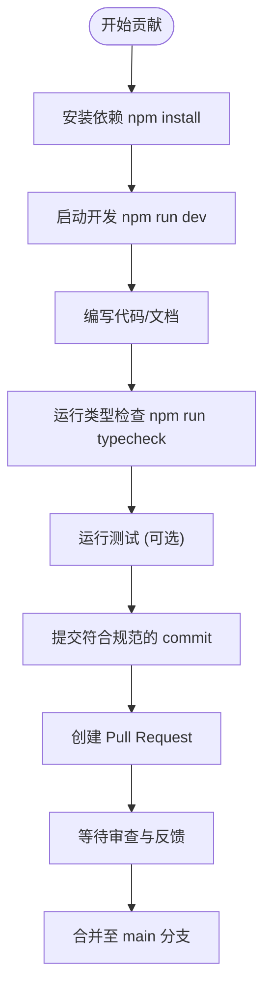

# 贡献流程与规范

<cite>
**本文档引用文件**  
- [package.json](file://package.json)
- [README.md](file://README.md)
- [nuxt.config.ts](file://nuxt.config.ts)
- [tsconfig.json](file://tsconfig.json)
- [tailwind.config.js](file://tailwind.config.js)
- [content.config.ts](file://content.config.ts)
- [app.config.ts](file://app.config.ts)
- [utils/getDocsRoutes.ts](file://utils/getDocsRoutes.ts)
- [components/AppNavigation.vue](file://components/AppNavigation.vue)
- [components/landing/HeroSection.vue](file://components/landing/HeroSection.vue)
- [pages/index.vue](file://pages/index.vue)
- [stories/Plugin.stories.ts](file://stories/Plugin.stories.ts)
</cite>

## 目录

1. [简介](#简介)
2. [分支管理策略](#分支管理策略)
3. [代码风格规范](#代码风格规范)
4. [提交信息格式](#提交信息格式)
5. [本地开发与验证](#本地开发与验证)
6. [Pull Request 审查流程](#pull-request-审查流程)
7. [文档更新要求](#文档更新要求)
8. [版本发布关联机制](#版本发布关联机制)
9. [常见问题排查](#常见问题排查)
10. [附录](#附录)

## 简介

本项目为基于 Nuxt 4 与 Vue 3 构建的企业级 AI 应用开发平台前端模板，采用 TypeScript、Tailwind CSS 和 Nuxt UI 技术栈。项目结构清晰，支持内容驱动的文档与博客系统，并通过 Nuxt Content 实现静态生成（SSG）与 SEO 优化。

本文档旨在明确代码贡献的完整流程和技术规范，涵盖分支管理、代码风格、提交规范、本地验证、PR 流程及常见问题处理，确保团队协作高效、代码质量可控。

**Section sources**
- [README.md](file://README.md#L1-L117)

## 分支管理策略

项目采用标准的 Git 分支管理模型，确保主干稳定与功能开发隔离：

- `main`：主分支，受保护，禁止直接推送。所有生产发布均从此分支构建。
- `feature/*`：功能分支，用于新功能开发。命名格式为 `feature/功能描述`，如 `feature/user-authentication`。
- `fix/*`：修复分支，用于紧急 Bug 修复。命名格式为 `fix/问题描述`。
- `docs/*`：文档更新分支，用于修改文档内容。
- `release/*`：发布准备分支，用于版本发布前的最终测试与调整。

所有功能开发必须从 `main` 分支拉取新分支，并通过 Pull Request 合并回 `main`。

**Section sources**
- [README.md](file://README.md#L96-L101)

## 代码风格规范

### ESLint 与 Prettier 配置

项目虽未显式包含 `.eslintrc` 或 `.prettierrc` 文件，但依赖链中引入了 `@antfu/eslint-config` 和 `prettier`，表明使用现代化统一代码风格配置。建议遵循以下规则：

- 使用 Prettier 进行代码格式化，确保一致的缩进、引号、换行等。
- 启用 ESLint 检查潜在错误与代码质量。
- 推荐在编辑器中安装相应插件以实现保存时自动格式化。

### TypeScript 类型注解要求

- 所有变量、函数参数、返回值应尽可能提供明确的类型注解。
- 使用 `zod` 进行内容校验（见 `content.config.ts`），确保 Markdown Frontmatter 结构安全。
- 组件 `props` 必须定义类型，推荐使用 `defineProps` 宏进行类型推导。

### Vue 组件结构规范

- 使用 Vue 3 的 `<script setup>` 语法糖，提升开发效率。
- 组件命名采用 PascalCase，文件名与组件名一致（如 `AppNavigation.vue`）。
- 模板结构清晰，语义化标签优先，保持可访问性（a11y）。
- 样式使用 Tailwind CSS 原子类，避免自定义 CSS 冗余。
- 组件拆分遵循单一职责原则，复用性强的 UI 元素独立为组件。

**Section sources**
- [tsconfig.json](file://tsconfig.json#L1-L17)
- [components/AppNavigation.vue](file://components/AppNavigation.vue#L1-L200)
- [components/landing/HeroSection.vue](file://components/landing/HeroSection.vue#L1-L200)
- [content.config.ts](file://content.config.ts#L1-L57)

## 提交信息格式

建议采用 [Conventional Commits](https://www.conventionalcommits.org/) 规范，格式如下：

```
<type>(<scope>): <description>

[optional body]

[optional footer(s)]
```

常用类型包括：
- `feat`：新增功能
- `fix`：Bug 修复
- `docs`：文档更新
- `style`：代码格式调整（不影响逻辑）
- `refactor`：代码重构
- `test`：测试相关
- `chore`：构建或工具变更

示例：
```
feat(login): add social login buttons
fix(header): prevent mobile menu overflow
docs(readme): update deployment instructions
```

**Section sources**
- [README.md](file://README.md#L96-L101)

## 本地开发与验证

### 开发环境准备

1. **环境要求**：Node.js ≥ 18
2. **安装依赖**：
   ```bash
   npm install
   ```
3. **启动开发服务器**：
   ```bash
   npm run dev
   ```
   访问 `http://localhost:3000` 查看应用。

### 构建与类型检查

- **构建生产版本**：
  ```bash
  npm run build
  ```
  输出至 `.output/` 目录。

- **预览生产环境**：
  ```bash
  npm run preview
  ```

- **执行类型检查**：
  ```bash
  npm run typecheck
  ```
  项目配置中禁用构建时类型检查以提升开发速度，因此必须手动运行此命令确保类型安全。

### 测试与质量保障

- **单元测试**：已集成 `vitest` 与 `@nuxt/test-utils`，可编写测试文件并运行 `vitest`。
- **Storybook**：已配置 `@storybook/vue3`，用于组件独立开发与展示，示例见 `stories/Plugin.stories.ts`。



**Diagram sources**
- [package.json](file://package.json#L6-L12)
- [nuxt.config.ts](file://nuxt.config.ts#L11-L15)
- [stories/Plugin.stories.ts](file://stories/Plugin.stories.ts#L1-L28)

**Section sources**
- [package.json](file://package.json#L6-L12)
- [nuxt.config.ts](file://nuxt.config.ts#L11-L15)
- [README.md](file://README.md#L47-L55)

## Pull Request 审查流程

1. **创建 PR**：从功能分支向 `main` 提交 Pull Request。
2. **自动检查**：CI 系统将自动运行 `typecheck`、`build` 等脚本验证变更。
3. **代码审查**：至少一名核心成员需审查代码，关注：
   - 功能实现是否正确
   - 代码风格是否符合规范
   - 是否有潜在性能或安全问题
   - 是否包含必要文档更新
4. **反馈与修改**：贡献者根据反馈修改代码并推送至原分支，PR 自动更新。
5. **批准与合并**：审查通过后，由维护者合并 PR。

**Section sources**
- [README.md](file://README.md#L108-L112)

## 文档更新要求

- 所有功能变更必须同步更新相关文档。
- 文档位于 `content/docs/` 目录，使用 Markdown 编写。
- 每级目录可通过 `.navigation.yml` 配置侧边栏分组与图标。
- Frontmatter 必须包含 `title`、`description`，可选 `date`、`category`、`tags` 等字段。
- 新增文档需确保被 `getDocsRoutes()` 函数正确扫描并预渲染。

**Section sources**
- [content.config.ts](file://content.config.ts#L4-L57)
- [utils/getDocsRoutes.ts](file://utils/getDocsRoutes.ts#L1-L58)
- [README.md](file://README.md#L64-L78)

## 版本发布关联机制

- 项目采用静态预渲染部署，通过 `nitro.preset='static'` 配置输出为通用静态文件。
- 输出目录为 `dist`，适配 Vercel 等平台默认配置。
- 所有文档页面由 `getDocsRoutes()` 动态生成预渲染路由，确保 SEO 友好。
- 发布流程通常为：
  1. 合并功能至 `main`
  2. 触发 CI/CD 构建
  3. 部署 `.output/public` 到静态托管服务（如 Vercel、Cloudflare Pages）

**Section sources**
- [nuxt.config.ts](file://nuxt.config.ts#L41-L50)
- [utils/getDocsRoutes.ts](file://utils/getDocsRoutes.ts#L1-L58)
- [README.md](file://README.md#L103-L106)

## 常见问题排查

### 依赖安装失败

- **现象**：`npm install` 报错，无法下载包。
- **解决方案**：
  - 检查 Node.js 版本是否 ≥ 18。
  - 清除缓存：`npm cache clean --force`
  - 删除 `node_modules` 与 `package-lock.json` 后重装。
  - 使用国内镜像源（如淘宝 NPM 镜像）。

### 构建报错

- **现象**：`npm run build` 失败。
- **常见原因与解决**：
  - **类型错误**：运行 `npm run typecheck` 查看具体错误并修复。
  - **路径错误**：检查 `content/` 目录结构是否符合 `content.config.ts` 定义。
  - **环境变量缺失**：如有需要，创建 `.env` 文件并配置必要变量。

### 开发服务器无法启动

- **现象**：`npm run dev` 启动失败或页面空白。
- **排查步骤**：
  - 确认端口 `3000` 未被占用。
  - 检查 `nuxt.config.ts` 是否有语法错误。
  - 查看控制台输出的具体错误信息。

**Section sources**
- [README.md](file://README.md#L47-L55)
- [nuxt.config.ts](file://nuxt.config.ts#L1-L91)
- [package.json](file://package.json#L6-L12)

## 附录

### 项目脚本汇总

| 脚本命令 | 说明 |
|--------|------|
| `dev` | 启动开发服务器 |
| `build` | 构建生产版本 |
| `preview` | 预览生产构建 |
| `typecheck` | 执行 TypeScript 类型检查 |

### 推荐开发工具

- **编辑器**：VS Code
- **插件**：Volar（Vue）、ESLint、Prettier、TypeScript Vue Plugin (Volar)
- **调试工具**：Nuxt DevTools（已启用）

**Section sources**
- [package.json](file://package.json#L6-L12)
- [nuxt.config.ts](file://nuxt.config.ts#L8-L9)
- [README.md](file://README.md#L110-L112)