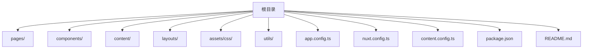
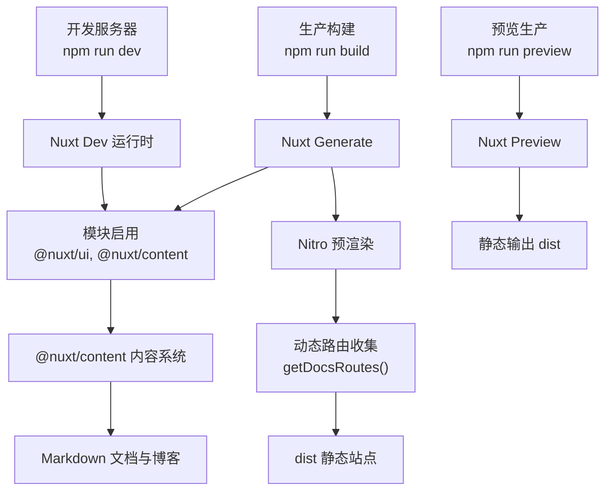
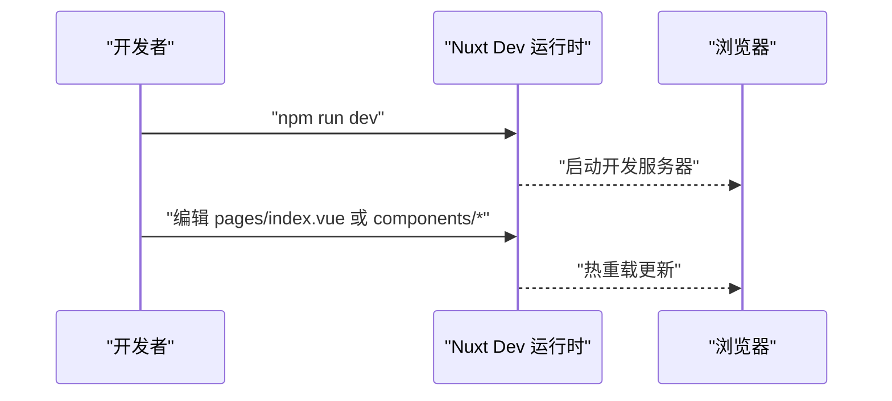
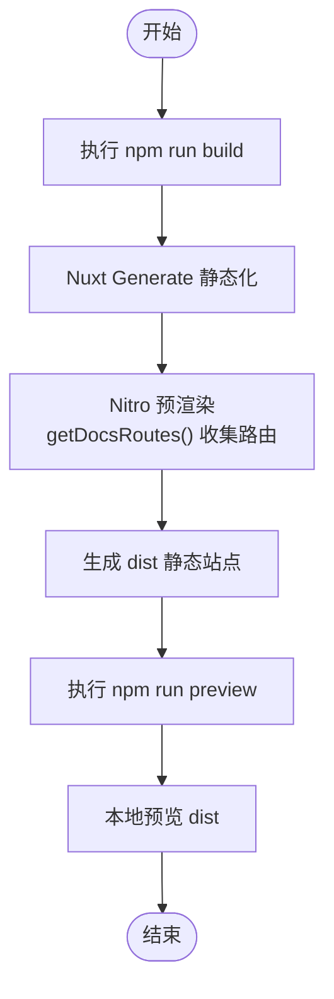
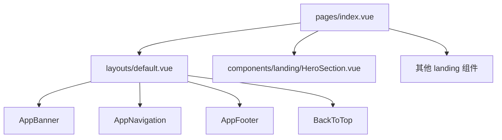
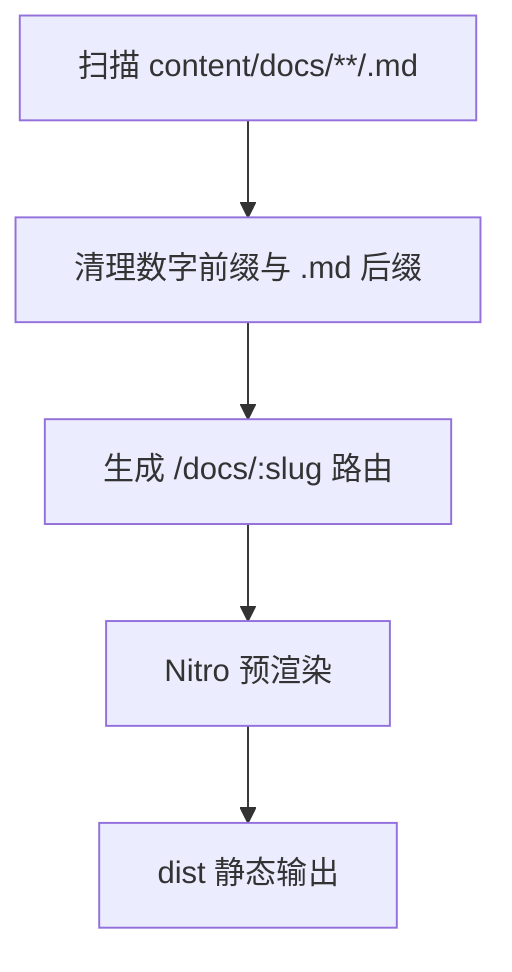
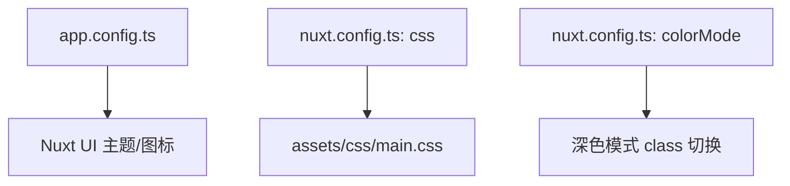
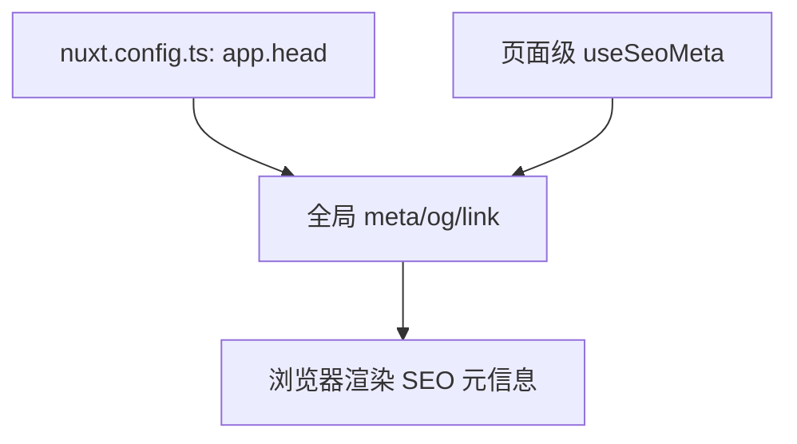
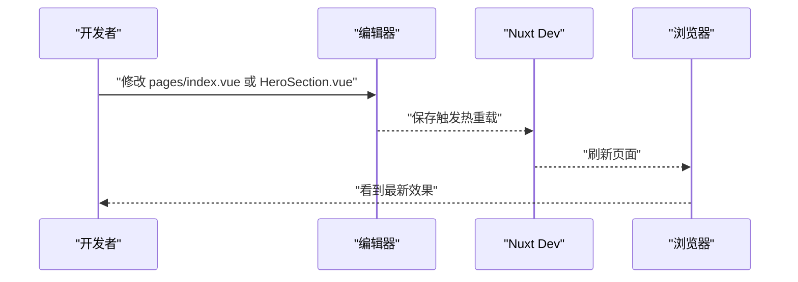
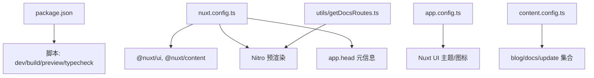

# 快速开始

<cite>
**本文引用的文件**
- [package.json](file://package.json)
- [README.md](file://README.md)
- [nuxt.config.ts](file://nuxt.config.ts)
- [app.config.ts](file://app.config.ts)
- [content.config.ts](file://content.config.ts)
- [utils/getDocsRoutes.ts](file://utils/getDocsRoutes.ts)
- [layouts/default.vue](file://layouts/default.vue)
- [pages/index.vue](file://pages/index.vue)
- [components/landing/HeroSection.vue](file://components/landing/HeroSection.vue)
</cite>

## 目录
1. [简介](#简介)
2. [项目结构](#项目结构)
3. [核心组件](#核心组件)
4. [架构总览](#架构总览)
5. [详细组件分析](#详细组件分析)
6. [依赖关系分析](#依赖关系分析)
7. [性能注意事项](#性能注意事项)
8. [故障排查指南](#故障排查指南)
9. [结论](#结论)
10. [附录](#附录)

## 简介
本指南面向新手开发者，带你从零开始上手本项目。你将学会：
- 如何克隆仓库并安装依赖（npm install）
- 如何通过 npm run dev 启动本地开发服务器，并理解热重载机制
- 如何构建生产版本（npm run build）与预览（npm run preview）
- 项目目录结构的简要解读（pages、components、content 等）
- 修改应用标题与元信息（在 nuxt.config.ts 的 app.head 中）
- 一个简单的自定义修改示例（在首页 index.vue 添加新组件或修改 HeroSection.vue 的标题文本）

## 项目结构
本项目采用 Nuxt 4 + Vue 3 的现代前端模板，围绕“内容驱动”和“组件化”设计，便于快速搭建官网、文档中心与 AI 应用平台。

**章节来源**
- [README.md](file://README.md#L13-L45)

### 目录要点
- pages：路由页面集合，如首页、文档、博客等
- components：自动导入的 Vue 组件，landing 下为落地页组件
- content：Markdown 内容数据源，支持 blog、docs、update 等集合
- layouts：布局模板，默认布局包含导航、主体与页脚
- assets/css：全局样式入口
- utils：工具函数，如 getDocsRoutes 动态生成文档路由
- app.config.ts：Nuxt UI 全局配置（主题色、图标映射）
- nuxt.config.ts：Nuxt 核心配置（模块、Nitro 预渲染、Head 元信息、字体与颜色模式）
- content.config.ts：内容集合与 schema 定义
- package.json：脚本与依赖管理

## 核心组件
- 开发服务器：npm run dev
- 生产构建：npm run build
- 预览生产：npm run preview
- 类型检查：npm run typecheck

这些脚本在 package.json 中定义，分别对应 Nuxt 的 dev、generate、preview 与 typecheck 命令。

**章节来源**
- [package.json](file://package.json#L6-L11)

## 架构总览
下面的架构图展示了开发与构建流程的关键节点，包括 Nuxt 模块、内容系统、预渲染与静态输出。

**图表来源**
- [package.json](file://package.json#L6-L11)
- [nuxt.config.ts](file://nuxt.config.ts#L18-L21)
- [nuxt.config.ts](file://nuxt.config.ts#L41-L51)
- [utils/getDocsRoutes.ts](file://utils/getDocsRoutes.ts#L1-L58)

**章节来源**
- [package.json](file://package.json#L6-L11)
- [nuxt.config.ts](file://nuxt.config.ts#L18-L21)
- [nuxt.config.ts](file://nuxt.config.ts#L41-L51)
- [utils/getDocsRoutes.ts](file://utils/getDocsRoutes.ts#L1-L58)

## 详细组件分析

### 开发环境与热重载
- 启动命令：npm run dev
- 访问地址：http://localhost:3000
- 热重载特性：Nuxt Dev 运行时监听文件变更，自动刷新浏览器，无需手动重启

**章节来源**
- [README.md](file://README.md#L47-L54)

### 构建与预览
- 构建生产：npm run build
- 预览生产：npm run preview
- 输出目录：dist（Nitro 输出配置）

**图表来源**
- [package.json](file://package.json#L6-L11)
- [nuxt.config.ts](file://nuxt.config.ts#L41-L51)
- [utils/getDocsRoutes.ts](file://utils/getDocsRoutes.ts#L1-L58)

**章节来源**
- [package.json](file://package.json#L6-L11)
- [nuxt.config.ts](file://nuxt.config.ts#L41-L51)

### 页面与布局
- 默认布局 default.vue 包含 AppBanner、AppNavigation、AppFooter、BackToTop
- 首页 pages/index.vue 组合了 landing 下的一系列组件（Hero、Feature、ValueProps、Scenario、Product、CallToAction、AIArsenal）

**图表来源**
- [pages/index.vue](file://pages/index.vue#L1-L28)
- [layouts/default.vue](file://layouts/default.vue#L1-L25)
- [components/landing/HeroSection.vue](file://components/landing/HeroSection.vue#L1-L392)

**章节来源**
- [pages/index.vue](file://pages/index.vue#L1-L28)
- [layouts/default.vue](file://layouts/default.vue#L1-L25)

### 内容系统与集合
- 内容集合：blog、docs、update
- Schema 校验：使用 Zod 对字段进行类型约束
- 动态路由：通过 utils/getDocsRoutes.ts 遍历 content/docs 生成预渲染路由

**图表来源**
- [content.config.ts](file://content.config.ts#L1-L57)
- [utils/getDocsRoutes.ts](file://utils/getDocsRoutes.ts#L1-L58)
- [nuxt.config.ts](file://nuxt.config.ts#L41-L51)

**章节来源**
- [content.config.ts](file://content.config.ts#L1-L57)
- [utils/getDocsRoutes.ts](file://utils/getDocsRoutes.ts#L1-L58)
- [nuxt.config.ts](file://nuxt.config.ts#L41-L51)

### UI 与样式
- Nuxt UI 全局配置：app.config.ts 中定义主色与图标映射
- 全局样式：nuxt.config.ts 引入 ~/assets/css/main.css
- 深色模式：colorMode 配置移除类名后缀，配合 CSS 变量

**图表来源**
- [app.config.ts](file://app.config.ts#L1-L83)
- [nuxt.config.ts](file://nuxt.config.ts#L59-L90)
- [nuxt.config.ts](file://nuxt.config.ts#L54-L56)

**章节来源**
- [app.config.ts](file://app.config.ts#L1-L83)
- [nuxt.config.ts](file://nuxt.config.ts#L59-L90)
- [nuxt.config.ts](file://nuxt.config.ts#L54-L56)

### 修改应用标题与元信息（app.head）
- 修改位置：nuxt.config.ts 的 app.head
- 可配置项：title、meta（charset、viewport、description、keywords）、link（favicon、apple-touch-icon、字体预连接与加载）、Open Graph 属性
- 建议：同时在页面级 useSeoMeta 设置标题与描述，确保 SSR/预渲染一致

**图表来源**
- [nuxt.config.ts](file://nuxt.config.ts#L59-L90)

**章节来源**
- [nuxt.config.ts](file://nuxt.config.ts#L59-L90)
- [pages/index.vue](file://pages/index.vue#L19-L27)

### 自定义修改示例：在首页添加新组件或修改 HeroSection 标题
- 在首页添加新组件：在 pages/index.vue 中引入并插入新的 landing 组件
- 修改 HeroSection 标题文本：在 components/landing/HeroSection.vue 的模板中调整标题内容
- 保存后，开发服务器会热重载，浏览器即时反映更改

**图表来源**
- [pages/index.vue](file://pages/index.vue#L1-L28)
- [components/landing/HeroSection.vue](file://components/landing/HeroSection.vue#L1-L392)

**章节来源**
- [pages/index.vue](file://pages/index.vue#L1-L28)
- [components/landing/HeroSection.vue](file://components/landing/HeroSection.vue#L1-L392)

## 依赖关系分析
- 脚本与命令：package.json 中定义 dev/build/preview/typecheck
- Nuxt 模块：@nuxt/ui、@nuxt/content
- Nitro 预渲染：preset=static，output.publicDir=dist，prerender.routes=getDocsRoutes()
- 内容系统：@nuxt/content 集合与 schema
- UI 主题：Nuxt UI 全局配置 app.config.ts

**图表来源**
- [package.json](file://package.json#L6-L11)
- [nuxt.config.ts](file://nuxt.config.ts#L18-L21)
- [nuxt.config.ts](file://nuxt.config.ts#L41-L51)
- [nuxt.config.ts](file://nuxt.config.ts#L59-L90)
- [app.config.ts](file://app.config.ts#L1-L83)
- [content.config.ts](file://content.config.ts#L1-L57)
- [utils/getDocsRoutes.ts](file://utils/getDocsRoutes.ts#L1-L58)

**章节来源**
- [package.json](file://package.json#L6-L11)
- [nuxt.config.ts](file://nuxt.config.ts#L18-L21)
- [nuxt.config.ts](file://nuxt.config.ts#L41-L51)
- [nuxt.config.ts](file://nuxt.config.ts#L59-L90)
- [app.config.ts](file://app.config.ts#L1-L83)
- [content.config.ts](file://content.config.ts#L1-L57)
- [utils/getDocsRoutes.ts](file://utils/getDocsRoutes.ts#L1-L58)

## 性能注意事项
- 预渲染与静态输出：Nitro preset=static，减少运行时开销
- 动态路由收集：通过 getDocsRoutes 自动遍历 content/docs，避免遗漏页面
- 类型检查：Nuxt 内联禁用类型检查以提升开发速度，建议通过 npm run typecheck 单独执行

**章节来源**
- [nuxt.config.ts](file://nuxt.config.ts#L41-L51)
- [nuxt.config.ts](file://nuxt.config.ts#L12-L15)
- [package.json](file://package.json#L6-L11)

## 故障排查指南
- 端口占用：开发服务器默认端口 3000 被占用时，请更换端口或释放端口
- 依赖缺失：执行 npm install 后仍报错，检查 Node.js 版本是否满足要求（README 中要求 Node.js ≥ 18）
- 预渲染失败：Nitro prerender.failOnError=false，遇到错误不会中断构建，可在控制台查看具体路由错误
- 内容未生效：确认 content/docs 下的 Markdown 文件命名与目录结构符合 getDocsRoutes 的清理规则（去除数字前缀与 .md 后缀）

**章节来源**
- [README.md](file://README.md#L47-L54)
- [nuxt.config.ts](file://nuxt.config.ts#L41-L51)
- [utils/getDocsRoutes.ts](file://utils/getDocsRoutes.ts#L1-L58)

## 结论
通过本指南，你已经掌握了：
- 项目克隆与依赖安装
- 开发服务器启动与热重载
- 生产构建与预览流程
- 目录结构与核心职责
- 修改应用标题与元信息的方法
- 在首页添加新组件或修改 HeroSection 标题的实践

建议在完成基础修改后，进一步阅读 README 的内容系统、UI 与样式、页面与布局等章节，以深入理解项目架构与最佳实践。

## 附录
- 快速命令清单
  - 安装依赖：npm install
  - 启动开发：npm run dev
  - 构建生产：npm run build
  - 预览生产：npm run preview
  - 类型检查：npm run typecheck

**章节来源**
- [README.md](file://README.md#L47-L54)
- [package.json](file://package.json#L6-L11)