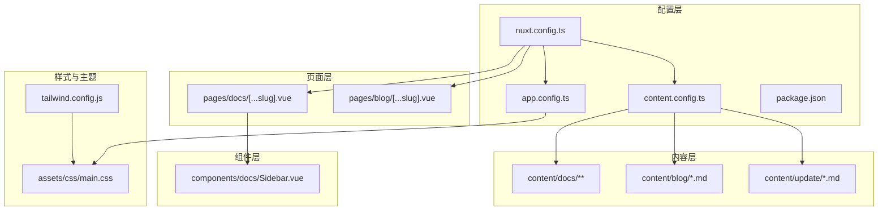
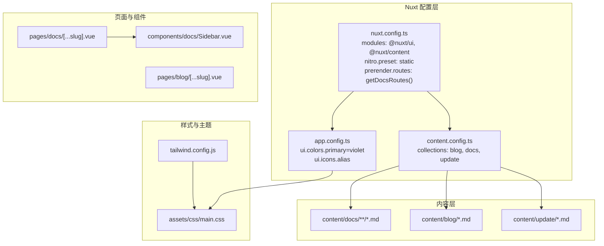
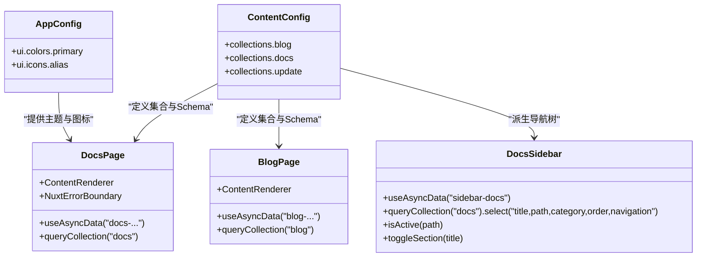
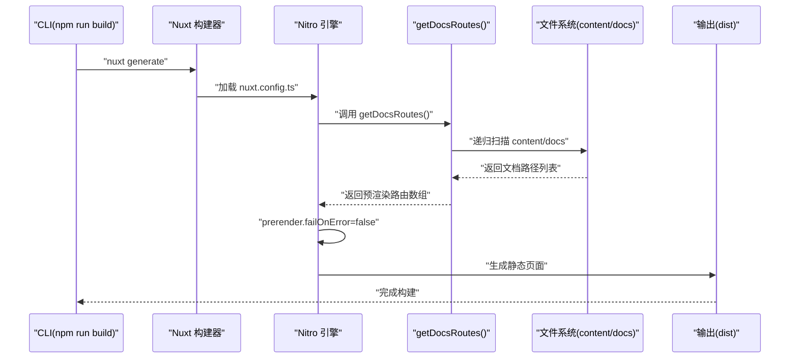
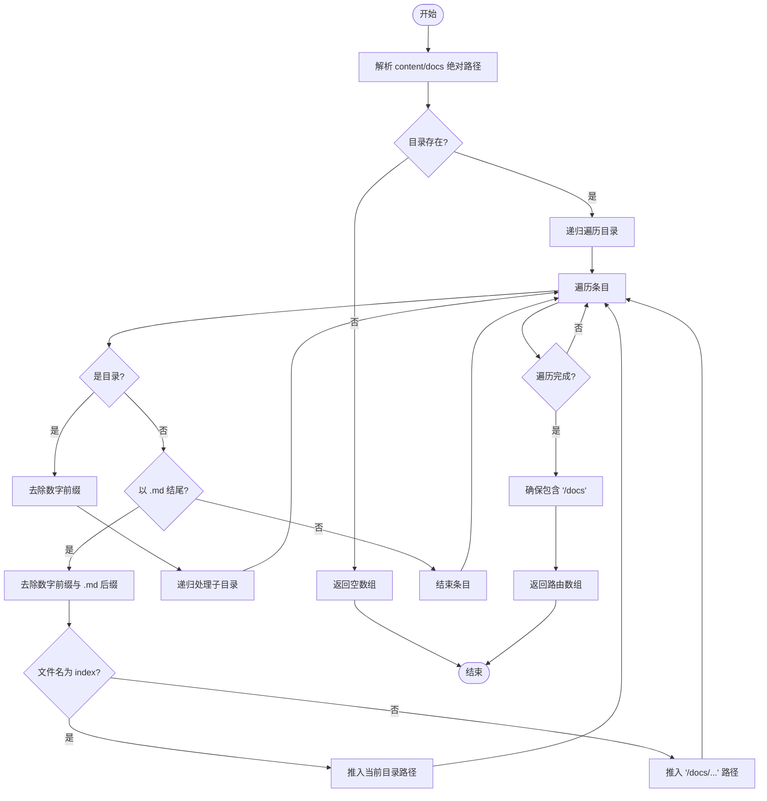
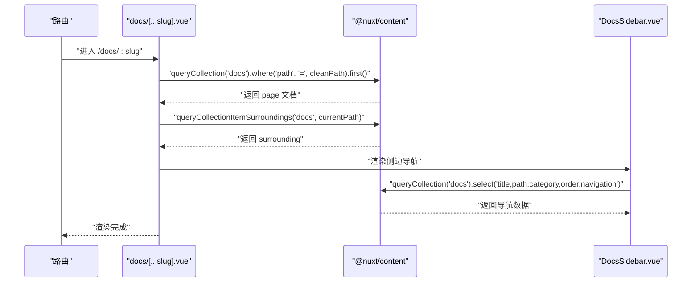
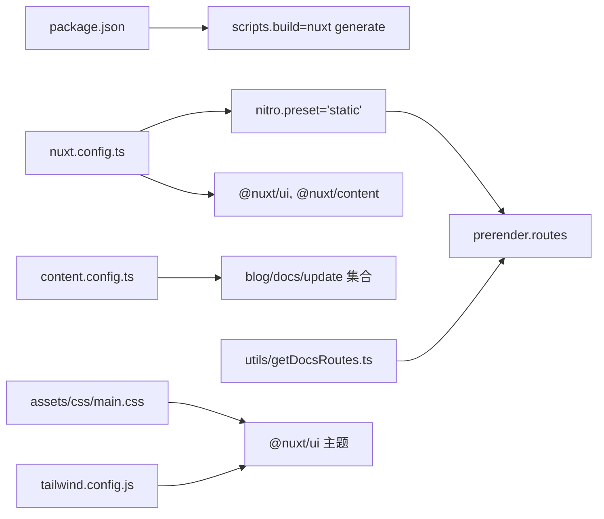

# Nuxt 4 框架架构

<cite>
**本文引用的文件**
- [nuxt.config.ts](file://nuxt.config.ts)
- [app.config.ts](file://app.config.ts)
- [content.config.ts](file://content.config.ts)
- [getDocsRoutes.ts](file://utils/getDocsRoutes.ts)
- [package.json](file://package.json)
- [README.md](file://README.md)
- [tailwind.config.js](file://tailwind.config.js)
- [main.css](file://assets/css/main.css)
- [docs/[...slug].vue](file://pages/docs/[...slug].vue)
- [blog/[...slug].vue](file://pages/blog/[...slug].vue)
- [components/docs/Sidebar.vue](file://components/docs/Sidebar.vue)
- [content/docs/introduction/1.configuration.md](file://content/docs/introduction/1.configuration.md)
- [content/docs/framework/sources.md](file://content/docs/framework/sources.md)
</cite>

## 目录
1. [引言](#引言)
2. [项目结构](#项目结构)
3. [核心组件](#核心组件)
4. [架构总览](#架构总览)
5. [详细组件分析](#详细组件分析)
6. [依赖关系分析](#依赖关系分析)
7. [性能考量](#性能考量)
8. [故障排查指南](#故障排查指南)
9. [结论](#结论)
10. [附录](#附录)

## 引言
本架构文档围绕 BuidAI 项目中的 Nuxt 4 框架展开，系统梳理其作为全栈 SSR/SSG 框架的核心能力与工程化实践。重点包括：
- 服务端渲染（SSR）与静态站点生成（SSG）的配置与差异
- 模块化扩展机制：@nuxt/ui 与 @nuxt/content 的集成与开发效率提升
- Nitro 引擎在 nitro.preset: 'static' 下的静态部署流程与预渲染（prerender.routes）机制
- 动态路由注入：getDocsRoutes() 如何扫描 content/docs 并注入预渲染路由
- 开发体验优化：devtools、typescript.typeCheck 的作用与最佳实践
- 全局 UI 主题与图标映射：通过 app.config.ts 配置 @nuxt/ui 的品牌色与图标别名
- 常见配置错误与调试策略：如预渲染失败时的 failOnError: false 策略

## 项目结构
BuidAI 采用 Nuxt 4 的典型目录组织，配合 @nuxt/content 的内容驱动与 @nuxt/ui 的组件体系，形成“内容即页面”的文档与博客中心。

**图表来源**
- [nuxt.config.ts](file://nuxt.config.ts#L1-L91)
- [app.config.ts](file://app.config.ts#L1-L83)
- [content.config.ts](file://content.config.ts#L1-L57)
- [package.json](file://package.json#L1-L48)
- [tailwind.config.js](file://tailwind.config.js#L1-L86)
- [main.css](file://assets/css/main.css#L1-L145)
- [pages/docs/[...slug].vue](file://pages/docs/[...slug].vue#L1-L348)
- [pages/blog/[...slug].vue](file://pages/blog/[...slug].vue#L1-L366)
- [components/docs/Sidebar.vue](file://components/docs/Sidebar.vue#L1-L294)

**章节来源**
- [README.md](file://README.md#L1-L117)
- [nuxt.config.ts](file://nuxt.config.ts#L1-L91)
- [content.config.ts](file://content.config.ts#L1-L57)

## 核心组件
- Nuxt 配置与模块
  - @nuxt/ui：提供基于 Tailwind 的 UI 组件库与主题系统
  - @nuxt/content：Markdown 内容驱动，支持集合、Schema 校验与渲染
  - Nitro 预设：preset: 'static' 强制静态输出，便于 Vercel 等平台部署
  - 颜色模式：colorMode.classSuffix: '' 使用简洁类名
  - 全局 Head：集中配置 SEO 元信息
  - 全局 CSS：注入 assets/css/main.css
- 内容配置
  - content.config.ts 定义 blog、docs、update 三个集合，含 Schema 校验
- 动态路由注入
  - utils/getDocsRoutes.ts 递归扫描 content/docs，生成预渲染路由列表
- 页面与组件
  - pages/docs/[...slug].vue：文档页面，支持面包屑、目录、前后文导航与错误边界
  - pages/blog/[...slug].vue：博客页面，支持滚动进度、TOC、前后文导航与 SEO
  - components/docs/Sidebar.vue：文档侧边栏，递归渲染分组与链接，支持折叠与激活态
- 全局 UI 主题与图标
  - app.config.ts：设置 primary 颜色为 violet，并映射大量图标别名
  - tailwind.config.js：扩展 primary/accent/secondary 色板与动画
  - assets/css/main.css：覆盖 --ui-primary 变量，深色模式适配

**章节来源**
- [nuxt.config.ts](file://nuxt.config.ts#L1-L91)
- [app.config.ts](file://app.config.ts#L1-L83)
- [content.config.ts](file://content.config.ts#L1-L57)
- [getDocsRoutes.ts](file://utils/getDocsRoutes.ts#L1-L58)
- [pages/docs/[...slug].vue](file://pages/docs/[...slug].vue#L1-L348)
- [pages/blog/[...slug].vue](file://pages/blog/[...slug].vue#L1-L366)
- [components/docs/Sidebar.vue](file://components/docs/Sidebar.vue#L1-L294)
- [tailwind.config.js](file://tailwind.config.js#L1-L86)
- [main.css](file://assets/css/main.css#L1-L145)

## 架构总览
下图展示了 Nuxt 4 在本项目中的整体架构：配置层决定模块与引擎行为，内容层提供 Markdown 数据，页面层负责渲染与交互，组件层承载导航与 UI，样式层统一主题与视觉。

**图表来源**
- [nuxt.config.ts](file://nuxt.config.ts#L1-L91)
- [app.config.ts](file://app.config.ts#L1-L83)
- [content.config.ts](file://content.config.ts#L1-L57)
- [pages/docs/[...slug].vue](file://pages/docs/[...slug].vue#L1-L348)
- [pages/blog/[...slug].vue](file://pages/blog/[...slug].vue#L1-L366)
- [components/docs/Sidebar.vue](file://components/docs/Sidebar.vue#L1-L294)
- [tailwind.config.js](file://tailwind.config.js#L1-L86)
- [main.css](file://assets/css/main.css#L1-L145)

## 详细组件分析

### 模块化扩展：@nuxt/ui 与 @nuxt/content
- @nuxt/ui
  - 通过 app.config.ts 的 ui.colors.primary 与 ui.icons.alias，统一品牌色与图标风格
  - 结合 Tailwind 与 CSS 变量，实现全局主题一致性
- @nuxt/content
  - content.config.ts 定义集合与 Schema，确保数据结构一致与类型安全
  - pages/docs/[...slug].vue 与 pages/blog/[...slug].vue 使用 queryCollection 与 ContentRenderer 渲染 Markdown
  - components/docs/Sidebar.vue 从集合派生导航树，支持分组、排序与折叠

**图表来源**
- [app.config.ts](file://app.config.ts#L1-L83)
- [content.config.ts](file://content.config.ts#L1-L57)
- [pages/docs/[...slug].vue](file://pages/docs/[...slug].vue#L1-L348)
- [pages/blog/[...slug].vue](file://pages/blog/[...slug].vue#L1-L366)
- [components/docs/Sidebar.vue](file://components/docs/Sidebar.vue#L1-L294)

**章节来源**
- [app.config.ts](file://app.config.ts#L1-L83)
- [content.config.ts](file://content.config.ts#L1-L57)
- [pages/docs/[...slug].vue](file://pages/docs/[...slug].vue#L1-L348)
- [pages/blog/[...slug].vue](file://pages/blog/[...slug].vue#L1-L366)
- [components/docs/Sidebar.vue](file://components/docs/Sidebar.vue#L1-L294)

### Nitro 引擎与静态部署流程（SSG）
- 预设与输出
  - nitro.preset: 'static' 强制静态输出，避免平台自动检测导致的差异
  - output.publicDir: 'dist' 适配 Vercel 默认目录
- 预渲染
  - prerender.failOnError: false 遇到错误不中断构建，保证可用页面尽可能生成
  - prerender.routes: getDocsRoutes() 动态注入文档路由，确保所有 Markdown 页面被静态生成
- 构建命令
  - package.json 中 scripts.build 使用 nuxt generate，触发 SSG 流程

**图表来源**
- [nuxt.config.ts](file://nuxt.config.ts#L1-L91)
- [getDocsRoutes.ts](file://utils/getDocsRoutes.ts#L1-L58)
- [package.json](file://package.json#L1-L48)

**章节来源**
- [nuxt.config.ts](file://nuxt.config.ts#L1-L91)
- [getDocsRoutes.ts](file://utils/getDocsRoutes.ts#L1-L58)
- [package.json](file://package.json#L1-L48)

### 动态路由注入：getDocsRoutes() 的实现
- 功能目标
  - 递归遍历 content/docs，去除数字前缀与 .md 后缀，生成 /docs 下的路由路径
  - 确保 index.md 对应 /docs 根路径，其他文件对应 /docs/xxx
- 关键点
  - 使用 node:fs 与 node:path
  - 清洗规则：去除形如 "1.introduction" 的数字前缀，保留 cleanName
  - 路由拼接：以 "/docs" 为前缀，递归生成完整路径
  - 最终补充 "/docs"，保证索引页被预渲染

**图表来源**
- [getDocsRoutes.ts](file://utils/getDocsRoutes.ts#L1-L58)

**章节来源**
- [getDocsRoutes.ts](file://utils/getDocsRoutes.ts#L1-L58)

### 开发体验优化：devtools 与 typescript.typeCheck
- devtools.enabled: true
  - 启用 Nuxt DevTools，提升开发调试效率
- typescript.typeCheck: false
  - 构建时禁用类型检查以加速构建，推荐通过独立脚本 npm run typecheck 执行类型检查
- package.json
  - scripts.typecheck: "nuxt typecheck" 用于单独运行类型检查

**章节来源**
- [nuxt.config.ts](file://nuxt.config.ts#L1-L91)
- [package.json](file://package.json#L1-L48)

### 全局 UI 主题定制与图标映射（app.config.ts）
- 主题色
  - ui.colors.primary: 'violet'，@nuxt/ui 自动生成色阶并应用于组件
- 图标映射
  - 通过 ui.icons.alias 将逻辑图标名称映射到 Phosphor Icons 风格的 CSS 类名
  - 涵盖箭头、状态反馈、交互操作、界面元素等类别
- 样式覆盖
  - assets/css/main.css 覆盖 --ui-primary 变量，深色模式下使用白色
  - tailwind.config.js 扩展 primary/accent/secondary 色板与动画，确保主题一致性

**章节来源**
- [app.config.ts](file://app.config.ts#L1-L83)
- [main.css](file://assets/css/main.css#L1-L145)
- [tailwind.config.js](file://tailwind.config.js#L1-L86)

### 页面渲染与内容驱动（pages/docs/[...slug].vue 与 pages/blog/[...slug].vue）
- 文档页面
  - 使用 NuxtErrorBoundary 处理渲染错误
  - useAsyncData 并行获取 page 与 surrounding 文档，支持回退清洗路径匹配
  - ContentRenderer 渲染 Markdown，useSeoMeta 设置 SEO 元信息
  - 侧边栏 DocsSidebar 递归渲染导航树，支持分组折叠与激活态
- 博客页面
  - useAsyncData 获取 post 与 surrounding（基于时间排序）
  - 滚动进度条、TOC、复制链接、前后文导航与 SEO 元信息

**图表来源**
- [pages/docs/[...slug].vue](file://pages/docs/[...slug].vue#L1-L348)
- [components/docs/Sidebar.vue](file://components/docs/Sidebar.vue#L1-L294)

**章节来源**
- [pages/docs/[...slug].vue](file://pages/docs/[...slug].vue#L1-L348)
- [pages/blog/[...slug].vue](file://pages/blog/[...slug].vue#L1-L366)
- [components/docs/Sidebar.vue](file://components/docs/Sidebar.vue#L1-L294)

## 依赖关系分析
- 模块依赖
  - @nuxt/ui 与 @nuxt/content 通过 nuxt.config.ts modules 注册
  - @nuxt/content 的集合与 Schema 通过 content.config.ts 定义
  - Tailwind 与 @nuxt/ui 通过 assets/css/main.css 与 tailwind.config.js 协同
- 构建与部署
  - package.json scripts.build 使用 nuxt generate 触发 SSG
  - nuxt.config.ts nitro.preset: 'static' 与 output.publicDir: 'dist' 适配静态部署
- 内容与路由
  - getDocsRoutes() 依赖 node:fs 与 node:path，扫描 content/docs 生成预渲染路由

**图表来源**
- [package.json](file://package.json#L1-L48)
- [nuxt.config.ts](file://nuxt.config.ts#L1-L91)
- [content.config.ts](file://content.config.ts#L1-L57)
- [getDocsRoutes.ts](file://utils/getDocsRoutes.ts#L1-L58)
- [main.css](file://assets/css/main.css#L1-L145)
- [tailwind.config.js](file://tailwind.config.js#L1-L86)

**章节来源**
- [package.json](file://package.json#L1-L48)
- [nuxt.config.ts](file://nuxt.config.ts#L1-L91)
- [content.config.ts](file://content.config.ts#L1-L57)
- [getDocsRoutes.ts](file://utils/getDocsRoutes.ts#L1-L58)
- [main.css](file://assets/css/main.css#L1-L145)
- [tailwind.config.js](file://tailwind.config.js#L1-L86)

## 性能考量
- 预渲染策略
  - 通过 getDocsRoutes() 精准注入文档路由，减少不必要的预渲染任务
  - prerender.failOnError: false 降低构建失败率，提高可用页面覆盖率
- 构建速度
  - 构建时禁用类型检查，配合独立脚本执行类型检查，缩短开发迭代周期
- 样式与主题
  - Tailwind 与 @nuxt/ui 的主题变量统一，减少重复样式与重绘
  - assets/css/main.css 覆盖关键变量，确保深色模式一致性

[本节为通用性能建议，无需特定文件引用]

## 故障排查指南
- 预渲染失败
  - 现象：构建阶段因个别页面渲染异常而中断
  - 处理：将 prerender.failOnError 设为 false，使构建继续并产出可用页面
  - 建议：定位失败页面的 Markdown 内容或组件逻辑，修复后再开启严格模式
- 文档路由缺失
  - 现象：部署后部分文档页面 404
  - 处理：检查 getDocsRoutes() 是否正确扫描 content/docs，确认 index.md 与 cleanName 规则
- 类型检查与构建冲突
  - 现象：构建过快但缺少类型安全保障
  - 处理：使用 npm run typecheck 单独执行类型检查，确保代码质量
- 图标与主题不生效
  - 现象：图标未显示或品牌色不一致
  - 处理：核对 app.config.ts 的 ui.colors.primary 与 ui.icons.alias 映射，确认 assets/css/main.css 变量覆盖生效

**章节来源**
- [nuxt.config.ts](file://nuxt.config.ts#L1-L91)
- [getDocsRoutes.ts](file://utils/getDocsRoutes.ts#L1-L58)
- [app.config.ts](file://app.config.ts#L1-L83)
- [main.css](file://assets/css/main.css#L1-L145)

## 结论
BuidAI 项目通过 Nuxt 4 的模块化与内容驱动能力，实现了高效的文档与博客中心建设。@nuxt/ui 与 @nuxt/content 的深度集成提升了开发效率与一致性；Nitro 的静态预渲染与动态路由注入保障了可预测的构建结果与部署稳定性。配合 app.config.ts 的主题与图标配置，以及 Tailwind 的主题扩展，项目在视觉与工程层面均达到了较高水准。建议在生产环境中结合类型检查与严格的预渲染策略，确保质量与稳定性。

[本节为总结性内容，无需特定文件引用]

## 附录
- 实践清单
  - 在 nuxt.config.ts 中启用 @nuxt/ui 与 @nuxt/content
  - 在 content.config.ts 中定义集合与 Schema
  - 使用 utils/getDocsRoutes.ts 注入动态路由
  - 在 app.config.ts 中配置 ui.colors.primary 与 ui.icons.alias
  - 在 package.json 中使用 nuxt generate 进行 SSG 构建
  - 使用 npm run typecheck 单独执行类型检查

[本节为通用实践建议，无需特定文件引用]