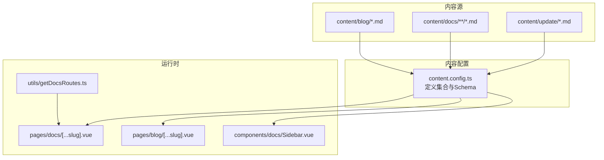
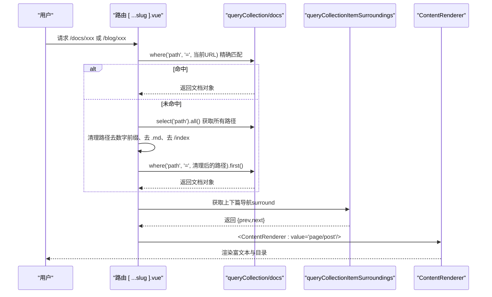
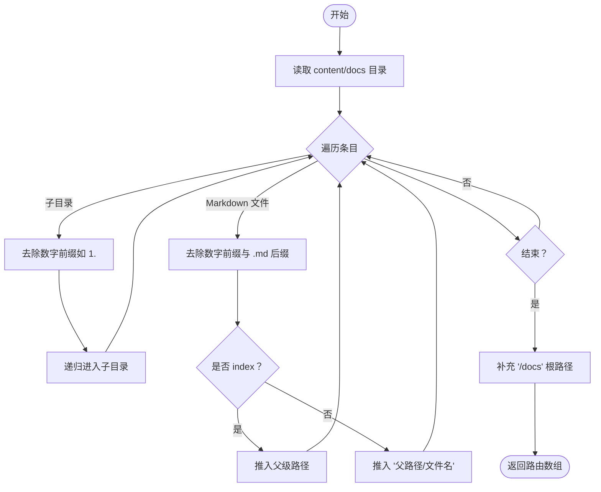
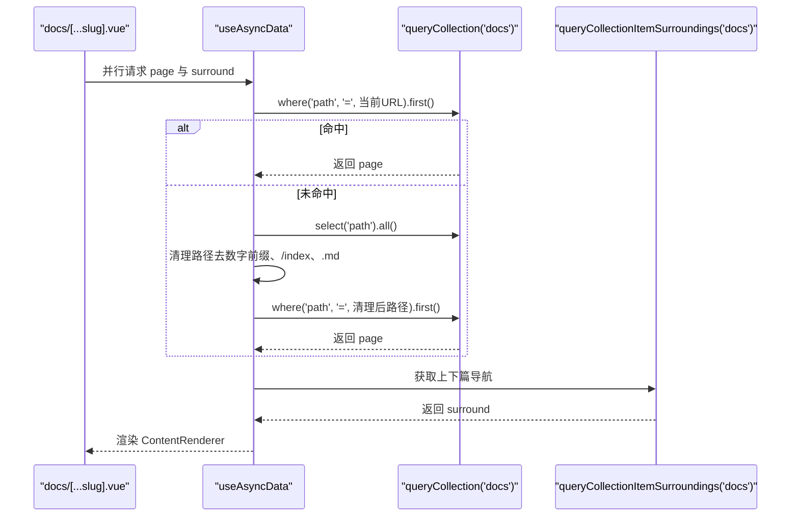
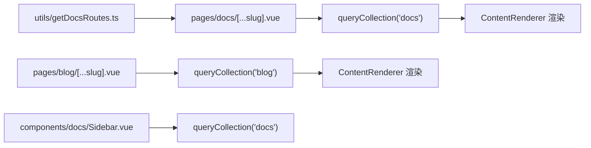

# 内容管理核心机制

<cite>
**本文引用的文件**
- [content.config.ts](file://content.config.ts)
- [getDocsRoutes.ts](file://utils/getDocsRoutes.ts)
- [docs 页面路由 [ ...slug ].vue](file://pages/docs/[...slug].vue)
- [blog 页面路由 [ ...slug ].vue](file://pages/blog/[...slug].vue)
- [Docs 侧边栏 Sidebar.vue](file://components/docs/Sidebar.vue)
- [博客示例 1.md](file://content/blog/1.md)
- [文档示例 introduction/1.start.md](file://content/docs/introduction/1.start.md)
- [更新日志示例 2503.md](file://content/update/2503.md)
- [package.json](file://package.json)
</cite>

## 目录
1. [简介](#简介)
2. [项目结构](#项目结构)
3. [核心组件](#核心组件)
4. [架构总览](#架构总览)
5. [详细组件分析](#详细组件分析)
6. [依赖关系分析](#依赖关系分析)
7. [性能考量](#性能考量)
8. [故障排查指南](#故障排查指南)
9. [结论](#结论)
10. [附录](#附录)

## 简介
本文件围绕 智言万象 项目的内容管理核心机制展开，重点解析 @nuxt/content v3 如何将 Markdown 文件转化为结构化数据 API，并覆盖富文本渲染、元数据提取与全文搜索能力。文档详细说明 content.config.ts 中 blog、docs、update 三个集合的配置细节（数据源路径匹配规则、Zod 验证模式、Front Matter 字段），阐述 getDocsRoutes.ts 如何递归遍历 content/docs 目录并生成静态路由，分析动态页面 [ ...slug ].vue 的数据获取流程（useAsyncData + queryCollection 的精确/降级匹配、surround 上下篇导航），解释内容解析后的数据结构（body.toc 目录生成机制、ContentRenderer 渲染原理）。同时提供 YAML Front Matter 语法规范、常见解析错误排查方法与性能优化建议（合理使用 select 字段）。

## 项目结构
- 内容配置：content.config.ts 定义集合、数据源路径与 Zod Schema。
- 内容源：content/blog、content/docs、content/update 下的 Markdown 文件。
- 动态页面：pages/docs/[...slug].vue、pages/blog/[...slug].vue。
- 侧边导航：components/docs/Sidebar.vue。
- 工具函数：utils/getDocsRoutes.ts 生成 docs 静态路由。
- 依赖：@nuxt/content v3 作为内容引擎。

图表来源
- [content.config.ts](file://content.config.ts#L1-L57)
- [getDocsRoutes.ts](file://utils/getDocsRoutes.ts#L1-L58)
- [docs 页面路由 [ ...slug ].vue](file://pages/docs/[...slug].vue#L170-L220)
- [blog 页面路由 [ ...slug ].vue](file://pages/blog/[...slug].vue#L220-L240)
- [Docs 侧边栏 Sidebar.vue](file://components/docs/Sidebar.vue#L160-L177)

章节来源
- [content.config.ts](file://content.config.ts#L1-L57)
- [package.json](file://package.json#L36-L46)

## 核心组件
- 内容集合配置：通过 defineCollection + Zod schema 定义字段类型与校验规则，限定每类内容的元数据结构。
- 动态页面数据获取：在 [ ...slug ].vue 中使用 useAsyncData + queryCollection 进行精确匹配，若失败则进行“清理路径”降级匹配；同时使用 queryCollectionItemSurroundings 获取上下篇导航。
- 侧边导航：DocsSidebar 组件在根层级自动拉取 docs 集合，按 category 分组并支持折叠/展开与高亮。
- 文档路由生成：getDocsRoutes.ts 递归遍历 content/docs，去除文件名/目录名中的数字前缀（如 1.introduction），生成 /docs 前缀下的静态路由列表，供 Nitro 预渲染。

章节来源
- [content.config.ts](file://content.config.ts#L1-L57)
- [docs 页面路由 [ ...slug ].vue](file://pages/docs/[...slug].vue#L185-L220)
- [blog 页面路由 [ ...slug ].vue](file://pages/blog/[...slug].vue#L220-L240)
- [Docs 侧边栏 Sidebar.vue](file://components/docs/Sidebar.vue#L160-L239)
- [getDocsRoutes.ts](file://utils/getDocsRoutes.ts#L1-L58)

## 架构总览
Nuxt Content v3 将 Markdown 文件解析为结构化内容对象，包含：
- 元数据（Front Matter）：由 Zod Schema 校验并映射到字段。
- 正文（body）：Markdown 解析后的 AST/HTML 结构，配合 ContentRenderer 渲染。
- 目录（body.toc）：自动生成的标题层级目录，支持移动端/桌面端侧边 TOC。
- 路径（path）：内容在站点中的唯一路径，用于精确匹配与导航。

图表来源
- [docs 页面路由 [ ...slug ].vue](file://pages/docs/[...slug].vue#L185-L220)
- [blog 页面路由 [ ...slug ].vue](file://pages/blog/[...slug].vue#L220-L240)

## 详细组件分析

### 内容集合配置（content.config.ts）
- blog 集合
  - 类型：page
  - 数据源：blog/*.md
  - Zod Schema 字段：
    - tags: 字符串数组
    - category: 字符串
    - date: 日期（Zod.date）
    - image: 字符串（可选）
- docs 集合
  - 类型：page
  - 数据源：docs/**/*.md（递归）
  - Zod Schema 字段：
    - title: 字符串
    - description: 字符串
    - category: 字符串（可选）
    - order: 数字（可选，用于排序）
    - links: 对象数组（可选），包含 label、icon、to、target
- update 集合
  - 类型：page
  - 数据源：update/*.md
  - Zod Schema 字段：
    - title: 字符串
    - description: 字符串
    - date: 字符串（注意：与 blog 的 date 类型不同）
    - image: 字符串（可选）
    - to: 字符串（可选）
    - target: 字符串（可选）
    - isMajor: 布尔（可选）
    - authors: 对象数组（可选），包含 name、avatar（含 src、alt）

章节来源
- [content.config.ts](file://content.config.ts#L1-L57)

### 文档路由生成（utils/getDocsRoutes.ts）
- 功能：递归扫描 content/docs，去除目录/文件名中的数字前缀（如 1.introduction -> introduction），生成 /docs 前缀的静态路由列表。
- 关键点：
  - 目录名前缀数字（1.）会被去除，index 文件名也会被映射为父级路径。
  - 返回数组包含每个文档页面的路径，确保 Nitro 预渲染可覆盖所有文档页面。

图表来源
- [getDocsRoutes.ts](file://utils/getDocsRoutes.ts#L1-L58)

章节来源
- [getDocsRoutes.ts](file://utils/getDocsRoutes.ts#L1-L58)

### 动态页面数据获取（pages/docs/[...slug].vue）
- 数据获取流程：
  - 使用 useAsyncData 并行请求两部分数据：
    - page：通过 queryCollection('docs') 精确匹配当前路径（where('path', '=', 当前URL)），若未命中则回退到“清理路径”匹配策略（去除数字前缀、/index、.md）。
    - surround：通过 queryCollectionItemSurroundings('docs', 当前路径, { fields: ['title','path'] }) 获取上下篇导航。
  - 若 page 为空，设置 404 状态。
- 目录与滚动：
  - 使用 body.toc 生成桌面/移动端 TOC，结合 IntersectionObserver 与滚动事件维护 activeId，支持平滑跳转与 URL hash 更新。
- 渲染：
  - 使用 ContentRenderer 渲染正文，自动解析 Markdown AST 并输出 HTML。

图表来源
- [docs 页面路由 [ ...slug ].vue](file://pages/docs/[...slug].vue#L185-L220)

章节来源
- [docs 页面路由 [ ...slug ].vue](file://pages/docs/[...slug].vue#L170-L220)

### 动态页面数据获取（pages/blog/[...slug].vue）
- 数据获取流程：
  - 使用 useAsyncData 获取 post：通过 queryCollection('blog').path(当前路径).first() 精确匹配。
  - 使用 useAsyncData 获取 surround：先按 date 降序获取所有文章的 title、path、date，再根据当前路径定位索引，返回 newer/older。
- 目录与滚动：
  - 使用 body.toc 生成右侧 TOC，支持滚动监听与 activeId 更新。
- 渲染：
  - 使用 ContentRenderer 渲染正文，同时展示封面图、标签、分类、阅读时长等元信息。

章节来源
- [blog 页面路由 [ ...slug ].vue](file://pages/blog/[...slug].vue#L220-L240)

### 侧边导航（components/docs/Sidebar.vue）
- 自动拉取 docs 集合，select 必要字段（title、path、category、order、navigation），按 order 升序排序。
- 将文档按 category 分组，支持分组折叠/展开，并根据当前激活路由自动展开对应分组。
- 递归渲染多级导航结构，支持无障碍属性与高亮当前页。

章节来源
- [Docs 侧边栏 Sidebar.vue](file://components/docs/Sidebar.vue#L160-L239)

### 内容解析与渲染（ContentRenderer）
- ContentRenderer 接收 page/post 对象，渲染正文（body）为 HTML，并生成目录（body.toc）。
- 文档页面中通过 <ContentRenderer :value="page"/> 渲染 Markdown 内容，同时利用 toc 生成侧边/移动端目录。

章节来源
- [docs 页面路由 [ ...slug ].vue](file://pages/docs/[...slug].vue#L70-L76)
- [blog 页面路由 [ ...slug ].vue](file://pages/blog/[...slug].vue#L66-L70)

## 依赖关系分析
- @nuxt/content v3 提供内容引擎与 API（queryCollection、queryCollectionItemSurroundings、ContentRenderer 等）。
- pages/docs/[...slug].vue 与 pages/blog/[...slug].vue 依赖上述 API 进行数据获取与渲染。
- components/docs/Sidebar.vue 依赖 queryCollection 生成导航树。
- utils/getDocsRoutes.ts 为 Nitro 预渲染提供静态路由清单。

图表来源
- [docs 页面路由 [ ...slug ].vue](file://pages/docs/[...slug].vue#L185-L220)
- [blog 页面路由 [ ...slug ].vue](file://pages/blog/[...slug].vue#L220-L240)
- [Docs 侧边栏 Sidebar.vue](file://components/docs/Sidebar.vue#L160-L177)
- [getDocsRoutes.ts](file://utils/getDocsRoutes.ts#L1-L58)

章节来源
- [package.json](file://package.json#L36-L46)
- [docs 页面路由 [ ...slug ].vue](file://pages/docs/[...slug].vue#L185-L220)
- [blog 页面路由 [ ...slug ].vue](file://pages/blog/[...slug].vue#L220-L240)
- [Docs 侧边栏 Sidebar.vue](file://components/docs/Sidebar.vue#L160-L177)
- [getDocsRoutes.ts](file://utils/getDocsRoutes.ts#L1-L58)

## 性能考量
- 合理使用 select 字段：仅选择需要的字段（如 title、path、category、order、navigation），避免一次性加载整条记录的冗余数据，降低网络与内存占用。
- 并行数据获取：在 docs/[...slug].vue 中对 page 与 surround 使用 Promise.all 并行请求，缩短首屏等待时间。
- 降级匹配策略：当文件系统命名包含数字前缀（1.introduce）而 URL 为 clean 名称（introduce）时，先精确匹配，失败后再进行“清理路径”的回退匹配，避免全量扫描带来的性能损耗。
- TOC 与滚动监听：仅在存在 body.toc 时渲染 TOC，IntersectionObserver 的 rootMargin 参数有助于减少不必要的滚动计算。
- 预渲染优化：通过 getDocsRoutes.ts 生成静态路由，使 Nitro 可对 docs 页面进行预渲染，提升首屏性能与 SEO。

章节来源
- [docs 页面路由 [ ...slug ].vue](file://pages/docs/[...slug].vue#L185-L220)
- [Docs 侧边栏 Sidebar.vue](file://components/docs/Sidebar.vue#L160-L177)
- [getDocsRoutes.ts](file://utils/getDocsRoutes.ts#L1-L58)

## 故障排查指南
- Front Matter 类型不匹配
  - blog.date 使用 Zod.date，若提供字符串将导致校验失败。请确保 date 为合法日期类型。
  - update.date 使用字符串类型，若提供日期对象将导致校验失败。请确保 date 为字符串。
- 必填字段缺失
  - docs 集合缺少 title、description 将导致校验失败。请在 Front Matter 中补齐。
  - blog 集合缺少 title、description、category、tags、date 将导致校验失败。
  - update 集合缺少 title、description 将导致校验失败。
- 路由无法命中
  - 若文件系统命名包含数字前缀（如 1.introduction），但 URL 为 clean 名称（introduce），将触发降级匹配。确认 getDocsRoutes.ts 的清理逻辑与实际命名一致。
  - 若 docs/[...slug].vue 仍无法命中，检查 queryCollection('docs').where('path', '=', ...) 的路径是否与 content.config.ts 中的 source 规则一致。
- TOC 为空
  - 确认 Markdown 标题层级是否足够（h2/h3），ContentRenderer 会基于标题生成目录。
- 上下篇导航异常
  - docs：surround 依赖 queryCollectionItemSurroundings('docs', 当前路径, { fields: ['title','path'] })。若字段缺失或路径不一致，可能导致返回 null。
  - blog：surround 依赖按 date 降序排序的列表，确保 date 字段正确且可比较。

章节来源
- [content.config.ts](file://content.config.ts#L1-L57)
- [docs 页面路由 [ ...slug ].vue](file://pages/docs/[...slug].vue#L185-L220)
- [blog 页面路由 [ ...slug ].vue](file://pages/blog/[...slug].vue#L220-L240)
- [getDocsRoutes.ts](file://utils/getDocsRoutes.ts#L1-L58)

## 结论
智言万象 项目通过 @nuxt/content v3 将 Markdown 内容标准化为结构化数据，结合 Zod Schema 实现强类型校验，借助 ContentRenderer 完成富文本渲染与目录生成。动态页面采用精确匹配+降级匹配策略保证路径兼容性，surround API 实现上下篇导航。通过 select 字段优化与并行数据获取，兼顾性能与用户体验。配合 getDocsRoutes.ts 生成静态路由，进一步提升预渲染与 SEO 表现。

## 附录

### YAML Front Matter 语法规范（依据各集合 Schema）
- blog
  - 必填：title、description、category、tags、date
  - 可选：image
- docs
  - 必填：title、description
  - 可选：category、order、links（label、icon、to、target）
- update
  - 必填：title、description
  - 可选：date、image、to、target、isMajor、authors（name、avatar.src、avatar.alt）

章节来源
- [content.config.ts](file://content.config.ts#L1-L57)

### 示例文件参考
- 博客示例：[博客示例 1.md](file://content/blog/1.md#L1-L20)
- 文档示例：[文档示例 introduction/1.start.md](file://content/docs/introduction/1.start.md#L1-L10)
- 更新日志示例：[更新日志示例 2503.md](file://content/update/2503.md#L1-L12)