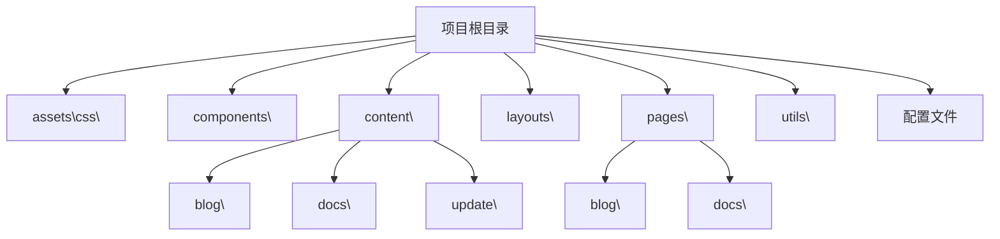
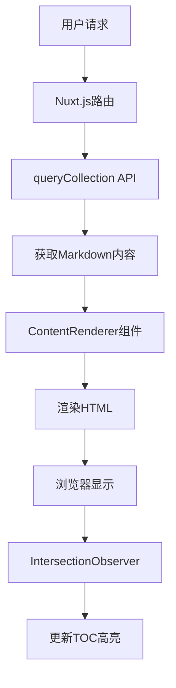
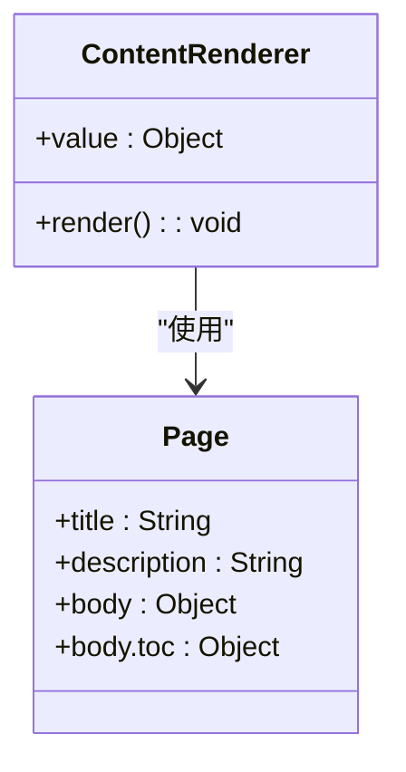
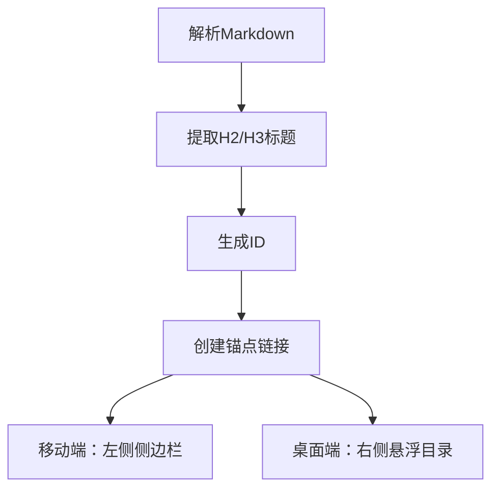
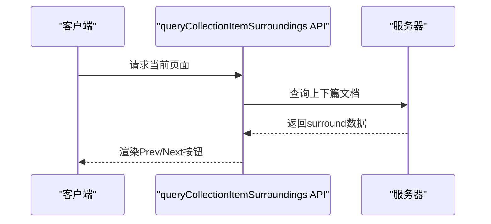
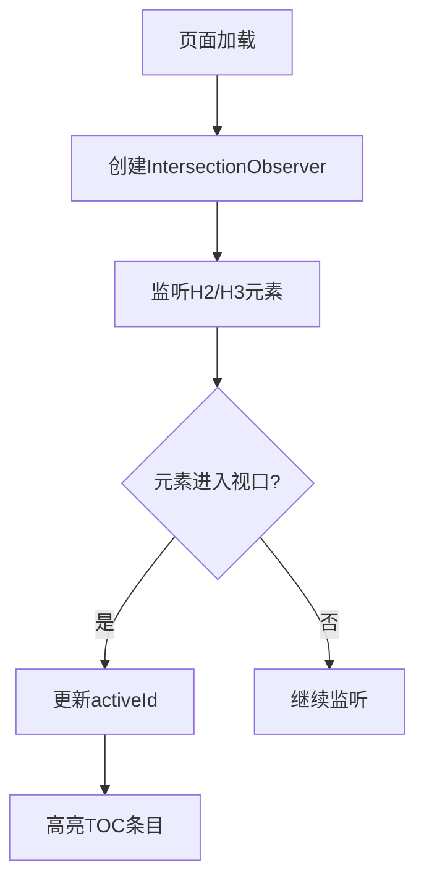
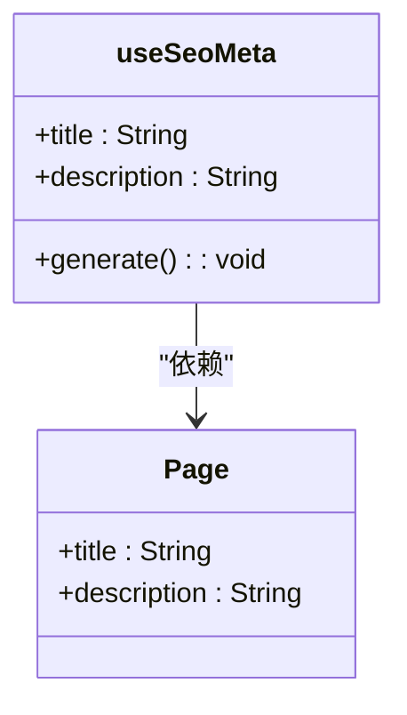

# 内容管理渲染机制

<cite>
**本文档引用文件**  
- [pages\docs\[...slug].vue](file://pages/docs/[...slug].vue)
- [pages\blog\[...slug].vue](file://pages/blog/[...slug].vue)
- [content.config.ts](file://content.config.ts)
- [nuxt.config.ts](file://nuxt.config.ts)
- [utils\getDocsRoutes.ts](file://utils/getDocsRoutes.ts)
- [content\docs\introduction\1.start.md](file://content/docs/introduction/1.start.md)
- [content\blog\1.md](file://content/blog/1.md)
- [content\docs\introduction\10.migration.md](file://content/docs/introduction/10.migration.md)
- [content\docs\framework\define.md](file://content/docs/framework/define.md)
</cite>

## 目录

1. [简介](#简介)
2. [项目结构](#项目结构)
3. [核心组件](#核心组件)
4. [架构概述](#架构概述)
5. [详细组件分析](#详细组件分析)
6. [依赖分析](#依赖分析)
7. [性能考虑](#性能考虑)
8. [故障排除指南](#故障排除指南)
9. [结论](#结论)

## 简介
本文档详细说明了buidai项目中内容管理渲染机制的技术实现。重点分析了`[...slug].vue`页面如何通过`ContentRenderer`组件将Markdown内容转化为交互式HTML页面。文档涵盖了页面数据结构中`page`对象的组成、TOC（目录）的自动生成原理、`surround`数据的获取与导航、标题交叉状态监听以及SEO元标签的动态生成等核心功能。

## 项目结构
buidai项目的结构清晰，主要分为以下几个部分：
- `assets\css\`：存放CSS样式文件
- `components\`：存放Vue组件
- `content\`：存放Markdown内容文件，分为`blog`、`docs`和`update`三个子目录
- `layouts\`：存放布局文件
- `pages\`：存放页面文件，包括`blog`和`docs`两个主要部分
- `utils\`：存放工具函数
- 根目录下包含各种配置文件，如`nuxt.config.ts`、`content.config.ts`等



**Diagram sources**
- [project_structure](file://project_structure)

**Section sources**
- [project_structure](file://project_structure)

## 核心组件
本项目的核心组件包括`ContentRenderer`、`DocsSidebar`等。`ContentRenderer`组件负责将Markdown内容渲染为HTML，而`DocsSidebar`组件则提供了文档的导航功能。

**Section sources**
- [pages\docs\[...slug].vue](file://pages/docs/[...slug].vue)
- [components\docs\Sidebar.vue](file://components/docs/Sidebar.vue)

## 架构概述
buidai项目采用了Nuxt.js框架，结合`@nuxt/content`模块实现内容管理。通过`ContentRenderer`组件将Markdown内容转化为交互式HTML页面，利用`queryCollection` API获取内容数据，使用`IntersectionObserver`监听标题元素的视口交叉状态，动态更新当前活动的TOC条目。



**Diagram sources**
- [pages\docs\[...slug].vue](file://pages/docs/[...slug].vue)
- [nuxt.config.ts](file://nuxt.config.ts)

**Section sources**
- [pages\docs\[...slug].vue](file://pages/docs/[...slug].vue)
- [nuxt.config.ts](file://nuxt.config.ts)

## 详细组件分析

### ContentRenderer组件分析
`ContentRenderer`组件是内容渲染的核心，它接收`page`对象作为输入，将Markdown内容转化为HTML。`page`对象包含从Front Matter提取的元数据（如`title`、`description`）以及从Markdown正文解析生成的`body.toc`结构。



**Diagram sources**
- [pages\docs\[...slug].vue](file://pages/docs/[...slug].vue)

**Section sources**
- [pages\docs\[...slug].vue](file://pages/docs/[...slug].vue)

### TOC生成机制分析
TOC（目录）的自动生成原理是通过解析Markdown文件中的H2/H3标题，为每个标题创建带ID的锚点链接。在移动端和桌面端分别通过左侧固定侧边栏和右侧悬浮目录提供导航。



**Diagram sources**
- [pages\docs\[...slug].vue](file://pages/docs/[...slug].vue)

**Section sources**
- [pages\docs\[...slug].vue](file://pages/docs/[...slug].vue)

### Surround数据获取分析
`surround`数据通过`queryCollectionItemSurroundings` API获取上下篇文档信息，并在页面底部渲染Prev/Next导航按钮，实现线性阅读体验。



**Diagram sources**
- [pages\docs\[...slug].vue](file://pages/docs/[...slug].vue)

**Section sources**
- [pages\docs\[...slug].vue](file://pages/docs/[...slug].vue)

### IntersectionObserver分析
`IntersectionObserver`用于监听标题元素的视口交叉状态，当某个标题进入视口时，动态更新`activeId`以高亮当前TOC条目。



**Diagram sources**
- [pages\docs\[...slug].vue](file://pages/docs/[...slug].vue)

**Section sources**
- [pages\docs\[...slug].vue](file://pages/docs/[...slug].vue)

### SEO元标签生成分析
`useSeoMeta`基于当前页面数据动态生成SEO元标签，提升搜索引擎可见性。



**Diagram sources**
- [pages\docs\[...slug].vue](file://pages/docs/[...slug].vue)

**Section sources**
- [pages\docs\[...slug].vue](file://pages/docs/[...slug].vue)

## 依赖分析
项目依赖主要分为以下几个部分：
- Nuxt.js框架
- @nuxt/content模块
- Tailwind CSS
- Vue 3

```mermaid
graph TD
A[Nuxt.js] --> B[@nuxt/content]
A --> C[Tailwind CSS]
A --> D[Vue 3]
B --> E[Markdown解析]
C --> F[样式管理]
D --> G[组件化]
```

**Diagram sources**
- [nuxt.config.ts](file://nuxt.config.ts)

**Section sources**
- [nuxt.config.ts](file://nuxt.config.ts)

## 性能考虑
- 使用`IntersectionObserver`而非`scroll`事件监听，减少性能开销
- 通过`getDocsRoutes`预生成路由，提高页面加载速度
- 使用`ContentRenderer`组件按需渲染内容，避免一次性加载过多数据

## 故障排除指南
- 如果TOC不显示，请检查Markdown文件中是否有H2/H3标题
- 如果Prev/Next按钮不显示，请确认`surround`数据是否正确获取
- 如果SEO元标签未生效，请检查`useSeoMeta`调用是否正确

**Section sources**
- [pages\docs\[...slug].vue](file://pages/docs/[...slug].vue)

## 结论
buidai项目的内容管理渲染机制设计精良，通过`ContentRenderer`组件实现了Markdown到HTML的高效转换，结合`IntersectionObserver`和`useSeoMeta`等技术，提供了良好的用户体验和SEO优化。该机制可作为类似项目的参考实现。