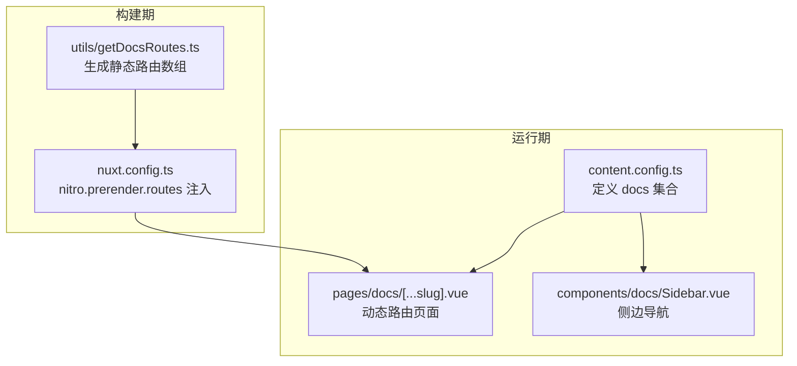
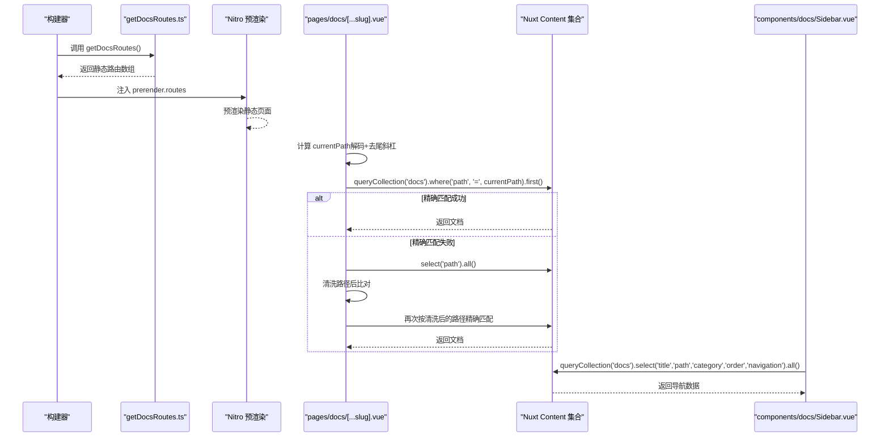
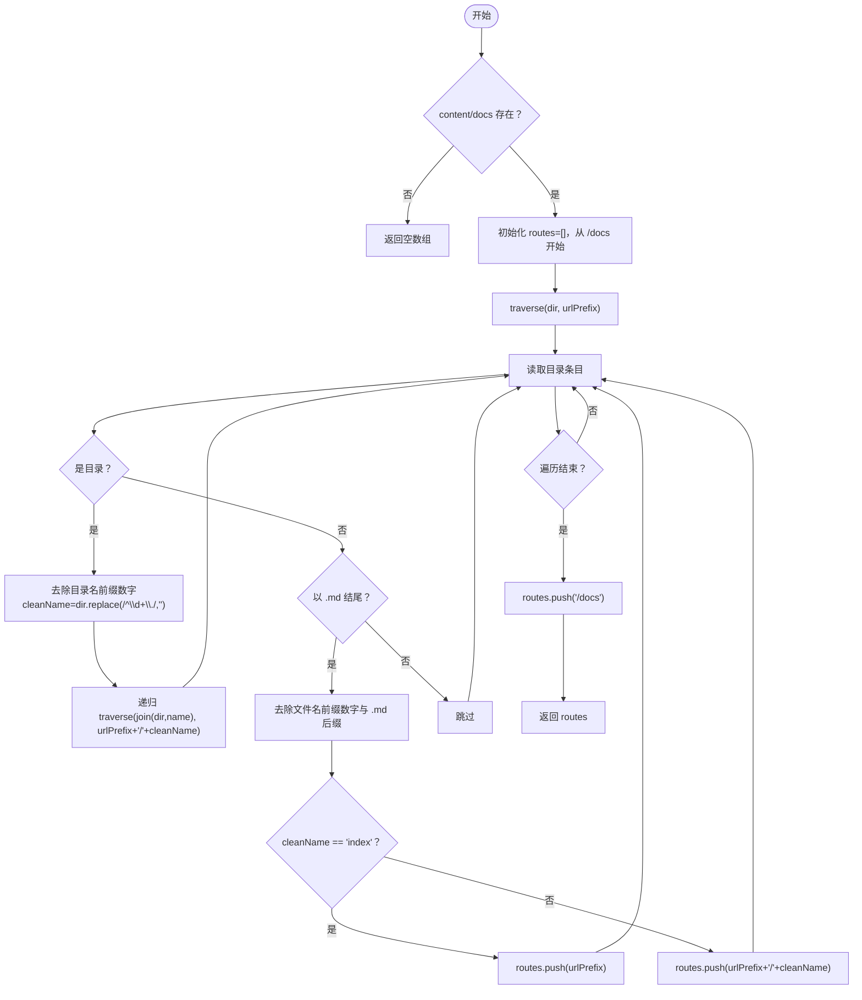
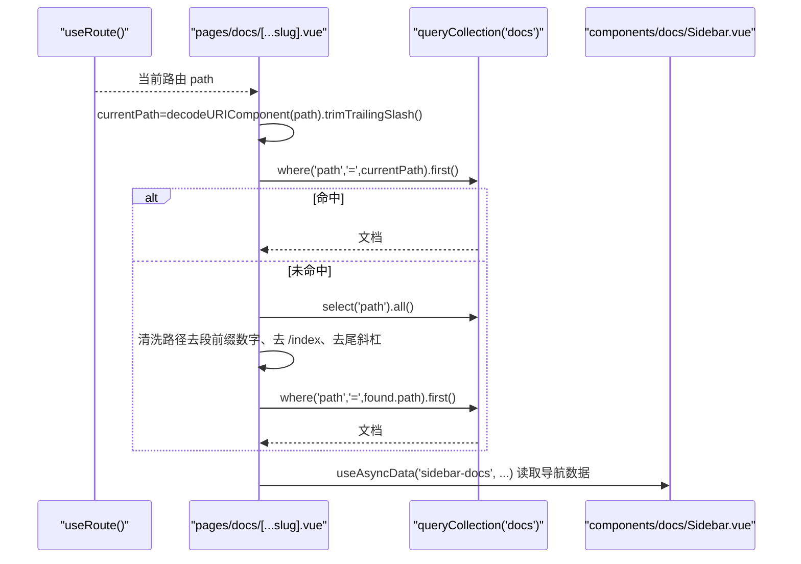
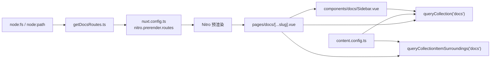

# 内容管理路由机制

<cite>
**本文引用的文件**
- [utils/getDocsRoutes.ts](file://utils/getDocsRoutes.ts)
- [pages/docs/[...slug].vue](file://pages/docs/[...slug].vue)
- [content.config.ts](file://content.config.ts)
- [nuxt.config.ts](file://nuxt.config.ts)
- [components/docs/Sidebar.vue](file://components/docs/Sidebar.vue)
- [content/docs/introduction/1.start.md](file://content/docs/introduction/1.start.md)
- [content/docs/framework/define.md](file://content/docs/framework/define.md)
</cite>

## 目录
1. [引言](#引言)
2. [项目结构](#项目结构)
3. [核心组件](#核心组件)
4. [架构总览](#架构总览)
5. [详细组件分析](#详细组件分析)
6. [依赖关系分析](#依赖关系分析)
7. [性能考量](#性能考量)
8. [故障排查指南](#故障排查指南)
9. [结论](#结论)
10. [附录](#附录)

## 引言
本技术文档围绕 buidai 项目的“内容管理路由机制”，系统解析以下要点：
- getDocsRoutes.ts 如何通过 node:fs 递归遍历 content/docs 目录，生成文档静态路由；
- 数字前缀（如 1.introduction）的清理策略与 cleanName 的生成逻辑；
- traverse 函数如何构建 URL 路径层级，并区分 index.md 与其他 Markdown 文件的路由生成规则；
- 生成的路由数组如何被 Nuxt Nitro 引擎用于预渲染；
- pages/docs/[...slug].vue 动态路由的数据获取流程：useAsyncData 如何使用 queryCollection('docs') 在指定集合内进行精确路径匹配，以及当精确匹配失败时的降级容错机制；
- currentPath 计算中 decodeURIComponent 与尾部斜杠处理的重要性，确保国际化路径的正确匹配。

## 项目结构
该项目采用 Nuxt Content + Nitro 静态输出的架构，文档内容位于 content/docs 下，通过内容集合配置与工具函数生成静态路由，再由动态路由页面进行内容渲染与导航。

**图表来源**
- [utils/getDocsRoutes.ts](file://utils/getDocsRoutes.ts#L1-L58)
- [nuxt.config.ts](file://nuxt.config.ts#L40-L51)
- [content.config.ts](file://content.config.ts#L17-L32)
- [pages/docs/[...slug].vue](file://pages/docs/[...slug].vue#L167-L226)
- [components/docs/Sidebar.vue](file://components/docs/Sidebar.vue#L160-L177)

**章节来源**
- [nuxt.config.ts](file://nuxt.config.ts#L40-L51)
- [content.config.ts](file://content.config.ts#L17-L32)

## 核心组件
- getDocsRoutes.ts：负责扫描 content/docs，生成静态路由数组，供 Nitro 预渲染使用。
- pages/docs/[...slug].vue：动态路由页面，负责根据当前路径精确匹配或降级匹配文档内容，并提供前后文导航。
- content.config.ts：定义 docs 集合，声明文档集合的类型、来源与 schema。
- components/docs/Sidebar.vue：侧边导航，基于 docs 集合数据生成导航树，支持分组与高亮。

**章节来源**
- [utils/getDocsRoutes.ts](file://utils/getDocsRoutes.ts#L1-L58)
- [pages/docs/[...slug].vue](file://pages/docs/[...slug].vue#L167-L226)
- [content.config.ts](file://content.config.ts#L17-L32)
- [components/docs/Sidebar.vue](file://components/docs/Sidebar.vue#L160-L177)

## 架构总览
下面的序列图展示了从构建期到运行期的关键流程：工具函数生成路由 -> Nitro 预渲染 -> 动态路由页面按路径查询内容 -> 侧边导航读取集合数据。

**图表来源**
- [utils/getDocsRoutes.ts](file://utils/getDocsRoutes.ts#L1-L58)
- [nuxt.config.ts](file://nuxt.config.ts#L40-L51)
- [pages/docs/[...slug].vue](file://pages/docs/[...slug].vue#L171-L226)
- [content.config.ts](file://content.config.ts#L17-L32)
- [components/docs/Sidebar.vue](file://components/docs/Sidebar.vue#L160-L177)

## 详细组件分析

### 工具函数：getDocsRoutes.ts
- 作用：递归遍历 content/docs，生成所有文档页面的静态路由数组，供 Nitro 预渲染。
- 关键点：
  - 使用 node:fs 读取目录，withFileTypes 获取目录项类型；
  - 目录名与文件名的数字前缀清理（如 1.introduction -> introduction，1.start.md -> 1.start -> start）；
  - index.md 生成当前目录路径，其他 Markdown 文件生成 “父目录/文件名” 路径；
  - 保证 /docs 根路径也被包含；
  - 返回的路由数组注入到 nuxt.config.ts 的 nitro.prerender.routes。

**图表来源**
- [utils/getDocsRoutes.ts](file://utils/getDocsRoutes.ts#L17-L57)

**章节来源**
- [utils/getDocsRoutes.ts](file://utils/getDocsRoutes.ts#L1-L58)
- [nuxt.config.ts](file://nuxt.config.ts#L40-L51)

### 动态路由页面：pages/docs/[...slug].vue
- currentPath 计算：
  - 使用 decodeURIComponent 处理 URL 编码（如中文路径）；
  - 去除尾部斜杠（根路径保留）。
- 数据获取：
  - 并行请求：文档内容与前后文；
  - 精确匹配：按当前路径精确查询；
  - 容错降级：若精确匹配失败，先获取所有文档路径，清洗后与当前路径对比，再按清洗后的路径精确匹配；
  - 设置 404：当找不到文档时设置响应状态。
- 导航与渲染：
  - 通过 ContentRenderer 渲染内容；
  - 提供面包屑、目录树、前后文导航等。

**图表来源**
- [pages/docs/[...slug].vue](file://pages/docs/[...slug].vue#L171-L226)
- [components/docs/Sidebar.vue](file://components/docs/Sidebar.vue#L160-L177)

**章节来源**
- [pages/docs/[...slug].vue](file://pages/docs/[...slug].vue#L171-L226)

### 内容集合配置：content.config.ts
- 定义 docs 集合：
  - 类型为 page；
  - 来源为 docs/**/*.md，递归匹配；
  - schema 定义标题、描述、分类、排序权重、相关链接等字段。

**章节来源**
- [content.config.ts](file://content.config.ts#L17-L32)

### 侧边导航：components/docs/Sidebar.vue
- 自动从 docs 集合读取导航所需字段（title、path、category、order、navigation），并按 category 分组；
- 仅在根层级且未提供 navigation prop 时，自动获取数据；
- 根据当前路由自动展开包含当前页面的分组。

**章节来源**
- [components/docs/Sidebar.vue](file://components/docs/Sidebar.vue#L160-L177)

## 依赖关系分析
- 构建期依赖：
  - utils/getDocsRoutes.ts 依赖 node:fs 与 node:path；
  - nuxt.config.ts 依赖 utils/getDocsRoutes.ts 的返回值，将其注入 nitro.prerender.routes。
- 运行期依赖：
  - pages/docs/[...slug].vue 依赖 Nuxt Content 的 queryCollection 与 queryCollectionItemSurroundings；
  - components/docs/Sidebar.vue 依赖 Nuxt Content 的 queryCollection；
  - content.config.ts 为上述查询提供集合定义与 schema。

**图表来源**
- [utils/getDocsRoutes.ts](file://utils/getDocsRoutes.ts#L1-L58)
- [nuxt.config.ts](file://nuxt.config.ts#L40-L51)
- [pages/docs/[...slug].vue](file://pages/docs/[...slug].vue#L185-L220)
- [content.config.ts](file://content.config.ts#L17-L32)
- [components/docs/Sidebar.vue](file://components/docs/Sidebar.vue#L160-L177)

**章节来源**
- [utils/getDocsRoutes.ts](file://utils/getDocsRoutes.ts#L1-L58)
- [nuxt.config.ts](file://nuxt.config.ts#L40-L51)
- [pages/docs/[...slug].vue](file://pages/docs/[...slug].vue#L185-L220)
- [content.config.ts](file://content.config.ts#L17-L32)
- [components/docs/Sidebar.vue](file://components/docs/Sidebar.vue#L160-L177)

## 性能考量
- 预渲染：通过 getDocsRoutes 生成静态路由，Nitro 预渲染可显著提升首屏性能与 SEO。
- 查询优化：
  - docs 集合 schema 与 indexes（如按 path、order 等字段建立索引）可提升查询性能；
  - 动态路由页面的降级匹配仅在精确匹配失败时触发，避免不必要的全量扫描。
- 路径清洗：在降级匹配中对路径进行清洗，减少因文件命名数字前缀导致的匹配失败。

[本节为通用性能建议，不直接分析具体文件，故无“章节来源”]

## 故障排查指南
- 预渲染失败或页面缺失：
  - 检查 getDocsRoutes 是否正确生成 /docs 根路径与子路径；
  - 确认 nuxt.config.ts 的 nitro.prerender.routes 已注入；
  - 若 content/docs 目录不存在，getDocsRoutes 返回空数组，需确认目录结构。
- 动态路由 404：
  - 确认当前路径经 decodeURIComponent 与去尾斜杠处理后仍能匹配；
  - 若文件名含数字前缀，确认降级匹配逻辑是否能清洗路径并再次精确匹配；
  - 检查 content.config.ts 的 docs 集合来源与 schema 是否正确。
- 侧边导航不显示或分组异常：
  - 确认 docs 集合中存在 title、path、category、order、navigation 等字段；
  - 检查分组逻辑与分类顺序配置。

**章节来源**
- [utils/getDocsRoutes.ts](file://utils/getDocsRoutes.ts#L17-L57)
- [nuxt.config.ts](file://nuxt.config.ts#L40-L51)
- [pages/docs/[...slug].vue](file://pages/docs/[...slug].vue#L171-L226)
- [content.config.ts](file://content.config.ts#L17-L32)
- [components/docs/Sidebar.vue](file://components/docs/Sidebar.vue#L160-L177)

## 结论
本项目通过“工具函数 + 内容集合 + 动态路由 + 侧边导航”的协同，实现了文档路由的静态生成与动态渲染：
- getDocsRoutes 以数字前缀清理与层级拼接策略，确保 /docs 与子路径的正确生成；
- Nitro 预渲染保证静态页面的可访问性；
- 动态路由页面在精确匹配失败时提供路径清洗降级，增强健壮性；
- 侧边导航基于集合数据自动分组与高亮，提升用户体验。

[本节为总结性内容，不直接分析具体文件，故无“章节来源”]

## 附录

### 示例：目录与路由映射
- content/docs/introduction/1.start.md
  - 文件名含数字前缀，清理后生成 /docs/introduction/start；
  - 若存在 index.md，将生成 /docs/introduction；
  - 由于根目录 /docs 也会被显式加入，因此 /docs 也会被预渲染。
- content/docs/framework/define.md
  - 无数字前缀，生成 /docs/framework/define。

**章节来源**
- [utils/getDocsRoutes.ts](file://utils/getDocsRoutes.ts#L32-L57)
- [content/docs/introduction/1.start.md](file://content/docs/introduction/1.start.md#L1-L10)
- [content/docs/framework/define.md](file://content/docs/framework/define.md#L1-L10)