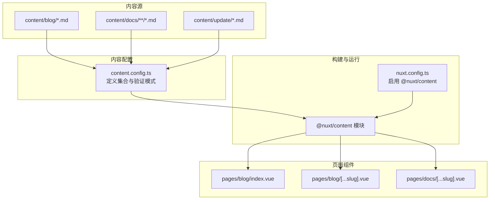
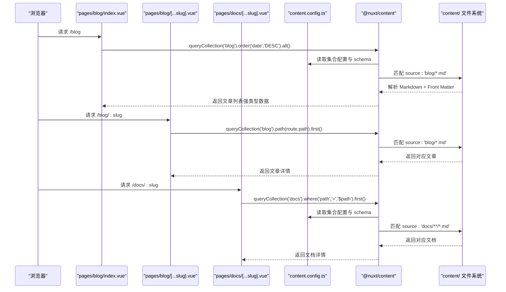
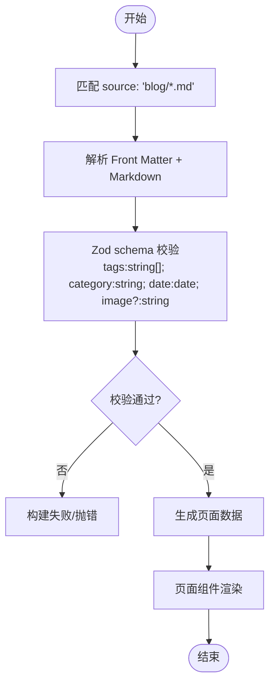
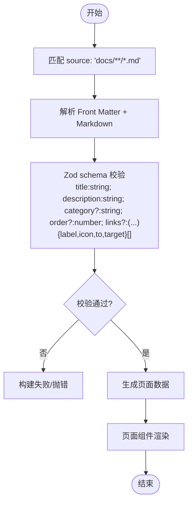
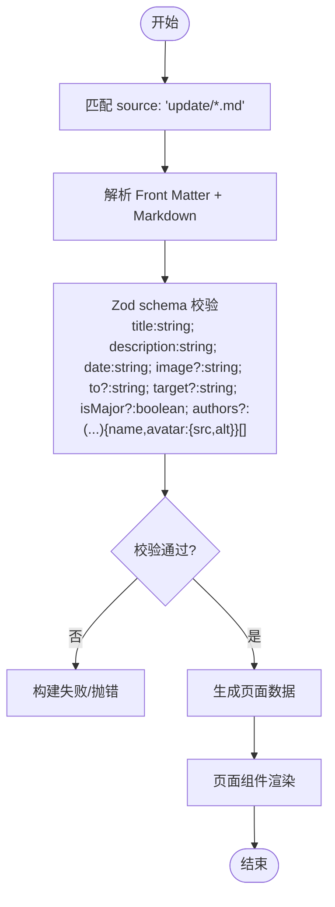
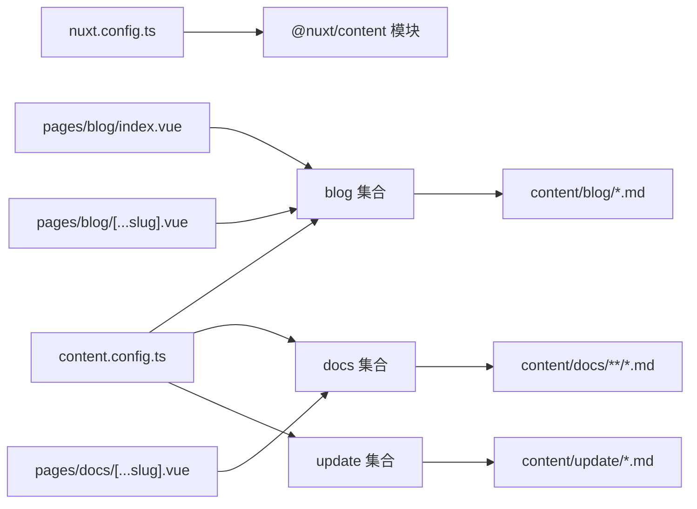

# 内容管理配置系统

<cite>
**本文引用的文件**
- [content.config.ts](file://content.config.ts)
- [nuxt.config.ts](file://nuxt.config.ts)
- [pages/blog/index.vue](file://pages/blog/index.vue)
- [pages/blog/[...slug].vue](file://pages/blog/[...slug].vue)
- [pages/docs/[...slug].vue](file://pages/docs/[...slug].vue)
- [content/blog/1.md](file://content/blog/1.md)
- [content/docs/introduction/1.configuration.md](file://content/docs/introduction/1.configuration.md)
- [content/update/2503.md](file://content/update/2503.md)
- [content/docs/framework/define.md](file://content/docs/framework/define.md)
- [content/docs/framework/types.md](file://content/docs/framework/types.md)
- [content/docs/framework/validators.md](file://content/docs/framework/validators.md)
</cite>

## 目录
1. [引言](#引言)
2. [项目结构](#项目结构)
3. [核心组件](#核心组件)
4. [架构总览](#架构总览)
5. [详细组件分析](#详细组件分析)
6. [依赖分析](#依赖分析)
7. [性能考量](#性能考量)
8. [故障排查指南](#故障排查指南)
9. [结论](#结论)
10. [附录](#附录)

## 引言
本技术文档围绕 buidai 项目的“内容管理配置系统”，系统性解析 content.config.ts 中基于 @nuxt/content 的集合（collections）配置机制，重点说明 blog、docs 和 update 三个集合的定义方式与行为。文档将深入解释：
- 集合 type 属性（page 类型）的含义与路径生成规则
- source 字段的 glob 模式匹配规则（如 'blog/*.md'、'docs/**/*.md'）如何实现文件路径映射
- Zod 验证模式（schema）对各集合 Front Matter 的强类型约束
- 各集合字段的语义与可选性（如 blog 的 tags、category、date，docs 的 title、description、order，update 的 isMajor、authors）
- 构建时内容校验如何防止非法数据注入
- 配置最佳实践：新增集合、自定义验证规则、处理可选字段，以及配置变更对内容解析的影响

## 项目结构
该项目采用 Nuxt + @nuxt/content 的内容驱动架构，内容文件位于 content/ 目录，通过 content.config.ts 定义集合，再由页面组件通过 queryCollection API 查询解析后的数据。

**图表来源**
- [content.config.ts](file://content.config.ts#L1-L57)
- [nuxt.config.ts](file://nuxt.config.ts#L1-L91)
- [pages/blog/index.vue](file://pages/blog/index.vue#L1-L152)
- [pages/blog/[...slug].vue](file://pages/blog/[...slug].vue#L205-L241)
- [pages/docs/[...slug].vue](file://pages/docs/[...slug].vue#L181-L220)

**章节来源**
- [content.config.ts](file://content.config.ts#L1-L57)
- [nuxt.config.ts](file://nuxt.config.ts#L1-L91)

## 核心组件
本节聚焦 content.config.ts 中的三个集合定义及其作用：
- blog 集合：页面型集合，匹配 content/blog 下的 Markdown 文件，约束 Front Matter 字段以保证博客文章的元数据一致性
- docs 集合：页面型集合，递归匹配 content/docs 下的所有 Markdown 文件，支持排序权重与相关链接等结构化元数据
- update 集合：页面型集合，匹配 content/update 下的 Markdown 文件，支持版本标题、描述、日期、作者等版本发布元数据

每个集合均通过 type: 'page' 指定页面型，source 使用 glob 模式精确控制扫描范围，schema 使用 Zod 定义强类型约束，确保构建期与运行期的数据质量。

**章节来源**
- [content.config.ts](file://content.config.ts#L1-L57)

## 架构总览
下面的时序图展示了页面组件如何通过 queryCollection API 获取集合数据，并渲染页面内容。

**图表来源**
- [content.config.ts](file://content.config.ts#L1-L57)
- [pages/blog/index.vue](file://pages/blog/index.vue#L120-L143)
- [pages/blog/[...slug].vue](file://pages/blog/[...slug].vue#L220-L241)
- [pages/docs/[...slug].vue](file://pages/docs/[...slug].vue#L185-L220)

## 详细组件分析

### blog 集合
- 类型与路径映射
  - type: 'page' 表示每个 Markdown 文件对应一个页面路径
  - source: 'blog/*.md' 仅匹配 content/blog 目录下的一级 Markdown 文件，避免递归扫描
- Zod 验证模式要点
  - tags: 字符串数组（必填）
  - category: 字符串（必填）
  - date: 日期（必填）
  - image: 字符串（可选）
- 实际 Front Matter 示例
  - content/blog/1.md 展示了 title、description、date、category、tags、image 等字段的实际使用
- 页面组件使用
  - 列表页通过 queryCollection('blog').order('date','DESC').all() 获取文章列表
  - 详情页通过 queryCollection('blog').path(route.path).first() 获取当前文章

**图表来源**
- [content.config.ts](file://content.config.ts#L1-L15)
- [content/blog/1.md](file://content/blog/1.md#L1-L20)
- [pages/blog/index.vue](file://pages/blog/index.vue#L120-L143)
- [pages/blog/[...slug].vue](file://pages/blog/[...slug].vue#L220-L241)

**章节来源**
- [content.config.ts](file://content.config.ts#L1-L15)
- [content/blog/1.md](file://content/blog/1.md#L1-L20)
- [pages/blog/index.vue](file://pages/blog/index.vue#L120-L143)
- [pages/blog/[...slug].vue](file://pages/blog/[...slug].vue#L220-L241)

### docs 集合
- 类型与路径映射
  - type: 'page' 表示每个 Markdown 文件对应一个页面路径
  - source: 'docs/**/*.md' 递归匹配 content/docs 下的所有 Markdown 文件，支持深层目录结构
- Zod 验证模式要点
  - title: 字符串（必填）
  - description: 字符串（必填）
  - category: 字符串（可选）
  - order: 数字（可选，用于排序权重）
  - links: 字符串数组（可选），数组元素包含 label、icon、to、target 等字段
- 实际 Front Matter 示例
  - content/docs/introduction/1.configuration.md 展示了 category、title、navigation.title/icon、description 等字段
- 页面组件使用
  - 详情页通过 queryCollection('docs').where('path','=','$path').first() 获取当前文档
  - 详情页还通过 queryCollectionItemSurroundings('docs', currentPath, { fields: ['title','path'] }) 获取前后文档

**图表来源**
- [content.config.ts](file://content.config.ts#L16-L32)
- [content/docs/introduction/1.configuration.md](file://content/docs/introduction/1.configuration.md#L1-L10)
- [pages/docs/[...slug].vue](file://pages/docs/[...slug].vue#L185-L220)

**章节来源**
- [content.config.ts](file://content.config.ts#L16-L32)
- [content/docs/introduction/1.configuration.md](file://content/docs/introduction/1.configuration.md#L1-L10)
- [pages/docs/[...slug].vue](file://pages/docs/[...slug].vue#L185-L220)

### update 集合
- 类型与路径映射
  - type: 'page' 表示每个 Markdown 文件对应一个页面路径
  - source: 'update/*.md' 仅匹配 content/update 目录下的一级 Markdown 文件
- Zod 验证模式要点
  - title: 字符串（必填）
  - description: 字符串（必填）
  - date: 字符串（必填）
  - image: 字符串（可选）
  - to: 字符串（可选）
  - target: 字符串（可选）
  - isMajor: 布尔（可选）
  - authors: 数组（可选），数组元素包含 name、avatar（包含 src、alt）等字段
- 实际 Front Matter 示例
  - content/update/2503.md 展示了 title、description、date、to、target、authors 等字段

**图表来源**
- [content.config.ts](file://content.config.ts#L33-L53)
- [content/update/2503.md](file://content/update/2503.md#L1-L12)

**章节来源**
- [content.config.ts](file://content.config.ts#L33-L53)
- [content/update/2503.md](file://content/update/2503.md#L1-L12)

## 依赖分析
- 模块依赖
  - nuxt.config.ts 启用了 @nuxt/content 模块，并配置 SQLite 作为内容数据库
- 集合依赖
  - content.config.ts 定义了三个集合，分别约束 blog、docs、update 的 Front Matter 结构
- 页面组件依赖
  - pages/blog/index.vue、pages/blog/[...slug].vue、pages/docs/[...slug].vue 通过 queryCollection API 读取集合数据
- 内容文件依赖
  - content/blog/1.md、content/docs/introduction/1.configuration.md、content/update/2503.md 作为集合数据源

**图表来源**
- [nuxt.config.ts](file://nuxt.config.ts#L1-L91)
- [content.config.ts](file://content.config.ts#L1-L57)
- [pages/blog/index.vue](file://pages/blog/index.vue#L120-L143)
- [pages/blog/[...slug].vue](file://pages/blog/[...slug].vue#L220-L241)
- [pages/docs/[...slug].vue](file://pages/docs/[...slug].vue#L185-L220)

**章节来源**
- [nuxt.config.ts](file://nuxt.config.ts#L1-L91)
- [content.config.ts](file://content.config.ts#L1-L57)

## 性能考量
- glob 模式与扫描范围
  - blog 与 update 使用 '*/.md' 限制扫描范围，减少不必要的文件解析
  - docs 使用 '**/*.md' 支持深层目录，建议在大型项目中配合索引优化
- 查询优化
  - docs 集合可通过 schema 定义索引（indexes）优化 where/order 查询
  - 页面组件应尽量使用 select 限定字段，减少传输与渲染开销
- 构建时校验
  - Zod schema 在构建期执行，提前发现非法数据，避免运行期异常

[本节为通用指导，不直接分析具体文件]

## 故障排查指南
- Front Matter 字段缺失或类型不符
  - 现象：构建时报错或页面渲染异常
  - 排查：对照 content.config.ts 中各集合 schema，确认必填字段与类型
- 路径不匹配导致 404
  - 现象：访问 /blog/:slug 或 /docs/:slug 返回 404
  - 排查：确认 source glob 是否正确；docs 详情页使用 where('path','=','$path').first()，需确保路径与集合生成路径一致
- 作者列表或嵌套对象格式错误
  - 现象：update 集合 authors 字段解析失败
  - 排查：确保 authors 数组元素包含 name，avatar 包含 src、alt
- 日期格式问题
  - 现象：blog/date 或 update/date 校验失败
  - 排查：blog 使用 date 类型，update 使用 string 类型；Front Matter 中日期格式需满足相应要求

**章节来源**
- [content.config.ts](file://content.config.ts#L1-L57)
- [pages/docs/[...slug].vue](file://pages/docs/[...slug].vue#L185-L220)

## 结论
content.config.ts 通过 type、source、schema 三要素，将 content/ 目录下的内容文件组织为强类型集合，为 blog、docs、update 三大页面型内容提供了稳定的解析与渲染基础。Zod 验证在构建期强制数据一致性，结合页面组件的查询 API，实现了从内容到页面的高质量交付。遵循本文最佳实践，可安全扩展新集合与字段，提升内容系统的可维护性与可靠性。

[本节为总结性内容，不直接分析具体文件]

## 附录

### 集合类型与路径生成
- page 类型：每个文件生成独立页面路径
- 路径生成示例参考：content/docs/framework/types.md 中的表格与说明

**章节来源**
- [content/docs/framework/types.md](file://content/docs/framework/types.md#L1-L50)

### 定义集合与模式
- 集合定义与模式约束参考：content/docs/framework/define.md
- Zod 验证器使用参考：content/docs/framework/validators.md

**章节来源**
- [content/docs/framework/define.md](file://content/docs/framework/define.md#L1-L229)
- [content/docs/framework/validators.md](file://content/docs/framework/validators.md#L1-L149)

### 页面组件中的集合查询
- blog 列表与详情查询参考：pages/blog/index.vue、pages/blog/[...slug].vue
- docs 详情查询与前后文导航参考：pages/docs/[...slug].vue

**章节来源**
- [pages/blog/index.vue](file://pages/blog/index.vue#L120-L143)
- [pages/blog/[...slug].vue](file://pages/blog/[...slug].vue#L220-L241)
- [pages/docs/[...slug].vue](file://pages/docs/[...slug].vue#L185-L220)