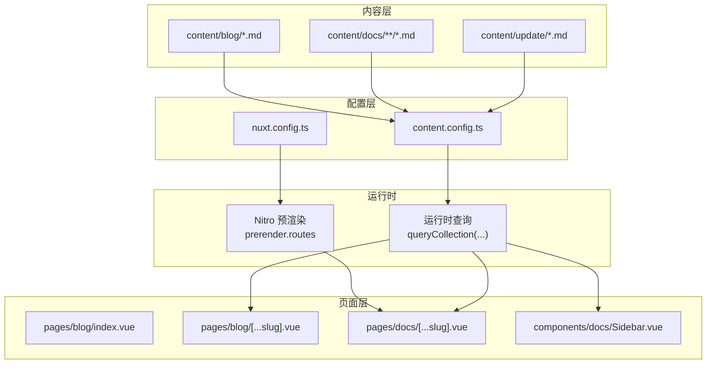
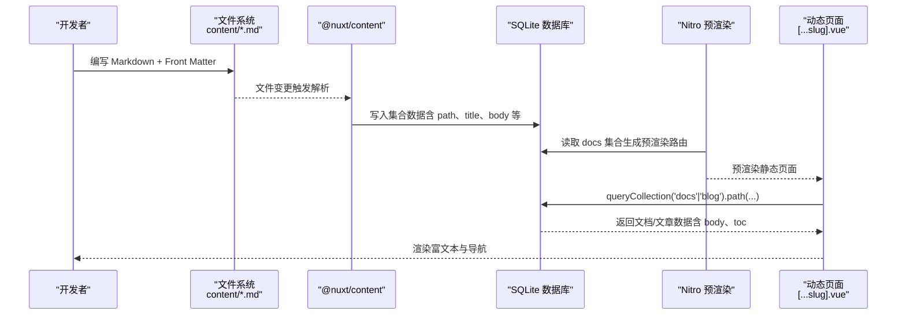
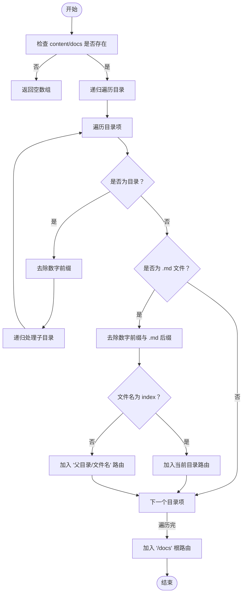
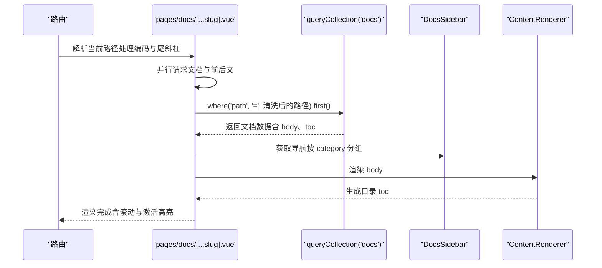
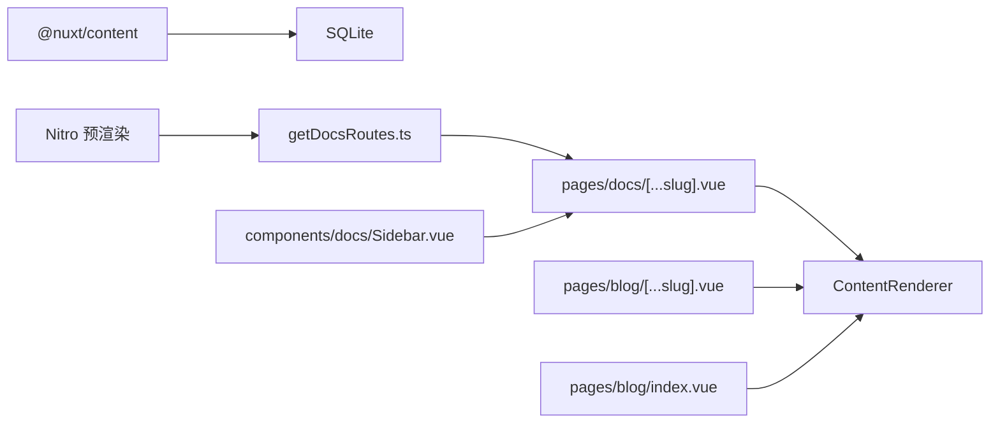

# 内容管理系统

<cite>
**本文引用的文件**
- [content.config.ts](file://content.config.ts)
- [nuxt.config.ts](file://nuxt.config.ts)
- [utils/getDocsRoutes.ts](file://utils/getDocsRoutes.ts)
- [pages/docs/[...slug].vue](file://pages/docs/[...slug].vue)
- [pages/blog/[...slug].vue](file://pages/blog/[...slug].vue)
- [pages/blog/index.vue](file://pages/blog/index.vue)
- [components/docs/Sidebar.vue](file://components/docs/Sidebar.vue)
- [content/blog/1.md](file://content/blog/1.md)
- [content/docs/introduction/1.start.md](file://content/docs/introduction/1.start.md)
</cite>

## 目录
1. [简介](#简介)
2. [项目结构](#项目结构)
3. [核心组件](#核心组件)
4. [架构总览](#架构总览)
5. [详细组件分析](#详细组件分析)
6. [依赖分析](#依赖分析)
7. [性能考量](#性能考量)
8. [故障排查指南](#故障排查指南)
9. [结论](#结论)
10. [附录](#附录)

## 简介
本技术文档围绕 智言万象 项目的内容管理模块，系统解析 @nuxt/content 如何将 content/ 目录下的 Markdown 文件转化为结构化数据 API，并支持富文本渲染、元数据提取与全文搜索。文档重点说明 content.config.ts 中集合配置的作用与数据库类型（SQLite）的使用；阐述文档路由生成逻辑（getDocsRoutes.ts）如何为 Nitro 预渲染提供路由列表；分析 [ ...slug ].vue 动态页面如何根据 URL 路径加载对应 Markdown 内容并渲染；结合博客与文档两类内容类型，说明目录结构、Front Matter 规范与展示模板差异；最后给出内容编写规范、版本控制策略与常见渲染错误（如 YAML 解析失败）的解决方案。

## 项目结构
- 内容存储：content/ 目录下按类型划分，包含 blog、docs、update 等集合。
- 配置文件：content.config.ts 定义集合与模式；nuxt.config.ts 启用 @nuxt/content 并配置 SQLite 数据库与 Nitro 预渲染。
- 动态路由：pages/docs/[...slug].vue 与 pages/blog/[...slug].vue 分别处理文档与博客的动态页面。
- 导航与侧边栏：components/docs/Sidebar.vue 从集合中获取导航数据并分组展示。
- 路由生成：utils/getDocsRoutes.ts 递归扫描 content/docs，生成预渲染路由列表。

**图表来源**
- [content.config.ts](file://content.config.ts#L1-L57)
- [nuxt.config.ts](file://nuxt.config.ts#L1-L91)
- [utils/getDocsRoutes.ts](file://utils/getDocsRoutes.ts#L1-L58)
- [pages/blog/[...slug].vue](file://pages/blog/[...slug].vue#L1-L366)
- [pages/docs/[...slug].vue](file://pages/docs/[...slug].vue#L1-L348)
- [components/docs/Sidebar.vue](file://components/docs/Sidebar.vue#L1-L294)

**章节来源**
- [content.config.ts](file://content.config.ts#L1-L57)
- [nuxt.config.ts](file://nuxt.config.ts#L1-L91)

## 核心组件
- 内容集合与模式
  - blog：页面类型，source 匹配 blog/*.md，schema 定义 tags、category、date、image 等字段。
  - docs：页面类型，source 递归匹配 docs/**/*.md，schema 定义 title、description、category、order、links 等字段。
  - update：页面类型，source 匹配 update/*.md，schema 定义版本标题、描述、日期、图片、链接、是否主要版本、作者等字段。
- 数据库与预渲染
  - nuxt.config.ts 启用 @nuxt/content，并将 content.database.type 设为 sqlite。
  - nuxt.config.ts 通过 nitro.prerender.routes 注入 getDocsRoutes() 生成的文档路由，确保静态预渲染。
- 动态页面
  - pages/docs/[...slug].vue：并行查询当前文档与前后文，支持清理 URL 数字前缀与 index 的兼容匹配，渲染富文本并生成目录导航。
  - pages/blog/[...slug].vue：查询博客文章与“上一篇/下一篇”，渲染富文本并生成目录导航。
  - pages/blog/index.vue：列出博客文章，支持分类筛选与关键词搜索。
- 导航侧边栏
  - components/docs/Sidebar.vue：从 docs 集合按 category 分组并排序，支持分组折叠/展开与当前激活高亮。

**章节来源**
- [content.config.ts](file://content.config.ts#L1-L57)
- [nuxt.config.ts](file://nuxt.config.ts#L1-L91)
- [pages/docs/[...slug].vue](file://pages/docs/[...slug].vue#L1-L348)
- [pages/blog/[...slug].vue](file://pages/blog/[...slug].vue#L1-L366)
- [pages/blog/index.vue](file://pages/blog/index.vue#L1-L153)
- [components/docs/Sidebar.vue](file://components/docs/Sidebar.vue#L1-L294)

## 架构总览
@nuxt/content 将 content/ 下的 Markdown 文件解析为结构化数据，写入 SQLite 数据库；运行时通过 queryCollection(...) 查询集合数据，配合动态路由与预渲染，实现富文本渲染与导航展示。

**图表来源**
- [content.config.ts](file://content.config.ts#L1-L57)
- [nuxt.config.ts](file://nuxt.config.ts#L1-L91)
- [utils/getDocsRoutes.ts](file://utils/getDocsRoutes.ts#L1-L58)
- [pages/docs/[...slug].vue](file://pages/docs/[...slug].vue#L1-L348)
- [pages/blog/[...slug].vue](file://pages/blog/[...slug].vue#L1-L366)

## 详细组件分析

### 内容集合与模式（content.config.ts）
- 集合类型
  - blog：type: 'page'，source: 'blog/*.md'，schema 定义标签、分类、发布日期、封面图等。
  - docs：type: 'page'，source: 'docs/**/*.md'，schema 定义标题、描述、分类、排序权重、相关链接等。
  - update：type: 'page'，source: 'update/*.md'，schema 定义版本标题、描述、日期、图片、链接、是否主要版本、作者等。
- 作用
  - 限定内容导入范围，提供强类型校验与自动类型推断。
  - 为 queryCollection(...) 查询提供约束与索引基础。

**章节来源**
- [content.config.ts](file://content.config.ts#L1-L57)

### 数据库类型与预渲染（nuxt.config.ts）
- 数据库
  - content.database.type: 'sqlite'，提升查询性能与开发体验。
- 预渲染
  - nitro.prerender.routes: getDocsRoutes() 返回的文档路由列表，确保静态生成。
  - nitro.preset: 'static'，输出目录 dist，便于部署。

**章节来源**
- [nuxt.config.ts](file://nuxt.config.ts#L1-L91)

### 文档路由生成（utils/getDocsRoutes.ts）
- 功能
  - 递归遍历 content/docs，去除目录/文件名中的数字前缀（如 1.introduction），生成 /docs 前缀的路由。
  - 若文件名为 index，则路由为当前目录路径；否则为 “当前目录/文件名”。
  - 最终保证包含 /docs 根路径。
- 逻辑要点
  - 使用 fs.readdirSync 与 path.join 递归扫描。
  - 清理规则：去除段落前缀数字与 .md 后缀，index 特殊处理。
  - 返回字符串数组供 Nitro 预渲染使用。

**图表来源**
- [utils/getDocsRoutes.ts](file://utils/getDocsRoutes.ts#L1-L58)

**章节来源**
- [utils/getDocsRoutes.ts](file://utils/getDocsRoutes.ts#L1-L58)

### 文档动态页面渲染（pages/docs/[...slug].vue）
- 数据获取
  - 并行请求：当前文档与前后文。
  - 兼容性处理：若 URL 与文件系统命名含数字前缀或 index，先精确匹配，再回退到清洗路径匹配。
- 渲染
  - 使用 ContentRenderer 渲染 body，自动提取 toc 生成右侧/移动端目录。
  - 侧边栏导航由 DocsSidebar 组件提供。
- 交互
  - 平滑滚动到标题锚点，IntersectionObserver 实时更新激活项。
  - 设置 SEO 元信息。

**图表来源**
- [pages/docs/[...slug].vue](file://pages/docs/[...slug].vue#L1-L348)
- [components/docs/Sidebar.vue](file://components/docs/Sidebar.vue#L1-L294)

**章节来源**
- [pages/docs/[...slug].vue](file://pages/docs/[...slug].vue#L1-L348)
- [components/docs/Sidebar.vue](file://components/docs/Sidebar.vue#L1-L294)

### 博客动态页面渲染（pages/blog/[...slug].vue）
- 数据获取
  - 通过 queryCollection('blog').path(route.path).first() 获取文章。
  - 手动实现“上一篇/下一篇”：按 date 降序获取所有文章，定位当前索引并取相邻项。
- 渲染
  - 使用 ContentRenderer 渲染 body，生成目录 toc。
  - 提供复制链接、滚动进度条、面包屑导航等交互。
- SEO
  - useSeoMeta 设置标题、描述、OG 图等。

**章节来源**
- [pages/blog/[...slug].vue](file://pages/blog/[...slug].vue#L1-L366)

### 博客列表页（pages/blog/index.vue）
- 数据获取
  - queryCollection('blog').order('date', 'DESC').all() 获取文章列表。
- 功能
  - 分类筛选与关键词搜索（标题/描述模糊匹配）。
  - 时间格式化与标签截取展示。

**章节来源**
- [pages/blog/index.vue](file://pages/blog/index.vue#L1-L153)

### 导航侧边栏（components/docs/Sidebar.vue）
- 数据来源
  - queryCollection('docs').select('title','path','category','order','navigation').order('order','ASC').all()。
- 分组与排序
  - 优先使用 Front Matter 中的 category，未定义则归为“未分类”。
  - 预定义分类顺序：指南、框架、未分类；其余按字母排序。
- 交互
  - 折叠/展开分组；自动展开包含当前激活路由的分组；高亮当前页。

**章节来源**
- [components/docs/Sidebar.vue](file://components/docs/Sidebar.vue#L1-L294)

## 依赖分析
- 模块依赖
  - nuxt.config.ts 启用 @nuxt/content 与 @nuxt/ui。
  - @nuxt/content 依赖 SQLite 数据库（content.database.type: 'sqlite'）。
  - Nitro 预渲染依赖 utils/getDocsRoutes.ts 生成的路由列表。
- 组件耦合
  - pages/docs/[...slug].vue 与 components/docs/Sidebar.vue 通过 docs 集合数据耦合。
  - pages/blog/[...slug].vue 与 pages/blog/index.vue 通过 blog 集合数据耦合。
- 外部依赖
  - ContentRenderer 依赖 @nuxt/content 的渲染管线。
  - mdast、micromark 等 Markdown 解析生态（由 @nuxt/content 间接使用）。

**图表来源**
- [nuxt.config.ts](file://nuxt.config.ts#L1-L91)
- [utils/getDocsRoutes.ts](file://utils/getDocsRoutes.ts#L1-L58)
- [pages/docs/[...slug].vue](file://pages/docs/[...slug].vue#L1-L348)
- [pages/blog/[...slug].vue](file://pages/blog/[...slug].vue#L1-L366)
- [pages/blog/index.vue](file://pages/blog/index.vue#L1-L153)
- [components/docs/Sidebar.vue](file://components/docs/Sidebar.vue#L1-L294)

**章节来源**
- [nuxt.config.ts](file://nuxt.config.ts#L1-L91)

## 性能考量
- 数据库
  - 使用 SQLite 提升查询性能与开发体验；集合 schema 有助于建立索引（见 content.config.ts 中集合定义）。
- 预渲染
  - Nitro 预渲染 routes 由 getDocsRoutes.ts 动态生成，避免遗漏文档页面。
- 并行请求
  - 文档页面并行获取当前文档与前后文，缩短首屏等待。
- 目录导航
  - IntersectionObserver 仅在挂载时观察标题元素，避免频繁重排。
- 渲染
  - ContentRenderer 将 Markdown 转换为结构化 HTML，结合样式定制提升可读性。

[本节为通用指导，无需具体文件分析]

## 故障排查指南
- YAML 解析失败
  - 症状：Front Matter 语法错误导致解析异常。
  - 排查：检查 content/blog/*.md 与 content/docs/**/*.md 的 YAML 语法，确保缩进与冒号正确。
  - 参考：content/blog/1.md 与 content/docs/introduction/1.start.md 的 Front Matter 结构。
- 路由不生效或 404
  - 症状：访问 /docs/xxx 返回 404。
  - 排查：确认 content/docs 目录结构与文件命名（数字前缀与 index）；确认 nuxt.config.ts 中 nitro.prerender.routes 已注入 getDocsRoutes()。
  - 参考：pages/docs/[...slug].vue 中的路径清洗与回退匹配逻辑。
- 目录导航不更新
  - 症状：滚动时目录激活项不变化。
  - 排查：确认页面挂载后已创建 IntersectionObserver 并观察 h2/h3 标题；检查样式覆盖导致的可视高度问题。
- 博客“上一篇/下一篇”错位
  - 症状：列表顺序与时间不符。
  - 排查：确认 queryCollection('blog').order('date','DESC') 的排序逻辑；检查日期字段格式是否一致。
- SEO 元信息缺失
  - 症状：页面缺少标题/描述/OG 图。
  - 排查：确认 pages/blog/[...slug].vue 与 pages/docs/[...slug].vue 中 useSeoMeta 的调用时机与字段值。

**章节来源**
- [pages/docs/[...slug].vue](file://pages/docs/[...slug].vue#L1-L348)
- [pages/blog/[...slug].vue](file://pages/blog/[...slug].vue#L1-L366)
- [content/blog/1.md](file://content/blog/1.md#L1-L108)
- [content/docs/introduction/1.start.md](file://content/docs/introduction/1.start.md#L1-L117)

## 结论
智言万象 的内容管理模块以 @nuxt/content 为核心，通过 content.config.ts 定义集合与模式，结合 SQLite 数据库与 Nitro 预渲染，实现了高效的 Markdown 内容管理与渲染。文档与博客两类内容类型分别采用不同的 Front Matter 规范与展示模板，辅以动态路由与导航侧边栏，提供了良好的可维护性与用户体验。遵循本文提供的编写规范与故障排查方法，可进一步提升内容质量与稳定性。

[本节为总结，无需具体文件分析]

## 附录

### 内容编写规范
- 目录结构
  - 博客：content/blog/*.md，建议按年份/主题组织。
  - 文档：content/docs/**/*.md，建议按指南/框架/进阶等分类组织。
- Front Matter 规范
  - 博客：title、description、date、category、tags、image 等。
  - 文档：title、description、category、order、links（可选）、navigation（可选）。
  - 更新日志：title、description、date、image、to、target、isMajor、authors（可选）。
- 路由与命名
  - 文档 URL 与文件路径一一对应；可使用数字前缀（如 1.introduction）以控制排序，但最终路由会去除前缀与 .md 后缀。
  - index.md 作为目录页，最终路由为当前目录路径。
- 富文本与目录
  - 使用 ContentRenderer 渲染 Markdown；标题将自动生成目录项。
- SEO
  - 为每篇文章设置 title、description、image（博客）或 title、description（文档）。

**章节来源**
- [content.config.ts](file://content.config.ts#L1-L57)
- [content/blog/1.md](file://content/blog/1.md#L1-L108)
- [content/docs/introduction/1.start.md](file://content/docs/introduction/1.start.md#L1-L117)

### 版本控制策略
- 内容版本
  - 通过 Git 管理 content/ 下的 Markdown 文件，提交信息清晰描述变更。
- 预渲染与部署
  - 使用 nuxt build 生成静态站点，Nitro 预渲染确保文档页面完整生成。
- 兼容性
  - 保持 content.config.ts 与页面查询 API 的一致性；迁移时参考 @nuxt/content 的集合与查询 API 变更。

**章节来源**
- [nuxt.config.ts](file://nuxt.config.ts#L1-L91)