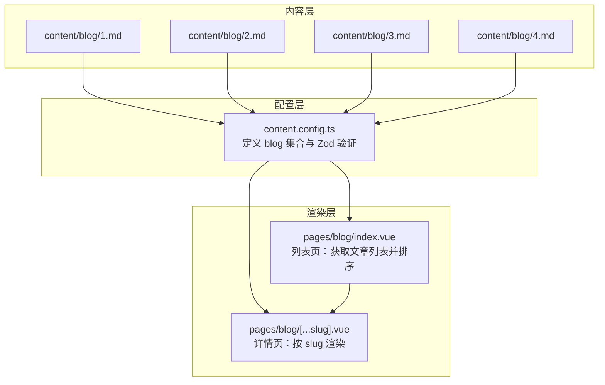
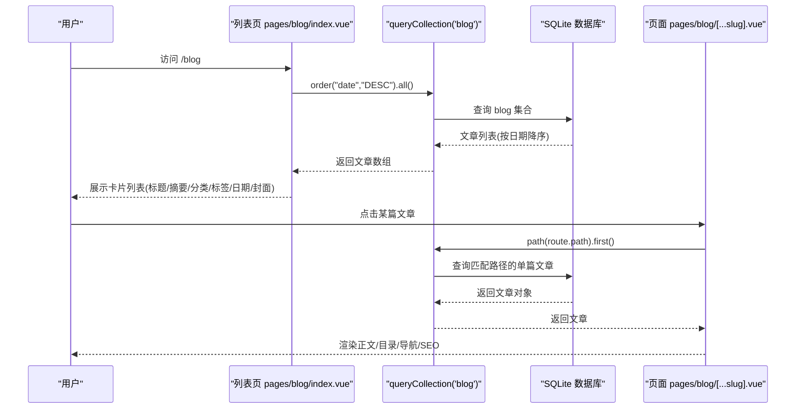
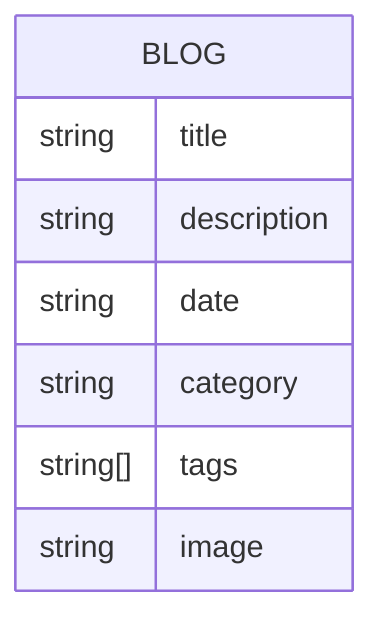
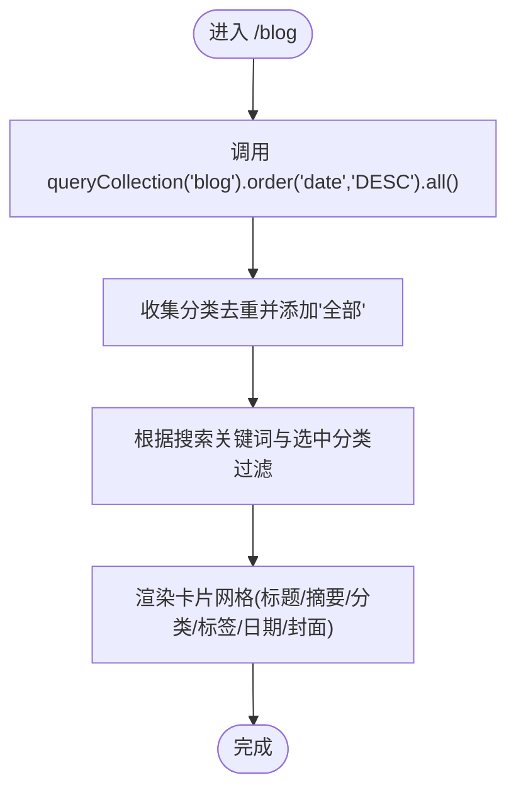
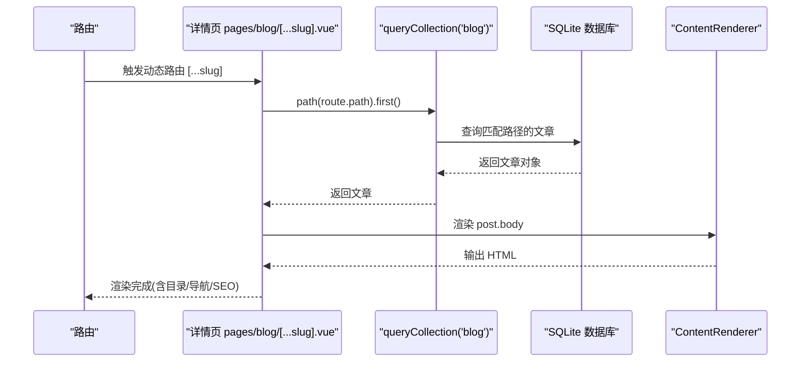
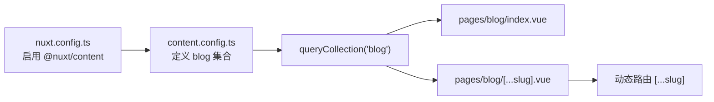

# 博客系统

<cite>
**本文引用的文件**
- [content.config.ts](file://content.config.ts)
- [nuxt.config.ts](file://nuxt.config.ts)
- [pages/blog/index.vue](file://pages/blog/index.vue)
- [pages/blog/[...slug].vue](file://pages/blog/[...slug].vue)
- [content/blog/1.md](file://content/blog/1.md)
- [content/blog/2.md](file://content/blog/2.md)
- [content/blog/3.md](file://content/blog/3.md)
- [content/blog/4.md](file://content/blog/4.md)
</cite>

## 目录
1. [引言](#引言)
2. [项目结构](#项目结构)
3. [核心组件](#核心组件)
4. [架构总览](#架构总览)
5. [详细组件分析](#详细组件分析)
6. [依赖关系分析](#依赖关系分析)
7. [性能考量](#性能考量)
8. [故障排查指南](#故障排查指南)
9. [结论](#结论)
10. [附录](#附录)

## 引言
本专项技术文档围绕 智言万象 项目的博客系统展开，系统阐述 content/blog 目录下博客文章的组织方式、Front Matter 元数据结构、Zod 验证模式、列表页与详情页的数据获取与渲染流程、路由机制、展示要素与写作规范，并给出评论/分享扩展与 RSS 内容分发建议。读者可据此快速理解与维护博客内容与前端展示。

## 项目结构
博客系统由“内容源 + 内容配置 + 页面渲染”三层组成：
- 内容源：content/blog 下的 Markdown 文件，每个文件即一篇博客。
- 内容配置：content.config.ts 中定义 blog 集合的 Zod 验证模式与数据源路径。
- 页面渲染：pages/blog 下的列表页与详情页，通过 @nuxt/content 的 queryCollection API 获取数据并渲染。

**图表来源**
- [content.config.ts](file://content.config.ts#L1-L57)
- [pages/blog/index.vue](file://pages/blog/index.vue#L1-L153)
- [pages/blog/[...slug].vue](file://pages/blog/[...slug].vue#L1-L366)
- [content/blog/1.md](file://content/blog/1.md#L1-L108)
- [content/blog/2.md](file://content/blog/2.md#L1-L36)
- [content/blog/3.md](file://content/blog/3.md#L1-L105)
- [content/blog/4.md](file://content/blog/4.md#L1-L167)

**章节来源**
- [content.config.ts](file://content.config.ts#L1-L57)
- [nuxt.config.ts](file://nuxt.config.ts#L1-L91)
- [pages/blog/index.vue](file://pages/blog/index.vue#L1-L153)
- [pages/blog/[...slug].vue](file://pages/blog/[...slug].vue#L1-L366)
- [content/blog/1.md](file://content/blog/1.md#L1-L108)
- [content/blog/2.md](file://content/blog/2.md#L1-L36)
- [content/blog/3.md](file://content/blog/3.md#L1-L105)
- [content/blog/4.md](file://content/blog/4.md#L1-L167)

## 核心组件
- 博客集合与验证模式：在 content.config.ts 中定义 blog 集合，使用 Zod schema 约束 Front Matter 字段类型与必填性，确保数据完整性。
- 列表页：pages/blog/index.vue 通过 queryCollection('blog') 获取所有文章，按 date 字段降序排列，提供搜索与分类筛选。
- 详情页：pages/blog/[...slug].vue 通过 queryCollection('blog').path(route.path).first() 按路径精确获取文章，渲染正文、目录、上一篇/下一篇文章导航、阅读时长与 SEO 元信息。
- 内容源：content/blog 下的 Markdown 文件，遵循统一的 Front Matter 结构与正文格式。

**章节来源**
- [content.config.ts](file://content.config.ts#L1-L57)
- [pages/blog/index.vue](file://pages/blog/index.vue#L106-L153)
- [pages/blog/[...slug].vue](file://pages/blog/[...slug].vue#L205-L338)
- [content/blog/1.md](file://content/blog/1.md#L1-L108)
- [content/blog/2.md](file://content/blog/2.md#L1-L36)
- [content/blog/3.md](file://content/blog/3.md#L1-L105)
- [content/blog/4.md](file://content/blog/4.md#L1-L167)

## 架构总览
博客系统采用 Nuxt Content 的“内容即数据”理念：Markdown 文件经解析入库，前端通过统一 API 查询与渲染。列表页负责聚合与筛选，详情页负责单篇渲染与导航。

**图表来源**
- [pages/blog/index.vue](file://pages/blog/index.vue#L120-L124)
- [pages/blog/[...slug].vue](file://pages/blog/[...slug].vue#L221-L223)

## 详细组件分析

### 博客集合与 Front Matter 元数据结构
- 集合类型与数据源
  - 集合类型：page
  - 数据源：blog/*.md
- Zod 验证模式（必填/可选）
  - 必填字段
    - tags: 标签数组（字符串数组）
    - category: 分类（字符串）
    - date: 发布日期（Zod 解析为 Date 类型）
  - 可选字段
    - image: 封面图（字符串）
- 示例文件
  - content/blog/1.md、content/blog/2.md、content/blog/3.md、content/blog/4.md 均包含上述字段的 Front Matter 与正文内容。

**图表来源**
- [content.config.ts](file://content.config.ts#L6-L15)
- [content/blog/1.md](file://content/blog/1.md#L1-L10)
- [content/blog/2.md](file://content/blog/2.md#L1-L8)
- [content/blog/3.md](file://content/blog/3.md#L1-L10)
- [content/blog/4.md](file://content/blog/4.md#L1-L8)

**章节来源**
- [content.config.ts](file://content.config.ts#L1-L57)
- [content/blog/1.md](file://content/blog/1.md#L1-L108)
- [content/blog/2.md](file://content/blog/2.md#L1-L36)
- [content/blog/3.md](file://content/blog/3.md#L1-L105)
- [content/blog/4.md](file://content/blog/4.md#L1-L167)

### 列表页：文章列表获取与展示
- 数据获取
  - 使用 queryCollection('blog').order('date','DESC').all() 获取所有文章并按日期降序排列。
- 展示要素
  - 标题、摘要、分类、标签云（最多显示两个）、发布日期、封面图（可选）。
  - 支持搜索（标题/摘要模糊匹配）与分类筛选。
- SEO
  - 设置页面标题、描述与关键词。

**图表来源**
- [pages/blog/index.vue](file://pages/blog/index.vue#L120-L142)

**章节来源**
- [pages/blog/index.vue](file://pages/blog/index.vue#L106-L153)

### 详情页：路由机制与内容渲染
- 路由机制
  - 动态路由 pages/blog/[...slug].vue，基于路径精确匹配文章。
  - 通过 queryCollection('blog').path(route.path).first() 获取当前文章。
- 内容渲染
  - 使用 ContentRenderer 渲染 Markdown 正文，支持 Markdown 语法与内嵌 HTML。
  - 展示特色图（可选）、文章头部信息（分类、日期、阅读时长）、面包屑导航。
- 导航与目录
  - 上一篇/下一篇文章导航（基于全量文章按日期降序的相邻关系）。
  - 自动生成目录（基于 ContentRenderer 生成的 toc），支持滚动高亮与锚点跳转。
- SEO
  - 动态设置标题、描述、OG 标签与图片。
- 其他
  - 复制链接、阅读进度条等交互。

**图表来源**
- [pages/blog/[...slug].vue](file://pages/blog/[...slug].vue#L221-L223)
- [pages/blog/[...slug].vue](file://pages/blog/[...slug].vue#L66-L69)

**章节来源**
- [pages/blog/[...slug].vue](file://pages/blog/[...slug].vue#L1-L366)

### 内容渲染与 Markdown 支持
- 正文渲染
  - 使用 ContentRenderer 渲染文章内容，支持标题、段落、列表、代码块、引用、表格等 Markdown 语法。
  - 支持内嵌 HTML（如图片、徽章、表格等）。
- 目录生成
  - 基于 ContentRenderer 的 toc 结构生成侧边目录，支持二级标题层级。
- 样式定制
  - 通过 scoped CSS 对 prose 样式进行定制，提升可读性与一致性。

**章节来源**
- [pages/blog/[...slug].vue](file://pages/blog/[...slug].vue#L66-L69)
- [pages/blog/[...slug].vue](file://pages/blog/[...slug].vue#L143-L198)
- [pages/blog/[...slug].vue](file://pages/blog/[...slug].vue#L339-L366)

### 写作规范与最佳实践
- 标题层级
  - 使用 H1 作为文章主标题，H2/H3 作为章节标题，避免跳级。
- 图片引用路径
  - 建议使用相对路径或站点根路径，确保在列表页与详情页均能正确加载。
- SEO 优化
  - Front Matter 中提供 title、description、date、category、tags、image。
  - 列表页与详情页分别设置 meta 标签与 OG 标签，提升社交分享效果。
- 元信息一致性
  - 保持 tags 与 category 的规范性，便于筛选与聚合。

**章节来源**
- [content/blog/1.md](file://content/blog/1.md#L1-L10)
- [content/blog/2.md](file://content/blog/2.md#L1-L8)
- [content/blog/3.md](file://content/blog/3.md#L1-L10)
- [content/blog/4.md](file://content/blog/4.md#L1-L8)
- [pages/blog/index.vue](file://pages/blog/index.vue#L109-L115)
- [pages/blog/[...slug].vue](file://pages/blog/[...slug].vue#L319-L329)

### 扩展建议：评论系统与分享功能
- 评论系统
  - 可在详情页底部增加评论区容器，接入第三方评论服务（如 Giscus、Waline 等）。
  - 评论区需绑定文章唯一标识（如 path 或 slug），以便按文章归档。
- 分享功能
  - 利用详情页的复制链接能力，扩展为“分享到社交媒体”的按钮组。
  - 结合 OG 标签与 Twitter Card，提升分享卡片质量。

[本节为概念性建议，不涉及具体代码文件分析]

### RSS 内容分发
- 生成策略
  - 使用 Nuxt Content 的数据库与集合 API，按 date 降序导出最近若干篇文章的标题、摘要、链接、发布时间与封面图。
- 集成方式
  - 在服务端或构建阶段生成 RSS 文件，或通过 API 动态生成。
  - 在页面头部注入 RSS 链接，便于订阅。

[本节为概念性建议，不涉及具体代码文件分析]

## 依赖关系分析
- 模块依赖
  - nuxt.config.ts 启用 @nuxt/content 模块，并配置 SQLite 数据库。
  - pages/blog/index.vue 与 pages/blog/[...slug].vue 依赖 @nuxt/content 的 queryCollection API。
- 集合依赖
  - content.config.ts 定义 blog 集合的 schema，决定 Front Matter 字段的类型与必填性。
- 路由依赖
  - 动态路由 pages/blog/[...slug].vue 依赖路由参数 route.path，用于精确匹配文章。

**图表来源**
- [nuxt.config.ts](file://nuxt.config.ts#L17-L21)
- [content.config.ts](file://content.config.ts#L1-L57)
- [pages/blog/index.vue](file://pages/blog/index.vue#L120-L124)
- [pages/blog/[...slug].vue](file://pages/blog/[...slug].vue#L221-L223)

**章节来源**
- [nuxt.config.ts](file://nuxt.config.ts#L1-L91)
- [content.config.ts](file://content.config.ts#L1-L57)
- [pages/blog/index.vue](file://pages/blog/index.vue#L120-L124)
- [pages/blog/[...slug].vue](file://pages/blog/[...slug].vue#L221-L223)

## 性能考量
- 列表页
  - 使用 order('date','DESC') 与客户端过滤，适合中小规模内容；大规模内容建议服务端分页或索引优化。
- 详情页
  - ContentRenderer 渲染 Markdown 时，注意避免过大的图片与过多的内嵌 HTML，必要时进行懒加载与压缩。
- 目录与滚动
  - IntersectionObserver 与锚点跳转在移动端可能影响性能，建议节流与按需观察。

[本节提供一般性指导，不涉及具体文件分析]

## 故障排查指南
- 列表为空
  - 检查 content/blog 下是否存在 .md 文件，确认 Front Matter 字段完整（特别是 date、category、tags）。
  - 确认 content.config.ts 中 blog 集合的 source 路径是否匹配实际文件。
- 详情页 404
  - 确认路由路径与文章 path 是否一致；检查 queryCollection('blog').path(...) 是否返回结果。
- 图片不显示
  - 检查 image 字段路径是否正确，确保静态资源可访问。
- SEO 元信息缺失
  - 确认列表页与详情页的 useSeoMeta 调用是否生效，Front Matter 是否包含必要的 meta 字段。

**章节来源**
- [content.config.ts](file://content.config.ts#L1-L57)
- [pages/blog/index.vue](file://pages/blog/index.vue#L109-L115)
- [pages/blog/[...slug].vue](file://pages/blog/[...slug].vue#L319-L329)

## 结论
智言万象 的博客系统以“单文件即一篇博客”的方式组织内容，借助 Nuxt Content 的集合与 Zod 验证，保证了数据结构的一致性与可维护性。列表页与详情页分别承担聚合与单篇渲染职责，配合 SEO 与目录导航，提供了良好的阅读体验。建议在后续迭代中引入评论与分享能力，并通过 RSS 实现内容分发，进一步完善生态闭环。

[本节为总结性内容，不涉及具体文件分析]

## 附录
- 关键实现路径参考
  - 列表页数据获取与排序：[pages/blog/index.vue](file://pages/blog/index.vue#L120-L124)
  - 列表页搜索与分类筛选：[pages/blog/index.vue](file://pages/blog/index.vue#L131-L142)
  - 详情页按路径获取文章：[pages/blog/[...slug].vue](file://pages/blog/[...slug].vue#L221-L223)
  - 正文渲染与目录生成：[pages/blog/[...slug].vue](file://pages/blog/[...slug].vue#L66-L69)
  - SEO 元信息设置（列表/详情）：[pages/blog/index.vue](file://pages/blog/index.vue#L109-L115)、[pages/blog/[...slug].vue](file://pages/blog/[...slug].vue#L319-L329)
  - 博客集合与验证模式：[content.config.ts](file://content.config.ts#L6-L15)