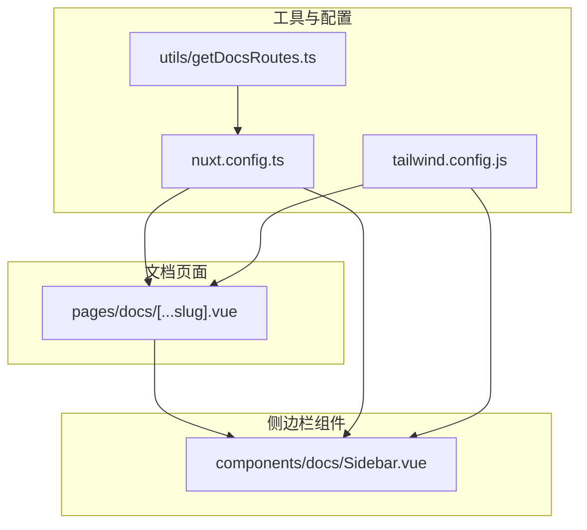
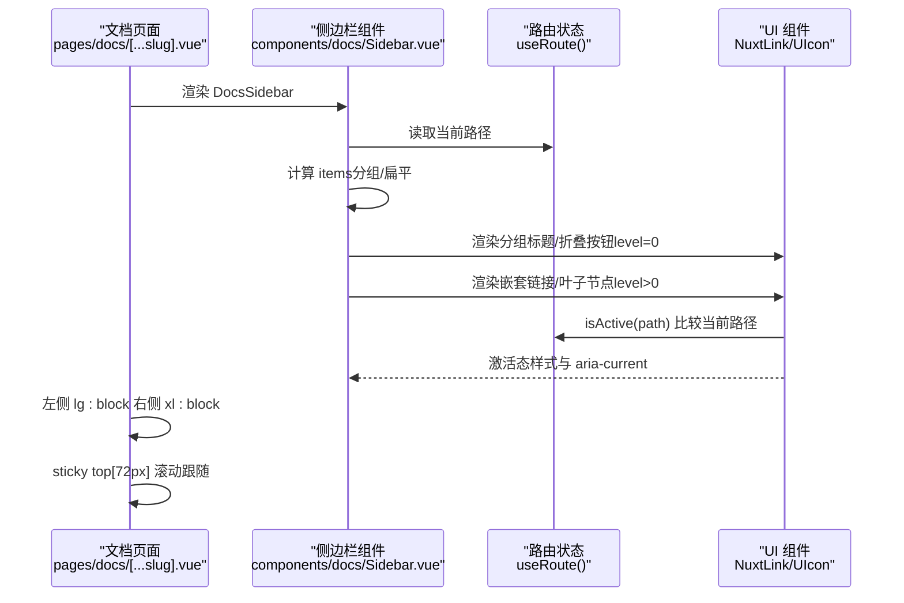
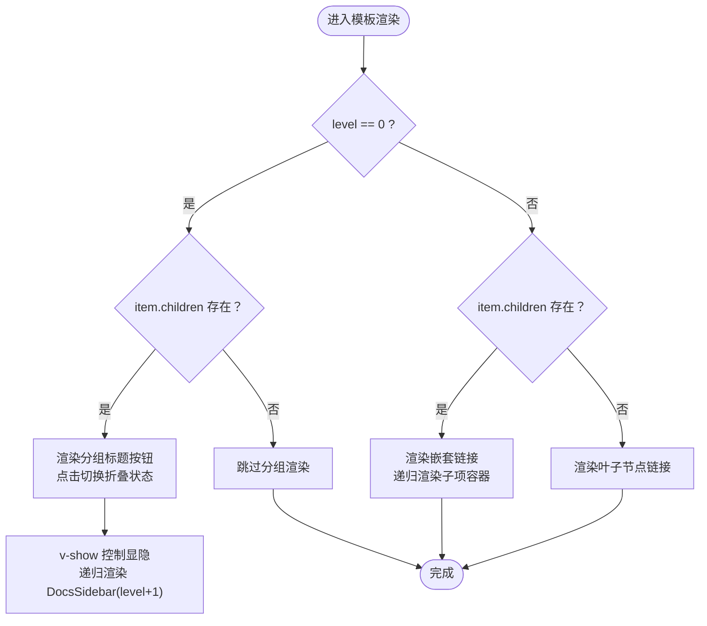
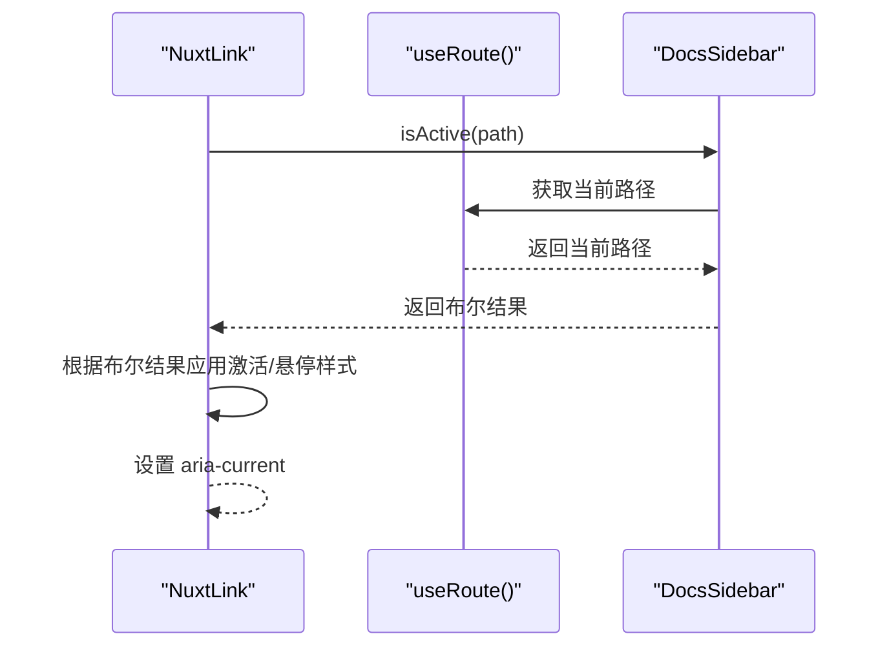
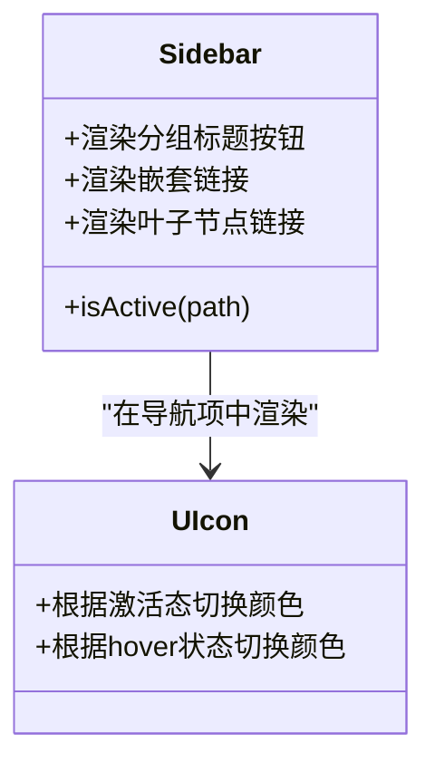
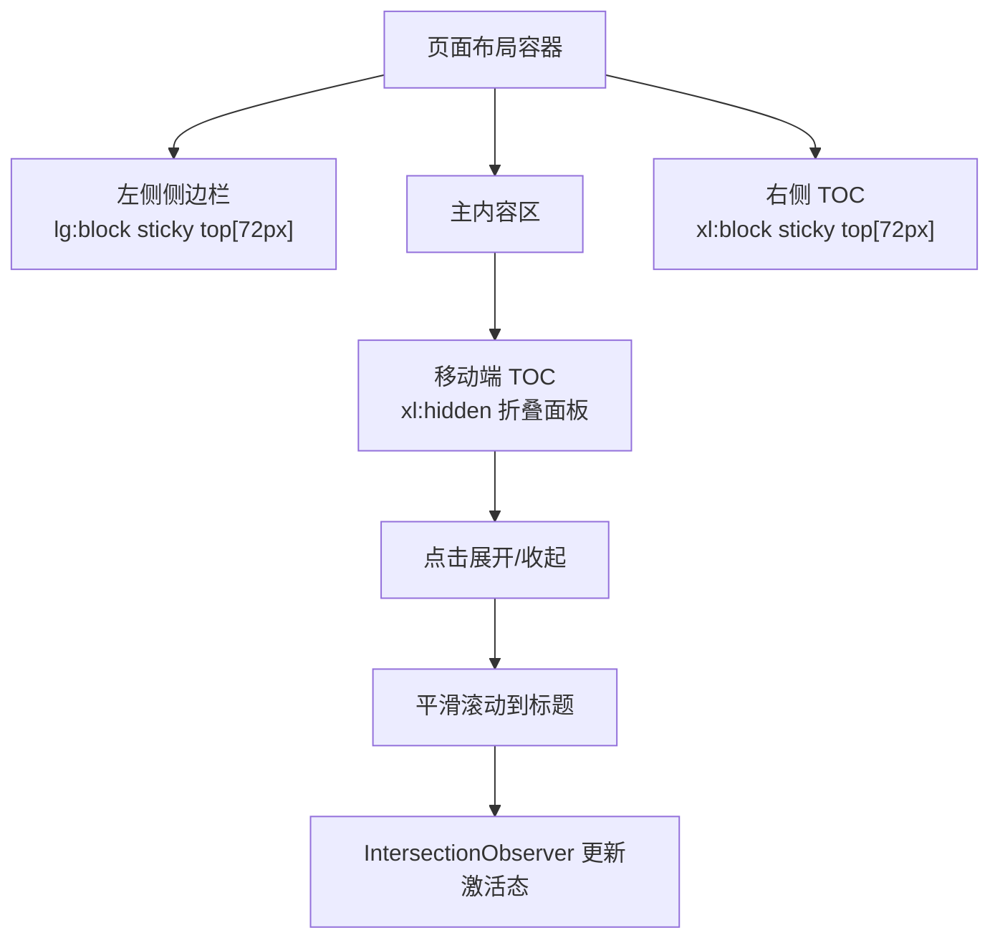
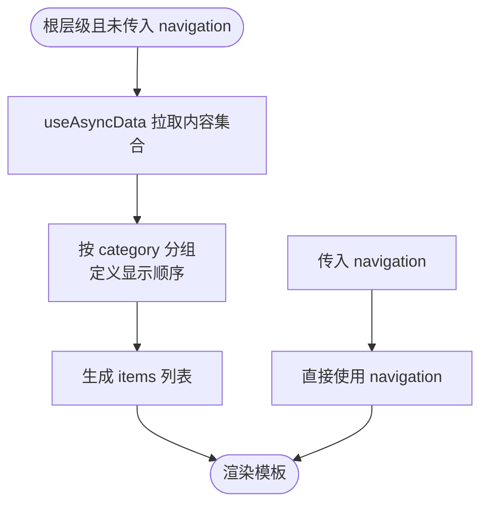
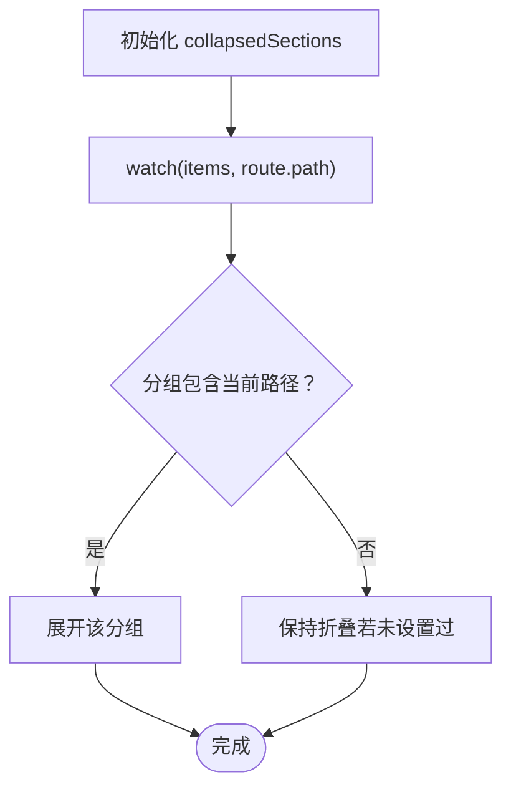
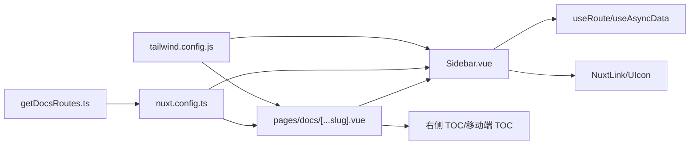

# UI渲染逻辑

<cite>
**本文引用的文件**
- [components/docs/Sidebar.vue](file://components/docs/Sidebar.vue)
- [pages/docs/[...slug].vue](file://pages/docs/[...slug].vue)
- [utils/getDocsRoutes.ts](file://utils/getDocsRoutes.ts)
- [nuxt.config.ts](file://nuxt.config.ts)
- [tailwind.config.js](file://tailwind.config.js)
</cite>

## 目录
1. [简介](#简介)
2. [项目结构](#项目结构)
3. [核心组件](#核心组件)
4. [架构总览](#架构总览)
5. [详细组件分析](#详细组件分析)
6. [依赖关系分析](#依赖关系分析)
7. [性能考量](#性能考量)
8. [故障排查指南](#故障排查指南)
9. [结论](#结论)
10. [附录](#附录)

## 简介
本文件围绕 DocsSidebar 组件的递归渲染架构与响应式 UI 设计进行深入解析，重点包括：
- 模板中 v-for 循环与递归调用 DocsSidebar 实现多级导航树的机制
- 区分 level=0 时的分组折叠面板与 level>0 时的嵌套链接渲染逻辑
- NuxtLink 如何通过 isActive 函数与当前路由集成实现激活状态高亮
- UIcon 组件在导航项中的图标渲染策略
- 结合 pages/docs/[...slug].vue 布局文件，解释左侧导航栏（lg:block）与右侧 TOC（xl:block）在不同断点下的显示策略及 sticky 定位实现的滚动跟随效果
- CSS 类名（如 group-hover、transition-colors）在交互反馈中的具体应用示例

## 项目结构
本项目采用“按功能分层”的组织方式，文档侧边栏位于 components/docs/Sidebar.vue，文档页面布局位于 pages/docs/[...slug].vue，内容路由生成由 utils/getDocsRoutes.ts 提供，UI 组件库与内容模块由 nuxt.config.ts 配置启用，Tailwind CSS 的主题与暗色模式在 tailwind.config.js 中定义。

**图表来源**
- [pages/docs/[...slug].vue](file://pages/docs/[...slug].vue#L1-L165)
- [components/docs/Sidebar.vue](file://components/docs/Sidebar.vue#L1-L106)
- [utils/getDocsRoutes.ts](file://utils/getDocsRoutes.ts#L1-L58)
- [nuxt.config.ts](file://nuxt.config.ts#L1-L91)
- [tailwind.config.js](file://tailwind.config.js#L1-L86)

**章节来源**
- [pages/docs/[...slug].vue](file://pages/docs/[...slug].vue#L1-L165)
- [components/docs/Sidebar.vue](file://components/docs/Sidebar.vue#L1-L106)
- [utils/getDocsRoutes.ts](file://utils/getDocsRoutes.ts#L1-L58)
- [nuxt.config.ts](file://nuxt.config.ts#L1-L91)
- [tailwind.config.js](file://tailwind.config.js#L1-L86)

## 核心组件
- DocsSidebar 组件负责渲染文档侧边栏导航树，支持：
  - 递归渲染多级导航结构
  - 响应式设计与无障碍属性
  - 自动高亮当前激活路由
  - 从内容集合自动分组生成导航（若未提供 navigation prop）
  - 分组折叠/展开，并根据当前路由自动展开对应分组
- 页面布局 pages/docs/[...slug].vue 负责：
  - 左侧 lg:block 的 DocsSidebar 固定侧边栏
  - 右侧 xl:block 的右侧 TOC（目录）
  - 不同断点下的显示策略与 sticky 定位实现滚动跟随

**章节来源**
- [components/docs/Sidebar.vue](file://components/docs/Sidebar.vue#L108-L177)
- [pages/docs/[...slug].vue](file://pages/docs/[...slug].vue#L1-L165)

## 架构总览
DocsSidebar 通过 props 接收 navigation 或在根层级自动拉取内容集合，计算 items 列表；模板中根据 level 判断渲染模式：level=0 时渲染分组标题与折叠按钮，点击切换折叠状态；level>0 时渲染嵌套链接或叶子节点链接。NuxtLink 通过 isActive(route.path) 判断当前激活状态，UIcon 根据是否激活与 hover 状态切换图标颜色。页面布局通过 Tailwind 断点控制左右侧栏显示，并使用 sticky 定位实现滚动跟随。

**图表来源**
- [components/docs/Sidebar.vue](file://components/docs/Sidebar.vue#L156-L177)
- [components/docs/Sidebar.vue](file://components/docs/Sidebar.vue#L185-L239)
- [components/docs/Sidebar.vue](file://components/docs/Sidebar.vue#L280-L289)
- [pages/docs/[...slug].vue](file://pages/docs/[...slug].vue#L1-L165)

## 详细组件分析

### 递归渲染与多级导航树
- v-for 遍历 items，每个 item 依据 level 决策渲染分支：
  - level=0 且 item.children 存在：渲染分组标题按钮与折叠箭头，点击切换 collapsedSections；子项容器使用 v-show 控制显隐，内部递归渲染 DocsSidebar(:level+1)
  - level>0：若 item.children 存在，先渲染一个带图标与标题的链接，再以缩进边框容器递归渲染子项；若无 children，则渲染叶子节点链接
- items 计算逻辑：
  - 若传入 navigation 则直接使用
  - 若根层级且未传入 navigation：自动查询内容集合，按 category 分组，定义显示顺序，生成分组标题项（children 为该分组下的叶子节点）

**图表来源**
- [components/docs/Sidebar.vue](file://components/docs/Sidebar.vue#L13-L106)
- [components/docs/Sidebar.vue](file://components/docs/Sidebar.vue#L185-L239)

**章节来源**
- [components/docs/Sidebar.vue](file://components/docs/Sidebar.vue#L13-L106)
- [components/docs/Sidebar.vue](file://components/docs/Sidebar.vue#L185-L239)

### 激活状态高亮与 NuxtLink 集成
- isActive(path)：比较当前路由路径与目标 path，返回布尔值
- NuxtLink：
  - 通过 :class 数组合并激活态与悬停态样式
  - 设置 :aria-current="isActive(path) ? 'page' : undefined" 提供无障碍语义
- 激活态样式：
  - 文字主色与背景高亮（含深色模式透明背景）
  - UIcon 在激活态使用主色，在非激活态使用 group-hover 切换到浅色

**图表来源**
- [components/docs/Sidebar.vue](file://components/docs/Sidebar.vue#L280-L289)
- [components/docs/Sidebar.vue](file://components/docs/Sidebar.vue#L53-L101)

**章节来源**
- [components/docs/Sidebar.vue](file://components/docs/Sidebar.vue#L53-L101)
- [components/docs/Sidebar.vue](file://components/docs/Sidebar.vue#L280-L289)

### 图标渲染策略（UIcon）
- 分组标题按钮内图标：当 item.icon 存在时渲染，用于标识分组
- 嵌套链接与叶子节点链接内图标：当 item.icon 存在时渲染
- 激活态与 hover 状态：
  - 激活态：UIcon 使用主色
  - 非激活态：使用 group-hover 切换到浅色，提供细腻的交互反馈

**图表来源**
- [components/docs/Sidebar.vue](file://components/docs/Sidebar.vue#L25-L38)
- [components/docs/Sidebar.vue](file://components/docs/Sidebar.vue#L64-L73)
- [components/docs/Sidebar.vue](file://components/docs/Sidebar.vue#L93-L101)

**章节来源**
- [components/docs/Sidebar.vue](file://components/docs/Sidebar.vue#L25-L38)
- [components/docs/Sidebar.vue](file://components/docs/Sidebar.vue#L64-L73)
- [components/docs/Sidebar.vue](file://components/docs/Sidebar.vue#L93-L101)

### 响应式布局与滚动跟随（lg/block 与 xl/block）
- 左侧导航栏（DocsSidebar）：
  - 在 lg 断点及以上显示（lg:block），使用 sticky top[72px] 与固定高度，配合滚动条美化
- 右侧 TOC：
  - 在 xl 断点及以上显示（xl:block），同样使用 sticky top[72px] 与固定高度
- 移动端 TOC：
  - 在 xl 以下显示为折叠面板，点击展开，内部使用平滑滚动与 IntersectionObserver 更新激活态

**图表来源**
- [pages/docs/[...slug].vue](file://pages/docs/[...slug].vue#L1-L165)

**章节来源**
- [pages/docs/[...slug].vue](file://pages/docs/[...slug].vue#L1-L165)

### 数据获取与分组逻辑
- 根层级（level=0 且未传入 navigation）自动拉取内容集合，选择必要字段并按 order 升序排列
- 按 category 分组，定义显示顺序，生成分组标题项（children 为该分组下的叶子节点）
- 若传入 navigation 则直接使用，避免重复计算

**图表来源**
- [components/docs/Sidebar.vue](file://components/docs/Sidebar.vue#L160-L177)
- [components/docs/Sidebar.vue](file://components/docs/Sidebar.vue#L185-L239)

**章节来源**
- [components/docs/Sidebar.vue](file://components/docs/Sidebar.vue#L160-L177)
- [components/docs/Sidebar.vue](file://components/docs/Sidebar.vue#L185-L239)

### 折叠状态与自动展开
- 使用 useState 保存折叠状态，确保组件重渲染时状态保持
- watch(items, route.path)：在根层级监听 items 与当前路径变化，若某分组包含当前路径则展开，否则默认折叠
- toggleSection(title)：点击分组标题切换折叠状态

**图表来源**
- [components/docs/Sidebar.vue](file://components/docs/Sidebar.vue#L241-L268)
- [components/docs/Sidebar.vue](file://components/docs/Sidebar.vue#L274-L276)

**章节来源**
- [components/docs/Sidebar.vue](file://components/docs/Sidebar.vue#L241-L268)
- [components/docs/Sidebar.vue](file://components/docs/Sidebar.vue#L274-L276)

### CSS 类名与交互反馈
- group-hover：在非激活态下，通过 group-hover 将 UIcon 颜色从浅灰切换到更深色，提供悬停反馈
- transition-colors：在链接与图标上统一使用过渡动画，使状态切换更顺滑
- 深色模式：通过 dark: 前缀在深色主题下应用不同的颜色与背景
- 激活态：使用主色文字与浅色背景高亮，增强可读性与视觉引导

**章节来源**
- [components/docs/Sidebar.vue](file://components/docs/Sidebar.vue#L53-L101)
- [components/docs/Sidebar.vue](file://components/docs/Sidebar.vue#L280-L289)

## 依赖关系分析
- DocsSidebar 依赖：
  - Nuxt 路由：useRoute、useAsyncData
  - 内容集合：queryCollection（用于自动分组）
  - UI 组件：NuxtLink、UIcon
  - 状态管理：useState、watch、computed
- 页面布局依赖：
  - DocsSidebar 组件
  - Tailwind 断点与 sticky 定位
  - IntersectionObserver 与平滑滚动实现 TOC 激活态
- 工具与配置：
  - nuxt.config.ts 启用 @nuxt/ui 与 @nuxt/content，配置预渲染与字体
  - utils/getDocsRoutes.ts 生成文档路由，辅助静态预渲染
  - tailwind.config.js 定义主题色与动画

**图表来源**
- [components/docs/Sidebar.vue](file://components/docs/Sidebar.vue#L156-L177)
- [pages/docs/[...slug].vue](file://pages/docs/[...slug].vue#L1-L165)
- [utils/getDocsRoutes.ts](file://utils/getDocsRoutes.ts#L1-L58)
- [nuxt.config.ts](file://nuxt.config.ts#L1-L91)
- [tailwind.config.js](file://tailwind.config.js#L1-L86)

**章节来源**
- [components/docs/Sidebar.vue](file://components/docs/Sidebar.vue#L156-L177)
- [pages/docs/[...slug].vue](file://pages/docs/[...slug].vue#L1-L165)
- [utils/getDocsRoutes.ts](file://utils/getDocsRoutes.ts#L1-L58)
- [nuxt.config.ts](file://nuxt.config.ts#L1-L91)
- [tailwind.config.js](file://tailwind.config.js#L1-L86)

## 性能考量
- useAsyncData 在根层级异步拉取内容，避免阻塞客户端导航
- v-show 控制子项容器显隐，减少 DOM 重排
- watch 仅在根层级监听 items 与路由变化，避免不必要的重渲染
- 折叠状态使用 useState 保持，减少状态丢失
- TOC 使用 IntersectionObserver 与平滑滚动，优化滚动性能

[本节为通用性能讨论，无需特定文件引用]

## 故障排查指南
- 导航加载失败提示：当 useAsyncData 拉取内容失败时，组件会显示错误信息，便于定位问题
- 折叠状态异常：检查 collapsedSections 的初始化与 toggleSection 的切换逻辑
- 激活态不生效：确认 isActive 与当前路由路径一致，检查 NuxtLink 的 :class 与 :aria-current
- 图标不显示：确认 item.icon 是否存在，以及 UIcon 的 name 与可用图标集一致
- 响应式布局异常：检查 Tailwind 断点类名与页面容器布局，确保 sticky top 值与头部高度一致

**章节来源**
- [components/docs/Sidebar.vue](file://components/docs/Sidebar.vue#L1-L12)
- [components/docs/Sidebar.vue](file://components/docs/Sidebar.vue#L241-L268)
- [components/docs/Sidebar.vue](file://components/docs/Sidebar.vue#L280-L289)
- [pages/docs/[...slug].vue](file://pages/docs/[...slug].vue#L1-L165)

## 结论
DocsSidebar 通过清晰的 level 分支与递归渲染，实现了灵活的多级导航树；结合 NuxtLink 的激活态高亮与 UIcon 的图标策略，提供了良好的可读性与交互反馈；页面布局利用 Tailwind 断点与 sticky 定位，实现了在不同设备上的导航与 TOC 的最佳展示。整体架构具备良好的可维护性与扩展性，适合在内容型站点中复用。

[本节为总结性内容，无需特定文件引用]

## 附录
- 预渲染路由生成：utils/getDocsRoutes.ts 递归扫描 content/docs 目录，生成完整文档路由列表，供 nuxt.config.ts 的 prerender 使用
- UI 组件库与内容模块：nuxt.config.ts 启用 @nuxt/ui 与 @nuxt/content，确保 UI 组件与内容渲染能力
- 主题与暗色模式：tailwind.config.js 定义主题色与动画，支持深色模式切换

**章节来源**
- [utils/getDocsRoutes.ts](file://utils/getDocsRoutes.ts#L1-L58)
- [nuxt.config.ts](file://nuxt.config.ts#L1-L91)
- [tailwind.config.js](file://tailwind.config.js#L1-L86)