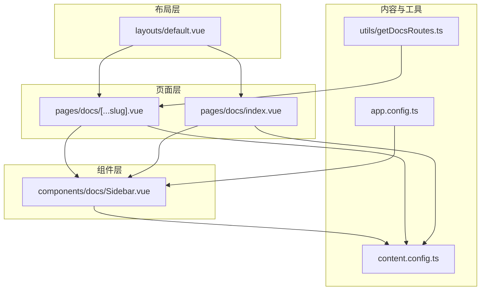
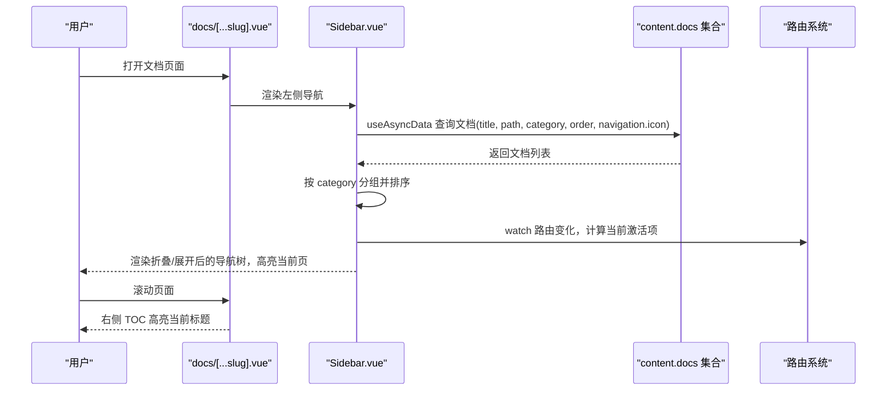
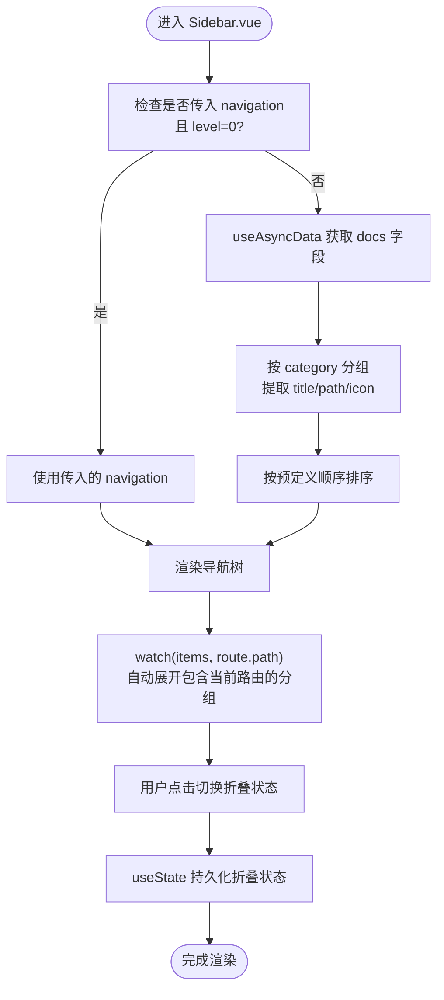
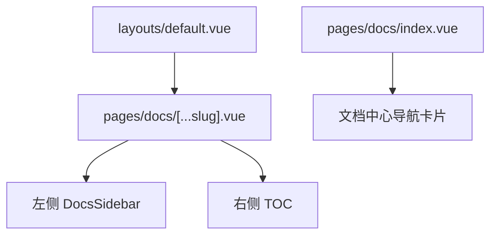
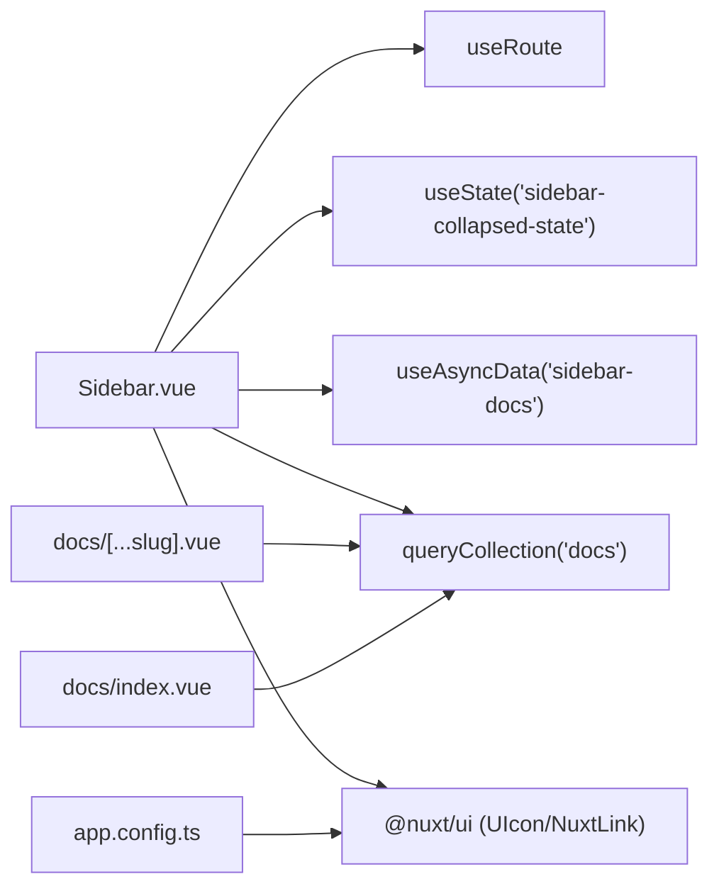

# 导航系统

<cite>
**本文引用的文件**
- [components/docs/Sidebar.vue](file://components/docs/Sidebar.vue)
- [pages/docs/[...slug].vue](file://pages/docs/[...slug].vue)
- [pages/docs/index.vue](file://pages/docs/index.vue)
- [layouts/default.vue](file://layouts/default.vue)
- [content.config.ts](file://content.config.ts)
- [utils/getDocsRoutes.ts](file://utils/getDocsRoutes.ts)
- [app.config.ts](file://app.config.ts)
</cite>

## 目录
1. [简介](#简介)
2. [项目结构](#项目结构)
3. [核心组件](#核心组件)
4. [架构总览](#架构总览)
5. [详细组件分析](#详细组件分析)
6. [依赖关系分析](#依赖关系分析)
7. [性能考量](#性能考量)
8. [故障排查指南](#故障排查指南)
9. [结论](#结论)
10. [附录](#附录)

## 简介
本技术文档围绕 buidai 项目的导航系统，深入解析 Sidebar.vue 组件的实现机制，涵盖以下关键点：
- 递归渲染逻辑与层级控制
- 分组折叠/展开功能与跨路由折叠状态持久化
- 当前路由高亮机制与 isActive 函数
- 通过 useAsyncData 从 content 集合自动获取文档元数据并按 category 分组聚合
- 左侧导航栏与右侧 TOC 的协同工作机制
- 响应式设计在不同屏幕尺寸下的表现差异

## 项目结构
导航系统主要由以下模块构成：
- 页面层：docs/[...slug].vue 负责文档页面渲染与右侧 TOC；docs/index.vue 提供文档中心首页的导航卡片视图
- 布局层：default.vue 提供基础布局，承载导航组件
- 组件层：Sidebar.vue 实现文档侧边栏导航树的渲染、分组、折叠与高亮
- 内容配置：content.config.ts 定义 docs 集合的 schema，确保 title、path、category、order 等字段可用
- 工具：getDocsRoutes.ts 用于生成文档路由列表，辅助预渲染与静态生成

图表来源
- [pages/docs/[...slug].vue](file://pages/docs/[...slug].vue#L1-L165)
- [pages/docs/index.vue](file://pages/docs/index.vue#L1-L129)
- [layouts/default.vue](file://layouts/default.vue#L1-L25)
- [components/docs/Sidebar.vue](file://components/docs/Sidebar.vue#L1-L106)
- [content.config.ts](file://content.config.ts#L1-L57)
- [utils/getDocsRoutes.ts](file://utils/getDocsRoutes.ts#L1-L58)
- [app.config.ts](file://app.config.ts#L1-L83)

章节来源
- [pages/docs/[...slug].vue](file://pages/docs/[...slug].vue#L1-L165)
- [pages/docs/index.vue](file://pages/docs/index.vue#L1-L129)
- [layouts/default.vue](file://layouts/default.vue#L1-L25)
- [content.config.ts](file://content.config.ts#L1-L57)
- [utils/getDocsRoutes.ts](file://utils/getDocsRoutes.ts#L1-L58)
- [app.config.ts](file://app.config.ts#L1-L83)

## 核心组件
Sidebar.vue 是文档侧边栏的核心，承担以下职责：
- 递归渲染导航树，支持多层级
- 从 content.docs 集合自动拉取文档元数据（title、path、category、order、navigation.icon），并按 category 分组聚合
- 分组折叠/展开，支持跨路由折叠状态持久化
- 当前路由高亮，基于 isActive 函数判断
- 骨架屏与错误提示，提升用户体验

章节来源
- [components/docs/Sidebar.vue](file://components/docs/Sidebar.vue#L1-L106)
- [components/docs/Sidebar.vue](file://components/docs/Sidebar.vue#L156-L177)
- [components/docs/Sidebar.vue](file://components/docs/Sidebar.vue#L185-L239)
- [components/docs/Sidebar.vue](file://components/docs/Sidebar.vue#L241-L268)
- [components/docs/Sidebar.vue](file://components/docs/Sidebar.vue#L280-L289)

## 架构总览
Sidebar.vue 与页面层协作，形成“左侧导航 + 右侧 TOC”的双栏导航体系：
- 左侧导航：Sidebar.vue 基于 content.docs 自动生成导航树，支持分组折叠与高亮
- 右侧 TOC：docs/[...slug].vue 在桌面端展示页面内标题索引，移动端提供折叠式 TOC
- 响应式：左侧导航在小屏隐藏，右侧 TOC 在超小屏隐藏，中大屏展示

图表来源
- [pages/docs/[...slug].vue](file://pages/docs/[...slug].vue#L1-L165)
- [components/docs/Sidebar.vue](file://components/docs/Sidebar.vue#L156-L239)
- [components/docs/Sidebar.vue](file://components/docs/Sidebar.vue#L241-L289)

## 详细组件分析

### Sidebar.vue 组件实现机制
- 递归渲染逻辑
  - 顶层（level=0）作为分组容器，若存在 children 则渲染为可折叠的分组标题
  - 子层级（level>0）渲染为具体链接或嵌套分组容器
  - 通过递归调用自身实现无限层级渲染
- 分组折叠/展开
  - 使用 useState 维护 collapsedSections 状态，键为分组标题，值为是否折叠
  - 初始时默认全部折叠；当某分组包含当前激活路由时自动展开
  - 用户点击分组标题切换折叠状态
- 当前路由高亮
  - isActive 函数比较当前路由 path 与导航项 path，相等即高亮
  - 高亮时设置 aria-current="page"，增强无障碍性
- 自动获取文档元数据与分组聚合
  - 仅在根层级且未显式传入 navigation 时，使用 useAsyncData 从 content.docs 查询所需字段
  - 按 category 分组，支持 navigation.icon 字段作为分组图标
  - 分组顺序遵循预定义列表（指南、框架、未分类），其余按字母排序
- 骨架屏与错误处理
  - pending 时显示骨架屏，提升首屏体验
  - error 时显示错误信息，便于定位问题

图表来源
- [components/docs/Sidebar.vue](file://components/docs/Sidebar.vue#L156-L239)
- [components/docs/Sidebar.vue](file://components/docs/Sidebar.vue#L241-L289)

章节来源
- [components/docs/Sidebar.vue](file://components/docs/Sidebar.vue#L1-L106)
- [components/docs/Sidebar.vue](file://components/docs/Sidebar.vue#L156-L177)
- [components/docs/Sidebar.vue](file://components/docs/Sidebar.vue#L185-L239)
- [components/docs/Sidebar.vue](file://components/docs/Sidebar.vue#L241-L289)

### 与页面布局的协同机制
- 左侧导航栏
  - docs/[...slug].vue 在桌面端（≥ lg）显示左侧 DocsSidebar，采用 sticky 布局，固定在可视高度范围内
  - 在小屏隐藏，避免遮挡内容
- 右侧 TOC
  - 桌面端（≥ xl）显示右侧 TOC，高亮当前标题并支持点击跳转
  - 移动端提供折叠式 TOC，点击展开后可选择章节
- 布局与导航的配合
  - default.vue 提供基础布局，保证导航与内容区域的视觉一致性
  - 两栏导航相互补充：左侧帮助用户在文档间跳转，右侧帮助用户在当前页面内定位

图表来源
- [layouts/default.vue](file://layouts/default.vue#L1-L25)
- [pages/docs/[...slug].vue](file://pages/docs/[...slug].vue#L1-L165)
- [pages/docs/index.vue](file://pages/docs/index.vue#L1-L129)

章节来源
- [layouts/default.vue](file://layouts/default.vue#L1-L25)
- [pages/docs/[...slug].vue](file://pages/docs/[...slug].vue#L1-L165)
- [pages/docs/index.vue](file://pages/docs/index.vue#L1-L129)

### 响应式设计与屏幕尺寸差异
- 小屏（< lg）
  - 左侧导航隐藏，避免遮挡正文
  - 右侧 TOC 隐藏，移动端使用折叠式 TOC
- 中屏（≥ lg 且 < xl）
  - 左侧导航显示，右侧 TOC 隐藏
- 大屏及以上（≥ xl）
  - 左侧导航与右侧 TOC 同时显示，提供最佳导航体验

章节来源
- [pages/docs/[...slug].vue](file://pages/docs/[...slug].vue#L1-L165)

### 内容集合与路由生成
- content.config.ts
  - 定义 docs 集合 schema，包含 title、description、category、order、links 等字段
  - 为 Sidebar.vue 的分组与排序提供数据基础
- utils/getDocsRoutes.ts
  - 递归扫描 content/docs 目录，生成文档路由列表
  - 用于 Nitro 预渲染配置，确保文档页面可被静态生成

章节来源
- [content.config.ts](file://content.config.ts#L1-L57)
- [utils/getDocsRoutes.ts](file://utils/getDocsRoutes.ts#L1-L58)

## 依赖关系分析
- 组件耦合
  - Sidebar.vue 依赖路由系统（useRoute）、状态管理（useState）、异步数据（useAsyncData）
  - 与 Nuxt UI 集成（UIcon、NuxtLink），并受 app.config.ts 的全局 UI 配置影响
- 数据流
  - content.docs 集合提供原始文档数据，Sidebar.vue 负责分组与排序
  - docs/[...slug].vue 负责页面内容与 TOC 的渲染
- 外部依赖
  - @nuxt/content 提供 queryCollection API
  - @nuxt/ui 提供图标与组件样式

图表来源
- [components/docs/Sidebar.vue](file://components/docs/Sidebar.vue#L156-L289)
- [pages/docs/[...slug].vue](file://pages/docs/[...slug].vue#L1-L165)
- [pages/docs/index.vue](file://pages/docs/index.vue#L1-L129)
- [app.config.ts](file://app.config.ts#L1-L83)

章节来源
- [components/docs/Sidebar.vue](file://components/docs/Sidebar.vue#L156-L289)
- [pages/docs/[...slug].vue](file://pages/docs/[...slug].vue#L1-L165)
- [pages/docs/index.vue](file://pages/docs/index.vue#L1-L129)
- [app.config.ts](file://app.config.ts#L1-L83)

## 性能考量
- 异步数据加载
  - useAsyncData 在根层级懒加载文档数据，避免阻塞客户端导航
  - pending 时显示骨架屏，减少白屏时间
- 渲染优化
  - 递归渲染仅在需要时进行，children 为空时不渲染子树
  - 折叠状态使用 useState，避免每次重渲染丢失状态
- 分组与排序
  - 分组与排序在内存中完成，复杂度近似 O(n log n)，n 为文档数量
- TOC 观察器
  - IntersectionObserver 仅在桌面端启用，移动端使用折叠式 TOC，降低资源消耗

章节来源
- [components/docs/Sidebar.vue](file://components/docs/Sidebar.vue#L156-L239)
- [pages/docs/[...slug].vue](file://pages/docs/[...slug].vue#L231-L279)

## 故障排查指南
- 导航加载失败
  - 检查 useAsyncData 的错误输出，确认 content.docs 集合是否存在
  - 确认 content.config.ts 中 docs 集合 schema 是否正确
- 折叠状态异常
  - 确认 useState 的键名一致（'sidebar-collapsed-state'），避免跨组件冲突
  - 检查 watch 逻辑是否被 level 条件过滤
- 高亮不生效
  - 确认 isActive 比较的是 route.path 与导航项 path
  - 检查路由编码与路径清理逻辑（docs/[...slug].vue 中对路径的解码与标准化）
- 分组顺序不符合预期
  - 确认 category 字段值与预定义顺序一致
  - 检查未分类项的处理逻辑

章节来源
- [components/docs/Sidebar.vue](file://components/docs/Sidebar.vue#L1-L106)
- [components/docs/Sidebar.vue](file://components/docs/Sidebar.vue#L241-L289)
- [pages/docs/[...slug].vue](file://pages/docs/[...slug].vue#L170-L210)
- [content.config.ts](file://content.config.ts#L1-L57)

## 结论
Sidebar.vue 通过 useAsyncData 与 content.docs 集合实现了自动化导航生成，结合 useState 的状态持久化与 watch 的路由联动，提供了稳定可靠的分组折叠与高亮体验。与 docs/[...slug].vue 的右侧 TOC 协同工作，形成完整的文档导航体系。响应式布局在不同屏幕尺寸下提供一致且高效的浏览体验。

## 附录
- Nuxt UI 配置
  - app.config.ts 中的 ui.colors.primary 与 icons 映射会影响 Sidebar.vue 的图标与主题色
- 文档路由生成
  - utils/getDocsRoutes.ts 用于生成预渲染路由列表，确保文档页面可被静态生成

章节来源
- [app.config.ts](file://app.config.ts#L1-L83)
- [utils/getDocsRoutes.ts](file://utils/getDocsRoutes.ts#L1-L58)