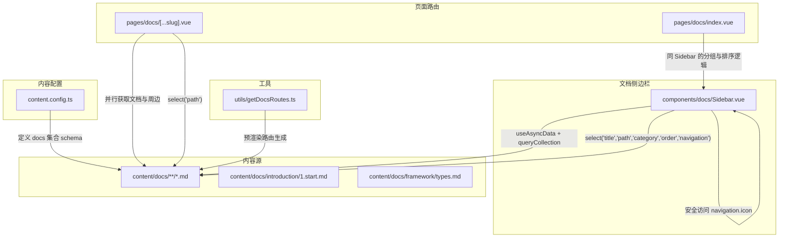
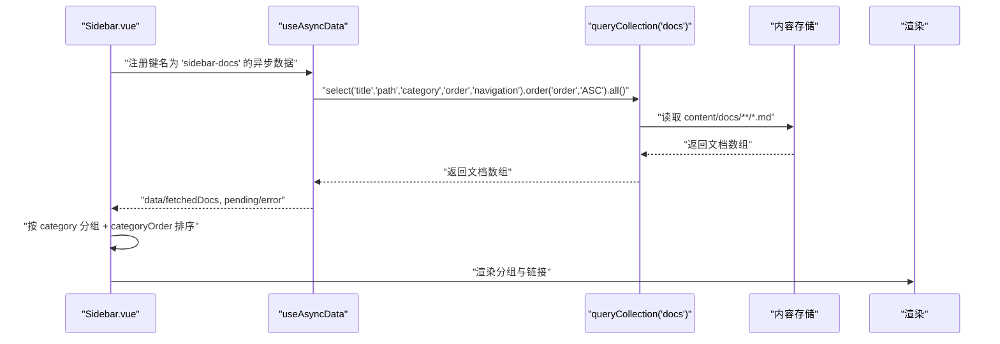
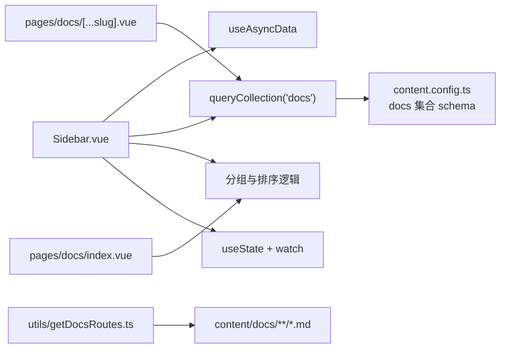

# 数据获取与聚合

<cite>
**本文引用的文件**
- [components/docs/Sidebar.vue](file://components/docs/Sidebar.vue)
- [content.config.ts](file://content.config.ts)
- [pages/docs/[...slug].vue](file://pages/docs/[...slug].vue)
- [pages/docs/index.vue](file://pages/docs/index.vue)
- [content/docs/introduction/1.start.md](file://content/docs/introduction/1.start.md)
- [content/docs/framework/types.md](file://content/docs/framework/types.md)
- [utils/getDocsRoutes.ts](file://utils/getDocsRoutes.ts)
</cite>

## 目录
1. [简介](#简介)
2. [项目结构](#项目结构)
3. [核心组件](#核心组件)
4. [架构总览](#架构总览)
5. [详细组件分析](#详细组件分析)
6. [依赖分析](#依赖分析)
7. [性能考量](#性能考量)
8. [故障排查指南](#故障排查指南)
9. [结论](#结论)
10. [附录](#附录)

## 简介
本节聚焦 Sidebar.vue 组件中基于 useAsyncData 的文档元数据自动获取机制，系统阐述以下要点：
- queryCollection('docs') 如何从 content/docs 目录下的 Markdown 文件中提取 title、path、category、order、navigation 等 front-matter 字段；
- 如何按 category 进行分组聚合；
- categoryOrder 预定义排序逻辑（'指南', '框架', '未分类'）的实现方式；
- 当文档未指定 category 时默认归类为'未分类'的处理规则；
- 结合 content.config.ts 配置文件，说明内容集合的定义与查询接口的集成方式；
- 实际代码示例展示 navigation.icon 等嵌套字段的安全访问策略；
- 解释 select() 方法对性能优化的作用。

## 项目结构
围绕文档导航与内容集合的关键文件如下所示：

图表来源
- [components/docs/Sidebar.vue](file://components/docs/Sidebar.vue#L160-L177)
- [content.config.ts](file://content.config.ts#L17-L32)
- [pages/docs/[...slug].vue](file://pages/docs/[...slug].vue#L185-L220)
- [pages/docs/index.vue](file://pages/docs/index.vue#L95-L128)
- [utils/getDocsRoutes.ts](file://utils/getDocsRoutes.ts#L1-L58)

章节来源
- [components/docs/Sidebar.vue](file://components/docs/Sidebar.vue#L160-L239)
- [content.config.ts](file://content.config.ts#L1-L57)
- [pages/docs/[...slug].vue](file://pages/docs/[...slug].vue#L185-L220)
- [pages/docs/index.vue](file://pages/docs/index.vue#L95-L128)
- [utils/getDocsRoutes.ts](file://utils/getDocsRoutes.ts#L1-L58)

## 核心组件
本节深入剖析 Sidebar.vue 的数据获取与聚合逻辑，重点包括：
- useAsyncData 在根层级懒加载文档列表；
- queryCollection('docs') 的字段选择与排序；
- 分组与排序策略；
- 嵌套字段 navigation.icon 的安全访问；
- 折叠状态与当前激活路由联动。

章节来源
- [components/docs/Sidebar.vue](file://components/docs/Sidebar.vue#L160-L239)

## 架构总览
Sidebar.vue 作为文档侧边栏的根组件，负责：
- 在未显式传入 navigation 的情况下，自动从 content/docs 集合中抓取文档元数据；
- 仅在根层级（level=0）执行自动抓取，避免重复请求；
- 通过 select() 限定所需字段，减少传输与序列化开销；
- 按 order 升序排序；
- 按 category 分组，使用 categoryOrder 控制分组显示顺序；
- 安全访问 navigation.icon 等嵌套字段；
- 基于当前路由自动展开包含该页面的分组。

图表来源
- [components/docs/Sidebar.vue](file://components/docs/Sidebar.vue#L160-L239)
- [content.config.ts](file://content.config.ts#L17-L32)

## 详细组件分析

### 数据获取与字段选择（useAsyncData + queryCollection）
- 仅在根层级（level=0）且未传入 navigation 时触发自动抓取；
- 使用 queryCollection('docs') 获取文档；
- 通过 select() 指定所需字段：title、path、category、order、navigation；
- 使用 order 字段升序排序；
- 异常捕获并抛出，便于上层处理。

章节来源
- [components/docs/Sidebar.vue](file://components/docs/Sidebar.vue#L160-L177)
- [content.config.ts](file://content.config.ts#L17-L32)

### 分组与排序（按 category 聚合）
- 遍历 fetchedDocs，优先使用 front-matter 中的 category，若缺失则归为“未分类”；
- 将文档转换为导航项（title、path、icon、children），其中 children 在扁平转分组模式下为空；
- 定义 categoryOrder：['指南', '框架', '未分类']；
- 排序规则：
  - 若两个分组均在预定义列表中，按列表顺序；
  - 若仅一方在预定义列表中，优先该方；
  - 若均不在预定义列表中，按字典序比较；
- 最终输出为分组标题（无 path）及子项数组。

章节来源
- [components/docs/Sidebar.vue](file://components/docs/Sidebar.vue#L188-L239)

### 嵌套字段的安全访问（navigation.icon）
- 对 navigation 字段进行类型检查，确保其为对象且非 null；
- 动态访问 navigation.icon，避免直接访问布尔值或空值导致的错误；
- 该策略保证即使 front-matter 中 navigation 为布尔值或未定义，也能安全运行。

章节来源
- [components/docs/Sidebar.vue](file://components/docs/Sidebar.vue#L197-L202)

### 与内容配置的集成（content.config.ts）
- content.config.ts 定义 docs 集合，source 为 docs/**/*.md，schema 包含 title、description、category（可选）、order（可选）等；
- 该 schema 与 Sidebar.vue 中 select 的字段一致，确保查询结果结构稳定；
- 由于 docs 为 page 类型，系统会自动生成 path、title、description、navigation 等字段，供 Sidebar.vue 直接使用。

章节来源
- [content.config.ts](file://content.config.ts#L17-L32)
- [content/docs/framework/types.md](file://content/docs/framework/types.md#L52-L91)

### 与页面路由的协同（pages/docs/[...slug].vue 与 pages/docs/index.vue）
- 页面路由在并行获取文档内容与周边内容时，同样使用 queryCollection('docs')，并通过 select('path') 精简字段；
- pages/docs/index.vue 采用与 Sidebar.vue 相同的分组与排序逻辑，确保首页与侧边栏展示一致。

章节来源
- [pages/docs/[...slug].vue](file://pages/docs/[...slug].vue#L185-L220)
- [pages/docs/index.vue](file://pages/docs/index.vue#L95-L128)

### 示例：front-matter 中 navigation.icon 的安全访问
- 示例 Markdown 文件 front-matter 中包含 navigation.title 与 navigation.icon；
- Sidebar.vue 在分组阶段安全地从 navigation 对象中提取 icon，避免类型错误；
- 该示例体现了对嵌套字段的健壮性处理。

章节来源
- [content/docs/introduction/1.start.md](file://content/docs/introduction/1.start.md#L1-L10)
- [components/docs/Sidebar.vue](file://components/docs/Sidebar.vue#L197-L202)

### select() 方法的性能优化作用
- 通过 select() 仅返回 title、path、category、order、navigation 等必要字段，避免返回整个文档内容（如 body）；
- 减少网络传输与前端序列化/反序列化开销；
- 与 pages/docs/[...slug].vue 中对 path 的精简选择相呼应，形成一致的性能策略。

章节来源
- [components/docs/Sidebar.vue](file://components/docs/Sidebar.vue#L167-L170)
- [pages/docs/[...slug].vue](file://pages/docs/[...slug].vue#L194-L194)

### 折叠状态与当前激活路由联动
- 使用 useState 保存分组折叠状态；
- watch 监听 items 与当前路由，自动展开包含当前页面的分组；
- 未设置过的分组默认折叠，已设置过的保持用户交互状态。

章节来源
- [components/docs/Sidebar.vue](file://components/docs/Sidebar.vue#L241-L268)

## 依赖分析
Sidebar.vue 的关键依赖关系如下：

图表来源
- [components/docs/Sidebar.vue](file://components/docs/Sidebar.vue#L160-L268)
- [content.config.ts](file://content.config.ts#L17-L32)
- [pages/docs/[...slug].vue](file://pages/docs/[...slug].vue#L185-L220)
- [pages/docs/index.vue](file://pages/docs/index.vue#L95-L128)
- [utils/getDocsRoutes.ts](file://utils/getDocsRoutes.ts#L1-L58)

章节来源
- [components/docs/Sidebar.vue](file://components/docs/Sidebar.vue#L160-L268)
- [content.config.ts](file://content.config.ts#L17-L32)
- [pages/docs/[...slug].vue](file://pages/docs/[...slug].vue#L185-L220)
- [pages/docs/index.vue](file://pages/docs/index.vue#L95-L128)
- [utils/getDocsRoutes.ts](file://utils/getDocsRoutes.ts#L1-L58)

## 性能考量
- 字段裁剪：通过 select() 仅获取必要字段，避免传输冗余内容；
- 懒加载：仅在根层级且未传入 navigation 时才发起请求，减少不必要的网络开销；
- 排序优化：利用 schema 中的 order 字段进行升序排序，避免前端二次排序；
- 状态持久化：useState 保持折叠状态，避免频繁重渲染导致的状态丢失；
- 预渲染路由：getDocsRoutes.ts 生成静态路由，有助于整体性能与 SEO。

章节来源
- [components/docs/Sidebar.vue](file://components/docs/Sidebar.vue#L160-L177)
- [utils/getDocsRoutes.ts](file://utils/getDocsRoutes.ts#L1-L58)

## 故障排查指南
- 文档未显示或分组异常
  - 检查 content.config.ts 中 docs 集合的 schema 是否包含 category、order、navigation 等字段；
  - 确认 Markdown front-matter 中是否正确设置 category、order、navigation.icon；
  - 确认 Sidebar.vue 的分组与排序逻辑未被外部 props 覆盖。
- 请求失败或空白
  - useAsyncData 捕获异常并抛出，可在上层组件中统一处理错误状态；
  - 检查 queryCollection('docs') 的字段选择是否与 schema 一致。
- 折叠状态不生效
  - 确认 useState 的键名与组件实例一致；
  - 确认 watch 依赖项（items 与路由）是否正确更新。

章节来源
- [components/docs/Sidebar.vue](file://components/docs/Sidebar.vue#L160-L177)
- [content.config.ts](file://content.config.ts#L17-L32)

## 结论
Sidebar.vue 通过 useAsyncData 与 queryCollection('docs') 实现了文档元数据的懒加载与聚合，结合 content.config.ts 的 schema 定义，确保了字段结构的一致性与可维护性。通过 select() 的字段裁剪与 order 的排序，兼顾了性能与用户体验；通过 categoryOrder 的预定义排序与“未分类”的兜底策略，保证了导航结构的稳定性与可预期性。同时，对 navigation.icon 等嵌套字段的安全访问策略提升了系统的健壮性。

## 附录
- 示例 Markdown front-matter 中 navigation 字段的结构与 icon 的使用方式，可参考 content/docs/introduction/1.start.md 与 content/docs/framework/types.md 中的相关片段。

章节来源
- [content/docs/introduction/1.start.md](file://content/docs/introduction/1.start.md#L1-L10)
- [content/docs/framework/types.md](file://content/docs/framework/types.md#L52-L91)