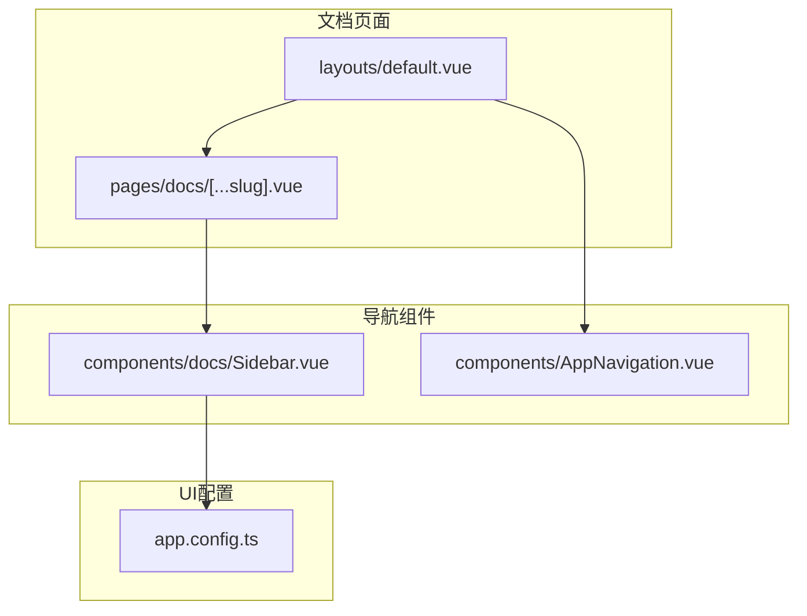
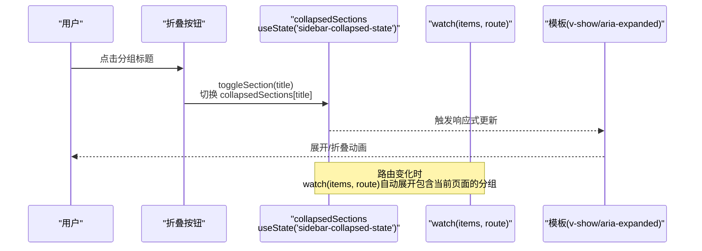
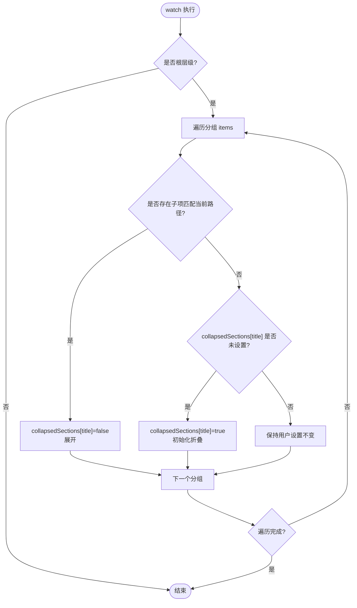
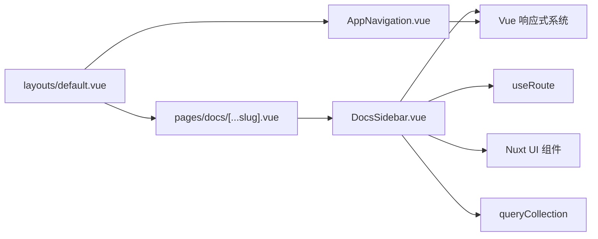

# 状态管理与交互

<cite>
**本文引用的文件**
- [components/docs/Sidebar.vue](file://components/docs/Sidebar.vue)
- [pages/docs/[...slug].vue](file://pages/docs/[...slug].vue)
- [layouts/default.vue](file://layouts/default.vue)
- [components/AppNavigation.vue](file://components/AppNavigation.vue)
- [app.config.ts](file://app.config.ts)
</cite>

## 目录
1. [简介](#简介)
2. [项目结构](#项目结构)
3. [核心组件](#核心组件)
4. [架构总览](#架构总览)
5. [详细组件分析](#详细组件分析)
6. [依赖关系分析](#依赖关系分析)
7. [性能考量](#性能考量)
8. [故障排查指南](#故障排查指南)
9. [结论](#结论)

## 简介
本文件围绕导航系统的状态管理实现进行深入剖析，重点说明以下方面：
- 如何使用 useState 创建跨组件实例持久化的折叠状态存储，并解释其在服务端渲染与客户端 hydration 中的一致性保证。
- watch 监听器如何在路由变化时自动展开包含当前页面的分组，同时保持用户手动折叠状态不被覆盖的精细化控制逻辑。
- toggleSection 方法触发 collapsedSections.value 更新及 UI 重渲染的响应式流程。
- v-show 与 transition-all 类在折叠动画中的协同工作原理。
- aria-expanded 属性如何提升无障碍访问体验，以及按钮点击事件与键盘交互的兼容性设计。

## 项目结构
本项目的导航体系由“文档侧边栏”“文档页面布局”“顶部导航”三部分组成，其中文档侧边栏承担折叠状态的持久化与自动展开逻辑，文档页面负责承载侧边栏并提供上下文数据，顶部导航负责移动端菜单与滚动态样式。

图表来源
- [pages/docs/[...slug].vue](file://pages/docs/[...slug].vue#L1-L20)
- [layouts/default.vue](file://layouts/default.vue#L1-L20)
- [components/docs/Sidebar.vue](file://components/docs/Sidebar.vue#L1-L20)
- [components/AppNavigation.vue](file://components/AppNavigation.vue#L1-L20)
- [app.config.ts](file://app.config.ts#L1-L20)

章节来源
- [pages/docs/[...slug].vue](file://pages/docs/[...slug].vue#L1-L20)
- [layouts/default.vue](file://layouts/default.vue#L1-L20)
- [components/docs/Sidebar.vue](file://components/docs/Sidebar.vue#L1-L20)
- [components/AppNavigation.vue](file://components/AppNavigation.vue#L1-L20)
- [app.config.ts](file://app.config.ts#L1-L20)

## 核心组件
- 文档侧边栏（DocsSidebar）：负责分组折叠/展开、自动展开当前分组、无障碍属性、递归渲染。
- 文档页面（[...slug].vue）：承载 DocsSidebar，提供页面内容与面包屑等。
- 顶部导航（AppNavigation）：移动端菜单开关、滚动态样式、路由变化时关闭菜单。
- 应用配置（app.config.ts）：统一 UI 图标与主题色，影响导航样式一致性。

章节来源
- [components/docs/Sidebar.vue](file://components/docs/Sidebar.vue#L108-L294)
- [pages/docs/[...slug].vue](file://pages/docs/[...slug].vue#L1-L120)
- [components/AppNavigation.vue](file://components/AppNavigation.vue#L140-L309)
- [app.config.ts](file://app.config.ts#L1-L83)

## 架构总览
文档侧边栏通过 useState 在组件实例间共享折叠状态；watch 监听 items 与路由路径，自动展开包含当前页面的分组；toggleSection 切换状态并驱动 UI 重渲染；v-show 与过渡类实现平滑折叠动画；aria-expanded 提升可访问性；移动端菜单由顶部导航统一管理并在路由变化时关闭。

图表来源
- [components/docs/Sidebar.vue](file://components/docs/Sidebar.vue#L241-L276)
- [components/docs/Sidebar.vue](file://components/docs/Sidebar.vue#L249-L268)

## 详细组件分析

### 文档侧边栏（DocsSidebar）状态管理
- 状态存储
  - 使用 useState 创建跨实例持久化状态，键为分组标题，值为布尔型折叠状态。该状态在组件重渲染（如路由切换但未离开布局）时保持不变，确保用户交互不会因组件重建而丢失。
  - 状态初始化策略：首次遇到某分组时，若包含当前激活路由则展开，否则保持折叠；若用户已手动切换过状态，则保留用户选择。
- watch 监听与自动展开
  - 监听 items 与路由路径，仅在根层级执行；对每个分组检查其子项是否匹配当前路径，匹配则展开，否则若未设置过状态则初始化为折叠。
- toggleSection 响应式流程
  - 点击按钮触发 toggleSection，直接翻转 collapsedSections[title]，Vue 响应式系统检测到变更后触发模板更新，v-show 控制子容器显隐，配合过渡类实现动画。
- v-show 与过渡类协同
  - v-show 仅切换 display，避免频繁销毁/重建 DOM，适合频繁切换的折叠场景；transition-all 类提供统一过渡时长与缓动，配合旋转箭头与容器高度变化形成自然的折叠动画。
- 无障碍属性
  - 按钮的 aria-expanded 与 collapsedSections 同步，true 表示折叠，false 表示展开；同时按钮具备 aria-label 与图标 aria-hidden，确保屏幕阅读器正确读取状态与语义。
- 键盘交互兼容性
  - 按钮为原生 button，天然支持空格/回车触发；结合 aria-expanded 与视觉状态，满足键盘可达性要求。

图表来源
- [components/docs/Sidebar.vue](file://components/docs/Sidebar.vue#L249-L268)

章节来源
- [components/docs/Sidebar.vue](file://components/docs/Sidebar.vue#L241-L276)
- [components/docs/Sidebar.vue](file://components/docs/Sidebar.vue#L249-L268)

### 文档页面与布局
- 文档页面在桌面端固定宽度侧边栏中渲染 DocsSidebar，提供页面内容与前后文导航。
- 布局 default.vue 将 AppNavigation 与 DocsSidebar 组织在同一页面结构中，确保导航与内容的统一性。

章节来源
- [pages/docs/[...slug].vue](file://pages/docs/[...slug].vue#L1-L20)
- [layouts/default.vue](file://layouts/default.vue#L1-L20)

### 顶部导航（AppNavigation）与移动端菜单
- 负责移动端菜单开关与滚动态样式，路由变化时自动关闭移动端菜单，避免状态残留。
- 与 DocsSidebar 的折叠状态互不影响，前者管理菜单可见性，后者管理分组折叠。

章节来源
- [components/AppNavigation.vue](file://components/AppNavigation.vue#L297-L308)

### UI 配置与样式一致性
- app.config.ts 统一配置 UI 图标与主色，确保导航组件在不同页面风格一致，减少视觉割裂。

章节来源
- [app.config.ts](file://app.config.ts#L1-L83)

## 依赖关系分析
- DocsSidebar 依赖 Vue 响应式系统（ref/computed/watch/state）、路由（useRoute）、内容查询（queryCollection）与 Nuxt UI 组件生态。
- 文档页面依赖 DocsSidebar 作为导航入口，同时提供页面内容与面包屑。
- 顶部导航独立于 DocsSidebar，仅在移动端层面与侧边栏存在交互（关闭菜单）。

图表来源
- [components/docs/Sidebar.vue](file://components/docs/Sidebar.vue#L108-L177)
- [pages/docs/[...slug].vue](file://pages/docs/[...slug].vue#L1-L20)
- [layouts/default.vue](file://layouts/default.vue#L1-L20)
- [components/AppNavigation.vue](file://components/AppNavigation.vue#L140-L160)

章节来源
- [components/docs/Sidebar.vue](file://components/docs/Sidebar.vue#L108-L177)
- [pages/docs/[...slug].vue](file://pages/docs/[...slug].vue#L1-L20)
- [layouts/default.vue](file://layouts/default.vue#L1-L20)
- [components/AppNavigation.vue](file://components/AppNavigation.vue#L140-L160)

## 性能考量
- v-show 与过渡类的组合适合频繁切换的折叠场景，避免销毁/重建 DOM 带来的开销。
- watch 监听 items 与路由路径，仅在根层级执行，避免不必要的计算。
- useState 状态持久化减少 hydration 期间的状态抖动，提升首屏与切换体验。
- useAsyncData 用于异步获取导航数据，避免阻塞客户端导航。

章节来源
- [components/docs/Sidebar.vue](file://components/docs/Sidebar.vue#L156-L177)
- [components/docs/Sidebar.vue](file://components/docs/Sidebar.vue#L241-L268)

## 故障排查指南
- 折叠状态未生效或被重置
  - 检查 useState 的键是否为分组标题字符串，确保 items 的 title 唯一且稳定。
  - 确认 watch 条件仅在根层级执行，避免子层级干扰。
- 自动展开逻辑不生效
  - 确认 items 的 children 匹配当前路由 path；若存在路径清洗逻辑，需确保匹配规则一致。
- 折叠动画异常
  - 检查 v-show 与 transition-all 类是否正确绑定；确保容器高度与透明度过渡正常。
- 无障碍问题
  - 确认按钮的 aria-expanded 与 collapsedSections 同步；图标使用 aria-hidden，避免重复读取。

章节来源
- [components/docs/Sidebar.vue](file://components/docs/Sidebar.vue#L241-L276)
- [components/docs/Sidebar.vue](file://components/docs/Sidebar.vue#L1-L40)

## 结论
本导航系统通过 useState 实现跨组件实例的折叠状态持久化，并以 watch 监听器在路由变化时智能展开包含当前页面的分组，同时尊重用户的手动折叠偏好。toggleSection 触发的响应式更新与 v-show/过渡类的协同，提供了流畅的折叠动画体验。aria-expanded 等无障碍属性与按钮的键盘交互设计，进一步提升了可访问性与可用性。整体架构清晰、职责明确，便于维护与扩展。