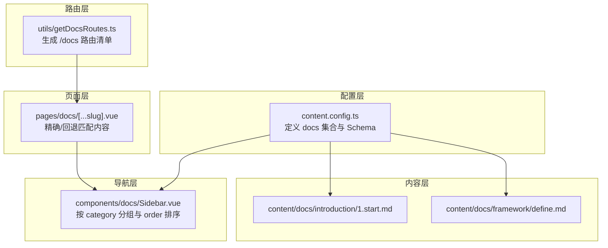
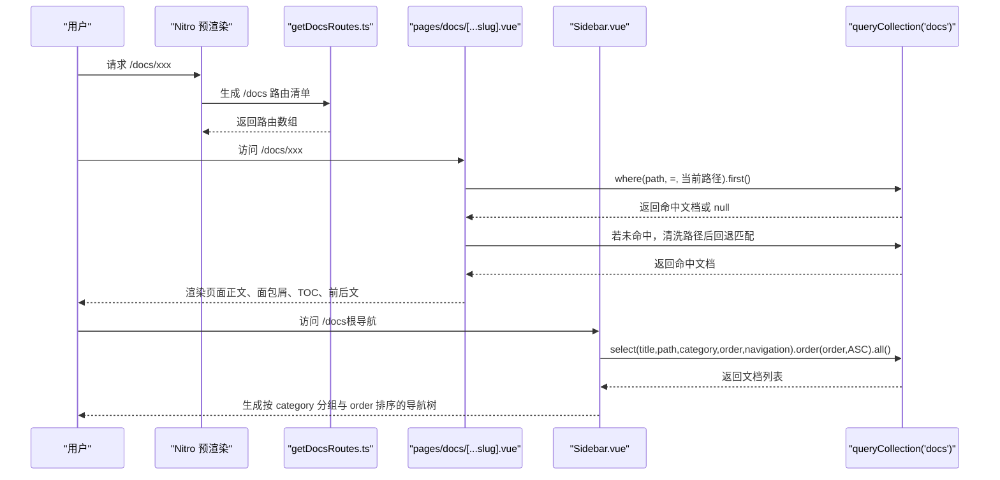
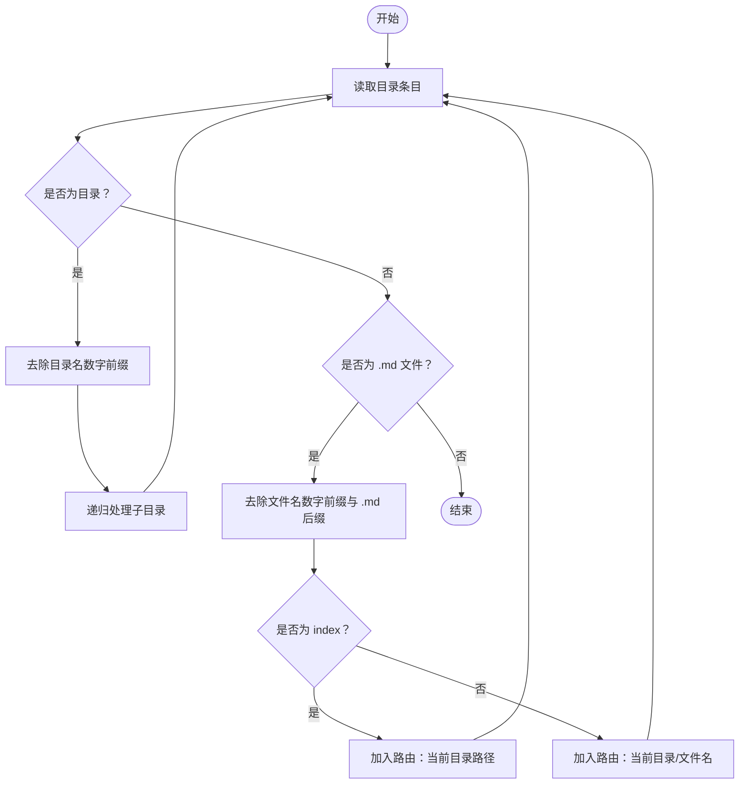
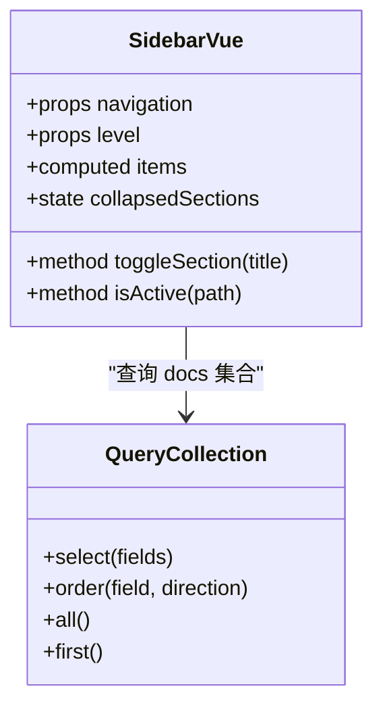
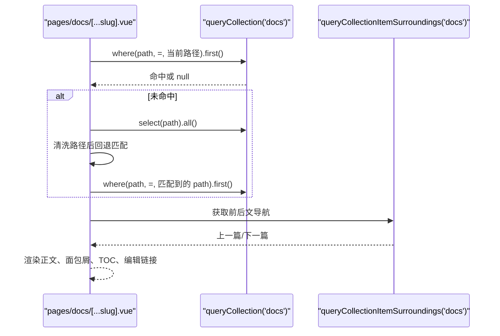
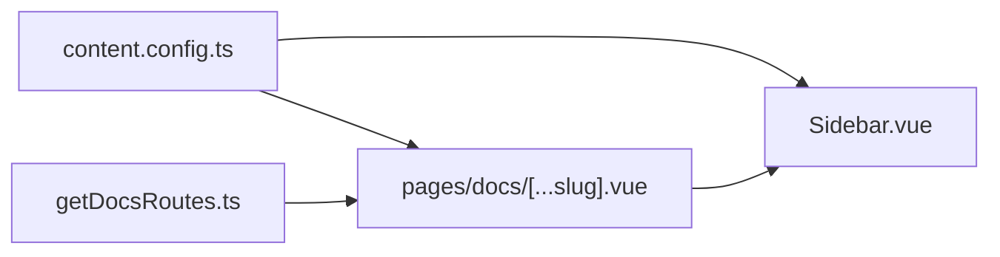

# 文档系统

<cite>
**本文引用的文件**
- [content.config.ts](file://content.config.ts)
- [getDocsRoutes.ts](file://utils/getDocsRoutes.ts)
- [Sidebar.vue](file://components/docs/Sidebar.vue)
- [pages/docs/[...slug].vue](file://pages/docs/[...slug].vue)
- [content/docs/introduction/1.start.md](file://content/docs/introduction/1.start.md)
- [content/docs/introduction/demo.md](file://content/docs/introduction/demo.md)
- [content/docs/introduction/1.configuration.md](file://content/docs/introduction/1.configuration.md)
- [content/docs/introduction/10.migration.md](file://content/docs/introduction/10.migration.md)
- [content/docs/introduction/11.manual-installation.md](file://content/docs/introduction/11.manual-installation.md)
- [content/docs/framework/define.md](file://content/docs/framework/define.md)
</cite>

## 目录
1. [引言](#引言)
2. [项目结构](#项目结构)
3. [核心组件](#核心组件)
4. [架构总览](#架构总览)
5. [详细组件分析](#详细组件分析)
6. [依赖关系分析](#依赖关系分析)
7. [性能考量](#性能考量)
8. [故障排查指南](#故障排查指南)
9. [结论](#结论)
10. [附录](#附录)

## 引言
本专项技术文档围绕 buidai 项目的文档系统，系统梳理 content/docs 目录的组织结构与生成机制，结合框架（framework）与介绍（introduction）两大子目录的实际案例，说明多层级文档的目录规划原则；详解 Front Matter 规范（必填字段 title、description，可选字段 category、order 排序权重，links 相关链接数组），解释数字前缀命名规则（如 1.start.md）对侧边栏显示顺序的影响及 cleanName 处理逻辑；阐述 Sidebar.vue 组件如何基于目录结构自动生成层级化菜单并支持多级嵌套；说明文档内容编写规范（Markdown 语法扩展、代码块高亮、自定义容器、TOC 自动生成与响应式适配）；给出文档版本控制建议（Git 管理变更历史与 update 日志版本追溯）；并提供常见问题的解决方案（侧边栏未更新、路由 404、TOC 不显示等）。

## 项目结构
文档系统由“内容集合”“路由生成”“页面渲染”“侧边栏导航”四个层面协同组成：
- 内容集合：通过 content.config.ts 定义 docs 集合，约束 Front Matter 字段与类型，确保文档元数据一致。
- 路由生成：getDocsRoutes.ts 递归扫描 content/docs，去除数字前缀生成静态路由，保证预渲染与 URL 一致性。
- 页面渲染：pages/docs/[...slug].vue 基于当前路径精确匹配或清洗匹配内容，渲染正文、面包屑、前后文导航与 TOC。
- 侧边栏导航：components/docs/Sidebar.vue 从 docs 集合查询文档，按 category 分组与 order 排序，自动生成层级化菜单。

图表来源
- [content.config.ts](file://content.config.ts#L1-L57)
- [getDocsRoutes.ts](file://utils/getDocsRoutes.ts#L1-L58)
- [pages/docs/[...slug].vue](file://pages/docs/[...slug].vue#L167-L220)
- [components/docs/Sidebar.vue](file://components/docs/Sidebar.vue#L156-L177)

章节来源
- [content.config.ts](file://content.config.ts#L1-L57)
- [getDocsRoutes.ts](file://utils/getDocsRoutes.ts#L1-L58)
- [pages/docs/[...slug].vue](file://pages/docs/[...slug].vue#L167-L220)
- [components/docs/Sidebar.vue](file://components/docs/Sidebar.vue#L156-L177)

## 核心组件
- 内容集合与 Schema：在 content.config.ts 中定义 docs 集合，约束 title、description、category、order、links 等字段，确保 Front Matter 一致性与类型安全。
- 路由生成：getDocsRoutes.ts 递归遍历 content/docs，去除目录与文件名的数字前缀（如 1.introduction → introduction），生成静态路由，确保预渲染与 URL 一致。
- 页面渲染：pages/docs/[...slug].vue 并行获取当前文档与前后文，若精确匹配失败则回退清洗匹配，支持 404 状态与错误边界；渲染正文、面包屑、编辑链接与前后文导航；移动端与桌面端 TOC 自适应。
- 侧边栏导航：Sidebar.vue 仅在根层级自动从 docs 集合查询文档，按 category 分组、order 升序排序，支持分组折叠/展开与当前激活路由自动展开；支持 navigation.icon 自定义图标。

章节来源
- [content.config.ts](file://content.config.ts#L1-L57)
- [getDocsRoutes.ts](file://utils/getDocsRoutes.ts#L1-L58)
- [pages/docs/[...slug].vue](file://pages/docs/[...slug].vue#L167-L220)
- [components/docs/Sidebar.vue](file://components/docs/Sidebar.vue#L156-L177)

## 架构总览
下面的序列图展示了从用户访问到页面渲染的关键流程，包括路由生成、内容匹配、导航生成与页面渲染。

图表来源
- [getDocsRoutes.ts](file://utils/getDocsRoutes.ts#L1-L58)
- [pages/docs/[...slug].vue](file://pages/docs/[...slug].vue#L185-L215)
- [components/docs/Sidebar.vue](file://components/docs/Sidebar.vue#L160-L177)

## 详细组件分析

### 内容集合与 Front Matter 规范
- 集合定义：docs 集合类型为 page，源路径为 docs/**/*.md，确保递归匹配所有 Markdown 文件。
- 必填字段：title、description。
- 可选字段：category（用于 Sidebar 分组）、order（用于排序权重）、links（相关链接数组，包含 label、icon、to、target）。
- 示例参考：
  - introduction/1.start.md：包含 category、title、navigation.title/icon。
  - introduction/demo.md：包含 category、title、navigation.title/icon、description。
  - introduction/1.configuration.md：包含 category、title、navigation.title/icon、description。
  - framework/define.md：包含 category、title、description、navigation.title/icon。

章节来源
- [content.config.ts](file://content.config.ts#L1-L57)
- [content/docs/introduction/1.start.md](file://content/docs/introduction/1.start.md#L1-L10)
- [content/docs/introduction/demo.md](file://content/docs/introduction/demo.md#L1-L10)
- [content/docs/introduction/1.configuration.md](file://content/docs/introduction/1.configuration.md#L1-L10)
- [content/docs/framework/define.md](file://content/docs/framework/define.md#L1-L10)

### 数字前缀命名规则与 cleanName 处理逻辑
- 目录与文件命名：使用“数字前缀.名称”的命名方式（如 1.introduction、1.start.md），用于控制侧边栏显示顺序与 URL 清晰度。
- cleanName 处理逻辑：
  - 目录：去除形如 “1.” 的数字前缀，保留 cleanName 作为 URL 路径段。
  - 文件：去除数字前缀与 .md 后缀，index 文件映射为当前目录路径。
- 路由生成：getDocsRoutes.ts 递归遍历 content/docs，对目录与文件名执行 cleanName，生成 /docs 前缀的静态路由，确保预渲染与访问 URL 一致。

图表来源
- [getDocsRoutes.ts](file://utils/getDocsRoutes.ts#L29-L56)

章节来源
- [getDocsRoutes.ts](file://utils/getDocsRoutes.ts#L1-L58)

### 侧边栏导航自动生成与多级嵌套
- 数据来源：Sidebar.vue 在根层级（level=0）且未显式传入 navigation 时，自动查询 docs 集合，选择 title、path、category、order、navigation 字段，按 order 升序排序。
- 分组与排序：按 category 分组，预定义分类顺序（如“指南”“框架”“未分类”），未在预定义列表中的分类按字母顺序排序。
- 展示与交互：顶层分组支持折叠/展开；当前激活路由所在分组自动展开；支持 navigation.icon 自定义图标；叶子节点为可点击链接。
- 注意：当前实现为扁平转分组，子项仍以普通链接展示，未实现多级折叠（未来可扩展）。

图表来源
- [components/docs/Sidebar.vue](file://components/docs/Sidebar.vue#L156-L239)
- [components/docs/Sidebar.vue](file://components/docs/Sidebar.vue#L241-L268)

章节来源
- [components/docs/Sidebar.vue](file://components/docs/Sidebar.vue#L156-L239)
- [components/docs/Sidebar.vue](file://components/docs/Sidebar.vue#L241-L268)

### 页面渲染与内容匹配
- 精确匹配：优先按当前路径精确匹配 docs 集合中的 path 字段。
- 回退匹配：若未命中，遍历所有文档，对文档 path 与当前路径均执行 cleanName 处理后比较，确保数字前缀与 index 的兼容。
- 前后文导航：使用 queryCollectionItemSurroundings 获取相邻文档，提供 Previous/Next 导航。
- 错误处理：未找到文档时设置 404 状态；错误边界提供重试按钮。
- TOC 与响应式：页面渲染后，使用 IntersectionObserver 监听标题元素，生成桌面端右侧 TOC 与移动端“On this page”折叠 TOC；支持平滑滚动与激活态高亮。

图表来源
- [pages/docs/[...slug].vue](file://pages/docs/[...slug].vue#L185-L215)
- [pages/docs/[...slug].vue](file://pages/docs/[...slug].vue#L217-L219)

章节来源
- [pages/docs/[...slug].vue](file://pages/docs/[...slug].vue#L185-L215)
- [pages/docs/[...slug].vue](file://pages/docs/[...slug].vue#L217-L219)

### 文档内容编写规范
- Markdown 语法扩展：支持代码块高亮、自定义容器（如 note、tip、warning、prose-* 等）；正文渲染采用 ContentRenderer，配套样式覆盖（标题、段落、列表、表格、代码块、引用、图片等）。
- TOC 自动生成：页面渲染后，根据 h2/h3 标题生成桌面端右侧 TOC 与移动端折叠 TOC；支持点击跳转与激活态高亮。
- 响应式设计：桌面端显示右侧 TOC，移动端显示“On this page”折叠面板；滚动监听使用 IntersectionObserver，根偏移量设置为 100px，确保标题进入视窗时正确更新激活态。

章节来源
- [pages/docs/[...slug].vue](file://pages/docs/[...slug].vue#L1-L165)
- [pages/docs/[...slug].vue](file://pages/docs/[...slug].vue#L231-L279)

### 版本控制与更新日志
- Git 管理：文档变更纳入 Git 版本控制，便于追踪与回滚。
- update 日志：content/update 下的 Markdown 文件用于版本发布记录，配合 content.config.ts 的 update 集合 Schema，支持 title、description、date、image、to、target、isMajor、authors 等字段，便于生成版本列表与作者信息。
- 建议：每次重大更新在 update 目录新增一条记录，配合 Git 标签与分支策略，形成“变更历史 + 版本发布”的双轨追溯。

章节来源
- [content.config.ts](file://content.config.ts#L33-L53)
- [content/docs/introduction/10.migration.md](file://content/docs/introduction/10.migration.md#L1-L20)

## 依赖关系分析
- content.config.ts 为文档系统提供统一的集合与 Schema 定义，直接影响 Sidebar.vue 的分组与排序、pages/docs/[...slug].vue 的匹配策略。
- getDocsRoutes.ts 与 pages/docs/[...slug].vue 的回退匹配逻辑相互依赖：前者负责生成静态路由与 cleanName，后者负责在运行时清洗路径并回退匹配。
- Sidebar.vue 依赖 docs 集合的字段（title、path、category、order、navigation），并使用 order 升序与 category 分组实现导航树。

图表来源
- [content.config.ts](file://content.config.ts#L1-L57)
- [getDocsRoutes.ts](file://utils/getDocsRoutes.ts#L1-L58)
- [pages/docs/[...slug].vue](file://pages/docs/[...slug].vue#L185-L215)
- [components/docs/Sidebar.vue](file://components/docs/Sidebar.vue#L160-L177)

章节来源
- [content.config.ts](file://content.config.ts#L1-L57)
- [getDocsRoutes.ts](file://utils/getDocsRoutes.ts#L1-L58)
- [pages/docs/[...slug].vue](file://pages/docs/[...slug].vue#L185-L215)
- [components/docs/Sidebar.vue](file://components/docs/Sidebar.vue#L160-L177)

## 性能考量
- 预渲染：getDocsRoutes.ts 生成静态路由，有助于 Nitro 预渲染，减少首屏渲染压力。
- 查询优化：docs 集合按 order 升序排序，避免在前端进行复杂排序；Sidebar.vue 仅在根层级自动查询，避免重复请求。
- IntersectionObserver：TOC 滚动监听仅在页面挂载时初始化，卸载时释放，避免内存泄漏。
- 前后文导航：queryCollectionItemSurroundings 仅查询相邻文档，字段精简（title、path），降低网络与渲染开销。

章节来源
- [getDocsRoutes.ts](file://utils/getDocsRoutes.ts#L1-L58)
- [pages/docs/[...slug].vue](file://pages/docs/[...slug].vue#L217-L219)
- [components/docs/Sidebar.vue](file://components/docs/Sidebar.vue#L160-L177)

## 故障排查指南
- 侧边栏未更新
  - 确认 Sidebar.vue 未显式传入 navigation，且在根层级（level=0）自动查询。
  - 检查 docs 集合中是否存在对应文档，确认 Front Matter 包含 title、path、category、order 等字段。
  - 确认 category 是否在 Sidebar.vue 的分组顺序中，未在预定义列表中的分类按字母排序。
  - 参考：Sidebar.vue 的自动查询与分组排序逻辑。
  
  章节来源
  - [components/docs/Sidebar.vue](file://components/docs/Sidebar.vue#L160-L177)
  - [components/docs/Sidebar.vue](file://components/docs/Sidebar.vue#L185-L239)

- 路由 404 错误
  - 确认路径是否包含数字前缀或 index，页面回退匹配会清洗路径后再比较。
  - 确认 getDocsRoutes.ts 是否生成了对应路由，确保 content/docs 目录结构与命名规则一致。
  - 参考：pages/docs/[...slug].vue 的精确匹配与回退匹配逻辑。
  
  章节来源
  - [pages/docs/[...slug].vue](file://pages/docs/[...slug].vue#L185-L215)
  - [getDocsRoutes.ts](file://utils/getDocsRoutes.ts#L1-L58)

- TOC 不显示
  - 确认文档内容包含至少一个 h2/h3 标题，ContentRenderer 会根据标题生成 TOC。
  - 确认页面已渲染完成再初始化 IntersectionObserver，避免 DOM 未就绪导致监听失败。
  - 参考：pages/docs/[...slug].vue 的 TOC 渲染与滚动监听逻辑。
  
  章节来源
  - [pages/docs/[...slug].vue](file://pages/docs/[...slug].vue#L1-L165)
  - [pages/docs/[...slug].vue](file://pages/docs/[...slug].vue#L255-L279)

- 数字前缀导致 URL 不一致
  - 目录与文件名的数字前缀会被 cleanName 去除，确保 URL 清晰；若出现异常，检查 getDocsRoutes.ts 的清洗逻辑与 pages/docs/[...slug].vue 的回退匹配逻辑。
  
  章节来源
  - [getDocsRoutes.ts](file://utils/getDocsRoutes.ts#L29-L56)
  - [pages/docs/[...slug].vue](file://pages/docs/[...slug].vue#L192-L214)

## 结论
buidai 项目的文档系统通过“内容集合 + 路由生成 + 页面渲染 + 侧边栏导航”的分层设计，实现了多层级文档的有序组织与高效访问。Front Matter 的规范化与 Schema 约束确保了数据一致性；数字前缀命名与 cleanName 处理逻辑保证了 URL 的可读性与预渲染的一致性；Sidebar.vue 的自动分组与排序提升了导航体验；页面层的精确/回退匹配、TOC 自动生成与响应式适配提供了良好的阅读体验。结合 Git 与 update 日志，可实现完善的版本控制与追溯。

## 附录
- 目录规划原则（基于 framework 与 introduction 实际案例）
  - 一级目录：按主题划分（如 introduction、framework），便于用户快速定位。
  - 二级目录：按功能或阶段划分（如 introduction 下的 1.start、1.configuration、10.migration 等），数字前缀用于控制顺序。
  - 文件命名：统一采用“数字前缀.名称.md”，数字前缀用于排序，名称用于语义化 URL。
  - Front Matter：必填 title、description；可选 category、order、links；导航图标使用 navigation.icon。
- 常见用例
  - 新增入门指南：在 introduction 目录下新增“数字前缀.名称.md”，填写 Front Matter，Sidebar 将自动分组与排序。
  - 新增框架教程：在 framework 目录下新增“数字前缀.名称.md”，填写 Front Matter，Sidebar 将自动分组与排序。
  - 迁移与安装：迁移指南与手动安装指南分别放置在 introduction 下，便于用户按顺序阅读。
  - 版本发布：在 update 目录下新增版本记录，配合 Schema 字段生成版本列表与作者信息。

章节来源
- [content/docs/introduction/1.start.md](file://content/docs/introduction/1.start.md#L1-L10)
- [content/docs/introduction/1.configuration.md](file://content/docs/introduction/1.configuration.md#L1-L10)
- [content/docs/introduction/10.migration.md](file://content/docs/introduction/10.migration.md#L1-L20)
- [content/docs/introduction/11.manual-installation.md](file://content/docs/introduction/11.manual-installation.md#L1-L20)
- [content/docs/framework/define.md](file://content/docs/framework/define.md#L1-L10)