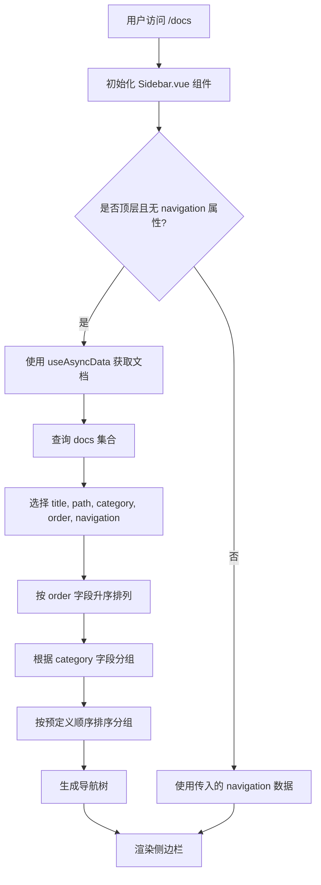

# 排序与分组机制

<cite>
**本文档引用文件**  
- [Sidebar.vue](file://components/docs/Sidebar.vue)
- [getDocsRoutes.ts](file://utils/getDocsRoutes.ts)
- [content.config.ts](file://content.config.ts)
- [1.start.md](file://content/docs/introduction/1.start.md)
- [2.docker-installation.md](file://content/docs/introduction/2.docker-installation.md)
- [1.configuration.md](file://content/docs/introduction/1.configuration.md)
- [10.migration.md](file://content/docs/introduction/10.migration.md)
- [11.manual-installation.md](file://content/docs/introduction/11.manual-installation.md)
- [demo.md](file://content/docs/introduction/demo.md)
- [define.md](file://content/docs/framework/define.md)
- [types.md](file://content/docs/framework/types.md)
- [index.vue](file://pages/docs/index.vue)
</cite>

## 目录
1. [引言](#引言)
2. [数字前缀命名法](#数字前缀命名法)
3. [category字段的分组作用](#category字段的分组作用)
4. [order字段的排序优先级](#order字段的排序优先级)
5. [导航菜单生成流程](#导航菜单生成流程)
6. [最佳实践建议](#最佳实践建议)
7. [结论](#结论)

## 引言

buidai文档系统采用了一套完整的排序与分组策略，确保文档在侧边栏导航中能够按照预期顺序正确显示。该系统结合了文件系统命名约定、前端matter元数据和组件逻辑实现，构建了一个灵活且可维护的文档组织架构。通过分析系统实现，可以全面理解其排序与分组机制的设计原理和优势。

**Section sources**
- [Sidebar.vue](file://components/docs/Sidebar.vue#L1-L294)
- [content.config.ts](file://content.config.ts#L1-L57)

## 数字前缀命名法

buidai文档系统采用数字前缀命名法来确保文档在侧边栏导航中的正确显示顺序。这种命名方式通过在文件名前添加数字前缀（如1.start.md、2.docker-installation.md）来明确文档的排列顺序。

系统在处理文件路径时会自动去除数字前缀，确保生成的URL简洁且语义化。例如，文件`1.start.md`对应的路由路径为`/docs/start`，而`2.docker-installation.md`对应的路由路径为`/docs/docker-installation`。这种设计既保证了排序的确定性，又不影响最终的URL可读性。

相较于依赖文件系统元数据（如修改时间）的排序方式，数字前缀命名法具有明显优势。首先，它提供了明确的、可预测的排序结果，避免了因文件修改时间变化而导致的意外排序变动。其次，它允许开发者完全控制文档的显示顺序，而不受文件创建或修改时间的影响。最后，这种命名方式直观易懂，便于团队协作时的文档管理。

**Section sources**
- [getDocsRoutes.ts](file://utils/getDocsRoutes.ts#L34-L47)
- [types.md](file://content/docs/framework/types.md#L114-L141)

## category字段的分组作用

category字段在文档前端matter中扮演着关键的分组角色，实现了跨目录内容的逻辑归类。通过在文档的front-matter中设置category字段，系统能够将分散在不同目录下的相关文档归入同一类别，从而构建清晰的文档结构。

例如，在`content/docs/introduction/`目录下的多个文档（如1.start.md、2.docker-installation.md、1.configuration.md等）都设置了`category: 入门指南`，这使得它们在侧边栏导航中被归入"入门指南"类别。同样，`content/docs/framework/`目录下的文档通过设置`category: 进阶教程`被归入相应的类别。

系统在`Sidebar.vue`组件中实现了category字段的处理逻辑。当组件自动获取文档列表时，会遍历所有文档，根据其category字段进行分组。如果文档未设置category字段，则默认归入"未分类"类别。这种设计使得文档组织更加灵活，允许内容创作者根据主题而非物理位置来组织文档。

**Section sources**
- [Sidebar.vue](file://components/docs/Sidebar.vue#L193-L195)
- [1.start.md](file://content/docs/introduction/1.start.md#L2)
- [define.md](file://content/docs/framework/define.md#L2)

## order字段的排序优先级

order字段在文档前端matter中用于影响文档条目在UI中的排列优先级，提供了比文件名前缀更精细的排序控制。在`content.config.ts`文件中，文档集合的schema定义了order字段为可选的数字类型，允许在文档元数据中指定排序权重。

`Sidebar.vue`组件在获取文档数据时，会通过`queryCollection('docs').select('title', 'path', 'category', 'order', 'navigation').order('order', 'ASC')`的查询语句，按照order字段的升序排列文档。这意味着order值较小的文档会排在前面，值较大的文档会排在后面。

当多个文档具有相同的order值时，系统会回退到基于文件名前缀的排序。这种双重排序机制提供了更大的灵活性：开发者可以使用order字段进行大范围的文档排序，同时使用数字前缀命名法处理同一优先级内的文档顺序。例如，可以将所有入门文档的order值设为100，进阶文档设为200，然后在每个类别内使用数字前缀控制具体顺序。

**Section sources**
- [content.config.ts](file://content.config.ts#L24)
- [Sidebar.vue](file://components/docs/Sidebar.vue#L168-L170)

## 导航菜单生成流程

当用户访问`/docs`路径时，系统会依据文件名前缀和order值动态生成有序的导航菜单。这一过程涉及多个组件和工具的协同工作，确保导航结构的准确性和一致性。

首先，`getDocsRoutes.ts`工具负责遍历`content/docs`目录，生成所有文档页面的路由列表。该工具在处理目录和文件时会去除数字前缀，确保生成的URL简洁且语义化。同时，`content.config.ts`文件定义了文档集合的结构和schema，包括title、description、category、order等字段。

当用户访问文档页面时，`Sidebar.vue`组件会执行以下流程：如果组件处于顶层且未提供navigation属性，则使用`useAsyncData`从content集合中获取文档列表；查询时选择title、path、category、order和navigation字段，并按order字段升序排列；然后根据category字段对文档进行分组；最后按照预定义的分类顺序（'指南', '框架', '未分类'）对分组进行排序。

`pages/docs/index.vue`文件中的逻辑与`Sidebar.vue`保持一致，确保文档中心首页的导航结构与侧边栏一致。这种一致性设计使得用户在不同页面间导航时能够获得统一的体验。

**Diagram sources**
- [Sidebar.vue](file://components/docs/Sidebar.vue#L162-L236)
- [getDocsRoutes.ts](file://utils/getDocsRoutes.ts#L17-L57)
- [index.vue](file://pages/docs/index.vue#L79-L127)

**Section sources**
- [Sidebar.vue](file://components/docs/Sidebar.vue#L162-L236)
- [getDocsRoutes.ts](file://utils/getDocsRoutes.ts#L17-L57)
- [index.vue](file://pages/docs/index.vue#L79-L127)

## 最佳实践建议

为了有效利用buidai文档系统的排序与分组功能，建议遵循以下最佳实践：

合理设置排序权重时，应采用间隔较大的数值策略。例如，使用100、200、300等作为主要类别的order值，而非连续的1、2、3。这样可以在不修改其他文档order值的情况下，在任意两个文档之间插入新文档（如在100和200之间插入150）。

避免序号冲突的关键是建立团队共识和命名规范。建议在项目初期制定文档命名规则，明确数字前缀的使用方式。对于目录级别的排序，使用单个数字（如1.、2.），对于文件级别的排序，使用两位数字（如01.、02.），以避免`10.foo.md`排在`2.bar.md`之前的字母排序问题。

处理新增文档时的顺序调整，应优先考虑使用order字段而非频繁修改文件名前缀。如果必须调整文件名前缀，建议使用批量重命名工具，并确保更新所有相关引用。同时，应在团队内部建立文档变更的沟通机制，确保排序调整不会影响其他成员的工作。

定期审查和优化文档结构也是重要的实践。随着文档数量的增长，原有的分类和排序可能不再适用。建议定期评估文档的组织结构，根据用户反馈和使用数据调整category分组和order权重，确保文档系统的可用性和可维护性。

**Section sources**
- [types.md](file://content/docs/framework/types.md#L114-L141)
- [content.config.ts](file://content.config.ts#L24)
- [getDocsRoutes.ts](file://utils/getDocsRoutes.ts#L34-L47)

## 结论

buidai文档系统的排序与分组策略通过数字前缀命名法、category字段和order字段的有机结合，构建了一个灵活、可预测且易于维护的文档组织架构。这种设计避免了依赖文件系统元数据带来的不确定性，提供了精确的控制能力。

系统通过`Sidebar.vue`组件的逻辑实现，将文件名前缀、category分组和order优先级统一处理，确保了导航菜单的一致性和准确性。同时，`getDocsRoutes.ts`工具和`content.config.ts`配置文件的配合，保证了路由生成与内容管理的协调一致。

这一综合性的排序与分组机制不仅满足了当前的文档管理需求，还为未来的扩展留下了充足的空间。通过遵循最佳实践，团队可以高效地管理不断增长的文档内容，为用户提供清晰、有序的文档浏览体验。