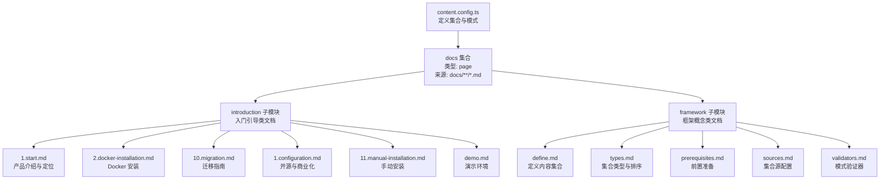
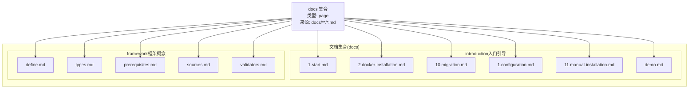
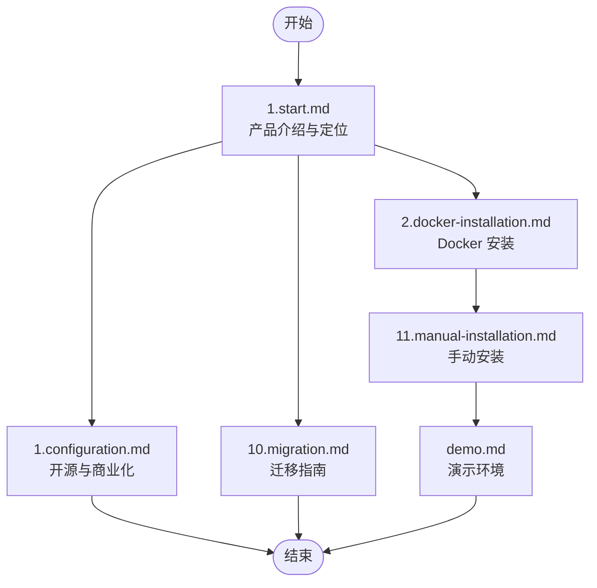
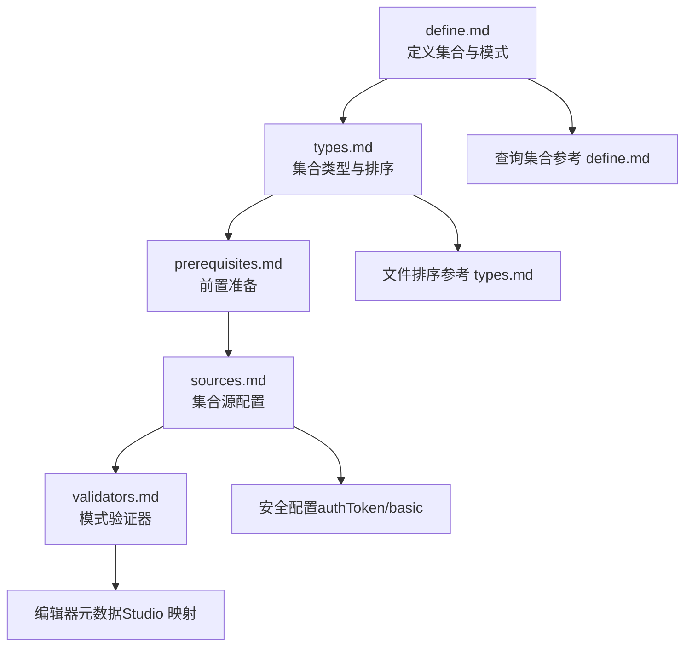
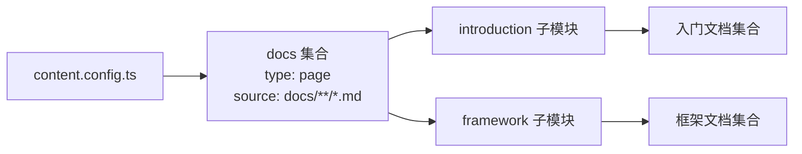

# 文档目录组织

<cite>
**本文引用的文件**
- [content.config.ts](file://content.config.ts)
- [content/docs/introduction/1.start.md](file://content/docs/introduction/1.start.md)
- [content/docs/introduction/2.docker-installation.md](file://content/docs/introduction/2.docker-installation.md)
- [content/docs/introduction/10.migration.md](file://content/docs/introduction/10.migration.md)
- [content/docs/introduction/1.configuration.md](file://content/docs/introduction/1.configuration.md)
- [content/docs/introduction/11.manual-installation.md](file://content/docs/introduction/11.manual-installation.md)
- [content/docs/introduction/demo.md](file://content/docs/introduction/demo.md)
- [content/docs/framework/define.md](file://content/docs/framework/define.md)
- [content/docs/framework/types.md](file://content/docs/framework/types.md)
- [content/docs/framework/prerequisites.md](file://content/docs/framework/prerequisites.md)
- [content/docs/framework/sources.md](file://content/docs/framework/sources.md)
- [content/docs/framework/validators.md](file://content/docs/framework/validators.md)
</cite>

## 目录
1. [引言](#引言)
2. [项目结构](#项目结构)
3. [核心组件](#核心组件)
4. [架构总览](#架构总览)
5. [详细组件分析](#详细组件分析)
6. [依赖分析](#依赖分析)
7. [性能考量](#性能考量)
8. [故障排查指南](#故障排查指南)
9. [结论](#结论)
10. [附录](#附录)

## 引言
本文件围绕 buidai 项目的文档目录组织进行系统化技术说明，重点分析 content/docs 目录下 introduction 与 framework 两大模块的结构与职责划分。通过对数字前缀命名的入门文档、框架级概念文档的解读，阐明如何通过目录与集合配置实现“功能归类与逻辑分层”。同时给出文档分类原则、命名规范、模块边界、版本隔离策略与路径层级映射的最佳实践建议，帮助读者快速理解并高效维护文档体系。

## 项目结构
项目采用 Nuxt Content 的内容集合（collections）机制组织文档内容。content.config.ts 定义了博客、文档、更新日志三大集合，分别承载不同类型的页面内容。docs 目录下的 introduction 与 framework 两个子模块，分别承担“入门引导”和“框架概念”的职责，形成清晰的文档分层。

图表来源
- [content.config.ts](file://content.config.ts#L1-L57)
- [content/docs/introduction/1.start.md](file://content/docs/introduction/1.start.md#L1-L117)
- [content/docs/introduction/2.docker-installation.md](file://content/docs/introduction/2.docker-installation.md#L1-L83)
- [content/docs/introduction/10.migration.md](file://content/docs/introduction/10.migration.md#L1-L176)
- [content/docs/introduction/1.configuration.md](file://content/docs/introduction/1.configuration.md#L1-L86)
- [content/docs/introduction/11.manual-installation.md](file://content/docs/introduction/11.manual-installation.md#L1-L237)
- [content/docs/introduction/demo.md](file://content/docs/introduction/demo.md#L1-L33)
- [content/docs/framework/define.md](file://content/docs/framework/define.md#L1-L229)
- [content/docs/framework/types.md](file://content/docs/framework/types.md#L1-L141)
- [content/docs/framework/prerequisites.md](file://content/docs/framework/prerequisites.md#L1-L153)
- [content/docs/framework/sources.md](file://content/docs/framework/sources.md#L1-L129)
- [content/docs/framework/validators.md](file://content/docs/framework/validators.md#L1-L149)

章节来源
- [content.config.ts](file://content.config.ts#L1-L57)

## 核心组件
- 文档集合（docs）：类型为 page，来源递归匹配 docs 目录下的所有 Markdown 文件，统一纳入文档导航与渲染。
- introduction 子模块：承载入门类文档，包括产品介绍、安装部署、迁移指南、演示环境等，强调“从零到一”的引导流程。
- framework 子模块：承载框架级概念文档，包括集合定义、类型、源配置、验证器、前置准备等，强调“理解与扩展”。

章节来源
- [content.config.ts](file://content.config.ts#L1-L57)
- [content/docs/introduction/1.start.md](file://content/docs/introduction/1.start.md#L1-L117)
- [content/docs/framework/define.md](file://content/docs/framework/define.md#L1-L229)

## 架构总览
文档目录组织遵循“功能归类 + 逻辑分层”的设计原则：
- 功能归类：introduction 聚焦入门与配置，framework 聚焦概念与实现。
- 逻辑分层：从“如何开始”到“如何理解与扩展”，形成清晰的学习路径。
- 物理路径映射：docs 目录下以 introduction 与 framework 为一级目录，体现“入门”与“框架”的层级关系。

图表来源
- [content.config.ts](file://content.config.ts#L1-L57)
- [content/docs/introduction/1.start.md](file://content/docs/introduction/1.start.md#L1-L117)
- [content/docs/introduction/2.docker-installation.md](file://content/docs/introduction/2.docker-installation.md#L1-L83)
- [content/docs/introduction/10.migration.md](file://content/docs/introduction/10.migration.md#L1-L176)
- [content/docs/introduction/1.configuration.md](file://content/docs/introduction/1.configuration.md#L1-L86)
- [content/docs/introduction/11.manual-installation.md](file://content/docs/introduction/11.manual-installation.md#L1-L237)
- [content/docs/introduction/demo.md](file://content/docs/introduction/demo.md#L1-L33)
- [content/docs/framework/define.md](file://content/docs/framework/define.md#L1-L229)
- [content/docs/framework/types.md](file://content/docs/framework/types.md#L1-L141)
- [content/docs/framework/prerequisites.md](file://content/docs/framework/prerequisites.md#L1-L153)
- [content/docs/framework/sources.md](file://content/docs/framework/sources.md#L1-L129)
- [content/docs/framework/validators.md](file://content/docs/framework/validators.md#L1-L149)

## 详细组件分析

### introduction 子模块：入门引导流程设计
introduction 子模块通过数字前缀命名的 Markdown 文件，形成“线性引导流程”。数字前缀用于排序与流程编排，配合集合类型 page 自动生成路径，便于导航与跳转。

- 1.start.md：产品定位、设计目标、应用场景、商业化路径，作为入门首篇，建立整体认知。
- 2.docker-installation.md：Docker 一键部署，包含环境准备、获取代码、配置环境变量、启动服务等步骤，强调可操作性。
- 10.migration.md：从 v2 迁移到 v3 的变更说明与迁移步骤，帮助用户平滑升级。
- 1.configuration.md：开源与商业化思路，阐述价值创造与收入渠道，强化用户对项目可持续性的理解。
- 11.manual-installation.md：手动安装，包含依赖要求、验证安装、环境变量配置、启动服务等，满足复杂场景需求。
- demo.md：演示环境使用说明与访问信息，便于快速体验。

图表来源
- [content/docs/introduction/1.start.md](file://content/docs/introduction/1.start.md#L1-L117)
- [content/docs/introduction/2.docker-installation.md](file://content/docs/introduction/2.docker-installation.md#L1-L83)
- [content/docs/introduction/10.migration.md](file://content/docs/introduction/10.migration.md#L1-L176)
- [content/docs/introduction/1.configuration.md](file://content/docs/introduction/1.configuration.md#L1-L86)
- [content/docs/introduction/11.manual-installation.md](file://content/docs/introduction/11.manual-installation.md#L1-L237)
- [content/docs/introduction/demo.md](file://content/docs/introduction/demo.md#L1-L33)

章节来源
- [content/docs/introduction/1.start.md](file://content/docs/introduction/1.start.md#L1-L117)
- [content/docs/introduction/2.docker-installation.md](file://content/docs/introduction/2.docker-installation.md#L1-L83)
- [content/docs/introduction/10.migration.md](file://content/docs/introduction/10.migration.md#L1-L176)
- [content/docs/introduction/1.configuration.md](file://content/docs/introduction/1.configuration.md#L1-L86)
- [content/docs/introduction/11.manual-installation.md](file://content/docs/introduction/11.manual-installation.md#L1-L237)
- [content/docs/introduction/demo.md](file://content/docs/introduction/demo.md#L1-L33)

### framework 子模块：框架级概念模型
framework 子模块系统化描述 Nuxt Content 的核心概念与实现细节，帮助开发者理解并扩展文档体系。

- define.md：定义内容集合、集合模式（schema）、数据库索引、查询集合等，强调结构化与类型安全。
- types.md：集合类型（page/data）、路径生成、模式覆盖、文件排序规则，强调排序与路径映射。
- prerequisites.md：前置准备，包括 Docker、NodeJS、pnpm 的安装与验证，强调开发环境一致性。
- sources.md：集合源配置，支持 include/exclude/prefix/cwd/repository/authToken 等，强调灵活性与安全性。
- validators.md：模式验证器（Zod/Valibot），强调类型安全与编辑器元数据映射。

图表来源
- [content/docs/framework/define.md](file://content/docs/framework/define.md#L1-L229)
- [content/docs/framework/types.md](file://content/docs/framework/types.md#L1-L141)
- [content/docs/framework/prerequisites.md](file://content/docs/framework/prerequisites.md#L1-L153)
- [content/docs/framework/sources.md](file://content/docs/framework/sources.md#L1-L129)
- [content/docs/framework/validators.md](file://content/docs/framework/validators.md#L1-L149)

章节来源
- [content/docs/framework/define.md](file://content/docs/framework/define.md#L1-L229)
- [content/docs/framework/types.md](file://content/docs/framework/types.md#L1-L141)
- [content/docs/framework/prerequisites.md](file://content/docs/framework/prerequisites.md#L1-L153)
- [content/docs/framework/sources.md](file://content/docs/framework/sources.md#L1-L129)
- [content/docs/framework/validators.md](file://content/docs/framework/validators.md#L1-L149)

### 文档分类原则与边界划分
- 基础入门与配置说明：归入 introduction，包括产品介绍、安装部署、演示环境、迁移指南、商业化说明等，强调“从零到一”的引导。
- 框架级概念与实现：归入 framework，包括集合定义、类型、源配置、验证器、前置准备等，强调“理解与扩展”。

章节来源
- [content/docs/introduction/1.start.md](file://content/docs/introduction/1.start.md#L1-L117)
- [content/docs/introduction/2.docker-installation.md](file://content/docs/introduction/2.docker-installation.md#L1-L83)
- [content/docs/introduction/10.migration.md](file://content/docs/introduction/10.migration.md#L1-L176)
- [content/docs/introduction/1.configuration.md](file://content/docs/introduction/1.configuration.md#L1-L86)
- [content/docs/introduction/11.manual-installation.md](file://content/docs/introduction/11.manual-installation.md#L1-L237)
- [content/docs/introduction/demo.md](file://content/docs/introduction/demo.md#L1-L33)
- [content/docs/framework/define.md](file://content/docs/framework/define.md#L1-L229)
- [content/docs/framework/types.md](file://content/docs/framework/types.md#L1-L141)
- [content/docs/framework/prerequisites.md](file://content/docs/framework/prerequisites.md#L1-L153)
- [content/docs/framework/sources.md](file://content/docs/framework/sources.md#L1-L129)
- [content/docs/framework/validators.md](file://content/docs/framework/validators.md#L1-L149)

### 目录命名规范与版本隔离策略
- 目录命名规范：采用小驼峰或短横线命名，避免空格与特殊字符；子模块以 introduction 与 framework 作为一级目录，体现“入门”与“框架”的层级关系。
- 数字前缀命名：在 introduction 下使用数字前缀（如 1.start.md、2.docker-installation.md）进行流程编排，确保排序与引导顺序一致。
- 版本隔离策略：通过集合（collections）与模式（schema）实现内容结构化与类型安全；使用 include/exclude/prefix 等源配置实现内容范围隔离；通过 category 与 navigation.title 控制导航分组与展示。

章节来源
- [content/docs/framework/types.md](file://content/docs/framework/types.md#L115-L141)
- [content/docs/framework/sources.md](file://content/docs/framework/sources.md#L25-L67)
- [content/docs/framework/sources.md](file://content/docs/framework/sources.md#L83-L103)
- [content/docs/framework/sources.md](file://content/docs/framework/sources.md#L105-L129)
- [content.config.ts](file://content.config.ts#L1-L57)

## 依赖分析
docs 集合通过 content.config.ts 统一管理，introduction 与 framework 子模块在 docs 集合下并行存在，彼此无直接耦合，通过集合类型 page 与路径生成规则实现独立导航与渲染。

图表来源
- [content.config.ts](file://content.config.ts#L1-L57)

章节来源
- [content.config.ts](file://content.config.ts#L1-L57)

## 性能考量
- 查询性能：通过集合索引（indexes）优化筛选与排序，减少数据库扫描成本。
- 内容加载：合理使用 include/exclude 控制导入范围，避免不必要的文件解析。
- 路径生成：利用 page 类型自动生成路径，减少手工维护成本，提高导航一致性。

章节来源
- [content/docs/framework/define.md](file://content/docs/framework/define.md#L91-L127)
- [content/docs/framework/sources.md](file://content/docs/framework/sources.md#L25-L67)

## 故障排查指南
- 安装与部署问题：优先检查 Docker、NodeJS、pnpm 的版本与安装状态，确认环境变量配置正确。
- 迁移问题：对照迁移指南逐步替换 API 与组件，确保集合定义与查询方式一致。
- 导航与排序问题：检查数字前缀命名与排序规则，确保文件命名规范与路径生成符合预期。
- 安全与认证：私有仓库需通过 authToken 或 basic 认证，避免在代码中直接提交敏感信息。

章节来源
- [content/docs/introduction/2.docker-installation.md](file://content/docs/introduction/2.docker-installation.md#L1-L83)
- [content/docs/introduction/11.manual-installation.md](file://content/docs/introduction/11.manual-installation.md#L1-L237)
- [content/docs/introduction/10.migration.md](file://content/docs/introduction/10.migration.md#L1-L176)
- [content/docs/framework/prerequisites.md](file://content/docs/framework/prerequisites.md#L1-L153)
- [content/docs/framework/sources.md](file://content/docs/framework/sources.md#L105-L129)

## 结论
通过 content.config.ts 的集合定义与 docs 目录的 introduction、framework 子模块划分，buidai 项目实现了“入门引导”与“框架概念”的清晰分层。数字前缀命名与集合类型 page 的路径生成机制，进一步强化了文档的逻辑顺序与导航体验。遵循本文提出的命名规范、模块边界与版本隔离策略，可有效提升文档体系的可维护性与可扩展性。

## 附录
- 最佳实践清单
  - 使用 introduction 与 framework 作为一级目录，明确“入门”与“框架”的职责边界。
  - 在 introduction 中采用数字前缀命名，确保引导流程的线性与可排序性。
  - 在 framework 中系统化描述集合定义、类型、源配置与验证器，形成知识沉淀。
  - 通过 include/exclude/prefix 等源配置实现内容范围与路径隔离，保证导航一致性。
  - 使用索引优化查询性能，避免不必要的文件解析与扫描。