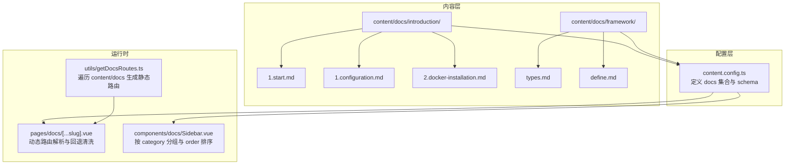
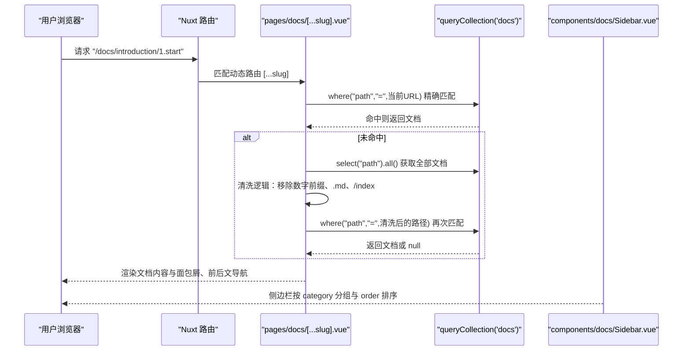
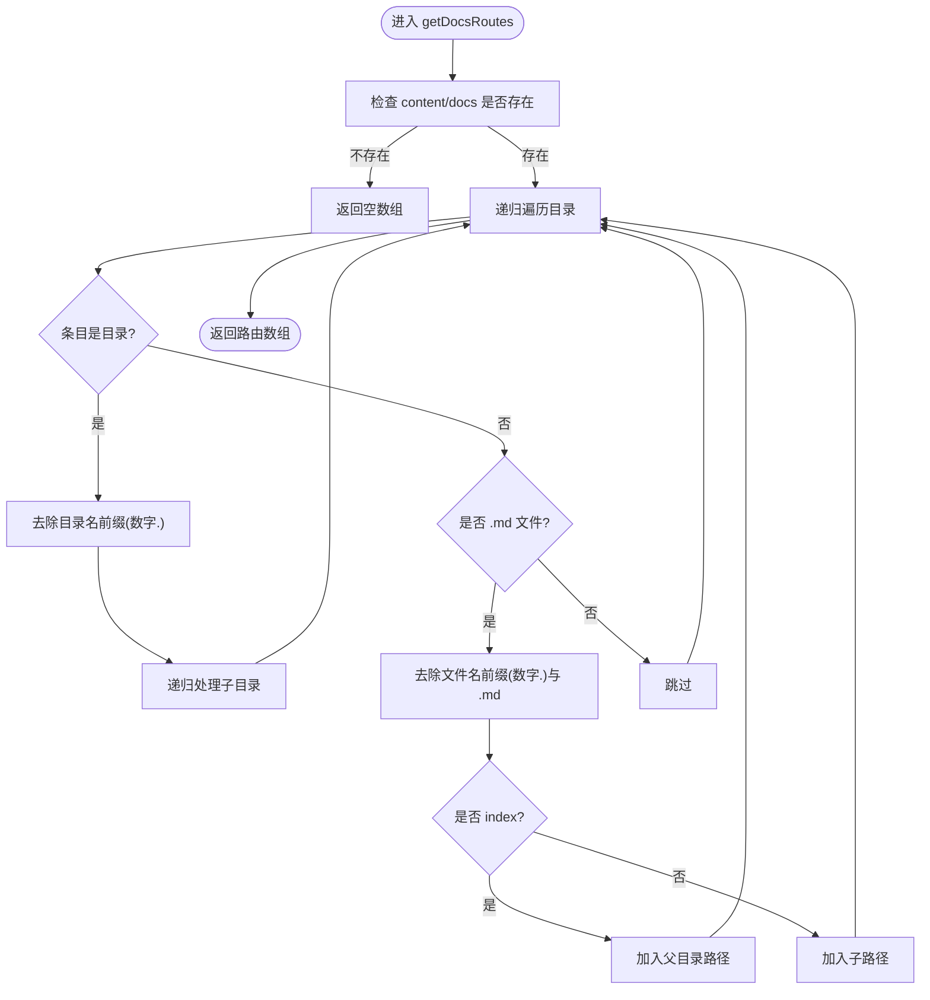
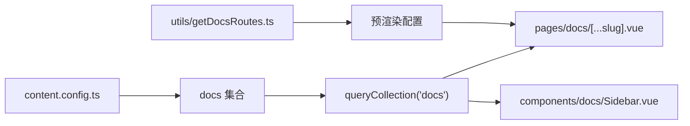

# 文档结构

<cite>
**本文引用的文件**
- [content/docs/introduction/1.start.md](file://content/docs/introduction/1.start.md)
- [content/docs/introduction/1.configuration.md](file://content/docs/introduction/1.configuration.md)
- [content/docs/introduction/2.docker-installation.md](file://content/docs/introduction/2.docker-installation.md)
- [content/docs/framework/types.md](file://content/docs/framework/types.md)
- [content/docs/framework/define.md](file://content/docs/framework/define.md)
- [content.config.ts](file://content.config.ts)
- [utils/getDocsRoutes.ts](file://utils/getDocsRoutes.ts)
- [pages/docs/[...slug].vue](file://pages/docs/[...slug].vue)
- [pages/docs/index.vue](file://pages/docs/index.vue)
- [components/docs/Sidebar.vue](file://components/docs/Sidebar.vue)
</cite>

## 目录
1. [引言](#引言)
2. [项目结构](#项目结构)
3. [核心组件](#核心组件)
4. [架构总览](#架构总览)
5. [详细组件分析](#详细组件分析)
6. [依赖分析](#依赖分析)
7. [性能考量](#性能考量)
8. [故障排查指南](#故障排查指南)
9. [结论](#结论)
10. [附录](#附录)

## 引言
本专项技术文档围绕 智言万象 项目的文档结构展开，重点解析 content/docs 目录下 introduction 与 framework 两大子目录的组织方式与命名规范，系统阐述基于文件路径的路由映射机制、数字前缀命名法在排序中的作用、cleanName 逻辑如何去除前缀生成最终路径、category 字段在文档分组中的用途，以及 order 字段如何影响侧边栏显示顺序。同时结合项目实际内容，给出模块划分、命名规范与版本隔离的最佳实践建议。

## 项目结构
- 文档内容位于 content/docs 下，采用“多层级目录 + 数字前缀”的组织方式，便于排序与分组。
- introduction 子目录包含入门类文档，如 1.start.md、1.configuration.md、2.docker-installation.md 等，体现清晰的学习路径。
- framework 子目录包含进阶教程，如 types.md、define.md 等，强调技术深度与体系化。
- 文档集合通过 content.config.ts 定义，统一 schema 与 source 规则，确保内容一致性与可查询性。
- 路由生成与页面渲染由 pages/docs/[...slug].vue 与 components/docs/Sidebar.vue 协同完成，配合 utils/getDocsRoutes.ts 实现预渲染与路径清理。

图表来源
- [content.docs.introduction.1.start.md](file://content/docs/introduction/1.start.md#L1-L20)
- [content.docs.framework.types.md](file://content/docs/framework/types.md#L1-L20)
- [content.config.ts](file://content.config.ts#L1-L57)
- [pages.docs.[...slug].vue](file://pages/docs/[...slug].vue#L170-L215)
- [components.docs.Sidebar.vue](file://components/docs/Sidebar.vue#L160-L177)
- [utils.getDocsRoutes.ts](file://utils/getDocsRoutes.ts#L17-L58)

章节来源
- [content.docs.introduction.1.start.md](file://content/docs/introduction/1.start.md#L1-L20)
- [content.docs.framework.types.md](file://content/docs/framework/types.md#L1-L20)
- [content.config.ts](file://content.config.ts#L1-L57)

## 核心组件
- 文档集合与模式
  - docs 集合类型为 page，source 递归匹配 docs/**/*.md，确保所有文档被纳入索引。
  - schema 定义了 title、description、category、order、links 等字段，为导航与排序提供依据。
- 路由生成器
  - getDocsRoutes.ts 递归扫描 content/docs，去除数字前缀与 .md 后缀，生成 /docs 前缀的静态路由，保证预渲染覆盖所有页面。
- 动态路由解析
  - pages/docs/[...slug].vue 通过 queryCollection('docs') 精确匹配当前 path；若未命中，回退清洗逻辑：对文档路径与当前路径均去除数字前缀、.md、/index，再进行比对，确保 URL 与文件名前缀不一致时仍可正确渲染。
- 侧边栏分组与排序
  - components/docs/Sidebar.vue 从 docs 集合按 order 升序排序，按 category 分组，预定义分类顺序（指南、框架、未分类），并自动展开包含当前激活路由的分组。

章节来源
- [content.config.ts](file://content.config.ts#L1-L57)
- [utils.getDocsRoutes.ts](file://utils/getDocsRoutes.ts#L17-L58)
- [pages.docs.[...slug].vue](file://pages/docs/[...slug].vue#L185-L215)
- [components.docs.Sidebar.vue](file://components/docs/Sidebar.vue#L160-L177)

## 架构总览
下面的序列图展示了从请求 /docs/introduction/1.start 到最终渲染页面的关键流程，包括精确匹配与回退清洗两阶段。

图表来源
- [pages.docs.[...slug].vue](file://pages/docs/[...slug].vue#L185-L215)
- [components.docs.Sidebar.vue](file://components/docs/Sidebar.vue#L160-L177)

## 详细组件分析

### 路由映射机制与 cleanName 逻辑
- 基于文件路径的路由映射
  - Nuxt Content 为 page 类型集合自动生成 path 字段，遵循 content/docs 下的目录与文件名结构。
  - 数字前缀（如 1.、2.）用于排序，但不会出现在最终 URL 中。
- cleanName 逻辑
  - 目录名与文件名均去除数字前缀（正则 /^\d+\./）与 .md 后缀，index.md 路径回退为父目录路径。
  - 该逻辑确保 /docs/introduction/1.start 与 content/docs/introduction/1.start.md 的一一对应。
- 回退清洗
  - 若 URL 与文件名前缀不一致，动态路由解析会先获取全部文档，再对文档 path 与当前路径分别执行 cleanName，最终匹配到真实文档。

图表来源
- [utils.getDocsRoutes.ts](file://utils/getDocsRoutes.ts#L17-L58)

章节来源
- [utils.getDocsRoutes.ts](file://utils/getDocsRoutes.ts#L17-L58)
- [pages.docs.[...slug].vue](file://pages/docs/[...slug].vue#L192-L214)

### 数字前缀命名法与排序
- 数字前缀用于控制文档在列表中的顺序，Nuxt Content 使用字母序，因此需要在单个数字前加 0 以实现正确的数值排序（例如 01、02、...、10）。
- 在 introduction 与 framework 目录中，数字前缀清晰地表达了学习路径与知识体系的先后关系。
- 该命名法不影响最终 URL，因为 cleanName 会移除前缀。

章节来源
- [content.docs.framework.types.md](file://content.docs/framework/types.md#L114-L141)
- [content.docs.introduction.1.start.md](file://content/docs/introduction/1.start.md#L1-L20)
- [content.docs.introduction.2.docker-installation.md](file://content/docs/introduction/2.docker-installation.md#L1-L20)

### category 字段与分组
- category 字段用于将文档按主题分组，Sidebar 组件在根层级按 category 聚合，形成“分组标题 + 叶子链接”的导航树。
- 未设置 category 的文档会被归入“未分类”，并在分类顺序中按字母排序。
- 分类顺序通过预定义数组控制，优先级为：指南、框架、未分类。

章节来源
- [components.docs.Sidebar.vue](file://components.docs/Sidebar.vue#L191-L239)
- [pages.docs.index.vue](file://pages/docs/index.vue#L86-L110)

### order 字段与侧边栏显示顺序
- order 字段用于控制同一分组内文档的显示顺序，Sidebar 在根层级查询时按 order 升序排序。
- 该字段与数字前缀命名法互补：前者用于细粒度排序，后者用于目录与文件层面的顺序控制。

章节来源
- [content.config.ts](file://content.config.ts#L17-L32)
- [components.docs.Sidebar.vue](file://components.docs/Sidebar.vue#L168-L170)

### 文档集合与 schema 设计
- docs 集合类型为 page，source 递归匹配 docs/**/*.md，确保所有文档被索引。
- schema 定义了 title、description、category、order、links 等字段，为导航、SEO、分组与排序提供数据基础。
- framework/types.md 提供了 page 类型的路径生成与字段覆盖说明，强调 path、title、description、seo、body、navigation 等内置字段的作用。

章节来源
- [content.config.ts](file://content.config.ts#L17-L32)
- [content.docs.framework.types.md](file://content/docs/framework/types.md#L32-L96)

### 动态路由解析与回退清洗
- pages/docs/[...slug].vue 先尝试精确匹配当前路径，若失败则回退到“清洗路径 + 全量匹配”的策略，确保 URL 与文件名前缀不一致时仍可正确渲染。
- 该策略同时兼容 cleanName 生成的路径与原始文件路径，增强容错性。

章节来源
- [pages.docs.[...slug].vue](file://pages/docs/[...slug].vue#L185-L215)

## 依赖分析
- 文档集合依赖 content.config.ts 的定义，决定哪些文件被纳入 docs 集合与 schema。
- 动态路由依赖 Nuxt Content 的 queryCollection API，精确匹配或回退清洗。
- 侧边栏依赖 docs 集合的字段（title、path、category、order、navigation），并受 Sidebar.vue 的分组与排序逻辑影响。
- 静态路由预渲染依赖 utils/getDocsRoutes.ts，确保 /docs 与子路径均被静态生成。

图表来源
- [content.config.ts](file://content.config.ts#L1-L57)
- [pages.docs.[...slug].vue](file://pages/docs/[...slug].vue#L185-L215)
- [components.docs.Sidebar.vue](file://components/docs/Sidebar.vue#L160-L177)
- [utils.getDocsRoutes.ts](file://utils/getDocsRoutes.ts#L17-L58)

章节来源
- [content.config.ts](file://content.config.ts#L1-L57)
- [utils.getDocsRoutes.ts](file://utils/getDocsRoutes.ts#L17-L58)
- [pages.docs.[...slug].vue](file://pages/docs/[...slug].vue#L185-L215)
- [components.docs.Sidebar.vue](file://components/docs/Sidebar.vue#L160-L177)

## 性能考量
- 预渲染与静态路由
  - 通过 getDocsRoutes.ts 生成 /docs 与子路径，有助于静态预渲染，减少首屏渲染压力。
- 查询优化
  - 侧边栏按 order 升序排序，避免在客户端进行大规模排序。
  - 动态路由解析在未命中时才进行全量匹配，降低不必要的查询开销。
- 路径清洗
  - cleanName 逻辑在服务端与客户端均执行，确保命中率与一致性，减少错误回退次数。

[本节为通用性能建议，不涉及具体文件分析]

## 故障排查指南
- 文档 404 或空白
  - 检查 content/docs 下是否存在对应文件，确认文件名前缀与目录结构是否正确。
  - 确认 content.config.ts 中 docs 集合的 source 是否包含目标路径。
  - 若 URL 与文件名前缀不一致，确认回退清洗逻辑是否生效（查看 pages/docs/[...slug].vue 的清洗分支）。
- 侧边栏分组异常
  - 检查文档 frontmatter 中的 category 字段是否正确，确认未分类文档是否被正确归类。
  - 确认 order 字段是否设置，以及排序是否按预期。
- 路由生成缺失
  - 检查 utils/getDocsRoutes.ts 是否被正确调用并生成 /docs 子路径。
  - 确认预渲染配置是否包含 getDocsRoutes.ts 返回的路由数组。

章节来源
- [pages.docs.[...slug].vue](file://pages/docs/[...slug].vue#L222-L226)
- [components.docs.Sidebar.vue](file://components/docs/Sidebar.vue#L191-L239)
- [utils.getDocsRoutes.ts](file://utils/getDocsRoutes.ts#L17-L58)

## 结论
智言万象 项目的文档结构通过“多层级目录 + 数字前缀命名法”实现了清晰的学习路径与稳定的排序；通过 content.config.ts 的 docs 集合与 schema，确保了数据一致性与可查询性；通过 pages/docs/[...slug].vue 的精确匹配与回退清洗，保证了 URL 与文件名前缀不一致时的健壮性；通过 Sidebar.vue 的 category 分组与 order 排序，实现了直观的导航体验。整体设计兼顾了可维护性、可扩展性与用户体验。

[本节为总结性内容，不涉及具体文件分析]

## 附录

### 最佳实践建议
- 模块划分
  - introduction 与 framework 分离，分别承担“入门指南”与“进阶教程”的职责，避免内容混杂。
  - 每个子目录内部使用数字前缀命名法，明确学习顺序与知识边界。
- 命名规范
  - 文件与目录使用“数字前缀.”开头，确保排序稳定；避免使用其他分隔符。
  - index.md 作为目录索引，生成父级路径，便于语义化导航。
- 版本隔离策略
  - 通过 category 字段区分不同版本的主题（如“v1.x 指南”、“v2.x 指南”），在 Sidebar.vue 中按预定义顺序展示。
  - 对于重大变更，可在文档中使用 links 字段指向迁移指南或新版本文档。
- 数据模型与查询
  - 保持 docs 集合 schema 的一致性，确保 title、description、category、order、navigation 等字段完整。
  - 在 Sidebar.vue 中按 order 升序排序，减少客户端排序成本。
- 路由与预渲染
  - 使用 utils/getDocsRoutes.ts 生成静态路由，确保 /docs 与子路径均被预渲染，提升首屏性能与 SEO 表现。

[本节为通用最佳实践建议，不涉及具体文件分析]