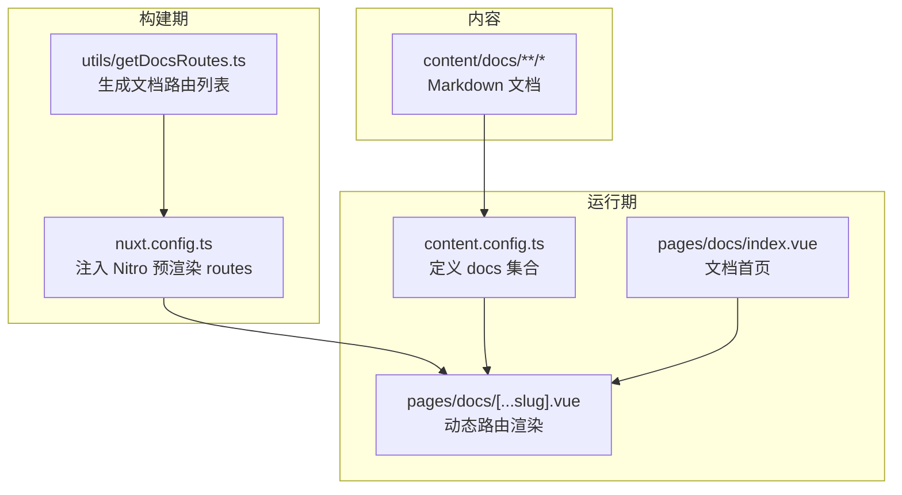
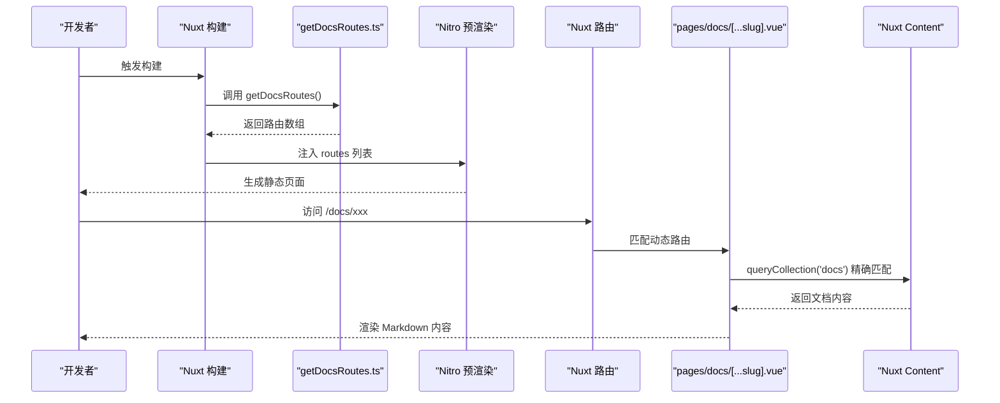
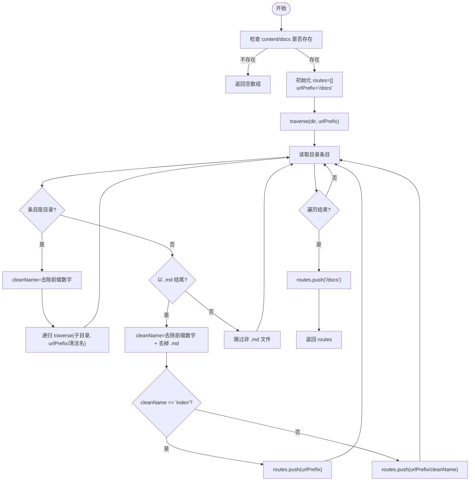
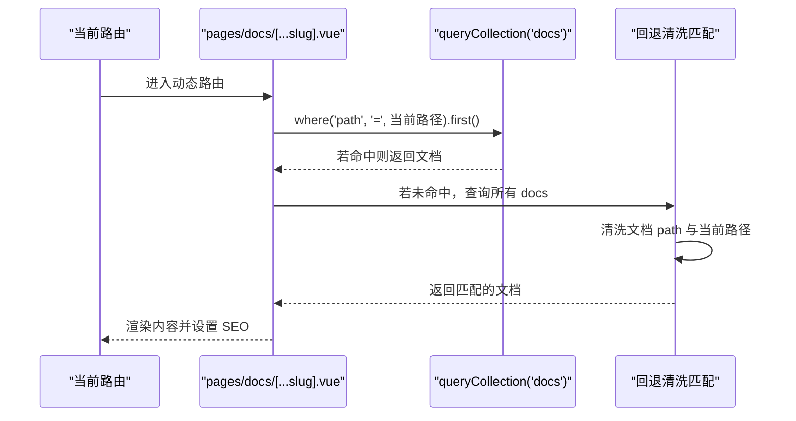
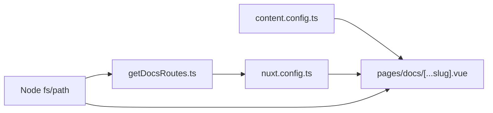

# 路由与路径处理

<cite>
**本文引用的文件**
- [utils/getDocsRoutes.ts](file://utils/getDocsRoutes.ts)
- [nuxt.config.ts](file://nuxt.config.ts)
- [content.config.ts](file://content.config.ts)
- [pages/docs/[...slug].vue](file://pages/docs/[...slug].vue)
- [pages/docs/index.vue](file://pages/docs/index.vue)
- [content/docs/introduction/1.start.md](file://content/docs/introduction/1.start.md)
- [content/docs/introduction/1.configuration.md](file://content/docs/introduction/1.configuration.md)
- [content/docs/introduction/10.migration.md](file://content/docs/introduction/10.migration.md)
- [content/docs/framework/define.md](file://content/docs/framework/define.md)
</cite>

## 目录
1. [引言](#引言)
2. [项目结构](#项目结构)
3. [核心组件](#核心组件)
4. [架构总览](#架构总览)
5. [详细组件分析](#详细组件分析)
6. [依赖关系分析](#依赖关系分析)
7. [性能考量](#性能考量)
8. [故障排查指南](#故障排查指南)
9. [结论](#结论)
10. [附录](#附录)

## 引言
本文件围绕 buidai 项目中“基于文件系统的静态路由生成机制”展开，重点解析工具函数 getDocsRoutes.ts 如何通过 Node.js 的 fs 模块递归遍历 content/docs 目录，将文件路径转换为 Nuxt 应用的路由路径。文档将详细说明：
- cleanName 逻辑在去除数字前缀（如 1.start.md → start）中的作用
- index.md 文件如何映射为目录默认路由
- traverse 函数如何维护 urlPrefix 实现嵌套路径构建
- 为什么需要显式添加 /docs 根路径
- 结合 pages/docs/[...slug].vue 动态路由页面，解释客户端如何根据生成的路由列表正确渲染 Markdown 内容
- 提供实际示例：1.start.md 如何最终映射为 /docs/start 路径
- 讨论该机制对 SEO 优化和静态站点生成的支持能力

## 项目结构
该项目采用 Nuxt + Nuxt Content 的内容驱动架构，文档内容位于 content/docs 下，通过工具函数生成静态路由，再由 Nuxt 的动态路由 pages/docs/[...slug].vue 渲染对应 Markdown 内容。

**图表来源**
- [utils/getDocsRoutes.ts](file://utils/getDocsRoutes.ts#L1-L58)
- [nuxt.config.ts](file://nuxt.config.ts#L1-L91)
- [content.config.ts](file://content.config.ts#L1-L57)
- [pages/docs/[...slug].vue](file://pages/docs/[...slug].vue#L1-L348)
- [pages/docs/index.vue](file://pages/docs/index.vue#L1-L129)

**章节来源**
- [nuxt.config.ts](file://nuxt.config.ts#L1-L91)
- [content.config.ts](file://content.config.ts#L1-L57)

## 核心组件
- getDocsRoutes.ts：递归遍历 content/docs，生成静态路由数组，供 Nitro 预渲染使用
- nuxt.config.ts：启用静态输出并注入 getDocsRoutes() 返回的路由列表
- content.config.ts：定义 docs 集合，声明 Markdown 文件的结构与索引字段
- pages/docs/index.vue：文档首页，展示导航与 SEO 元信息
- pages/docs/[...slug].vue：动态路由页面，负责根据路径精确匹配或回退清洗匹配，渲染内容并生成面包屑、侧边栏、前后文导航等

**章节来源**
- [utils/getDocsRoutes.ts](file://utils/getDocsRoutes.ts#L1-L58)
- [nuxt.config.ts](file://nuxt.config.ts#L1-L91)
- [content.config.ts](file://content.config.ts#L1-L57)
- [pages/docs/index.vue](file://pages/docs/index.vue#L1-L129)
- [pages/docs/[...slug].vue](file://pages/docs/[...slug].vue#L1-L348)

## 架构总览
下面的序列图展示了从构建到运行的关键流程：构建期生成路由，Nitro 预渲染，运行期动态路由匹配与渲染。

**图表来源**
- [utils/getDocsRoutes.ts](file://utils/getDocsRoutes.ts#L1-L58)
- [nuxt.config.ts](file://nuxt.config.ts#L1-L91)
- [pages/docs/[...slug].vue](file://pages/docs/[...slug].vue#L1-L348)

## 详细组件分析

### 工具函数：getDocsRoutes.ts
该函数负责：
- 解析 content/docs 目录，递归遍历子目录
- 对目录名与文件名进行“数字前缀清理”，如 1.start.md → start
- index.md 映射为当前目录路径（即目录默认路由）
- 维护 urlPrefix 实现嵌套路径构建
- 显式添加 /docs 根路径，确保首页可被预渲染与访问

**图表来源**
- [utils/getDocsRoutes.ts](file://utils/getDocsRoutes.ts#L1-L58)

**章节来源**
- [utils/getDocsRoutes.ts](file://utils/getDocsRoutes.ts#L1-L58)

### Nuxt 配置与静态预渲染
- nuxt.config.ts 启用 static 输出并设置 Nitro 的 prerender.routes 为 getDocsRoutes() 的结果
- 这保证了所有通过 getDocsRoutes.ts 生成的路由都会被静态生成，有利于 SEO 与首屏性能

**章节来源**
- [nuxt.config.ts](file://nuxt.config.ts#L1-L91)

### 内容集合与字段约定
- content.config.ts 定义 docs 集合，source 为 docs/**/*.md，确保所有 Markdown 文件被纳入
- 集合 schema 定义了 title、description、category、order 等字段，用于前端导航与排序

**章节来源**
- [content.config.ts](file://content.config.ts#L1-L57)

### 动态路由页面：pages/docs/[...slug].vue
该页面承担以下职责：
- 从 queryCollection('docs') 获取当前路径的文档，若无则回退清洗匹配
- 清洗匹配逻辑：对文档 path 与当前路径分别去除数字前缀、.md、/index，再比较
- 渲染内容、生成面包屑、侧边 TOC、前后文导航
- 设置 SEO 元信息

**图表来源**
- [pages/docs/[...slug].vue](file://pages/docs/[...slug].vue#L1-L348)

**章节来源**
- [pages/docs/[...slug].vue](file://pages/docs/[...slug].vue#L1-L348)

### 文档首页：pages/docs/index.vue
- 通过 queryCollection('docs') 获取全部文档，按 order 排序并按 category 分组
- 展示文档中心首页，便于用户浏览与搜索引擎抓取

**章节来源**
- [pages/docs/index.vue](file://pages/docs/index.vue#L1-L129)

## 依赖关系分析
- utils/getDocsRoutes.ts 依赖 Node.js fs 与 path 模块，读取文件系统
- nuxt.config.ts 依赖 utils/getDocsRoutes.ts 的返回值，将其注入 Nitro 预渲染
- pages/docs/[...slug].vue 依赖 Nuxt Content 的 queryCollection 系列 API
- content.config.ts 为 pages/docs/[...slug].vue 的查询提供集合与字段定义

**图表来源**
- [utils/getDocsRoutes.ts](file://utils/getDocsRoutes.ts#L1-L58)
- [nuxt.config.ts](file://nuxt.config.ts#L1-L91)
- [content.config.ts](file://content.config.ts#L1-L57)
- [pages/docs/[...slug].vue](file://pages/docs/[...slug].vue#L1-L348)

**章节来源**
- [utils/getDocsRoutes.ts](file://utils/getDocsRoutes.ts#L1-L58)
- [nuxt.config.ts](file://nuxt.config.ts#L1-L91)
- [content.config.ts](file://content.config.ts#L1-L57)
- [pages/docs/[...slug].vue](file://pages/docs/[...slug].vue#L1-L348)

## 性能考量
- 静态预渲染：通过 Nitro 预渲染 routes，减少运行期渲染压力，提升首屏性能与 SEO
- 回退清洗匹配：在精确匹配失败时进行清洗匹配，避免重复遍历，提高稳定性
- 集合索引：content.config.ts 中对常用查询字段定义 schema，有助于 Content 查询优化（SQLite/其他数据库）

[本节为一般性指导，不直接分析具体文件]

## 故障排查指南
- 路由未生成或 404
  - 检查 content/docs 目录是否存在，确认 getDocsRoutes.ts 是否被正确调用
  - 确认 nuxt.config.ts 的 prerender.routes 是否包含 /docs 与预期路径
- 路由路径异常（如带数字前缀）
  - 检查目录名与文件名是否包含数字前缀，确保 cleanName 逻辑生效
  - 确认 index.md 是否放置在正确目录，以便映射为目录默认路由
- 动态路由无法渲染
  - 检查 pages/docs/[...slug].vue 的清洗匹配逻辑是否与文件系统一致
  - 确认 content.config.ts 中 docs 集合的 source 与 schema 配置正确

**章节来源**
- [utils/getDocsRoutes.ts](file://utils/getDocsRoutes.ts#L1-L58)
- [nuxt.config.ts](file://nuxt.config.ts#L1-L91)
- [pages/docs/[...slug].vue](file://pages/docs/[...slug].vue#L1-L348)
- [content.config.ts](file://content.config.ts#L1-L57)

## 结论
该机制通过“文件系统 → 路由生成 → 静态预渲染 → 动态渲染”的闭环，实现了文档路由的自动化与可维护性：
- 数字前缀清理确保 URL 友好与稳定
- index.md 的默认路由映射简化了目录访问
- traverse 的 urlPrefix 维护保证了嵌套层级的正确拼接
- 显式添加 /docs 根路径确保首页可被预渲染与访问
- pages/docs/[...slug].vue 的清洗匹配增强了容错能力
- 配合 Nuxt Content 的集合与字段定义，形成稳定的渲染与 SEO 支持

[本节为总结性内容，不直接分析具体文件]

## 附录

### 实际示例：1.start.md → /docs/start
- 文件路径：content/docs/introduction/1.start.md
- 目录层级：introduction
- 目录名数字前缀：1（被 cleanName 去除）
- 文件名数字前缀：1（被 cleanName 去除）
- index.md 行为：若 introduction 目录下存在 index.md，则映射为 /docs/introduction
- 本例中 1.start.md → /docs/introduction/start

**章节来源**
- [content/docs/introduction/1.start.md](file://content/docs/introduction/1.start.md#L1-L117)
- [utils/getDocsRoutes.ts](file://utils/getDocsRoutes.ts#L1-L58)
- [pages/docs/[...slug].vue](file://pages/docs/[...slug].vue#L1-L348)

### SEO 与静态站点生成支持
- 静态预渲染：Nitro 预渲染 routes，提升 SEO 与首屏性能
- 文档首页：pages/docs/index.vue 展示导航，利于搜索引擎抓取
- 动态路由清洗匹配：增强 URL 与内容的一致性，减少 404
- Content 集合 schema：为 SEO 元信息与导航提供结构化数据基础

**章节来源**
- [nuxt.config.ts](file://nuxt.config.ts#L1-L91)
- [pages/docs/index.vue](file://pages/docs/index.vue#L1-L129)
- [pages/docs/[...slug].vue](file://pages/docs/[...slug].vue#L1-L348)
- [content.config.ts](file://content.config.ts#L1-L57)