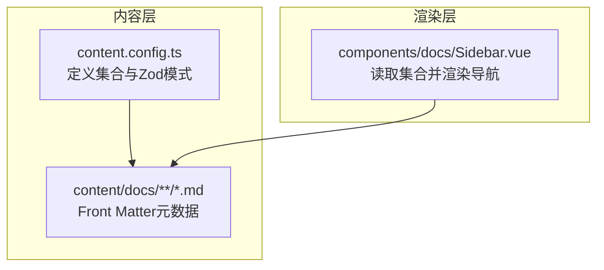
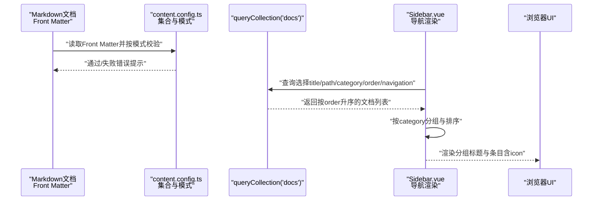
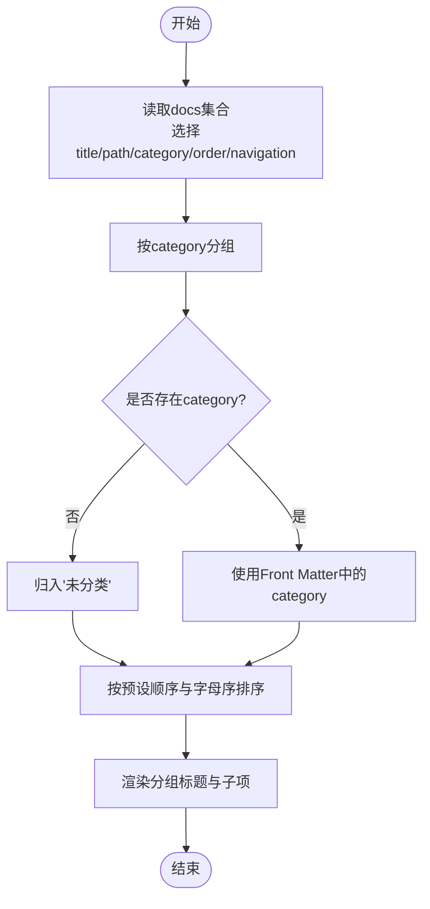
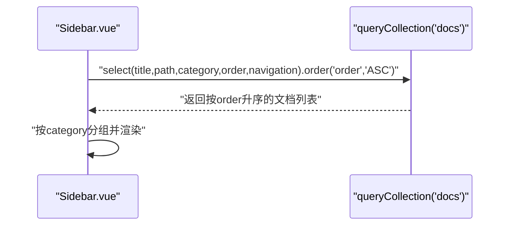
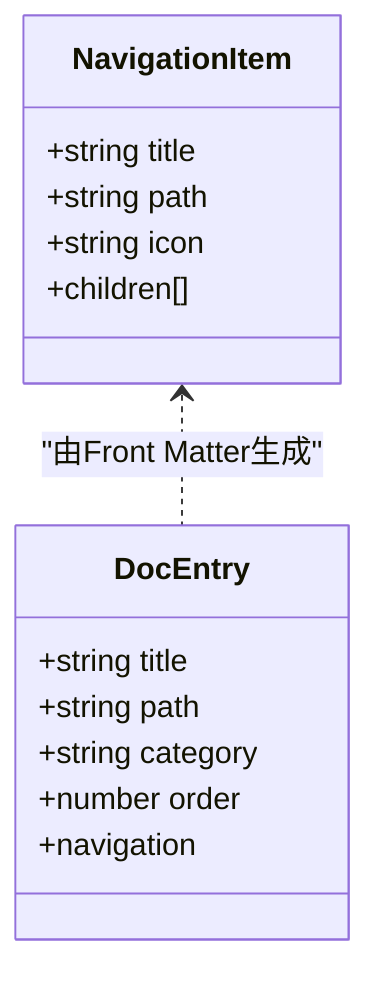
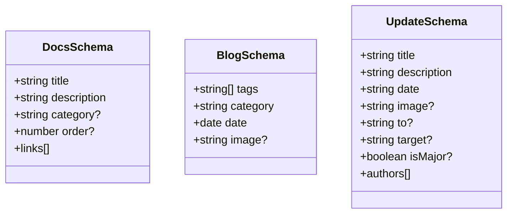
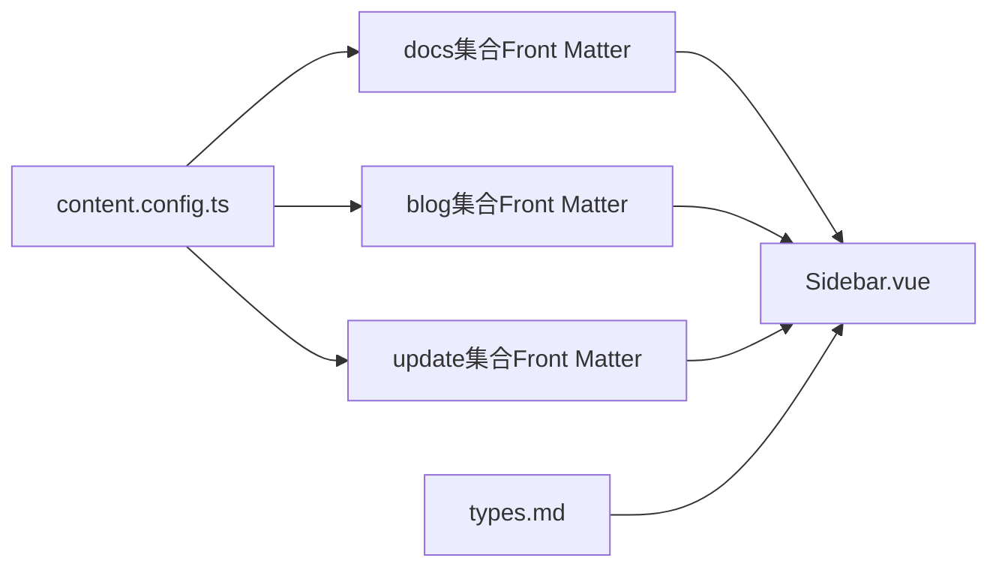

# Front Matter规范

<cite>
**本文引用的文件**
- [content.config.ts](file://content.config.ts)
- [Sidebar.vue](file://components/docs/Sidebar.vue)
- [types.md](file://content/docs/framework/types.md)
- [sources.md](file://content/docs/framework/sources.md)
- [validators.md](file://content/docs/framework/validators.md)
- [1.configuration.md](file://content/docs/introduction/1.configuration.md)
- [demo.vue](file://pages/demo.vue)
</cite>

## 目录
1. [引言](#引言)
2. [项目结构](#项目结构)
3. [核心组件](#核心组件)
4. [架构总览](#架构总览)
5. [详细组件分析](#详细组件分析)
6. [依赖分析](#依赖分析)
7. [性能考虑](#性能考虑)
8. [故障排查指南](#故障排查指南)
9. [结论](#结论)
10. [附录](#附录)

## 引言
本规范文档聚焦于智言万象项目中“Front Matter”元数据的标准化配置，围绕Nuxt Content的集合模式与导航渲染机制，系统阐述以下要点：
- 文档头部YAML元数据的必填与可选字段语义与使用要求
- 分类字段category的取值范围与在导航中的分组作用
- 排序字段order对侧边栏文档顺序的影响机制
- navigation对象中title与icon字段的配置方式及UI展示影响
- 结合content.config.ts中defineCollection的schema验证机制，说明如何通过Zod模式强制校验Front Matter数据结构一致性
- 元数据在SEO优化、内容索引与类型推断中的关键作用

## 项目结构
本项目采用Nuxt Content管理内容，Front Matter元数据主要存在于content/docs下的Markdown文档中；侧边栏导航由Sidebar组件读取集合数据并按category分组、按order排序生成。

图表来源
- [content.config.ts](file://content.config.ts#L1-L57)
- [Sidebar.vue](file://components/docs/Sidebar.vue#L160-L205)

章节来源
- [content.config.ts](file://content.config.ts#L1-L57)
- [Sidebar.vue](file://components/docs/Sidebar.vue#L160-L205)

## 核心组件
- 内容集合与模式校验：在content.config.ts中通过defineCollection与z.object定义各集合的Front Matter字段类型与约束，确保数据一致性与类型推断。
- 侧边栏导航：Sidebar组件在根层级自动查询docs集合，按order升序与category分组生成导航树，并支持navigation.icon在UI中展示。

章节来源
- [content.config.ts](file://content.config.ts#L17-L31)
- [Sidebar.vue](file://components/docs/Sidebar.vue#L160-L205)

## 架构总览
Front Matter数据流从Markdown文件的YAML头部进入Nuxt Content，经由content.config.ts的schema验证后，被Sidebar组件读取并渲染为导航树。

图表来源
- [content.config.ts](file://content.config.ts#L17-L31)
- [Sidebar.vue](file://components/docs/Sidebar.vue#L160-L205)

## 详细组件分析

### 文档头部元数据字段规范
- 必填字段
  - title：页面标题，用于导航与SEO标题
  - description：页面描述，用于SEO摘要与社交分享预览
- 可选字段
  - category：分类名称，用于侧边栏分组；未提供时归入“未分类”
  - order：排序权重，数值越小越靠前；未提供时参与默认排序策略
  - navigation：导航配置对象，包含title与icon，用于UI展示
  - links：相关链接数组（可选），包含label、icon、to、target等

章节来源
- [content.config.ts](file://content.config.ts#L17-L31)
- [types.md](file://content/docs/framework/types.md#L52-L91)
- [1.configuration.md](file://content/docs/introduction/1.configuration.md#L1-L8)

### 分类字段category的语义与导航分组
- 语义：用于将文档按主题或模块进行分组，便于侧边栏折叠与浏览
- 分组逻辑：Sidebar组件在根层级读取docs集合后，优先使用Front Matter中的category进行分组；若缺失则归入“未分类”
- 分组顺序：Sidebar对分组标题进行自定义排序，预设顺序为“指南”、“框架”、“未分类”，其余按字母顺序

图表来源
- [Sidebar.vue](file://components/docs/Sidebar.vue#L188-L239)

章节来源
- [Sidebar.vue](file://components/docs/Sidebar.vue#L188-L239)

### 排序字段order对侧边栏位置的影响机制
- 排序依据：Sidebar在查询docs集合时，按order字段升序排列
- 未提供order的文档：将参与默认排序策略（例如与文件名前缀、路径等综合排序）
- 作用范围：仅影响同一分组内的文档相对顺序，不影响分组本身的顺序

图表来源
- [Sidebar.vue](file://components/docs/Sidebar.vue#L167-L170)

章节来源
- [Sidebar.vue](file://components/docs/Sidebar.vue#L167-L170)

### navigation对象的配置与UI展示
- 配置位置：Front Matter中的navigation对象，包含title与icon
- UI影响：Sidebar在渲染导航条目时，若navigation为对象，会读取其icon并在条目前展示；title用于显示文本
- 兼容性：navigation也可为布尔值（默认true），Sidebar会按对象形态兼容处理

图表来源
- [Sidebar.vue](file://components/docs/Sidebar.vue#L198-L210)
- [types.md](file://content/docs/framework/types.md#L83-L91)

章节来源
- [Sidebar.vue](file://components/docs/Sidebar.vue#L198-L210)
- [types.md](file://content/docs/framework/types.md#L83-L91)

### Zod模式强制校验Front Matter数据结构
- 集合模式：在content.config.ts中，通过defineCollection与z.object定义各集合的字段类型与可选性
- docs集合模式：包含title、description、category（可选）、order（可选）、links（可选）等
- blog集合模式：包含tags、category、date、image（可选）等
- update集合模式：包含title、description、date、image（可选）、to（可选）、target（可选）、isMajor（可选）、authors（可选）

图表来源
- [content.config.ts](file://content.config.ts#L6-L15)
- [content.config.ts](file://content.config.ts#L17-L31)
- [content.config.ts](file://content.config.ts#L34-L53)

章节来源
- [content.config.ts](file://content.config.ts#L6-L15)
- [content.config.ts](file://content.config.ts#L17-L31)
- [content.config.ts](file://content.config.ts#L34-L53)

### SEO优化、内容索引与类型推断的作用
- SEO优化
  - title与description直接影响浏览器标签页标题与搜索结果摘要
  - Open Graph与Twitter Cards标签用于社交平台分享预览
  - Canonical标签避免重复内容问题
- 内容索引
  - Front Matter中的title、description、category、order等字段参与导航与排序
  - Sidebar组件通过queryCollection读取并按order升序渲染，提升内容可发现性
- 类型推断
  - 通过Zod模式定义字段类型，生成类型安全的前端与构建期提示
  - 集合类型（page/data）与默认字段（path/title/description/seo/body/navigation）增强开发体验

章节来源
- [demo.vue](file://pages/demo.vue#L136-L205)
- [types.md](file://content/docs/framework/types.md#L52-L91)
- [Sidebar.vue](file://components/docs/Sidebar.vue#L167-L170)

## 依赖分析
- content.config.ts定义集合与Zod模式，决定Front Matter字段的合法性与类型
- Sidebar.vue依赖queryCollection读取docs集合，依赖Front Matter中的category与order进行分组与排序
- types.md补充说明page类型集合的默认字段与navigation结构，为Front Matter提供参考

图表来源
- [content.config.ts](file://content.config.ts#L1-L57)
- [Sidebar.vue](file://components/docs/Sidebar.vue#L160-L205)
- [types.md](file://content/docs/framework/types.md#L52-L91)

章节来源
- [content.config.ts](file://content.config.ts#L1-L57)
- [Sidebar.vue](file://components/docs/Sidebar.vue#L160-L205)
- [types.md](file://content/docs/framework/types.md#L52-L91)

## 性能考虑
- 查询与排序：Sidebar按order升序查询，建议合理设置order以减少前端复杂排序逻辑
- 分组与渲染：按category分组后渲染，避免在大量文档场景下重复计算
- 导航懒加载：Sidebar在根层级才发起查询，避免不必要的数据请求

## 故障排查指南
- Front Matter字段类型错误
  - 症状：构建时报错或运行时类型不匹配
  - 处理：对照content.config.ts中的schema修正字段类型与可选性
- 分类缺失导致的分组异常
  - 症状：文档被归入“未分类”
  - 处理：在Front Matter中添加category字段
- 导航图标不显示
  - 症状：导航条目缺少图标
  - 处理：在Front Matter的navigation对象中提供icon字段
- 排序不符合预期
  - 症状：文档顺序与期望不符
  - 处理：在Front Matter中设置order字段并确保数值合理

章节来源
- [content.config.ts](file://content.config.ts#L17-L31)
- [Sidebar.vue](file://components/docs/Sidebar.vue#L188-L239)
- [Sidebar.vue](file://components/docs/Sidebar.vue#L198-L210)
- [Sidebar.vue](file://components/docs/Sidebar.vue#L167-L170)

## 结论
本规范明确了智言万象项目中Front Matter元数据的标准化配置，包括必填与可选字段、分类与排序机制、导航图标配置以及Zod模式校验与UI渲染映射。遵循本规范可确保内容质量、导航一致性与SEO表现，同时借助类型推断提升开发效率与可维护性。

## 附录
- 示例文档展示了Front Matter的典型配置，可作为编写新文档的参考模板
- 集合源配置与类型说明可帮助理解内容导入与默认字段行为

章节来源
- [1.configuration.md](file://content/docs/introduction/1.configuration.md#L1-L8)
- [sources.md](file://content/docs/framework/sources.md#L1-L129)
- [types.md](file://content/docs/framework/types.md#L52-L91)