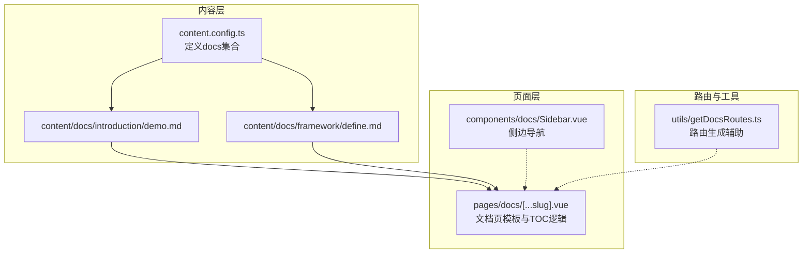
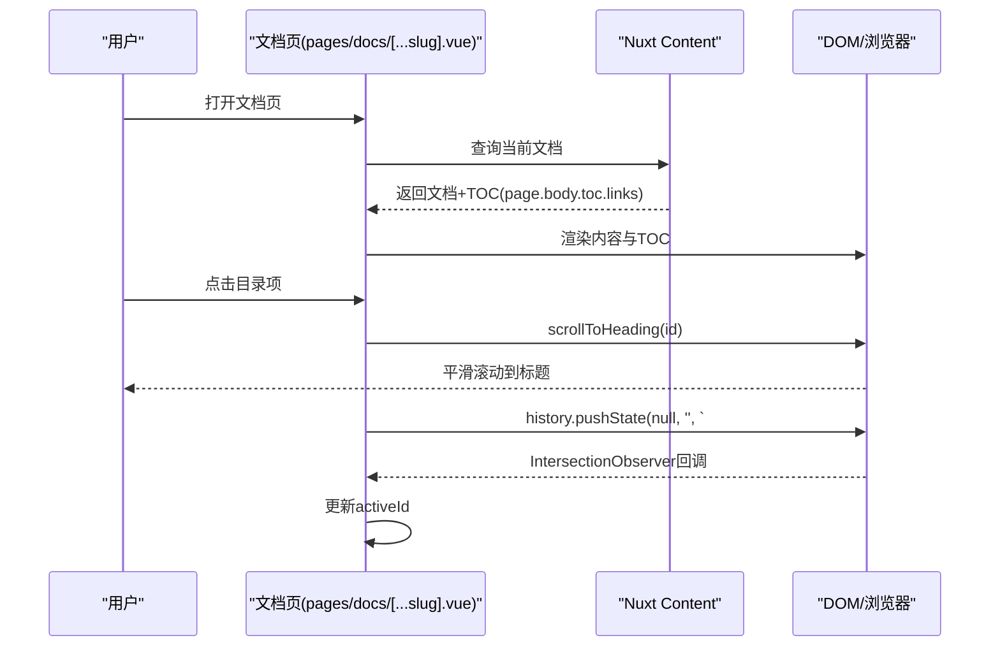
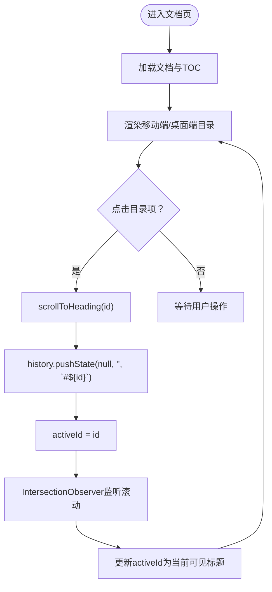
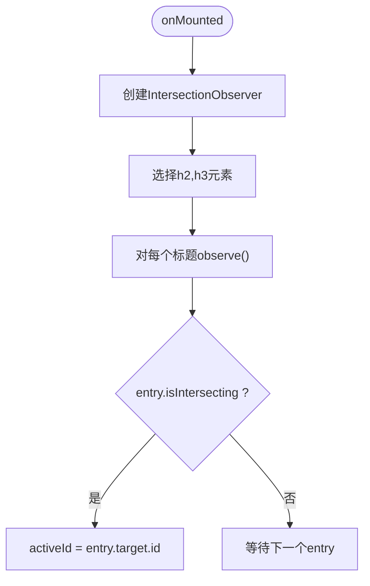
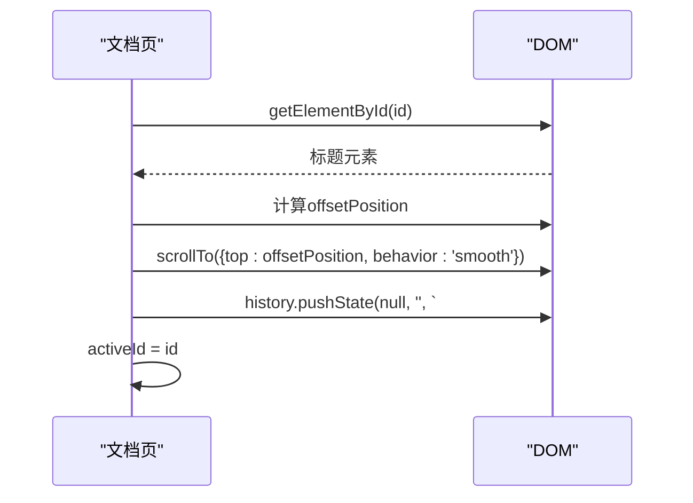
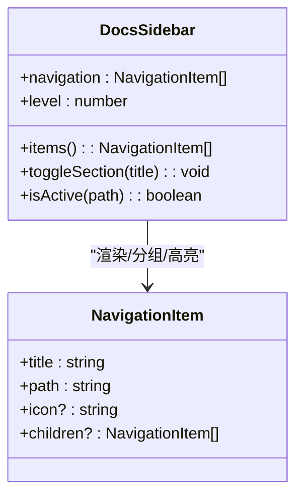
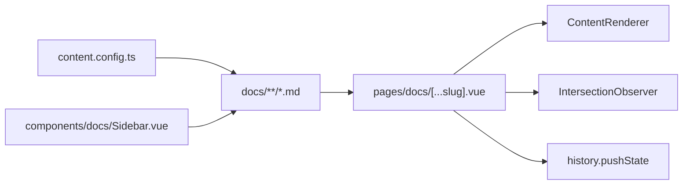

# TOC与锚点机制

<cite>
**本文引用的文件**
- [pages/docs/[...slug].vue](file://pages/docs/[...slug].vue)
- [components/docs/Sidebar.vue](file://components/docs/Sidebar.vue)
- [content.config.ts](file://content.config.ts)
- [content/docs/introduction/demo.md](file://content/docs/introduction/demo.md)
- [content/docs/framework/define.md](file://content/docs/framework/define.md)
- [utils/getDocsRoutes.ts](file://utils/getDocsRoutes.ts)
</cite>

## 目录
1. [引言](#引言)
2. [项目结构](#项目结构)
3. [核心组件](#核心组件)
4. [架构总览](#架构总览)
5. [详细组件分析](#详细组件分析)
6. [依赖关系分析](#依赖关系分析)
7. [性能考量](#性能考量)
8. [故障排查指南](#故障排查指南)
9. [结论](#结论)

## 引言
本文件聚焦于智言万象文档系统的目录（TOC）生成与锚点跳转机制，围绕以下目标展开：
- Content模块如何自动解析Markdown文档中的h1-h6标题并生成结构化的TOC数据对象（含层级嵌套与id生成策略）。
- 在pages/docs/[...slug].vue中实现的双栏TOC布局：左侧移动端可折叠导航与右侧桌面端固定定位目录的响应式适配。
- IntersectionObserver如何监听页面滚动状态并动态更新当前激活的锚点项。
- scrollToHeading函数实现的平滑滚动与URL哈希同步机制。
- 可访问性优化措施（键盘导航支持与ARIA标签应用）。

## 项目结构
文档系统采用Nuxt Content v3的“内容集合”模型，Markdown文件位于content/docs目录下，页面路由由Nuxt Content自动解析并渲染。文档页通过ContentRenderer渲染Markdown内容，同时利用Nuxt Content的TOC能力生成目录树。

图表来源
- [content.config.ts](file://content.config.ts#L1-L57)
- [content/docs/introduction/demo.md](file://content/docs/introduction/demo.md#L1-L33)
- [content/docs/framework/define.md](file://content/docs/framework/define.md#L1-L229)
- [pages/docs/[...slug].vue](file://pages/docs/[...slug].vue#L1-L165)
- [components/docs/Sidebar.vue](file://components/docs/Sidebar.vue#L1-L120)
- [utils/getDocsRoutes.ts](file://utils/getDocsRoutes.ts#L32-L57)

章节来源
- [content.config.ts](file://content.config.ts#L1-L57)
- [pages/docs/[...slug].vue](file://pages/docs/[...slug].vue#L1-L165)
- [components/docs/Sidebar.vue](file://components/docs/Sidebar.vue#L1-L120)
- [utils/getDocsRoutes.ts](file://utils/getDocsRoutes.ts#L32-L57)

## 核心组件
- 文档页模板（pages/docs/[...slug].vue）：负责加载文档、渲染内容、生成移动端与桌面端双栏TOC、处理滚动与激活态、维护URL哈希。
- 侧边导航（components/docs/Sidebar.vue）：从Content集合自动拉取文档列表，按category分组并渲染导航树，支持折叠/展开与当前页高亮。
- 内容配置（content.config.ts）：声明docs集合，定义frontmatter字段，确保Nuxt Content能正确解析与索引文档。
- 示例Markdown（content/docs/introduction/demo.md、content/docs/framework/define.md）：展示h2/h3标题与正文内容，供ContentRenderer渲染与TOC生成。

章节来源
- [pages/docs/[...slug].vue](file://pages/docs/[...slug].vue#L1-L165)
- [components/docs/Sidebar.vue](file://components/docs/Sidebar.vue#L1-L120)
- [content.config.ts](file://content.config.ts#L1-L57)
- [content/docs/introduction/demo.md](file://content/docs/introduction/demo.md#L1-L33)
- [content/docs/framework/define.md](file://content/docs/framework/define.md#L1-L229)

## 架构总览
文档页通过Nuxt Content查询当前文档，ContentRenderer渲染Markdown；同时，Nuxt Content会自动生成TOC数据（page.body.toc.links）。页面基于该数据构建双栏TOC：移动端以可折叠面板呈现，桌面端以固定侧边栏呈现。滚动监听通过IntersectionObserver实现，点击目录项触发平滑滚动并同步URL哈希。

图表来源
- [pages/docs/[...slug].vue](file://pages/docs/[...slug].vue#L167-L284)

章节来源
- [pages/docs/[...slug].vue](file://pages/docs/[...slug].vue#L167-L284)

## 详细组件分析

### Content模块的TOC生成与标题解析
- 自动解析：Nuxt Content在渲染Markdown时会解析h1-h6标题并生成TOC数据对象，字段包含id、text与children（当存在子级标题时）。
- 结构化数据：page.body.toc.links为数组，每个元素包含id与text，若存在子标题则包含children数组，形成层级嵌套。
- 页面消费：文档页模板直接使用page.body.toc.links渲染移动端与桌面端两套目录。

章节来源
- [pages/docs/[...slug].vue](file://pages/docs/[...slug].vue#L43-L160)
- [content/docs/introduction/demo.md](file://content/docs/introduction/demo.md#L1-L33)
- [content/docs/framework/define.md](file://content/docs/framework/define.md#L1-L229)

### 双栏TOC布局与响应式适配
- 移动端（XL以下）：顶部显示“On this page”折叠面板，点击展开后列出目录项；点击目录项触发scrollToHeading并关闭面板。
- 桌面端（XL及以上）：右侧固定侧边栏展示目录树，支持层级缩进与激活态高亮。
- 交互差异：移动端目录项点击后关闭面板，桌面端保持打开以便连续跳转。

图表来源
- [pages/docs/[...slug].vue](file://pages/docs/[...slug].vue#L133-L161)
- [pages/docs/[...slug].vue](file://pages/docs/[...slug].vue#L231-L279)

章节来源
- [pages/docs/[...slug].vue](file://pages/docs/[...slug].vue#L31-L161)

### IntersectionObserver滚动监听与激活态更新
- 观察范围：注册观察器时，对h2、h3标题元素进行观察。
- 激活条件：当某个标题元素进入视口（结合rootMargin）时，将其id设为当前激活项activeId。
- 观察参数：rootMargin设置为“-100px 0px -66% 0px”，用于提前或延后判定激活态，提升交互体验。

图表来源
- [pages/docs/[...slug].vue](file://pages/docs/[...slug].vue#L255-L279)

章节来源
- [pages/docs/[...slug].vue](file://pages/docs/[...slug].vue#L255-L279)

### scrollToHeading平滑滚动与URL哈希同步
- 滚动逻辑：根据目标标题元素的相对位置计算偏移（固定偏移量），调用window.scrollTo并设置behavior为smooth。
- URL同步：使用history.pushState(null, '', `#${id}`)更新URL哈希，避免页面跳动。
- 激活态：滚动完成后更新activeId，确保目录高亮与滚动状态一致。

图表来源
- [pages/docs/[...slug].vue](file://pages/docs/[...slug].vue#L231-L253)

章节来源
- [pages/docs/[...slug].vue](file://pages/docs/[...slug].vue#L231-L253)

### 可访问性优化
- ARIA标签：侧边导航容器使用aria-label标注为“文档导航”，便于屏幕阅读器识别。
- 焦点与状态：目录项使用aria-current标识当前页，折叠按钮使用aria-expanded指示展开状态。
- 键盘友好：目录项为a标签，具备可点击语义；配合键盘Tab键可导航至目录项并回车跳转。

章节来源
- [components/docs/Sidebar.vue](file://components/docs/Sidebar.vue#L13-L23)
- [components/docs/Sidebar.vue](file://components/docs/Sidebar.vue#L51-L62)
- [components/docs/Sidebar.vue](file://components/docs/Sidebar.vue#L81-L92)

### 侧边导航（DocsSidebar）与文档路由
- 自动分组：组件从Content集合查询文档，按category字段进行分组，并支持自定义显示顺序。
- 折叠控制：使用useState持久化折叠状态；根据当前路由自动展开包含当前页面的分组。
- 高亮逻辑：isActive方法比较当前路由与导航项路径，实现当前页高亮。

图表来源
- [components/docs/Sidebar.vue](file://components/docs/Sidebar.vue#L124-L294)

章节来源
- [components/docs/Sidebar.vue](file://components/docs/Sidebar.vue#L124-L294)

### 路由与文档路径清洗
- 文档页通过currentPath对路由进行解码与尾斜杠清理，确保与Content集合中的path字段匹配。
- 回退匹配：若精确匹配失败，会遍历所有文档路径，清洗数字前缀与/index后缀后再进行比对，解决文件命名与URL路径不一致的问题。

章节来源
- [pages/docs/[...slug].vue](file://pages/docs/[...slug].vue#L170-L215)

## 依赖关系分析
- 文档页依赖Nuxt Content的queryCollection与queryCollectionItemSurroundings，用于获取文档与上下文导航。
- 文档页依赖ContentRenderer渲染Markdown内容与TOC。
- 侧边导航依赖Content集合的docs，按category分组并渲染导航树。
- 内容配置content.config.ts定义docs集合与frontmatter字段，确保Content模块正确解析与索引。

图表来源
- [content.config.ts](file://content.config.ts#L1-L57)
- [pages/docs/[...slug].vue](file://pages/docs/[...slug].vue#L167-L284)
- [components/docs/Sidebar.vue](file://components/docs/Sidebar.vue#L156-L205)

章节来源
- [content.config.ts](file://content.config.ts#L1-L57)
- [pages/docs/[...slug].vue](file://pages/docs/[...slug].vue#L167-L284)
- [components/docs/Sidebar.vue](file://components/docs/Sidebar.vue#L156-L205)

## 性能考量
- IntersectionObserver阈值与rootMargin：通过合理设置rootMargin与阈值，减少频繁计算与DOM抖动，提升滚动时的激活态切换性能。
- 并行数据获取：文档页使用Promise.all并行获取文档与上下文导航，缩短首屏渲染时间。
- 滚动优化：scrollToHeading使用smooth滚动，history.pushState避免页面跳动，提升用户体验。
- 侧边导航懒加载：Sidebar在根层级未传入navigation时才自动拉取数据，避免重复请求。

章节来源
- [pages/docs/[...slug].vue](file://pages/docs/[...slug].vue#L185-L220)
- [pages/docs/[...slug].vue](file://pages/docs/[...slug].vue#L255-L279)
- [components/docs/Sidebar.vue](file://components/docs/Sidebar.vue#L160-L177)

## 故障排查指南
- 目录为空或不显示：检查Markdown文件是否包含h2/h3标题，确认Nuxt Content已正确解析并生成page.body.toc.links。
- 激活态不更新：确认h2/h3元素已注册为观察目标，且rootMargin设置合理；检查IntersectionObserver回调是否被触发。
- 点击目录项无反应：检查scrollToHeading是否能获取到对应id的元素；确认history.pushState调用成功。
- 路由不匹配：若URL与文件命名不一致，确认文档页的路径清洗逻辑与回退匹配逻辑生效。
- 侧边导航未高亮：检查isActive逻辑与当前路由是否一致，确认category分组与显示顺序配置正确。

章节来源
- [pages/docs/[...slug].vue](file://pages/docs/[...slug].vue#L231-L279)
- [pages/docs/[...slug].vue](file://pages/docs/[...slug].vue#L170-L215)
- [components/docs/Sidebar.vue](file://components/docs/Sidebar.vue#L280-L289)

## 结论
智言万象文档系统通过Nuxt Content的TOC能力与自研滚动与激活态逻辑，实现了从Markdown标题到结构化目录、再到平滑跳转与高亮反馈的完整链路。移动端与桌面端双栏TOC兼顾可用性与可访问性，IntersectionObserver与history.pushState共同保证了良好的交互体验。后续可进一步完善id去重与唯一性保障、增强键盘导航与ARIA语义，以满足更严格的可访问性标准。