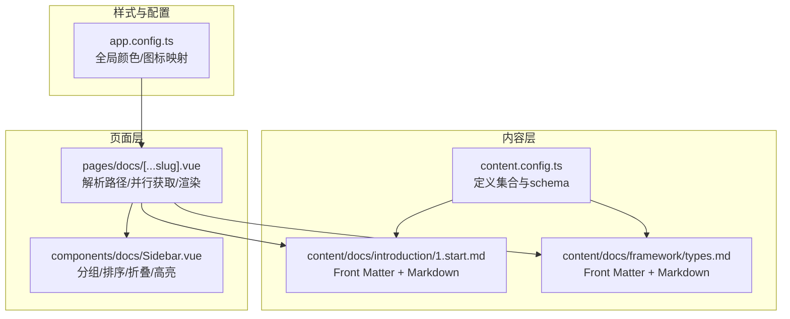
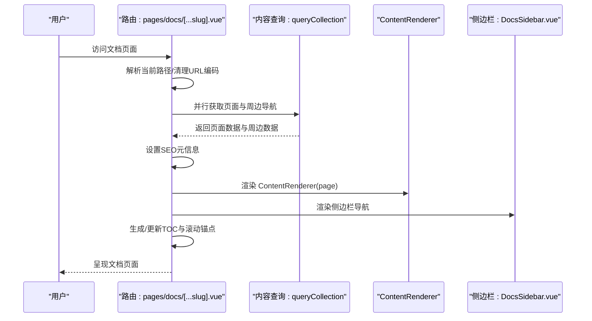
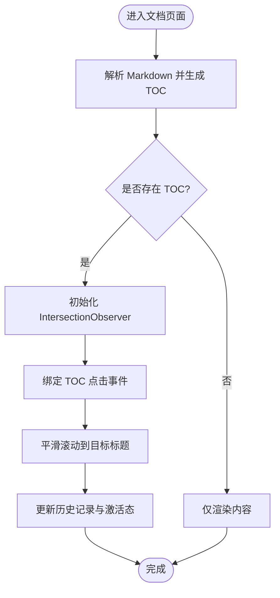
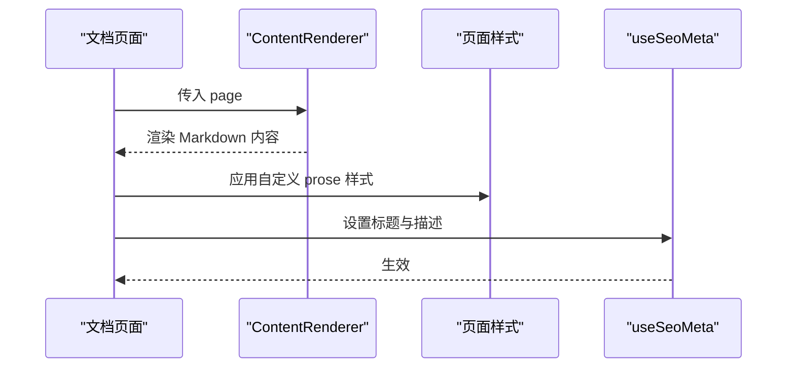
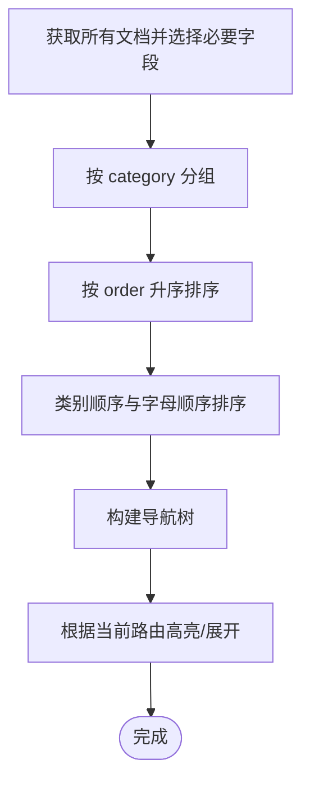
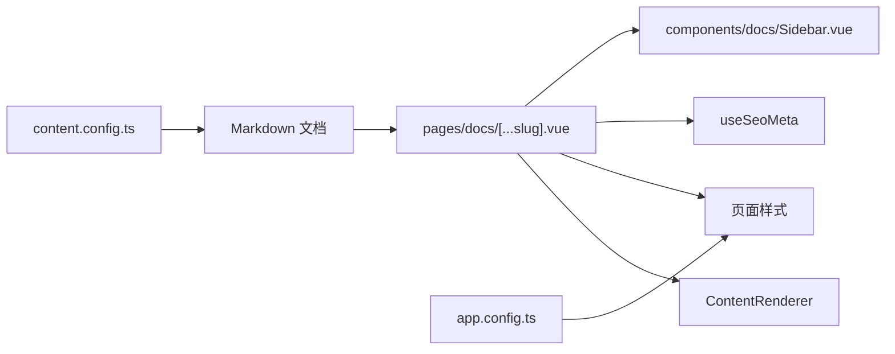

# 编写规范

<cite>
**本文引用的文件**
- [content.config.ts](file://content.config.ts)
- [app.config.ts](file://app.config.ts)
- [pages/docs/[...slug].vue](file://pages/docs/[...slug].vue)
- [components/docs/Sidebar.vue](file://components/docs/Sidebar.vue)
- [content/docs/introduction/1.start.md](file://content/docs/introduction/1.start.md)
- [content/docs/framework/types.md](file://content/docs/framework/types.md)
- [README.md](file://README.md)
</cite>

## 目录
1. [引言](#引言)
2. [项目结构](#项目结构)
3. [核心组件](#核心组件)
4. [架构总览](#架构总览)
5. [详细组件分析](#详细组件分析)
6. [依赖分析](#依赖分析)
7. [性能考虑](#性能考虑)
8. [故障排查指南](#故障排查指南)
9. [结论](#结论)
10. [附录](#附录)

## 引言
本技术文档面向“buidai”项目的内容编写与呈现规范，围绕 Front Matter 的标准化配置、Markdown 内容编写规范、TOC 自动生成规则、ContentRenderer 渲染与全局样式应用、以及内容可访问性（a11y）最佳实践进行系统阐述。文档旨在帮助作者在保持一致性的同时，提升文档的可读性、可维护性与可访问性。

## 项目结构
- 内容集合与校验：通过内容配置文件定义集合类型、字段约束与可选扩展字段（如 links）。
- 文档页面渲染：Catch-All 路由负责解析当前路径、并行获取页面与周边导航，使用 ContentRenderer 渲染 Markdown 内容。
- 侧边栏导航：根据集合字段自动分组与排序，支持分组折叠与当前页高亮。
- 全局样式与图标：通过应用配置文件统一品牌色与图标别名，页面内通过自定义样式覆盖 prose 规范。

图表来源
- [content.config.ts](file://content.config.ts#L1-L57)
- [pages/docs/[...slug].vue](file://pages/docs/[...slug].vue#L1-L120)
- [components/docs/Sidebar.vue](file://components/docs/Sidebar.vue#L150-L210)
- [app.config.ts](file://app.config.ts#L1-L83)

章节来源
- [content.config.ts](file://content.config.ts#L1-L57)
- [pages/docs/[...slug].vue](file://pages/docs/[...slug].vue#L1-L120)
- [components/docs/Sidebar.vue](file://components/docs/Sidebar.vue#L150-L210)
- [app.config.ts](file://app.config.ts#L1-L83)

## 核心组件
- 内容集合与字段约束：docs 集合包含 title、description、category、order、links 等字段，其中 links 为可选数组，包含 label、icon、to、target 等键。
- 文档页面渲染：页面组件负责解析当前路径、并行获取页面与周边导航、渲染面包屑与标题、渲染 ContentRenderer 内容、生成移动端与桌面端 TOC、滚动锚点与激活态。
- 侧边栏导航：自动从集合中按 category 分组、按 order 排序、支持分组折叠与当前页高亮。
- 全局样式与图标：应用配置文件统一品牌色与图标别名，页面内通过 scoped 样式覆盖 prose。

章节来源
- [content.config.ts](file://content.config.ts#L17-L32)
- [pages/docs/[...slug].vue](file://pages/docs/[...slug].vue#L1-L120)
- [components/docs/Sidebar.vue](file://components/docs/Sidebar.vue#L150-L210)
- [app.config.ts](file://app.config.ts#L1-L83)

## 架构总览
文档渲染流程概览如下：

图表来源
- [pages/docs/[...slug].vue](file://pages/docs/[...slug].vue#L170-L220)
- [pages/docs/[...slug].vue](file://pages/docs/[...slug].vue#L280-L284)
- [components/docs/Sidebar.vue](file://components/docs/Sidebar.vue#L160-L177)

## 详细组件分析

### Front Matter 标准化配置
- 必填字段
  - title：文档标题，用于页面标题与面包屑展示。
  - description：文档描述，用于页面描述与 SEO 元信息。
- 可选字段
  - category：分类名称，用于侧边栏分组与首页分组。
  - order：排序权重，用于按数值升序排列。
  - links：相关链接数组，包含 label、icon、to、target 等键，用于页面底部或导航补充。
- links 数组配置格式
  - label：链接文本
  - icon：图标名称（遵循 Nuxt UI 图标别名映射）
  - to：链接地址
  - target：打开方式（可选）

章节来源
- [content.config.ts](file://content.config.ts#L17-L32)
- [content/docs/introduction/1.start.md](file://content/docs/introduction/1.start.md#L1-L10)
- [content/docs/framework/types.md](file://content/docs/framework/types.md#L1-L10)

### Markdown 内容编写规范
- 标题层级
  - 使用 H1、H2、H3 等标准标题层级，页面标题由 Front Matter 的 title 字段决定，正文标题用于生成 TOC。
- 代码块语法高亮
  - 使用标准的围栏代码块语法，渲染器基于内容系统与语法高亮库提供语法高亮能力。
- 自定义容器
  - 使用扩展语法定义提示/注意/警告等容器，便于传达重要信息与注意事项。
- 表格排版
  - 使用标准表格语法，配合页面样式实现一致的视觉效果。

章节来源
- [content/docs/framework/types.md](file://content/docs/framework/types.md#L1-L10)
- [content/docs/framework/types.md](file://content/docs/framework/types.md#L110-L141)
- [pages/docs/[...slug].vue](file://pages/docs/[...slug].vue#L286-L347)

### TOC（目录）自动生成规则
- 生成来源
  - 内容系统在解析 Markdown 时生成 TOC 结构，包含 links 数组，每个条目包含 id 与 text，并可包含 children。
- 支持的标题层级
  - 页面中使用 H2、H3 标题参与 TOC 生成与滚动锚点。
- id 生成策略
  - TOC 条目包含 id，页面中标题元素应具有与之对应的 id，以便锚点跳转。
- 锚点链接行为
  - 点击 TOC 链接触发平滑滚动至目标标题，并更新历史记录与激活态。
- 响应式 TOC
  - 桌面端显示固定侧边栏 TOC；移动端显示折叠面板，点击展开后逐级跳转。

图表来源
- [pages/docs/[...slug].vue](file://pages/docs/[...slug].vue#L231-L278)
- [pages/docs/[...slug].vue](file://pages/docs/[...slug].vue#L255-L271)

章节来源
- [pages/docs/[...slug].vue](file://pages/docs/[...slug].vue#L30-L69)
- [pages/docs/[...slug].vue](file://pages/docs/[...slug].vue#L133-L161)
- [pages/docs/[...slug].vue](file://pages/docs/[...slug].vue#L231-L278)

### ContentRenderer 组件解析与渲染
- 渲染入口
  - 页面通过 ContentRenderer 组件渲染 page.body，将解析后的 Markdown AST 渲染为 HTML。
- 全局样式应用
  - 页面通过 scoped 样式覆盖 prose 规范，统一标题、段落、列表、代码块、引用、表格与图片的视觉风格。
- SEO 元信息
  - 页面使用 useSeoMeta 设置标题与描述，标题包含“- 文档中心”，描述来自页面描述字段。

图表来源
- [pages/docs/[...slug].vue](file://pages/docs/[...slug].vue#L71-L74)
- [pages/docs/[...slug].vue](file://pages/docs/[...slug].vue#L286-L347)
- [pages/docs/[...slug].vue](file://pages/docs/[...slug].vue#L280-L284)

章节来源
- [pages/docs/[...slug].vue](file://pages/docs/[...slug].vue#L71-L74)
- [pages/docs/[...slug].vue](file://pages/docs/[...slug].vue#L286-L347)
- [pages/docs/[...slug].vue](file://pages/docs/[...slug].vue#L280-L284)

### 侧边栏导航与分组排序
- 自动分组
  - 侧边栏根据文档的 category 字段进行分组，默认“未分类”兜底。
- 排序规则
  - 优先使用 order 字段升序排列；若未提供则按类别顺序与字母顺序排序。
- 折叠与高亮
  - 根据当前激活路由自动展开包含该页面的分组；支持手动折叠/展开；当前页高亮。

图表来源
- [components/docs/Sidebar.vue](file://components/docs/Sidebar.vue#L160-L177)
- [components/docs/Sidebar.vue](file://components/docs/Sidebar.vue#L185-L239)
- [components/docs/Sidebar.vue](file://components/docs/Sidebar.vue#L241-L268)

章节来源
- [components/docs/Sidebar.vue](file://components/docs/Sidebar.vue#L160-L177)
- [components/docs/Sidebar.vue](file://components/docs/Sidebar.vue#L185-L239)
- [components/docs/Sidebar.vue](file://components/docs/Sidebar.vue#L241-L268)

### 内容可访问性（a11y）最佳实践
- 标题结构
  - 保持语义化标题层级，避免跳级使用标题。
- 图片
  - 为图片提供合适的替代文本（alt），提升可读性与可访问性。
- 导航与交互
  - 为交互元素提供明确的可读文案与键盘可达性；为当前页链接添加 aria-current 标记。
- 对比度与焦点
  - 确保文本与背景的对比度满足可读性要求；为可聚焦元素提供可见焦点样式。
- 链接
  - 使用语义化链接文本；外部链接使用适当的 target 与图标提示。

章节来源
- [components/docs/Sidebar.vue](file://components/docs/Sidebar.vue#L13-L20)
- [components/docs/Sidebar.vue](file://components/docs/Sidebar.vue#L82-L101)
- [README.md](file://README.md#L95-L102)

## 依赖分析
- 内容系统依赖
  - 内容集合定义与字段校验依赖内容配置文件。
- 渲染与样式依赖
  - 页面渲染依赖 ContentRenderer；样式依赖页面 scoped 样式与全局 UI 配置。
- 导航与分组依赖
  - 侧边栏依赖集合字段（title、path、category、order、navigation）进行分组与排序。

图表来源
- [content.config.ts](file://content.config.ts#L1-L57)
- [pages/docs/[...slug].vue](file://pages/docs/[...slug].vue#L71-L74)
- [components/docs/Sidebar.vue](file://components/docs/Sidebar.vue#L160-L177)
- [app.config.ts](file://app.config.ts#L1-L83)

章节来源
- [content.config.ts](file://content.config.ts#L1-L57)
- [pages/docs/[...slug].vue](file://pages/docs/[...slug].vue#L71-L74)
- [components/docs/Sidebar.vue](file://components/docs/Sidebar.vue#L160-L177)
- [app.config.ts](file://app.config.ts#L1-L83)

## 性能考虑
- 预渲染与静态化
  - 项目采用预渲染策略，有利于首屏性能与 SEO。
- 资源优化
  - 合理使用图片与动画，避免过度渲染；利用原子类与主题变量减少样式体积。
- 渲染优化
  - 并行获取页面与周边导航，减少等待时间；TOC 仅在存在时渲染，避免不必要的 DOM。

章节来源
- [README.md](file://README.md#L57-L63)
- [pages/docs/[...slug].vue](file://pages/docs/[...slug].vue#L185-L220)

## 故障排查指南
- 页面 404
  - 当未匹配到页面时，页面组件设置 404 状态并提示错误信息；可检查路径清理逻辑与集合路径生成。
- TOC 不显示
  - 确认 Markdown 中存在 H2/H3 标题；检查页面是否正确传入 page.body.toc。
- 锚点无效
  - 确认标题元素具有与 TOC 条目相同的 id；检查滚动逻辑与历史记录更新。
- 侧边栏分组异常
  - 检查文档的 category 字段与 order 字段；确认分组顺序与排序逻辑。

章节来源
- [pages/docs/[...slug].vue](file://pages/docs/[...slug].vue#L222-L226)
- [pages/docs/[...slug].vue](file://pages/docs/[...slug].vue#L231-L278)
- [components/docs/Sidebar.vue](file://components/docs/Sidebar.vue#L185-L239)

## 结论
通过标准化的 Front Matter 字段、严格的 Markdown 编写规范、完善的 TOC 自动生成与锚点滚动、以及全局样式与可访问性最佳实践，buidai 项目的文档体系能够在一致性与可维护性之间取得良好平衡。建议在新增文档时严格遵循本文规范，确保读者体验与 SEO 表现。

## 附录
- Front Matter 字段清单
  - 必填：title、description
  - 可选：category、order、links（label、icon、to、target）
- Markdown 扩展语法
  - 代码块、表格、自定义容器（提示/注意/警告）
- TOC 生成与锚点
  - H2/H3 标题参与 TOC；点击跳转并更新激活态
- 全局样式与图标
  - 应用配置文件统一品牌色与图标别名；页面样式覆盖 prose

章节来源
- [content.config.ts](file://content.config.ts#L17-L32)
- [content/docs/framework/types.md](file://content/docs/framework/types.md#L1-L10)
- [pages/docs/[...slug].vue](file://pages/docs/[...slug].vue#L286-L347)
- [app.config.ts](file://app.config.ts#L1-L83)