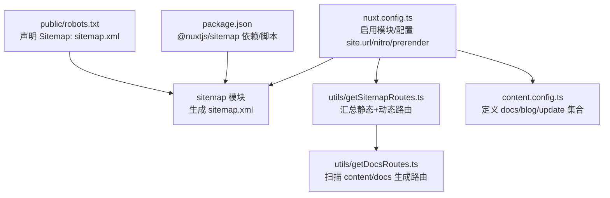
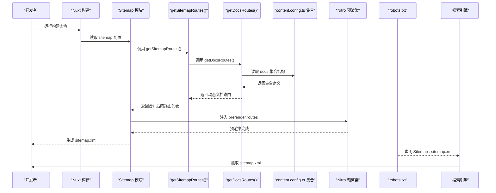
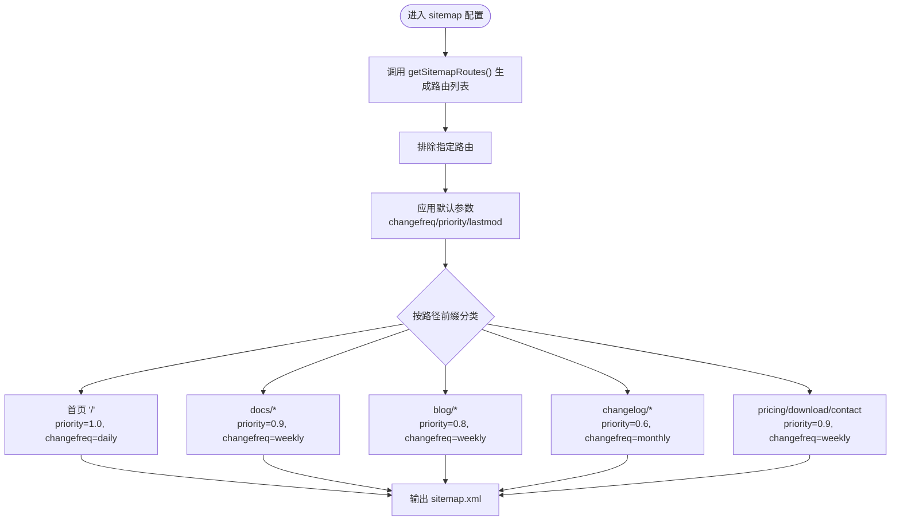
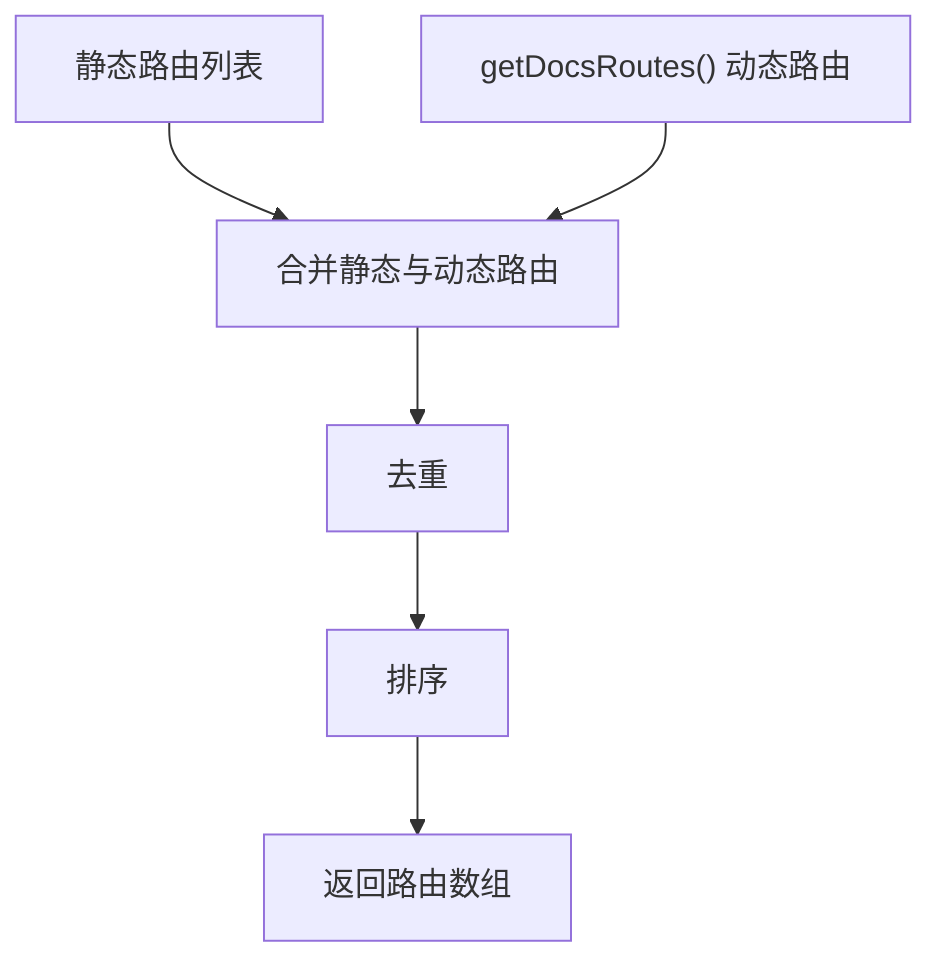
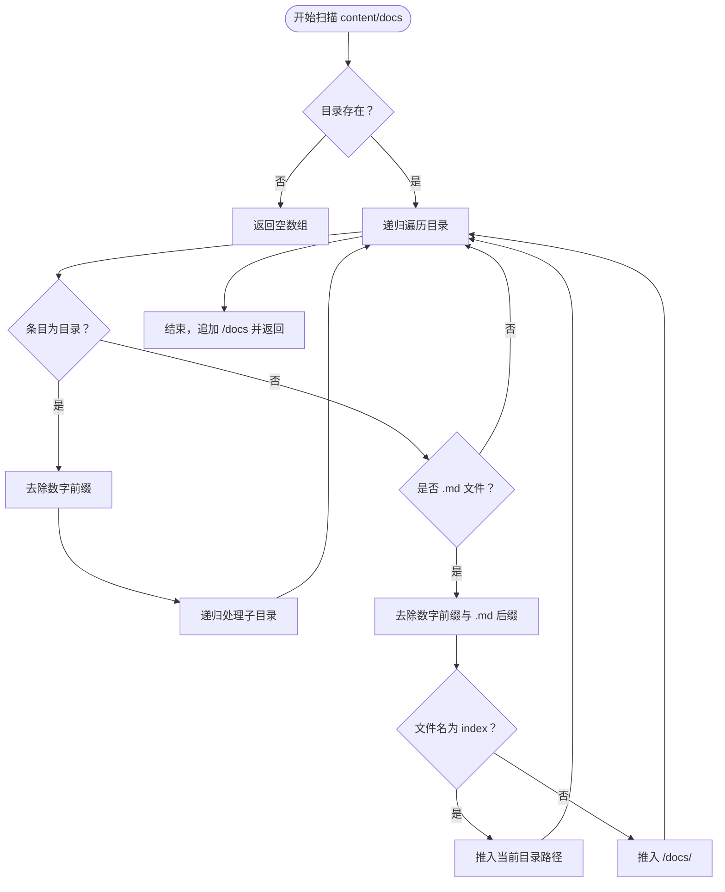
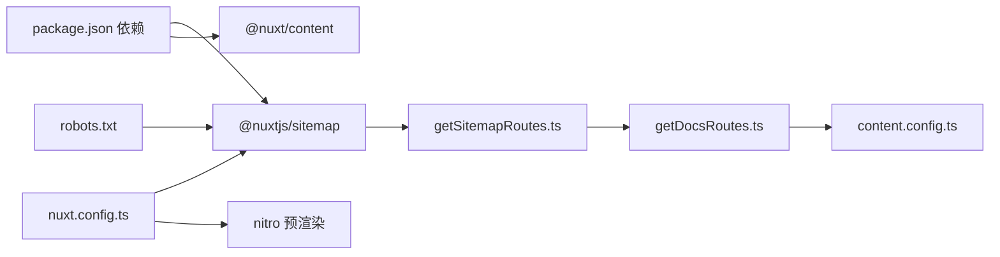

# 站点地图生成配置

<cite>
**本文引用的文件**
- [nuxt.config.ts](file://nuxt.config.ts)
- [content.config.ts](file://content.config.ts)
- [utils/getSitemapRoutes.ts](file://utils/getSitemapRoutes.ts)
- [utils/getDocsRoutes.ts](file://utils/getDocsRoutes.ts)
- [public/robots.txt](file://public/robots.txt)
- [package.json](file://package.json)
</cite>

## 目录
1. [简介](#简介)
2. [项目结构](#项目结构)
3. [核心组件](#核心组件)
4. [架构总览](#架构总览)
5. [详细组件分析](#详细组件分析)
6. [依赖关系分析](#依赖关系分析)
7. [性能考量](#性能考量)
8. [故障排查指南](#故障排查指南)
9. [结论](#结论)

## 简介
本文件系统性梳理了站点地图生成的配置与实现，涵盖 Nuxt 配置、动态路由采集、sitemap 模块参数、robots.txt 集成以及构建流程。目标是帮助维护者快速理解“如何生成并发布 sitemap”，并提供可操作的优化建议与排障指引。

## 项目结构
围绕站点地图生成的关键文件与职责如下：
- 构建与模块配置：nuxt.config.ts 中启用 sitemap 模块、配置 site.url、nitro 预渲染注入动态文档路由，并通过 sitemap.urls 与 sitemap.routes 驱动生成。
- 内容集合定义：content.config.ts 定义了 blog/docs/update 等集合，为动态路由采集提供依据。
- 路由采集工具：utils/getSitemapRoutes.ts 汇总静态路由与动态文档路由；utils/getDocsRoutes.ts 递归扫描 content/docs 生成文档路由。
- 爬虫与索引：public/robots.txt 声明 sitemap.xml 的位置，确保搜索引擎正确抓取。
- 依赖与脚本：package.json 中包含 @nuxtjs/sitemap 与测试脚本，便于验证 sitemap 生成。

**图表来源**
- [nuxt.config.ts](file://nuxt.config.ts#L19-L23)
- [nuxt.config.ts](file://nuxt.config.ts#L43-L93)
- [utils/getSitemapRoutes.ts](file://utils/getSitemapRoutes.ts#L1-L43)
- [utils/getDocsRoutes.ts](file://utils/getDocsRoutes.ts#L1-L58)
- [content.config.ts](file://content.config.ts#L1-L57)
- [public/robots.txt](file://public/robots.txt#L24-L26)
- [package.json](file://package.json#L22-L22)

**章节来源**
- [nuxt.config.ts](file://nuxt.config.ts#L19-L23)
- [nuxt.config.ts](file://nuxt.config.ts#L43-L93)
- [content.config.ts](file://content.config.ts#L1-L57)
- [utils/getSitemapRoutes.ts](file://utils/getSitemapRoutes.ts#L1-L43)
- [utils/getDocsRoutes.ts](file://utils/getDocsRoutes.ts#L1-L58)
- [public/robots.txt](file://public/robots.txt#L24-L26)
- [package.json](file://package.json#L22-L22)

## 核心组件
- sitemap 模块与配置
  - 在模块列表中启用 @nuxtjs/sitemap。
  - 通过 site.url 指定基础 URL，供 sitemap.xml 输出使用。
  - sitemap.urls 使用 getSitemapRoutes() 动态生成路由列表。
  - sitemap.exclude 排除特定路由（如演示页）。
  - sitemap.defaults 设置默认变更频率、优先级与最后修改时间。
  - sitemap.routes 对不同路径前缀设置差异化优先级与变更频率。
- 动态路由采集
  - getSitemapRoutes() 汇总静态路由与 getDocsRoutes() 返回的动态文档路由，去重并排序。
  - getDocsRoutes() 递归扫描 content/docs，按目录与文件名规则生成路由，支持去除数字前缀与 index 处理。
- Nitro 预渲染集成
  - nitro.prerender.routes 注入 getDocsRoutes()，确保文档页面在静态构建阶段被预渲染。
- 内容集合
  - content.config.ts 定义 blog/docs/update 集合，为文档路由采集提供数据来源与结构约束。
- 爬虫与索引
  - robots.txt 声明 Sitemap: https://www.智言万象.com/sitemap.xml，引导搜索引擎抓取 sitemap。

**章节来源**
- [nuxt.config.ts](file://nuxt.config.ts#L19-L23)
- [nuxt.config.ts](file://nuxt.config.ts#L43-L93)
- [utils/getSitemapRoutes.ts](file://utils/getSitemapRoutes.ts#L1-L43)
- [utils/getDocsRoutes.ts](file://utils/getDocsRoutes.ts#L1-L58)
- [content.config.ts](file://content.config.ts#L1-L57)
- [public/robots.txt](file://public/robots.txt#L24-L26)

## 架构总览
下图展示了从配置到最终 sitemap.xml 的生成链路，以及与 Nitro 预渲染、内容集合的关系。

**图表来源**
- [nuxt.config.ts](file://nuxt.config.ts#L43-L93)
- [nuxt.config.ts](file://nuxt.config.ts#L95-L106)
- [utils/getSitemapRoutes.ts](file://utils/getSitemapRoutes.ts#L1-L43)
- [utils/getDocsRoutes.ts](file://utils/getDocsRoutes.ts#L1-L58)
- [content.config.ts](file://content.config.ts#L1-L57)
- [public/robots.txt](file://public/robots.txt#L24-L26)

## 详细组件分析

### 组件一：sitemap 模块配置与参数
- 模块启用与基础配置
  - 在 modules 中启用 @nuxtjs/sitemap。
  - site.url 指定站点基础 URL，确保 sitemap 输出的规范链接。
- 动态路由与排除
  - sitemap.urls 使用 getSitemapRoutes() 返回的路由数组。
  - exclude 明确排除演示页等不需要收录的路由。
- 默认与差异化参数
  - defaults 设置默认 changefreq/priority/lastmod。
  - routes 对首页、文档、博客、更新日志、定价/下载/联系等路径设置差异化优先级与变更频率，以提升搜索引擎抓取效率与排序权重。
- 与 Nitro 预渲染联动
  - nitro.prerender.routes 注入 getDocsRoutes()，确保文档页面在静态构建阶段被预渲染，避免运行时渲染导致的抓取问题。

**图表来源**
- [nuxt.config.ts](file://nuxt.config.ts#L43-L93)

**章节来源**
- [nuxt.config.ts](file://nuxt.config.ts#L43-L93)
- [nuxt.config.ts](file://nuxt.config.ts#L95-L106)

### 组件二：动态路由采集器（getSitemapRoutes）
- 职责
  - 汇总静态页面路由与动态文档路由，去重并排序，形成最终 sitemap 路由清单。
- 关键点
  - 静态路由列表包含首页、AI智能体、私有部署、解决方案、应用中心、定价、更新日志、博客、资源、联系、关于、下载等。
  - 动态路由来自 getDocsRoutes()，确保新增文档自动纳入 sitemap。
  - 返回数组去重并排序，保证 sitemap 的稳定性和可读性。

**图表来源**
- [utils/getSitemapRoutes.ts](file://utils/getSitemapRoutes.ts#L1-L43)

**章节来源**
- [utils/getSitemapRoutes.ts](file://utils/getSitemapRoutes.ts#L1-L43)

### 组件三：文档路由采集器（getDocsRoutes）
- 职责
  - 递归扫描 content/docs 目录，解析 Markdown 文件并生成对应路由路径。
- 关键点
  - 去除目录与文件名中的数字前缀（如 "1.introduction" -> "introduction"），保持 URL 清晰。
  - index.md 路径映射为当前目录路径，确保索引页被收录。
  - 若 content/docs 不存在则返回空数组，避免构建失败。
  - 返回数组包含 /docs 根路径，确保文档首页被收录。

**图表来源**
- [utils/getDocsRoutes.ts](file://utils/getDocsRoutes.ts#L1-L58)

**章节来源**
- [utils/getDocsRoutes.ts](file://utils/getDocsRoutes.ts#L1-L58)

### 组件四：内容集合定义（content.config.ts）
- 职责
  - 定义 blog/docs/update 等集合，为文档路由采集提供数据来源与结构约束。
- 影响
  - getDocsRoutes() 依赖 content/docs 结构，集合定义变化会影响路由生成。
  - blog/update 集合的 schema 有助于统一字段与校验，间接影响 sitemap 的一致性。

**章节来源**
- [content.config.ts](file://content.config.ts#L1-L57)

### 组件五：robots.txt 与 sitemap 发布
- 职责
  - 声明 Sitemap: https://www.智言万象.com/sitemap.xml，引导搜索引擎抓取。
- 注意事项
  - robots.txt 中允许爬取重要页面（如 /docs、/blog、/changelog、/pricing、/download、/contact、/about、/solutions、/resources），与 sitemap 路由策略一致。
  - 如需限制某些路径，可在 robots.txt 中添加 Disallow 或 Allow 规则。

**章节来源**
- [public/robots.txt](file://public/robots.txt#L14-L23)
- [public/robots.txt](file://public/robots.txt#L24-L26)

## 依赖关系分析
- 模块依赖
  - @nuxtjs/sitemap：负责生成 sitemap.xml。
  - @nuxt/content：提供内容集合与文档渲染能力，间接影响动态路由生成。
  - @nuxt/ui、@nuxtjs/color-mode、Tailwind 等：UI 与主题相关，不影响 sitemap。
- 构建脚本
  - package.json 中包含构建与类型检查脚本，sitemap 生成在静态构建阶段完成。
- 关键耦合点
  - nuxt.config.ts 的 sitemap 配置与 utils/getSitemapRoutes.ts 的输出强耦合。
  - getDocsRoutes() 依赖 content/docs 目录结构，若目录缺失或命名不规范，将影响路由生成。

**图表来源**
- [package.json](file://package.json#L22-L22)
- [package.json](file://package.json#L38-L48)
- [nuxt.config.ts](file://nuxt.config.ts#L19-L23)
- [nuxt.config.ts](file://nuxt.config.ts#L95-L106)
- [utils/getSitemapRoutes.ts](file://utils/getSitemapRoutes.ts#L1-L43)
- [utils/getDocsRoutes.ts](file://utils/getDocsRoutes.ts#L1-L58)
- [content.config.ts](file://content.config.ts#L1-L57)
- [public/robots.txt](file://public/robots.txt#L24-L26)

**章节来源**
- [package.json](file://package.json#L22-L22)
- [package.json](file://package.json#L38-L48)
- [nuxt.config.ts](file://nuxt.config.ts#L19-L23)
- [nuxt.config.ts](file://nuxt.config.ts#L95-L106)
- [utils/getSitemapRoutes.ts](file://utils/getSitemapRoutes.ts#L1-L43)
- [utils/getDocsRoutes.ts](file://utils/getDocsRoutes.ts#L1-L58)
- [content.config.ts](file://content.config.ts#L1-L57)
- [public/robots.txt](file://public/robots.txt#L24-L26)

## 性能考量
- 预渲染与增量更新
  - Nitro 预渲染会提前生成文档页面，减少首次访问时的渲染压力，有利于搜索引擎抓取与首屏性能。
- 路由生成复杂度
  - getDocsRoutes() 采用递归遍历，时间复杂度近似 O(N)，其中 N 为 content/docs 下的文件与目录总数。建议保持目录结构清晰，避免过深嵌套。
- sitemap 体积控制
  - 通过 exclude 与 routes 的差异化优先级，可以控制 sitemap 的规模与抓取权重，避免过度抓取低价值页面。
- 构建稳定性
  - 若 content/docs 目录缺失，getDocsRoutes() 返回空数组，不会导致构建失败，但需确保目录存在以生成完整 sitemap。

[本节为通用性能建议，无需具体文件分析]

## 故障排查指南
- sitemap 为空或不完整
  - 检查 getSitemapRoutes() 是否返回空数组：确认静态路由列表与 getDocsRoutes() 的返回值。
  - 检查 content/docs 目录是否存在且命名规范（去除数字前缀与 index 处理）。
- 文档页面未被收录
  - 确认 nitro.prerender.routes 已注入 getDocsRoutes()。
  - 检查 robots.txt 是否允许爬取 /docs、/blog、/changelog 等路径。
- 优先级与变更频率不符合预期
  - 检查 sitemap.routes 中对路径前缀的匹配逻辑与默认值设置。
- 构建报错或耗时过长
  - 检查 content/docs 目录结构与文件数量，必要时分批迁移或清理冗余文件。
  - 确认 @nuxtjs/sitemap 与 @nuxt/content 的版本兼容性。

**章节来源**
- [utils/getSitemapRoutes.ts](file://utils/getSitemapRoutes.ts#L1-L43)
- [utils/getDocsRoutes.ts](file://utils/getDocsRoutes.ts#L1-L58)
- [nuxt.config.ts](file://nuxt.config.ts#L95-L106)
- [public/robots.txt](file://public/robots.txt#L14-L23)

## 结论
本项目的站点地图生成通过“模块配置 + 动态路由采集 + 预渲染”的组合实现，既保证了首页与重要页面的高权重收录，又通过差异化优先级与排除策略提升了抓取效率与稳定性。配合 robots.txt 的明确声明，能够有效引导搜索引擎抓取并索引网站内容。建议在新增文档时遵循现有命名规范，并定期验证 sitemap 生成与抓取状态。