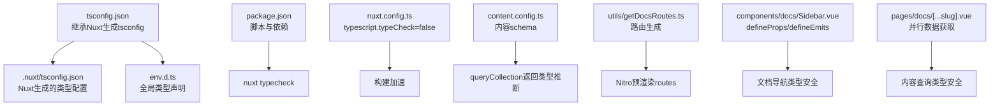
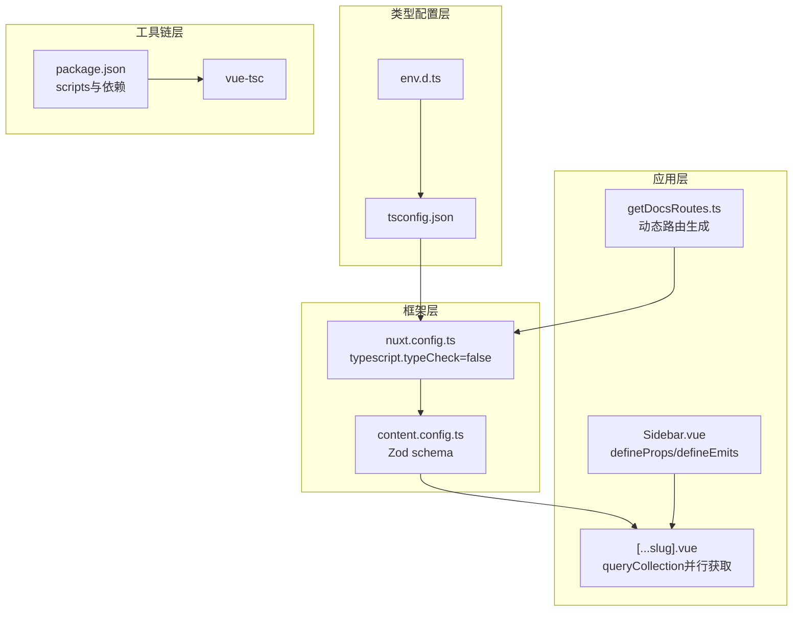
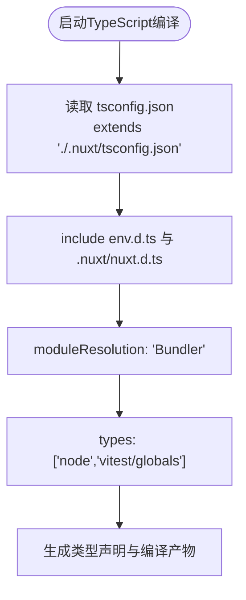
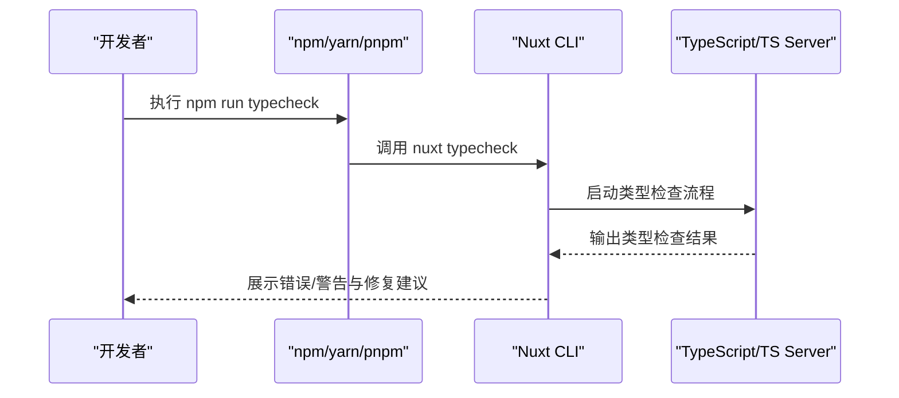
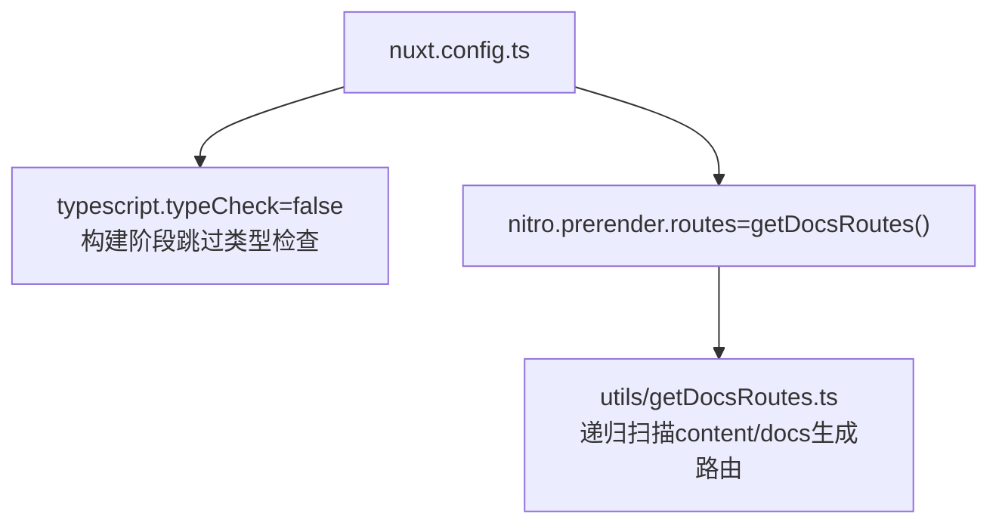
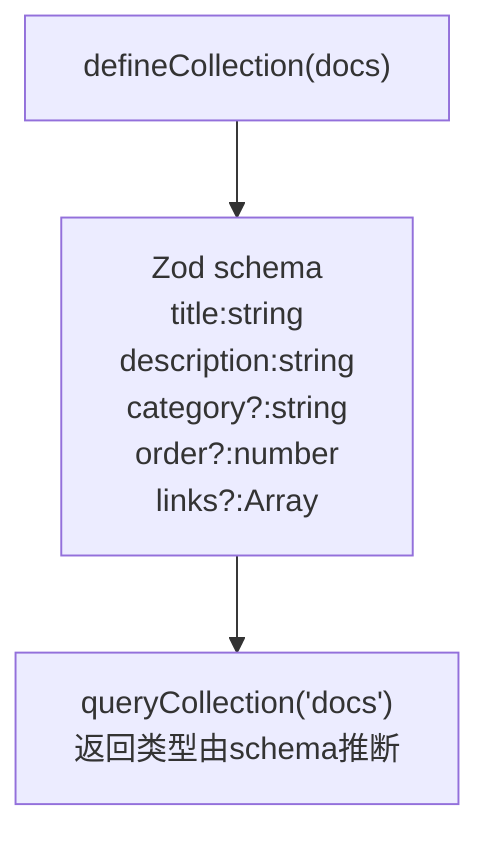
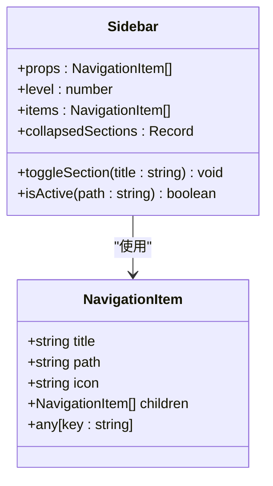
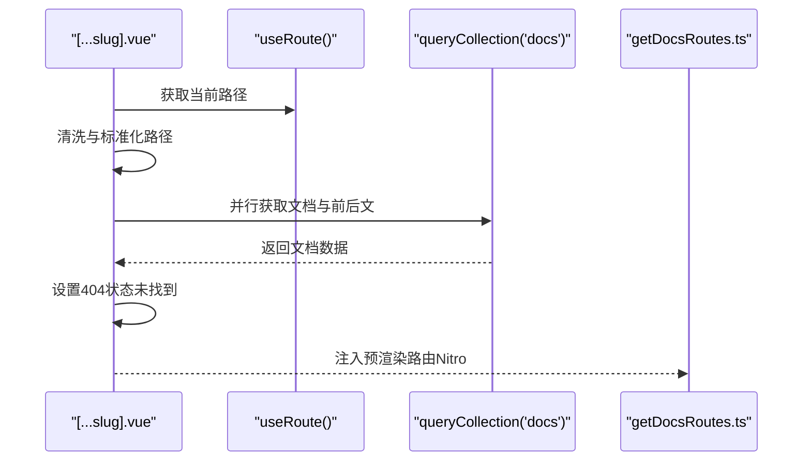
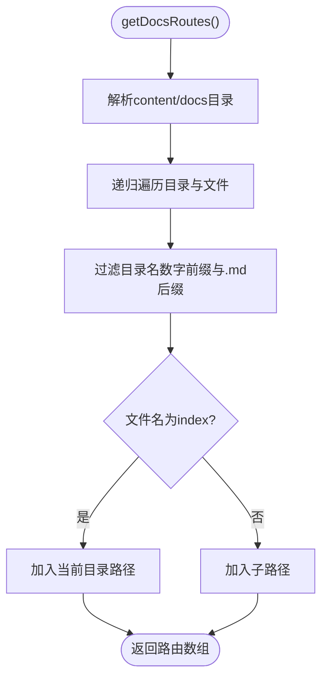
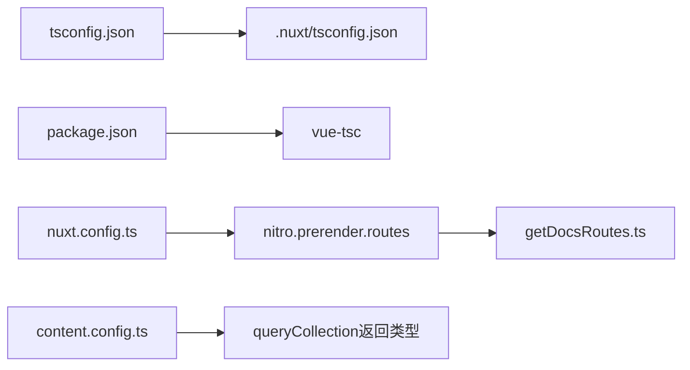

# TypeScript集成与类型系统

<cite>
**本文引用的文件**
- [tsconfig.json](file://tsconfig.json)
- [package.json](file://package.json)
- [env.d.ts](file://env.d.ts)
- [nuxt.config.ts](file://nuxt.config.ts)
- [content.config.ts](file://content.config.ts)
- [components/docs/Sidebar.vue](file://components/docs/Sidebar.vue)
- [pages/docs/[...slug].vue](file://pages/docs/[...slug].vue)
- [utils/getDocsRoutes.ts](file://utils/getDocsRoutes.ts)
</cite>

## 目录
1. [引言](#引言)
2. [项目结构](#项目结构)
3. [核心组件](#核心组件)
4. [架构总览](#架构总览)
5. [详细组件分析](#详细组件分析)
6. [依赖关系分析](#依赖关系分析)
7. [性能考量](#性能考量)
8. [故障排查指南](#故障排查指南)
9. [结论](#结论)
10. [附录](#附录)

## 引言
本指南围绕buidai项目在Nuxt 4中的TypeScript集成与类型系统展开，重点解析以下主题：
- tsconfig.json的配置要点与moduleResolution: 'Bundler'对现代前端构建的影响
- 通过extends './.nuxt/tsconfig.json'实现框架自动生成类型声明的继承机制
- package.json中typescript与vue-tsc的依赖如何支撑类型检查流程（nuxt typecheck）
- env.d.ts中全局类型扩展如何增强import.meta.env的类型安全
- 以Sidebar.vue为例，展示defineProps、defineEmits的类型推断实践，泛型在文档路由数据处理中的应用
- 常见类型错误（如Property 'xxx' does not exist on type 'Ref<...>'）的解决方案
- 类型守卫、断言函数与复杂接口设计的最佳实践

## 项目结构
buidai采用Nuxt 4生态，TypeScript配置集中于根目录tsconfig.json，配合Nuxt的类型生成与内容模块schema，形成“框架生成类型 + 手写类型”的双轨类型体系。关键文件与职责如下：
- tsconfig.json：统一入口，继承Nuxt生成的tsconfig，启用Bundler模块解析，注入类型声明
- package.json：定义脚本与依赖，包括typescript、vue-tsc与nuxt
- nuxt.config.ts：控制Nuxt的typescript.typeCheck开关与Nitro预渲染
- content.config.ts：定义内容集合schema，驱动内容数据的类型推断
- env.d.ts：全局类型声明，增强Vite与Storybook类型感知
- components/docs/Sidebar.vue：展示defineProps、defineEmits类型推断与复杂逻辑
- pages/docs/[...slug].vue：展示内容查询、并行数据获取与类型安全实践
- utils/getDocsRoutes.ts：动态生成文档路由，体现类型在工具层的应用

**图表来源**
- [tsconfig.json](file://tsconfig.json#L1-L16)
- [nuxt.config.ts](file://nuxt.config.ts#L1-L30)
- [content.config.ts](file://content.config.ts#L1-L57)
- [utils/getDocsRoutes.ts](file://utils/getDocsRoutes.ts#L1-L58)
- [components/docs/Sidebar.vue](file://components/docs/Sidebar.vue#L108-L294)
- [pages/docs/[...slug].vue](file://pages/docs/[...slug].vue#L167-L285)

**章节来源**
- [tsconfig.json](file://tsconfig.json#L1-L16)
- [package.json](file://package.json#L1-L48)
- [nuxt.config.ts](file://nuxt.config.ts#L1-L30)

## 核心组件
本节聚焦TypeScript与Nuxt 4集成的关键构件及其作用：
- tsconfig.json
  - 通过extends继承Nuxt生成的tsconfig，确保框架自动生成的类型声明生效
  - include中显式包含env.d.ts与.nuxt/nuxt.d.ts，保证全局类型与Nuxt类型可用
  - compilerOptions.moduleResolution设为Bundler，适配现代打包器的ESM解析策略
  - types中声明node与vitest/globals，为Node API与测试环境提供类型支持
- package.json
  - scripts中提供nuxt typecheck，用于独立运行类型检查
  - devDependencies包含typescript与vue-tsc，保障类型检查与模板类型推断
- nuxt.config.ts
  - typescript.typeCheck设为false，构建阶段跳过类型检查以提升速度
  - 通过Nitro prerender注入动态路由，配合内容模块生成静态页面
- content.config.ts
  - 使用Zod schema定义内容集合字段，queryCollection返回类型由schema推断
- env.d.ts
  - 通过reference types引入vite/client与@storybook/vue3，增强import.meta.env与Storybook类型感知

**章节来源**
- [tsconfig.json](file://tsconfig.json#L1-L16)
- [package.json](file://package.json#L1-L48)
- [nuxt.config.ts](file://nuxt.config.ts#L1-L30)
- [content.config.ts](file://content.config.ts#L1-L57)
- [env.d.ts](file://env.d.ts#L1-L3)

## 架构总览
下图展示了TypeScript类型系统在buidai中的整体架构：tsconfig.json作为入口，继承Nuxt生成的类型配置；package.json提供类型检查工具链；nuxt.config.ts控制构建与预渲染；content.config.ts驱动内容数据类型推断；env.d.ts提供全局类型；组件与页面通过defineProps/defineEmits与queryCollection等API获得类型安全保障。

**图表来源**
- [tsconfig.json](file://tsconfig.json#L1-L16)
- [env.d.ts](file://env.d.ts#L1-L3)
- [package.json](file://package.json#L1-L48)
- [nuxt.config.ts](file://nuxt.config.ts#L1-L30)
- [content.config.ts](file://content.config.ts#L1-L57)
- [components/docs/Sidebar.vue](file://components/docs/Sidebar.vue#L108-L294)
- [pages/docs/[...slug].vue](file://pages/docs/[...slug].vue#L167-L285)
- [utils/getDocsRoutes.ts](file://utils/getDocsRoutes.ts#L1-L58)

## 详细组件分析

### tsconfig.json：继承与模块解析
- 继承机制
  - extends './.nuxt/tsconfig.json'使项目能够继承Nuxt生成的类型声明，包括内容模块、路由与Nitro相关类型，从而在编辑器与类型检查中获得完整类型支持
- include范围
  - 显式包含env.d.ts与.nuxt/nuxt.d.ts，确保全局类型与Nuxt生成类型在IDE中可用
- moduleResolution: 'Bundler'
  - 适配现代打包器（如Vite、Nitro）的ESM解析策略，避免传统Node解析导致的模块路径与类型问题
- types: ['node','vitest/globals']
  - 为Node API与测试环境提供类型支持，减少缺失类型带来的编译警告

**图表来源**
- [tsconfig.json](file://tsconfig.json#L1-L16)

**章节来源**
- [tsconfig.json](file://tsconfig.json#L1-L16)

### package.json：类型检查流程与依赖
- 脚本
  - typecheck: nuxt typecheck，用于在开发阶段或CI中单独运行类型检查，避免与构建阶段耦合
- 依赖
  - typescript：提供TypeScript编译能力
  - vue-tsc：提供Vue SFC的类型检查与声明生成
  - nuxt：提供Nuxt 4的类型与配置能力

**图表来源**
- [package.json](file://package.json#L1-L48)

**章节来源**
- [package.json](file://package.json#L1-L48)

### nuxt.config.ts：类型检查策略与预渲染
- typescript.typeCheck: false
  - 在构建阶段禁用类型检查，以提升构建速度；通过独立脚本nuxt typecheck进行类型检查，平衡开发体验与构建效率
- Nitro prerender.routes
  - 通过utils/getDocsRoutes.ts动态生成文档路由，确保所有文档页面被静态预渲染，提升首屏性能与SEO

**图表来源**
- [nuxt.config.ts](file://nuxt.config.ts#L1-L30)
- [utils/getDocsRoutes.ts](file://utils/getDocsRoutes.ts#L1-L58)

**章节来源**
- [nuxt.config.ts](file://nuxt.config.ts#L1-L30)
- [utils/getDocsRoutes.ts](file://utils/getDocsRoutes.ts#L1-L58)

### content.config.ts：内容schema驱动类型推断
- defineCollection与Zod schema
  - 通过z.object定义文档集合字段，queryCollection返回类型由schema推断，减少手写类型声明的工作量
- 字段约束
  - 对title、description、category、order、links等字段进行类型约束，确保内容数据的一致性与可预测性

**图表来源**
- [content.config.ts](file://content.config.ts#L1-L57)

**章节来源**
- [content.config.ts](file://content.config.ts#L1-L57)

### env.d.ts：全局类型扩展
- 通过reference types引入vite/client与@storybook/vue3，增强import.meta.env与Storybook类型感知
- 有助于在开发环境中获得更准确的类型提示与错误检测

**章节来源**
- [env.d.ts](file://env.d.ts#L1-L3)

### components/docs/Sidebar.vue：defineProps/defineEmits与类型推断
- defineProps与PropType
  - 使用defineProps接收navigation与level参数，通过PropType<NavigationItem[]>明确数组元素类型，提升类型安全性
- NavigationItem接口
  - 定义title、path、icon、children等字段，支持可选字段与额外键值，满足内容导航的灵活性
- items计算属性
  - 使用computed<NavigationItem[]>进行类型标注，确保返回值符合预期结构
- 状态与事件
  - 使用useState与watch维护折叠状态，通过toggleSection方法切换分组展开状态
- 类型安全实践
  - 在导航生成过程中，对navigation字段进行条件访问与类型判断，避免潜在的类型错误

**图表来源**
- [components/docs/Sidebar.vue](file://components/docs/Sidebar.vue#L108-L294)

**章节来源**
- [components/docs/Sidebar.vue](file://components/docs/Sidebar.vue#L108-L294)

### pages/docs/[...slug].vue：并行数据获取与类型安全
- 并行数据获取
  - 使用Promise.all并行获取当前文档与前后文，提升页面加载性能
- queryCollection与类型推断
  - 通过queryCollection('docs')获取文档数据，利用content.config.ts的schema推断返回类型
- 路径清洗与匹配
  - 对URL路径进行解码与清洗，处理带数字前缀的文件系统命名与URL之间的差异
- 错误处理与404
  - 当未找到文档时设置404状态，提供友好的错误边界展示

**图表来源**
- [pages/docs/[...slug].vue](file://pages/docs/[...slug].vue#L167-L285)
- [utils/getDocsRoutes.ts](file://utils/getDocsRoutes.ts#L1-L58)
- [nuxt.config.ts](file://nuxt.config.ts#L40-L51)

**章节来源**
- [pages/docs/[...slug].vue](file://pages/docs/[...slug].vue#L167-L285)
- [utils/getDocsRoutes.ts](file://utils/getDocsRoutes.ts#L1-L58)
- [nuxt.config.ts](file://nuxt.config.ts#L40-L51)

### 泛型在文档路由数据处理中的应用
- getDocsRoutes.ts
  - 通过递归遍历content/docs目录，返回字符串数组形式的路由列表
  - 泛型在工具函数中体现为函数签名与返回值类型标注，确保调用方获得正确的类型信息

**图表来源**
- [utils/getDocsRoutes.ts](file://utils/getDocsRoutes.ts#L1-L58)

**章节来源**
- [utils/getDocsRoutes.ts](file://utils/getDocsRoutes.ts#L1-L58)

### 常见类型错误与解决方案
- Property 'xxx' does not exist on type 'Ref<...>'
  - 症状：在模板或逻辑中直接访问Ref包装的值，而未解包
  - 解决方案：
    - 在模板中直接使用响应式引用，TypeScript会自动解包
    - 在组合式函数中，使用.value访问Ref值，或通过解构赋值简化访问
    - 对于复杂类型，先进行类型守卫或断言，再进行访问
- 未定义的prop或事件
  - 症状：未在defineProps中声明的属性在组件中使用时报错
  - 解决方案：使用defineProps明确声明属性类型，并在组件外部正确传递
- 内容查询返回类型不匹配
  - 症状：queryCollection返回类型与期望不符
  - 解决方案：通过content.config.ts的Zod schema定义字段，确保返回类型与schema一致；必要时使用类型断言或类型守卫

**章节来源**
- [components/docs/Sidebar.vue](file://components/docs/Sidebar.vue#L108-L294)
- [pages/docs/[...slug].vue](file://pages/docs/[...slug].vue#L167-L285)
- [content.config.ts](file://content.config.ts#L1-L57)

### 类型守卫、断言函数与复杂接口设计最佳实践
- 类型守卫
  - 在访问可能为空或不确定类型的值之前，使用类型守卫（如typeof、Array.isArray、in操作符）缩小类型范围
- 断言函数
  - 在确定类型安全的前提下，使用断言函数（如as、!）简化代码，但需谨慎使用，避免掩盖潜在问题
- 复杂接口设计
  - 使用Partial、Pick、Omit等工具类型组合复杂接口
  - 对可选字段使用?修饰符，避免过度严格的类型约束
  - 对枚举或联合类型使用字面量类型，提升类型表达力

[本节为通用实践建议，不直接分析具体文件，故无章节来源]

## 依赖关系分析
- tsconfig.json依赖Nuxt生成的类型配置，确保框架自动生成的类型声明生效
- package.json提供类型检查工具链，nuxt typecheck与vue-tsc协同工作
- nuxt.config.ts控制构建与预渲染，Nitro prerender依赖utils/getDocsRoutes.ts生成的路由
- content.config.ts通过Zod schema驱动queryCollection返回类型，减少手写类型声明

**图表来源**
- [tsconfig.json](file://tsconfig.json#L1-L16)
- [package.json](file://package.json#L1-L48)
- [nuxt.config.ts](file://nuxt.config.ts#L40-L51)
- [utils/getDocsRoutes.ts](file://utils/getDocsRoutes.ts#L1-L58)
- [content.config.ts](file://content.config.ts#L1-L57)

**章节来源**
- [tsconfig.json](file://tsconfig.json#L1-L16)
- [package.json](file://package.json#L1-L48)
- [nuxt.config.ts](file://nuxt.config.ts#L40-L51)
- [utils/getDocsRoutes.ts](file://utils/getDocsRoutes.ts#L1-L58)
- [content.config.ts](file://content.config.ts#L1-L57)

## 性能考量
- 构建阶段禁用类型检查（typescript.typeCheck=false）可显著提升构建速度，适合大型项目
- 通过nuxt typecheck在开发与CI中单独运行类型检查，避免与构建耦合
- 并行数据获取（Promise.all）提升页面加载性能，减少首屏等待时间
- Nitro预渲染routes由动态生成的文档路由组成，确保静态页面覆盖全面

[本节提供一般性指导，不直接分析具体文件，故无章节来源]

## 故障排查指南
- 类型检查失败
  - 使用nuxt typecheck单独运行类型检查，定位具体错误并逐项修复
  - 检查tsconfig.json的include与extends配置，确保env.d.ts与.nuxt/nuxt.d.ts被纳入
- import.meta.env类型不完整
  - 确认env.d.ts中已引入vite/client与@storybook/vue3类型
- defineProps/defineEmits类型错误
  - 使用defineProps明确声明属性类型，避免隐式any
  - 对可选字段使用?修饰符，确保模板与逻辑访问安全
- queryCollection返回类型不匹配
  - 检查content.config.ts的schema定义，确保字段类型与使用场景一致
  - 必要时使用类型守卫或断言，但需确保类型安全

**章节来源**
- [package.json](file://package.json#L1-L48)
- [tsconfig.json](file://tsconfig.json#L1-L16)
- [env.d.ts](file://env.d.ts#L1-L3)
- [components/docs/Sidebar.vue](file://components/docs/Sidebar.vue#L108-L294)
- [pages/docs/[...slug].vue](file://pages/docs/[...slug].vue#L167-L285)
- [content.config.ts](file://content.config.ts#L1-L57)

## 结论
buidai项目在Nuxt 4中实现了完善的TypeScript集成：通过tsconfig.json继承Nuxt生成的类型配置，借助content.config.ts的Zod schema驱动queryCollection类型推断，结合package.json的类型检查工具链与nuxt.config.ts的构建策略，形成了高效、可维护的类型系统。Sidebar.vue与[...slug].vue展示了defineProps/defineEmits、并行数据获取与类型安全的最佳实践。遵循本文提供的类型守卫、断言与复杂接口设计建议，可进一步提升代码质量与开发体验。

[本节为总结性内容，不直接分析具体文件，故无章节来源]

## 附录
- 关键配置与文件路径参考
  - tsconfig.json：根目录类型配置入口
  - package.json：脚本与依赖
  - nuxt.config.ts：构建与预渲染配置
  - content.config.ts：内容schema定义
  - env.d.ts：全局类型声明
  - components/docs/Sidebar.vue：组件类型推断示例
  - pages/docs/[...slug].vue：并行数据获取与类型安全
  - utils/getDocsRoutes.ts：动态路由生成

[本节为参考性内容，不直接分析具体文件，故无章节来源]